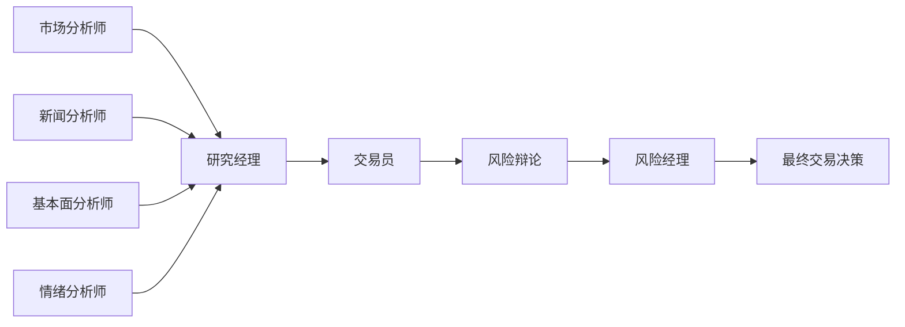
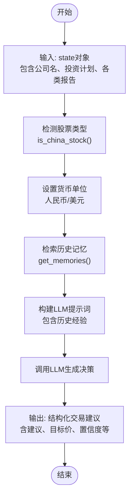
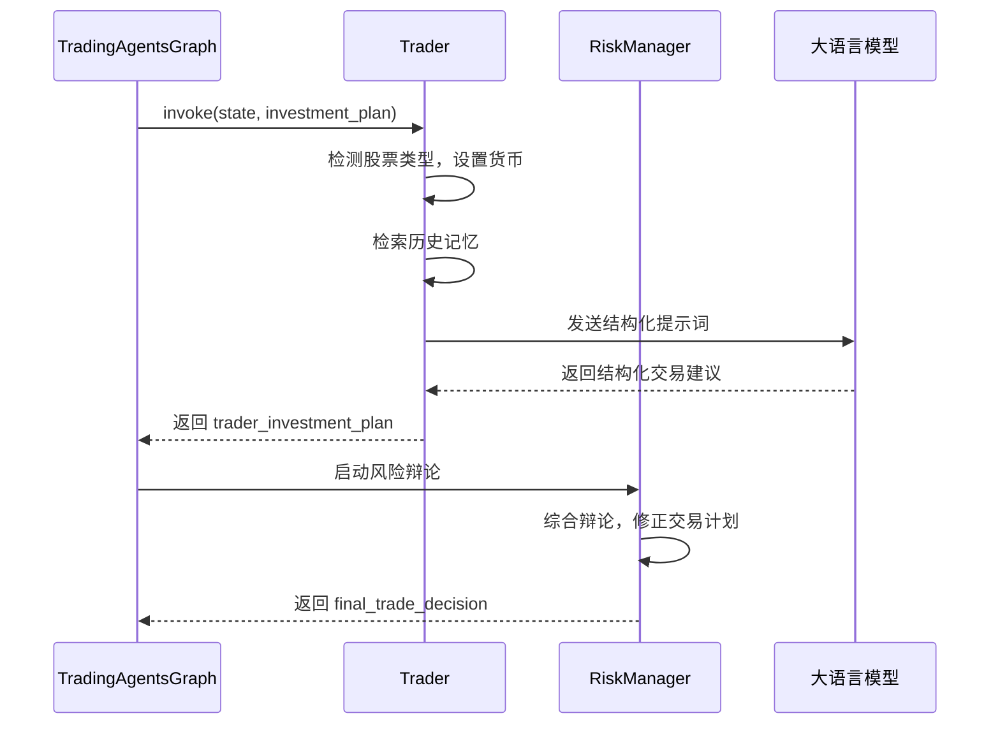
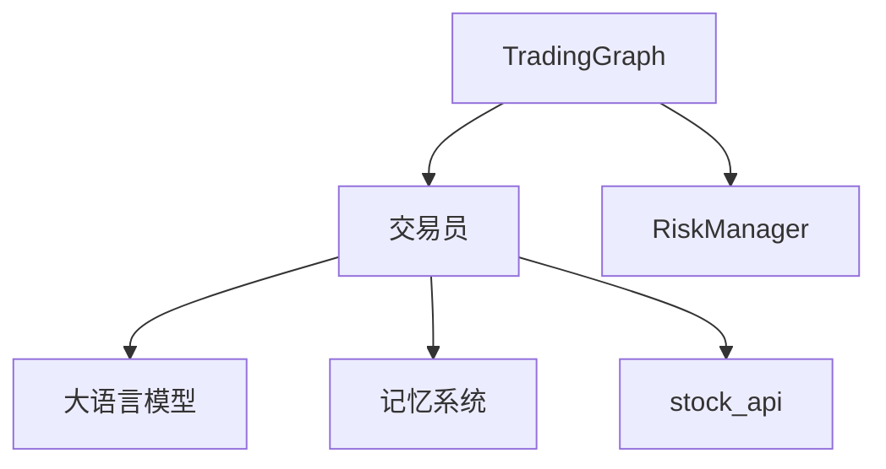

# 交易团队

<cite>
**本文档引用的文件**  
- [trader.py](file://tradingagents/agents/trader/trader.py)
- [stock_api.py](file://tradingagents/api/stock_api.py)
- [trading_graph.py](file://tradingagents/graph/trading_graph.py)
- [risk_manager.py](file://tradingagents/agents/managers/risk_manager.py)
</cite>

## 目录
1. [简介](#简介)
2. [项目结构](#项目结构)
3. [核心组件](#核心组件)
4. [架构概览](#架构概览)
5. [详细组件分析](#详细组件分析)
6. [依赖分析](#依赖分析)
7. [性能考量](#性能考量)
8. [故障排除指南](#故障排除指南)
9. [结论](#结论)

## 简介
本文档详细阐述了交易团队中“交易员”智能体的设计与实现机制。该智能体作为决策链的关键执行者，负责接收来自研究团队的多维度分析报告（包括市场趋势、基本面、新闻与情绪分析），结合实时市场数据，生成可执行的交易策略。文档将深入解析其内部逻辑，包括头寸规模计算、入场/出场点判断、止损止盈设置等核心功能，并说明其如何通过`stock_api`进行模拟或实盘交易操作。同时，文档还将描述交易员与风险经理等其他智能体的交互协议，以及在异常市场条件下的应对策略，最后通过一个完整的示例流程，展示交易信号的生成、在`TradingGraph`中的触发条件和执行时机。

## 项目结构
交易团队的核心功能分布在`tradingagents`包下的多个子模块中。`agents/trader/`目录包含交易员智能体的核心逻辑；`api/`和`dataflows/`目录提供了与股票市场数据交互的API接口；`graph/`目录则定义了智能体协同工作的图结构和工作流引擎。

```mermaid
graph TD
subgraph "交易智能体"
Trader[trader.py]
RiskManager[risk_manager.py]
end
subgraph "数据接口"
API[api/stock_api.py]
Dataflows[dataflows/stock_api.py]
end
subgraph "图工作流"
Graph[trading_graph.py]
end
Trader --> API : 调用
Trader --> Dataflows : 调用
Graph --> Trader : 调度
Graph --> RiskManager : 调度
RiskManager --> Trader : 输入决策
```

**图来源**  
- [trader.py](file://tradingagents/agents/trader/trader.py)
- [risk_manager.py](file://tradingagents/agents/managers/risk_manager.py)
- [stock_api.py](file://tradingagents/api/stock_api.py)
- [trading_graph.py](file://tradingagents/graph/trading_graph.py)

**节来源**  
- [trader.py](file://tradingagents/agents/trader/trader.py#L1-L103)
- [stock_api.py](file://tradingagents/api/stock_api.py#L1-L295)
- [trading_graph.py](file://tradingagents/graph/trading_graph.py#L1-L327)

## 核心组件
交易团队的核心组件是`trader`智能体，它被设计为一个状态机节点（state machine node），接收来自上游分析智能体的综合报告，并生成最终的交易建议。其核心功能包括：解析输入的多维度分析报告、根据股票类型（A股/美股）自动识别货币单位、利用记忆系统（memory）避免历史错误、以及通过大语言模型（LLM）生成结构化的交易决策。

**节来源**  
- [trader.py](file://tradingagents/agents/trader/trader.py#L1-L103)

## 架构概览
整个交易决策流程由`TradingAgentsGraph`类驱动。该图结构首先调度市场、新闻、基本面等分析师智能体收集信息，然后由研究经理整合生成`investment_plan`。此计划连同所有原始报告一起，被传递给`trader`节点。交易员生成初步建议后，该建议会进入一个由激进、保守、中立三名风险分析师组成的辩论流程。最后，`risk_manager`作为裁判，综合辩论结果和历史经验，对交易员的原始计划进行修正，形成最终的`final_trade_decision`。



**图来源**  
- [trading_graph.py](file://tradingagents/graph/trading_graph.py#L1-L327)
- [risk_manager.py](file://tradingagents/agents/managers/risk_manager.py#L1-L72)

## 详细组件分析
### 交易员智能体分析
`trader`智能体是整个交易流程的核心执行者。它通过`create_trader`函数工厂创建，接收LLM和memory作为依赖，返回一个符合图节点规范的函数。

#### 内部逻辑与决策流程
交易员节点的输入是一个包含公司名称、投资计划和各类分析报告的`state`对象。其内部逻辑首先通过正则表达式判断股票是否为中国A股（6位数字代码），并据此自动设置货币单位（人民币/美元）和符号（¥/$）。这一设计确保了全球市场的兼容性。

随后，交易员会从`memory`中检索与当前市场状况相似的历史决策，以避免重复过去的错误。这些历史经验被整合进系统提示词（system prompt），作为LLM决策的参考。

**节来源**  
- [trader.py](file://tradingagents/agents/trader/trader.py#L1-L103)

#### 交易策略生成
交易员的核心输出是结构化的交易建议。系统提示词强制要求LLM提供以下关键信息：
1.  **投资建议**：明确的“买入/持有/卖出”决策。
2.  **目标价位**：基于基本面估值（P/E, P/B, DCF）、技术分析支撑/阻力位、行业平均和市场情绪计算出的具体目标价格。
3.  **置信度与风险评分**：量化决策的信心和风险等级。
4.  **详细推理**：支持决策的具体理由。

提示词中特别强调，目标价位**必须**提供具体数值，绝不允许返回“无法确定”或“需要更多信息”，这保证了输出的可执行性。



**图来源**  
- [trader.py](file://tradingagents/agents/trader/trader.py#L1-L103)

### 与其他智能体的交互
交易员并非孤立工作，它与风险经理等智能体通过`TradingGraph`紧密协作。

#### 与风险经理的交互协议
交易员生成的`trader_investment_plan`是风险辩论的起点。`risk_manager`节点会接收此计划，并将其作为辩论的初始输入。风险经理的提示词明确要求其“从交易员的原始计划**{trader_plan}**开始，根据分析师的见解进行调整”。这表明，风险经理的角色不是推翻交易员的决策，而是对其进行精细化的风险评估和修正，最终形成`final_trade_decision`。

**节来源**  
- [risk_manager.py](file://tradingagents/agents/managers/risk_manager.py#L1-L72)

#### 在TradingGraph中的触发与执行
交易员节点的执行由`TradingAgentsGraph.propagate()`方法触发。该方法接收`company_name`和`trade_date`作为参数，初始化状态后，通过`graph.invoke()`或`graph.stream()`启动整个工作流。交易员节点的执行时机是在所有上游分析师完成工作，并由研究经理生成`investment_plan`之后。其输出（`trader_investment_plan`）会立即作为输入传递给风险辩论流程。



**图来源**  
- [trading_graph.py](file://tradingagents/graph/trading_graph.py#L1-L327)
- [trader.py](file://tradingagents/agents/trader/trader.py#L1-L103)
- [risk_manager.py](file://tradingagents/agents/managers/risk_manager.py#L1-L72)

### 交易信号生成完整示例流程
1.  **触发**：用户调用`TradingAgentsGraph.propagate("000001", "2025-07-03")`。
2.  **信息收集**：图引擎调度各分析师，生成关于“平安银行”的市场、新闻、基本面和情绪报告。
3.  **计划生成**：研究经理整合报告，生成`investment_plan`。
4.  **交易决策**：`trader`节点被调用，输入包含`investment_plan`的`state`。它识别“000001”为A股，使用人民币（¥）作为单位，检索历史记忆，然后调用LLM生成初步交易建议。
5.  **风险评估**：`risk_manager`节点启动，组织风险分析师辩论，并基于辩论结果修正交易员的初步建议。
6.  **信号输出**：`process_signal()`方法被调用，从`final_trade_decision`中提取核心交易信号（如“买入，目标价¥15.50”）。

**节来源**  
- [trading_graph.py](file://tradingagents/graph/trading_graph.py#L1-L327)

## 依赖分析
交易员智能体的主要依赖包括：
-   **LLM**：用于生成自然语言决策。
-   **Memory**：用于存储和检索历史交易决策，实现经验学习。
-   **TradingGraph**：提供工作流调度和状态管理。
-   **stock_api**：虽然在当前`trader.py`中未直接调用，但其生成的决策依赖于`stock_api`提供的底层数据。



**图来源**  
- [trader.py](file://tradingagents/agents/trader/trader.py#L1-L103)
- [trading_graph.py](file://tradingagents/graph/trading_graph.py#L1-L327)

## 性能考量
交易员智能体的性能主要受LLM调用延迟的影响。由于其决策依赖于一次LLM调用，因此响应时间与所选LLM模型的性能直接相关。此外，`memory.get_memories()`的检索效率也会影响整体性能，尤其是在记忆库庞大的情况下。系统通过使用`quick_thinking_llm`来处理此类决策节点，以优化响应速度。

## 故障排除指南
-   **问题**：交易员返回的建议中货币单位错误。
    -   **原因**：`is_china_stock()`函数的正则表达式未能正确匹配股票代码。
    -   **检查**：确认股票代码格式是否符合预期（A股为6位数字）。
-   **问题**：LLM返回“无法确定目标价”。
    -   **原因**：违反了系统提示词中的强制要求。
    -   **检查**：验证LLM是否遵循了提示词中的“**必须提供具体的目标价位**”指令。
-   **问题**：风险经理的决策未体现对交易员计划的修正。
    -   **原因**：`risk_manager`的提示词未正确引用`trader_plan`变量。
    -   **检查**：确认`risk_manager.py`中`prompt`字符串是否正确包含了`{trader_plan}`。

**节来源**  
- [trader.py](file://tradingagents/agents/trader/trader.py#L1-L103)
- [risk_manager.py](file://tradingagents/agents/managers/risk_manager.py#L1-L72)

## 结论
交易员智能体是连接分析与执行的关键桥梁。它通过精心设计的系统提示词，将多源分析报告转化为结构化、可执行的交易指令，并通过与风险经理的协同工作，确保决策的稳健性。其与`TradingGraph`的深度集成，实现了自动化、智能化的交易流程。未来可进一步增强其与`stock_api`的直接交互能力，实现从决策到下单的闭环。