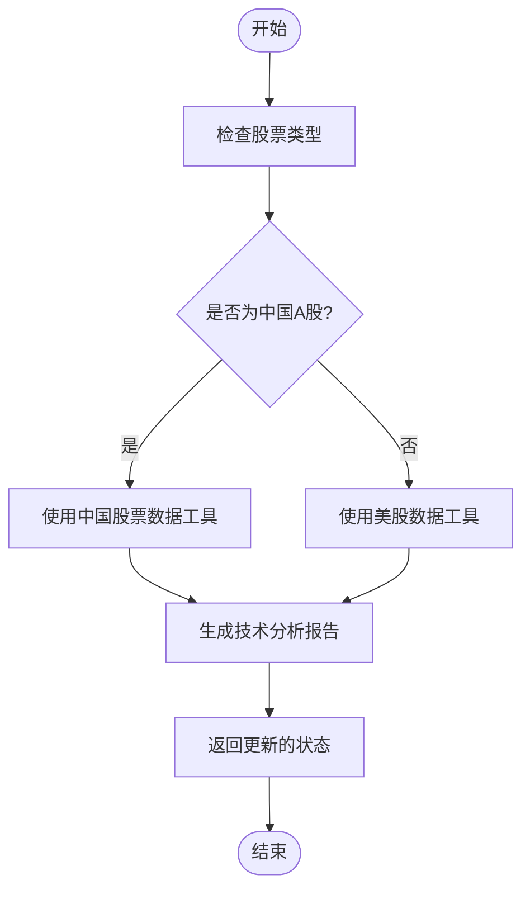
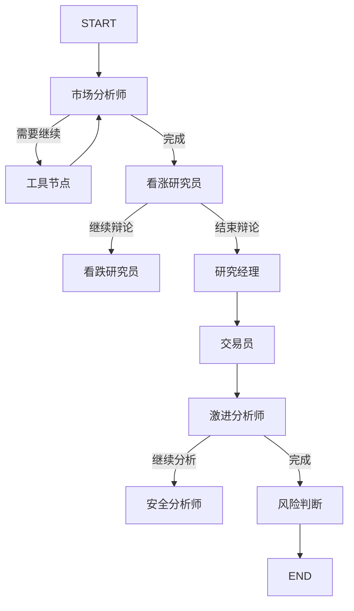

# 创建新的智能体

<cite>
**本文档引用的文件**
- [agent_states.py](file://tradingagents/agents/utils/agent_states.py)
- [market_analyst.py](file://tradingagents/agents/analysts/market_analyst.py)
- [bull_researcher.py](file://tradingagents/agents/researchers/bull_researcher.py)
- [trading_graph.py](file://tradingagents/graph/trading_graph.py)
- [custom_analysis_demo.py](file://examples/custom_analysis_demo.py)
</cite>

## 目录
1. [简介](#简介)
2. [智能体状态模型设计](#智能体状态模型设计)
3. [智能体核心分析逻辑实现](#智能体核心分析逻辑实现)
4. [注册智能体节点](#注册智能体节点)
5. [配置与触发新智能体](#配置与触发新智能体)
6. [高级主题](#高级主题)
7. [结论](#结论)

## 简介
本教程详细说明如何在TradingAgents-CN框架中创建自定义智能体。通过分析现有智能体的实现方式，指导开发者从状态模型定义开始，逐步构建完整的智能体功能，并将其集成到工作流系统中。

## 智能体状态模型设计
智能体的状态模型定义在`agent_states.py`文件中，使用TypedDict来声明智能体的状态结构。核心状态类`AgentState`继承自`MessagesState`，并扩展了特定于交易分析的字段。

状态模型包含多个层次：
- **基础信息**：公司兴趣点（company_of_interest）和交易日期（trade_date）
- **分析报告**：市场报告（market_report）、情绪报告（sentiment_report）、新闻报告（news_report）和基本面报告（fundamentals_report）
- **投资辩论状态**：包含看涨和看跌分析师的历史对话、当前响应和辩论计数
- **风险管理状态**：包含激进、安全和中立分析师的对话历史及最终决策

这种分层设计使得智能体能够维护复杂的对话状态，支持多轮辩论和决策过程。

**Section sources**
- [agent_states.py](file://tradingagents/agents/utils/agent_states.py#L1-L76)

## 智能体核心分析逻辑实现
以`market_analyst.py`和`bull_researcher.py`为例，智能体的核心分析逻辑通过创建节点函数来实现。这些函数遵循统一的设计模式：接收状态作为输入，执行分析逻辑，并返回更新后的状态。

### 市场分析师实现
`create_market_analyst`函数创建了一个市场分析师节点，其主要功能包括：
- 根据股票代码格式自动识别中国A股或海外股票
- 选择合适的数据源工具（中国股票使用`get_china_stock_data`，海外股票使用Yahoo Finance）
- 生成针对特定市场的优化提示词
- 执行工具调用并生成详细的技术分析报告

该智能体能够处理工具调用的复杂性，包括错误处理和备用方案，确保在主要数据源失败时仍能提供分析结果。

### 看涨研究员实现
`create_bull_researcher`函数创建了一个看涨研究员节点，其特点包括：
- 整合多个分析报告（市场、情绪、新闻、基本面）
- 支持记忆功能，能够检索类似情况的历史记忆
- 生成具有说服力的看涨论点，反驳看跌观点
- 维护辩论状态，包括历史对话和当前响应

该智能体通过构建基于证据的论证，强调增长潜力、竞争优势和积极市场指标，为投资决策提供支持。

**Diagram sources**
- [market_analyst.py](file://tradingagents/agents/analysts/market_analyst.py#L189-L409)

**Section sources**
- [market_analyst.py](file://tradingagents/agents/analysts/market_analyst.py#L1-L410)
- [bull_researcher.py](file://tradingagents/agents/researchers/bull_researcher.py#L5-L91)

## 注册智能体节点
新智能体需要在`trading_graph.py`中注册，以便参与工作流编排。`TradingAgentsGraph`类负责管理整个智能体网络的创建和执行。

注册过程包括以下步骤：
1. 在`GraphSetup`类的`setup_graph`方法中创建智能体节点
2. 将节点添加到工作流图中
3. 定义节点之间的连接关系

智能体节点通过条件边连接，根据`conditional_logic`模块中的判断函数决定执行路径。例如，市场分析师节点完成后，根据是否需要继续分析的判断，决定是调用工具还是清除消息并进入下一个分析阶段。

**Diagram sources**
- [trading_graph.py](file://tradingagents/graph/trading_graph.py#L14-L248)

**Section sources**
- [trading_graph.py](file://tradingagents/graph/trading_graph.py#L1-L326)

## 配置与触发新智能体
`custom_analysis_demo.py`文件提供了配置和触发新智能体的示例。该示例展示了如何使用不同的分析重点（全面、技术、基本面、风险、比较）来定制分析过程。

配置新智能体的关键要素包括：
- **分析重点**：通过不同的提示词模板引导智能体关注特定方面
- **LLM选择**：支持多种LLM提供商（如阿里百炼、DeepSeek）
- **参数调整**：温度、最大token数等参数的优化
- **交互式界面**：提供用户友好的交互方式

触发新智能体的流程：
1. 初始化LLM实例
2. 构建包含系统消息和用户消息的消息序列
3. 调用LLM生成分析结果
4. 处理和展示结果

该示例还包含了批量分析功能，展示了如何高效地对多个股票进行分析。

**Section sources**
- [custom_analysis_demo.py](file://examples/custom_analysis_demo.py#L1-L272)

## 高级主题
### 智能体生命周期管理
智能体的生命周期由`TradingAgentsGraph`类管理，包括初始化、执行和清理阶段。每个智能体节点在执行时都会记录调试信息，便于追踪执行过程。

### 错误恢复机制
系统实现了多层次的错误恢复机制：
- 工具调用失败时的备用方案
- 数据源不可用时的降级处理
- 内存检索失败时的安全检查

### 性能监控
通过日志记录和状态跟踪，系统能够监控智能体的性能表现。`log_states_dict`存储了每次分析的完整状态，便于后续分析和优化。

### 记忆与反思
智能体支持记忆功能，能够从过去的经验中学习。`FinancialSituationMemory`类实现了记忆存储和检索，`Reflector`类负责在分析后进行反思，更新记忆内容。

## 结论
创建新的智能体需要理解TradingAgents-CN框架的整体架构和设计模式。通过遵循状态模型定义、核心逻辑实现、节点注册和配置触发的步骤，开发者可以创建功能完整且与现有系统协同工作的自定义智能体。高级主题如生命周期管理、错误恢复和性能监控确保了智能体的可靠性和可维护性。