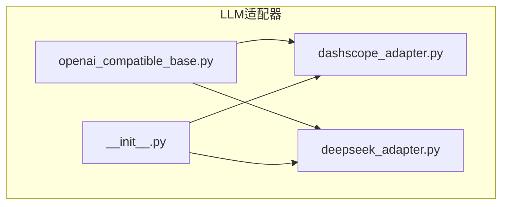
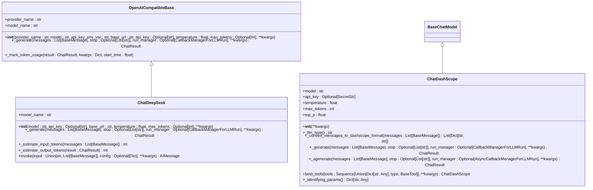
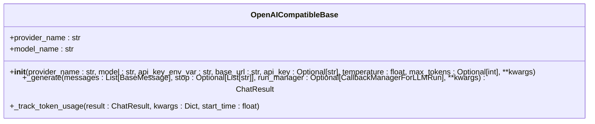
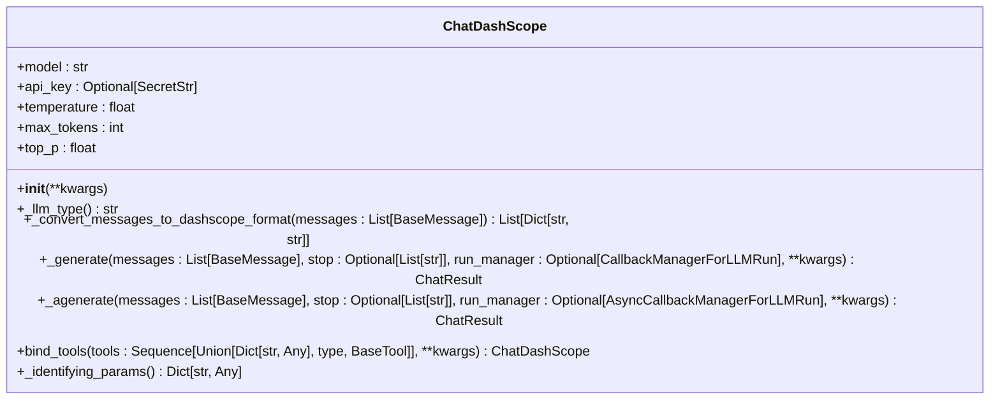
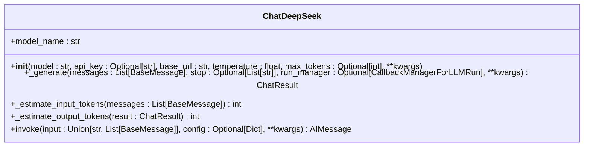
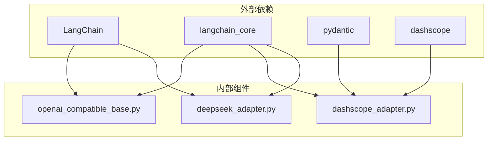

# 添加新的LLM适配器

<cite>
**本文档中引用的文件**   
- [openai_compatible_base.py](file://tradingagents/llm_adapters/openai_compatible_base.py)
- [dashscope_adapter.py](file://tradingagents/llm_adapters/dashscope_adapter.py)
- [deepseek_adapter.py](file://tradingagents/llm_adapters/deepseek_adapter.py)
- [__init__.py](file://tradingagents/llm_adapters/__init__.py)
</cite>

## 目录
1. [简介](#简介)
2. [项目结构](#项目结构)
3. [核心组件](#核心组件)
4. [架构概述](#架构概述)
5. [详细组件分析](#详细组件分析)
6. [依赖分析](#依赖分析)
7. [性能考虑](#性能考虑)
8. [故障排除指南](#故障排除指南)
9. [结论](#结论)

## 简介
本文档旨在为开发者提供一份详尽的指南，用于在TradingAgents-CN项目中集成新的大语言模型（LLM）提供商。文档深入解析了`openai_compatible_base.py`中定义的抽象基类接口，包括必须实现的异步调用方法、token计费逻辑、错误处理机制和重试策略。通过`dashscope_adapter.py`和`deepseek_adapter.py`的实际代码示例，展示如何继承基类并实现具体的API交互逻辑。同时，说明如何在`__init__.py`中注册新适配器到工厂模式，使其能被配置系统动态加载。提供完整的开发流程：从环境配置、接口实现、单元测试到异常处理的最佳实践。指导开发者如何验证新适配器的兼容性和性能，确保与现有交易图无缝集成。

## 项目结构
TradingAgents-CN项目采用模块化设计，LLM适配器位于`tradingagents/llm_adapters/`目录下。该目录包含多个适配器实现，每个适配器负责与特定的LLM提供商进行通信。主要文件包括`openai_compatible_base.py`（定义了所有OpenAI兼容适配器的基类）、`dashscope_adapter.py`（阿里百炼适配器）、`deepseek_adapter.py`（DeepSeek适配器）以及`__init__.py`（用于模块导入和注册）。

**图示来源**
- [openai_compatible_base.py](file://tradingagents/llm_adapters/openai_compatible_base.py#L1-L308)
- [dashscope_adapter.py](file://tradingagents/llm_adapters/dashscope_adapter.py#L1-L289)
- [deepseek_adapter.py](file://tradingagents/llm_adapters/deepseek_adapter.py#L1-L249)
- [__init__.py](file://tradingagents/llm_adapters/__init__.py#L1-L6)

**本节来源**
- [tradingagents/llm_adapters/](file://tradingagents/llm_adapters/)

## 核心组件
核心组件包括`OpenAICompatibleBase`抽象基类，它为所有支持OpenAI接口的LLM提供商提供了统一的基础实现。此外，`ChatDashScope`和`ChatDeepSeek`类分别实现了与阿里百炼和DeepSeek的API交互逻辑。这些组件通过继承和扩展基类来实现特定功能，确保了代码的一致性和可维护性。

**本节来源**
- [openai_compatible_base.py](file://tradingagents/llm_adapters/openai_compatible_base.py#L21-L155)
- [dashscope_adapter.py](file://tradingagents/llm_adapters/dashscope_adapter.py#L20-L238)
- [deepseek_adapter.py](file://tradingagents/llm_adapters/deepseek_adapter.py#L21-L217)

## 架构概述
系统架构基于LangChain框架，利用其提供的`BaseChatModel`和`ChatOpenAI`类作为基础。`OpenAICompatibleBase`类继承自`ChatOpenAI`，并添加了token使用量追踪和成本计算功能。具体的适配器如`ChatDashScope`和`ChatDeepSeek`则进一步扩展了这一基类，以支持特定提供商的API特性。

**图示来源**
- [openai_compatible_base.py](file://tradingagents/llm_adapters/openai_compatible_base.py#L21-L155)
- [dashscope_adapter.py](file://tradingagents/llm_adapters/dashscope_adapter.py#L20-L238)
- [deepseek_adapter.py](file://tradingagents/llm_adapters/deepseek_adapter.py#L21-L217)

## 详细组件分析
### OpenAI兼容基类分析
`OpenAICompatibleBase`类为所有支持OpenAI接口的LLM提供商提供了一个统一的实现。它通过继承`ChatOpenAI`类，并重写`_generate`方法来添加token使用量追踪功能。该类还定义了`_track_token_usage`方法，用于记录每次调用的输入和输出token数量，并计算相应的成本。

#### 类图

**图示来源**
- [openai_compatible_base.py](file://tradingagents/llm_adapters/openai_compatible_base.py#L21-L155)

### 阿里百炼适配器分析
`ChatDashScope`类实现了与阿里百炼大模型的LangChain兼容接口。它通过继承`BaseChatModel`类，并实现必要的方法来完成与API的交互。该类支持消息格式转换、异步生成、工具绑定等功能。

#### 类图

**图示来源**
- [dashscope_adapter.py](file://tradingagents/llm_adapters/dashscope_adapter.py#L20-L238)

### DeepSeek适配器分析
`ChatDeepSeek`类为DeepSeek聊天模型提供了适配器，支持Token使用统计。它继承自`ChatOpenAI`，并在`_generate`方法中添加了token使用量的提取和估算逻辑。

#### 类图

**图示来源**
- [deepseek_adapter.py](file://tradingagents/llm_adapters/deepseek_adapter.py#L21-L217)

**本节来源**
- [openai_compatible_base.py](file://tradingagents/llm_adapters/openai_compatible_base.py#L21-L155)
- [dashscope_adapter.py](file://tradingagents/llm_adapters/dashscope_adapter.py#L20-L238)
- [deepseek_adapter.py](file://tradingagents/llm_adapters/deepseek_adapter.py#L21-L217)

## 依赖分析
项目中的LLM适配器依赖于LangChain框架的核心组件，如`BaseChatModel`和`ChatOpenAI`。此外，还需要`langchain_core`库中的消息和输出类，以及`pydantic`库用于数据验证。`dashscope`库用于与阿里百炼API进行通信。

**图示来源**
- [openai_compatible_base.py](file://tradingagents/llm_adapters/openai_compatible_base.py#L1-L308)
- [dashscope_adapter.py](file://tradingagents/llm_adapters/dashscope_adapter.py#L1-L289)
- [deepseek_adapter.py](file://tradingagents/llm_adapters/deepseek_adapter.py#L1-L249)

**本节来源**
- [openai_compatible_base.py](file://tradingagents/llm_adapters/openai_compatible_base.py#L1-L308)
- [dashscope_adapter.py](file://tradingagents/llm_adapters/dashscope_adapter.py#L1-L289)
- [deepseek_adapter.py](file://tradingagents/llm_adapters/deepseek_adapter.py#L1-L249)

## 性能考虑
在实现新的LLM适配器时，需要考虑性能因素。例如，`ChatDeepSeek`类中包含了token使用量的估算逻辑，这可能会增加计算开销。此外，异步生成方法`_agenerate`目前使用同步方法实现，未来可以优化为真正的异步调用以提高性能。

## 故障排除指南
当遇到问题时，首先检查API密钥是否正确设置。可以通过环境变量`DEEPSEEK_API_KEY`或`DASHSCOPE_API_KEY`来设置。其次，确保网络连接正常，能够访问相应的API端点。如果token使用量统计失败，检查`token_tracker`是否正确初始化。

**本节来源**
- [openai_compatible_base.py](file://tradingagents/llm_adapters/openai_compatible_base.py#L1-L308)
- [dashscope_adapter.py](file://tradingagents/llm_adapters/dashscope_adapter.py#L1-L289)
- [deepseek_adapter.py](file://tradingagents/llm_adapters/deepseek_adapter.py#L1-L249)

## 结论
本文档详细介绍了如何在TradingAgents-CN项目中集成新的LLM适配器。通过理解`OpenAICompatibleBase`基类的设计，开发者可以轻松地为其他支持OpenAI接口的提供商创建适配器。同时，文档提供了具体的代码示例和最佳实践，帮助开发者快速上手并确保新适配器的稳定性和性能。