# 数据源集成

<cite>
**本文档引用的文件**
- [data_source_manager.py](file://tradingagents/dataflows/data_source_manager.py)
- [interface.py](file://tradingagents/dataflows/interface.py)
- [tushare_utils.py](file://tradingagents/dataflows/tushare_utils.py)
- [yfin_utils.py](file://tradingagents/dataflows/yfin_utils.py)
- [finnhub_utils.py](file://tradingagents/dataflows/finnhub_utils.py)
- [googlenews_utils.py](file://tradingagents/dataflows/googlenews_utils.py)
- [reddit_utils.py](file://tradingagents/dataflows/reddit_utils.py)
- [akshare_utils.py](file://tradingagents/dataflows/akshare_utils.py)
</cite>

## 目录
1. [简介](#简介)
2. [统一接入机制](#统一接入机制)
3. [策略模式与动态路由](#策略模式与动态路由)
4. [数据源适配器实现](#数据源适配器实现)
5. [接口抽象层设计](#接口抽象层设计)
6. [多源数据融合分析示例](#多源数据融合分析示例)
7. [错误处理与降级策略](#错误处理与降级策略)
8. [性能优化措施](#性能优化措施)

## 简介
本系统实现了多数据源的统一接入和管理，支持A股、美股及新闻数据等多种数据源。通过策略模式实现动态路由，提供标准化接口屏蔽底层差异，并具备完善的错误处理和性能优化机制。

## 统一接入机制
系统通过`data_source_manager`模块实现统一的数据源接入机制，为不同类型的金融数据提供一致的访问接口。

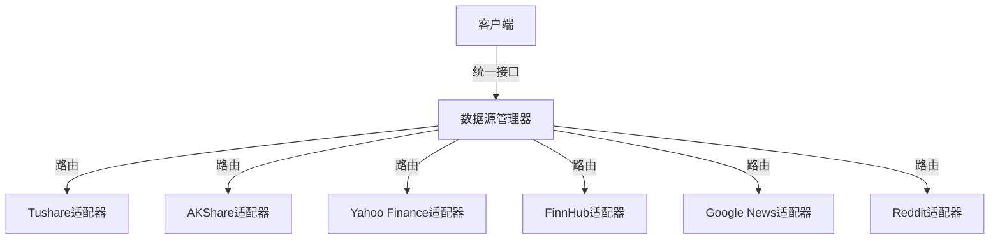

**图源**
- [data_source_manager.py](file://tradingagents/dataflows/data_source_manager.py#L1-L353)

**本节来源**
- [data_source_manager.py](file://tradingagents/dataflows/data_source_manager.py#L1-L353)

## 策略模式与动态路由
系统采用策略模式实现数据源的动态路由，通过`DataSourceManager`类管理不同数据源的选择和切换。

### 数据源枚举
系统定义了中国股票数据源的枚举类型，支持多种数据源：

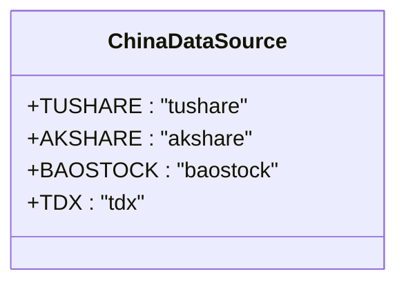

**图源**
- [data_source_manager.py](file://tradingagents/dataflows/data_source_manager.py#L15-L25)

### 路由机制
`DataSourceManager`根据配置和可用性动态选择数据源：

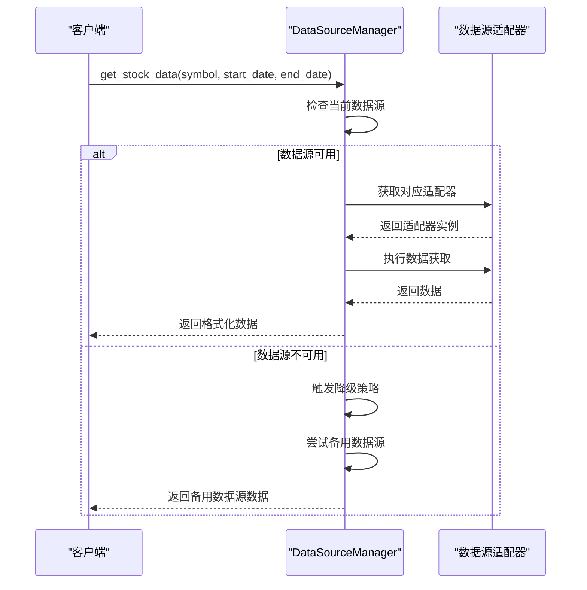

**图源**
- [data_source_manager.py](file://tradingagents/dataflows/data_source_manager.py#L150-L250)

**本节来源**
- [data_source_manager.py](file://tradingagents/dataflows/data_source_manager.py#L1-L353)

## 数据源适配器实现
系统为不同数据源提供了专门的适配器实现，封装了各数据源的特定逻辑。

### Tushare适配器
`TushareProvider`类封装了Tushare数据源的访问逻辑：

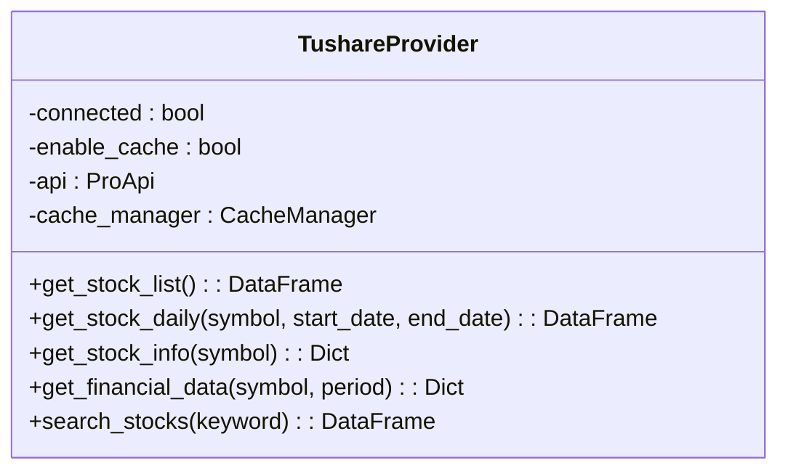

**图源**
- [tushare_utils.py](file://tradingagents/dataflows/tushare_utils.py#L50-L350)

### Yahoo Finance适配器
`YFinanceUtils`类提供了Yahoo Finance数据源的访问接口：

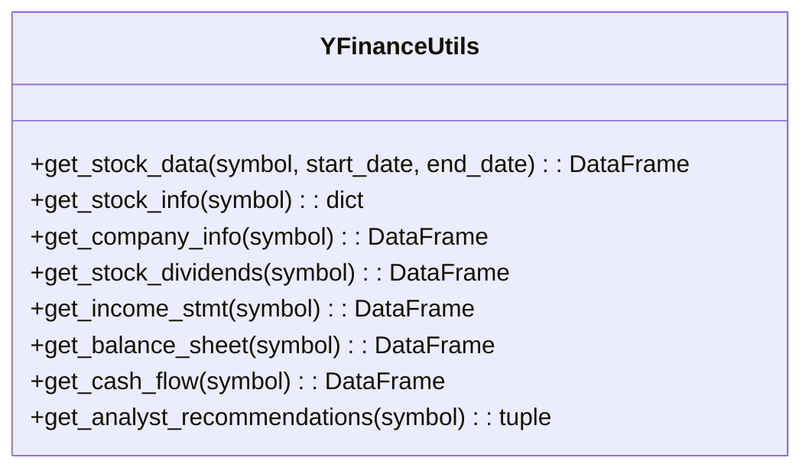

**图源**
- [yfin_utils.py](file://tradingagents/dataflows/yfin_utils.py#L30-L120)

### 新闻数据适配器
系统提供了多种新闻数据源的适配器：

```mermaid
classDiagram
class FinnhubUtils {
+get_data_in_range(ticker, start_date, end_date, data_type) : Dict
}
class GoogleNewsUtils {
+getNewsData(query, start_date, end_date) : List
+make_request(url, headers) : Response
+is_rate_limited(response) : bool
}
class RedditUtils {
+fetch_top_from_category(category, date, max_limit, query) : List
+ticker_to_company : Dict
}
FinnhubUtils -->|实现| NewsSource
GoogleNewsUtils -->|实现| NewsSource
RedditUtils -->|实现| NewsSource
```

**图源**
- [finnhub_utils.py](file://tradingagents/dataflows/finnhub_utils.py#L1-L52)
- [googlenews_utils.py](file://tradingagents/dataflows/googlenews_utils.py#L1-L109)
- [reddit_utils.py](file://tradingagents/dataflows/reddit_utils.py#L1-L136)

**本节来源**
- [tushare_utils.py](file://tradingagents/dataflows/tushare_utils.py#L1-L411)
- [yfin_utils.py](file://tradingagents/dataflows/yfin_utils.py#L1-L126)
- [finnhub_utils.py](file://tradingagents/dataflows/finnhub_utils.py#L1-L52)
- [googlenews_utils.py](file://tradingagents/dataflows/googlenews_utils.py#L1-L109)
- [reddit_utils.py](file://tradingagents/dataflows/reddit_utils.py#L1-L136)

## 接口抽象层设计
`interface.py`模块提供了统一的接口抽象层，屏蔽了不同数据源的底层差异。

### 接口函数设计
系统定义了一系列标准化的接口函数：

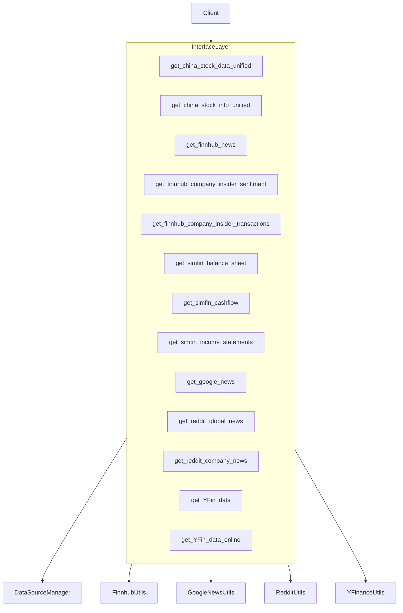

**图源**
- [interface.py](file://tradingagents/dataflows/interface.py#L1-L800)

### 参数注解
接口使用类型注解明确参数含义：

```python
def get_finnhub_news(
    ticker: Annotated[
        str,
        "Search query of a company's, e.g. 'AAPL, TSM, etc.",
    ],
    curr_date: Annotated[str, "Current date in yyyy-mm-dd format"],
    look_back_days: Annotated[int, "how many days to look back"],
):
    ...
```

**本节来源**
- [interface.py](file://tradingagents/dataflows/interface.py#L1-L800)

## 多源数据融合分析示例
系统支持从多个数据源获取数据进行综合分析：

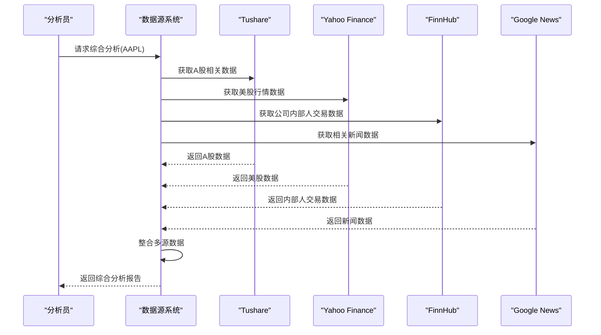

**图源**
- [interface.py](file://tradingagents/dataflows/interface.py#L1-L800)
- [data_source_manager.py](file://tradingagents/dataflows/data_source_manager.py#L1-L353)

## 错误处理与降级策略
系统实现了完善的错误处理和降级策略，确保在单一数据源失效时仍可运行。

### 降级策略流程
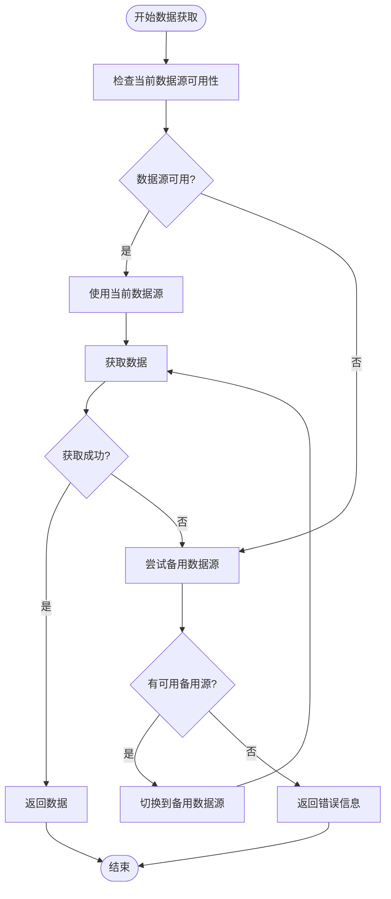

**图源**
- [data_source_manager.py](file://tradingagents/dataflows/data_source_manager.py#L200-L250)

### 错误处理机制
系统采用多层次的错误处理机制：

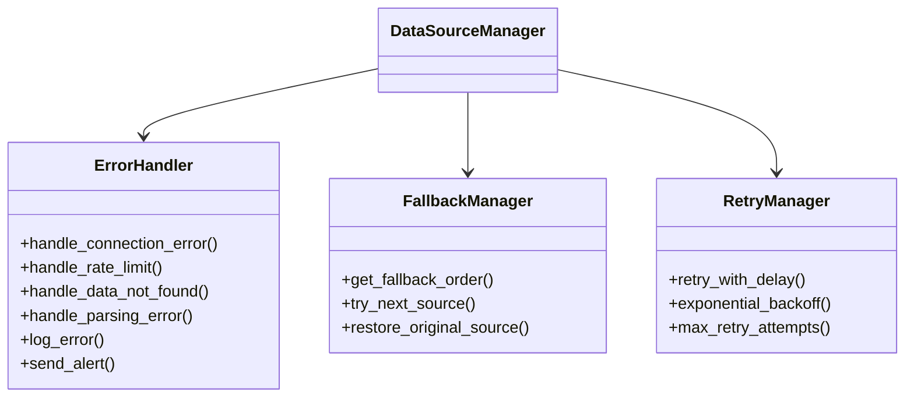

**本节来源**
- [data_source_manager.py](file://tradingagents/dataflows/data_source_manager.py#L200-L250)
- [googlenews_utils.py](file://tradingagents/dataflows/googlenews_utils.py#L10-L50)

## 性能优化措施
系统实施了多项性能优化措施，提升数据获取效率。

### 并发请求
系统使用线程池实现并发数据获取：

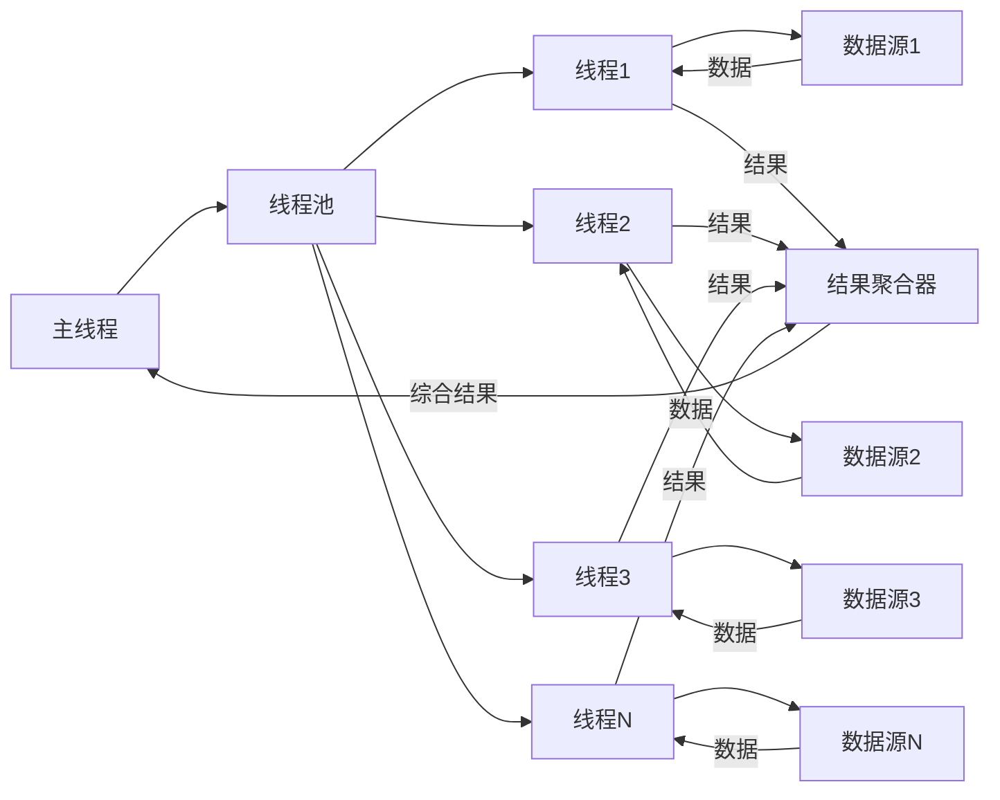

### 响应缓存
系统实现了多级缓存机制：

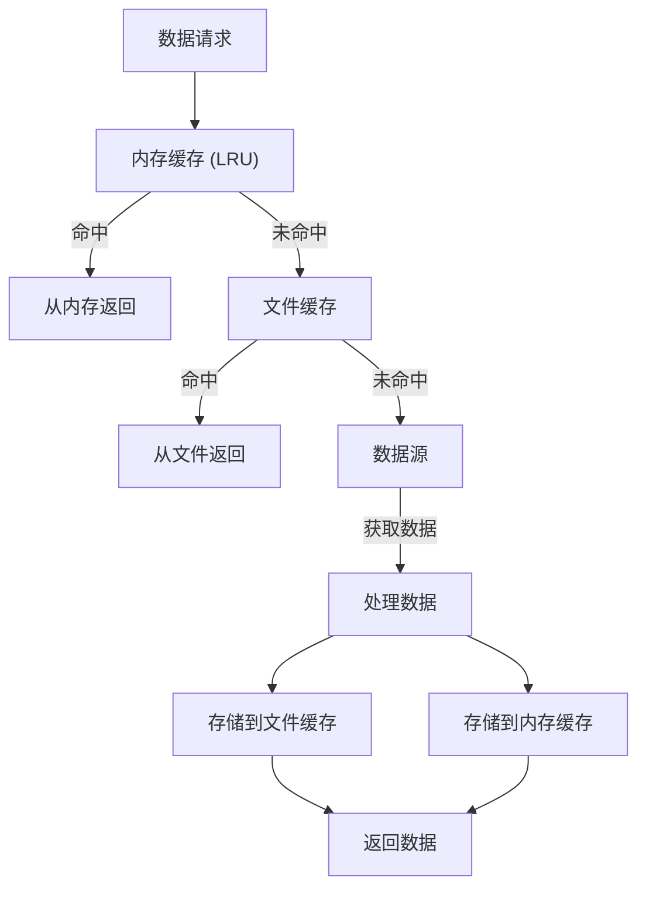

**图源**
- [tushare_utils.py](file://tradingagents/dataflows/tushare_utils.py#L30-L50)
- [yfin_utils.py](file://tradingagents/dataflows/yfin_utils.py#L10-L20)

### 数据预取
系统支持数据预取策略：

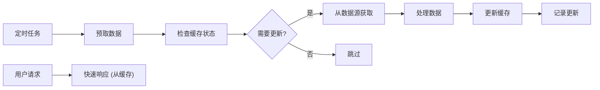

**本节来源**
- [tushare_utils.py](file://tradingagents/dataflows/tushare_utils.py#L30-L50)
- [yfin_utils.py](file://tradingagents/dataflows/yfin_utils.py#L10-L20)
- [data_source_manager.py](file://tradingagents/dataflows/data_source_manager.py#L30-L50)