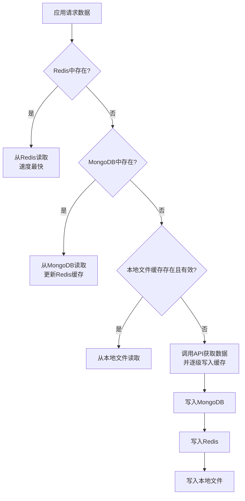
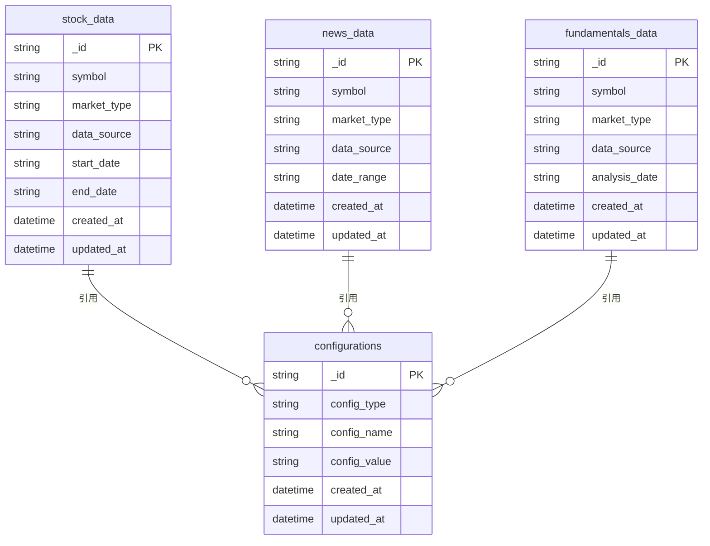

# 数据管理

<cite>
**本文档引用的文件**   
- [data_source_manager.py](file://tradingagents/dataflows/data_source_manager.py)
- [cache_manager.py](file://tradingagents/dataflows/cache_manager.py)
- [db_cache_manager.py](file://tradingagents/dataflows/db_cache_manager.py)
- [integrated_cache.py](file://tradingagents/dataflows/integrated_cache.py)
- [mongo-init.js](file://scripts/docker/mongo-init.js)
</cite>

## 目录
1. [数据源集成](#数据源集成)
2. [缓存系统](#缓存系统)
3. [数据库模式设计](#数据库模式设计)
4. [初始化脚本](#初始化脚本)

## 数据源集成

本系统通过 `data_source_manager.py` 模块实现了对A股、美股及新闻数据的统一接入。核心组件 `DataSourceManager` 类负责管理数据源的路由和切换。

系统支持的A股数据源包括 Tushare 和 AkShare，美股数据源包括 Yahoo Finance 和 Finnhub，新闻数据源包括 Google News 和 Reddit。这些数据源通过统一的接口进行访问，确保了数据获取的一致性和灵活性。

`DataSourceManager` 的路由机制基于以下原则：
1.  **默认数据源**：通过环境变量 `DEFAULT_CHINA_DATA_SOURCE` 配置，默认为 Tushare。
2.  **可用性检查**：在初始化时，系统会检查各数据源库是否已安装以及必要的认证信息（如 Tushare 的 token）是否已配置。
3.  **动态切换**：用户可以通过 `set_current_source()` 方法在运行时动态切换当前使用的数据源。
4.  **备用机制**：当首选数据源获取数据失败时，系统会自动尝试备用数据源（优先级：Tushare > AKShare > BaoStock > TDX），确保数据获取的可靠性。

统一的数据获取接口 `get_china_stock_data_unified()` 和 `get_china_stock_info_unified()` 提供了简洁的调用方式，屏蔽了底层不同数据源的复杂性。

**Section sources**
- [data_source_manager.py](file://tradingagents/dataflows/data_source_manager.py#L21-L310)

## 缓存系统

系统实现了三级缓存策略，以优化性能并减少对外部API的依赖。

### 三级缓存策略

1.  **Redis (高速缓存)**：作为第一级缓存，提供亚秒级的数据读取速度。`db_cache_manager.py` 中的 `DatabaseCacheManager` 类负责将数据同时写入 Redis 和 MongoDB。Redis 中的数据有过期时间（例如，股票数据6小时，新闻数据24小时），确保数据的时效性。
2.  **MongoDB (持久化存储)**：作为第二级缓存，提供数据的持久化存储。即使服务重启，数据也不会丢失。`DatabaseCacheManager` 类在从 Redis 读取失败后，会从 MongoDB 中加载数据，并将其重新写入 Redis，实现缓存回填。
3.  **本地文件 (临时备份)**：作为第三级缓存，由 `cache_manager.py` 中的 `StockDataCache` 类管理。数据按市场类型（A股/美股）分类存储在本地文件系统中，并配有元数据文件记录缓存时间。当数据库不可用时，系统可降级使用本地文件缓存。



**Diagram sources**
- [db_cache_manager.py](file://tradingagents/dataflows/db_cache_manager.py#L33-L516)
- [cache_manager.py](file://tradingagents/dataflows/cache_manager.py#L16-L491)

### 缓存键设计与失效策略

-   **缓存键设计**：缓存键由数据类型、股票代码和所有查询参数（如起止日期、数据源）生成。系统使用 MD5 哈希算法将这些参数组合成一个唯一的、固定长度的字符串，确保了键的唯一性和简洁性。
-   **失效策略**：
    -   **TTL (Time-To-Live)**：为不同类型的缓存数据设置了不同的过期时间。例如，A股数据缓存1小时，美股数据缓存2小时，新闻数据缓存4-6小时。这通过 Redis 的 `SETEX` 命令和本地缓存的 `is_cache_valid()` 方法实现。
    -   **智能TTL**：`StockDataCache` 类能根据数据类型和市场自动确定TTL，无需硬编码。
    -   **定期清理**：系统提供 `clear_old_cache()` 方法，可定期清理超过指定天数（如7天）的过期缓存文件。

### 性能优化技巧

1.  **读写分离**：采用“先读缓存，后读数据库，最后调用API”的策略，最大限度地利用缓存。
2.  **缓存回填**：从持久化存储（MongoDB）读取数据后，立即将其写回高速缓存（Redis），提升后续请求的速度。
3.  **降级支持**：`integrated_cache.py` 中的 `IntegratedCacheManager` 类智能地整合了多种缓存系统。当数据库不可用时，自动降级到本地文件缓存，保证了系统的高可用性。
4.  **批量操作与连接池**：Redis 和 MongoDB 客户端使用连接池，避免了频繁建立连接的开销。

**Section sources**
- [db_cache_manager.py](file://tradingagents/dataflows/db_cache_manager.py#L33-L516)
- [cache_manager.py](file://tradingagents/dataflows/cache_manager.py#L16-L491)
- [integrated_cache.py](file://tradingagents/dataflows/integrated_cache.py#L24-L265)

## 数据库模式设计

系统使用 MongoDB 存储数据，其集合结构和索引策略设计如下：

### 集合结构

系统主要创建了以下集合：
-   **`stock_data`**：存储股票历史数据。
-   **`news_data`**：存储新闻数据。
-   **`fundamentals_data`**：存储基本面分析数据。
-   **`configurations`**：存储系统配置，如缓存TTL设置、默认LLM模型等。

每个集合中的文档都包含标准化的字段，如 `_id` (缓存键), `symbol` (股票代码), `market_type` (市场类型), `data_type`, `data_source`, `created_at`, `updated_at` 以及实际的 `data` 内容。

### 索引策略

为了保证查询效率，系统在 `db_cache_manager.py` 中通过 `_create_mongodb_indexes()` 方法创建了复合索引：



**Diagram sources**
- [db_cache_manager.py](file://tradingagents/dataflows/db_cache_manager.py#L33-L516)
- [mongo-init.js](file://scripts/docker/mongo-init.js#L1-L140)

**Section sources**
- [db_cache_manager.py](file://tradingagents/dataflows/db_cache_manager.py#L33-L516)
- [mongo-init.js](file://scripts/docker/mongo-init.js#L1-L140)

## 初始化脚本

`mongo-init.js` 是一个 MongoDB 初始化脚本，其作用和使用方法如下：

### 作用

该脚本在 MongoDB 容器首次启动时自动执行，用于完成数据库的初始化配置。其主要功能包括：
1.  **创建数据库和集合**：创建名为 `tradingagents` 的数据库，并初始化 `stock_data`, `analysis_results`, `user_sessions`, `configurations` 等核心集合。
2.  **创建索引**：为各个集合创建必要的索引，以优化后续的查询性能。
3.  **插入初始配置**：向 `configurations` 集合中插入系统运行所需的默认配置，例如：
    -   缓存TTL设置（A股数据1小时，美股数据2小时等）。
    -   默认的LLM模型配置。
    -   系统通用设置。

### 使用方法

该脚本通常与 Docker 配合使用。在 `docker-compose.yml` 文件中，可以通过挂载卷的方式将 `mongo-init.js` 脚本放入 MongoDB 容器的 `/docker-entrypoint-initdb.d/` 目录下。当容器启动时，Docker 会自动执行该目录下的所有 `.js` 脚本。

例如，在 `docker-compose.yml` 中的配置可能如下：
```yaml
services:
  mongodb:
    image: mongo:latest
    volumes:
      - ./scripts/docker/mongo-init.js:/docker-entrypoint-initdb.d/mongo-init.js:ro
    environment:
      - MONGO_INITDB_ROOT_USERNAME=admin
      - MONGO_INITDB_ROOT_PASSWORD=tradingagents123
```

**Section sources**
- [mongo-init.js](file://scripts/docker/mongo-init.js#L1-L140)