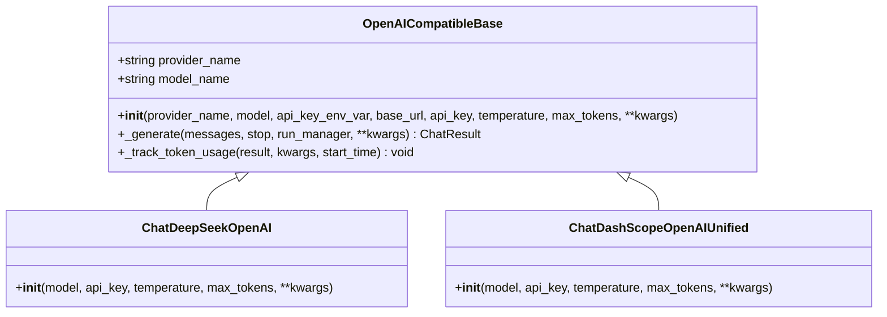
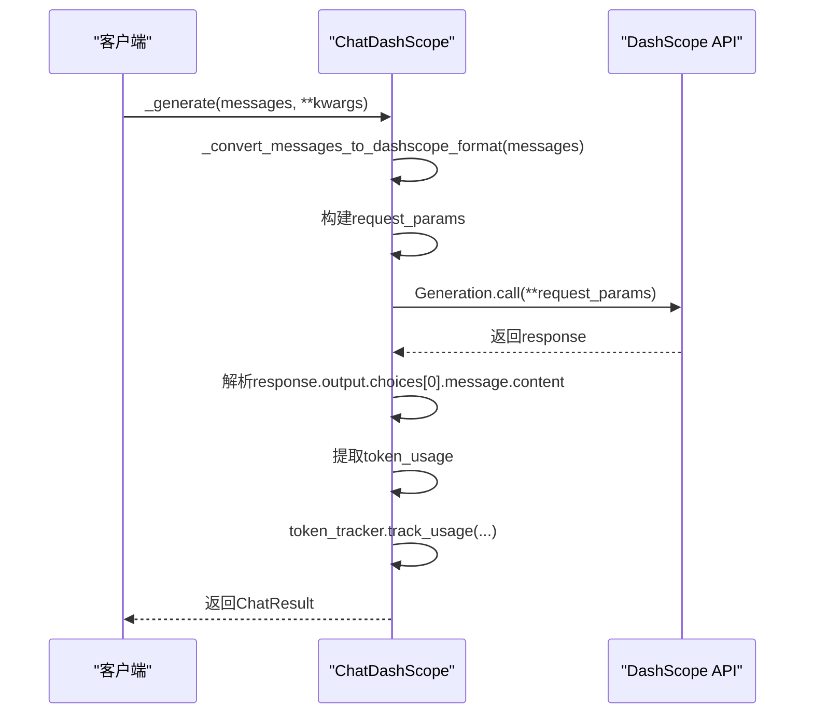
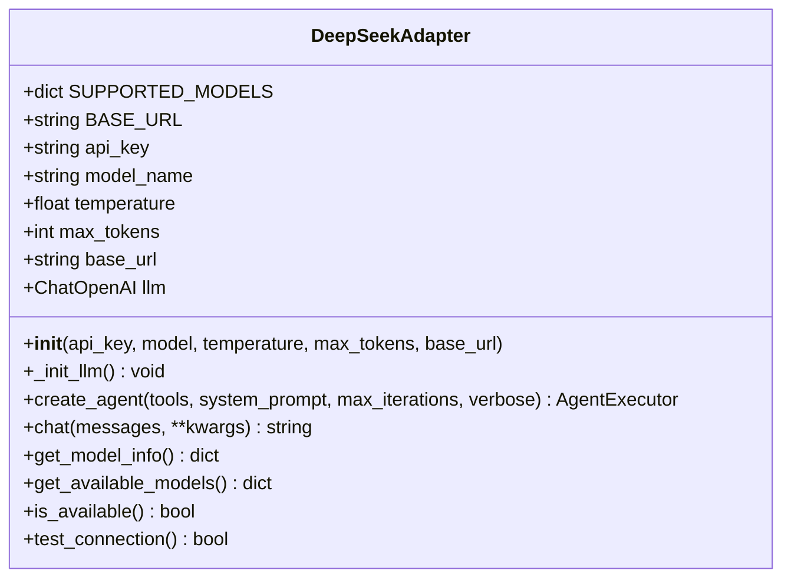
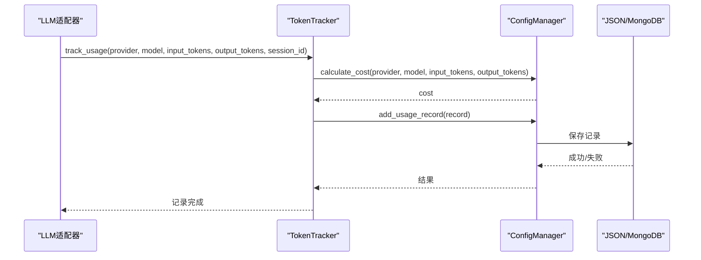

# LLM集成与适配器

<cite>
**本文档引用的文件**   
- [openai_compatible_base.py](file://tradingagents/llm_adapters/openai_compatible_base.py)
- [dashscope_adapter.py](file://tradingagents/llm_adapters/dashscope_adapter.py)
- [deepseek_adapter.py](file://tradingagents/llm/deepseek_adapter.py)
- [default_config.py](file://tradingagents/default_config.py)
- [token_tracking_demo.py](file://examples/token_tracking_demo.py)
</cite>

## 目录
1. [LLM适配器层设计概述](#llm适配器层设计概述)
2. [统一接口抽象：OpenAI兼容基类](#统一接口抽象openai兼容基类)
3. [阿里百炼适配器实现](#阿里百炼适配器实现)
4. [DeepSeek适配器实现](#deepseek适配器实现)
5. [适配器在智能体工作流中的集成](#适配器在智能体工作流中的集成)
6. [配置管理与模型参数设置](#配置管理与模型参数设置)
7. [Token统计与成本跟踪机制](#token统计与成本跟踪机制)
8. [流式响应与超时重试策略](#流式响应与超时重试策略)

## LLM适配器层设计概述

LLM适配器层的设计旨在为TradingAgents系统提供灵活、可扩展的大型语言模型（LLM）集成能力。通过定义统一的接口和抽象层，系统能够无缝集成来自不同提供商的LLM服务，如阿里百炼（DashScope）和DeepSeek。适配器层不仅处理不同API的差异，还实现了认证、请求构造、响应解析、错误处理等核心功能。这种设计使得上层应用无需关心底层LLM的具体实现细节，从而支持动态切换模型提供商，增强了系统的灵活性和可维护性。

## 统一接口抽象：OpenAI兼容基类

`openai_compatible_base.py` 文件定义了 `OpenAICompatibleBase` 基类，为所有支持OpenAI接口的LLM提供商提供统一的实现。该基类继承自 `ChatOpenAI`，通过参数化配置来适应不同提供商的API。它在初始化时接受提供商名称、模型名、API密钥环境变量名和基础URL等参数，实现了API密钥从环境变量的自动获取，并处理了LangChain新旧版本的参数名兼容性问题。

该基类的核心方法 `_generate` 在调用父类生成响应后，会自动调用 `_track_token_usage` 方法来记录token使用量。此方法通过 `token_tracker` 组件将输入和输出的token数、会话ID、分析类型等信息记录下来，用于后续的成本计算和统计分析。这种设计将token跟踪功能与核心生成逻辑解耦，确保了所有继承该基类的适配器都能自动具备成本跟踪能力。



**图示来源**
- [openai_compatible_base.py](file://tradingagents/llm_adapters/openai_compatible_base.py#L21-L155)

**本节来源**
- [openai_compatible_base.py](file://tradingagents/llm_adapters/openai_compatible_base.py#L21-L155)

## 阿里百炼适配器实现

`dashscope_adapter.py` 文件实现了针对阿里百炼（DashScope）的 `ChatDashScope` 适配器。该适配器直接继承自LangChain的 `BaseChatModel`，提供了对DashScope API的完整支持。适配器通过 `__init__` 方法初始化，从环境变量 `DASHSCOPE_API_KEY` 或参数中获取API密钥，并配置 `dashscope` 客户端。

适配器的关键功能包括消息格式转换、请求构造和响应解析。`_convert_messages_to_dashscope_format` 方法负责将LangChain的 `BaseMessage` 对象列表转换为DashScope API所需的格式，正确处理系统、用户和助手消息的角色映射。`_generate` 方法构建请求参数，调用 `Generation.call` API，并解析响应中的消息内容和token使用量。如果API响应中包含 `usage` 信息，则提取输入和输出token数；否则，根据总token数进行估算。



**图示来源**
- [dashscope_adapter.py](file://tradingagents/llm_adapters/dashscope_adapter.py#L20-L238)

**本节来源**
- [dashscope_adapter.py](file://tradingagents/llm_adapters/dashscope_adapter.py#L20-L238)

## DeepSeek适配器实现

`deepseek_adapter.py` 文件中的 `DeepSeekAdapter` 类提供了对DeepSeek V3模型的完整支持。与基于OpenAI兼容基类的适配器不同，`DeepSeekAdapter` 是一个独立的适配器类，它直接封装了LangChain的 `ChatOpenAI` 组件。该适配器通过 `__init__` 方法初始化，支持从环境变量 `DEEPSEEK_API_KEY` 获取API密钥，并兼容新旧版本LangChain的参数名。

该适配器的核心功能是 `create_agent` 方法，它利用 `create_openai_functions_agent` 工具创建一个支持工具调用的智能体执行器（AgentExecutor）。这使得DeepSeek模型能够与系统中的各种工具（如股票数据查询、新闻分析等）进行交互，完成复杂的分析任务。`chat` 方法提供了直接的聊天接口，而 `get_model_info` 方法则返回模型的详细信息，包括上下文长度和功能支持情况。



**图示来源**
- [deepseek_adapter.py](file://tradingagents/llm/deepseek_adapter.py#L16-L203)

**本节来源**
- [deepseek_adapter.py](file://tradingagents/llm/deepseek_adapter.py#L16-L203)

## 适配器在智能体工作流中的集成

LLM适配器被深度集成到智能体工作流中，作为智能体决策和推理的核心引擎。在 `tradingagents/graph/trading_graph.py` 文件中，系统根据配置文件中的 `llm_provider` 设置来选择和初始化相应的LLM实例。例如，当配置为 `dashscope` 时，系统会创建 `ChatDashScopeOpenAI` 实例；当配置为 `deepseek` 时，则会使用 `DeepSeekAdapter` 创建智能体。

这种集成方式支持动态切换模型提供商，只需更改配置文件中的 `llm_provider` 和 `deep_think_llm` 等参数即可。智能体工作流利用适配器提供的统一接口进行消息交互，无论底层是哪个LLM提供商，上层逻辑都保持一致。这极大地提高了系统的灵活性，允许用户根据成本、性能或功能需求选择最合适的模型。

**本节来源**
- [trading_graph.py](file://tradingagents/graph/trading_graph.py#L66-L91)

## 配置管理与模型参数设置

系统的配置由 `default_config.py` 文件和 `config_manager.py` 共同管理。`default_config.py` 定义了默认配置，包括结果目录、数据目录、LLM提供商、模型名称和后端URL等。这些配置可以通过环境变量进行覆盖，实现了配置的灵活性。

```mermaid
flowchart TD
A[default_config.py] --> B[DEFAULT_CONFIG]
B --> C[llm_provider: "openai"]
B --> D[deep_think_llm: "o4-mini"]
B --> E[quick_think_llm: "gpt-4o-mini"]
B --> F[backend_url: "https://api.openai.com/v1"]
G[.env文件] --> H[环境变量]
H --> I[DASHSCOPE_API_KEY]
H --> J[OPENAI_API_KEY]
H --> K[DEEPSEEK_API_KEY]
L[config_manager.py] --> M[加载环境变量]
M --> N[合并default_config与环境变量]
N --> O[最终运行时配置]
```

**图示来源**
- [default_config.py](file://tradingagents/default_config.py#L0-L25)

**本节来源**
- [default_config.py](file://tradingagents/default_config.py#L0-L25)

## Token统计与成本跟踪机制

系统通过 `token_tracker` 组件实现了全面的Token使用统计和成本跟踪。该机制在 `token_tracking_demo.py` 中有详细演示。`TokenTracker` 类与 `ConfigManager` 紧密协作，`ConfigManager` 负责加载定价配置（`pricing.json`）和保存使用记录。

每次LLM调用后，适配器会调用 `token_tracker.track_usage` 方法，传入提供商、模型名、输入/输出token数等信息。`TokenTracker` 随后调用 `ConfigManager` 的 `calculate_cost` 方法，根据预设的定价规则计算本次调用的成本，并将记录保存到JSON文件或MongoDB中。系统还支持成本警告功能，当单日成本超过阈值时会发出提醒。



**图示来源**
- [token_tracking_demo.py](file://examples/token_tracking_demo.py#L0-L278)
- [config_manager.py](file://tradingagents/config/config_manager.py#L534-L602)

**本节来源**
- [token_tracking_demo.py](file://examples/token_tracking_demo.py#L0-L278)
- [config_manager.py](file://tradingagents/config/config_manager.py#L534-L602)

## 流式响应与超时重试策略

虽然当前代码库中的适配器主要实现了同步响应，但系统架构为流式响应和超时重试策略预留了扩展空间。`ChatDashScope` 适配器的 `bind_tools` 方法和 `DeepSeekAdapter` 的 `create_agent` 方法都设计为可扩展的，未来可以集成流式处理功能。

对于超时和重试，系统依赖于底层的HTTP客户端和LangChain框架的内置机制。开发者可以通过在 `default_config.py` 或环境变量中设置超时参数来控制请求行为。虽然当前代码未显式实现重试逻辑，但通过 `try-except` 块捕获异常并进行日志记录的方式，为实现高级重试策略（如指数退避）提供了基础。未来的版本可以在此基础上，利用 `tenacity` 等库来实现更健壮的错误处理和重试机制。

**本节来源**
- [dashscope_adapter.py](file://tradingagents/llm_adapters/dashscope_adapter.py#L20-L238)
- [deepseek_adapter.py](file://tradingagents/llm/deepseek_adapter.py#L16-L203)