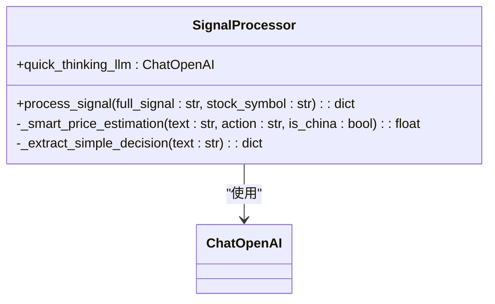
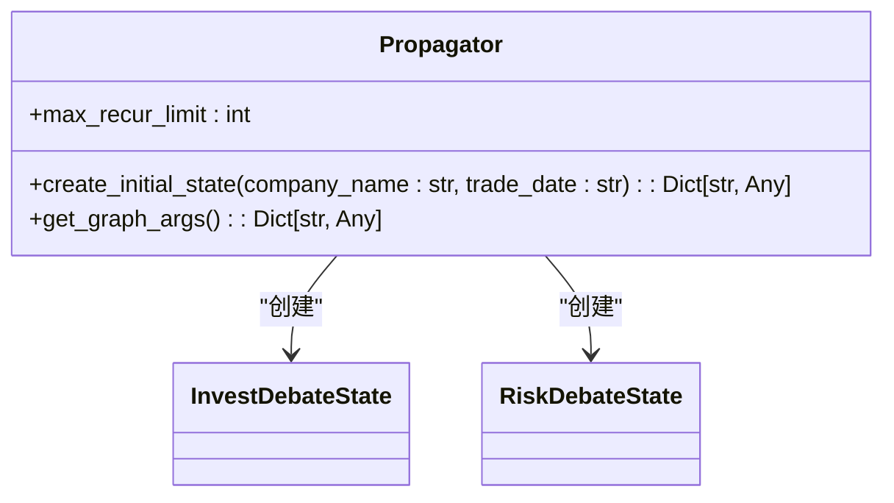
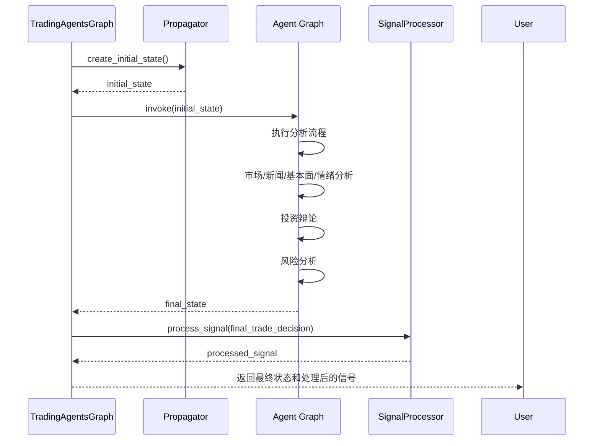

# 信号处理与状态传播

<cite>
**本文档引用的文件**
- [signal_processing.py](file://tradingagents/graph/signal_processing.py)
- [propagation.py](file://tradingagents/graph/propagation.py)
- [trading_graph.py](file://tradingagents/graph/trading_graph.py)
- [agent_states.py](file://tradingagents/agents/utils/agent_states.py)
</cite>

## 目录
1. [引言](#引言)
2. [信号处理器详解](#信号处理器详解)
3. [状态传播机制](#状态传播机制)
4. [状态合并与冲突解决](#状态合并与冲突解决)
5. [信号流转完整流程](#信号流转完整流程)
6. [性能优化建议](#性能优化建议)
7. [结论](#结论)

## 引言
本文件全面解析`signal_processing.py`和`propagation.py`在交易智能体工作流中的核心作用。重点说明信号处理器如何对智能体输出进行标准化、过滤和增强，以及状态传播机制如何在节点间传递和更新`AgentState`对象。文档将深入探讨状态合并策略、冲突解决机制和版本控制方法，并结合`trading_graph.py`中的实际流程，展示从分析师输出到研究经理汇总的完整信号流转过程，最后提供性能优化建议。

## 信号处理器详解

`SignalProcessor`类负责处理交易信号，从智能体的分析报告中提取结构化的投资决策信息。其主要功能包括信号标准化、货币检测、目标价格提取和智能推算。

**图示来源**
- [signal_processing.py](file://tradingagents/graph/signal_processing.py#L5-L280)

**本节来源**
- [signal_processing.py](file://tradingagents/graph/signal_processing.py#L5-L280)

### 信号标准化与过滤
`process_signal`方法接收完整的交易信号文本，通过以下步骤进行处理：
1. **股票类型检测**：根据股票代码格式判断是否为中国A股，从而确定货币类型（人民币或美元）。
2. **LLM指令构建**：向大语言模型发送系统指令，要求其从分析报告中提取结构化决策信息，包括投资建议（买入/持有/卖出）、目标价格、置信度、风险评分和推理摘要。
3. **数据验证与标准化**：对LLM返回的JSON数据进行验证，确保`action`字段为中文（"买入"、"持有"、"卖出"），并映射可能的英文或其他变体。

### 目标价格增强与智能推算
当LLM返回的JSON中缺少目标价格时，信号处理器会启动增强提取机制：
1. **多模式文本匹配**：使用13种正则表达式模式从完整文本中搜索目标价格，涵盖"目标价"、"建议"、"看至"、"上涨到"等多种表述。
2. **智能价格推算**：若文本匹配失败，则调用`_smart_price_estimation`方法进行智能推算。该方法尝试从文本中提取当前股价和涨跌幅信息，结合投资建议动作（买入/卖出）计算目标价格。若无法提取涨跌幅，则根据股票类型（A股/美股）应用默认涨幅（买入）或跌幅（卖出）系数。

**本节来源**
- [signal_processing.py](file://tradingagents/graph/signal_processing.py#L12-L168)
- [signal_processing.py](file://tradingagents/graph/signal_processing.py#L170-L233)

## 状态传播机制

`Propagator`类负责处理智能体图（Agent Graph）的状态初始化和传播，是工作流的起点和状态管理核心。

**图示来源**
- [propagation.py](file://tradingagents/graph/propagation.py#L10-L48)
- [agent_states.py](file://tradingagents/agents/utils/agent_states.py#L10-L20)
- [agent_states.py](file://tradingagents/agents/utils/agent_states.py#L24-L46)

**本节来源**
- [propagation.py](file://tradingagents/graph/propagation.py#L10-L48)

### 初始状态创建
`create_initial_state`方法为智能体图创建初始状态对象，包含：
- **基础信息**：公司名称（`company_of_interest`）和交易日期（`trade_date`）。
- **辩论状态**：初始化`investment_debate_state`和`risk_debate_state`，用于跟踪牛市/熊市研究员和风险分析师之间的辩论历史、当前响应和计数器。
- **报告占位符**：为市场、基本面、情绪和新闻报告预留空字符串字段。

### 图执行参数配置
`get_graph_args`方法返回图执行所需的参数，包括`stream_mode`（流式输出模式）和`config`（配置，包含递归限制`recursion_limit`），确保图在执行时有明确的运行时约束。

**本节来源**
- [propagation.py](file://tradingagents/graph/propagation.py#L17-L41)
- [propagation.py](file://tradingagents/graph/propagation.py#L43-L48)

## 状态合并与冲突解决

状态合并与冲突解决机制主要体现在`AgentState`的数据结构设计和`ConditionalLogic`的条件判断中。

### AgentState数据结构
`AgentState`类定义了智能体图中所有节点共享的状态结构，确保了数据的一致性和可预测性。关键字段包括：
- **sender**：记录发送消息的智能体名称，用于追踪信息来源。
- **investment_debate_state**：包含`bull_history`、`bear_history`和`current_response`，明确区分了不同立场的辩论历史。
- **risk_debate_state**：包含`risky_history`、`safe_history`、`neutral_history`和`latest_speaker`，支持三方风险辩论。

### 冲突解决策略
冲突解决通过`ConditionalLogic`类中的条件函数实现：
- **投资辩论**：`should_continue_debate`函数根据辩论轮次计数和最后发言者决定下一个发言的智能体，确保辩论在牛市和熊市研究员之间交替进行，达到最大轮次后由研究经理（Research Manager）做出最终判断。
- **风险分析**：`should_continue_risk_analysis`函数根据风险辩论计数和最后发言者（`latest_speaker`）在激进、保守和中立分析师之间循环，确保多角度风险评估。

**本节来源**
- [agent_states.py](file://tradingagents/agents/utils/agent_states.py#L49-L75)
- [conditional_logic.py](file://tradingagents/graph/conditional_logic.py#L45-L54)
- [conditional_logic.py](file://tradingagents/graph/conditional_logic.py#L56-L66)

## 信号流转完整流程

完整的信号流转过程由`TradingAgentsGraph`类的`propagate`方法驱动，从分析师输出到研究经理汇总。

**图示来源**
- [trading_graph.py](file://tradingagents/graph/trading_graph.py#L228-L261)
- [propagation.py](file://tradingagents/graph/propagation.py#L17-L41)
- [signal_processing.py](file://tradingagents/graph/signal_processing.py#L12-L168)

**本节来源**
- [trading_graph.py](file://tradingagents/graph/trading_graph.py#L228-L261)

### 流程步骤
1. **初始化**：`TradingAgentsGraph`调用`Propagator`的`create_initial_state`方法创建初始状态。
2. **图执行**：将初始状态传递给`langgraph`构建的智能体图，图根据`ConditionalLogic`的规则，依次调用市场、新闻、基本面和情绪分析师，并触发投资和风险辩论。
3. **状态聚合**：各分析师的输出（`market_report`, `news_report`等）被写入`AgentState`的相应字段。
4. **最终决策**：风险分析师团队完成辩论后，生成`final_trade_decision`。
5. **信号处理**：`TradingAgentsGraph`调用`SignalProcessor`的`process_signal`方法，对`final_trade_decision`进行标准化和增强，提取出结构化的投资决策。

## 性能优化建议

### 减少冗余信号传递
目前的流程中，完整的`final_trade_decision`文本被传递给`SignalProcessor`进行处理。优化建议：
- **直接传递结构化数据**：修改智能体图的输出，使其直接生成符合`SignalProcessor`期望的JSON结构，避免LLM二次解析和正则表达式匹配的开销。
- **缓存信号处理结果**：对于相同的或高度相似的`final_trade_decision`文本，可以引入缓存机制，避免重复处理。

### 异步处理机制
当前的`propagate`方法是同步阻塞的。优化建议：
- **异步执行图**：利用`langgraph`的异步API（如`ainvoke`），将图的执行变为异步，提高系统吞吐量。
- **并行信号处理**：如果需要处理多个股票的信号，可以使用异步任务并行处理，而不是串行执行。

**本节来源**
- [trading_graph.py](file://tradingagents/graph/trading_graph.py#L228-L261)
- [signal_processing.py](file://tradingagents/graph/signal_processing.py#L12-L168)

## 结论
`signal_processing.py`和`propagation.py`是交易智能体系统的核心组件。`SignalProcessor`通过复杂的文本解析和智能推算，确保了投资决策的标准化和完整性。`Propagator`则为整个智能体图提供了稳定的状态管理基础。两者与`trading_graph.py`紧密结合，形成了一个从数据输入到决策输出的完整、可靠的工作流。未来的优化方向应集中在减少冗余计算和引入异步处理，以提升系统的整体性能和响应速度。