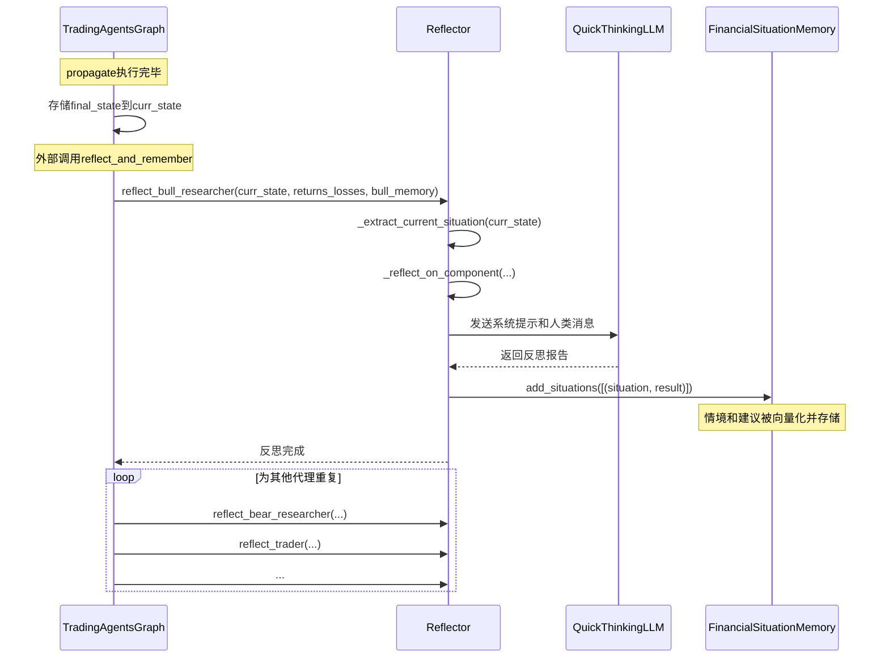

# 反射优化机制

<cite>
**本文档中引用的文件**  
- [reflection.py](file://tradingagents/graph/reflection.py)
- [trading_graph.py](file://tradingagents/graph/trading_graph.py)
- [agent_states.py](file://tradingagents/agents/utils/agent_states.py)
- [memory.py](file://tradingagents/agents/utils/memory.py)
- [signal_processing.py](file://tradingagents/graph/signal_processing.py)
</cite>

## 目录
1. [引言](#引言)
2. [反射机制核心组件](#反射机制核心组件)
3. [反射节点的评估与质量控制](#反射节点的评估与质量控制)
4. [反思标准的定义与集成](#反思标准的定义与集成)
5. [在交易图中的实际应用](#在交易图中的实际应用)
6. [自定义反思规则开发指南](#自定义反思规则开发指南)
7. [结论](#结论)

## 引言
本文件深入探讨了`reflection.py`模块中实现的自我反思与流程优化机制。该机制是交易代理系统（Trading Agents）的核心组成部分，旨在通过系统性地评估分析质量、识别逻辑漏洞或数据不足，并触发重新分析流程，从而持续提升投资决策的准确性和鲁棒性。通过与`trading_graph.py`的紧密集成，这一反射机制不仅实现了对市场、基本面、情绪等多维度分析的动态优化，还为构建可学习、可进化的智能投研系统提供了坚实基础。

## 反射机制核心组件

`reflection.py`模块的核心是`Reflector`类，它负责处理决策的反思并更新记忆。该类通过调用大型语言模型（LLM）来生成对投资决策的深度复盘，并将这些复盘结果存储到相应的记忆模块中，以便未来参考。

`Reflector`类的初始化需要一个快速思考的LLM实例，用于执行反思任务。其核心功能包括：
- **`_get_reflection_prompt`**: 定义了用于指导LLM进行反思的系统提示词，明确了反思的四个关键维度：推理、改进、总结和查询。
- **`_extract_current_situation`**: 从当前状态中提取市场、情绪、新闻和基本面报告，构建完整的市场情境。
- **`_reflect_on_component`**: 通用的反思执行方法，将当前情境、决策结果和收益/损失信息传递给LLM，生成反思报告。
- **`reflect_*`系列方法**: 针对不同代理（如看涨研究员、看跌研究员、交易员、投资裁判、风险经理）的专用反思方法，负责调用通用方法并更新各自的记忆。

**Section sources**
- [reflection.py](file://tradingagents/graph/reflection.py#L6-L120)

## 反射节点的评估与质量控制

反射节点通过一个结构化的流程来评估当前分析质量并识别潜在问题。其评估过程主要依赖于LLM的推理能力，结合预设的反思标准，对已完成的分析进行“事后诸葛亮”式的深度剖析。

### 评估流程
1.  **情境提取**：`_extract_current_situation`方法从`AgentState`中收集所有相关的分析报告（市场、情绪、新闻、基本面），构建一个全面的市场背景。
2.  **结果输入**：将实际的投资回报或损失（`returns_losses`）作为关键输入，这为反思提供了客观的绩效基准。
3.  **提示词驱动**：利用精心设计的系统提示词（`reflection_system_prompt`），引导LLM扮演“专家金融分析师”的角色，对决策进行批判性审查。
4.  **多维度分析**：LLM根据提示词要求，从多个维度进行分析：
    - **推理 (Reasoning)**：判断决策的正确性，并分析市场情报、技术指标、新闻、基本面等因素在决策中的贡献和权重。
    - **改进 (Improvement)**：对于错误的决策，提出具体的改进建议和纠正措施。
    - **总结 (Summary)**：提炼出可复用的经验教训。
    - **查询 (Query)**：将经验教训浓缩为一句简洁的查询语句，便于记忆检索。

### 质量控制与漏洞识别
该机制通过以下方式实现质量控制和漏洞识别：
- **基于结果的反馈**：以实际的`returns_losses`作为反思的起点，确保反思是结果导向的，而非空谈。
- **全面的情境考量**：强制要求LLM参考所有客观的市场报告，防止其仅凭主观臆断进行反思。
- **结构化输出要求**：提示词明确规定了输出格式和内容要求，确保反思报告的深度和可操作性。
- **记忆更新**：将反思结果（情境和建议）存储到`FinancialSituationMemory`中，形成一个持续增长的知识库。当下次遇到类似市场情境时，系统可以通过向量检索匹配历史记忆，从而避免重复犯错。

**Section sources**
- [reflection.py](file://tradingagents/graph/reflection.py#L14-L70)
- [agent_states.py](file://tradingagents/agents/utils/agent_states.py#L10-L75)
- [memory.py](file://tradingagents/agents/utils/memory.py#L8-L176)

## 反思标准的定义与集成

反思标准主要通过`_get_reflection_prompt`方法中的系统提示词来定义。这个提示词是整个反思机制的“宪法”，它严格规定了LLM在进行反思时必须遵循的准则。

### 反思标准的定义
提示词中定义的反思标准非常具体和全面：
1.  **正确性判断标准**：明确指出“正确的决策导致回报增加，错误的决策则导致回报减少”，将决策质量与客观的财务结果直接挂钩。
2.  **分析因素标准**：列出了LLM必须考虑的8个关键因素，包括市场情报、技术指标、新闻分析、基本面分析等，确保反思的全面性。
3.  **改进要求标准**：要求对错误决策提出“详细的纠正行动或改进建议”，并举例说明（如“将决策从持有改为买入”），强调了反思的可操作性。
4.  **总结与查询标准**：要求总结“可适应于未来交易场景”的教训，并将其压缩为“不超过1000个token”的简洁句子，便于后续的向量检索和记忆调用。

### 在图中的集成方法
反思机制通过`TradingAgentsGraph`类与整个工作流无缝集成。其集成方法如下：
1.  **初始化**：在`TradingAgentsGraph.__init__`中，使用`quick_thinking_llm`初始化`Reflector`实例。
2.  **状态存储**：在`propagate`方法执行完毕后，将最终的`final_state`存储在`self.curr_state`中，为后续的反思提供数据基础。
3.  **触发反思**：通过`reflect_and_remember`方法，将`curr_state`、`returns_losses`以及各个代理的记忆对象（如`bull_memory`）作为参数，调用`Reflector`的各个`reflect_*`方法。
4.  **记忆更新**：`Reflector`生成反思报告后，会调用`add_situations`方法，将当前情境和反思建议作为一对元组存储到相应的记忆集合中。

**Diagram sources**
- [trading_graph.py](file://tradingagents/graph/trading_graph.py#L32-L325)
- [reflection.py](file://tradingagents/graph/reflection.py#L6-L120)
- [memory.py](file://tradingagents/agents/utils/memory.py#L8-L176)

**Section sources**
- [trading_graph.py](file://tradingagents/graph/trading_graph.py#L305-L321)
- [reflection.py](file://tradingagents/graph/reflection.py#L72-L120)

## 在交易图中的实际应用

反射机制在`trading_graph.py`中的应用是其价值的直接体现。它通过提升分析结果的准确性和鲁棒性，显著增强了整个系统的决策能力。

### 提升分析准确性
- **纠正错误**：当一次投资决策导致亏损时，`Reflector`会分析失败原因。例如，如果亏损是由于忽略了某条关键新闻，反思报告会明确指出这一点。当下次出现类似新闻时，系统通过记忆检索，会提醒代理注意该风险，从而避免重复错误。
- **强化成功模式**：对于成功的决策，反思会总结其成功因素。例如，如果一次基于技术指标MACD金叉的买入决策获得了高回报，该经验会被记录。未来当出现类似技术形态时，系统会更有信心地做出买入建议。

### 增强系统鲁棒性
- **处理数据不足**：在分析过程中，如果某个代理（如基本面分析师）因数据不足而无法得出结论，这种“失败”也会被记录。在后续的反思中，系统会识别出数据源的不足，并可能在未来的流程中优先调用更可靠的数据工具，或调整分析策略。
- **适应市场变化**：市场环境是动态变化的。通过持续的反思和记忆更新，系统能够学习到在不同市场周期（如牛市、熊市）下有效的分析模式，使其决策更具适应性和鲁棒性，而非一成不变。

### 与信号处理的协同
反思机制与`SignalProcessor`协同工作，共同提升最终输出质量。`SignalProcessor`负责从交易员的复杂报告中提取出结构化的决策（如买入/卖出、目标价）。而`Reflector`则负责评估这个决策过程本身的质量。高质量的反思结果会存储到记忆中，直接影响未来`SignalProcessor`所依赖的LLM的决策倾向，从而形成一个“分析-决策-反思-学习-再分析”的正向循环。

**Section sources**
- [trading_graph.py](file://tradingagents/graph/trading_graph.py#L228-L325)
- [signal_processing.py](file://tradingagents/graph/signal_processing.py#L5-L280)

## 自定义反思规则开发指南

开发者可以通过修改`Reflector`类中的`_get_reflection_prompt`方法来自定义反思规则，以适应特定的投资策略或分析需求。

### 开发步骤
1.  **定位文件**：打开`tradingagents/graph/reflection.py`文件。
2.  **修改提示词**：在`_get_reflection_prompt`方法中，修改返回的字符串内容。
3.  **定义新标准**：根据需求，可以添加、删除或修改反思的维度和要求。例如：
    - **增加新维度**：可以增加“风险管理”维度，要求LLM评估决策中的风险敞口。
    - **调整权重**：可以强调某些因素的重要性，如“在评估决策时，将宏观经济因素的权重设为最高”。
    - **改变输出格式**：可以要求LLM以表格形式输出反思结果，或生成一个风险评分。
4.  **测试与验证**：运行系统，观察修改后的反思报告是否符合预期，并根据实际效果进行迭代优化。

### 注意事项
- **保持清晰和具体**：提示词必须清晰、具体，避免模糊不清的指令，以确保LLM能准确理解任务。
- **与记忆系统兼容**：确保反思报告的“查询”部分（Query）能够生成简洁、可检索的句子，以便`FinancialSituationMemory`能有效工作。
- **性能考量**：过于复杂或冗长的提示词可能会增加LLM的推理成本和延迟。

**Section sources**
- [reflection.py](file://tradingagents/graph/reflection.py#L14-L46)

## 结论
`reflection.py`中实现的自我反思机制是交易代理系统实现持续学习和优化的关键。它通过一个严谨的流程，利用LLM的强大推理能力，对投资决策进行深度复盘，并将经验教训系统性地存储到记忆中。与`trading_graph.py`的集成，使得这一机制能够无缝地嵌入到整个分析流程中，有效提升了分析结果的准确性和系统的鲁棒性。通过自定义反思规则，开发者可以进一步定制化该机制，以满足特定的投研需求，构建出更加智能和高效的自动化分析系统。