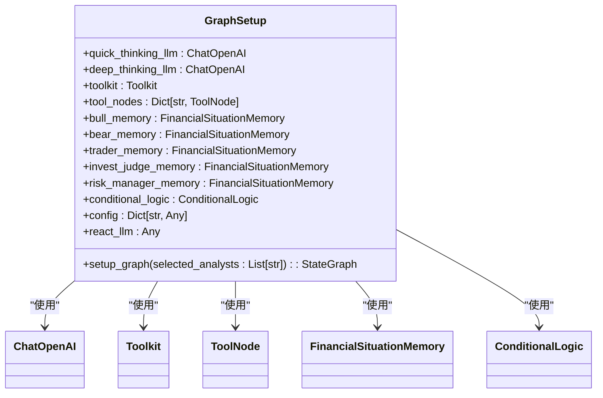
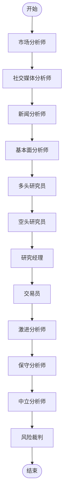
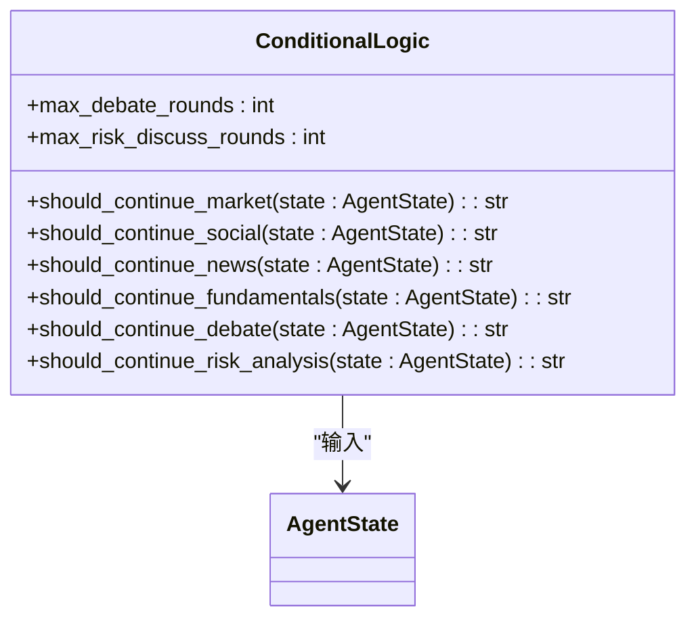
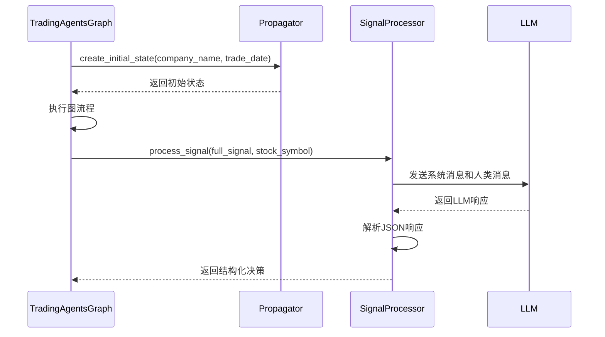
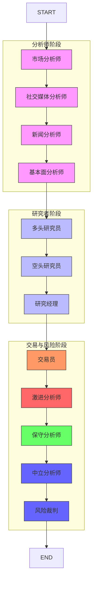

# 工作流引擎

<cite>
**本文档中引用的文件**  
- [trading_graph.py](file://tradingagents/graph/trading_graph.py)
- [conditional_logic.py](file://tradingagents/graph/conditional_logic.py)
- [propagation.py](file://tradingagents/graph/propagation.py)
- [signal_processing.py](file://tradingagents/graph/signal_processing.py)
- [setup.py](file://tradingagents/graph/setup.py)
- [agent_states.py](file://tradingagents/agents/utils/agent_states.py)
- [agent_utils.py](file://tradingagents/agents/utils/agent_utils.py)
</cite>

## 目录
1. [项目结构](#项目结构)
2. [核心组件](#核心组件)
3. [图结构初始化与依赖注入](#图结构初始化与依赖注入)
4. [智能体执行流程与节点注册](#智能体执行流程与节点注册)
5. [条件跳转逻辑](#条件跳转逻辑)
6. [信号传递与状态更新](#信号传递与状态更新)
7. [完整控制流分析](#完整控制流分析)
8. [图结构可视化](#图结构可视化)

## 项目结构

工作流引擎的核心组件位于 `tradingagents/graph/` 目录下，主要由以下模块构成：
- `trading_graph.py`：工作流引擎的主类，负责协调整个框架的执行。
- `setup.py`：负责图结构的配置和构建。
- `conditional_logic.py`：处理图流程中的条件逻辑判断。
- `propagation.py`：负责状态的初始化和传播。
- `signal_processing.py`：处理交易信号以提取可执行的决策信息。
- `reflection.py`：负责决策反思和记忆更新。

**Section sources**
- [trading_graph.py](file://tradingagents/graph/trading_graph.py)
- [setup.py](file://tradingagents/graph/setup.py)
- [conditional_logic.py](file://tradingagents/graph/conditional_logic.py)
- [propagation.py](file://tradingagents/graph/propagation.py)
- [signal_processing.py](file://tradingagents/graph/signal_processing.py)

## 核心组件

工作流引擎基于LangGraph构建，通过定义一个有向无环图（DAG）来组织多个智能体的执行流程。核心组件包括：
- **TradingAgentsGraph**：主协调类，封装了图的初始化、执行和结果处理。
- **GraphSetup**：负责构建图的节点和边，根据配置动态生成工作流。
- **ConditionalLogic**：实现动态路径选择机制，根据智能体的输出决定后续执行分支。
- **Propagator**：负责创建初始状态和传播参数。
- **SignalProcessor**：将最终的交易决策解析为结构化的投资建议。

**Section sources**
- [trading_graph.py](file://tradingagents/graph/trading_graph.py#L1-L50)
- [setup.py](file://tradingagents/graph/setup.py#L1-L20)
- [conditional_logic.py](file://tradingagents/graph/conditional_logic.py#L1-L10)
- [propagation.py](file://tradingagents/graph/propagation.py#L1-L10)
- [signal_processing.py](file://tradingagents/graph/signal_processing.py#L1-L10)

## 图结构初始化与依赖注入

`setup.py` 文件中的 `GraphSetup` 类负责图的初始化和依赖注入。在 `TradingAgentsGraph` 的初始化过程中，会创建 `GraphSetup` 实例，并将所需的组件（如LLM、工具包、内存、条件逻辑等）作为依赖注入。

**Diagram sources**
- [setup.py](file://tradingagents/graph/setup.py#L14-L248)

**Section sources**
- [setup.py](file://tradingagents/graph/setup.py#L1-L250)

## 智能体执行流程与节点注册

`trading_graph.py` 中的 `TradingAgentsGraph` 类通过 `setup_graph` 方法注册智能体节点并连接边。执行流程如下：

1. **初始化LLM**：根据配置选择不同的LLM提供商（如OpenAI、Anthropic、Google、DashScope、DeepSeek）。
2. **创建工具节点**：为每个分析师类型（市场、社交媒体、新闻、基本面）创建工具节点，这些节点封装了数据获取工具。
3. **注册节点**：在 `setup_graph` 方法中，根据 `selected_analysts` 参数动态注册分析师节点、研究者节点、风险分析师节点等。
4. **连接边**：按照预定义的顺序连接节点，形成一个从分析师到研究者再到交易员的线性流程。

**Diagram sources**
- [setup.py](file://tradingagents/graph/setup.py#L46-L248)

**Section sources**
- [trading_graph.py](file://tradingagents/graph/trading_graph.py#L32-L325)
- [setup.py](file://tradingagents/graph/setup.py#L46-L248)

## 条件跳转逻辑

`conditional_logic.py` 文件实现了动态路径选择机制。`ConditionalLogic` 类包含多个方法，用于根据智能体的输出决定是否需要调用工具或继续执行。

- `should_continue_market`、`should_continue_social`、`should_continue_news`、`should_continue_fundamentals`：这些方法检查当前消息中是否有工具调用请求，如果有，则返回对应的工具节点，否则继续下一个步骤。
- `should_continue_debate`：控制多头和空头研究员之间的辩论流程，当辩论轮数达到最大值时，将控制权交给研究经理。
- `should_continue_risk_analysis`：控制风险分析师之间的讨论流程，当讨论轮数达到最大值时，将控制权交给风险裁判。

**Diagram sources**
- [conditional_logic.py](file://tradingagents/graph/conditional_logic.py#L5-L66)

**Section sources**
- [conditional_logic.py](file://tradingagents/graph/conditional_logic.py#L5-L66)

## 信号传递与状态更新

`propagation.py` 和 `signal_processing.py` 文件负责信号传递与状态更新。

- `Propagator` 类在 `propagation.py` 中定义，负责创建初始状态和获取图调用参数。`create_initial_state` 方法初始化包含公司名称、交易日期、辩论状态等的初始状态字典。
- `SignalProcessor` 类在 `signal_processing.py` 中定义，负责处理最终的交易信号。`process_signal` 方法使用LLM从交易员的分析报告中提取结构化的投资决策信息，包括行动（买入/持有/卖出）、目标价格、置信度、风险评分和推理摘要。

**Diagram sources**
- [propagation.py](file://tradingagents/graph/propagation.py#L10-L48)
- [signal_processing.py](file://tradingagents/graph/signal_processing.py#L5-L280)

**Section sources**
- [propagation.py](file://tradingagents/graph/propagation.py#L10-L48)
- [signal_processing.py](file://tradingagents/graph/signal_processing.py#L5-L280)

## 完整控制流分析

从用户请求到最终报告生成的完整控制流如下：

1. **初始化**：创建 `TradingAgentsGraph` 实例，注入LLM、工具包、内存等依赖。
2. **状态初始化**：调用 `propagate` 方法，使用 `Propagator` 创建初始状态。
3. **执行图流程**：调用 `graph.invoke` 方法，按照图的定义执行智能体。
4. **条件跳转**：在每个分析师节点，根据 `ConditionalLogic` 的判断决定是否调用工具。
5. **辩论与决策**：多头和空头研究员进行辩论，研究经理做出最终投资决策。
6. **风险分析**：风险分析师团队进行风险评估，风险裁判做出最终风险决策。
7. **信号处理**：使用 `SignalProcessor` 处理最终的交易决策，提取结构化的投资建议。
8. **日志记录**：将最终状态记录到JSON文件中。

**Section sources**
- [trading_graph.py](file://tradingagents/graph/trading_graph.py#L228-L261)
- [propagation.py](file://tradingagents/graph/propagation.py#L17-L41)
- [signal_processing.py](file://tradingagents/graph/signal_processing.py#L12-L168)

## 图结构可视化

以下是工作流引擎的完整图结构可视化：

**Diagram sources**
- [setup.py](file://tradingagents/graph/setup.py#L46-L248)
- [trading_graph.py](file://tradingagents/graph/trading_graph.py#L32-L325)

**Section sources**
- [setup.py](file://tradingagents/graph/setup.py#L46-L248)
- [trading_graph.py](file://tradingagents/graph/trading_graph.py#L32-L325)