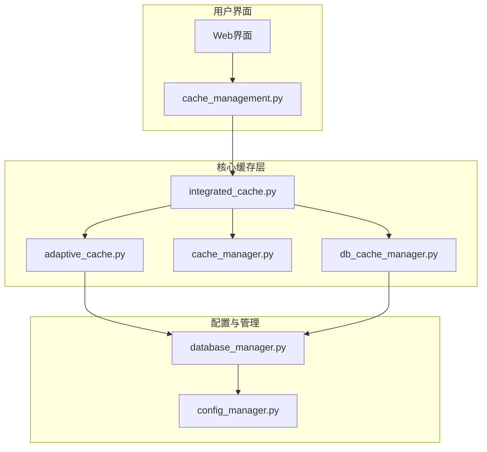
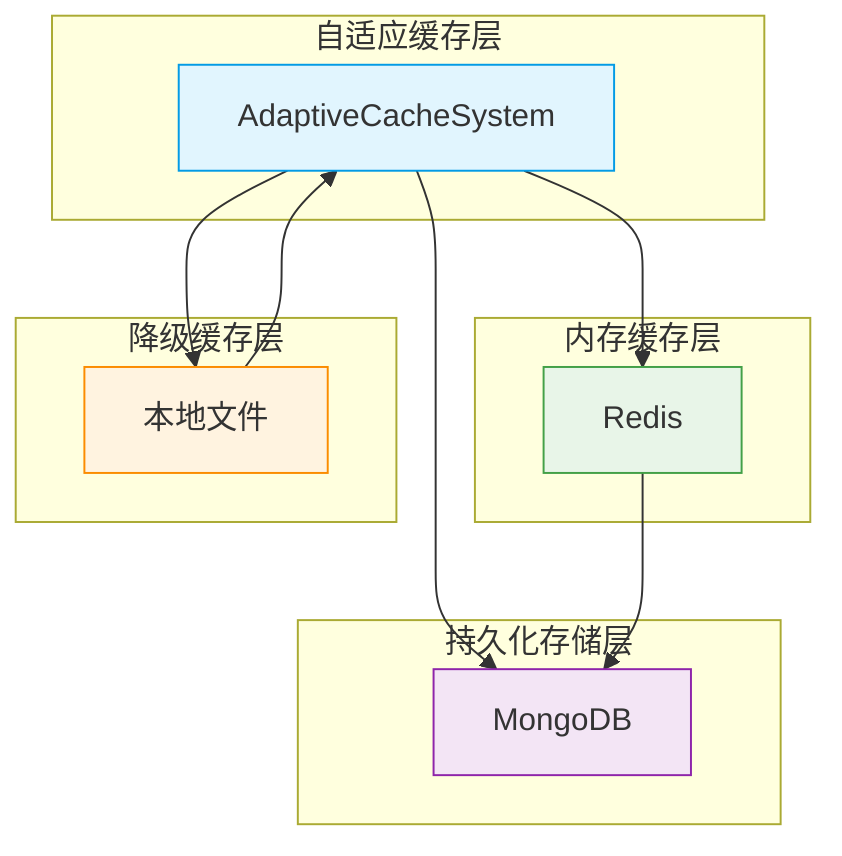
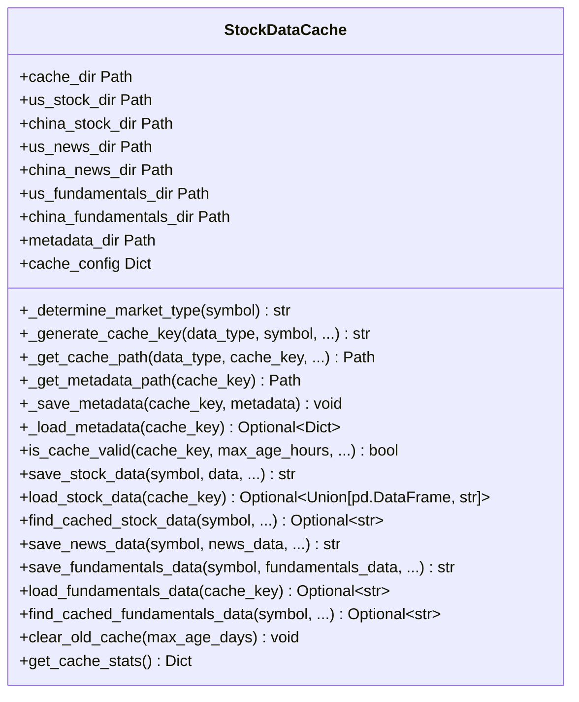
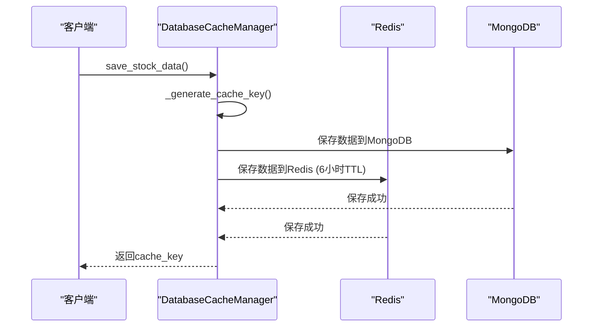
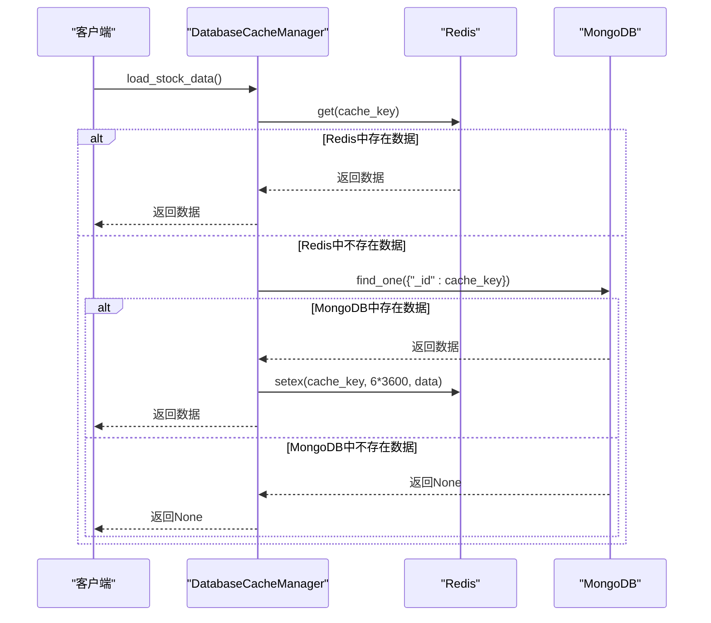
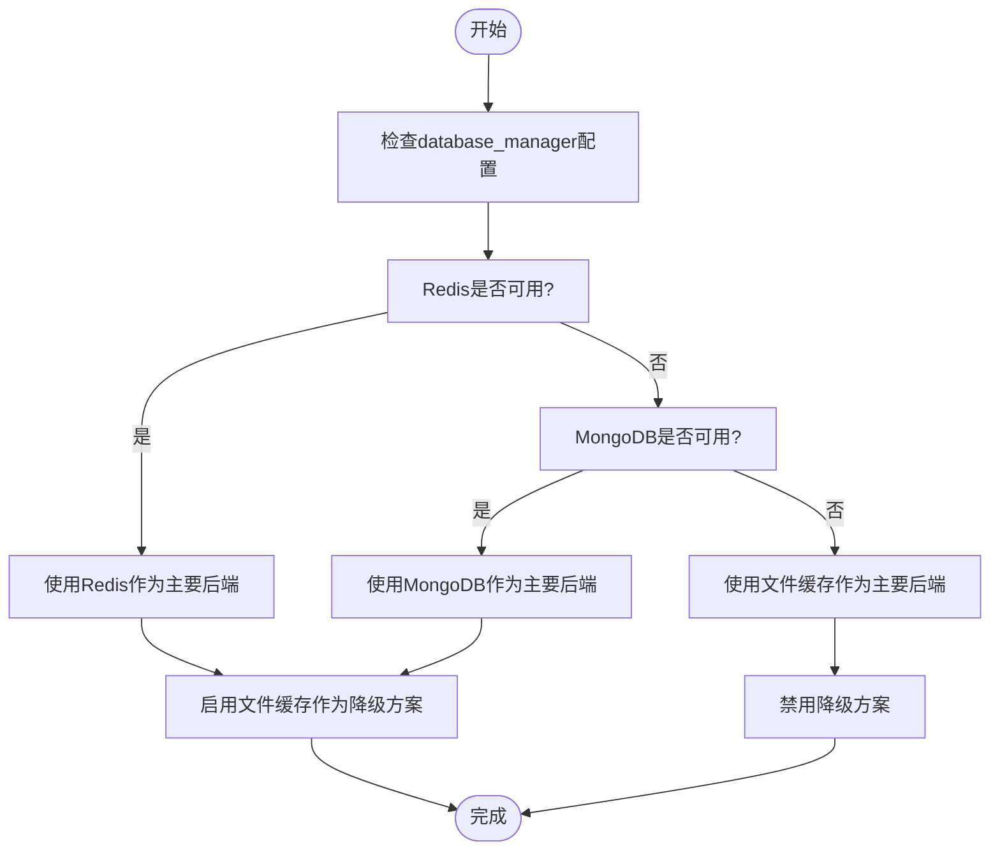
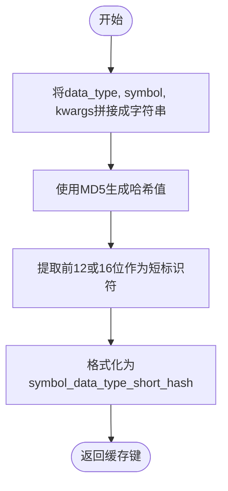
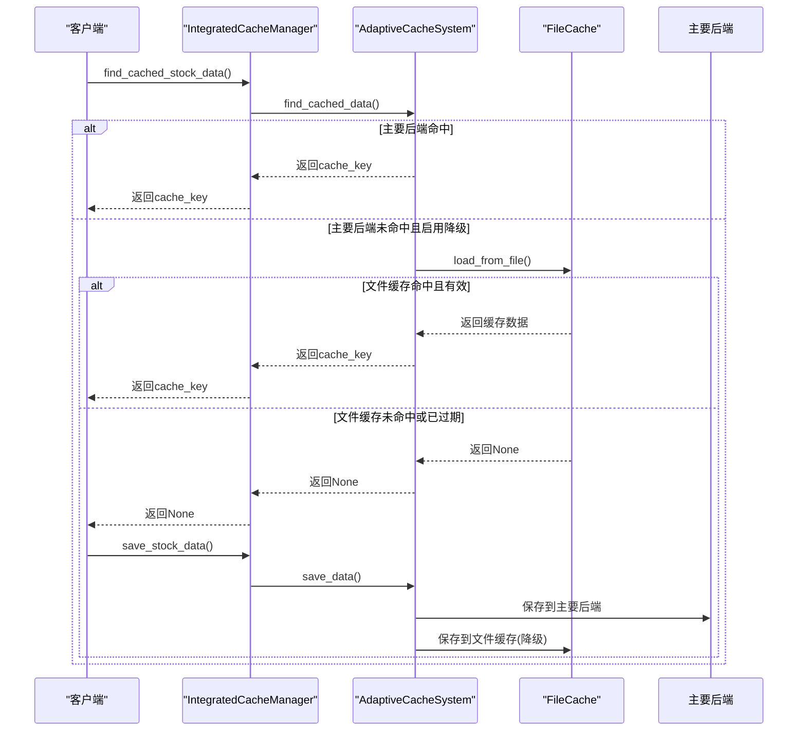
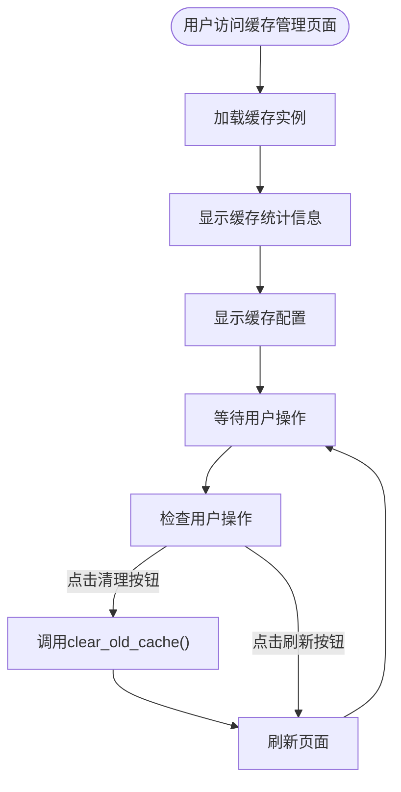
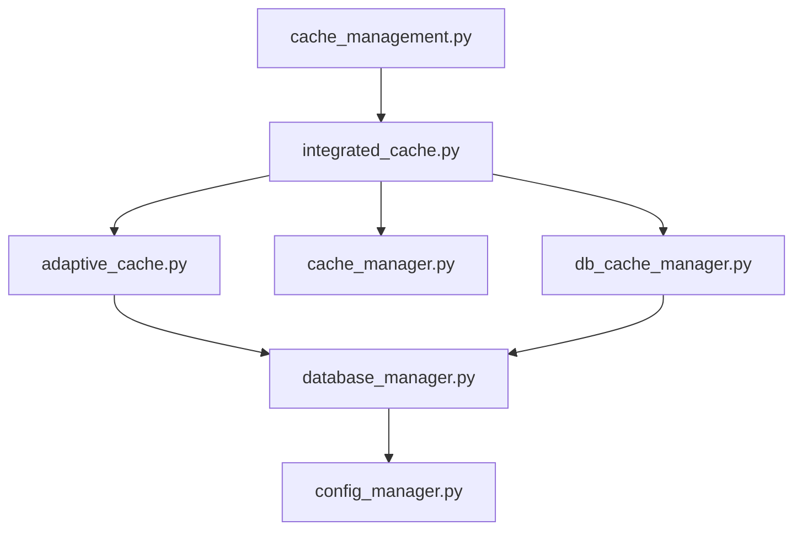

# 缓存系统

<cite>
**本文档引用的文件**   
- [cache_manager.py](file://tradingagents/dataflows/cache_manager.py)
- [db_cache_manager.py](file://tradingagents/dataflows/db_cache_manager.py)
- [adaptive_cache.py](file://tradingagents/dataflows/adaptive_cache.py)
- [integrated_cache.py](file://tradingagents/dataflows/integrated_cache.py)
- [cache_management.py](file://web/pages/cache_management.py)
- [database_manager.py](file://tradingagents/config/database_manager.py)
</cite>

## 目录
1. [简介](#简介)
2. [项目结构](#项目结构)
3. [核心组件](#核心组件)
4. [架构概述](#架构概述)
5. [详细组件分析](#详细组件分析)
6. [依赖分析](#依赖分析)
7. [性能考虑](#性能考虑)
8. [故障排除指南](#故障排除指南)
9. [结论](#结论)
10. [附录](#附录)（如有必要）

## 简介
本文档全面文档化了三级缓存体系架构，详细描述了`cache_manager.py`实现的本地文件缓存机制与Redis内存缓存的协同工作流程，包括缓存键生成策略、TTL设置与自动失效逻辑。深入解析了`db_cache_manager.py`中基于MongoDB的持久化存储设计，说明其如何保障数据长期可用性。结合`adaptive_cache.py`说明自适应缓存策略（如热点数据识别与预加载）。通过实际调用链路展示数据查询时的缓存命中判断、逐层回源与写入过程。提供缓存清理接口（如web界面中的缓存管理功能）的实现原理与使用示例。

## 项目结构
本项目采用分层模块化设计，核心缓存功能分布在`tradingagents/dataflows`目录下，通过`web/pages`目录下的页面提供用户交互界面。系统通过`tradingagents/config`目录下的配置管理器协调各组件，形成一个完整的三级缓存体系。



**Diagram sources**
- [cache_management.py](file://web/pages/cache_management.py)
- [integrated_cache.py](file://tradingagents/dataflows/integrated_cache.py)
- [adaptive_cache.py](file://tradingagents/dataflows/adaptive_cache.py)
- [cache_manager.py](file://tradingagents/dataflows/cache_manager.py)
- [db_cache_manager.py](file://tradingagents/dataflows/db_cache_manager.py)
- [database_manager.py](file://tradingagents/config/database_manager.py)

**Section sources**
- [cache_management.py](file://web/pages/cache_management.py)
- [integrated_cache.py](file://tradingagents/dataflows/integrated_cache.py)
- [adaptive_cache.py](file://tradingagents/dataflows/adaptive_cache.py)
- [cache_manager.py](file://tradingagents/dataflows/cache_manager.py)
- [db_cache_manager.py](file://tradingagents/dataflows/db_cache_manager.py)
- [database_manager.py](file://tradingagents/config/database_manager.py)

## 核心组件
三级缓存体系由`integrated_cache.py`作为统一入口，协调`adaptive_cache.py`、`cache_manager.py`和`db_cache_manager.py`三个核心组件。`cache_manager.py`负责本地文件缓存，`db_cache_manager.py`负责Redis内存缓存和MongoDB持久化存储，`adaptive_cache.py`根据系统配置和数据库可用性智能选择最佳缓存策略。`database_manager.py`作为配置中心，决定缓存后端的优先级和可用性。

**Section sources**
- [integrated_cache.py](file://tradingagents/dataflows/integrated_cache.py)
- [adaptive_cache.py](file://tradingagents/dataflows/adaptive_cache.py)
- [cache_manager.py](file://tradingagents/dataflows/cache_manager.py)
- [db_cache_manager.py](file://tradingagents/dataflows/db_cache_manager.py)
- [database_manager.py](file://tradingagents/config/database_manager.py)

## 架构概述
系统采用三级缓存架构，从上至下分别为：自适应缓存层、内存缓存层和持久化存储层。自适应缓存层根据`database_manager.py`提供的配置信息，智能选择使用Redis内存缓存、MongoDB持久化存储或本地文件缓存。内存缓存层由`db_cache_manager.py`实现，利用Redis提供毫秒级响应速度。持久化存储层同样由`db_cache_manager.py`实现，利用MongoDB保障数据长期可用性。本地文件缓存作为降级方案，由`cache_manager.py`实现，确保在数据库不可用时系统仍能正常运行。



**Diagram sources**
- [adaptive_cache.py](file://tradingagents/dataflows/adaptive_cache.py)
- [db_cache_manager.py](file://tradingagents/dataflows/db_cache_manager.py)
- [cache_manager.py](file://tradingagents/dataflows/cache_manager.py)

## 详细组件分析

### 本地文件缓存机制分析
`cache_manager.py`实现了本地文件缓存机制，通过将数据序列化为CSV或文本文件存储在本地磁盘，减少对API的调用次数，提高响应速度。该机制支持美股和A股数据的分类存储，并为不同类型的数据设置不同的TTL（Time To Live）。

#### 本地文件缓存类图


**Diagram sources**
- [cache_manager.py](file://tradingagents/dataflows/cache_manager.py)

**Section sources**
- [cache_manager.py](file://tradingagents/dataflows/cache_manager.py)

### Redis与MongoDB协同工作流程分析
`db_cache_manager.py`实现了Redis内存缓存和MongoDB持久化存储的协同工作。当数据被写入时，系统会同时将数据写入Redis和MongoDB。当数据被读取时，系统会优先从Redis读取，如果Redis中没有，则从MongoDB读取，并将数据回填到Redis中，实现缓存穿透的自动修复。

#### 数据写入流程


**Diagram sources**
- [db_cache_manager.py](file://tradingagents/dataflows/db_cache_manager.py)

#### 数据读取流程


**Diagram sources**
- [db_cache_manager.py](file://tradingagents/dataflows/db_cache_manager.py)

**Section sources**
- [db_cache_manager.py](file://tradingagents/dataflows/db_cache_manager.py)

### 自适应缓存策略分析
`adaptive_cache.py`实现了自适应缓存策略，根据`database_manager.py`提供的配置信息，智能选择最佳的缓存后端。系统会优先使用Redis作为主要缓存后端，如果Redis不可用，则使用MongoDB，如果两者都不可用，则降级到本地文件缓存。

#### 自适应缓存决策流程


**Diagram sources**
- [adaptive_cache.py](file://tradingagents/dataflows/adaptive_cache.py)
- [database_manager.py](file://tradingagents/config/database_manager.py)

**Section sources**
- [adaptive_cache.py](file://tradingagents/dataflows/adaptive_cache.py)
- [database_manager.py](file://tradingagents/config/database_manager.py)

### 缓存键生成策略分析
系统采用统一的缓存键生成策略，通过`_generate_cache_key`方法生成唯一的缓存键。该方法将数据类型、股票代码和所有参数组合成一个字符串，然后使用MD5哈希算法生成12位或16位的短标识符，确保缓存键的唯一性和可读性。

#### 缓存键生成流程


**Diagram sources**
- [cache_manager.py](file://tradingagents/dataflows/cache_manager.py)
- [db_cache_manager.py](file://tradingagents/dataflows/db_cache_manager.py)

**Section sources**
- [cache_manager.py](file://tradingagents/dataflows/cache_manager.py)
- [db_cache_manager.py](file://tradingagents/dataflows/db_cache_manager.py)

### TTL设置与自动失效逻辑分析
系统为不同类型的数据设置了不同的TTL（Time To Live），确保数据的时效性。`cache_manager.py`中的`cache_config`字典定义了各类数据的TTL，如美股数据缓存2小时，A股数据缓存1小时。系统通过`is_cache_valid`方法检查缓存的有效性，自动失效过期的缓存。

#### TTL配置表
| 数据类型 | 市场类型 | TTL（小时） | 描述 |
| :--- | :--- | :--- | :--- |
| stock_data | us | 2 | 美股历史数据 |
| stock_data | china | 1 | A股历史数据 |
| news | us | 6 | 美股新闻数据 |
| news | china | 4 | A股新闻数据 |
| fundamentals | us | 24 | 美股基本面数据 |
| fundamentals | china | 12 | A股基本面数据 |

**Section sources**
- [cache_manager.py](file://tradingagents/dataflows/cache_manager.py)

### 数据查询时的缓存命中判断、逐层回源与写入过程分析
当系统需要查询数据时，会按照自适应缓存策略逐层判断缓存命中情况。如果在主要后端命中，则直接返回数据；如果未命中，则尝试从降级后端加载；如果所有后端都未命中，则从数据源获取数据并逐层写入缓存。

#### 数据查询与写入流程


**Diagram sources**
- [integrated_cache.py](file://tradingagents/dataflows/integrated_cache.py)
- [adaptive_cache.py](file://tradingagents/dataflows/adaptive_cache.py)
- [cache_manager.py](file://tradingagents/dataflows/cache_manager.py)

**Section sources**
- [integrated_cache.py](file://tradingagents/dataflows/integrated_cache.py)
- [adaptive_cache.py](file://tradingagents/dataflows/adaptive_cache.py)
- [cache_manager.py](file://tradingagents/dataflows/cache_manager.py)

### 缓存清理接口实现原理与使用示例分析
`web/pages/cache_management.py`实现了缓存清理接口，用户可以通过Web界面查看缓存统计信息、清理过期缓存。该页面通过调用`cache_manager.py`的`clear_old_cache`方法实现缓存清理功能。

#### 缓存管理页面流程


**Diagram sources**
- [cache_management.py](file://web/pages/cache_management.py)
- [cache_manager.py](file://tradingagents/dataflows/cache_manager.py)

#### 缓存清理使用示例
```python
# 获取缓存实例
cache = get_cache()

# 清理7天前的过期缓存
cache.clear_old_cache(max_age_days=7)

# 获取缓存统计信息
stats = cache.get_cache_stats()
print(f"总文件数: {stats['total_files']}")
print(f"总大小: {stats['total_size_mb']} MB")
```

**Section sources**
- [cache_management.py](file://web/pages/cache_management.py)
- [cache_manager.py](file://tradingagents/dataflows/cache_manager.py)

## 依赖分析
系统各组件之间存在明确的依赖关系。`integrated_cache.py`作为统一入口，依赖`adaptive_cache.py`、`cache_manager.py`和`db_cache_manager.py`。`adaptive_cache.py`依赖`database_manager.py`获取配置信息。`db_cache_manager.py`依赖`pymongo`和`redis`库。`cache_management.py`作为Web界面，依赖`integrated_cache.py`提供的缓存管理功能。



**Diagram sources**
- [integrated_cache.py](file://tradingagents/dataflows/integrated_cache.py)
- [adaptive_cache.py](file://tradingagents/dataflows/adaptive_cache.py)
- [cache_manager.py](file://tradingagents/dataflows/cache_manager.py)
- [db_cache_manager.py](file://tradingagents/dataflows/db_cache_manager.py)
- [database_manager.py](file://tradingagents/config/database_manager.py)
- [cache_management.py](file://web/pages/cache_management.py)

## 性能考虑
三级缓存体系通过分层设计优化了系统性能。自适应缓存层根据数据库可用性智能选择最佳缓存策略，确保在不同环境下都能提供最优性能。内存缓存层利用Redis提供毫秒级响应速度，显著提升了数据读取性能。持久化存储层利用MongoDB保障数据长期可用性，避免了数据丢失风险。本地文件缓存作为降级方案，确保在数据库不可用时系统仍能正常运行，提高了系统的可用性和容错能力。

## 故障排除指南
当缓存系统出现问题时，可以按照以下步骤进行排查：
1. 检查`database_manager.py`的配置，确认Redis和MongoDB的连接信息是否正确。
2. 检查`cache_manager.py`的缓存目录是否存在，是否有读写权限。
3. 检查`adaptive_cache.py`的日志，确认自适应缓存策略是否正常工作。
4. 使用`cache_management.py`提供的Web界面查看缓存统计信息，确认缓存是否正常工作。
5. 如果问题仍然存在，可以尝试清理缓存并重启系统。

**Section sources**
- [database_manager.py](file://tradingagents/config/database_manager.py)
- [cache_manager.py](file://tradingagents/dataflows/cache_manager.py)
- [adaptive_cache.py](file://tradingagents/dataflows/adaptive_cache.py)
- [cache_management.py](file://web/pages/cache_management.py)

## 结论
本文档全面文档化了三级缓存体系架构，详细描述了`cache_manager.py`实现的本地文件缓存机制与Redis内存缓存的协同工作流程，包括缓存键生成策略、