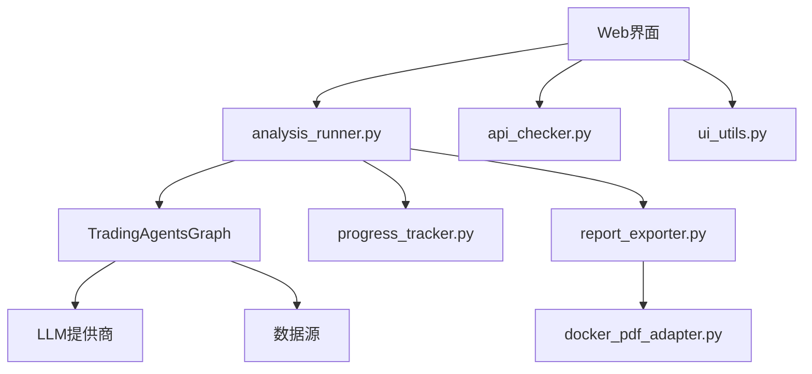
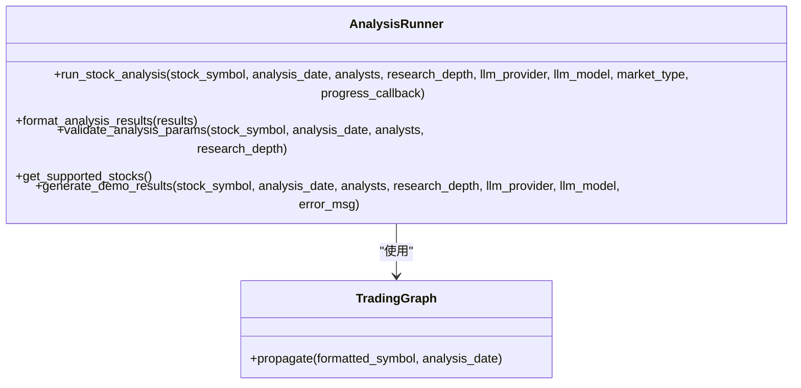
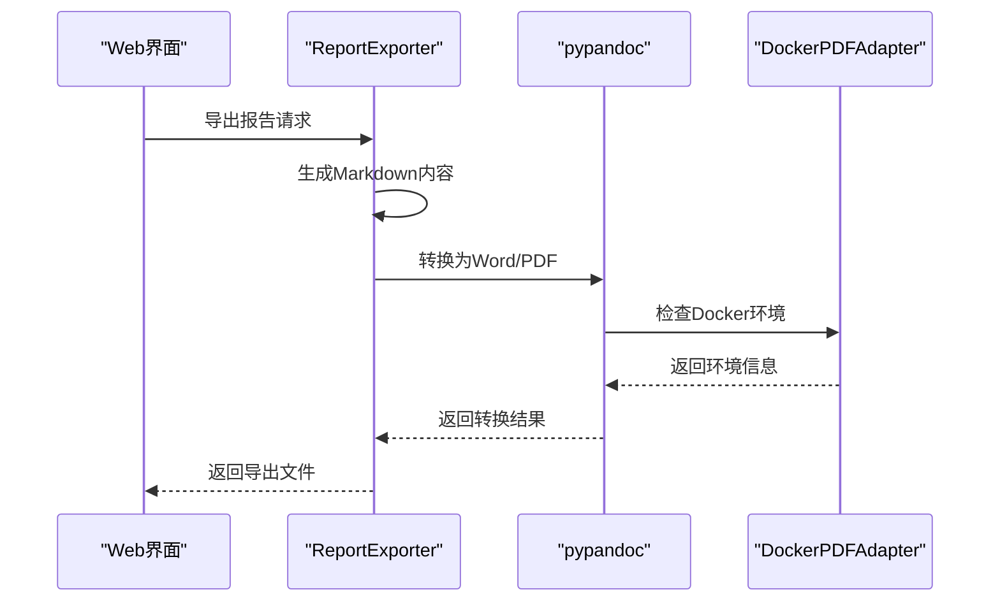
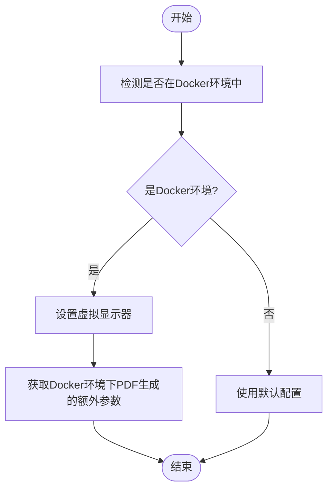
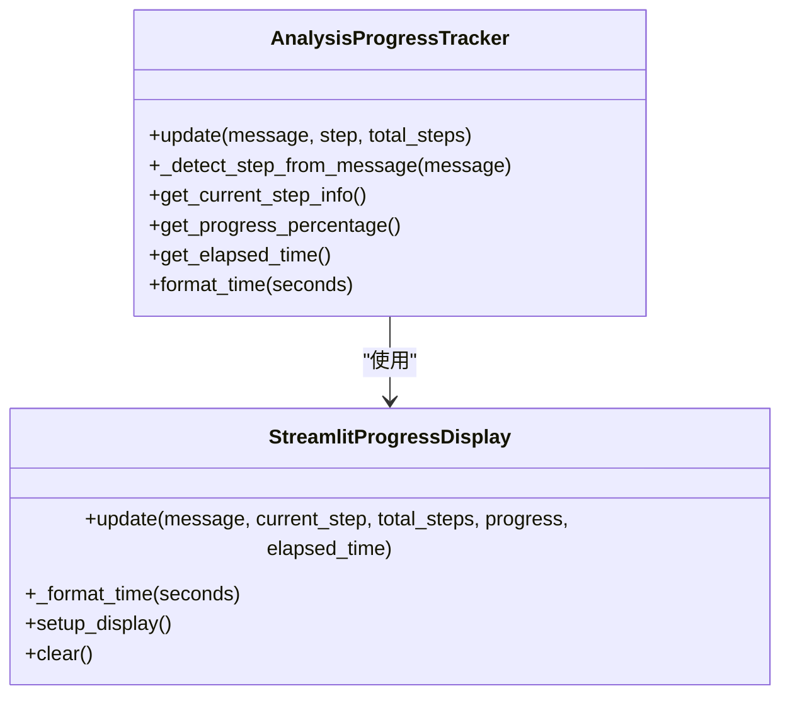
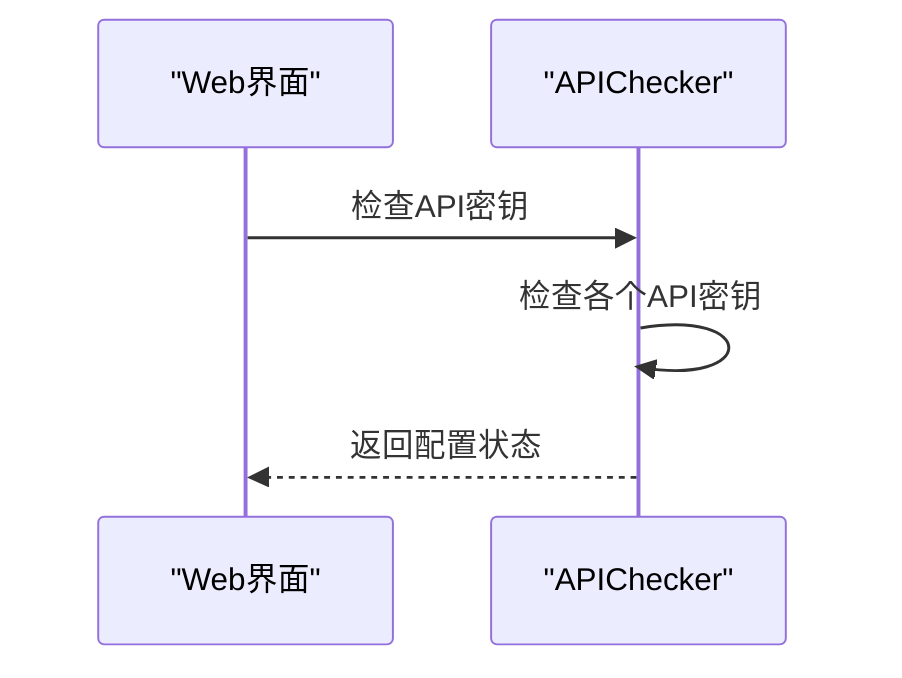
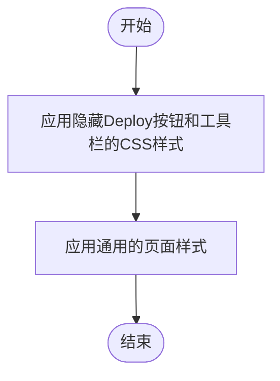
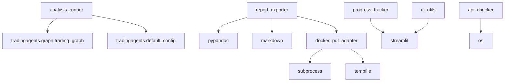

# 工具集成

<cite>
**本文档引用的文件**   
- [analysis_runner.py](file://web/utils/analysis_runner.py)
- [report_exporter.py](file://web/utils/report_exporter.py)
- [docker_pdf_adapter.py](file://web/utils/docker_pdf_adapter.py)
- [progress_tracker.py](file://web/utils/progress_tracker.py)
- [api_checker.py](file://web/utils/api_checker.py)
- [ui_utils.py](file://web/utils/ui_utils.py)
</cite>

## 目录
1. [简介](#简介)
2. [核心组件](#核心组件)
3. [架构概述](#架构概述)
4. [详细组件分析](#详细组件分析)
5. [依赖分析](#依赖分析)
6. [性能考虑](#性能考虑)
7. [故障排除指南](#故障排除指南)
8. [结论](#结论)

## 简介
本工具集成文档全面解析了Web界面与后端系统的协作机制。重点说明了`analysis_runner.py`如何封装CLI功能，实现Web请求到多智能体分析任务的转换与异步执行管理。详细描述了`report_exporter.py`支持的报告导出流程，包括Markdown到PDF/Word的转换逻辑，以及`docker_pdf_adapter.py`在Docker环境中处理文档转换的适配机制。阐述了`progress_tracker.py`提供的分析进度追踪功能，支持实时状态更新与中断恢复。说明了`api_checker.py`对LLM和数据源API可用性的检测逻辑，确保前端操作的可靠性。介绍了`ui_utils.py`中封装的通用UI工具函数，如消息提示、加载动画控制等。文档包含集成错误处理策略，如任务超时、PDF转换失败的降级方案，并提供自定义扩展接口说明。

## 核心组件

`analysis_runner.py`模块是Web界面与后端分析引擎之间的核心桥梁。它封装了命令行接口（CLI）的功能，将Web界面的用户请求转换为后端多智能体分析任务。该模块通过`run_stock_analysis`函数接收股票代码、分析日期、分析师列表、研究深度、LLM提供商和模型等参数，执行完整的股票分析流程。分析过程包括环境检查、参数配置、目录创建、引擎初始化、数据获取、技术分析、基本面分析、情绪分析、AI推理和结果整理等多个步骤。模块还实现了进度跟踪和Token使用估算功能，确保分析过程的透明性和成本可控性。当真实分析失败时，模块会生成模拟数据用于演示，保证用户体验的连续性。

`report_exporter.py`模块负责将分析结果导出为多种格式，包括Markdown、Word和PDF。该模块通过`ReportExporter`类实现，支持在Docker环境中进行PDF生成。模块首先生成Markdown格式的报告，然后使用pypandoc库将其转换为Word或PDF格式。在Docker环境中，模块会自动检测并初始化PDF支持，确保文档转换的顺利进行。模块还提供了详细的错误处理和解决方案，帮助用户解决导出过程中可能遇到的问题。

`docker_pdf_adapter.py`模块是Docker环境中的PDF导出适配器，处理Docker容器中的PDF生成特殊需求。该模块通过`is_docker_environment`函数检测是否在Docker环境中运行，并通过`setup_xvfb_display`函数设置虚拟显示器，确保PDF生成的正常进行。模块还提供了`get_docker_pdf_extra_args`函数，获取Docker环境下PDF生成的额外参数，优化PDF生成过程。

`progress_tracker.py`模块提供了分析进度跟踪功能，支持实时状态更新与中断恢复。该模块通过`AnalysisProgressTracker`类实现，定义了分析过程中的各个步骤，并通过`update`函数更新进度。模块还提供了`StreamlitProgressDisplay`类，用于在Streamlit界面中显示进度条和状态信息，提升用户体验。

`api_checker.py`模块负责检测LLM和数据源API的可用性，确保前端操作的可靠性。该模块通过`check_api_keys`函数检查所有必要的API密钥是否已配置，并返回详细的配置状态。模块还提供了`get_api_key_status_message`函数，获取API密钥状态消息，帮助用户快速了解配置情况。

`ui_utils.py`模块封装了通用的UI工具函数，如消息提示、加载动画控制等。该模块通过`apply_hide_deploy_button_css`函数应用隐藏Deploy按钮和工具栏的CSS样式，确保一致的UI体验。模块还提供了`apply_common_styles`函数，应用通用的页面样式，包括隐藏Deploy按钮和其他美化样式。

**Section sources**
- [analysis_runner.py](file://web/utils/analysis_runner.py#L1-L650)
- [report_exporter.py](file://web/utils/report_exporter.py#L1-L678)
- [docker_pdf_adapter.py](file://web/utils/docker_pdf_adapter.py#L1-L235)
- [progress_tracker.py](file://web/utils/progress_tracker.py#L1-L182)
- [api_checker.py](file://web/utils/api_checker.py#L1-L115)
- [ui_utils.py](file://web/utils/ui_utils.py#L1-L140)

## 架构概述

**Diagram sources **
- [analysis_runner.py](file://web/utils/analysis_runner.py#L1-L650)
- [report_exporter.py](file://web/utils/report_exporter.py#L1-L678)
- [docker_pdf_adapter.py](file://web/utils/docker_pdf_adapter.py#L1-L235)
- [progress_tracker.py](file://web/utils/progress_tracker.py#L1-L182)
- [api_checker.py](file://web/utils/api_checker.py#L1-L115)
- [ui_utils.py](file://web/utils/ui_utils.py#L1-L140)

## 详细组件分析

### analysis_runner.py 分析
`analysis_runner.py`模块是Web界面与后端分析引擎之间的核心桥梁。它封装了命令行接口（CLI）的功能，将Web界面的用户请求转换为后端多智能体分析任务。该模块通过`run_stock_analysis`函数接收股票代码、分析日期、分析师列表、研究深度、LLM提供商和模型等参数，执行完整的股票分析流程。分析过程包括环境检查、参数配置、目录创建、引擎初始化、数据获取、技术分析、基本面分析、情绪分析、AI推理和结果整理等多个步骤。模块还实现了进度跟踪和Token使用估算功能，确保分析过程的透明性和成本可控性。当真实分析失败时，模块会生成模拟数据用于演示，保证用户体验的连续性。

#### 对象导向组件

**Diagram sources **
- [analysis_runner.py](file://web/utils/analysis_runner.py#L1-L650)

### report_exporter.py 分析
`report_exporter.py`模块负责将分析结果导出为多种格式，包括Markdown、Word和PDF。该模块通过`ReportExporter`类实现，支持在Docker环境中进行PDF生成。模块首先生成Markdown格式的报告，然后使用pypandoc库将其转换为Word或PDF格式。在Docker环境中，模块会自动检测并初始化PDF支持，确保文档转换的顺利进行。模块还提供了详细的错误处理和解决方案，帮助用户解决导出过程中可能遇到的问题。

#### API/服务组件

**Diagram sources **
- [report_exporter.py](file://web/utils/report_exporter.py#L1-L678)
- [docker_pdf_adapter.py](file://web/utils/docker_pdf_adapter.py#L1-L235)

### docker_pdf_adapter.py 分析
`docker_pdf_adapter.py`模块是Docker环境中的PDF导出适配器，处理Docker容器中的PDF生成特殊需求。该模块通过`is_docker_environment`函数检测是否在Docker环境中运行，并通过`setup_xvfb_display`函数设置虚拟显示器，确保PDF生成的正常进行。模块还提供了`get_docker_pdf_extra_args`函数，获取Docker环境下PDF生成的额外参数，优化PDF生成过程。

#### 复杂逻辑组件

**Diagram sources **
- [docker_pdf_adapter.py](file://web/utils/docker_pdf_adapter.py#L1-L235)

### progress_tracker.py 分析
`progress_tracker.py`模块提供了分析进度跟踪功能，支持实时状态更新与中断恢复。该模块通过`AnalysisProgressTracker`类实现，定义了分析过程中的各个步骤，并通过`update`函数更新进度。模块还提供了`StreamlitProgressDisplay`类，用于在Streamlit界面中显示进度条和状态信息，提升用户体验。

#### 对象导向组件

**Diagram sources **
- [progress_tracker.py](file://web/utils/progress_tracker.py#L1-L182)

### api_checker.py 分析
`api_checker.py`模块负责检测LLM和数据源API的可用性，确保前端操作的可靠性。该模块通过`check_api_keys`函数检查所有必要的API密钥是否已配置，并返回详细的配置状态。模块还提供了`get_api_key_status_message`函数，获取API密钥状态消息，帮助用户快速了解配置情况。

#### API/服务组件

**Diagram sources **
- [api_checker.py](file://web/utils/api_checker.py#L1-L115)

### ui_utils.py 分析
`ui_utils.py`模块封装了通用的UI工具函数，如消息提示、加载动画控制等。该模块通过`apply_hide_deploy_button_css`函数应用隐藏Deploy按钮和工具栏的CSS样式，确保一致的UI体验。模块还提供了`apply_common_styles`函数，应用通用的页面样式，包括隐藏Deploy按钮和其他美化样式。

#### 复杂逻辑组件

**Diagram sources **
- [ui_utils.py](file://web/utils/ui_utils.py#L1-L140)

**Section sources**
- [analysis_runner.py](file://web/utils/analysis_runner.py#L1-L650)
- [report_exporter.py](file://web/utils/report_exporter.py#L1-L678)
- [docker_pdf_adapter.py](file://web/utils/docker_pdf_adapter.py#L1-L235)
- [progress_tracker.py](file://web/utils/progress_tracker.py#L1-L182)
- [api_checker.py](file://web/utils/api_checker.py#L1-L115)
- [ui_utils.py](file://web/utils/ui_utils.py#L1-L140)

## 依赖分析

**Diagram sources **
- [analysis_runner.py](file://web/utils/analysis_runner.py#L1-L650)
- [report_exporter.py](file://web/utils/report_exporter.py#L1-L6