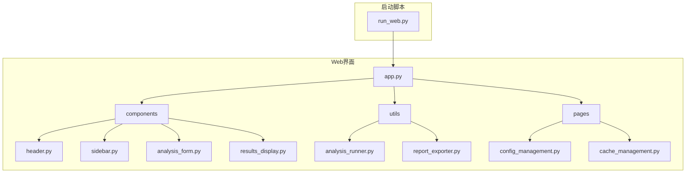
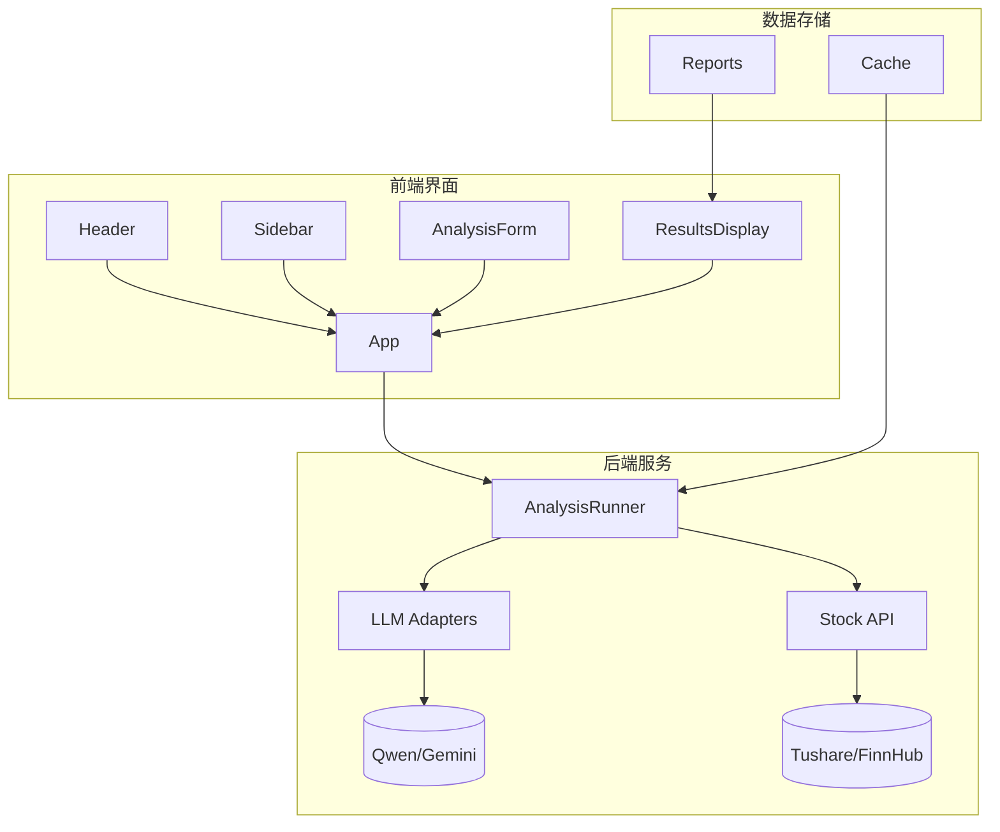
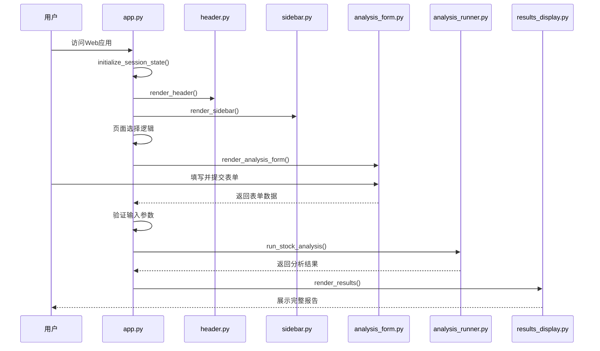
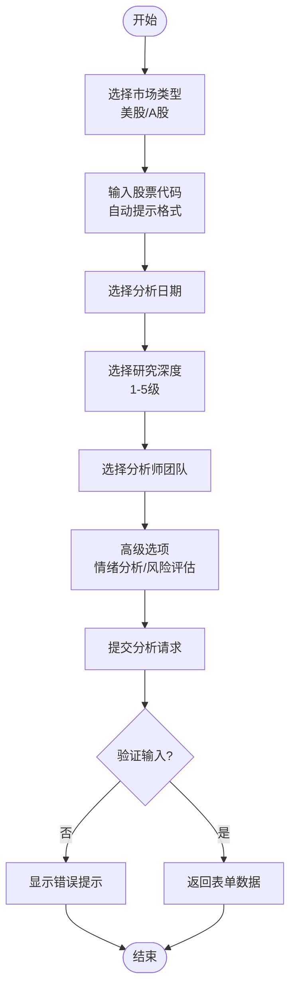
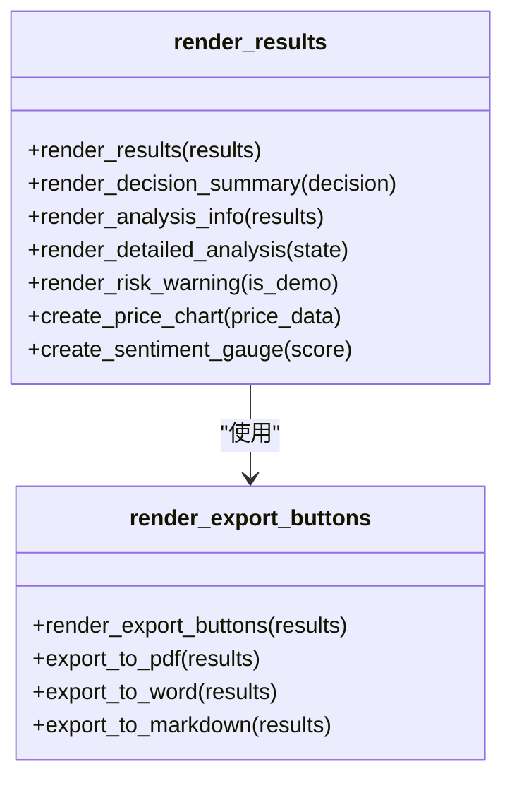
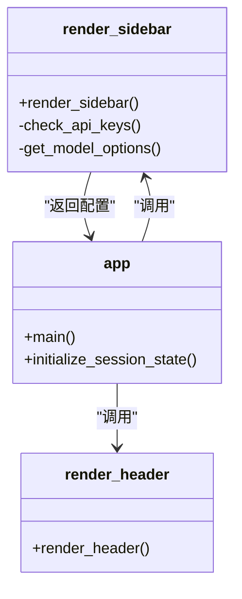
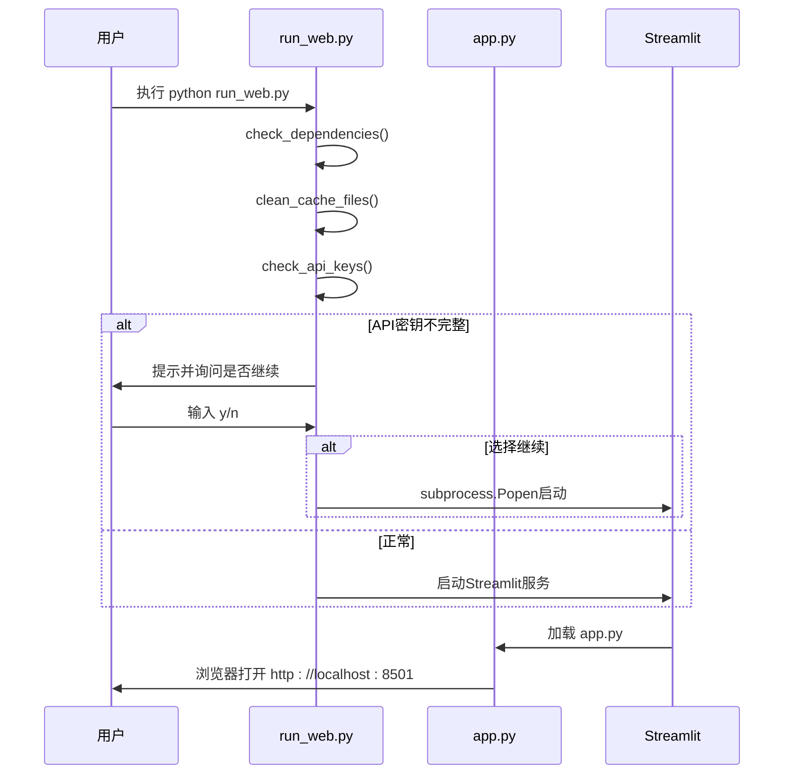
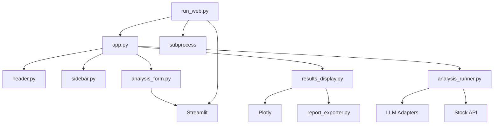

# 核心界面

<cite>
**本文档引用的文件**  
- [app.py](file://web/app.py)
- [analysis_form.py](file://web/components/analysis_form.py)
- [results_display.py](file://web/components/results_display.py)
- [header.py](file://web/components/header.py)
- [sidebar.py](file://web/components/sidebar.py)
- [run_web.py](file://web/run_web.py)
</cite>

## 目录
1. [简介](#简介)
2. [项目结构](#项目结构)
3. [核心组件](#核心组件)
4. [架构概览](#架构概览)
5. [详细组件分析](#详细组件分析)
6. [依赖分析](#依赖分析)
7. [性能考虑](#性能考虑)
8. [故障排除指南](#故障排除指南)
9. [结论](#结论)

## 简介
本文档详细描述基于Streamlit构建的主交互界面，涵盖页面结构、用户交互流程、表单设计、结果渲染及系统启动机制。重点解析`app.py`中的路由与会话状态管理，`analysis_form.py`的参数输入逻辑，`results_display.py`的报告展示与导出功能，以及`header.py`和`sidebar.py`的全局导航与配置功能。同时说明`run_web.py`的Web服务启动流程，并提供端到端操作示例与常见问题排查方法。

## 项目结构
本项目采用模块化设计，Web界面相关代码集中于`web/`目录下，核心组件分离为独立模块以提升可维护性。

**图示来源**  
- [app.py](file://web/app.py#L1-L50)
- [run_web.py](file://web/run_web.py#L1-L30)

## 核心组件
系统由多个核心组件构成，分别负责界面头部、侧边栏配置、分析表单、结果展示及主应用控制流。通过Streamlit的会话状态（session_state）实现跨组件状态共享与用户交互持久化。

**组件来源**  
- [app.py](file://web/app.py#L25-L100)
- [header.py](file://web/components/header.py#L5-L20)
- [sidebar.py](file://web/components/sidebar.py#L5-L30)

## 架构概览
系统采用分层架构，前端基于Streamlit构建，后端集成多智能体AI分析引擎。用户通过Web界面提交分析请求，系统调用LLM模型与金融数据API生成深度分析报告。

**图示来源**  
- [app.py](file://web/app.py#L100-L200)
- [analysis_runner.py](file://web/utils/analysis_runner.py#L10-L50)
- [stock_api.py](file://tradingagents/api/stock_api.py#L5-L20)

## 详细组件分析

### 主应用控制流分析
`app.py`作为主入口文件，负责初始化会话状态、渲染全局组件、实现页面路由并协调分析流程。

#### 控制流时序图

**图示来源**  
- [app.py](file://web/app.py#L150-L300)
- [analysis_form.py](file://web/components/analysis_form.py#L5-L100)
- [results_display.py](file://web/components/results_display.py#L5-L50)

**组件来源**  
- [app.py](file://web/app.py#L1-L389)
- [analysis_form.py](file://web/components/analysis_form.py#L1-L154)
- [results_display.py](file://web/components/results_display.py#L1-L363)

### 分析表单设计分析
`analysis_form.py`实现股票分析参数输入表单，包含股票代码、市场类型、分析维度、研究深度等字段，具备输入验证与用户引导功能。

#### 表单结构流程图

**图示来源**  
- [analysis_form.py](file://web/components/analysis_form.py#L20-L150)

**组件来源**  
- [analysis_form.py](file://web/components/analysis_form.py#L1-L154)

### 结果展示组件分析
`results_display.py`负责渲染多智能体生成的分析报告，支持Markdown格式展示、多标签页组织内容及PDF/Word导出功能。

#### 报告渲染类图

**图示来源**  
- [results_display.py](file://web/components/results_display.py#L10-L200)
- [report_exporter.py](file://web/utils/report_exporter.py#L5-L30)

**组件来源**  
- [results_display.py](file://web/components/results_display.py#L1-L363)
- [report_exporter.py](file://web/utils/report_exporter.py#L1-L80)

### 全局导航组件分析
`header.py`和`sidebar.py`提供统一的界面头部与侧边栏，包含系统状态、API密钥验证、模型配置等全局功能。

#### 全局组件关系图

**图示来源**  
- [header.py](file://web/components/header.py#L5-L50)
- [sidebar.py](file://web/components/sidebar.py#L5-L130)
- [app.py](file://web/app.py#L50-L100)

**组件来源**  
- [header.py](file://web/components/header.py#L1-L54)
- [sidebar.py](file://web/components/sidebar.py#L1-L135)

### Web服务启动流程分析
`run_web.py`为Web应用启动脚本，负责依赖检查、缓存清理、API密钥验证及Streamlit服务启动。

#### 启动流程时序图

**图示来源**  
- [run_web.py](file://web/run_web.py#L50-L200)
- [app.py](file://web/app.py#L1-L20)

**组件来源**  
- [run_web.py](file://web/run_web.py#L1-L234)

## 依赖分析
系统各组件间存在明确的依赖关系，主应用依赖于各UI组件，分析流程依赖于工具类与外部API。

**图示来源**  
- [app.py](file://web/app.py#L10-L30)
- [run_web.py](file://web/run_web.py#L10-L20)

## 性能考虑
- **缓存机制**：系统在启动时清理`__pycache__`目录以避免文件监控冲突，提升开发体验。
- **异步处理**：分析过程通过回调函数实现进度反馈，避免界面冻结。
- **资源管理**：通过环境变量控制缓存清理行为，适应不同部署场景。
- **模型选择**：支持多种LLM模型配置，可根据性能需求选择Turbo（快速）或Max（深度）模式。

## 故障排除指南
### 常见问题及解决方案

| 问题现象 | 可能原因 | 解决方案 |
|--------|--------|--------|
| 表单提交无响应 | API密钥未配置 | 检查`.env`文件中`DASHSCOPE_API_KEY`和`FINNHUB_API_KEY`是否正确设置 |
| 结果加载延迟 | 网络连接不稳定 | 检查网络连接，尝试更换API密钥或数据源 |
| 页面无法启动 | 依赖包缺失 | 运行`pip install streamlit plotly`安装必要依赖 |
| 缓存清理失败 | 权限不足 | 以管理员权限运行启动脚本，或手动删除`__pycache__`目录 |
| 模型返回异常 | 模型配额耗尽 | 检查所选LLM提供商的API使用配额，更换模型或等待重置 |

**组件来源**  
- [run_web.py](file://web/run_web.py#L100-L150)
- [api_checker.py](file://web/utils/api_checker.py#L5-L25)
- [app.py](file://web/app.py#L200-L250)

## 结论
本系统通过模块化设计实现了功能完整、交互友好的股票分析Web界面。基于Streamlit的组件化架构使得界面开发高效且易于维护，会话状态管理确保了用户交互的连贯性。从表单输入到结果展示的完整流程设计合理，配合详细的错误提示与帮助文档，为用户提供了良好的使用体验。建议在生产环境中增加日志记录与监控功能，进一步提升系统稳定性与可维护性。