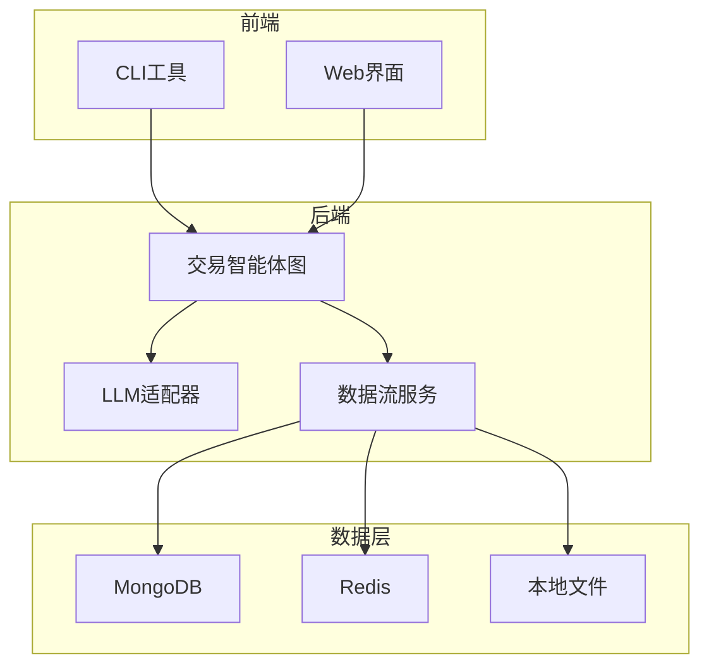
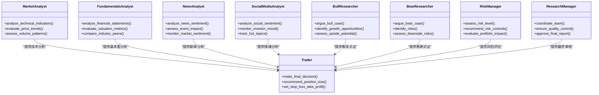
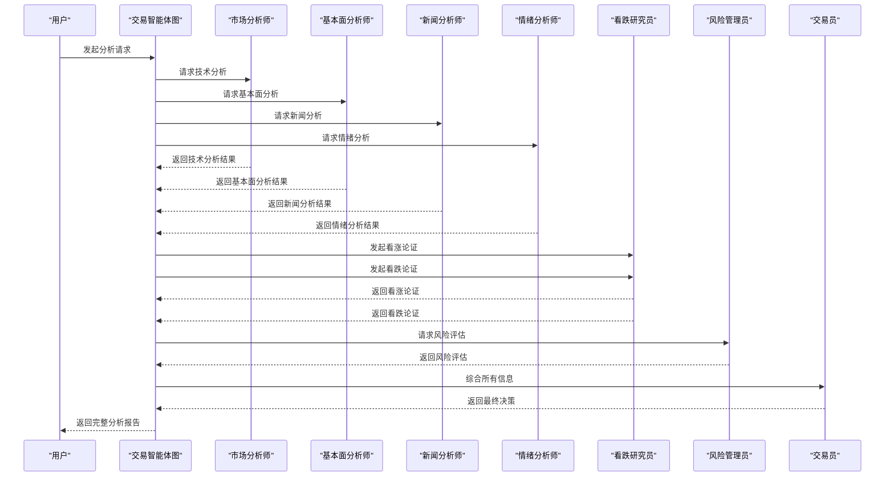
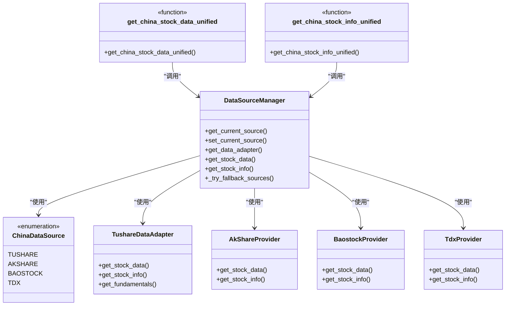
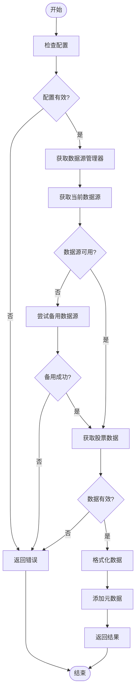
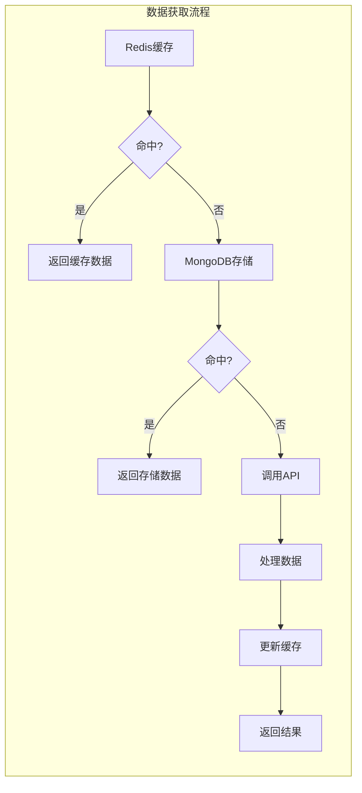

# 系统概述

<cite>
**本文档引用文件**  
- [README.md](file://README.md)
- [tradingagents/graph/trading_graph.py](file://tradingagents/graph/trading_graph.py)
- [tradingagents/agents/utils/agent_utils.py](file://tradingagents/agents/utils/agent_utils.py)
- [tradingagents/dataflows/interface.py](file://tradingagents/dataflows/interface.py)
- [tradingagents/dataflows/data_source_manager.py](file://tradingagents/dataflows/data_source_manager.py)
- [tradingagents/dataflows/tushare_adapter.py](file://tradingagents/dataflows/tushare_adapter.py)
- [tradingagents/dataflows/tushare_utils.py](file://tradingagents/dataflows/tushare_utils.py)
- [web/app.py](file://web/app.py)
- [cli/main.py](file://cli/main.py)
- [tradingagents/default_config.py](file://tradingagents/default_config.py)
- [docker-compose.yml](file://docker-compose.yml)
- [pyproject.toml](file://pyproject.toml)
</cite>

## 目录
1. [项目简介](#项目简介)
2. [核心功能与架构设计](#核心功能与架构设计)
3. [技术栈与全栈特性](#技术栈与全栈特性)
4. [多智能体系统架构](#多智能体系统架构)
5. [LLM模型集成](#llm模型集成)
6. [数据源集成](#数据源集成)
7. [存储与缓存机制](#存储与缓存机制)
8. [用户界面与交互](#用户界面与交互)
9. [典型工作流示例](#典型工作流示例)
10. [设计哲学与适用场景](#设计哲学与适用场景)
11. [部署与运维](#部署与运维)
12. [总结](#总结)

## 项目简介

TradingAgents-CN 是一个基于多智能体大语言模型的中文金融交易决策框架，专为中文用户优化。该项目在 [TauricResearch/TradingAgents](https://github.com/TauricResearch/TradingAgents) 基础上进行深度增强，提供完整的中文支持、A股市场适配、国产大模型集成和现代化Web界面。

本项目旨在搭建AI技术与中国金融市场的桥梁，通过多智能体协作架构模拟专业投资团队的决策流程，为用户提供全面的股票分析与投资建议。系统采用先进的LangChain/LangGraph框架构建智能体网络，结合多种数据源和大语言模型，实现从数据采集、分析到决策的完整闭环。

**Section sources**
- [README.md](file://README.md#L1-L1257)

## 核心功能与架构设计

TradingAgents-CN 采用模块化、微服务化的架构设计，核心功能包括多智能体协作、多LLM支持、多数据源集成和专业报告导出。系统通过智能体团队的分工协作，模拟真实投资公司的研究流程，确保分析的全面性和决策的科学性。

架构设计遵循高内聚、低耦合原则，各模块通过清晰的接口进行通信。系统采用分层架构，包括数据层、服务层、智能体层和应用层，确保系统的可扩展性和可维护性。通过配置化管理，用户可以灵活调整智能体组合、LLM模型和数据源，满足不同场景的需求。

**Section sources**
- [README.md](file://README.md#L1-L1257)
- [tradingagents/graph/trading_graph.py](file://tradingagents/graph/trading_graph.py#L32-L325)

## 技术栈与全栈特性

### 核心技术栈

| 技术领域 | 使用技术 | 版本要求 | 说明 |
|---------|--------|--------|------|
| **核心语言** | Python | 3.10+ | 异步处理，多线程支持 |
| **AI框架** | LangChain, LangGraph | 最新版 | 智能体编排，工具调用 |
| **Web界面** | Streamlit | 1.28+ | 响应式设计，实时更新 |
| **数据库** | MongoDB, Redis | 4.4+, 6.0+ | 分布式存储，毫秒级缓存 |
| **数据处理** | Pandas, NumPy | 最新版 | 向量化计算，内存优化 |
| **API集成** | 通达信API, FinnHub, Google News | - | 并发请求，智能限流 |
| **LLM支持** | DeepSeek V3, 阿里百炼, Google AI, OpenAI | - | 智能路由，成本优化 |
| **容器化** | Docker, Docker Compose | 20.0+ | 微服务架构，弹性扩展 |
| **文档转换** | Pandoc, wkhtmltopdf | 最新版 | 多格式支持，批量处理 |

### 全栈特性

TradingAgents-CN 具备完整的全栈特性，涵盖从底层数据存储到上层用户界面的各个层面：

- **CLI工具**: 提供命令行接口，支持脚本化调用和自动化分析
- **Web界面**: 基于Streamlit的现代化Web应用，支持实时交互和数据可视化
- **多LLM支持**: 集成阿里百炼、DeepSeek、Google AI等多种大语言模型
- **多数据源集成**: 支持Tushare、AkShare、FinnHub、Yahoo Finance等数据源
- **Docker容器化**: 提供完整的Docker Compose配置，支持一键部署



**Diagram sources**
- [web/app.py](file://web/app.py)
- [cli/main.py](file://cli/main.py)
- [tradingagents/graph/trading_graph.py](file://tradingagents/graph/trading_graph.py)
- [tradingagents/dataflows/interface.py](file://tradingagents/dataflows/interface.py)

**Section sources**
- [README.md](file://README.md#L1-L1257)
- [pyproject.toml](file://pyproject.toml)

## 多智能体系统架构

### 智能体团队构成

TradingAgents-CN 采用多智能体协作架构，模拟专业投资团队的工作流程。各智能体分工明确，协同工作，确保分析的全面性和决策的科学性。



**Diagram sources**
- [tradingagents/agents/analysts/market_analyst.py](file://tradingagents/agents/analysts/market_analyst.py)
- [tradingagents/agents/analysts/fundamentals_analyst.py](file://tradingagents/agents/analysts/fundamentals_analyst.py)
- [tradingagents/agents/analysts/news_analyst.py](file://tradingagents/agents/analysts/news_analyst.py)
- [tradingagents/agents/analysts/social_media_analyst.py](file://tradingagents/agents/analysts/social_media_analyst.py)
- [tradingagents/agents/researchers/bull_researcher.py](file://tradingagents/agents/researchers/bull_researcher.py)
- [tradingagents/agents/researchers/bear_researcher.py](file://tradingagents/agents/researchers/bear_researcher.py)
- [tradingagents/agents/trader/trader.py](file://tradingagents/agents/trader/trader.py)
- [tradingagents/agents/managers/risk_manager.py](file://tradingagents/agents/managers/risk_manager.py)
- [tradingagents/agents/managers/research_manager.py](file://tradingagents/agents/managers/research_manager.py)

### 智能体协作流程



**Diagram sources**
- [tradingagents/graph/trading_graph.py](file://tradingagents/graph/trading_graph.py#L32-L325)
- [tradingagents/agents/utils/agent_utils.py](file://tradingagents/agents/utils/agent_utils.py)

**Section sources**
- [tradingagents/graph/trading_graph.py](file://tradingagents/graph/trading_graph.py#L32-L325)
- [tradingagents/agents/utils/agent_utils.py](file://tradingagents/agents/utils/agent_utils.py)

## LLM模型集成

### 支持的LLM模型

TradingAgents-CN 支持多种大语言模型，通过智能路由机制自动选择最适合任务的模型，实现性能和成本的最优平衡。

| 模型提供商 | 支持模型 | 特色功能 |
|---------|--------|--------|
| **阿里百炼** | qwen-turbo, qwen-plus, qwen-max | 中文优化，成本效益高，响应快速 |
| **DeepSeek** | deepseek-chat, deepseek-coder | 工具调用，数学计算，代码分析 |
| **Google AI** | gemini-2.0-flash, gemini-1.5-pro | 多模态支持，推理能力强 |
| **OpenAI** | GPT-4o, GPT-4o-mini, GPT-3.5-turbo | 通用能力强，生态完善 |
| **Anthropic** | Claude-3-Opus, Claude-3-Sonnet | 安全性高，长文本处理 |

### 模型初始化与配置

```python
# tradingagents/graph/trading_graph.py
def __init__(self, selected_analysts=["market", "social", "news", "fundamentals"], debug=False, config: Dict[str, Any] = None):
    # ... 其他初始化代码 ...
    
    # 初始化LLM
    if self.config["llm_provider"].lower() == "openai" or self.config["llm_provider"] == "ollama" or self.config["llm_provider"] == "openrouter":
        self.deep_thinking_llm = ChatOpenAI(model=self.config["deep_think_llm"], base_url=self.config["backend_url"])
        self.quick_thinking_llm = ChatOpenAI(model=self.config["quick_think_llm"], base_url=self.config["backend_url"])
    elif self.config["llm_provider"].lower() == "anthropic":
        self.deep_thinking_llm = ChatAnthropic(model=self.config["deep_think_llm"], base_url=self.config["backend_url"])
        self.quick_thinking_llm = ChatAnthropic(model=self.config["quick_think_llm"], base_url=self.config["backend_url"])
    elif self.config["llm_provider"].lower() == "google":
        google_api_key = os.getenv('GOOGLE_API_KEY')
        self.deep_thinking_llm = ChatGoogleGenerativeAI(
            model=self.config["deep_think_llm"],
            google_api_key=google_api_key,
            temperature=0.1,
            max_tokens=2000
        )
        self.quick_thinking_llm = ChatGoogleGenerativeAI(
            model=self.config["quick_think_llm"],
            google_api_key=google_api_key,
            temperature=0.1,
            max_tokens=2000
        )
    elif (self.config["llm_provider"].lower() == "dashscope" or
          self.config["llm_provider"].lower() == "alibaba" or
          "dashscope" in self.config["llm_provider"].lower() or
          "阿里百炼" in self.config["llm_provider"]):
        # 使用 OpenAI 兼容适配器，支持原生 Function Calling
        print("🔧 使用阿里百炼 OpenAI 兼容适配器 (支持原生工具调用)")
        self.deep_thinking_llm = ChatDashScopeOpenAI(
            model=self.config["deep_think_llm"],
            temperature=0.1,
            max_tokens=2000
        )
        self.quick_thinking_llm = ChatDashScopeOpenAI(
            model=self.config["quick_think_llm"],
            temperature=0.1,
            max_tokens=2000
        )
    elif (self.config["llm_provider"].lower() == "deepseek" or
          "deepseek" in self.config["llm_provider"].lower()):
        # DeepSeek V3配置 - 使用支持token统计的适配器
        from tradingagents.llm_adapters.deepseek_adapter import ChatDeepSeek

        deepseek_api_key = os.getenv('DEEPSEEK_API_KEY')
        if not deepseek_api_key:
            raise ValueError("使用DeepSeek需要设置DEEPSEEK_API_KEY环境变量")

        deepseek_base_url = os.getenv('DEEPSEEK_BASE_URL', 'https://api.deepseek.com')

        # 使用支持token统计的DeepSeek适配器
        self.deep_thinking_llm = ChatDeepSeek(
            model=self.config["deep_think_llm"],
            api_key=deepseek_api_key,
            base_url=deepseek_base_url,
            temperature=0.1,
            max_tokens=2000
        )
        self.quick_thinking_llm = ChatDeepSeek(
            model=self.config["quick_think_llm"],
            api_key=deepseek_api_key,
            base_url=deepseek_base_url,
            temperature=0.1,
            max_tokens=2000
            )
```

**Section sources**
- [tradingagents/graph/trading_graph.py](file://tradingagents/graph/trading_graph.py#L32-L325)
- [tradingagents/llm_adapters/dashscope_adapter.py](file://tradingagents/llm_adapters/dashscope_adapter.py)
- [tradingagents/llm_adapters/deepseek_adapter.py](file://tradingagents/llm_adapters/deepseek_adapter.py)

## 数据源集成

### 支持的数据源

TradingAgents-CN 集成了多种金融数据源，确保数据的全面性和可靠性。

| 数据类型 | 数据源 | 覆盖范围 |
|---------|--------|--------|
| **A股实时数据** | 通达信API, AkShare | 沪深两市，实时行情，历史数据 |
| **美股数据** | FinnHub, Yahoo Finance | NYSE, NASDAQ，实时行情 |
| **新闻数据** | Google News, 财经新闻 | 实时新闻，多语言支持 |
| **社交情绪** | Reddit, Twitter API | 情绪指数，热度分析 |
| **技术指标** | 自研算法 | MA, RSI, MACD, 布林带等 |
| **基本面数据** | Tushare, 财务API | 财报数据，估值指标 |

### 统一数据源管理

系统采用数据源管理器模式，实现多数据源的统一管理和智能降级。



**Diagram sources**
- [tradingagents/dataflows/data_source_manager.py](file://tradingagents/dataflows/data_source_manager.py#L21-L310)
- [tradingagents/dataflows/interface.py](file://tradingagents/dataflows/interface.py#L1224-L1251)
- [tradingagents/dataflows/tushare_adapter.py](file://tradingagents/dataflows/tushare_adapter.py)

### 数据获取流程



**Diagram sources**
- [tradingagents/dataflows/data_source_manager.py](file://tradingagents/dataflows/data_source_manager.py#L21-L310)
- [tradingagents/dataflows/interface.py](file://tradingagents/dataflows/interface.py#L1224-L1251)

**Section sources**
- [tradingagents/dataflows/data_source_manager.py](file://tradingagents/dataflows/data_source_manager.py#L21-L310)
- [tradingagents/dataflows/interface.py](file://tradingagents/dataflows/interface.py#L1224-L1251)
- [tradingagents/dataflows/tushare_adapter.py](file://tradingagents/dataflows/tushare_adapter.py)
- [tradingagents/dataflows/tushare_utils.py](file://tradingagents/dataflows/tushare_utils.py)

## 存储与缓存机制

### 存储系统架构

TradingAgents-CN 采用多层次存储架构，确保数据的持久化和访问性能。

| 存储类型 | 技术方案 | 功能特性 |
|---------|--------|--------|
| **持久化存储** | MongoDB 4.4+ | 分析结果，用户配置，历史数据 |
| **高速缓存** | Redis 6.0+ | 实时数据，API响应，会话管理 |
| **文件存储** | 本地文件系统 | 报告文件，日志文件，配置备份 |
| **智能降级** | 多层数据源 | MongoDB → Redis → 本地文件 |

### 缓存策略

系统采用智能缓存策略，减少API调用成本，提高响应速度。



**Diagram sources**
- [tradingagents/config/database_config.py](file://tradingagents/config/database_config.py)
- [tradingagents/config/mongodb_storage.py](file://tradingagents/config/mongodb_storage.py)

**Section sources**
- [README.md](file://README.md#L1-L1257)
- [tradingagents/config/database_config.py](file://tradingagents/config/database_config.py)

## 用户界面与交互

### Web界面功能

基于Streamlit的现代化Web界面提供直观的操作体验。

| 功能特性 | 说明 |
|---------|------|
| **Streamlit Web界面** | 现代化响应式界面，支持实时交互和数据可视化 |
| **移动端适配** | 响应式设计，支持手机和平板设备访问 |
| **主题定制** | 深色/浅色主题切换，自定义配色方案 |
| **多语言界面**