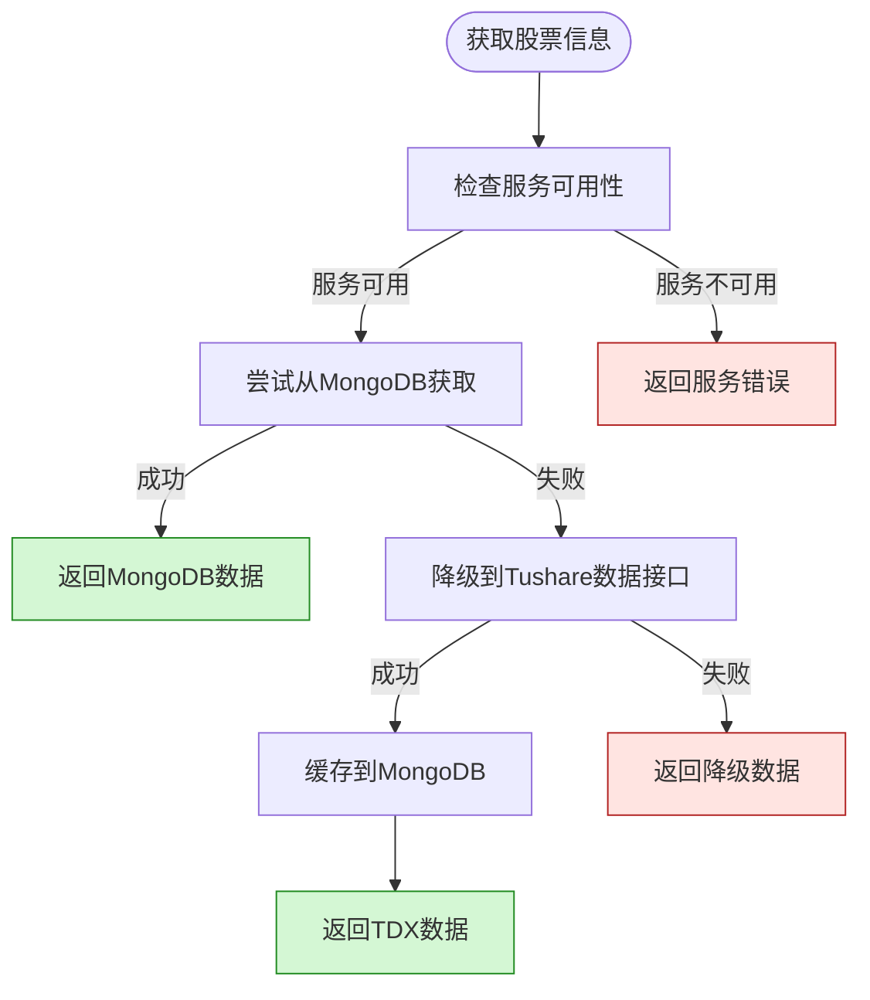
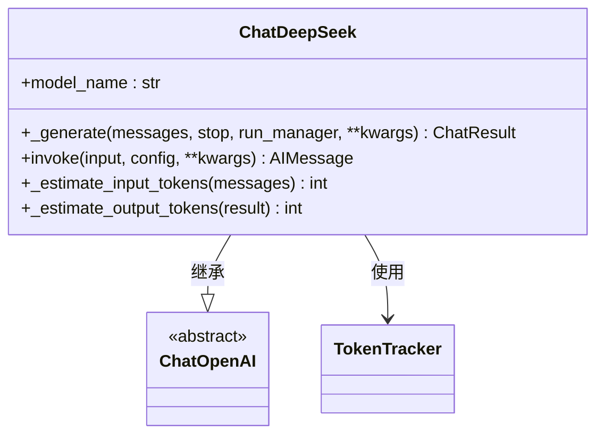

# API参考

<cite>
**本文档中引用的文件**   
- [stock_api.py](file://tradingagents/api/stock_api.py)
- [stock_data_service.py](file://tradingagents/dataflows/stock_data_service.py)
- [deepseek_adapter.py](file://tradingagents/llm_adapters/deepseek_adapter.py)
</cite>

## 目录
1. [简介](#简介)
2. [股票信息查询接口](#股票信息查询接口)
3. [股票数据获取接口](#股票数据获取接口)
4. [搜索与市场概览接口](#搜索与市场概览接口)
5. [服务状态检查接口](#服务状态检查接口)
6. [使用示例](#使用示例)
7. [底层数据流与错误处理](#底层数据流与错误处理)
8. [LLM集成与超时重试策略](#llm集成与超时重试策略)

## 简介
本API参考文档为`stock_api.py`中所有公开接口提供详细说明。文档涵盖接口的HTTP端点（如适用）、请求参数、返回值结构、错误码及使用示例。结合`stock_data_service.py`中的实现逻辑，解释底层数据流和错误处理机制。对于涉及LLM调用的接口，说明其与`llm_adapters`模块的集成方式和超时重试策略。文档按功能模块分组，便于开发者快速查找所需接口。

**Section sources**
- [stock_api.py](file://tradingagents/api/stock_api.py#L1-L295)

## 股票信息查询接口

### get_stock_info
获取单个股票的基础信息。

**参数**:
- `stock_code` (str): 股票代码（如 '000001'），必填

**返回值**:
- Dict: 包含股票基础信息的字典，字段包括`code`, `name`, `market`, `category`, `source`, `updated_at`等。若获取失败，返回包含`error`字段的字典。

**错误码**:
- `error`: "未找到股票{stock_code}的信息" - 股票代码不存在或查询失败
- `error`: "股票数据服务不可用" - 服务初始化失败

**使用示例**:
```python
info = get_stock_info('000001')
print(info['name'])  # 输出: 平安银行
```

**Section sources**
- [stock_api.py](file://tradingagents/api/stock_api.py#L34-L61)
- [stock_data_service.py](file://tradingagents/dataflows/stock_data_service.py#L75-L167)

### get_all_stocks
获取所有股票的基础信息列表。

**参数**: 无

**返回值**:
- List[Dict]: 所有股票的基础信息列表。若获取失败，返回包含`error`字段的字典。

**错误码**:
- `error`: "无法获取股票列表" - 数据源均不可用

**使用示例**:
```python
stocks = get_all_stocks()
print(f"共有{len(stocks)}只股票")
```

**Section sources**
- [stock_api.py](file://tradingagents/api/stock_api.py#L64-L91)
- [stock_data_service.py](file://tradingagents/dataflows/stock_data_service.py#L75-L167)

## 股票数据获取接口

### get_stock_data
获取股票历史数据，支持降级机制。

**参数**:
- `stock_code` (str): 股票代码，必填
- `start_date` (str): 开始日期（格式：YYYY-MM-DD），可选，默认为30天前
- `end_date` (str): 结束日期（格式：YYYY-MM-DD），可选，默认为今天

**返回值**:
- str: 格式化的股票数据报告字符串。若获取失败，返回包含错误信息的字符串。

**错误码**:
- `error`: "❌ 股票数据服务不可用" - 服务不可用
- `error`: "❌ 无法获取股票{stock_code}的基础信息" - 基础信息获取失败
- `error`: "❌ 获取股票数据失败" - 数据获取失败

**使用示例**:
```python
data = get_stock_data('000001', '2024-01-01', '2024-01-31')
print(data)
```

**Section sources**
- [stock_api.py](file://tradingagents/api/stock_api.py#L94-L134)
- [stock_data_service.py](file://tradingagents/dataflows/stock_data_service.py#L220-L278)

## 搜索与市场概览接口

### search_stocks
根据关键词搜索股票。

**参数**:
- `keyword` (str): 搜索关键词（股票代码或名称的一部分），必填

**返回值**:
- List[Dict]: 匹配的股票信息列表。若基础服务不可用，返回包含`error`字段的字典。

**使用示例**:
```python
results = search_stocks('平安')
for stock in results:
    print(f"{stock['code']}: {stock['name']}")
```

**Section sources**
- [stock_api.py](file://tradingagents/api/stock_api.py#L137-L175)

### get_market_summary
获取市场概览信息。

**参数**: 无

**返回值**:
- Dict: 包含市场统计信息的字典，字段包括`total_count`, `shanghai_count`, `shenzhen_count`, `category_stats`, `data_source`, `updated_at`等。若获取失败，返回包含`error`字段的字典。

**使用示例**:
```python
summary = get_market_summary()
print(f"沪市股票数量: {summary['shanghai_count']}")
```

**Section sources**
- [stock_api.py](file://tradingagents/api/stock_api.py#L178-L223)

## 服务状态检查接口

### check_service_status
检查服务状态。

**参数**: 无

**返回值**:
- Dict: 包含服务状态信息的字典，字段包括`service_available`, `mongodb_status`, `tdx_api_status`, `enhanced_fetcher_available`, `fallback_available`, `checked_at`等。

**使用示例**:
```python
status = check_service_status()
print(f"MongoDB状态: {status['mongodb_status']}")
```

**Section sources**
- [stock_api.py](file://tradingagents/api/stock_api.py#L226-L286)

## 使用示例

### 股票信息查询
```python
# 获取单个股票信息
info = get_stock_info('000001')
if 'error' not in info:
    print(f"名称: {info['name']}, 市场: {info['market']}")

# 获取所有股票
stocks = get_all_stocks()
print(f"总股票数: {len(stocks)}")
```

### 股票数据获取
```python
# 获取指定日期范围的股票数据
data = get_stock_data('000001', '2024-01-01', '2024-01-31')
print(data[:500])  # 打印前500字符
```

### 搜索与市场分析
```python
# 搜索股票
results = search_stocks('银行')
for stock in results:
    print(f"{stock['code']}: {stock['name']}")

# 获取市场概览
summary = get_market_summary()
print(f"深市股票: {summary['shenzhen_count']}")
```

**Section sources**
- [stock_api.py](file://tradingagents/api/stock_api.py#L247-L286)

## 底层数据流与错误处理

### 数据流架构


**Diagram sources**
- [stock_data_service.py](file://tradingagents/dataflows/stock_data_service.py#L75-L167)

### 错误处理机制
系统实现多级降级机制：
1. **优先级1**: 从MongoDB获取数据
2. **优先级2**: 降级到Tushare数据接口
3. **优先级3**: 返回基础的降级数据或错误信息

所有异常均被捕获并记录，确保API调用不会因底层服务故障而中断。

**Section sources**
- [stock_data_service.py](file://tradingagents/dataflows/stock_data_service.py#L75-L278)

## LLM集成与超时重试策略

### DeepSeek LLM集成


**Diagram sources**
- [deepseek_adapter.py](file://tradingagents/llm_adapters/deepseek_adapter.py#L45-L248)

### 超时与重试策略
- **超时设置**: 系统未显式设置超时，依赖底层HTTP库默认超时
- **重试机制**: 
  - Tushare数据接口: `max_retries=3`
  - MongoDB: 通过驱动自动处理连接重试
- **Token跟踪**: 集成`token_tracker`模块，记录每次LLM调用的输入/输出Token数和成本

**Section sources**
- [stock_data_service.py](file://tradingagents/dataflows/stock_data_service.py#L158)
- [deepseek_adapter.py](file://tradingagents/llm_adapters/deepseek_adapter.py#L100-L150)