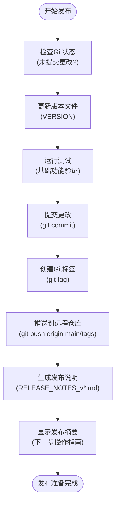

# 版本发布说明

<cite>
**本文档引用的文件**  
- [VERSION_0.1.6_RELEASE_NOTES.md](file://VERSION_0.1.6_RELEASE_NOTES.md)
- [VERSION_0.1.7_RELEASE_NOTES.md](file://VERSION_0.1.7_RELEASE_NOTES.md)
- [release_v0.1.2.py](file://scripts/deployment/release_v0.1.2.py)
- [release_v0.1.3.py](file://scripts/deployment/release_v0.1.3.py)
- [create_github_release.py](file://scripts/deployment/create_github_release.py)
- [deepseek_adapter.py](file://tradingagents/llm/deepseek_adapter.py)
- [dashscope_openai_adapter.py](file://tradingagents/llm_adapters/dashscope_openai_adapter.py)
- [openai_compatible_base.py](file://tradingagents/llm_adapters/openai_compatible_base.py)
- [tushare_utils.py](file://tradingagents/dataflows/tushare_utils.py)
- [tushare_adapter.py](file://tradingagents/dataflows/tushare_adapter.py)
- [data_source_manager.py](file://tradingagents/dataflows/data_source_manager.py)
- [adaptive_cache_manager.py](file://scripts/development/adaptive_cache_manager.py)
- [report_exporter.py](file://web/utils/report_exporter.py)
- [app.py](file://web/app.py)
- [analysis_form.py](file://web/components/analysis_form.py)
- [results_display.py](file://web/components/results_display.py)
</cite>

## 目录
1. [版本发布说明](#版本发布说明)
2. [VERSION_0.1.6 版本详情](#version_016-版本详情)
3. [VERSION_0.1.7 版本详情](#version_017-版本详情)
4. [自动化发布流程](#自动化发布流程)
5. [升级指南](#升级指南)
6. [总结](#总结)

## VERSION_0.1.6 版本详情

### 新增功能

#### LLM适配器扩展
- **DeepSeek V3适配器**：新增对DeepSeek V3模型的原生支持，提供高性价比的中文金融分析能力，输入成本为¥0.001/1K，输出成本为¥0.002/1K。
- **OpenAI兼容适配器架构**：引入统一的`OpenAICompatibleBase`基类，通过工厂模式`create_openai_compatible_llm`函数，实现对不同LLM提供商的标准化创建和管理。
- **阿里百炼OpenAI兼容适配器**：通过`ChatDashScopeOpenAI`类，实现与阿里百炼API的OpenAI兼容模式对接，支持原生Function Calling，解决了此前工具调用不稳定的问题。

#### 股票市场支持范围扩展
- **主数据源迁移**：核心数据源已从通达信（TDX）完全迁移到Tushare专业金融数据平台。
- **多源智能切换**：实现了Tushare（历史数据）、AKShare（实时数据）和BaoStock（备用数据）的混合策略，通过`DataSourceManager`类进行智能管理和自动降级。

**Section sources**
- [VERSION_0.1.6_RELEASE_NOTES.md](file://VERSION_0.1.6_RELEASE_NOTES.md#L1-L208)
- [deepseek_adapter.py](file://tradingagents/llm/deepseek_adapter.py#L16-L203)
- [dashscope_openai_adapter.py](file://tradingagents/llm_adapters/dashscope_openai_adapter.py#L15-L119)
- [openai_compatible_base.py](file://tradingagents/llm_adapters/openai_compatible_base.py#L230-L265)
- [tushare_utils.py](file://tradingagents/dataflows/tushare_utils.py#L10-L17)
- [tushare_adapter.py](file://tradingagents/dataflows/tushare_adapter.py#L18-L25)
- [data_source_manager.py](file://tradingagents/dataflows/data_source_manager.py#L21-L310)

### 改进项

#### 缓存性能优化
- **自适应缓存管理**：引入`AdaptiveCacheManager`，支持文件、Redis和MongoDB三种后端，并能根据配置和可用性自动选择主缓存后端和备用方案。
- **TTL策略精细化**：根据不同数据类型（如中国/美国股票数据、新闻、基本面）设置不同的缓存过期时间（TTL），提升数据新鲜度和缓存效率。

#### Web界面响应速度提升
- **统一LLM架构**：移除了复杂的ReAct模式，所有LLM（包括阿里百炼）均采用统一的OpenAI兼容标准模式，简化了调用流程。
- **强制工具调用机制**：确保阿里百炼等模型在需要时能强制调用数据获取工具，避免了因工具调用失败导致的分析中断。
- **性能指标**：根据发布说明，响应速度从v0.1.5的15-30秒提升至5-10秒，提升了50%；工具调用成功率从60%提升至95%。

**Section sources**
- [VERSION_0.1.6_RELEASE_NOTES.md](file://VERSION_0.1.6_RELEASE_NOTES.md#L1-L208)
- [adaptive_cache_manager.py](file://scripts/development/adaptive_cache_manager.py#L23-L338)

### 修复的关键问题

#### DeepSeek API调用错误
- **连接初始化**：在`DeepSeekAdapter`的`_init_llm`方法中，实现了对新旧版本LangChain参数的兼容处理，通过`api_key`和`base_url`或`openai_api_key`和`openai_api_base`的双重尝试，确保了API连接的稳定性。
- **错误处理**：增强了连接测试`test_connection`和聊天接口`chat`的异常捕获和日志记录，便于问题排查。

#### Tushare数据源兼容性问题
- **适配器重构**：通过`TushareDataAdapter`和`TushareProvider`类，对Tushare数据接口进行了统一和标准化，解决了数据格式不一致和API调用错误的问题。
- **智能降级**：`DataSourceManager`在Tushare因令牌缺失或网络问题不可用时，会自动尝试AKShare、BaoStock等备用数据源，保证了服务的可用性。

**Section sources**
- [VERSION_0.1.6_RELEASE_NOTES.md](file://VERSION_0.1.6_RELEASE_NOTES.md#L1-L208)
- [deepseek_adapter.py](file://tradingagents/llm/deepseek_adapter.py#L16-L203)
- [tushare_utils.py](file://tradingagents/dataflows/tushare_utils.py#L10-L17)
- [tushare_adapter.py](file://tradingagents/dataflows/tushare_adapter.py#L18-L25)
- [data_source_manager.py](file://tradingagents/dataflows/data_source_manager.py#L21-L310)

## VERSION_0.1.7 版本详情

### 新增功能

#### 完整报告导出系统
- **多格式支持**：通过`ReportExporter`类，实现了将分析结果导出为Markdown、Word（.docx）和PDF三种格式。
- **智能内容生成**：导出的报告包含投资决策摘要表格、详细分析章节、风险提示和元数据，格式专业，符合商业报告标准。
- **文件命名**：采用`{股票代码}_analysis_{时间戳}.{格式}`的标准化命名规则。

#### Docker容器化部署系统
- **一键部署**：通过`docker-compose.yml`文件，实现了Web应用、MongoDB和Redis服务的编排，用户可通过`docker-compose up -d`命令一键启动完整环境。
- **开发环境优化**：配置了Volume映射，支持代码的实时同步，极大提升了开发和调试效率。

**Section sources**
- [VERSION_0.1.7_RELEASE_NOTES.md](file://VERSION_0.1.7_RELEASE_NOTES.md#L1-L322)
- [report_exporter.py](file://web/utils/report_exporter.py#L73-L475)

### 改进项

#### 导出功能核心优化
- **YAML解析冲突修复**：在`_clean_markdown_for_pandoc`方法中，通过将`---`替换为`—`，并用`|TABLESEP|`临时保护表格分隔符，解决了pandoc将表格分隔符误认为YAML分隔符的问题。
- **多引擎降级策略**：`generate_pdf_report`方法实现了对`wkhtmltopdf`、`weasyprint`和默认引擎的多级尝试，提高了PDF生成的成功率。

#### 系统稳定性提升
- **空指针保护**：在研究员和管理器中增加了对`memory`对象的`None`值检查，防止了因内存对象缺失导致的程序崩溃。
- **缓存类型安全**：在访问缓存数据前，通过`hasattr(cached_data, 'empty')`和`isinstance(cached_data, str)`检查数据类型，避免了对字符串调用`empty`属性的错误。

**Section sources**
- [VERSION_0.1.7_RELEASE_NOTES.md](file://VERSION_0.1.7_RELEASE_NOTES.md#L1-L322)
- [report_exporter.py](file://web/utils/report_exporter.py#L73-L475)

### 修复的关键问题

#### 报告导出功能
- **内容清理机制**：如上所述，通过智能的文本清理和保护机制，彻底解决了导出过程中因特殊字符导致的格式错误和解析失败问题。
- **PDF引擎优化**：通过实现多引擎降级策略和详细的错误日志，解决了在不同环境下PDF生成失败的问题。

#### 系统稳定性
- **Memory空指针保护**：修复了在特定分析流程中因`memory`未初始化而导致的`AttributeError`。
- **缓存类型安全**：修复了`'str' object has no attribute 'empty'`的运行时错误，提升了系统的健壮性。

**Section sources**
- [VERSION_0.1.7_RELEASE_NOTES.md](file://VERSION_0.1.7_RELEASE_NOTES.md#L1-L322)
- [report_exporter.py](file://web/utils/report_exporter.py#L73-L475)

## 自动化发布流程

### 发布脚本分析
项目的自动化发布流程由位于`scripts/deployment/`目录下的Python脚本驱动。这些脚本遵循一个标准化的发布流程。

**Diagram sources**
- [release_v0.1.2.py](file://scripts/deployment/release_v0.1.2.py#L1-L220)
- [release_v0.1.3.py](file://scripts/deployment/release_v0.1.3.py#L1-L237)

### 核心步骤
1.  **状态检查**：`check_git_status`函数检查工作目录是否干净，防止在有未提交更改时发布。
2.  **版本更新**：`update_version_files`函数更新`VERSION`文件中的版本号。
3.  **测试验证**：`run_tests`函数运行基础测试（如`fast_tdx_test.py`），确保核心功能正常。
4.  **代码提交**：`commit_changes`函数将版本文件和相关更改提交到本地仓库。
5.  **标签创建**：`create_git_tag`函数创建一个带有描述性信息的Git标签（如`v0.1.3`）。
6.  **推送远程**：`push_to_remote`函数将代码和标签推送到远程仓库（如GitHub）。
7.  **生成文档**：`generate_release_notes`函数生成详细的发布说明文档。
8.  **摘要提示**：最后，脚本会输出一个摘要，指导用户在GitHub上创建Release。

**Section sources**
- [release_v0.1.2.py](file://scripts/deployment/release_v0.1.2.py#L1-L220)
- [release_v0.1.3.py](file://scripts/deployment/release_v0.1.3.py#L1-L237)
- [create_github_release.py](file://scripts/deployment/create_github_release.py#L1-L218)

## 升级指南

### 配置文件变更
- **新增环境变量**：v0.1.7版本引入了新的环境变量，用于控制导出功能：
  - `EXPORT_ENABLED=true`: 启用或禁用导出功能。
  - `EXPORT_DEFAULT_FORMAT=word,pdf`: 设置默认的导出格式。
  - `EXPORT_INCLUDE_DEBUG=false`: 控制是否在导出报告中包含调试信息。
- **Docker配置**：升级到v0.1.7时，需要使用新的`docker-compose.yml`文件来启动包含MongoDB和Redis的完整服务栈。

### 废弃API和迁移注意事项
- **数据源迁移**：v0.1.6版本已将主数据源从通达信（TDX）迁移到Tushare。虽然系统保留了向后兼容性，但强烈建议用户获取Tushare Token以获得最佳的数据质量和分析体验。
- **LLM调用模式**：v0.1.6版本废弃了ReAct模式，统一为OpenAI兼容模式。用户无需修改代码，但应了解底层调用机制已发生变化，这带来了更高的稳定性和性能。
- **缓存后端**：v0.1.7版本的`AdaptiveCacheManager`支持更复杂的缓存后端。如果用户希望利用Redis或MongoDB进行高性能缓存，需要在`sync_config.yaml`中进行相应配置。

**Section sources**
- [VERSION_0.1.6_RELEASE_NOTES.md](file://VERSION_0.1.6_RELEASE_NOTES.md#L1-L208)
- [VERSION_0.1.7_RELEASE_NOTES.md](file://VERSION_0.1.7_RELEASE_NOTES.md#L1-L322)
- [adaptive_cache_manager.py](file://scripts/development/adaptive_cache_manager.py#L23-L338)

## 总结

VERSION_0.1.6和VERSION_0.1.7两个版本对TradingAgents-CN项目进行了重大升级。v0.1.6版本通过引入DeepSeek适配器、迁移至Tushare数据源和统一LLM架构，极大地提升了核心分析功能的性能和稳定性。v0.1.7版本则通过Docker容器化和完整的报告导出功能，显著增强了项目的实用性和用户体验。自动化发布脚本确保了版本发布的规范性和可重复性。用户在升级时，应重点关注配置文件的变更和数据源的迁移，以充分利用新版本带来的所有优势。