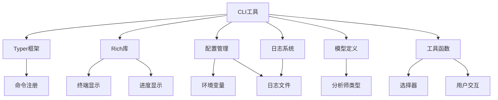
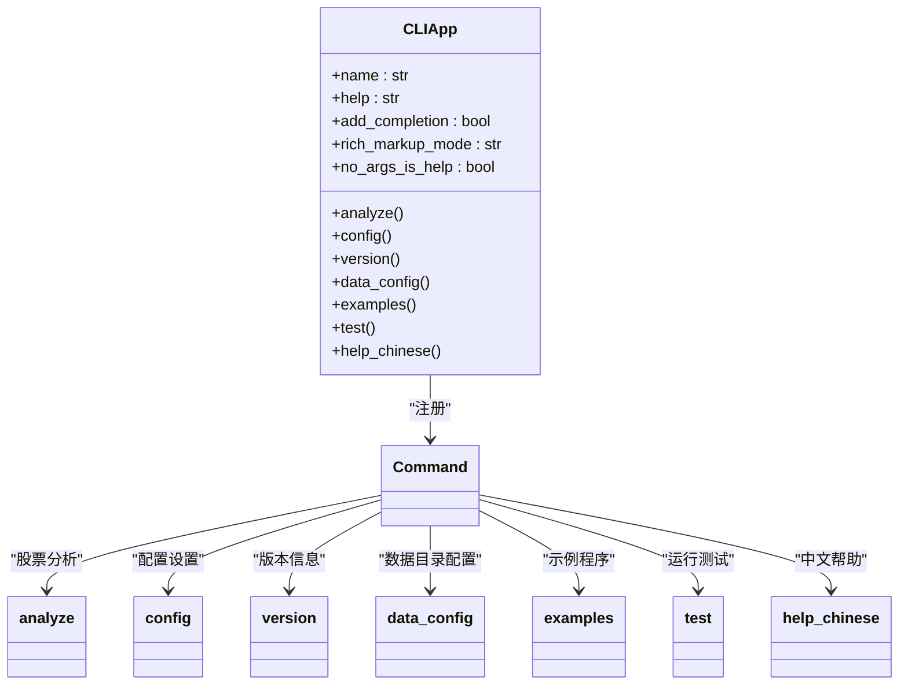
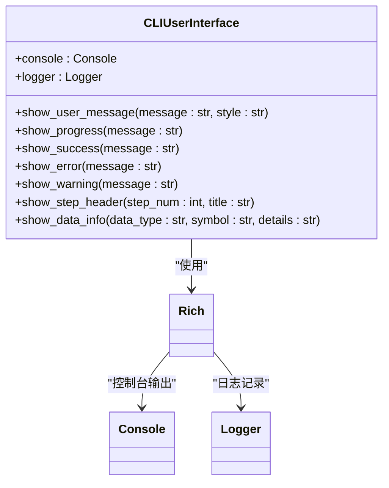
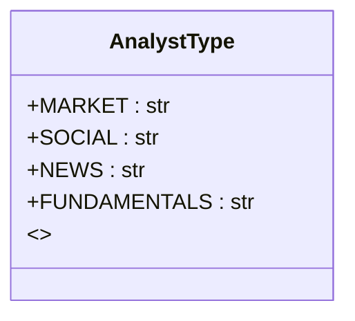
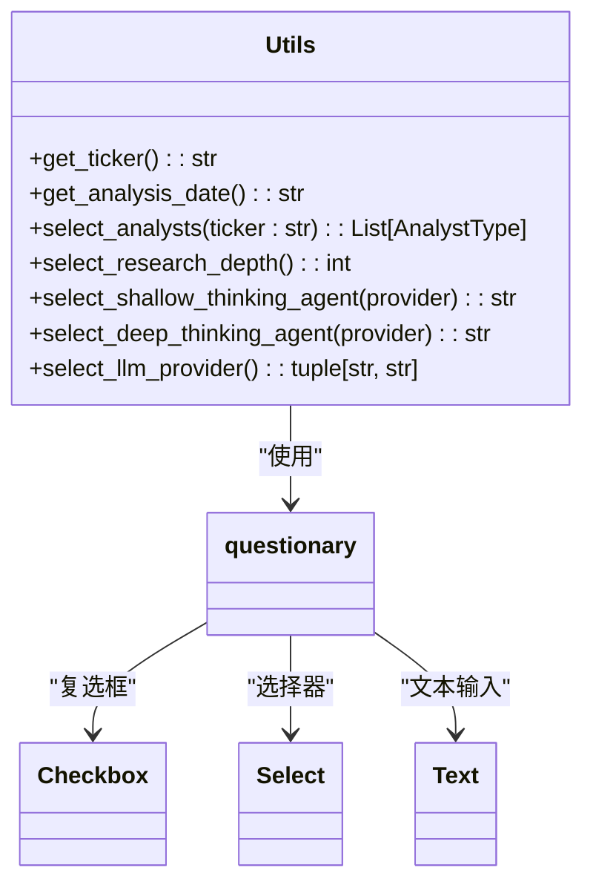
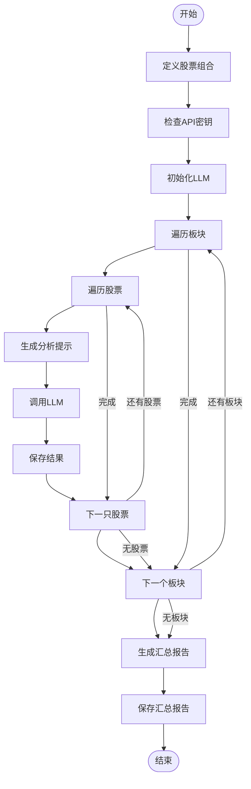
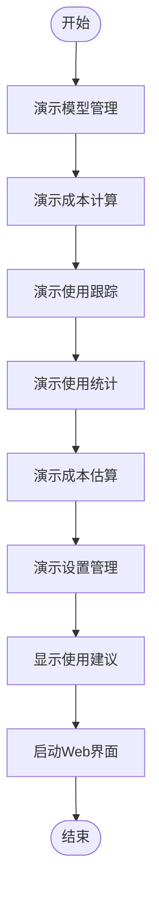
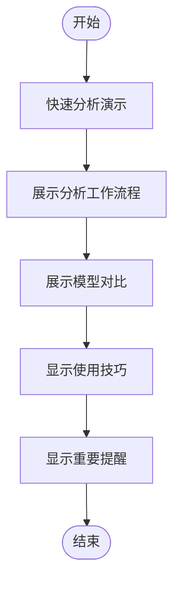
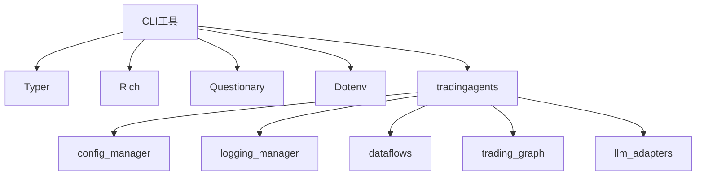

# CLI工具使用

<cite>
**本文档引用的文件**   
- [main.py](file://cli/main.py)
- [models.py](file://cli/models.py)
- [utils.py](file://cli/utils.py)
- [welcome.txt](file://cli/static/welcome.txt)
- [cli_demo.py](file://examples/cli_demo.py)
- [batch_analysis.py](file://examples/batch_analysis.py)
- [config_management_demo.py](file://examples/config_management_demo.py)
- [simple_analysis_demo.py](file://examples/simple_analysis_demo.py)
</cite>

## 目录
1. [简介](#简介)
2. [项目结构](#项目结构)
3. [核心组件](#核心组件)
4. [架构概述](#架构概述)
5. [详细组件分析](#详细组件分析)
6. [依赖分析](#依赖分析)
7. [性能考虑](#性能考虑)
8. [故障排除指南](#故障排除指南)
9. [结论](#结论)
10. [附录](#附录) (如有必要)

## 简介
TradingAgents-CN是一个基于多智能体大语言模型的金融交易决策框架，专为中文用户优化，提供完整的A股/港股/美股分析能力。本CLI工具为偏好命令行的用户提供了一个强大的交互式界面，支持股票分析、配置管理、系统测试等多种功能。用户可以通过CLI进行批量分析和自动化任务调度，实现高效的投资决策支持。

## 项目结构
该项目采用模块化设计，主要包含CLI工具、配置管理、数据流处理、智能体系统、API接口、图计算、大语言模型适配器、工具集、工具函数、Web界面等多个组件。CLI工具位于`cli`目录下，包含主程序、模型定义和工具函数。配置文件位于`config`目录，数据备份位于`data_backup`目录，示例程序位于`examples`目录，脚本工具位于`scripts`目录，测试用例位于`tests`目录，核心交易智能体系统位于`tradingagents`目录，上游贡献代码位于`upstream_contribution`目录，工具函数位于`utils`目录，Web界面位于`web`目录。

```mermaid
graph TD
cli[cli]
config[config]
data_backup[data_backup]
examples[examples]
scripts[scripts]
tests[tests]
tradingagents[tradingagents]
upstream_contribution[upstream_contribution]
utils[utils]
web[web]
cli --> main[main.py]
cli --> models[models.py]
cli --> utils[utils.py]
cli --> static[static]
static --> welcome[welcome.txt]
config --> README[README.md]
config --> logging[logging.toml]
config --> logging_docker[logging_docker.toml]
examples --> dashscope[dashscope_examples]
examples --> README[README.md]
examples --> batch_analysis[batch_analysis.py]
examples --> cli_demo[cli_demo.py]
examples --> config_management_demo[config_management_demo.py]
examples --> custom_analysis_demo[custom_analysis_demo.py]
examples --> data_dir_config_demo[data_dir_config_demo.py]
examples --> demo_deepseek_analysis[demo_deepseek_analysis.py]
examples --> demo_deepseek_simple[demo_deepseek_simple.py]
examples --> demo_news_filtering[demo_news_filtering.py]
examples --> enhanced_history_demo[enhanced_history_demo.py]
examples --> my_stock_analysis[my_stock_analysis.py]
examples --> simple_analysis_demo[simple_analysis_demo.py]
examples --> stock_list_example[stock_list_example.py]
examples --> stock_query_examples[stock_query_examples.py]
examples --> test_installation[test_installation.py]
examples --> test_news_timeout[test_news_timeout.py]
examples --> token_tracking_demo[token_tracking_demo.py]
examples --> tushare_demo[tushare_demo.py]
scripts --> deployment[deployment]
scripts --> development[development]
scripts --> docker[docker]
scripts --> git[git]
scripts --> maintenance[maintenance]
scripts --> setup[setup]
scripts --> validation[validation]
scripts --> USER_MANAGEMENT[USER_MANAGEMENT.md]
scripts --> analyze_data_calls[analyze_data_calls.py]
scripts --> backup_branches[backup_branches.sh]
scripts --> batch_update_docs[batch_update_docs.py]
scripts --> build_docker_with_pdf[build_docker_with_pdf.py]
scripts --> capture_web_screenshots[capture_web_screenshots.py]
scripts --> check_api_config[check_api_config.py]
scripts --> check_doc_consistency[check_doc_consistency.py]
scripts --> convert_prints_to_logs[convert_prints_to_logs.py]
scripts --> debug_docker[debug_docker.ps1]
scripts --> debug_docker[debug_docker.sh]
scripts --> demo_user_activity[demo_user_activity.py]
scripts --> diagnose_empty_data[diagnose_empty_data.py]
scripts --> disable_structured_logs[disable_structured_logs.py]
scripts --> download_finnhub_data[download_finnhub_data.py]
scripts --> ensure_logs_dir[ensure_logs_dir.py]
scripts --> extract_error_files[extract_error_files.py]
scripts --> fix_chromadb[fix_chromadb.ps1]
scripts --> fix_chromadb[fix_chromadb.sh]
scripts --> fix_chromadb_win10[fix_chromadb_win10.ps1]
scripts --> fix_docker_logging[fix_docker_logging.py]
scripts --> fix_duplicate_loggers[fix_duplicate_loggers.py]
scripts --> fix_logger_position[fix_logger_position.py]
scripts --> fix_logging_config_error[fix_logging_config_error.py]
scripts --> fix_logging_imports[fix_logging_imports.py]
scripts --> fix_stock_code_issue[fix_stock_code_issue.py]
scripts --> get_container_logs[get_container_logs.py]
scripts --> get_main_branch_logs[get_main_branch_logs.py]
scripts --> init-directories[init-directories.ps1]
scripts --> init-directories[init-directories.sh]
scripts --> install_and_run[install_and_run.py]
scripts --> install_pandoc[install_pandoc.py]
scripts --> install_pdf_tools[install_pdf_tools.py]
scripts --> log_analyzer[log_analyzer.py]
scripts --> migrate_data_directories[migrate_data_directories.py]
scripts --> migrate_to_unified_logging[migrate_to_unified_logging.py]
scripts --> mongo-init[mongo-init.js]
scripts --> quick_get_logs[quick_get_logs.ps1]
scripts --> quick_get_logs[quick_get_logs.sh]
scripts --> quick_syntax_check[quick_syntax_check.py]
scripts --> rebuild_and_test[rebuild_and_test.ps1]
scripts --> setup-docker[setup-docker.py]
scripts --> simple_async_test[simple_async_test.py]
scripts --> simple_log_test[simple_log_test.py]
scripts --> smart_start[smart_start.ps1]
scripts --> smart_start[smart_start.sh]
scripts --> start_docker[start_docker.ps1]
scripts --> start_docker[start_docker.sh]
scripts --> stock_code_validator[stock_code_validator.py]
scripts --> syntax_checker[syntax_checker.py]
scripts --> syntax_test_script[syntax_test_script.py]
scripts --> test_async_progress[test_async_progress.py]
scripts --> test_docker_logging[test_docker_logging.py]
scripts --> test_docker_pdf[test_docker_pdf.py]
scripts --> test_enhanced_logging[test_enhanced_logging.py]
scripts --> test_fallback_mechanism[test_fallback_mechanism.py]
scripts --> test_fundamentals_with_stock_name[test_fundamentals_with_stock_name.py]
scripts --> test_hk_error_handling[test_hk_error_handling.py]
scripts --> test_integration_validation[test_integration_validation.py]
scripts --> test_no_infinite_retry[test_no_infinite_retry.py]
scripts --> test_progress_fix[test_progress_fix.py]
scripts --> test_qianfan_connect[test_qianfan_connect.py]
scripts --> test_qianfan_raw[test_qianfan_raw.py]
scripts --> test_smart_progress[test_smart_progress.py]
scripts --> test_stock_data_preparation[test_stock_data_preparation.py]
scripts --> test_stock_info[test_stock_info.py]
scripts --> test_stock_info_fallback[test_stock_info_fallback.py]
scripts --> test_stock_info_fallback_fixed[test_stock_info_fallback_fixed.py]
scripts --> unified_data_manager[unified_data_manager.py]
scripts --> user_activity_manager[user_activity_manager.py]
scripts --> user_manager[user_manager.bat]
scripts --> user_manager[user_manager.ps1]
scripts --> user_password_manager[user_password_manager.py]
scripts --> verify_docker_logs[verify_docker_logs.py]
scripts --> view_logs[view_logs.py]
tests --> 0.1.14[0.1.14]
tests --> integration[integration]
tests --> FILE_ORGANIZATION_SUMMARY[FILE_ORGANIZATION_SUMMARY.md]
tests --> README[README.md]
tests --> akshare_check_fixed[akshare_check_fixed.py]
tests --> akshare_isolated_test[akshare_isolated_test.py]
tests --> analyze_akshare_data[analyze_akshare_data.py]
tests --> check_gemini_models[check_gemini_models.py]
tests --> check_key_metrics[check_key_metrics.py]
tests --> debug_deepseek_cost[debug_deepseek_cost.py]
tests --> debug_deepseek_cost_issue[debug_deepseek_cost_issue.py]
tests --> debug_full_flow[debug_full_flow.py]
tests --> debug_imports[debug_imports.py]
tests --> debug_test_execution[debug_test_execution.py]
tests --> debug_tool_binding_issue[debug_tool_binding_issue.py]
tests --> debug_web_issue[debug_web_issue.py]
tests --> demo_fallback_system[demo_fallback_system.py]
tests --> diagnose_gemini_25[diagnose_gemini_25.py]
tests --> final_gemini_test[final_gemini_test.py]
tests --> fundamentals_analyst_clean[fundamentals_analyst_clean.py]
tests --> quick_akshare_check[quick_akshare_check.py]
tests --> quick_redis_test[quick_redis_test.py]
tests --> quick_test[quick_test.py]
tests --> quick_test_hk[quick_test_hk.py]
tests --> simple_akshare_test[simple_akshare_test.py]
tests --> simple_env_test[simple_env_test.py]
tests --> test_002027_specific[test_002027_specific.py]
tests --> test_agent_utils_tushare_fix[test_agent_utils_tushare_fix.py]
tests --> test_akshare_api[test_akshare_api.py]
tests --> test_akshare_debug[test_akshare_debug.py]
tests --> test_akshare_direct[test_akshare_direct.py]
tests --> test_akshare_functionality[test_akshare_functionality.py]
tests --> test_akshare_hk[test_akshare_hk.py]
tests --> test_akshare_priority[test_akshare_priority.py]
tests --> test_akshare_priority_clean[test_akshare_priority_clean.py]
tests --> test_akshare_priority_fix[test_akshare_priority_fix.py]
tests --> test_all_analysts_hk_fix[test_all_analysts_hk_fix.py]
tests --> test_all_apis[test_all_apis.py]
tests --> test_analysis[test_analysis.py]
tests --> test_analysis_with_apis[test_analysis_with_apis.py]
tests --> test_baostock_quick[test_baostock_quick.py]
tests --> test_cache_optimization[test_cache_optimization.py]
tests --> test_chinese_output[test_chinese_output.py]
tests --> test_cli_fix[test_cli_fix.py]
tests --> test_cli_hk[test_cli_hk.py]
tests --> test_cli_logging_fix[test_cli_logging_fix.py]
tests --> test_cli_progress_display[test_cli_progress_display.py]
tests --> test_cli_version[test_cli_version.py]
tests --> test_complete_tool_workflow[test_complete_tool_workflow.py]
tests --> test_conditional_logic_fix[test_conditional_logic_fix.py]
tests --> test_config_loading[test_config_loading.py]
tests --> test_config_management[test_config_management.py]
tests --> test_conversion[test_conversion.py]
tests --> test_correct_apis[test_correct_apis.py]
tests --> test_dashscope_adapter_fix[test_dashscope_adapter_fix.py]
tests --> test_dashscope_agent_friendly[test_dashscope_agent_friendly.py]
tests --> test_dashscope_openai_fix[test_dashscope_openai_fix.py]
tests --> test_dashscope_quick_fix[test_dashscope_quick_fix.py]
tests --> test_dashscope_simple_fix[test_dashscope_simple_fix.py]
tests --> test_dashscope_token_tracking[test_dashscope_token_tracking.py]
tests --> test_dashscope_tool_call_fix[test_dashscope_tool_call_fix.py]
tests --> test_dashscope_tool_calling_fix[test_dashscope_tool_calling_fix.py]
tests --> test_data_config_cli[test_data_config_cli.py]
tests --> test_data_sources_comprehensive[test_data_sources_comprehensive.py]
tests --> test_data_sources_simple[test_data_sources_simple.py]
tests --> test_dataframe_fix[test_dataframe_fix.py]
tests --> test_db_requirements_fix[test_db_requirements_fix.py]
tests --> test_deepseek_cost_calculation[test_deepseek_cost_calculation.py]
tests --> test_deepseek_cost_debug[test_deepseek_cost_debug.py]
tests --> test_deepseek_cost_fix[test_deepseek_cost_fix.py]
tests --> test_deepseek_integration[test_deepseek_integration.py]
tests --> test_deepseek_react_fix[test_deepseek_react_fix.py]
tests --> test_deepseek_token_tracking[test_deepseek_token_tracking.py]
tests --> test_detailed_progress_display[test_detailed_progress_display.py]
tests --> test_documentation_consistency[test_documentation_consistency.py]
tests --> test_duplicate_progress_fix[test_duplicate_progress_fix.py]
tests --> test_embedding_models[test_embedding_models.py]
tests --> test_enhanced_analysis_history[test_enhanced_analysis_history.py]
tests --> test_env_compatibility[test_env_compatibility.py]
tests --> test_env_config[test_env_config.py]
tests --> test_file_loading_debug[test_file_loading_debug.py]
tests --> test_final_config[test_final_config.py]
tests --> test_final_integration[test_final_integration.py]
tests --> test_final_unified_architecture[test_final_unified_architecture.py]
tests --> test_financial_metrics_fix[test_financial_metrics_fix.py]
tests --> test_finnhub_connection[test_finnhub_connection.py]
tests --> test_finnhub_fundamentals[test_finnhub_fundamentals.py]
tests --> test_finnhub_hk[test_finnhub_hk.py]
tests --> test_finnhub_news_fix[test_finnhub_news_fix.py]
tests --> test_format_fix[test_format_fix.py]
tests --> test_full_analysis_debug[test_full_analysis_debug.py]
tests --> test_full_fundamentals_flow[test_full_fundamentals_flow.py]
tests --> test_fundamentals_cache[test_fundamentals_cache.py]
tests --> test_fundamentals_debug[test_fundamentals_debug.py]
tests --> test_fundamentals_generation[test_fundamentals_generation.py]
tests --> test_fundamentals_react_hk_fix[test_fundamentals_react_hk_fix.py]
tests --> test_fundamentals_tracking[test_fundamentals_tracking.py]
tests --> test_gemini[test_gemini.py]
tests --> test_gemini_25[test_gemini_25.py]
tests --> test_gemini_25_pro[test_gemini_25_pro.py]
tests --> test_gemini_correct[test_gemini_correct.py]
tests --> test_gemini_final[test_gemini_final.py]
tests --> test_gemini_simple[test_gemini_simple.py]
tests --> test_google_memory_fix[test_google_memory_fix.py]
tests --> test_google_tool_handler_improvements[test_google_tool_handler_improvements.py]
tests --> test_graph_routing[test_graph_routing.py]
tests --> test_hk_data_source_fix[test_hk_data_source_fix.py]
tests --> test_hk_error_handling[test_hk_error_handling.py]
tests --> test_hk_fundamentals_final[test_hk_fundamentals_final.py]
tests --> test_hk_fundamentals_fix[test_hk_fundamentals_fix.py]
tests --> test_hk_improved[test_hk_improved.py]
tests --> test_hk_priority[test_hk_priority.py]
tests --> test_hk_simple[test_hk_simple.py]
tests --> test_hk_simple_improved[test_hk_simple_improved.py]
tests --> test_hk_stock_functionality[test_hk_stock_functionality.py]
tests --> test_import_fix[test_import_fix.py]
tests --> test_improved_hk_utils[test_improved_hk_utils.py]
tests --> test_investment_advice_fix[test_investment_advice_fix.py]
tests --> test_llm_technical_analysis_debug[test_llm_technical_analysis_debug.py]
tests --> test_llm_tool_call[test_llm_tool_call.py]
tests --> test_llm_tool_calling_comparison[test_llm_tool_calling_comparison.py]
tests --> test_market_analyst_fix[test_market_analyst_fix.py]
tests --> test_news_analyst_fix[test_news_analyst_fix.py]
tests --> test_news_analyst_integration[test_news_analyst_integration.py]
tests --> test_news_filtering[test_news_filtering.py]
tests --> test_news_timeout_fix[test_news_timeout_fix.py]
tests --> test_openai_config_fix[test_openai_config_fix.py]
tests --> test_optimized_prompts[test_optimized_prompts.py]
tests --> test_progress[test_progress.py]
tests --> test_prompt_optimization_effect[test_prompt_optimization_effect.py]
tests --> test_pypandoc_functionality[test_pypandoc_functionality.py]
tests --> test_real_deepseek_cost[test_real_deepseek_cost.py]
tests --> test_real_volume_issue[test_real_volume_issue.py]
tests --> test_redis_performance[test_redis_performance.py]
tests --> test_risk_assessment[test_risk_assessment.py]
tests --> test_server_config[test_server_config.py]
tests --> test_signal_processing_logging[test_signal_processing_logging.py]
tests --> test_signal_processor_debug[test_signal_processor_debug.py]
tests --> test_signal_processor_fix[test_signal_processor_fix.py]
tests --> test_simple_fundamentals[test_simple_fundamentals.py]
tests --> test_simple_tracking[test_simple_tracking.py]
tests --> test_smart_system[test_smart_system.py]
tests --> test_stock_code_tracking[test_stock_code_tracking.py]
tests --> test_stock_codes[test_stock_codes.py]
tests --> test_stock_data_service[test_stock_data_service.py]
tests --> test_stock_info_debug[test_stock_info_debug.py]
tests --> test_system_simple[test_system_simple.py]
tests --> test_target_price[test_target_price.py]
tests --> test_time_estimation_display[test_time_estimation_display.py]
tests --> test_tool_binding_fix[test_tool_binding_fix.py]
tests --> test_tool_call_issue[test_tool_call_issue.py]
tests --> test_tool_interception[test_tool_interception.py]
tests --> test_tool_removal[test_tool_removal.py]
tests --> test_tool_selection_debug[test_tool_selection_debug.py]
tests --> test_toolkit_tools[test_toolkit_tools.py]
tests --> test_tushare_integration[test_tushare_integration.py]
tests --> test_unified_architecture[test_unified_architecture.py]
tests --> test_unified_config[test_unified_config.py]
tests --> test_unified_fundamentals[test_unified_fundamentals.py]
tests --> test_unified_news_tool[test_unified_news_tool.py]
tests --> test_us_stock_analysis[test_us_stock_analysis.py]
tests --> test_validation_fix[test_validation_fix.py]
tests --> test_volume_mapping_issue[test_volume_mapping_issue.py]
tests --> test_vscode_config[test_vscode_config.py]
tests --> test_web_config_page[test_web_config_page.py]
tests --> test_web_fix[test_web_fix.py]
tests --> test_web_hk[test_web_hk.py]
tests --> test_web_interface[test_web_interface.py]
tests --> test_workflow_integration[test_workflow_integration.py]
tests --> verify_config[verify_config.py]
tests --> verify_mongodb_data[verify_mongodb_data.py]
tradingagents --> agents[agents]
tradingagents --> api[api]
tradingagents --> config[config]
tradingagents --> dataflows[dataflows]
tradingagents --> graph[graph]
tradingagents --> llm[llm]
tradingagents --> llm_adapters[llm_adapters]
tradingagents --> tools[tools]
tradingagents --> utils[utils]
tradingagents --> default_config[default_config.py]
agents --> analysts[analysts]
agents --> managers[managers]
agents --> researchers[researchers]
agents --> risk_mgmt[risk_mgmt]
agents --> trader[trader]
agents --> utils[utils]
agents --> __init__[__init__.py]
analysts --> china_market_analyst[china_market_analyst.py]
analysts --> fundamentals_analyst[fundamentals_analyst.py]
analysts --> market_analyst[market_analyst.py]
analysts --> news_analyst[news_analyst.py]
analysts --> social_media_analyst[social_media_analyst.py]
managers --> research_manager[research_manager.py]
managers --> risk_manager[risk_manager.py]
researchers --> bear_researcher[bear_researcher.py]
researchers --> bull_researcher[bull_researcher.py]
risk_mgmt --> aggresive_debator[aggresive_debator.py]
risk_mgmt --> conservative_debator[conservative_debator.py]
risk_mgmt --> neutral_debator[neutral_debator.py]
trader --> trader[trader.py]
utils --> agent_states[agent_states.py]
utils --> agent_utils[agent_utils.py]
utils --> chromadb_win10_config[chromadb_win10_config.py]
utils --> chromadb_win11_config[chromadb_win11_config.py]
utils --> google_tool_handler[google_tool_handler.py]
utils --> memory[memory.py]
api --> stock_api[stock_api.py]
config --> __init__[__init__.py]
config --> config_manager[config_manager.py]
config --> database_config[database_config.py]
config --> database_manager[database_manager.py]
config --> env_utils[env_utils.py]
config --> mongodb_storage[mongodb_storage.py]
config --> tushare_config[tushare_config.py]
dataflows --> __init__[__init__.py]
dataflows --> adaptive_cache[adaptive_cache.py]
dataflows --> akshare_utils[akshare_utils.py]
dataflows --> cache_manager[cache_manager.py]
dataflows --> chinese_finance_utils[chinese_finance_utils.py]
dataflows --> config[config.py]
dataflows --> data_source_manager[data_source_manager.py]
dataflows --> db_cache_manager[db_cache_manager.py]
dataflows --> finnhub_utils[finnhub_utils.py]
dataflows --> googlenews_utils[googlenews_utils.py]
dataflows --> hk_stock_utils[hk_stock_utils.py]
dataflows --> improved_hk_utils[improved_hk_utils.py]
dataflows --> integrated_cache[integrated_cache.py]
dataflows --> interface[interface.py]
dataflows --> optimized_china_data[optimized_china_data.py]
dataflows --> optimized_us_data[optimized_us_data.py]
dataflows --> realtime_news_utils[realtime_news_utils.py]
dataflows --> reddit_utils[reddit_utils.py]
dataflows --> stock_api[stock_api.py]
dataflows --> stock_data_service[stock_data_service.py]
dataflows --> stockstats_utils[stockstats_utils.py]
dataflows --> tushare_adapter[tushare_adapter.py]
dataflows --> tushare_utils[tushare_utils.py]
dataflows --> utils[utils.py]
dataflows --> yfin_utils[yfin_utils.py]
graph --> __init__[__init__.py]
graph --> conditional_logic[conditional_logic.py]
graph --> propagation[propagation.py]
graph --> reflection[reflection.py]
graph --> setup[setup.py]
graph --> signal_processing[signal_processing.py]
graph --> trading_graph[trading_graph.py]
llm --> deepseek_adapter[deepseek_adapter.py]
llm_adapters --> __init__[__init__.py]
llm_adapters --> dashscope_adapter[dashscope_adapter.py]
llm_adapters --> dashscope_openai_adapter[dashscope_openai_adapter.py]
llm_adapters --> deepseek_adapter[deepseek_adapter.py]
llm_adapters --> deepseek_direct_adapter[deepseek_direct_adapter.py]
llm_adapters --> google_openai_adapter[google_openai_adapter.py]
llm_adapters --> openai_compatible_base[openai_compatible_base.py]
tools --> unified_news_tool[unified_news_tool.py]
utils --> enhanced_news_filter[enhanced_news_filter.py]
utils --> logging_init[logging_init.py]
utils --> logging_manager[logging_manager.py]
utils --> news_filter[news_filter.py]
utils --> news_filter_integration[news_filter_integration.py]
utils --> stock_utils[stock_utils.py]
utils --> stock_validator[stock_validator.py]
utils --> tool_logging[tool_logging.py]
upstream_contribution --> batch1_caching[batch1_caching]
upstream_contribution --> batch2_error_handling[batch2_error_handling]
upstream_contribution --> batch3_data_sources[batch3_data_sources]
batch1_caching --> tests[tests]
batch1_caching --> tradingagents[dataflows]
batch1_caching --> PR_TEMPLATE[PR_TEMPLATE.md]
batch1_caching --> README[README.md]
tests --> test_cache_optimization[test_cache_optimization.py]
tradingagents --> cache_manager[cache_manager.py]
tradingagents --> optimized_us_data[optimized_us_data.py]
batch2_error_handling --> tradingagents[agents/analysts]
batch2_error_handling --> tradingagents[dataflows]
batch2_error_handling --> PR_TEMPLATE[PR_TEMPLATE.md]
batch2_error_handling --> README[README.md]
agents/analysts --> fundamentals_analyst[fundamentals_analyst.py]
agents/analysts --> market_analyst[market_analyst.py]
dataflows --> db_cache_manager[db_cache_manager.py]
batch3_data_sources --> tradingagents[dataflows]
batch3_data_sources --> PR_TEMPLATE[PR_TEMPLATE.md]
batch3_data_sources --> README[README.md]
dataflows --> optimized_us_data[optimized_us_data.py]
utils --> check_version_consistency[check_version_consistency.py]
utils --> cleanup_unnecessary_dirs[cleanup_unnecessary_dirs.py]
utils --> data_config[data_config.py]
utils --> fundamentals_analysis_fix[fundamentals_analysis_fix.md]
utils --> update_data_source_references[update_data_source_references.py]
web --> components[components]
web --> config[config]
web --> modules[modules]
web --> utils[utils]
web --> CACHE_CLEANING_GUIDE[CACHE_CLEANING_GUIDE.md]
web --> README[README.md]
web --> app[app.py]
web --> run_web[run_web.py]
components --> __init__[__init__.py]
components --> analysis_form[analysis_form.py]
components --> analysis_results[analysis_results.py]
components --> async_progress_display[async_progress_display.py]
components --> header[header.py]
components --> login[login.py]
components --> operation_logs[operation_logs.py]
components --> results_display[results_display.py]
components --> sidebar[sidebar.py]
components --> user_activity_dashboard[user_activity_dashboard.py]
config --> USER_MANAGEMENT[USER_MANAGEMENT.md]
modules --> cache_management[cache_management.py]
modules --> config_management[config_management.py]
modules --> database_management[database_management.py]
modules --> token_statistics[token_statistics.py]
utils --> __init__[__init__.py]
utils --> analysis_runner[analysis_runner.py]
utils --> api_checker[api_checker.py]
utils --> async_progress_tracker[async_progress_tracker.py]
utils --> auth_manager[auth_manager.py]
utils --> cookie_manager[cookie_manager.py]
utils --> docker_pdf_adapter[docker_pdf_adapter.py]
utils --> file_session_manager[file_session_manager.py]
utils --> mongodb_report_manager[mongodb_report_manager.py]
utils --> persistence[persistence.py]
utils --> progress_log_handler[progress_log_handler.py]
utils --> progress_tracker[progress_tracker.py]
utils --> redis_session_manager[redis_session_manager.py]
utils --> report_exporter[report_exporter.py]
utils --> session_persistence[session_persistence.py]
utils --> smart_session_manager[smart_session_manager.py]
utils --> thread_tracker[thread_tracker.py]
utils --> ui_utils[ui_utils.py]
utils --> user_activity_logger[user_activity_logger.py]
ROOT --> ACKNOWLEDGMENTS[ACKNOWLEDGMENTS.md]
ROOT --> AUTHENTICATION_FIX_SUMMARY[AUTHENTICATION_FIX_SUMMARY.md]
ROOT --> CONTRIBUTORS[CONTRIBUTORS.md]
ROOT --> Dockerfile[Dockerfile]
ROOT --> FIXES_SUMMARY[FIXES_SUMMARY.md]
ROOT --> QUICKSTART[QUICKSTART.md]
ROOT --> README-ORIGINAL[README-ORIGINAL.md]
ROOT --> README[README.md]
ROOT --> docker-compose[docker-compose.yml]
ROOT --> main[main.py]
ROOT --> pyproject[pyproject.toml]
ROOT --> requirements[requirements.txt]
ROOT --> start_debug_services[start_debug_services.bat]
ROOT --> start_web[start_web.bat]
ROOT --> start_web[start_web.ps1]
ROOT --> start_web[start_web.py]
ROOT --> start_web[start_web.sh]
ROOT --> test_fix[test_fix.py]
ROOT --> test_mongodb_check[test_mongodb_check.py]
ROOT --> uv[uv.lock]
</mermaid>
**图源**
- [main.py](file://cli/main.py#L1600-L2051)
- [models.py](file://cli/models.py#L1-L15)
- [utils.py](file://cli/utils.py#L1-L395)
- [welcome.txt](file://cli/static/welcome.txt#L1-L8)
**节源**
- [main.py](file://cli/main.py#L1-L2051)
- [models.py](file://cli/models.py#L1-L15)
- [utils.py](file://cli/utils.py#L1-L395)
- [welcome.txt](file://cli/static/welcome.txt#L1-L8)
## 核心组件
CLI工具的核心组件包括主程序`main.py`、模型定义`models.py`和工具函数`utils.py`。主程序使用Typer框架构建命令行界面，提供丰富的交互式功能。模型定义文件定义了分析师类型枚举，用于标识不同的分析智能体。工具函数文件提供了用户交互、选择器和配置管理等辅助功能。这些组件协同工作，为用户提供了一个完整的股票分析和配置管理工具。
**节源**
- [main.py](file://cli/main.py#L1-L2051)
- [models.py](file://cli/models.py#L1-L15)
- [utils.py](file://cli/utils.py#L1-L395)
## 架构概述
CLI工具采用模块化架构，以Typer框架为基础，构建了一个功能丰富的命令行界面。系统通过`main.py`中的`app`对象注册多个命令，每个命令对应一个特定的功能。用户交互通过Rich库实现，提供美观的终端输出和进度显示。配置管理通过`config_manager`实现，支持环境变量和配置文件两种方式。日志系统使用`logging_manager`，提供详细的运行日志记录。整个架构设计清晰，易于扩展和维护。


**图源**
- [main.py](file://cli/main.py#L1-L2051)
- [models.py](file://cli/models.py#L1-L15)
- [utils.py](file://cli/utils.py#L1-L395)

## 详细组件分析
### 主程序分析
主程序`main.py`是CLI工具的核心，负责注册所有命令并处理用户交互。它使用Typer框架的`@app.command`装饰器定义多个命令，如`analyze`、`config`、`version`等。程序启动时，会检查命令行参数，如果没有参数则直接进入分析模式，否则调用相应的命令处理函数。用户界面使用Rich库构建，提供美观的表格、进度条和颜色输出。

#### 命令注册


**图源**
- [main.py](file://cli/main.py#L1600-L2051)

#### 用户界面


**图源**
- [main.py](file://cli/main.py#L126-L147)

### 模型定义分析
模型定义文件`models.py`定义了`AnalystType`枚举，用于标识不同的分析智能体类型。这个枚举在CLI工具和Web界面中都有使用，确保了系统的一致性。



**图源**
- [models.py](file://cli/models.py#L1-L15)

### 工具函数分析
工具函数文件`utils.py`提供了多个选择器函数，用于与用户交互获取输入。这些函数使用`questionary`库实现，提供美观的命令行界面。



**图源**
- [utils.py](file://cli/utils.py#L1-L395)

### 示例程序分析
示例程序展示了CLI工具的各种使用场景，包括批量分析、配置管理演示和简单分析演示。

#### 批量分析示例


**图源**
- [batch_analysis.py](file://examples/batch_analysis.py#L1-L170)

#### 配置管理演示


**图源**
- [config_management_demo.py](file://examples/config_management_demo.py#L1-L258)

#### 简单分析演示


**图源**
- [simple_analysis_demo.py](file://examples/simple_analysis_demo.py#L1-L214)

**节源**
- [main.py](file://cli/main.py#L1-L2051)
- [models.py](file://cli/models.py#L1-L15)
- [utils.py](file://cli/utils.py#L1-L395)
- [batch_analysis.py](file://examples/batch_analysis.py#L1-L170)
- [config_management_demo.py](file://examples/config_management_demo.py#L1-L258)
- [simple_analysis_demo.py](file://examples/simple_analysis_demo.py#L1-L214)

## 依赖分析
CLI工具依赖多个第三方库和内部模块。主要依赖包括Typer（命令行框架）、Rich（终端美化）、Questionary（用户交互）、Dotenv（环境变量加载）等。内部依赖包括`tradingagents`包中的配置管理、日志管理、数据流处理等模块。这些依赖关系确保了CLI工具的功能完整性和可维护性。



**图源**
- [main.py](file://cli/main.py#L1-L2051)
- [utils.py](file://cli/utils.py#L1-L395)

## 性能考虑
CLI工具在设计时考虑了性能因素。通过使用异步处理和缓存机制，提高了数据获取和分析的效率。日志系统在CLI模式下禁用了控制台输出，只保留文件日志，以保持界面清爽。批量分析功能通过合理的时间间隔避免API调用过于频繁。系统还提供了详细的性能监控和统计功能，帮助用户优化使用成本。

## 故障排除指南
当CLI工具出现问题时，可以按照以下步骤进行排查：

1. **检查API密钥**：确保所需的API密钥已正确配置在`.env`文件或环境变量中。
2. **检查网络连接**：确保能够访问所需的API服务。
3. **查看日志文件**：检查日志文件以获取详细的错误信息。
4. **运行测试**：使用`tradingagents test`命令运行系统测试，验证基本功能。
5. **查看配置**：使用`tradingagents config`命令查看当前配置状态。

**节源**
- [main.py](file://cli/main.py#L1727-L1772)
- [test.py](file://cli/main.py#L1921-L1953)

## 结论
TradingAgents-CN的CLI工具为用户提供了一个强大而灵活的命令行界面，支持股票分析、配置管理、系统测试等多种功能。通过丰富的示例程序和详细的帮助信息，用户可以快速上手并充分利用工具的各项功能。CLI与Web界面相辅相成，为不同偏好的用户提供合适的交互方式。未来可以进一步优化性能，增加更多自动化功能，提升用户体验。

## 附录
### CLI命令参考
| 命令 | 功能 | 说明 |
|------|------|------|
| analyze | 股票分析 | 启动交互式多智能体股票分析工具 |
| config | 配置设置 | 查看和配置LLM提供商、API密钥等设置 |
| version | 版本信息 | 显示软件版本和特性 |
| data-config | 数据目录配置 | 配置数据、缓存和结果目录路径 |
| examples | 示例程序 | 列出可用的演示程序 |
| test | 运行测试 | 执行系统集成测试，验证功能正常 |
| help | 中文帮助 | 显示详细的中文使用指南 |

### 环境变量参考
| 环境变量 | 说明 |
|---------|------|
| DASHSCOPE_API_KEY | 阿里百炼API密钥 |
| OPENAI_API_KEY | OpenAI API密钥 |
| FINNHUB_API_KEY | Finnhub金融数据API密钥 |
| ANTHROPIC_API_KEY | Anthropic API密钥 |
| GOOGLE_API_KEY | Google AI API密钥 |
| TRADINGAGENTS_DATA_DIR | 数据目录路径 |
| TRADINGAGENTS_CACHE_DIR | 缓存目录路径 |
| TRADINGAGENTS_RESULTS_DIR | 结果目录路径 |

### 常见问题解答
**Q: 如何开始一次股票分析？**
A: 运行`python -m cli.main analyze`命令，然后按照提示选择市场、输入股票代码等信息。

**Q: 如何配置API密钥？**
A: 编辑项目根目录的`.env`文件，添加相应的API密钥，如`DASHSCOPE_API_KEY=your_key`。

**Q: 如何查看当前配置？**
A: 运行`tradingagents config`命令，查看LLM提供商和API密钥的配置状态。

**Q: 如何运行系统测试？**
A: 运行`tradingagents test`命令，执行系统集成测试，验证功能是否正常。

**Q: 如何查看示例程序？**
A: 运行`tradingagents examples`命令，查看可用的演示程序列表。