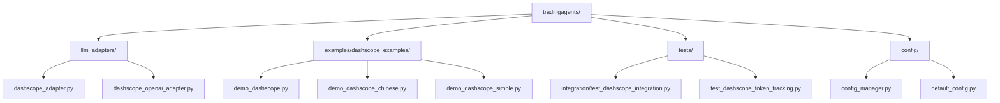
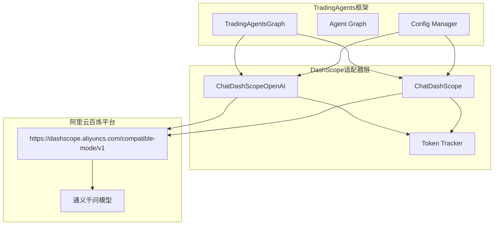
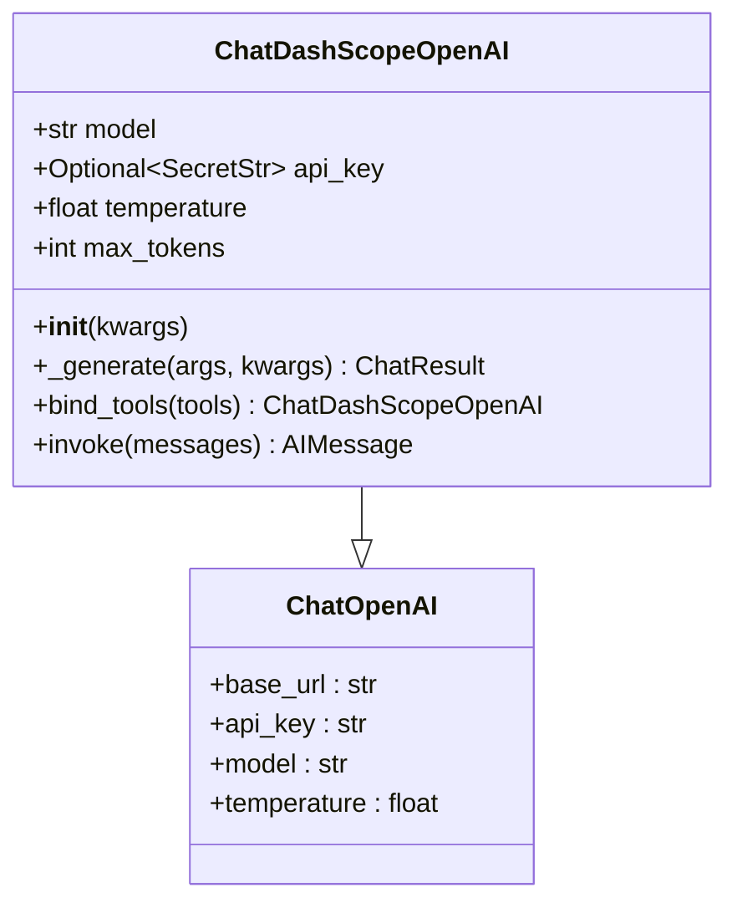
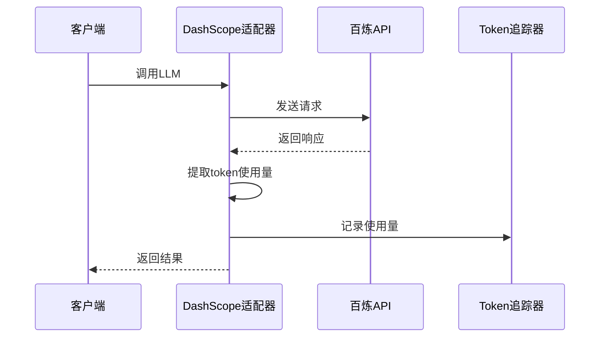
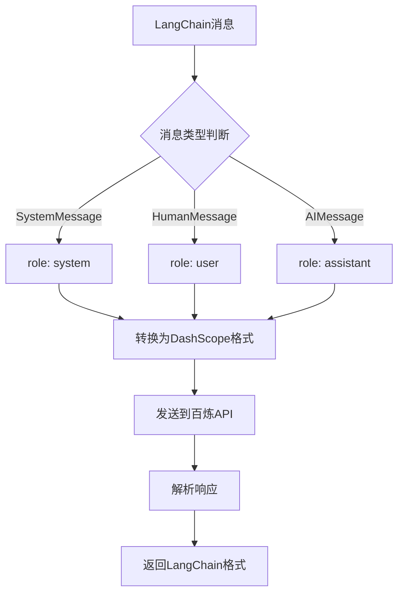
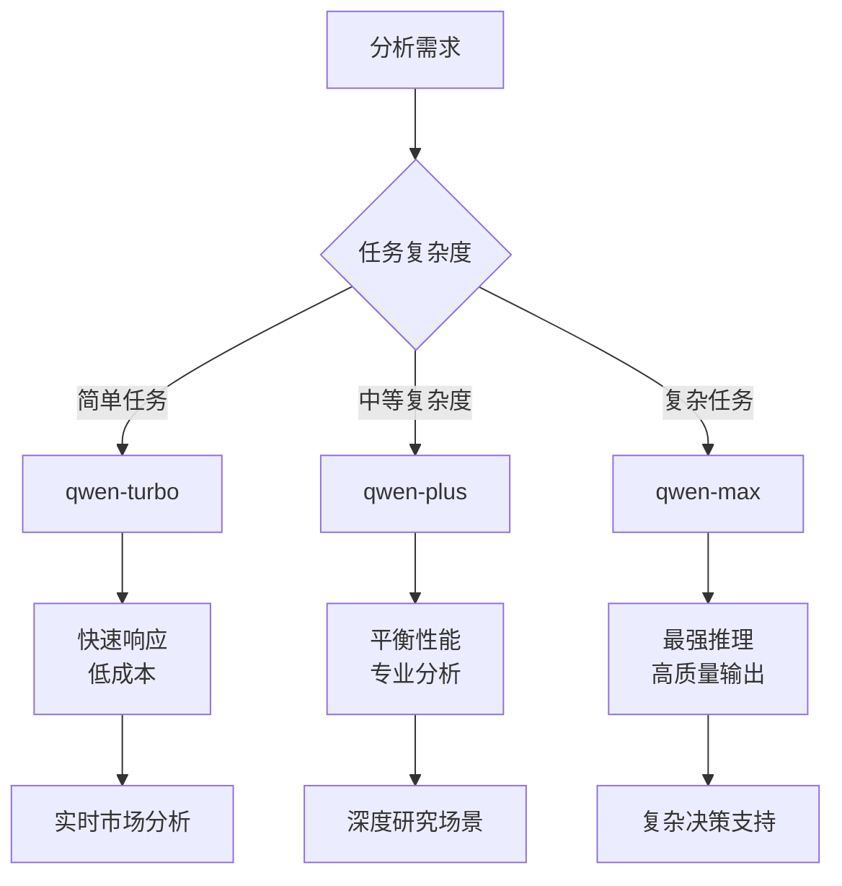
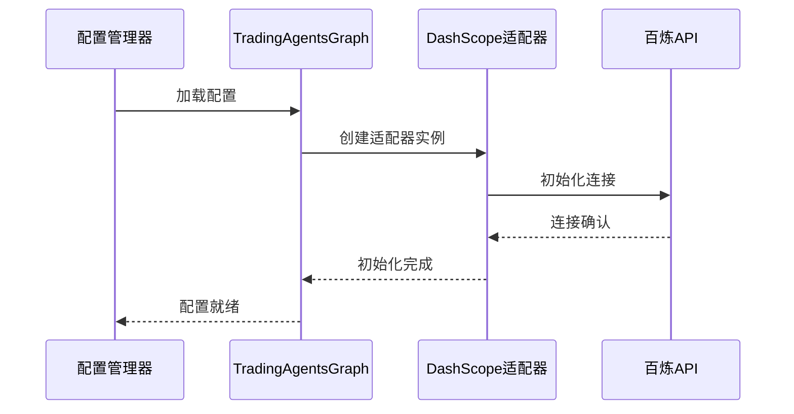
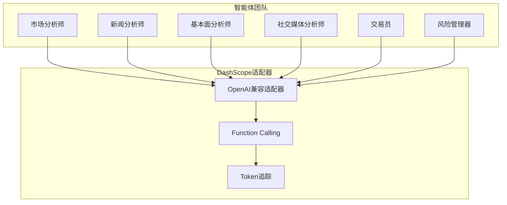
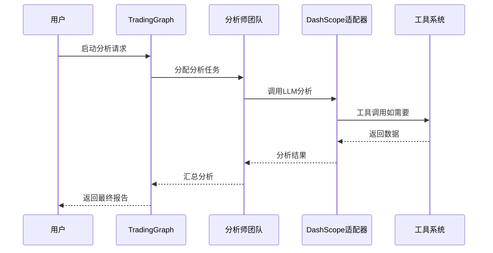
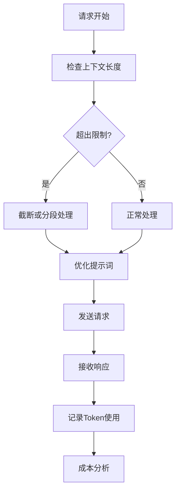

# DashScope适配器

<cite>
**本文档引用的文件**
- [dashscope_openai_adapter.py](file://tradingagents/llm_adapters/dashscope_openai_adapter.py)
- [dashscope_adapter.py](file://tradingagents/llm_adapters/dashscope_adapter.py)
- [demo_dashscope.py](file://examples/dashscope_examples/demo_dashscope.py)
- [demo_dashscope_chinese.py](file://examples/dashscope_examples/demo_dashscope_chinese.py)
- [demo_dashscope_simple.py](file://examples/dashscope_examples/demo_dashscope_simple.py)
- [trading_graph.py](file://tradingagents/graph/trading_graph.py)
- [config_manager.py](file://tradingagents/config/config_manager.py)
- [default_config.py](file://tradingagents/default_config.py)
- [test_dashscope_integration.py](file://tests/integration/test_dashscope_integration.py)
- [test_dashscope_token_tracking.py](file://tests/test_dashscope_token_tracking.py)
</cite>

## 目录
1. [简介](#简介)
2. [项目结构](#项目结构)
3. [核心组件](#核心组件)
4. [架构概览](#架构概览)
5. [详细组件分析](#详细组件分析)
6. [模型支持与特性](#模型支持与特性)
7. [配置与部署](#配置与部署)
8. [多智能体协作](#多智能体协作)
9. [性能优化与限流](#性能优化与限流)
10. [故障排除指南](#故障排除指南)
11. [结论](#结论)

## 简介

DashScope适配器是TradingAgents框架中专门为阿里云百炼平台设计的AI模型适配器。该适配器提供了两种实现方式：传统的LangChain兼容适配器和现代的OpenAI兼容适配器，后者支持原生的Function Calling功能，特别适合复杂的多智能体协作场景。

### 主要特性

- **OpenAI兼容接口**：通过`https://dashscope.aliyuncs.com/compatible-mode/v1`端点提供标准OpenAI API兼容性
- **原生Function Calling**：支持工具调用，无需额外的工具转换层
- **多种模型支持**：涵盖通义千问全系列模型，从Turbo到Max再到Long版本
- **Token追踪**：内置成本管理和使用量监控
- **多智能体友好**：专为TradingAgents的多智能体协作架构设计

## 项目结构



**图表来源**
- [dashscope_adapter.py](file://tradingagents/llm_adapters/dashscope_adapter.py#L1-L50)
- [dashscope_openai_adapter.py](file://tradingagents/llm_adapters/dashscope_openai_adapter.py#L1-L50)

## 核心组件

DashScope适配器包含两个主要组件：

### 1. 传统LangChain适配器
基于`ChatDashScope`类，提供标准的LangChain兼容接口，适用于需要严格LangChain规范的应用场景。

### 2. OpenAI兼容适配器  
基于`ChatDashScopeOpenAI`类，继承自`langchain_openai.ChatOpenAI`，提供完全的OpenAI API兼容性，支持原生Function Calling。

**章节来源**
- [dashscope_adapter.py](file://tradingagents/llm_adapters/dashscope_adapter.py#L25-L50)
- [dashscope_openai_adapter.py](file://tradingagents/llm_adapters/dashscope_openai_adapter.py#L18-L40)

## 架构概览



**图表来源**
- [trading_graph.py](file://tradingagents/graph/trading_graph.py#L150-L180)
- [dashscope_openai_adapter.py](file://tradingagents/llm_adapters/dashscope_openai_adapter.py#L25-L45)

## 详细组件分析

### ChatDashScopeOpenAI类

这是推荐的主要适配器，提供完整的OpenAI兼容性。

#### 核心功能特性



**图表来源**
- [dashscope_openai_adapter.py](file://tradingagents/llm_adapters/dashscope_openai_adapter.py#L25-L80)

#### 初始化配置

适配器自动配置以下参数：
- **base_url**: `https://dashscope.aliyuncs.com/compatible-mode/v1`
- **api_key**: 从环境变量`DASHSCOPE_API_KEY`读取
- **model**: 默认`qwen-turbo`
- **temperature**: 默认`0.1`
- **max_tokens**: 默认`2000`

#### Token追踪机制



**图表来源**
- [dashscope_openai_adapter.py](file://tradingagents/llm_adapters/dashscope_openai_adapter.py#L85-L120)

**章节来源**
- [dashscope_openai_adapter.py](file://tradingagents/llm_adapters/dashscope_openai_adapter.py#L25-L120)

### ChatDashScope类

传统适配器，提供LangChain兼容接口。

#### 消息格式转换



**图表来源**
- [dashscope_adapter.py](file://tradingagents/llm_adapters/dashscope_adapter.py#L85-L110)

**章节来源**
- [dashscope_adapter.py](file://tradingagents/llm_adapters/dashscope_adapter.py#L25-L150)

## 模型支持与特性

### 支持的通义千问模型

| 模型名称 | 上下文长度 | 功能特性 | 推荐场景 |
|---------|-----------|----------|----------|
| qwen-turbo | 8,192 | 快速响应，基础Function Calling | 日常对话、简单分析 |
| qwen-plus | 32,768 | 平衡性能和成本，完整Function Calling | 复杂分析、专业任务 |
| qwen-plus-latest | 32,768 | 最新功能，完整Function Calling | 最新功能使用 |
| qwen-max | 32,768 | 最强性能，完整Function Calling | 复杂推理、高质量输出 |
| qwen-max-latest | 32,768 | 最强性能和最新功能 | 最新功能和复杂任务 |
| qwen-long | 1,000,000 | 超长上下文，完整Function Calling | 长文档分析 |

### 模型选择策略



**图表来源**
- [dashscope_openai_adapter.py](file://tradingagents/llm_adapters/dashscope_openai_adapter.py#L131-L180)

**章节来源**
- [dashscope_openai_adapter.py](file://tradingagents/llm_adapters/dashscope_openai_adapter.py#L131-L180)

## 配置与部署

### 环境变量配置

```bash
# 阿里百炼API密钥
export DASHSCOPE_API_KEY=sk-your-api-key-here

# 可选：自定义基础URL（用于代理或测试）
export DASHSCOPE_BASE_URL=https://dashscope.aliyuncs.com/compatible-mode/v1

# 金融数据API密钥（TradingAgents必需）
export FINNHUB_API_KEY=your_finnhub_key
```

### 配置文件设置

```python
# 在DEFAULT_CONFIG中配置
DEFAULT_CONFIG = {
    # LLM提供商设置
    "llm_provider": "dashscope",
    "deep_think_llm": "qwen-plus-latest",  # 深度思考模型
    "quick_think_llm": "qwen-turbo",      # 快速思考模型
    
    # API端点配置
    "backend_url": "https://dashscope.aliyuncs.com/compatible-mode/v1",
    
    # 性能参数
    "max_debate_rounds": 1,  # 减少辩论轮次以降低成本
    "online_tools": True,    # 启用在线工具
}
```

### 集成到TradingAgents



**图表来源**
- [trading_graph.py](file://tradingagents/graph/trading_graph.py#L150-L200)

**章节来源**
- [config_manager.py](file://tradingagents/config/config_manager.py#L100-L150)
- [default_config.py](file://tradingagents/default_config.py#L10-L25)

## 多智能体协作

### TradingAgents中的集成

DashScope适配器在TradingAgents中提供了强大的多智能体协作能力：



**图表来源**
- [trading_graph.py](file://tradingagents/graph/trading_graph.py#L150-L200)

### 工具调用示例

```python
# 定义工具函数
@tool
def get_stock_data(ticker: str, start_date: str, end_date: str) -> str:
    """获取股票历史数据"""
    return f"股票 {ticker} 的数据从 {start_date} 到 {end_date}"

# 绑定工具到模型
llm_with_tools = llm.bind_tools([get_stock_data])

# 智能体调用工具
response = llm_with_tools.invoke("请获取AAPL过去30天的股票数据")
```

### 多智能体工作流程



**图表来源**
- [demo_dashscope.py](file://examples/dashscope_examples/demo_dashscope.py#L80-L120)

**章节来源**
- [demo_dashscope.py](file://examples/dashscope_examples/demo_dashscope.py#L50-L100)
- [demo_dashscope_chinese.py](file://examples/dashscope_examples/demo_dashscope_chinese.py#L50-L100)

## 性能优化与限流

### Token使用优化



**图表来源**
- [dashscope_openai_adapter.py](file://tradingagents/llm_adapters/dashscope_openai_adapter.py#L85-L120)

### 成本管理策略

| 策略 | 描述 | 适用场景 |
|------|------|----------|
| 模型分级使用 | 根据任务复杂度选择合适模型 | 所有场景 |
| 减少辩论轮次 | 降低`max_debate_rounds`参数 | 成本敏感场景 |
| 工具调用优化 | 只在必要时使用工具调用 | 高频分析场景 |
| 缓存机制 | 缓存重复查询结果 | 重复数据场景 |

### 并发处理建议

```python
# 高并发场景下的最佳实践
async def concurrent_analysis(stocks: List[str]):
    tasks = []
    for stock in stocks:
        task = asyncio.create_task(analyze_stock_with_dashscope(stock))
        tasks.append(task)
    
    results = await asyncio.gather(*tasks)
    return results
```

### 配置优化示例

```python
# 生产环境配置
production_config = {
    "llm_provider": "dashscope",
    "deep_think_llm": "qwen-plus",  # 平衡性能和成本
    "quick_think_llm": "qwen-turbo",  # 快速响应
    "max_debate_rounds": 1,  # 减少成本
    "max_risk_discuss_rounds": 1,
    "enable_cost_tracking": True,  # 启用成本监控
}
```

**章节来源**
- [test_dashscope_token_tracking.py](file://tests/test_dashscope_token_tracking.py#L50-L100)

## 故障排除指南

### 常见问题与解决方案

#### 1. API密钥问题

```bash
# 检查API密钥配置
echo $DASHSCOPE_API_KEY

# 验证密钥格式
python -c "
import os
key = os.getenv('DASHSCOPE_API_KEY')
print(f'API密钥: {key[:10] if key else \"未设置\"}')
print(f'长度: {len(key) if key else 0}')
"
```

#### 2. 连接测试

```python
# 测试基本连接
from tradingagents.llm_adapters import ChatDashScopeOpenAI

def test_connection():
    try:
        llm = ChatDashScopeOpenAI(model="qwen-turbo")
        response = llm.invoke("你好，请回复'连接成功'")
        print(f"连接成功: {response.content}")
        return True
    except Exception as e:
        print(f"连接失败: {e}")
        return False
```

#### 3. Function Calling测试

```python
# 测试工具调用功能
from langchain_core.tools import tool

@tool
def test_function(query: str) -> str:
    """测试工具"""
    return f"收到查询: {query}"

def test_function_calling():
    llm = ChatDashScopeOpenAI(model="qwen-plus-latest")
    llm_with_tools = llm.bind_tools([test_function])
    
    response = llm_with_tools.invoke("请使用test_function查询'hello'")
    print(f"工具调用: {hasattr(response, 'tool_calls')}")
```

### 性能监控

```python
# 监控Token使用情况
from tradingagents.config.config_manager import token_tracker

# 获取使用统计
stats = token_tracker.get_usage_statistics(days=7)
print(f"本周Token使用: {stats.get('total_tokens', 0)}")
print(f"本周成本: ¥{stats.get('total_cost', 0):.4f}")
```

### 日志配置

```python
# 启用详细日志
import logging
logging.getLogger('tradingagents.llm_adapters').setLevel(logging.DEBUG)
```

**章节来源**
- [test_dashscope_integration.py](file://tests/integration/test_dashscope_integration.py#L50-L100)

## 结论

DashScope适配器为TradingAgents框架提供了强大而灵活的阿里云百炼平台集成能力。通过OpenAI兼容接口，它不仅简化了集成过程，还充分利用了通义千问模型的原生Function Calling能力，特别适合复杂的多智能体协作场景。

### 主要优势

1. **开箱即用**：完整的OpenAI兼容性，无需额外适配
2. **功能完整**：支持原生工具调用，无需中间转换层
3. **成本可控**：内置Token追踪和成本管理
4. **模型丰富**：覆盖通义千问全系列，满足不同需求
5. **多智能体友好**：专为TradingAgents设计的协作架构

### 最佳实践建议

1. **根据任务选择模型**：简单任务用Turbo，复杂任务用Max
2. **合理配置辩论轮次**：在质量和成本间找到平衡
3. **启用成本监控**：及时了解Token使用情况
4. **定期测试连接**：确保生产环境稳定运行
5. **优化工具调用**：只在必要时使用工具功能

通过合理配置和使用DashScope适配器，TradingAgents能够在保持高性能的同时，有效控制成本，为用户提供优质的智能投顾服务。