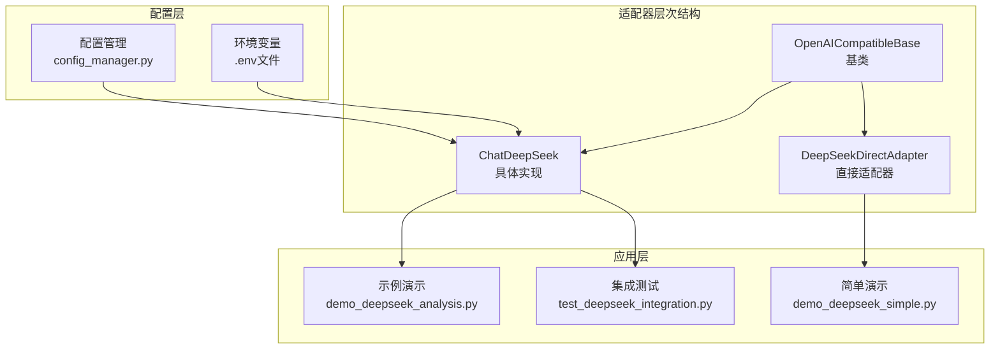
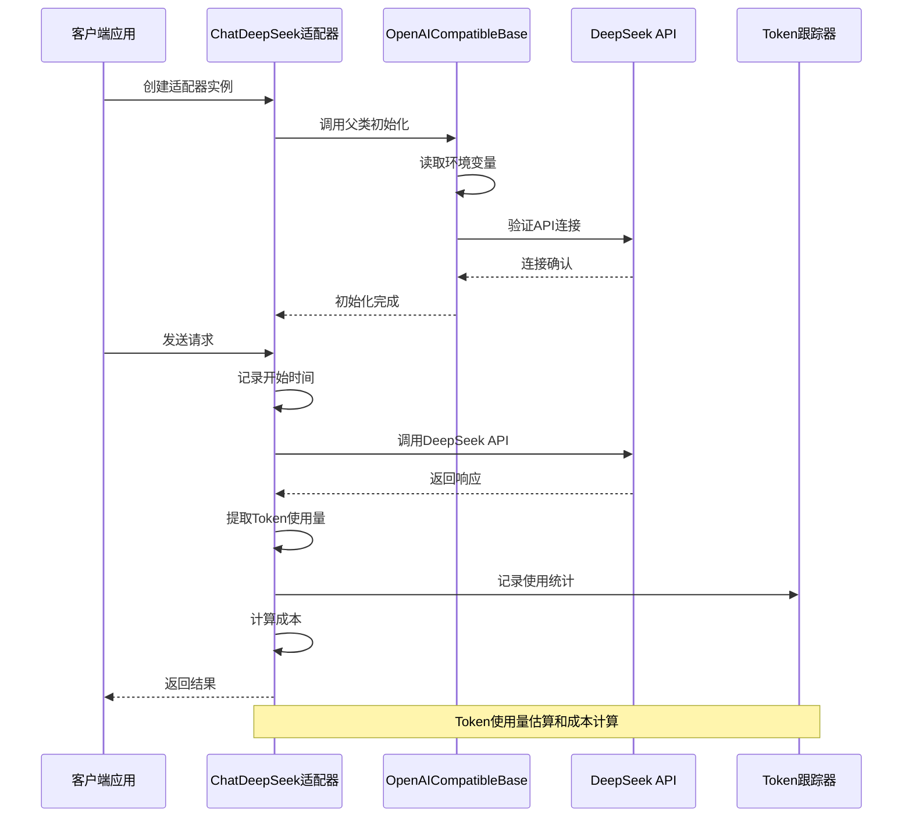
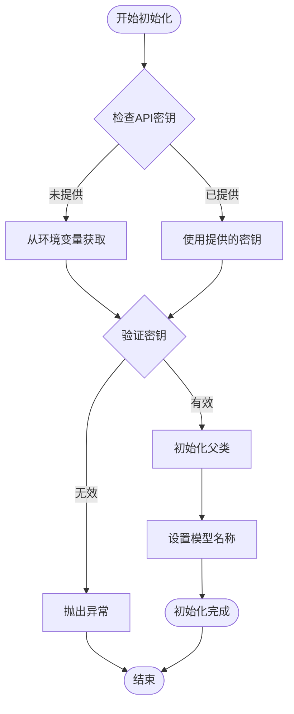
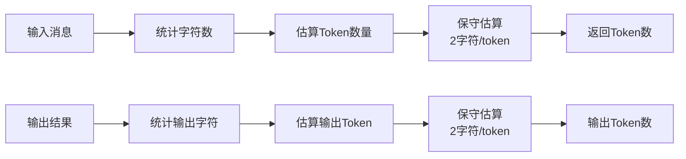
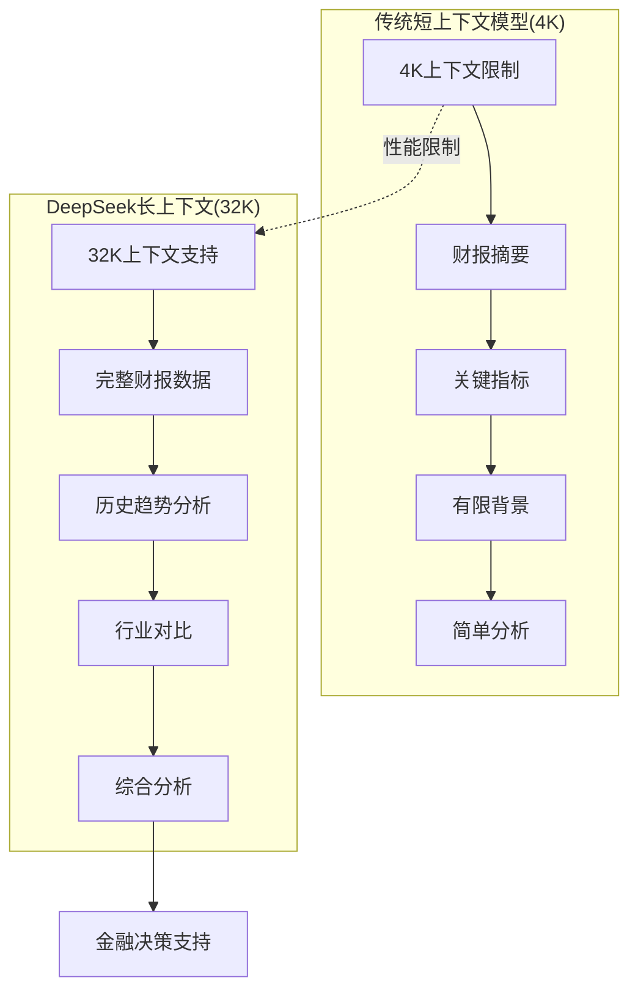
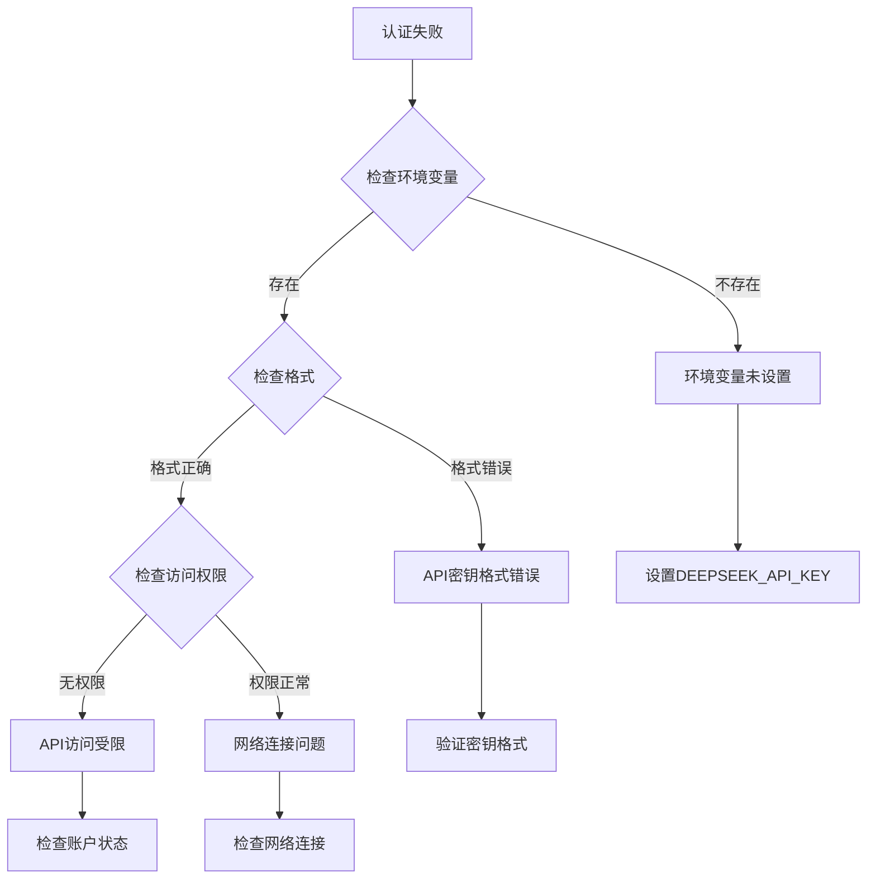
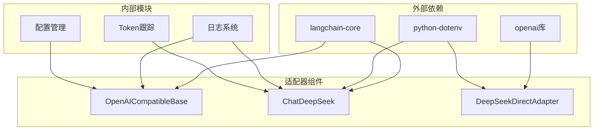
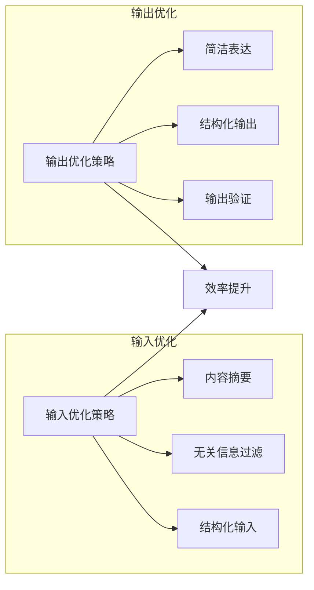
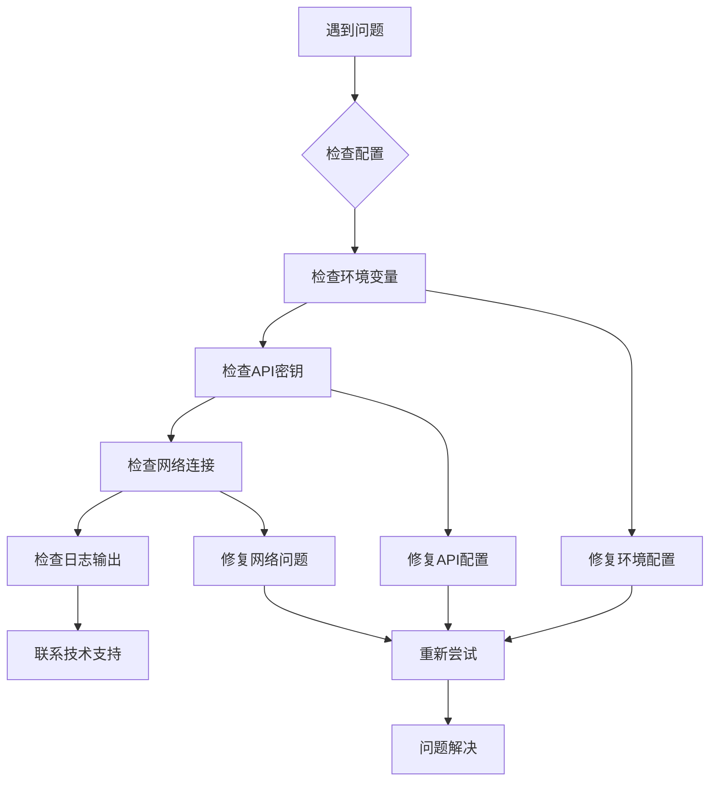

# DeepSeek适配器

<cite>
**本文档中引用的文件**
- [deepseek_adapter.py](file://tradingagents/llm_adapters/deepseek_adapter.py)
- [openai_compatible_base.py](file://tradingagents/llm_adapters/openai_compatible_base.py)
- [deepseek_direct_adapter.py](file://tradingagents/llm_adapters/deepseek_direct_adapter.py)
- [demo_deepseek_analysis.py](file://examples/demo_deepseek_analysis.py)
- [demo_deepseek_simple.py](file://examples/demo_deepseek_simple.py)
- [test_deepseek_integration.py](file://tests/test_deepseek_integration.py)
- [config_manager.py](file://tradingagents/config/config_manager.py)
</cite>

## 目录
1. [简介](#简介)
2. [项目结构](#项目结构)
3. [核心组件](#核心组件)
4. [架构概览](#架构概览)
5. [详细组件分析](#详细组件分析)
6. [依赖关系分析](#依赖关系分析)
7. [性能考虑](#性能考虑)
8. [故障排除指南](#故障排除指南)
9. [结论](#结论)

## 简介

ChatDeepSeekOpenAI适配器是TradingAgents系统中专门为DeepSeek大语言模型设计的适配器，它通过继承OpenAICompatibleBase基类，实现了对DeepSeek API的无缝集成。该适配器不仅支持标准的OpenAI接口规范，还特别针对金融分析场景进行了优化，提供了强大的Token使用统计功能和成本控制机制。

DeepSeek作为国内领先的AI模型提供商，其提供的deepseek-chat模型具有32K的长上下文能力，在处理复杂的财报分析、市场研究等金融领域任务时表现出色。适配器的设计充分考虑了金融分析的特殊需求，包括精确的成本计算、详细的使用统计和灵活的配置选项。

## 项目结构

DeepSeek适配器在项目中的组织结构体现了清晰的分层设计理念：

**图表来源**
- [openai_compatible_base.py](file://tradingagents/llm_adapters/openai_compatible_base.py#L30-L80)
- [deepseek_adapter.py](file://tradingagents/llm_adapters/deepseek_adapter.py#L30-L85)
- [deepseek_direct_adapter.py](file://tradingagents/llm_adapters/deepseek_direct_adapter.py#L17-L63)

**章节来源**
- [deepseek_adapter.py](file://tradingagents/llm_adapters/deepseek_adapter.py#L1-L50)
- [openai_compatible_base.py](file://tradingagents/llm_adapters/openai_compatible_base.py#L1-L50)

## 核心组件

### ChatDeepSeek类

ChatDeepSeek类是DeepSeek适配器的核心实现，它继承自ChatOpenAI并扩展了Token使用统计功能。该类的主要特性包括：

- **继承关系**：通过继承ChatOpenAI获得OpenAI兼容的接口支持
- **Token跟踪**：内置详细的Token使用量统计和成本计算
- **环境配置**：自动从DEEPSEEK_API_KEY环境变量读取API密钥
- **默认参数**：预设deepseek-chat模型和0.1的温度值

### OpenAICompatibleBase基类

OpenAICompatibleBase基类为所有OpenAI兼容的LLM提供商提供了统一的基础实现框架：

- **标准化接口**：提供一致的API接口规范
- **配置管理**：统一的环境变量和参数处理
- **扩展性**：支持多种LLM提供商的适配
- **日志记录**：内置详细的日志记录功能

### DeepSeekDirectAdapter

DeepSeekDirectAdapter提供了另一种实现方式，直接使用OpenAI库调用DeepSeek API：

- **轻量级设计**：避免langchain_openai的兼容性问题
- **直接调用**：使用原生OpenAI客户端
- **工具支持**：内置工具调用和分析功能

**章节来源**
- [deepseek_adapter.py](file://tradingagents/llm_adapters/deepseek_adapter.py#L30-L100)
- [openai_compatible_base.py](file://tradingagents/llm_adapters/openai_compatible_base.py#L30-L120)
- [deepseek_direct_adapter.py](file://tradingagents/llm_adapters/deepseek_direct_adapter.py#L17-L80)

## 架构概览

DeepSeek适配器采用了分层架构设计，确保了良好的可维护性和扩展性：

**图表来源**
- [deepseek_adapter.py](file://tradingagents/llm_adapters/deepseek_adapter.py#L60-L150)
- [openai_compatible_base.py](file://tradingagents/llm_adapters/openai_compatible_base.py#L80-L150)

## 详细组件分析

### 初始化过程分析

DeepSeek适配器的初始化过程体现了精心设计的配置管理和错误处理机制：

**图表来源**
- [deepseek_adapter.py](file://tradingagents/llm_adapters/deepseek_adapter.py#L40-L85)

### Token使用统计机制

适配器内置了完善的Token使用统计和成本计算功能：

#### Token估算算法

**图表来源**
- [deepseek_adapter.py](file://tradingagents/llm_adapters/deepseek_adapter.py#L155-L200)

#### 成本计算流程

适配器使用精确的成本计算公式，基于官方定价：

| 参数 | 计算公式 | 示例 |
|------|----------|------|
| 输入成本 | `(input_tokens / 1000) × 0.0014` | 1000 tokens → ¥0.0014 |
| 输出成本 | `(output_tokens / 1000) × 0.0028` | 500 tokens → ¥0.0014 |
| 总成本 | 输入成本 + 输出成本 | 1000+500 tokens → ¥0.0028 |

**章节来源**
- [deepseek_adapter.py](file://tradingagents/llm_adapters/deepseek_adapter.py#L85-L150)

### 长上下文优势分析

DeepSeek的32K上下文长度在金融分析场景中具有显著优势：

#### 复杂财报分析场景

**图表来源**
- [demo_deepseek_analysis.py](file://examples/demo_deepseek_analysis.py#L80-L120)

#### 金融分析应用场景

| 应用场景 | 传统模型挑战 | DeepSeek优势 |
|----------|--------------|--------------|
| 完整财报分析 | 上下文不足，无法包含全部数据 | 支持完整财报文档分析 |
| 行业对比研究 | 无法同时考虑多个公司 | 可并行分析多家公司数据 |
| 长期趋势分析 | 无法整合历史数据 | 支持多年历史数据分析 |
| 风险评估 | 缺乏全面背景信息 | 可结合多维度风险因素 |

**章节来源**
- [demo_deepseek_analysis.py](file://examples/demo_deepseek_analysis.py#L140-L200)

### 认证失败排查机制

适配器提供了完善的认证失败诊断和解决机制：

**图表来源**
- [test_deepseek_integration.py](file://tests/test_deepseek_integration.py#L15-L40)

**章节来源**
- [test_deepseek_integration.py](file://tests/test_deepseek_integration.py#L15-L50)

## 依赖关系分析

DeepSeek适配器的依赖关系体现了模块化设计的优势：

**图表来源**
- [deepseek_adapter.py](file://tradingagents/llm_adapters/deepseek_adapter.py#L1-L20)
- [openai_compatible_base.py](file://tradingagents/llm_adapters/openai_compatible_base.py#L1-L20)

**章节来源**
- [deepseek_adapter.py](file://tradingagents/llm_adapters/deepseek_adapter.py#L1-L30)
- [openai_compatible_base.py](file://tradingagents/llm_adapters/openai_compatible_base.py#L1-L30)

## 性能考虑

### 成本优化策略

DeepSeek适配器在设计时充分考虑了成本控制和性能优化：

#### 温度参数优化

默认温度值0.1的选择基于以下考量：
- **稳定性优先**：较低的温度值产生更一致、可预测的输出
- **金融适用性**：金融分析需要准确性和一致性
- **成本效益**：稳定的输出意味着更少的迭代和修正

#### Token使用优化

### 并发处理能力

适配器支持并发调用，通过以下机制保证性能：

- **连接池管理**：复用HTTP连接减少建立开销
- **异步支持**：支持异步调用模式
- **缓存机制**：智能缓存常用配置和响应

## 故障排除指南

### 常见问题及解决方案

#### API密钥相关问题

| 问题类型 | 症状 | 解决方案 |
|----------|------|----------|
| 密钥缺失 | `ValueError: DeepSeek API密钥未找到` | 设置DEEPSEEK_API_KEY环境变量 |
| 格式错误 | 认证失败或401错误 | 验证API密钥格式和有效性 |
| 权限不足 | 403 Forbidden错误 | 检查账户权限和配额 |
| 网络问题 | 连接超时或DNS解析失败 | 检查网络连接和防火墙设置 |

#### 配置问题诊断

**图表来源**
- [test_deepseek_integration.py](file://tests/test_deepseek_integration.py#L15-L40)

#### 性能问题排查

对于性能相关的问题，建议按照以下顺序排查：

1. **网络延迟**：检查API响应时间和网络质量
2. **Token使用**：监控输入输出Token数量
3. **并发限制**：确认是否达到API调用频率限制
4. **内存使用**：检查长时间运行时的内存占用

**章节来源**
- [test_deepseek_integration.py](file://tests/test_deepseek_integration.py#L15-L100)

## 结论

ChatDeepSeekOpenAI适配器代表了TradingAgents系统中AI模型集成的最佳实践。通过继承OpenAICompatibleBase基类，它不仅获得了OpenAI接口的兼容性，还针对DeepSeek的特性和金融分析场景进行了深度优化。

### 主要优势

1. **标准化接口**：统一的OpenAI兼容接口简化了集成复杂度
2. **Token统计**：详细的使用量跟踪和成本计算功能
3. **长上下文支持**：32K上下文长度适合复杂的金融分析任务
4. **成本控制**：精确的成本计算和使用统计
5. **灵活配置**：支持多种配置方式和环境变量

### 适用场景

DeepSeek适配器特别适合以下应用场景：
- **金融分析**：复杂的财报分析和市场研究
- **投资决策**：多维度的投资价值评估
- **风险管理**：全面的风险因素分析
- **学术研究**：需要大量上下文的研究工作

### 未来发展

随着DeepSeek模型的持续演进，适配器也将不断优化：
- **模型更新**：支持新发布的DeepSeek模型
- **功能增强**：增加更多专业化的金融分析功能
- **性能优化**：进一步提升处理效率和降低成本
- **生态扩展**：与其他金融工具和服务的深度集成

通过ChatDeepSeekOpenAI适配器，TradingAgents系统能够为用户提供高质量、高性价比的AI金融服务，真正实现了人工智能技术在金融领域的落地应用。