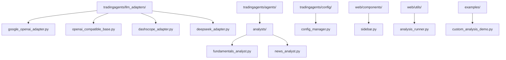
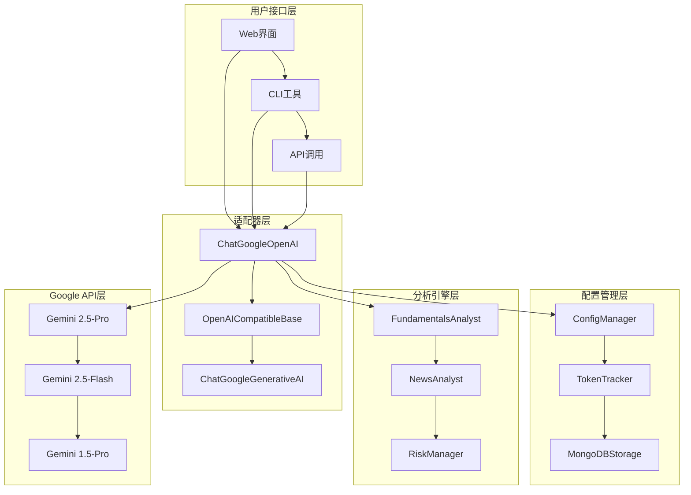
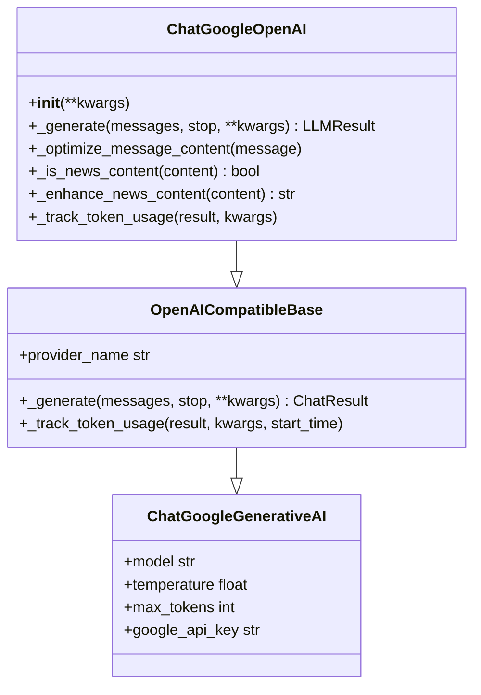
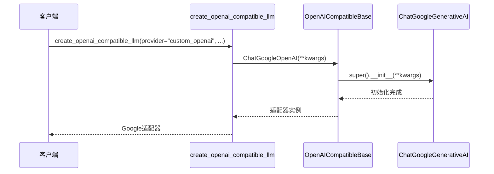
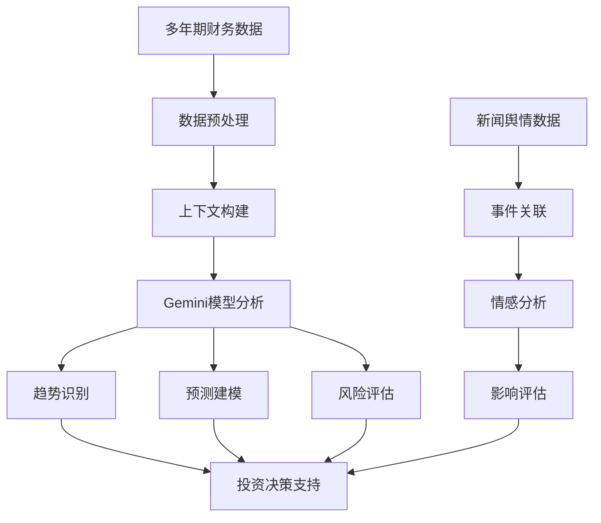
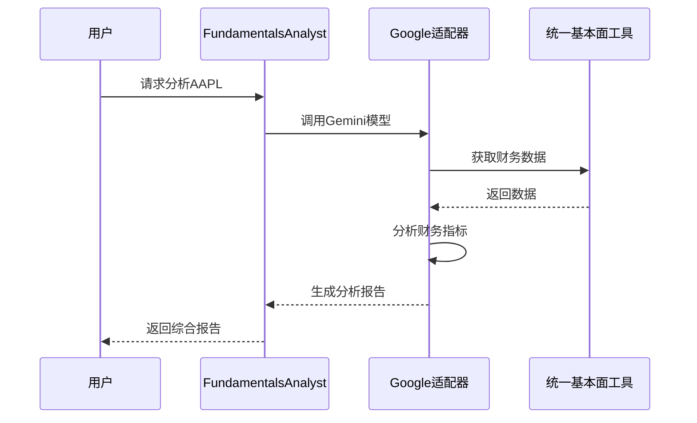
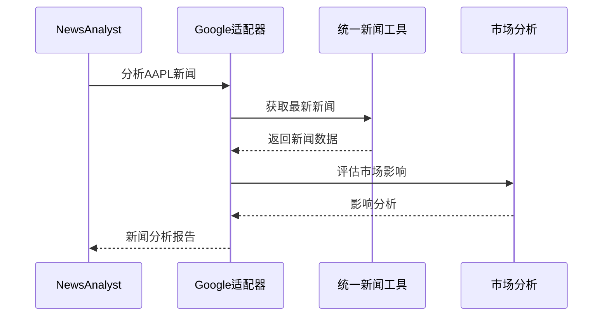
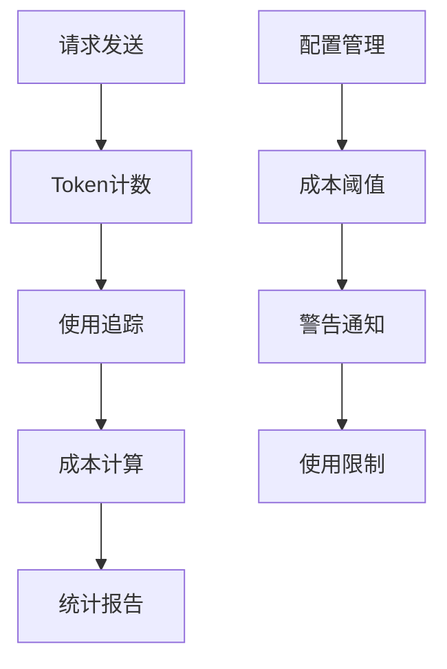
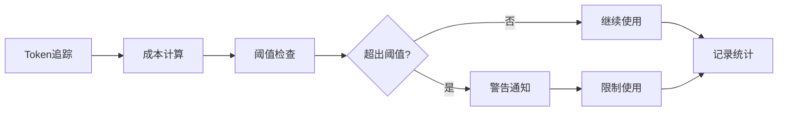

# Google适配器

<cite>
**本文档引用的文件**
- [google_openai_adapter.py](file://tradingagents/llm_adapters/google_openai_adapter.py)
- [openai_compatible_base.py](file://tradingagents/llm_adapters/openai_compatible_base.py)
- [config_manager.py](file://tradingagents/config/config_manager.py)
- [fundamentals_analyst.py](file://tradingagents/agents/analysts/fundamentals_analyst.py)
- [news_analyst.py](file://tradingagents/agents/analysts/news_analyst.py)
- [custom_analysis_demo.py](file://examples/custom_analysis_demo.py)
- [sidebar.py](file://web/components/sidebar.py)
- [analysis_runner.py](file://web/utils/analysis_runner.py)
</cite>

## 目录
1. [简介](#简介)
2. [项目结构](#项目结构)
3. [核心组件](#核心组件)
4. [架构概览](#架构概览)
5. [详细组件分析](#详细组件分析)
6. [Gemini大模型超长上下文优势](#gemini大模型超长上下文优势)
7. [实际应用案例](#实际应用案例)
8. [成本控制和响应延迟优化](#成本控制和响应延迟优化)
9. [故障排除指南](#故障排除指南)
10. [结论](#结论)

## 简介

Google适配器是TradingAgents-CN项目中的一个重要组件，它通过OpenAI兼容接口为TradingAgents提供了Google AI（Gemini）系列模型的强大功能。该适配器解决了Google模型工具调用格式不匹配的问题，使得Gemini模型能够无缝集成到TradingAgents的分析流程中。

Google适配器的核心价值在于其对Gemini系列模型的支持，特别是那些具有超长上下文能力的模型（最高支持1M tokens），这些模型在处理多年期财务数据和新闻舆情分析方面展现出独特优势。

## 项目结构

Google适配器在项目中的组织结构如下：

**图表来源**
- [google_openai_adapter.py](file://tradingagents/llm_adapters/google_openai_adapter.py#L1-L50)
- [openai_compatible_base.py](file://tradingagents/llm_adapters/openai_compatible_base.py#L1-L50)

**章节来源**
- [google_openai_adapter.py](file://tradingagents/llm_adapters/google_openai_adapter.py#L1-L351)
- [openai_compatible_base.py](file://tradingagents/llm_adapters/openai_compatible_base.py#L1-L436)

## 核心组件

Google适配器包含以下核心组件：

### 1. ChatGoogleOpenAI类
这是Google适配器的主要实现类，继承自`ChatGoogleGenerativeAI`，专门针对TradingAgents的需求进行了优化。

### 2. OpenAICompatibleBase基类
提供统一的OpenAI兼容接口，支持多种LLM提供商的标准化接入。

### 3. create_openai_compatible_llm工厂函数
通过`custom_openai`提供商标识，动态创建Google AI模型实例。

### 4. 模型配置系统
支持多种Gemini模型的配置，包括最新的Gemini 2.5系列和经典的Gemini 1.5系列。

**章节来源**
- [google_openai_adapter.py](file://tradingagents/llm_adapters/google_openai_adapter.py#L20-L80)
- [openai_compatible_base.py](file://tradingagents/llm_adapters/openai_compatible_base.py#L30-L100)

## 架构概览

Google适配器的整体架构采用了分层设计，确保了良好的可扩展性和维护性：

**图表来源**
- [google_openai_adapter.py](file://tradingagents/llm_adapters/google_openai_adapter.py#L20-L50)
- [config_manager.py](file://tradingagents/config/config_manager.py#L50-L100)

## 详细组件分析

### ChatGoogleOpenAI类分析

ChatGoogleOpenAI是Google适配器的核心类，它继承自`ChatGoogleGenerativeAI`并进行了专门的优化：

**图表来源**
- [google_openai_adapter.py](file://tradingagents/llm_adapters/google_openai_adapter.py#L20-L80)
- [openai_compatible_base.py](file://tradingagents/llm_adapters/openai_compatible_base.py#L30-L100)

#### 关键特性

1. **工具调用优化**：解决了Google模型工具调用返回格式与系统期望不匹配的问题
2. **新闻内容增强**：自动优化新闻内容格式，添加必要的关键词和结构化信息
3. **Token使用追踪**：精确追踪每个请求的Token使用情况
4. **错误处理机制**：优雅处理API调用失败，返回有意义的错误信息

**章节来源**
- [google_openai_adapter.py](file://tradingagents/llm_adapters/google_openai_adapter.py#L47-L120)

### OpenAICompatibleBase基类分析

OpenAICompatibleBase提供了统一的OpenAI兼容接口，支持多种LLM提供商：

**图表来源**
- [openai_compatible_base.py](file://tradingagents/llm_adapters/openai_compatible_base.py#L381-L413)

**章节来源**
- [openai_compatible_base.py](file://tradingagents/llm_adapters/openai_compatible_base.py#L30-L150)

### 模型配置系统

Google适配器支持多种Gemini模型，每个模型都有详细的配置信息：

| 模型名称 | 上下文长度 | 功能支持 | 响应时间 | 推荐用途 |
|---------|-----------|----------|----------|----------|
| gemini-2.5-pro | 32,768 | 是 | 16.68s | 复杂推理、专业分析 |
| gemini-2.5-flash | 32,768 | 是 | 2.73s | 快速响应、实时分析 |
| gemini-2.5-flash-lite-preview-06-17 | 32,768 | 是 | 1.45s | 超快响应、高频调用 |
| gemini-2.0-flash | 32,768 | 是 | 1.87s | 快速响应、实时分析 |
| gemini-1.5-pro | 32,768 | 是 | 2.25s | 复杂分析、专业任务 |
| gemini-1.5-flash | 32,768 | 是 | 2.87s | 快速任务、日常对话 |

**章节来源**
- [google_openai_adapter.py](file://tradingagents/llm_adapters/google_openai_adapter.py#L180-L280)

## Gemini大模型超长上下文优势

### 超长上下文能力

Gemini系列模型最显著的优势是其超长上下文能力，特别是Gemini 1.5 Pro模型支持高达1M tokens的上下文长度。这种能力在金融分析领域具有革命性意义：

#### 1. 多年期财务数据分析
- **历史数据整合**：能够同时处理多年的历史财务报表数据
- **趋势分析**：支持跨年度的财务趋势分析和预测
- **基准对比**：可以进行长时间跨度的行业基准对比

#### 2. 新闻舆情分析
- **事件追踪**：完整追踪某个公司或行业的长期发展轨迹
- **情感分析**：分析多年间市场情绪的变化趋势
- **影响评估**：评估重大事件对公司的长期影响

#### 3. 综合投资研究
- **多维度分析**：同时考虑财务、市场、政策等多个维度的信息
- **情景模拟**：基于历史数据进行多种投资情景的模拟
- **风险管理**：进行全面的风险评估和压力测试

### 实际应用场景

**图表来源**
- [fundamentals_analyst.py](file://tradingagents/agents/analysts/fundamentals_analyst.py#L100-L200)
- [news_analyst.py](file://tradingagents/agents/analysts/news_analyst.py#L50-L150)

**章节来源**
- [fundamentals_analyst.py](file://tradingagents/agents/analysts/fundamentals_analyst.py#L1-L100)
- [news_analyst.py](file://tradingagents/agents/analysts/news_analyst.py#L1-L100)

## 实际应用案例

### 案例1：综合性投资研究报告生成

以下是使用Google适配器生成综合性投资研究报告的实际流程：

#### 1. 基本面分析

**图表来源**
- [fundamentals_analyst.py](file://tradingagents/agents/analysts/fundamentals_analyst.py#L200-L300)

#### 2. 新闻事件分析

**图表来源**
- [news_analyst.py](file://tradingagents/agents/analysts/news_analyst.py#L200-L300)

### 案例2：生成综合性投资研究报告

基于Gemini模型的超长上下文能力，可以生成包含以下内容的综合性报告：

#### 报告结构
1. **公司概况**：基于多年财务数据的公司发展史
2. **财务分析**：过去5年的财务健康状况
3. **市场分析**：行业地位和竞争格局演变
4. **新闻影响**：重大事件对公司的影响
5. **风险评估**：长期风险因素分析
6. **投资建议**：基于综合分析的投资建议

**章节来源**
- [fundamentals_analyst.py](file://tradingagents/agents/analysts/fundamentals_analyst.py#L300-L400)
- [news_analyst.py](file://tradingagents/agents/analysts/news_analyst.py#L300-L347)

## 成本控制和响应延迟优化

### Token使用优化策略

Google适配器实现了精细的Token使用追踪和优化机制：

#### 1. Token使用监控

**图表来源**
- [config_manager.py](file://tradingagents/config/config_manager.py#L600-L700)

#### 2. 响应时间优化

不同Gemini模型的响应时间优化策略：

| 模型系列 | 响应时间 | 优化策略 | 适用场景 |
|---------|----------|----------|----------|
| Gemini 2.5-Pro | 16.68s | 高质量分析 | 复杂投资决策 |
| Gemini 2.5-Flash | 2.73s | 平衡性能 | 日常分析任务 |
| Gemini 2.5-Flash-Lite | 1.45s | 最快响应 | 实时监控 |
| Gemini 2.0-Flash | 1.87s | 快速分析 | 高频交易 |

#### 3. 成本控制机制

**图表来源**
- [config_manager.py](file://tradingagents/config/config_manager.py#L700-L727)

**章节来源**
- [config_manager.py](file://tradingagents/config/config_manager.py#L650-L727)

## 故障排除指南

### 常见问题及解决方案

#### 1. API密钥配置问题
- **问题**：Google API密钥未找到
- **解决方案**：设置`GOOGLE_API_KEY`环境变量或在配置中指定

#### 2. 网络连接问题
- **问题**：无法连接到Google API端点
- **解决方案**：检查网络连接，确认防火墙设置

#### 3. 模型调用失败
- **问题**：模型调用返回错误
- **解决方案**：检查模型名称拼写，确认API权限

#### 4. 工具调用格式不匹配
- **问题**：Google模型工具调用返回格式不符合预期
- **解决方案**：使用Google适配器的工具调用处理器自动转换格式

**章节来源**
- [google_openai_adapter.py](file://tradingagents/llm_adapters/google_openai_adapter.py#L249-L351)

## 结论

Google适配器为TradingAgents-CN项目提供了强大的Google AI（Gemini）模型支持，特别是在处理超长上下文数据方面表现出色。通过OpenAI兼容接口的设计，它实现了与TradingAgents现有架构的无缝集成。

### 主要优势

1. **超长上下文能力**：支持高达1M tokens的上下文长度，适合处理多年期财务数据和复杂分析任务
2. **统一接口**：通过OpenAI兼容基类提供标准化的接口，便于集成和维护
3. **智能优化**：自动优化工具调用格式和消息内容，提升用户体验
4. **成本控制**：完善的Token使用追踪和成本控制机制
5. **灵活配置**：支持多种Gemini模型的灵活配置和切换

### 应用前景

Google适配器在金融分析领域的应用前景广阔，特别是在需要处理大量历史数据和进行长期趋势分析的场景中。随着Gemini模型的持续优化和升级，它将在投资研究、风险管理和市场分析等方面发挥越来越重要的作用。