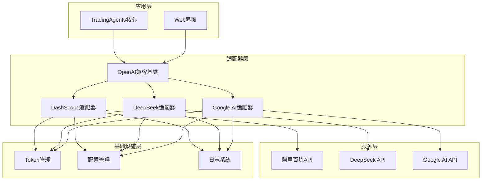
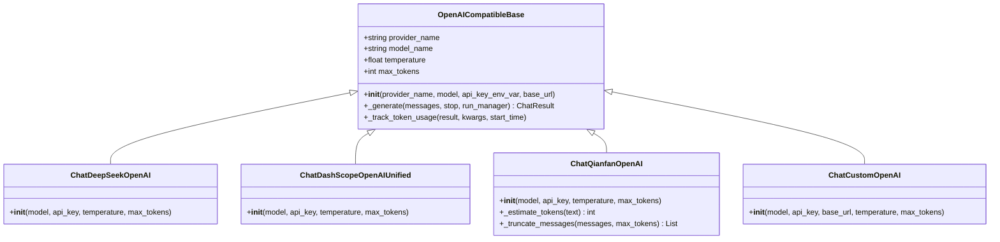
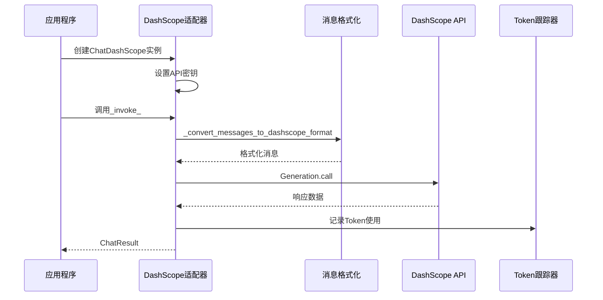
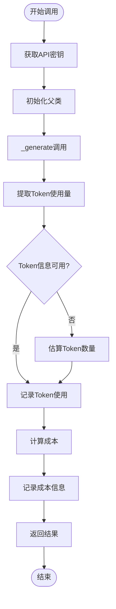
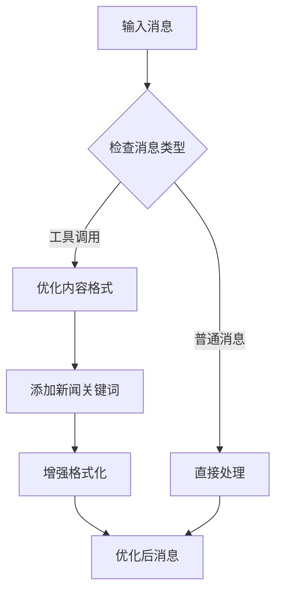
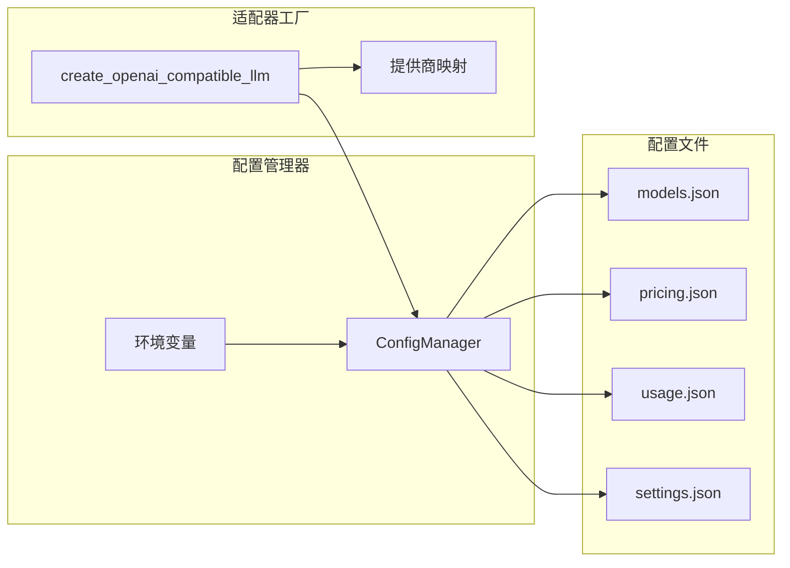
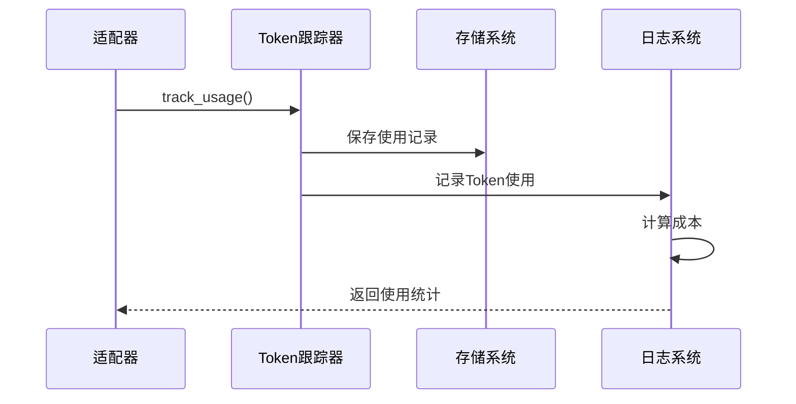
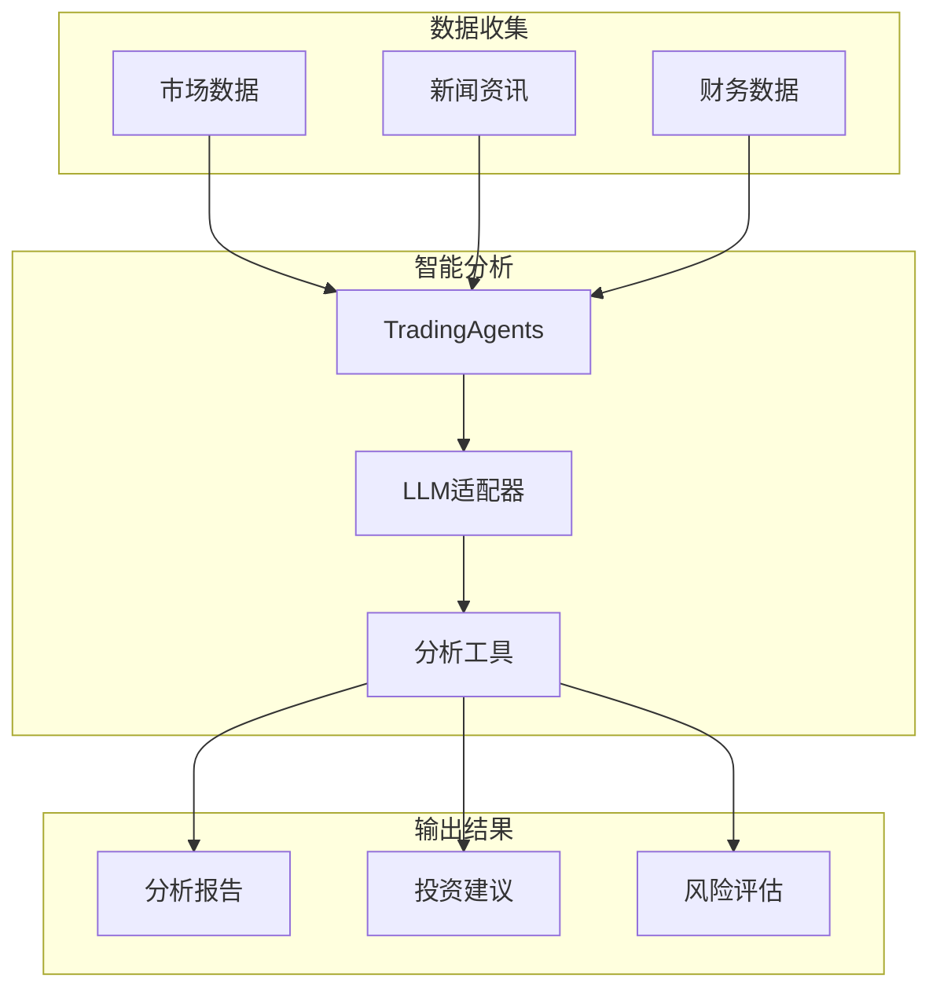

# LLM适配器实现

<cite>
**本文档中引用的文件**
- [openai_compatible_base.py](file://tradingagents/llm_adapters/openai_compatible_base.py)
- [dashscope_adapter.py](file://tradingagents/llm_adapters/dashscope_adapter.py)
- [deepseek_adapter.py](file://tradingagents/llm_adapters/deepseek_adapter.py)
- [google_openai_adapter.py](file://tradingagents/llm_adapters/google_openai_adapter.py)
- [demo_deepseek_analysis.py](file://examples/demo_deepseek_analysis.py)
- [demo_dashscope.py](file://examples/dashscope_examples/demo_dashscope.py)
- [demo_dashscope_chinese.py](file://examples/dashscope_examples/demo_dashscope_chinese.py)
- [config_manager.py](file://tradingagents/config/config_manager.py)
- [default_config.py](file://tradingagents/default_config.py)
- [test_deepseek_integration.py](file://tests/test_deepseek_integration.py)
- [test_dashscope_integration.py](file://tests/integration/test_dashscope_integration.py)
</cite>

## 目录
1. [简介](#简介)
2. [架构概览](#架构概览)
3. [OpenAI兼容基类设计](#openai兼容基类设计)
4. [DashScope适配器实现](#dashscope适配器实现)
5. [DeepSeek适配器实现](#deepseek适配器实现)
6. [Google AI适配器实现](#google-ai适配器实现)
7. [适配器配置与管理](#适配器配置与管理)
8. [性能优化与监控](#性能优化与监控)
9. [实际应用场景](#实际应用场景)
10. [故障排除指南](#故障排除指南)
11. [总结](#总结)

## 简介

TradingAgents项目实现了统一的LLM适配器架构，支持多种主流大语言模型提供商，包括阿里云DashScope、DeepSeek、Google AI等。这些适配器通过继承OpenAI兼容基类，提供了统一的接口来封装不同提供商的API差异，实现了标准化的认证、请求格式、响应解析等功能。

## 架构概览

LLM适配器系统采用分层架构设计，核心包含以下几个层次：



**图表来源**
- [openai_compatible_base.py](file://tradingagents/llm_adapters/openai_compatible_base.py#L1-L50)
- [dashscope_adapter.py](file://tradingagents/llm_adapters/dashscope_adapter.py#L1-L50)
- [deepseek_adapter.py](file://tradingagents/llm_adapters/deepseek_adapter.py#L1-L50)
- [google_openai_adapter.py](file://tradingagents/llm_adapters/google_openai_adapter.py#L1-L50)

## OpenAI兼容基类设计

### 基类架构

OpenAI兼容基类是整个适配器系统的核心，它继承自`langchain_openai.ChatOpenAI`，为所有支持OpenAI接口的LLM提供商提供统一的基础实现。



**图表来源**
- [openai_compatible_base.py](file://tradingagents/llm_adapters/openai_compatible_base.py#L25-L100)

### 核心特性

1. **统一初始化流程**：所有适配器都遵循相同的初始化模式，包括API密钥获取、参数验证和基础URL设置。

2. **Token跟踪机制**：内置Token使用量统计功能，支持成本计算和使用监控。

3. **错误处理与重试**：提供统一的错误处理机制和重试策略。

4. **配置灵活性**：支持环境变量配置和运行时参数覆盖。

**章节来源**
- [openai_compatible_base.py](file://tradingagents/llm_adapters/openai_compatible_base.py#L25-L150)

## DashScope适配器实现

### 设计特点

DashScope适配器专门为阿里云百炼平台设计，提供了完整的LangChain兼容接口，支持通义千问系列模型的各种功能。



**图表来源**
- [dashscope_adapter.py](file://tradingagents/llm_adapters/dashscope_adapter.py#L80-L150)

### 核心功能

1. **消息格式转换**：将LangChain消息格式转换为DashScope API所需的格式。

2. **多模态支持**：支持文本和图像等多模态内容处理。

3. **工具调用绑定**：提供工具绑定功能，支持函数调用。

4. **异步操作支持**：虽然目前是同步实现，但架构支持未来的异步扩展。

### 配置参数

| 参数 | 类型 | 默认值 | 描述 |
|------|------|--------|------|
| model | string | "qwen-turbo" | 模型名称 |
| temperature | float | 0.1 | 生成温度 |
| max_tokens | int | 2000 | 最大生成token数 |
| top_p | float | 0.9 | 核采样参数 |

**章节来源**
- [dashscope_adapter.py](file://tradingagents/llm_adapters/dashscope_adapter.py#L30-L120)

## DeepSeek适配器实现

### 成本优化设计

DeepSeek适配器在继承OpenAI兼容基类的基础上，特别强化了成本管理和Token跟踪功能。



**图表来源**
- [deepseek_adapter.py](file://tradingagents/llm_adapters/deepseek_adapter.py#L85-L180)

### 成本计算机制

DeepSeek适配器实现了精确的成本计算系统：

1. **Token使用量检测**：优先从API响应中提取实际使用的Token数量。
2. **估算机制**：当无法获取实际数据时，使用字符数估算。
3. **成本计算公式**：基于输入和输出Token数量计算成本。
4. **会话跟踪**：支持按会话ID跟踪使用情况。

### 优化策略

1. **字符估算算法**：中文约1.5字符/token，英文约4字符/token，保守使用2字符/token。
2. **成本预警**：当成本计算为0时发出警告。
3. **日志记录**：详细的Token使用和成本记录。

**章节来源**
- [deepseek_adapter.py](file://tradingagents/llm_adapters/deepseek_adapter.py#L180-L260)

## Google AI适配器实现

### 工具调用优化

Google AI适配器专门解决了Google模型工具调用格式不匹配的问题，提供了优化的消息内容处理。



**图表来源**
- [google_openai_adapter.py](file://tradingagents/llm_adapters/google_openai_adapter.py#L60-L120)

### 新闻内容优化

Google适配器特别针对新闻分析场景进行了优化：

1. **关键词识别**：自动识别新闻相关内容。
2. **格式增强**：添加发布时间、标题、来源等结构化信息。
3. **语义优化**：确保内容符合新闻报道的标准格式。

### 模型支持矩阵

| 模型名称 | 上下文长度 | 功能支持 | 平均响应时间 |
|----------|------------|----------|--------------|
| gemini-2.5-flash-lite-preview-06-17 | 32768 | ✓ | 1.45s |
| gemini-2.5-flash | 32768 | ✓ | 2.73s |
| gemini-2.5-pro | 32768 | ✓ | 16.68s |
| gemini-2.0-flash | 32768 | ✓ | 1.87s |
| gemini-1.5-flash | 32768 | ✓ | 2.87s |

**章节来源**
- [google_openai_adapter.py](file://tradingagents/llm_adapters/google_openai_adapter.py#L130-L200)

## 适配器配置与管理

### 配置管理系统

系统通过统一的配置管理器来管理所有LLM适配器的配置：



**图表来源**
- [config_manager.py](file://tradingagents/config/config_manager.py#L50-L150)

### 环境变量配置

| 变量名 | 描述 | 示例值 |
|--------|------|--------|
| DASHSCOPE_API_KEY | 阿里百炼API密钥 | sk-xxx |
| DEEPSEEK_API_KEY | DeepSeek API密钥 | sk-xxx |
| GOOGLE_API_KEY | Google API密钥 | xxx |
| QIANFAN_API_KEY | 文心一言API密钥 | bce-v3/xxx/xxx |

### 模型配置模板

```python
# 模型配置示例
model_config = {
    "provider": "dashscope",
    "model_name": "qwen-plus-latest",
    "api_key": "your_api_key",
    "max_tokens": 8000,
    "temperature": 0.7,
    "enabled": True
}
```

**章节来源**
- [config_manager.py](file://tradingagents/config/config_manager.py#L30-L100)

## 性能优化与监控

### Token使用监控

所有适配器都集成了Token使用监控系统：



**图表来源**
- [openai_compatible_base.py](file://tradingagents/llm_adapters/openai_compatible_base.py#L120-L150)

### 性能指标

1. **响应时间监控**：记录每个请求的处理时间。
2. **Token效率分析**：分析输入输出Token的比例。
3. **成本效益评估**：计算每单位Token的成本。
4. **错误率统计**：监控API调用成功率。

### 优化建议

1. **模型选择策略**：根据任务复杂度选择合适的模型。
2. **上下文管理**：合理控制输入上下文长度。
3. **批量处理**：对于相似任务进行批量处理。
4. **缓存机制**：对重复查询结果进行缓存。

**章节来源**
- [openai_compatible_base.py](file://tradingagents/llm_adapters/openai_compatible_base.py#L150-L200)

## 实际应用场景

### 股票投资分析

在实际的股票投资分析场景中，LLM适配器展现了强大的功能：



**图表来源**
- [demo_deepseek_analysis.py](file://examples/demo_deepseek_analysis.py#L50-L150)
- [demo_dashscope_chinese.py](file://examples/dashscope_examples/demo_dashscope_chinese.py#L50-L100)

### 应用场景对比

| 适配器 | 优势 | 适用场景 | 成本 |
|--------|------|----------|------|
| DeepSeek | 推理能力强，成本低 | 复杂分析，工具调用 | 极低 |
| DashScope | 中文理解好，金融知识丰富 | 中文分析，金融场景 | 低 |
| Google AI | 工具调用成熟，格式规范 | 工具驱动，结构化输出 | 中等 |

### 实际效果

1. **DeepSeek**：在复杂推理任务中表现出色，成本效益比最高。
2. **DashScope**：中文场景优势明显，适合中国市场。
3. **Google AI**：工具调用功能完善，适合需要精确格式化的场景。

**章节来源**
- [demo_deepseek_analysis.py](file://examples/demo_deepseek_analysis.py#L100-L200)
- [demo_dashscope_chinese.py](file://examples/dashscope_examples/demo_dashscope_chinese.py#L100-L150)

## 故障排除指南

### 常见问题诊断

1. **API密钥问题**
   - 检查环境变量设置
   - 验证密钥格式正确性
   - 确认账户余额充足

2. **连接超时**
   - 检查网络连接
   - 调整超时参数
   - 使用备用API端点

3. **Token不足**
   - 增加max_tokens限制
   - 优化输入内容长度
   - 使用更高效的模型

### 调试工具

```python
# 启用详细日志
import logging
logging.getLogger('tradingagents').setLevel(logging.DEBUG)

# 测试连接
from tradingagents.llm_adapters.openai_compatible_base import test_openai_compatible_adapters
test_openai_compatible_adapters()
```

### 性能监控

1. **使用统计查看**：通过配置管理器查看使用统计。
2. **成本分析**：定期检查各适配器的成本分布。
3. **响应时间监控**：跟踪不同模型的响应时间变化。

**章节来源**
- [test_deepseek_integration.py](file://tests/test_deepseek_integration.py#L150-L200)
- [test_dashscope_integration.py](file://tests/integration/test_dashscope_integration.py#L1-L50)

## 总结

TradingAgents的LLM适配器系统通过统一的OpenAI兼容基类，成功地抽象了不同提供商API的差异，为用户提供了无缝的使用体验。各适配器在保持统一接口的同时，充分发挥了各自的技术优势：

1. **架构优势**：分层设计确保了系统的可扩展性和维护性。
2. **功能完整性**：支持Token跟踪、成本计算、错误处理等企业级功能。
3. **性能优化**：针对不同场景进行了专门的优化。
4. **易用性**：提供统一的配置和使用接口。

这种设计不仅满足了当前的需求，也为未来集成更多LLM提供商奠定了坚实的基础。在实际投资分析场景中，这些适配器已经证明了其价值，为用户提供高质量、低成本的AI分析服务。