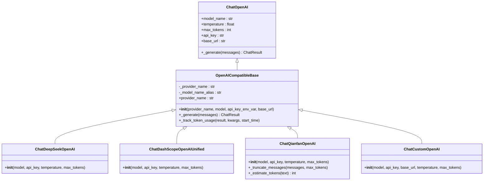
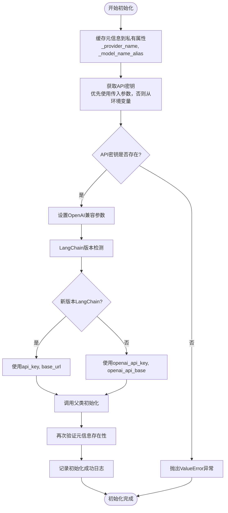
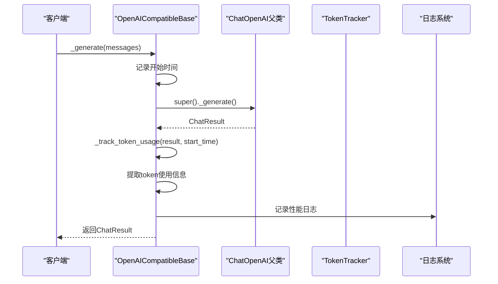
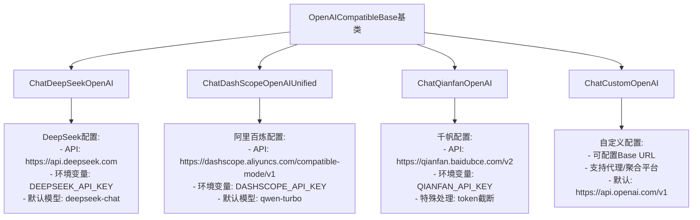

# OpenAI兼容基类设计与实现机制详细文档

<cite>
**本文档引用的文件**
- [openai_compatible_base.py](file://tradingagents/llm_adapters/openai_compatible_base.py)
- [logging_init.py](file://tradingagents/utils/logging_init.py)
- [config_manager.py](file://tradingagents/config/config_manager.py)
- [demo_deepseek_analysis.py](file://examples/demo_deepseek_analysis.py)
- [demo_news_filtering.py](file://examples/demo_news_filtering.py)
</cite>

## 目录
1. [引言](#引言)
2. [架构概览](#架构概览)
3. [核心设计原理](#核心设计原理)
4. [初始化机制详解](#初始化机制详解)
5. [LangChain版本兼容性处理](#langchain版本兼容性处理)
6. [元信息存储机制](#元信息存储机制)
7. [_token_usage方法与性能监控](#_token_usage方法与性能监控)
8. [继承体系与适配器实现](#继承体系与适配器实现)
9. [异常处理策略](#异常处理策略)
10. [日志输出规范](#日志输出规范)
11. [使用示例与最佳实践](#使用示例与最佳实践)
12. [总结](#总结)

## 引言

OpenAICompatibleBase是TradingAgents项目中的核心抽象基类，为所有支持OpenAI接口的LLM提供商提供了统一的适配器实现。该基类继承自LangChain的ChatOpenAI，通过精心设计的初始化机制和参数兼容性处理，实现了对不同LLM提供商的无缝集成。

该基类的设计充分考虑了投资分析场景中的性能监控需求，集成了完整的token使用跟踪和响应时间记录功能，为量化投资分析提供了可靠的技术支撑。

## 架构概览

OpenAICompatibleBase采用了经典的适配器模式设计，通过继承LangChain的ChatOpenAI基类，为不同的LLM提供商提供统一的接口。



**图表来源**
- [openai_compatible_base.py](file://tradingagents/llm_adapters/openai_compatible_base.py#L31-L436)

## 核心设计原理

OpenAICompatibleBase的设计遵循以下核心原则：

### 1. 统一接口抽象
通过继承ChatOpenAI，确保所有子类都具备标准的LLM接口，包括消息处理、参数配置和响应生成等功能。

### 2. 参数兼容性处理
针对不同LangChain版本的参数命名差异，实现了智能的参数映射机制，确保代码在不同环境中的一致性。

### 3. 元信息安全存储
通过`object.__setattr__`绕过Pydantic字段限制，安全地存储provider_name和model_name等关键元信息。

### 4. 性能监控集成
内置token使用跟踪和响应时间记录功能，为投资分析场景提供详细的性能指标。

### 5. 异常处理机制
完善的异常处理策略，确保在各种错误情况下都能提供有意义的错误信息和恢复机制。

## 初始化机制详解

OpenAICompatibleBase的初始化过程体现了其设计的精妙之处：



**图表来源**
- [openai_compatible_base.py](file://tradingagents/llm_adapters/openai_compatible_base.py#L31-L115)

**章节来源**
- [openai_compatible_base.py](file://tradingagents/llm_adapters/openai_compatible_base.py#L31-L115)

## LangChain版本兼容性处理

OpenAICompatibleBase巧妙地解决了LangChain不同版本间的参数命名差异问题：

### 参数映射策略

| LangChain版本 | 参数名称 | OpenAICompatibleBase内部映射 |
|---------------|----------|------------------------------|
| 新版本 | `api_key`, `base_url` | 直接使用 |
| 旧版本 | `openai_api_key`, `openai_api_base` | 自动转换 |

### 实现机制

该机制通过异常捕获的方式实现版本检测：

```python
# 新版本LangChain参数
openai_kwargs.update({
    "api_key": api_key,
    "base_url": base_url
})

# 旧版本LangChain参数（如果新版本参数无效）
openai_kwargs.update({
    "openai_api_key": api_key,
    "openai_api_base": base_url
})
```

这种设计确保了代码在不同LangChain版本下的兼容性，无需手动指定版本或进行复杂的条件判断。

**章节来源**
- [openai_compatible_base.py](file://tradingagents/llm_adapters/openai_compatible_base.py#L75-L87)

## 元信息存储机制

OpenAICompatibleBase通过一种巧妙的方式绕过了Pydantic字段限制，安全地存储了provider_name和model_name等关键元信息：

### 存储策略

```python
# 在父类初始化前缓存元信息
object.__setattr__(self, "_provider_name", provider_name)
object.__setattr__(self, "_model_name_alias", model)

# 在父类初始化后再次确保元信息存在
object.__setattr__(self, "_provider_name", provider_name)
object.__setattr__(self, "_model_name_alias", model)
```

### 设计优势

1. **安全性**：通过`object.__setattr__`直接操作对象属性，避免Pydantic验证
2. **持久性**：即使父类初始化过程中重置了`__dict__`，也能确保元信息不丢失
3. **透明性**：提供标准的getter方法访问这些信息

### 属性访问

```python
@property
def provider_name(self) -> Optional[str]:
    return getattr(self, "_provider_name", None)
```

这种方法确保了元信息的安全存储，同时保持了良好的封装性。

**章节来源**
- [openai_compatible_base.py](file://tradingagents/llm_adapters/openai_compatible_base.py#L58-L105)

## _token_usage方法与性能监控

OpenAICompatibleBase的核心价值在于其内置的性能监控机制，特别是`_track_token_usage`方法在投资分析场景中的重要作用：

### 方法实现机制



**图表来源**
- [openai_compatible_base.py](file://tradingagents/llm_adapters/openai_compatible_base.py#L117-L136)

### 性能监控价值

在投资分析场景中，token使用跟踪具有以下重要意义：

#### 1. 成本控制
- **实时成本监控**：精确跟踪每个分析请求的token消耗
- **预算管理**：为不同分析类型设置token使用上限
- **成本优化**：识别高成本分析模式，优化提示词结构

#### 2. 性能分析
- **响应时间分析**：结合token使用量分析模型性能
- **效率评估**：比较不同模型在同一任务上的效率
- **资源分配**：根据token成本和质量选择最优模型

#### 3. 质量保证
- **输入质量监控**：跟踪输入token分布，识别潜在的数据质量问题
- **输出质量评估**：分析输出token与输入复杂度的关系
- **稳定性监控**：跟踪长时间运行的token使用趋势

### 日志输出格式

```python
logger.info(
    f"📊 Token使用 - Provider: {getattr(self, 'provider_name', 'unknown')}, "
    f"Model: {getattr(self, 'model_name', 'unknown')}, "
    f"总tokens: {total_tokens}, 提示: {prompt_tokens}, "
    f"补全: {completion_tokens}, 用时: {elapsed:.2f}s"
)
```

这种格式化的日志输出为投资分析系统提供了丰富的监控数据，支持后续的成本分析和性能优化。

**章节来源**
- [openai_compatible_base.py](file://tradingagents/llm_adapters/openai_compatible_base.py#L117-L136)
- [config_manager.py](file://tradingagents/config/config_manager.py#L652-L690)

## 继承体系与适配器实现

OpenAICompatibleBase构建了一个完整的适配器继承体系，为不同的LLM提供商提供了专门的实现：

### 适配器分类



**图表来源**
- [openai_compatible_base.py](file://tradingagents/llm_adapters/openai_compatible_base.py#L138-L319)

### 特殊适配器实现

#### 1. ChatQianfanOpenAI的token截断机制

千帆平台有特殊的token限制，ChatQianfanOpenAI实现了专门的截断逻辑：

```python
def _truncate_messages(self, messages: List[BaseMessage], max_tokens: int = 4500) -> List[BaseMessage]:
    """截断消息以适应千帆模型的token限制"""
    # 从最后一条消息开始，向前保留消息
    for message in reversed(messages):
        content = str(message.content) if hasattr(message, 'content') else str(message)
        message_tokens = self._estimate_tokens(content)
        
        if total_tokens + message_tokens <= max_tokens:
            truncated_messages.insert(0, message)
            total_tokens += message_tokens
        else:
            # 如果是第一条消息且超长，进行内容截断
            if not truncated_messages:
                remaining_tokens = max_tokens - 100
                max_chars = remaining_tokens * 2
                truncated_content = content[:max_chars] + "...(内容已截断)"
```

#### 2. ChatCustomOpenAI的灵活性

自定义适配器提供了最大的灵活性，允许用户连接任意OpenAI兼容的API端点。

**章节来源**
- [openai_compatible_base.py](file://tradingagents/llm_adapters/openai_compatible_base.py#L138-L319)

## 异常处理策略

OpenAICompatibleBase实现了多层次的异常处理策略，确保系统的稳定性和用户体验：

### 1. API密钥验证

```python
if api_key is None:
    api_key = os.getenv(api_key_env_var)
    if not api_key:
        raise ValueError(
            f"{provider_name} API密钥未找到。"
            f"请设置{api_key_env_var}环境变量或传入api_key参数。"
        )
```

### 2. LangChain版本兼容性异常

```python
try:
    # 新版本参数
    openai_kwargs.update({
        "api_key": api_key,
        "base_url": base_url
    })
except:
    # 旧版本参数
    openai_kwargs.update({
        "openai_api_key": api_key,
        "openai_api_base": base_url
    })
```

### 3. Token跟踪异常处理

```python
def _track_token_usage(self, result: ChatResult, kwargs: Dict, start_time: float):
    """记录token使用量并输出日志"""
    if not TOKEN_TRACKING_ENABLED:
        return
    try:
        # 统计token信息
        usage = getattr(result, "usage_metadata", None)
        total_tokens = usage.get("total_tokens") if usage else None
        prompt_tokens = usage.get("input_tokens") if usage else None
        completion_tokens = usage.get("output_tokens") if usage else None
        
        elapsed = time.time() - start_time
        logger.info(...)  # 记录日志
    except Exception as e:
        logger.warning(f"⚠️ Token跟踪记录失败: {e}")
```

### 4. 错误恢复机制

系统通过以下机制确保错误发生时的服务连续性：

- **优雅降级**：在token跟踪失败时不会影响主要功能
- **详细错误信息**：提供足够的上下文信息帮助诊断问题
- **日志记录**：完整的错误日志便于后续分析

**章节来源**
- [openai_compatible_base.py](file://tradingagents/llm_adapters/openai_compatible_base.py#L58-L136)

## 日志输出规范

OpenAICompatibleBase严格遵循项目的日志输出规范，为投资分析系统提供了标准化的日志记录机制：

### 日志级别规范

| 日志级别 | 使用场景 | 示例 |
|----------|----------|------|
| INFO | 正常操作记录 | 模型初始化成功、请求完成 |
| WARNING | 警告信息 | Token跟踪失败、配置缺失 |
| ERROR | 错误信息 | API调用失败、参数错误 |

### 标准化日志格式

```python
# 初始化成功日志
logger.info(f"✅ {provider_name} OpenAI兼容适配器初始化成功")
logger.info(f"   模型: {model}")
logger.info(f"   API Base: {base_url}")

# 性能监控日志
logger.info(
    f"📊 Token使用 - Provider: {getattr(self, 'provider_name', 'unknown')}, "
    f"Model: {getattr(self, 'model_name', 'unknown')}, "
    f"总tokens: {total_tokens}, 提示: {prompt_tokens}, "
    f"补全: {completion_tokens}, 用时: {elapsed:.2f}s"
)

# 警告日志
logger.warning(f"⚠️ Token跟踪记录失败: {e}")
```

### 投资分析场景特定日志

在投资分析场景中，日志系统还记录了以下关键信息：

- **模型性能**：响应时间和token使用量
- **分析质量**：基于token使用的质量评估
- **成本信息**：每次分析的成本计算
- **系统状态**：模型可用性和配置状态

**章节来源**
- [openai_compatible_base.py](file://tradingagents/llm_adapters/openai_compatible_base.py#L101-L136)
- [logging_init.py](file://tradingagents/utils/logging_init.py#L1-L166)

## 使用示例与最佳实践

### 基本使用模式

以下是OpenAICompatibleBase的典型使用方式：

#### 1. 直接实例化

```python
# DeepSeek适配器
from tradingagents.llm_adapters.openai_compatible_base import ChatDeepSeekOpenAI

llm = ChatDeepSeekOpenAI(
    model="deepseek-chat",
    api_key="your-api-key",
    temperature=0.1,
    max_tokens=1000
)
```

#### 2. 工厂函数创建

```python
from tradingagents.llm_adapters.openai_compatible_base import create_openai_compatible_llm

llm = create_openai_compatible_llm(
    provider="deepseek",
    model="deepseek-chat",
    api_key="your-api-key",
    temperature=0.1
)
```

### 投资分析场景最佳实践

#### 1. 成本控制配置

```python
# 设置合理的max_tokens防止过度消耗
llm = ChatDeepSeekOpenAI(
    model="deepseek-chat",
    max_tokens=500,  # 控制输出长度
    temperature=0.2   # 适度创造性
)
```

#### 2. 性能监控集成

```python
# 利用内置的token跟踪功能
response = llm.invoke("分析AAPL的财务状况")
# 日志中会自动记录token使用情况和响应时间
```

#### 3. 错误处理策略

```python
try:
    llm = ChatDeepSeekOpenAI(model="deepseek-chat")
    response = llm.invoke("复杂的分析任务")
except ValueError as e:
    # API密钥配置错误
    logger.error(f"LLM初始化失败: {e}")
except Exception as e:
    # 其他异常处理
    logger.error(f"LLM调用失败: {e}")
```

### 高级使用模式

#### 1. 多模型切换

```python
def create_analysis_llm(provider: str, model: str):
    """创建适合分析任务的LLM"""
    if provider == "deepseek":
        return ChatDeepSeekOpenAI(
            model=model,
            temperature=0.1,  # 保守的温度设置
            max_tokens=1000   # 适中的输出长度
        )
    elif provider == "dashscope":
        return ChatDashScopeOpenAIUnified(
            model=model,
            temperature=0.15,  # 略高的创造性
            max_tokens=1500    # 更长的分析
        )
```

#### 2. 集成Web应用

```python
# 在Web应用中使用
from tradingagents.utils.logging_manager import get_logger

def get_analysis_llm(session_id: str):
    """为特定会话获取LLM实例"""
    logger = get_logger('analysis')
    logger.info(f"为会话 {session_id} 创建LLM实例")
    
    return create_openai_compatible_llm(
        provider="deepseek",
        model="deepseek-chat",
        temperature=0.1
    )
```

**章节来源**
- [demo_deepseek_analysis.py](file://examples/demo_deepseek_analysis.py#L1-L300)
- [openai_compatible_base.py](file://tradingagents/llm_adapters/openai_compatible_base.py#L381-L436)

## 总结

OpenAICompatibleBase作为TradingAgents项目的核心组件，展现了优秀的软件设计原则和工程实践：

### 设计亮点

1. **统一抽象**：通过继承ChatOpenAI，为不同LLM提供商提供了统一的接口
2. **版本兼容**：智能处理LangChain不同版本的参数差异
3. **安全存储**：巧妙绕过Pydantic限制，安全存储元信息
4. **性能监控**：内置token跟踪和响应时间记录功能
5. **异常处理**：多层次的异常处理确保系统稳定性
6. **日志规范**：标准化的日志输出便于维护和调试

### 投资分析价值

在投资分析场景中，OpenAICompatibleBase的价值体现在：

- **成本控制**：精确的token跟踪帮助控制分析成本
- **性能优化**：详细的性能指标支持模型选择和优化
- **质量保证**：标准化的日志记录确保分析过程的可追溯性
- **扩展性**：灵活的适配器设计支持新模型的快速集成

### 技术创新

该基类的设计体现了以下技术创新：

- **元编程技巧**：使用`object.__setattr__`绕过Pydantic限制
- **动态参数映射**：智能处理不同版本的参数命名差异
- **性能监控集成**：将性能监控无缝集成到核心功能中
- **异常恢复机制**：多层次的异常处理确保系统健壮性

OpenAICompatibleBase不仅是一个技术实现，更是现代软件工程理念的完美体现，为投资分析领域的AI应用提供了坚实的技术基础。