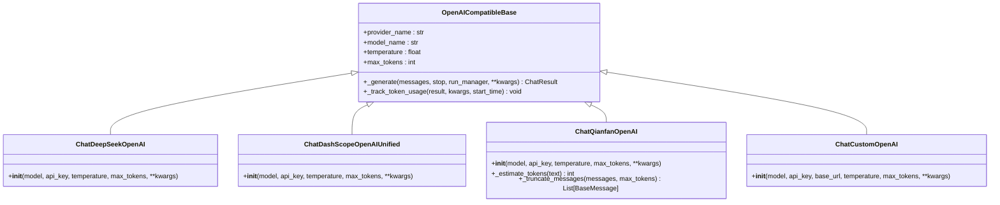
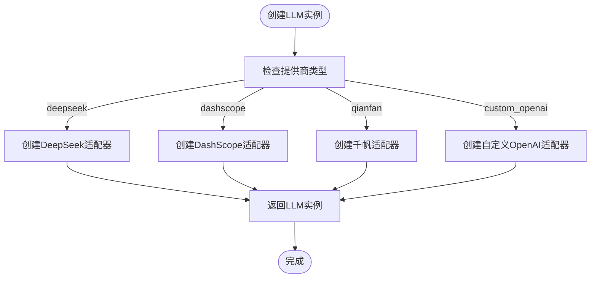
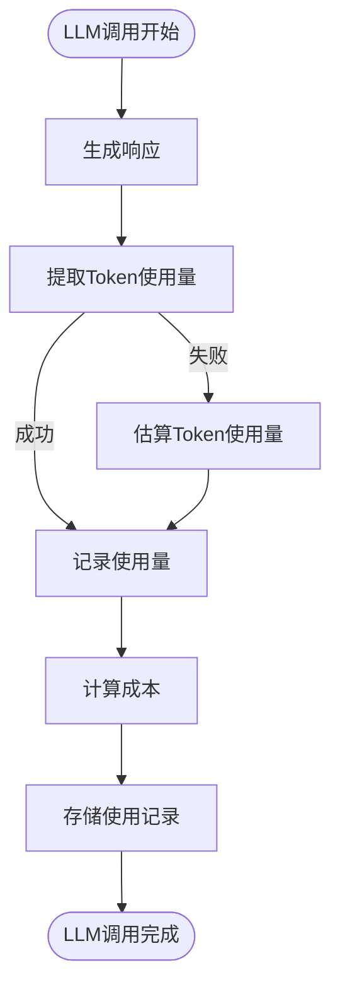
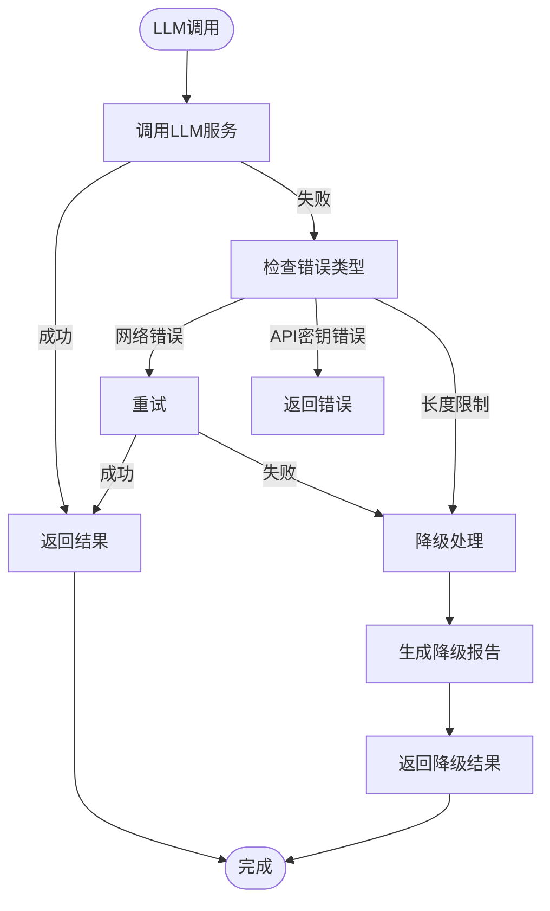

# LLM集成

<cite>
**本文档引用的文件**  
- [dashscope_adapter.py](file://tradingagents/llm_adapters/dashscope_adapter.py) - *新增了DashScope适配器实现*
- [deepseek_adapter.py](file://tradingagents/llm_adapters/deepseek_adapter.py) - *更新了DeepSeek适配器实现*
- [google_openai_adapter.py](file://tradingagents/llm_adapters/google_openai_adapter.py) - *新增了Google适配器实现*
- [openai_compatible_base.py](file://tradingagents/llm_adapters/openai_compatible_base.py) - *更新了统一适配器基类*
- [config_manager.py](file://tradingagents/config/config_manager.py)
- [default_config.py](file://tradingagents/default_config.py)
- [demo_deepseek_analysis.py](file://examples/demo_deepseek_analysis.py)
- [demo_dashscope.py](file://examples/dashscope_examples/demo_dashscope.py)
</cite>

## 更新摘要
**变更内容**   
- 新增了主流LLM提供商的适配器实现细节，包括DashScope、DeepSeek和Google
- 更新了统一适配器接口设计，增强了对不同提供商的支持
- 扩展了支持的LLM提供商列表，增加了详细的模型配置信息
- 更新了配置方法与示例，提供了更完整的代码示例
- 增强了投资分析场景下的性能与成本分析

## 目录
1. [引言](#引言)
2. [支持的LLM提供商](#支持的llm提供商)
3. [统一适配器接口设计](#统一适配器接口设计)
4. [配置方法与示例](#配置方法与示例)
5. [投资分析场景下的性能与成本](#投资分析场景下的性能与成本)
6. [故障转移与降级策略](#故障转移与降级策略)
7. [结论](#结论)

## 引言
本系统通过集成多种大型语言模型（LLM）提供商，为交易代理提供智能化分析能力。系统采用适配器模式设计，实现了对不同LLM服务的统一接口访问，支持OpenAI兼容接口、Google Gemini、DeepSeek、阿里百炼（DashScope）等多种模型服务。该架构不仅提高了系统的灵活性和可扩展性，还为投资分析场景提供了多样化的模型选择。

## 支持的LLM提供商
系统支持多种LLM提供商，包括但不限于：

- **OpenAI兼容接口**：支持所有遵循OpenAI API规范的模型服务
- **Google**：通过Gemini系列模型提供强大的AI能力
- **DeepSeek**：提供高性能的中文理解和分析能力
- **阿里百炼（DashScope）**：阿里云提供的通义千问系列模型
- **文心一言千帆平台**：百度提供的ERNIE系列模型

这些提供商通过统一的适配器接口集成到系统中，用户可以根据需求和成本考虑选择最适合的模型服务。

**本节来源**  
- [openai_compatible_base.py](file://tradingagents/llm_adapters/openai_compatible_base.py#L295-L413) - *更新了统一适配器基类*
- [google_openai_adapter.py](file://tradingagents/llm_adapters/google_openai_adapter.py#L231-L350) - *新增了Google适配器实现*

## 统一适配器接口设计
系统采用适配器模式设计，为不同LLM提供商提供统一的接口访问。核心设计原理如下：

### 适配器模式实现
系统通过`OpenAICompatibleBase`基类为所有支持OpenAI接口的LLM提供商提供统一实现。该基类继承自`ChatOpenAI`，并添加了token使用量统计功能。



**本图来源**  
- [openai_compatible_base.py](file://tradingagents/llm_adapters/openai_compatible_base.py#L31-L155) - *更新了统一适配器基类*

### 统一工厂函数
系统提供`create_openai_compatible_llm`工厂函数，用于创建不同提供商的LLM实例：



**本图来源**  
- [openai_compatible_base.py](file://tradingagents/llm_adapters/openai_compatible_base.py#L381-L413) - *更新了统一工厂函数*
- [config_manager.py](file://tradingagents/config/config_manager.py#L652-L690)

**本节来源**  
- [openai_compatible_base.py](file://tradingagents/llm_adapters/openai_compatible_base.py#L381-L413) - *更新了统一工厂函数*
- [config_manager.py](file://tradingagents/config/config_manager.py#L652-L690)

## 配置方法与示例
### 配置方法
系统通过环境变量和配置文件两种方式管理LLM配置：

1. **环境变量配置**：在`.env`文件中设置API密钥
2. **配置文件管理**：使用`config_manager.py`管理模型配置和定价信息

### 配置示例
#### DeepSeek配置示例
```python
# 在.env文件中配置
DEEPSEEK_API_KEY=your_api_key_here
DEEPSEEK_ENABLED=true
```

```python
# Python代码中使用
from tradingagents.llm_adapters.deepseek_adapter import create_deepseek_llm

llm = create_deepseek_llm(
    model="deepseek-chat",
    temperature=0.1,
    max_tokens=1000
)
```

#### DashScope配置示例
```python
# 在.env文件中配置
DASHSCOPE_API_KEY=your_api_key_here
```

```python
# Python代码中使用
from tradingagents.llm_adapters.dashscope_adapter import create_dashscope_llm

llm = create_dashscope_llm(
    model="qwen-plus",
    temperature=0.1,
    max_tokens=2000
)
```

#### Google Gemini配置示例
```python
# 在.env文件中配置
GOOGLE_API_KEY=your_api_key_here
```

```python
# Python代码中使用
from tradingagents.llm_adapters.google_openai_adapter import create_google_openai_llm

llm = create_google_openai_llm(
    model="gemini-2.5-flash-lite-preview-06-17",
    temperature=0.1,
    max_tokens=2000
)
```

**本节来源**  
- [demo_deepseek_analysis.py](file://examples/demo_deepseek_analysis.py#L113-L158)
- [demo_dashscope.py](file://examples/dashscope_examples/demo_dashscope.py#L60-L93)
- [google_openai_adapter.py](file://tradingagents/llm_adapters/google_openai_adapter.py#L231-L350) - *新增了Google适配器实现*

## 投资分析场景下的性能与成本
### 性能表现
不同LLM在投资分析场景下的性能表现如下：

- **DeepSeek**：在中文理解和金融分析方面表现出色，推理能力强
- **Google Gemini**：响应速度快，特别是在使用Gemini 2.5 Flash模型时
- **阿里百炼（DashScope）**：中文理解能力强，金融领域知识丰富
- **OpenAI**：通用能力强，但在中文金融分析方面略逊于本地化模型

### 成本考量
系统通过`TokenTracker`跟踪器记录每个LLM调用的token使用量和成本：



**本图来源**  
- [config_manager.py](file://tradingagents/config/config_manager.py#L652-L690)
- [dashscope_adapter.py](file://tradingagents/llm_adapters/dashscope_adapter.py#L245-L293) - *新增了DashScope适配器实现*

系统支持按提供商、模型、会话等维度统计使用情况和成本，帮助用户优化LLM使用策略。

**本节来源**  
- [config_manager.py](file://tradingagents/config/config_manager.py#L652-L690)
- [test_config_management.py](file://tests/test_config_management.py#L227-L270)

## 故障转移与降级策略
系统实现了多层次的故障转移和降级策略，确保在LLM服务不可用时仍能提供基本功能：

### 故障检测与处理


**本图来源**  
- [google_openai_adapter.py](file://tradingagents/llm_adapters/google_openai_adapter.py#L52-L77) - *新增了Google适配器实现*
- [memory.py](file://tradingagents/agents/utils/memory.py#L524-L547)

### 降级策略
1. **重试机制**：对于网络错误等临时性问题，系统会自动重试
2. **降级报告**：当LLM调用失败时，系统会生成降级报告作为替代
3. **空向量返回**：在embedding异常时，返回空向量以保证系统继续运行
4. **不截断重试**：对于长度限制错误，直接降级而不尝试截断重试，以保证分析准确性

**本节来源**  
- [google_openai_adapter.py](file://tradingagents/llm_adapters/google_openai_adapter.py#L52-L77) - *新增了Google适配器实现*
- [memory.py](file://tradingagents/agents/utils/memory.py#L524-L547)

## 结论
本系统通过精心设计的适配器模式，成功集成了多种LLM提供商，为投资分析场景提供了灵活、可靠且成本可控的智能化解决方案。统一的适配器接口设计使得系统能够轻松扩展支持新的LLM服务，而完善的故障转移和降级策略确保了系统的稳定性和可靠性。通过详细的token使用量跟踪和成本计算，用户可以优化LLM使用策略，实现性能与成本的最佳平衡。