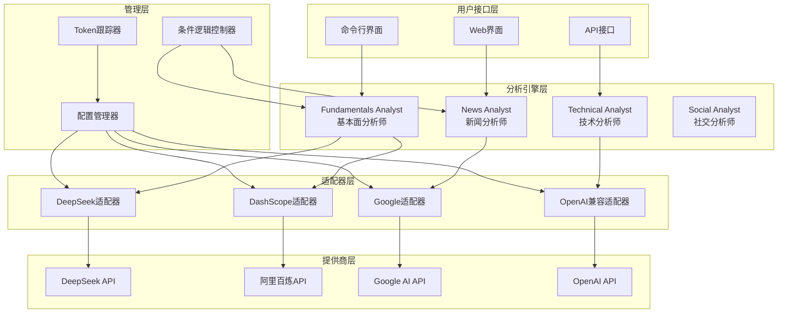
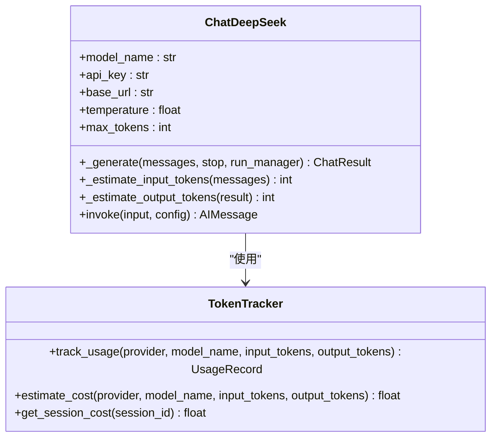
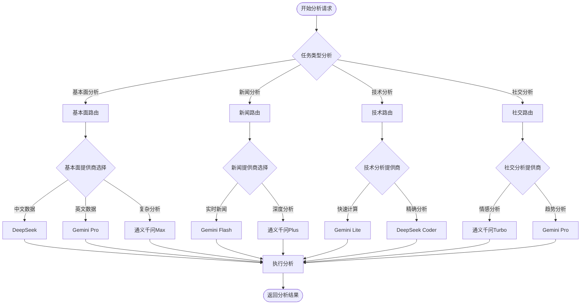
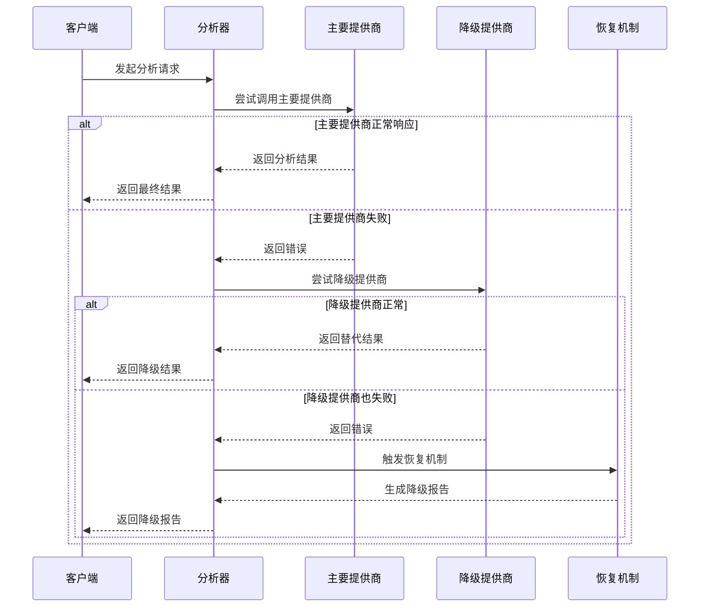
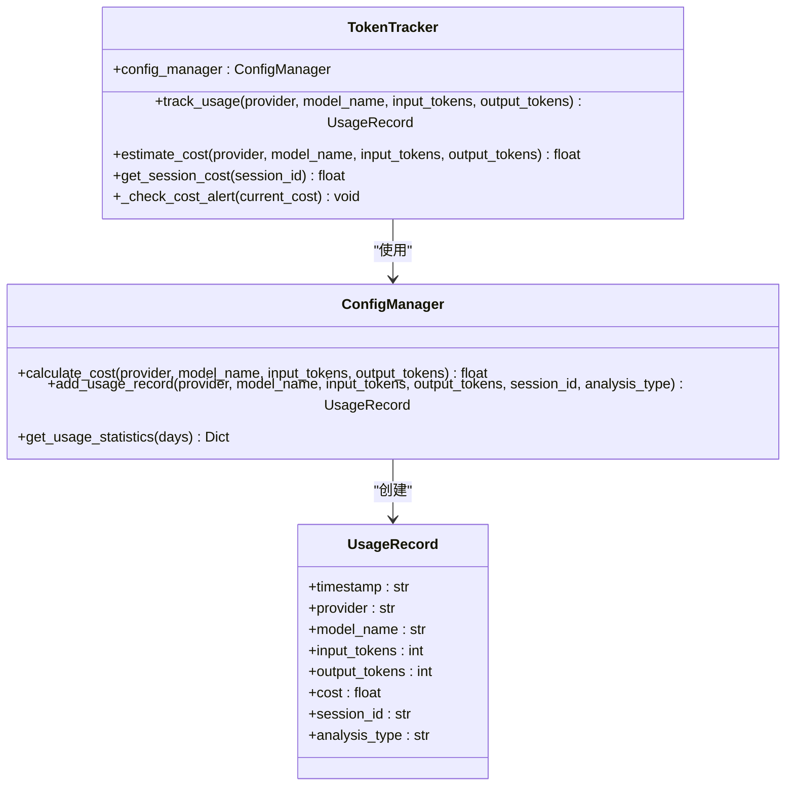
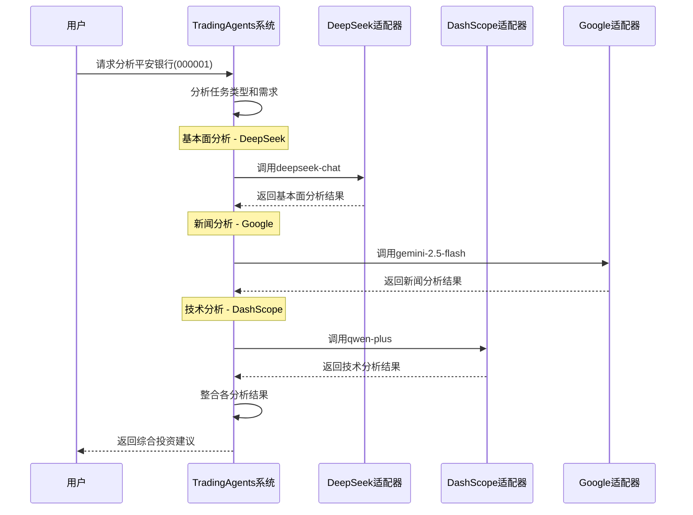
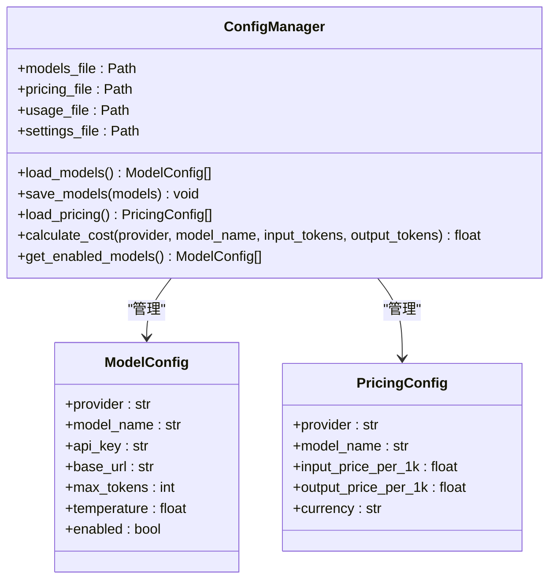

# 多LLM提供商支持机制

<cite>
**本文档引用的文件**
- [tradingagents/llm_adapters/__init__.py](file://tradingagents/llm_adapters/__init__.py)
- [tradingagents/llm_adapters/deepseek_adapter.py](file://tradingagents/llm_adapters/deepseek_adapter.py)
- [tradingagents/llm_adapters/dashscope_adapter.py](file://tradingagents/llm_adapters/dashscope_adapter.py)
- [tradingagents/llm_adapters/google_openai_adapter.py](file://tradingagents/llm_adapters/google_openai_adapter.py)
- [tradingagents/llm_adapters/openai_compatible_base.py](file://tradingagents/llm_adapters/openai_compatible_base.py)
- [tradingagents/config/config_manager.py](file://tradingagents/config/config_manager.py)
- [examples/demo_deepseek_analysis.py](file://examples/demo_deepseek_analysis.py)
- [examples/demo_news_filtering.py](file://examples/demo_news_filtering.py)
- [tradingagents/agents/analysts/fundamentals_analyst.py](file://tradingagents/agents/analysts/fundamentals_analyst.py)
- [tradingagents/agents/analysts/news_analyst.py](file://tradingagents/agents/analysts/news_analyst.py)
- [tradingagents/default_config.py](file://tradingagents/default_config.py)
- [tradingagents/graph/conditional_logic.py](file://tradingagents/graph/conditional_logic.py)
</cite>

## 目录
1. [概述](#概述)
2. [系统架构](#系统架构)
3. [核心适配器组件](#核心适配器组件)
4. [模型路由策略](#模型路由策略)
5. [故障转移机制](#故障转移机制)
6. [成本优化策略](#成本优化策略)
7. [性能权衡分析](#性能权衡分析)
8. [实际应用案例](#实际应用案例)
9. [配置管理](#配置管理)
10. [最佳实践](#最佳实践)

## 概述

TradingAgents系统实现了先进的多LLM提供商支持机制，能够在同一个分析流程中集成和协调多个不同的LLM服务。该系统通过统一的适配器架构，为用户提供透明的多提供商选择，同时实现智能路由、故障转移和成本优化。

### 主要特性

- **统一接口**：所有LLM提供商通过标准化的适配器接口提供服务
- **智能路由**：基于任务类型、性能需求和成本考虑的自动模型选择
- **故障转移**：多层级的降级机制确保服务连续性
- **成本控制**：实时token跟踪和使用成本监控
- **性能优化**：针对不同提供商的特定优化策略

## 系统架构

**图表来源**
- [tradingagents/llm_adapters/__init__.py](file://tradingagents/llm_adapters/__init__.py#L1-L7)
- [tradingagents/agents/analysts/fundamentals_analyst.py](file://tradingagents/agents/analysts/fundamentals_analyst.py#L1-L50)
- [tradingagents/config/config_manager.py](file://tradingagents/config/config_manager.py#L1-L100)

## 核心适配器组件

### DeepSeek适配器

DeepSeek适配器专为中文金融文本理解和分析优化，具有以下特色：

**图表来源**
- [tradingagents/llm_adapters/deepseek_adapter.py](file://tradingagents/llm_adapters/deepseek_adapter.py#L25-L100)
- [tradingagents/config/config_manager.py](file://tradingagents/config/config_manager.py#L652-L726)

**核心优势**：
- **中文理解**：在中文金融文本处理方面表现卓越
- **成本效益**：相比国际模型具有更高的性价比
- **Token跟踪**：内置详细的token使用统计功能
- **估算机制**：当API不提供token信息时自动估算

### 阿里百炼适配器

DashScope适配器提供阿里巴巴通义千问系列模型的完整支持：

**支持的模型系列**：
- **qwen-turbo**：快速响应，适合日常对话
- **qwen-plus**：平衡性能和成本的理想选择
- **qwen-max**：最强性能，适合复杂分析
- **qwen-max-longcontext**：支持超长上下文的深度分析

### Google AI适配器

Google OpenAI兼容适配器解决了Google模型工具调用格式不匹配的问题：

**支持的Google模型**：
- **gemini-2.5-flash-lite-preview-06-17**：超快响应（1.45秒）
- **gemini-2.5-flash**：快速响应（2.73秒）
- **gemini-2.5-pro**：强大性能（16.68秒）
- **gemini-2.0-flash**：新一代快速模型（1.87秒）

### OpenAI兼容适配器

统一的OpenAI兼容适配器基类，支持多个OpenAI兼容提供商：

**支持的提供商**：
- **DeepSeek**：高性能中文模型
- **DashScope**：阿里通义千问系列
- **Qianfan**：百度文心一言千帆平台
- **Custom OpenAI**：自定义OpenAI端点

**节来源**
- [tradingagents/llm_adapters/deepseek_adapter.py](file://tradingagents/llm_adapters/deepseek_adapter.py#L1-L263)
- [tradingagents/llm_adapters/dashscope_adapter.py](file://tradingagents/llm_adapters/dashscope_adapter.py#L1-L294)
- [tradingagents/llm_adapters/google_openai_adapter.py](file://tradingagents/llm_adapters/google_openai_adapter.py#L1-L351)
- [tradingagents/llm_adapters/openai_compatible_base.py](file://tradingagents/llm_adapters/openai_compatible_base.py#L1-L436)

## 模型路由策略

### 智能路由机制

系统实现了基于任务类型和性能需求的智能路由策略：

**图表来源**
- [tradingagents/agents/analysts/fundamentals_analyst.py](file://tradingagents/agents/analysts/fundamentals_analyst.py#L200-L300)
- [tradingagents/agents/analysts/news_analyst.py](file://tradingagents/agents/analysts/news_analyst.py#L150-L250)

### 路由决策因素

1. **任务类型匹配**：
   - 基本面分析：优先DeepSeek和QWen系列
   - 新闻分析：优先Gemini Flash和QWen Turbo
   - 技术分析：优先Gemini Lite和DeepSeek Coder
   - 社交分析：优先QWen Turbo和Gemini Pro

2. **性能要求**：
   - 实时性：Gemini Flash系列
   - 准确性：QWen Max系列
   - 成本效益：DeepSeek系列

3. **数据类型**：
   - 中文金融数据：DeepSeek和QWen系列
   - 英文技术文档：Gemini系列
   - 多语言混合：OpenAI兼容适配器

**节来源**
- [tradingagents/agents/analysts/fundamentals_analyst.py](file://tradingagents/agents/analysts/fundamentals_analyst.py#L150-L250)
- [tradingagents/agents/analysts/news_analyst.py](file://tradingagents/agents/analysts/news_analyst.py#L100-L200)

## 故障转移机制

### 多层级降级策略

系统实现了完善的故障转移机制，确保在任何提供商出现问题时都能提供服务：

**图表来源**
- [tradingagents/agents/utils/google_tool_handler.py](file://tradingagents/agents/utils/google_tool_handler.py#L626-L677)

### 降级策略详解

1. **工具调用失败降级**：
   - 检测到模型未调用工具时，自动强制调用
   - 使用统一工具接口获取必要数据
   - 基于真实数据重新生成分析

2. **API调用失败降级**：
   - 实现指数退避重试机制
   - 超时后自动切换到备用提供商
   - 记录降级原因和恢复时间

3. **模型特定降级**：
   - **Google模型**：特殊的工具调用处理和优化
   - **DashScope模型**：预处理模式强制获取新闻数据
   - **OpenAI模型**：标准的工具调用检测和补救

**节来源**
- [tradingagents/agents/analysts/fundamentals_analyst.py](file://tradingagents/agents/analysts/fundamentals_analyst.py#L350-L401)
- [tradingagents/agents/analysts/news_analyst.py](file://tradingagents/agents/analysts/news_analyst.py#L250-L347)

## 成本优化策略

### Token使用跟踪

系统实现了全面的token使用跟踪和成本控制机制：

**图表来源**
- [tradingagents/config/config_manager.py](file://tradingagents/config/config_manager.py#L652-L726)

### 成本控制机制

1. **实时成本监控**：
   - 每次API调用后自动记录token使用量
   - 实时计算当前会话成本
   - 超过阈值时发出警告

2. **定价配置管理**：
   - 支持多种提供商的定价策略
   - 支持多种货币单位
   - 动态价格更新机制

3. **使用统计分析**：
   - 按提供商、模型、会话统计使用情况
   - 成本趋势分析
   - 性能成本比评估

**节来源**
- [tradingagents/config/config_manager.py](file://tradingagents/config/config_manager.py#L652-L726)

## 性能权衡分析

### 不同提供商的性能特征

| 提供商 | 模型系列 | 响应时间 | 上下文长度 | 成本（CNY/1K tokens） | 适用场景 |
|--------|----------|----------|------------|----------------------|----------|
| DeepSeek | deepseek-chat | 2.5-3.0s | 32K | 输入: 0.0014 输出: 0.0028 | 中文分析、成本敏感 |
| DeepSeek | deepseek-coder | 2.5-3.0s | 16K | 输入: 0.0014 输出: 0.0028 | 代码分析、技术文档 |
| 阿里百炼 | qwen-turbo | 1.8-2.2s | 8K | 输入: 0.002 输出: 0.006 | 快速响应、日常分析 |
| 阿里百炼 | qwen-plus | 2.2-2.8s | 32K | 输入: 0.004 输出: 0.012 | 平衡性能、中等复杂度 |
| 阿里百炼 | qwen-max | 4.5-6.0s | 32K | 输入: 0.02 输出: 0.06 | 复杂分析、高质量输出 |
| Google | gemini-2.5-flash | 2.73s | 32K | 输入: 0.00025 输出: 0.0005 | 实时分析、快速迭代 |
| Google | gemini-2.5-pro | 16.68s | 32K | 输入: 0.00025 输出: 0.0005 | 深度推理、复杂任务 |

### 性能优化策略

1. **模型选择优化**：
   - 根据任务复杂度选择合适模型
   - 避免过度使用高性能模型
   - 利用模型特性进行任务匹配

2. **并发处理优化**：
   - 多分析师并行工作
   - 工具调用异步处理
   - 缓存机制减少重复调用

3. **资源利用优化**：
   - 动态调整并发请求数
   - 智能队列管理
   - 资源使用监控

## 实际应用案例

### 深圳发展银行案例

系统展示了在实际投资分析中的多提供商协同工作效果：

**图表来源**
- [examples/demo_deepseek_analysis.py](file://examples/demo_deepseek_analysis.py#L100-L200)

### 新闻过滤协同案例

系统展示了多提供商在新闻处理中的协同效果：

1. **DeepSeek**：处理中文新闻语义理解
2. **Google**：提供实时新闻获取和分析
3. **DashScope**：进行新闻质量过滤和排序

**节来源**
- [examples/demo_deepseek_analysis.py](file://examples/demo_deepseek_analysis.py#L1-L300)
- [examples/demo_news_filtering.py](file://examples/demo_news_filtering.py#L1-L230)

## 配置管理

### 模型配置结构

系统通过ConfigManager实现灵活的配置管理：

**图表来源**
- [tradingagents/config/config_manager.py](file://tradingagents/config/config_manager.py#L25-L100)

### 配置优先级

1. **环境变量**：最高优先级，用于API密钥
2. **配置文件**：模型和定价配置
3. **默认设置**：系统默认值

**节来源**
- [tradingagents/config/config_manager.py](file://tradingagents/config/config_manager.py#L1-L727)

## 最佳实践

### 模型选择指南

1. **成本敏感场景**：
   - 优先选择DeepSeek系列
   - 使用qwen-turbo处理简单任务
   - 控制并发请求数量

2. **高质量要求场景**：
   - 选择QWen Max或Gemini Pro
   - 用于复杂分析和深度推理
   - 合理分配计算资源

3. **实时性要求场景**：
   - 使用Gemini Flash系列
   - 适用于新闻分析和实时监控
   - 注意API调用频率限制

### 故障处理建议

1. **主动监控**：
   - 定期检查提供商可用性
   - 监控API调用成功率
   - 设置合理的超时时间

2. **优雅降级**：
   - 实现多级降级策略
   - 提供有意义的降级提示
   - 记录降级原因和恢复时间

3. **性能优化**：
   - 合理设置并发限制
   - 使用缓存减少重复调用
   - 监控资源使用情况

### 成本控制策略

1. **预算管理**：
   - 设置每日/每月成本上限
   - 监控各提供商的成本贡献
   - 定期审查使用模式

2. **使用优化**：
   - 选择合适的模型大小
   - 优化提示词长度
   - 利用上下文窗口效率

3. **资源配置**：
   - 根据任务类型分配资源
   - 实现动态资源调度
   - 监控资源使用效率

通过这套完整的多LLM提供商支持机制，TradingAgents系统能够为用户提供高效、可靠、经济的AI投资分析服务，同时保持系统的灵活性和可扩展性。