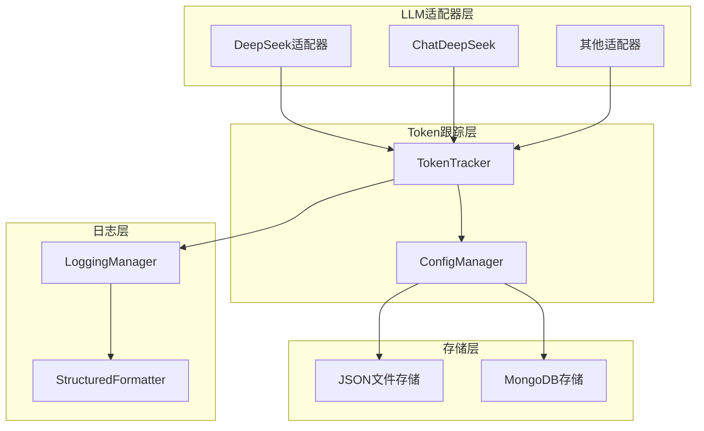
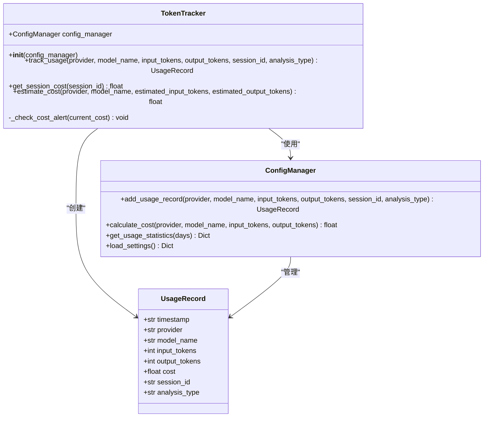
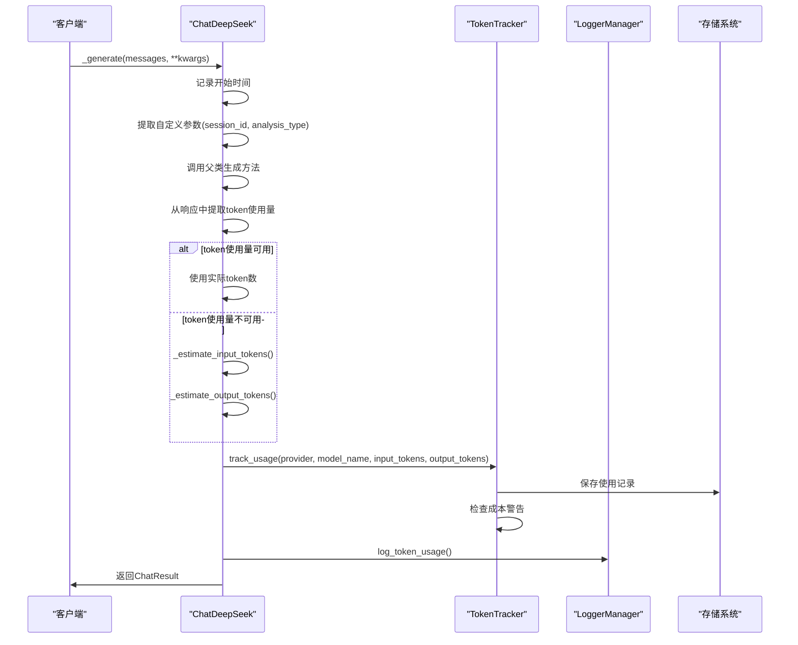
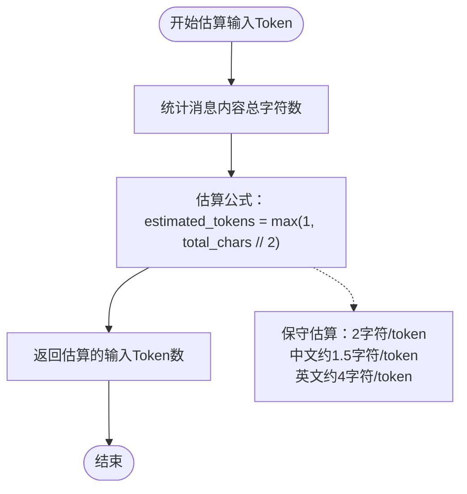
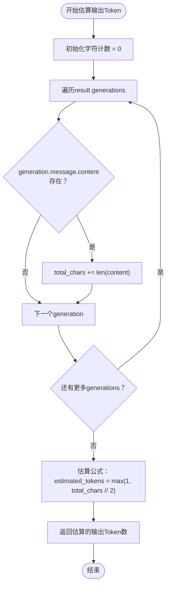
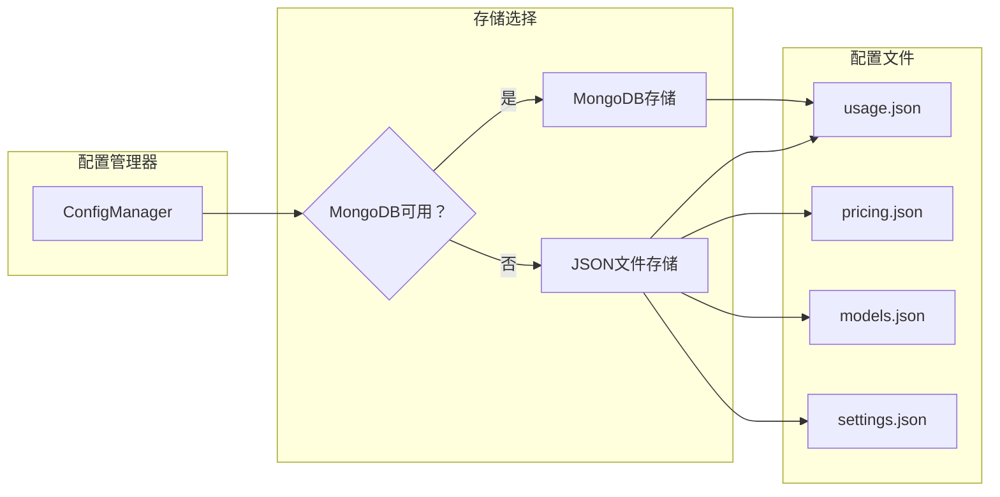
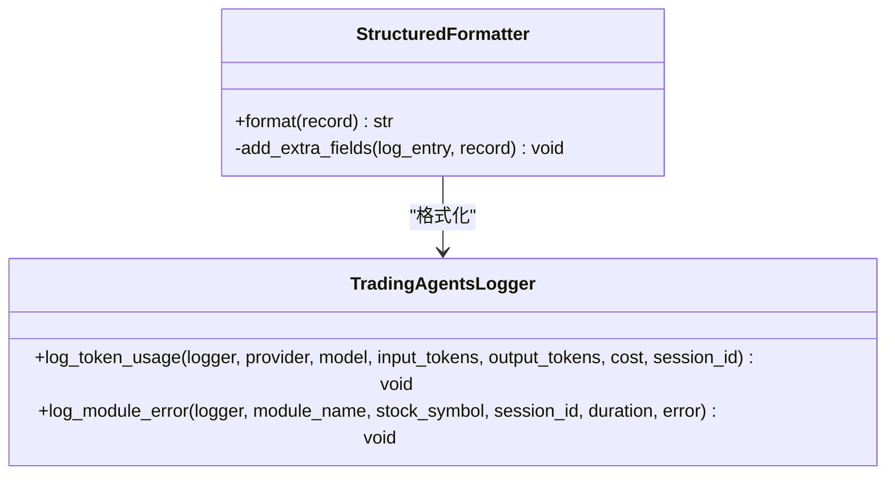
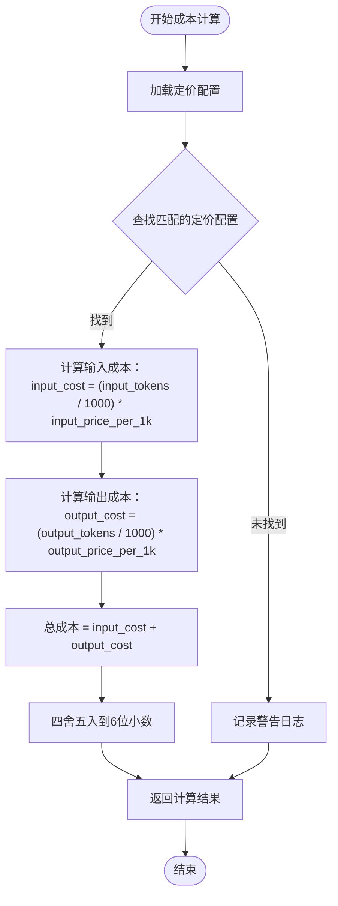
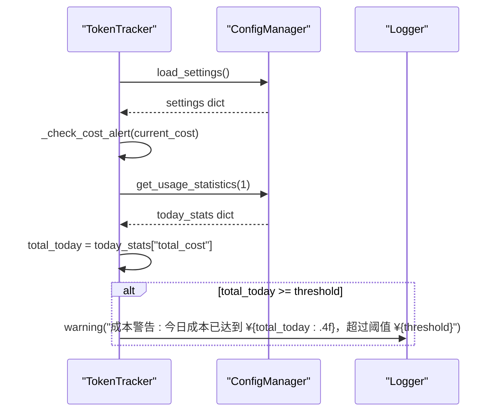

# Token跟踪机制

<cite>
**本文档中引用的文件**
- [tradingagents/llm_adapters/deepseek_adapter.py](file://tradingagents/llm_adapters/deepseek_adapter.py)
- [tradingagents/config/config_manager.py](file://tradingagents/config/config_manager.py)
- [tradingagents/config/mongodb_storage.py](file://tradingagents/config/mongodb_storage.py)
- [tradingagents/utils/logging_manager.py](file://tradingagents/utils/logging_manager.py)
- [examples/token_tracking_demo.py](file://examples/token_tracking_demo.py)
- [tests/test_deepseek_token_tracking.py](file://tests/test_deepseek_token_tracking.py)
- [config/logging.toml](file://config/logging.toml)
</cite>

## 目录
1. [简介](#简介)
2. [系统架构概览](#系统架构概览)
3. [TokenTracker核心组件](#tokentracker核心组件)
4. [DeepSeek适配器的Token拦截机制](#deepseek适配器的token拦截机制)
5. [Token估算算法](#token估算算法)
6. [配置管理与持久化](#配置管理与持久化)
7. [日志记录策略](#日志记录策略)
8. [成本计算机制](#成本计算机制)
9. [实际应用示例](#实际应用示例)
10. [故障排除指南](#故障排除指南)

## 简介

TradingAgents系统实现了一套完整的Token使用跟踪机制，能够实时监控和记录LLM调用的token消耗情况，并提供精确的成本计算功能。该机制通过重写ChatOpenAI的`_generate`方法，在DeepSeek适配器中实现了对LLM调用的透明拦截，确保每次API调用都能准确记录token使用量。

## 系统架构概览

Token跟踪机制采用分层架构设计，包含以下核心组件：



**图表来源**
- [tradingagents/llm_adapters/deepseek_adapter.py](file://tradingagents/llm_adapters/deepseek_adapter.py#L1-L50)
- [tradingagents/config/config_manager.py](file://tradingagents/config/config_manager.py#L652-L690)

## TokenTracker核心组件

TokenTracker是整个Token跟踪机制的核心控制器，负责协调各个组件的工作。

### 主要功能

1. **Token使用跟踪**：记录每次LLM调用的输入和输出token数量
2. **成本计算**：基于配置的定价表计算实际使用成本
3. **会话管理**：维护会话级别的使用统计
4. **成本预警**：监控成本使用情况并触发警告

### 核心方法



**图表来源**
- [tradingagents/config/config_manager.py](file://tradingagents/config/config_manager.py#L52-L103)
- [tradingagents/config/config_manager.py](file://tradingagents/config/config_manager.py#L652-L690)

**章节来源**
- [tradingagents/config/config_manager.py](file://tradingagents/config/config_manager.py#L652-L690)

## DeepSeek适配器的Token拦截机制

DeepSeek适配器通过继承ChatOpenAI并重写`_generate`方法实现了透明的Token拦截。

### 拦截流程



**图表来源**
- [tradingagents/llm_adapters/deepseek_adapter.py](file://tradingagents/llm_adapters/deepseek_adapter.py#L85-L150)

### 关键实现细节

1. **参数提取**：从kwargs中提取`session_id`和`analysis_type`参数
2. **响应处理**：从`result.llm_output`中提取token使用信息
3. **错误处理**：捕获并记录Token跟踪过程中的异常
4. **日志记录**：使用统一的日志管理器记录Token使用情况

**章节来源**
- [tradingagents/llm_adapters/deepseek_adapter.py](file://tradingagents/llm_adapters/deepseek_adapter.py#L85-L150)

## Token估算算法

当API未返回token使用信息时，系统会使用字符数估算算法进行估算。

### 输入Token估算



**图表来源**
- [tradingagents/llm_adapters/deepseek_adapter.py](file://tradingagents/llm_adapters/deepseek_adapter.py#L156-L168)

### 输出Token估算



**图表来源**
- [tradingagents/llm_adapters/deepseek_adapter.py](file://tradingagents/llm_adapters/deepseek_adapter.py#L170-L182)

### 估算精度说明

| 语言类型 | 字符数估算因子 | 说明 |
|---------|---------------|------|
| 中文 | 2 | 约1.5字符/token |
| 英文 | 2 | 约4字符/token |
| 混合文本 | 2 | 保守估算，确保不会低估 |

**章节来源**
- [tradingagents/llm_adapters/deepseek_adapter.py](file://tradingagents/llm_adapters/deepseek_adapter.py#L156-L182)

## 配置管理与持久化

系统支持两种存储方式：JSON文件存储和MongoDB存储，具有自动回退机制。

### 存储架构



**图表来源**
- [tradingagents/config/config_manager.py](file://tradingagents/config/config_manager.py#L377-L408)
- [tradingagents/config/mongodb_storage.py](file://tradingagents/config/mongodb_storage.py#L102-L145)

### MongoDB存储特性

1. **自动连接**：启动时自动尝试连接MongoDB
2. **聚合查询**：支持复杂的统计查询
3. **数据清理**：可配置的自动清理机制
4. **性能优化**：索引和查询优化

### JSON文件存储特性

1. **简单可靠**：无需外部依赖
2. **易于备份**：纯文本文件便于备份
3. **容量限制**：受文件大小限制

**章节来源**
- [tradingagents/config/config_manager.py](file://tradingagents/config/config_manager.py#L377-L408)
- [tradingagents/config/mongodb_storage.py](file://tradingagents/config/mongodb_storage.py#L102-L145)

## 日志记录策略

系统实现了分级日志记录策略，涵盖不同级别的Token使用信息。

### 日志级别与内容

| 日志级别 | 记录内容 | 触发条件 | 示例 |
|---------|----------|----------|------|
| INFO | Token使用详情 | 成功记录Token使用 | `📊 Token使用 - deepseek/deepseek-chat: 输入=2272, 输出=1215, 成本=¥0.0045` |
| DEBUG | 估算Token详情 | 使用估算算法 | `🔍 [DeepSeek] 使用估算token: 输入=2272, 输出=1215` |
| WARNING | 成本异常警告 | 成本计算为0或超过阈值 | `⚠️ [DeepSeek] 成本计算为0，可能配置有问题` |
| ERROR | Token跟踪失败 | 异常处理 | `⚠️ [DeepSeek] Token统计失败: connection timeout` |

### 日志格式化



**图表来源**
- [tradingagents/utils/logging_manager.py](file://tradingagents/utils/logging_manager.py#L354-L385)
- [tradingagents/utils/logging_manager.py](file://tradingagents/utils/logging_manager.py#L42-L88)

### 配置选项

系统支持多种日志配置模式：

1. **开发模式**：详细日志，包含调试信息
2. **生产模式**：结构化日志，性能优化
3. **Docker模式**：容器化部署专用配置

**章节来源**
- [tradingagents/utils/logging_manager.py](file://tradingagents/utils/logging_manager.py#L354-L385)
- [config/logging.toml](file://config/logging.toml#L71-L109)

## 成本计算机制

系统基于配置的定价表进行精确的成本计算。

### 成本计算流程



**图表来源**
- [tradingagents/config/config_manager.py](file://tradingagents/config/config_manager.py#L410-L421)

### 定价配置示例

| 供应商 | 模型 | 输入价格(¥/1K) | 输出价格(¥/1K) | 货币 |
|--------|------|---------------|---------------|------|
| DeepSeek | deepseek-chat | 0.0014 | 0.0028 | CNY |
| DashScope | qwen-turbo | 0.002 | 0.006 | CNY |
| DashScope | qwen-plus-latest | 0.004 | 0.012 | CNY |
| OpenAI | gpt-3.5-turbo | 0.0015 | 0.002 | USD |
| Google | gemini-pro | 0.00025 | 0.0005 | USD |

### 成本预警机制



**图表来源**
- [tradingagents/config/config_manager.py](file://tradingagents/config/config_manager.py#L675-L690)

**章节来源**
- [tradingagents/config/config_manager.py](file://tradingagents/config/config_manager.py#L410-L421)
- [tradingagents/config/config_manager.py](file://tradingagents/config/config_manager.py#L675-L690)

## 实际应用示例

### 基本使用示例

以下是使用DeepSeek适配器进行Token跟踪的基本示例：

```python
# 创建DeepSeek适配器
llm = ChatDeepSeek(
    model="deepseek-chat",
    temperature=0.1,
    max_tokens=1000
)

# 执行LLM调用（自动记录Token使用）
response = llm.invoke(
    "请分析当前市场趋势",
    session_id="market_analysis_001",
    analysis_type="technical_analysis"
)

# 获取会话成本
session_cost = token_tracker.get_session_cost("market_analysis_001")
print(f"本次会话成本: ¥{session_cost:.4f}")
```

### 成本估算示例

```python
# 估算不同场景的成本
scenarios = [
    ("简单查询", "qwen-turbo", 100, 50),
    ("详细分析", "qwen-turbo", 500, 300),
    ("深度研究", "qwen-plus-latest", 1000, 800),
]

for scenario, model, input_tokens, output_tokens in scenarios:
    cost = token_tracker.estimate_cost(
        provider="dashscope",
        model_name=model,
        estimated_input_tokens=input_tokens,
        estimated_output_tokens=output_tokens
    )
    print(f"{scenario}: ¥{cost:.4f} ({input_tokens}+{output_tokens} tokens)")
```

### 统计信息查看

```python
# 获取今日统计
today_stats = config_manager.get_usage_statistics(1)
print(f"今日总成本: ¥{today_stats['total_cost']:.4f}")
print(f"今日总请求: {today_stats['total_requests']}")
print(f"今日总Token: {today_stats['total_input_tokens'] + today_stats['total_output_tokens']}")

# 获取供应商统计
provider_stats = today_stats.get('provider_stats', {})
for provider, stats in provider_stats.items():
    print(f"{provider}: ¥{stats['cost']:.4f} ({stats['requests']}次)")
```

**章节来源**
- [examples/token_tracking_demo.py](file://examples/token_tracking_demo.py#L80-L150)
- [examples/token_tracking_demo.py](file://examples/token_tracking_demo.py#L152-L174)

## 故障排除指南

### 常见问题及解决方案

#### 1. Token跟踪未启用

**症状**：日志中没有Token跟踪相关信息
**原因**：`TOKEN_TRACKING_ENABLED`为False
**解决方案**：
```python
# 检查配置
from tradingagents.config.config_manager import TOKEN_TRACKING_ENABLED
print(f"Token跟踪启用状态: {TOKEN_TRACKING_ENABLED}")

# 启用Token跟踪
import os
os.environ["ENABLE_COST_TRACKING"] = "true"
```

#### 2. 成本计算为0

**症状**：使用记录的成本为0.0
**原因**：未找到匹配的定价配置
**解决方案**：
```python
# 检查定价配置
from tradingagents.config.config_manager import config_manager
pricing_configs = config_manager.load_pricing()
for pricing in pricing_configs:
    if pricing.provider == "deepseek" and pricing.model_name == "deepseek-chat":
        print(f"找到定价配置: {pricing}")
        break
else:
    print("未找到DeepSeek定价配置，请检查pricing.json文件")
```

#### 3. MongoDB连接失败

**症状**：MongoDB存储功能不可用
**原因**：连接字符串配置错误或网络问题
**解决方案**：
```bash
# 检查环境变量
export USE_MONGODB_STORAGE=true
export MONGODB_CONNECTION_STRING="mongodb://localhost:27017"
export MONGODB_DATABASE_NAME="tradingagents"

# 验证连接
python -c "from tradingagents.config.mongodb_storage import MongoDBStorage; db = MongoDBStorage(); print(db.is_connected())"
```

#### 4. Token估算不准确

**症状**：估算的Token数量与实际差异较大
**原因**：字符估算因子不适合特定内容
**解决方案**：
```python
# 调整估算算法
def custom_estimate_input_tokens(messages):
    total_chars = sum(len(str(msg.content)) for msg in messages)
    # 根据内容类型调整估算因子
    if any("中文" in str(msg.content) for msg in messages):
        return max(1, total_chars // 3)  # 中文更保守
    else:
        return max(1, total_chars // 2)  # 英文标准
```

### 调试技巧

1. **启用详细日志**：
```python
import logging
logging.getLogger('tradingagents').setLevel(logging.DEBUG)
```

2. **检查配置文件**：
```bash
# 检查pricing.json
cat config/pricing.json

# 检查usage.json
cat config/usage.json
```

3. **验证API响应**：
```python
# 手动检查API响应格式
response = llm._generate(messages)
print(response.llm_output)  # 查看token使用信息
```

**章节来源**
- [tests/test_deepseek_token_tracking.py](file://tests/test_deepseek_token_tracking.py#L20-L50)
- [examples/token_tracking_demo.py](file://examples/token_tracking_demo.py#L40-L70)