# 成本优化策略

<cite>
**本文档引用的文件**
- [examples/token_tracking_demo.py](file://examples/token_tracking_demo.py)
- [tradingagents/llm/deepseek_adapter.py](file://tradingagents/llm/deepseek_adapter.py)
- [cli/main.py](file://cli/main.py)
- [cli/utils.py](file://cli/utils.py)
- [web/app.py](file://web/app.py)
- [web/modules/token_statistics.py](file://web/modules/token_statistics.py)
- [tradingagents/config/config_manager.py](file://tradingagents/config/config_manager.py)
- [tradingagents/default_config.py](file://tradingagents/default_config.py)
- [tests/debug_deepseek_cost.py](file://tests/debug_deepseek_cost.py)
- [tests/test_deepseek_cost_calculation.py](file://tests/test_deepseek_cost_calculation.py)
</cite>

## 目录
1. [简介](#简介)
2. [系统架构概览](#系统架构概览)
3. [Token追踪机制](#token追踪机制)
4. [模型选择策略](#模型选择策略)
5. [成本计算实现](#成本计算实现)
6. [Web界面成本优化](#web界面成本优化)
7. [CLI界面成本优化](#cli界面成本优化)
8. [长期成本监控](#长期成本监控)
9. [配置管理与自定义](#配置管理与自定义)
10. [最佳实践建议](#最佳实践建议)

## 简介

TradingAgents-CN系统采用了一套完整的成本优化策略，通过智能的token追踪、动态模型选择和精细化的成本计算，实现了在保证分析质量的同时最大化成本效益。该系统支持多种LLM提供商，能够根据研究深度、分析类型和预算约束自动选择最优的模型组合。

## 系统架构概览

系统采用分层架构设计，核心组件包括：

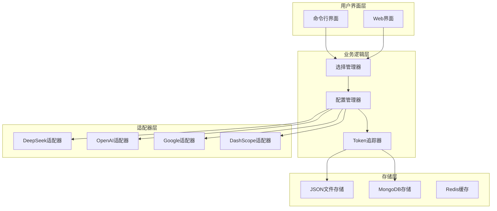

**图表来源**
- [cli/main.py](file://cli/main.py#L1-L50)
- [web/app.py](file://web/app.py#L1-L50)
- [tradingagents/config/config_manager.py](file://tradingagents/config/config_manager.py#L1-L100)

## Token追踪机制

### 核心追踪功能

Token追踪器是系统成本优化的核心组件，负责实时监控和记录所有LLM调用的token使用情况。

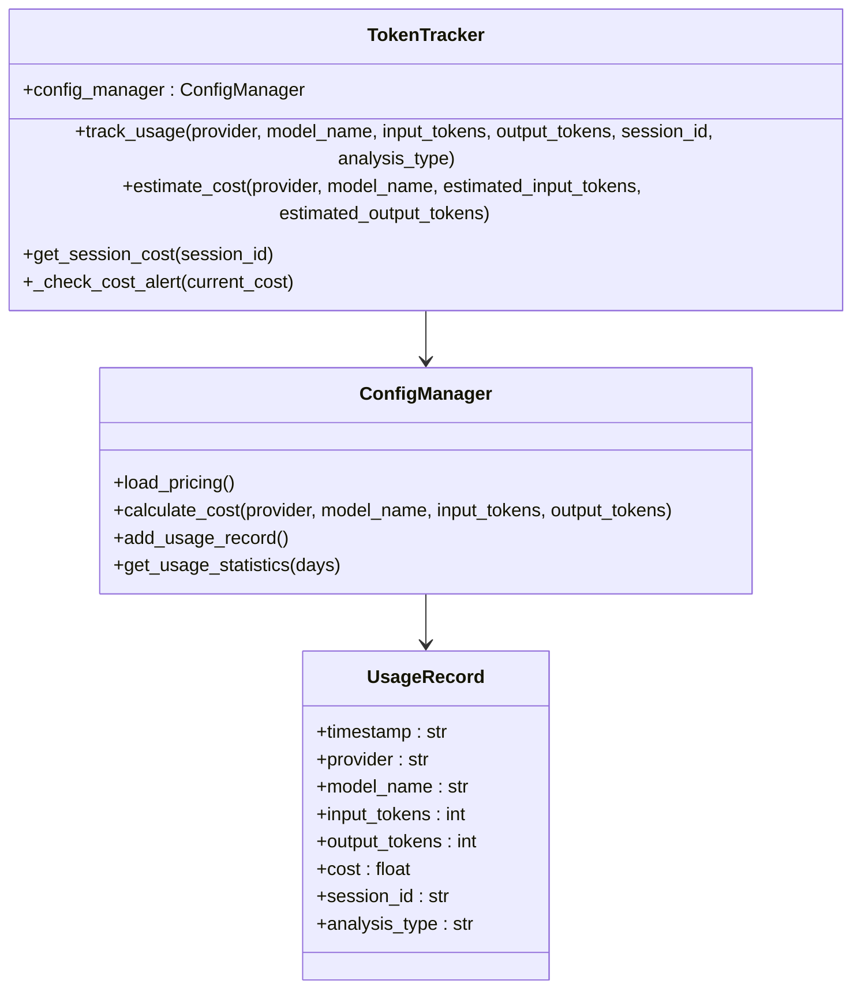

**图表来源**
- [tradingagents/config/config_manager.py](file://tradingagents/config/config_manager.py#L652-L690)
- [tradingagents/config/config_manager.py](file://tradingagents/config/config_manager.py#L50-L80)

### 追踪实现细节

系统在每个LLM调用完成后自动记录以下信息：

| 字段 | 类型 | 描述 |
|------|------|------|
| timestamp | string | ISO格式的时间戳 |
| provider | string | LLM提供商名称 |
| model_name | string | 模型完整名称 |
| input_tokens | integer | 输入token数量 |
| output_tokens | integer | 输出token数量 |
| cost | float | 计算的成本金额 |
| session_id | string | 会话唯一标识符 |
| analysis_type | string | 分析类型分类 |

**章节来源**
- [tradingagents/config/config_manager.py](file://tradingagents/config/config_manager.py#L652-L690)

### 成本估算功能

系统提供实时成本估算功能，帮助用户在分析开始前预估成本：

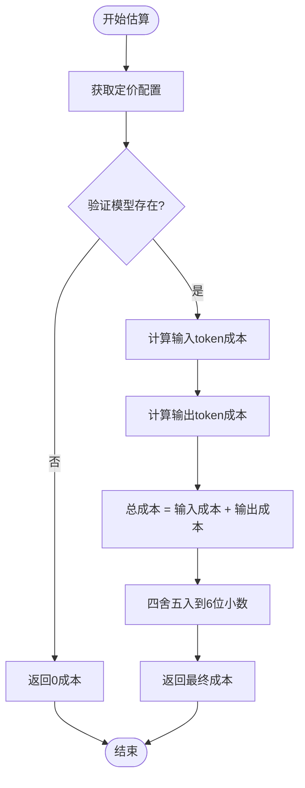

**图表来源**
- [tradingagents/config/config_manager.py](file://tradingagents/config/config_manager.py#L410-L421)

**章节来源**
- [examples/token_tracking_demo.py](file://examples/token_tracking_demo.py#L140-L170)

## 模型选择策略

### 研究深度分级

系统根据研究深度自动选择合适的模型组合，实现成本与质量的平衡：

| 研究深度 | 辩论轮次 | 快速思考模型 | 深度思考模型 | 适用场景 |
|----------|----------|--------------|--------------|----------|
| 浅层 | 1 | GPT-4o-mini | GPT-4o-mini | 快速基础分析 |
| 中等 | 3 | qwen-turbo | qwen-plus | 标准深度分析 |
| 深度 | 5 | gemini-2.5-flash | gemini-2.5-pro | 全面深度研究 |

**章节来源**
- [cli/utils.py](file://cli/utils.py#L105-L145)

### 智能模型选择

系统支持多种LLM提供商的智能选择：

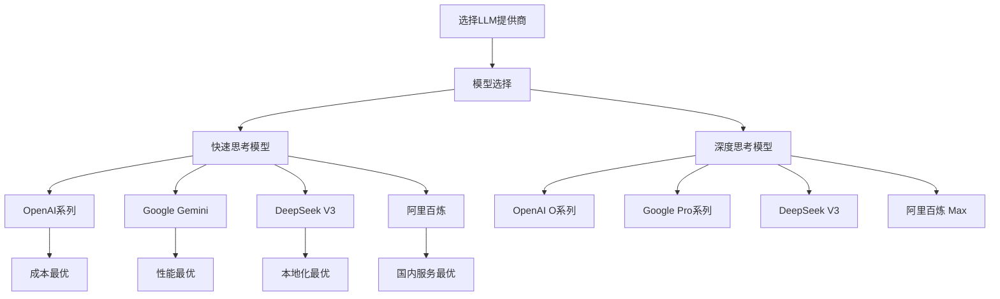

**图表来源**
- [cli/utils.py](file://cli/utils.py#L147-L300)

### 模型特性对比

不同模型在性能和成本方面的特点：

| 提供商 | 快速模型 | 深度模型 | 成本特点 | 推荐场景 |
|--------|----------|----------|----------|----------|
| OpenAI | GPT-4o-mini | o4-mini/o3-mini | 中等偏高 | 通用分析 |
| Google | Gemini 2.5 Flash | Gemini 2.5 Pro | 中等 | 多语言支持 |
| DeepSeek | deepseek-chat | deepseek-chat | 相对较低 | 国内用户 |
| 阿里百炼 | qwen-turbo | qwen-max | 最低 | 国内首选 |

**章节来源**
- [cli/utils.py](file://cli/utils.py#L202-L239)

## 成本计算实现

### 定价配置系统

系统采用灵活的定价配置机制，支持动态调整各提供商的收费标准：

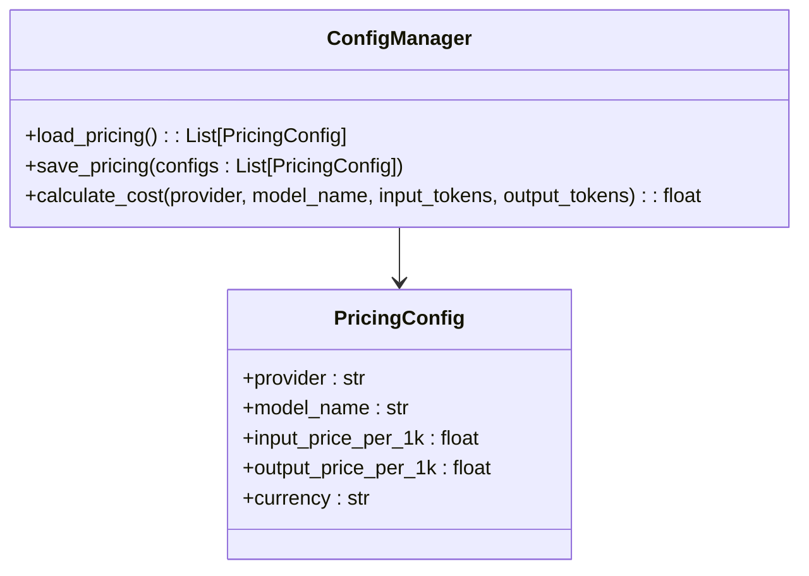

**图表来源**
- [tradingagents/config/config_manager.py](file://tradingagents/config/config_manager.py#L50-L80)

### 成本计算公式

系统使用标准化的成本计算公式：

```
总成本 = (输入token数 ÷ 1000) × 输入单价 + (输出token数 ÷ 1000) × 输出单价
```

示例计算：
- 输入token: 2000, 输出token: 1000
- 输入单价: ¥0.01/1K, 输出单价: ¥0.03/1K
- 总成本 = (2000÷1000)×0.01 + (1000÷1000)×0.03 = ¥0.05

**章节来源**
- [tradingagents/config/config_manager.py](file://tradingagents/config/config_manager.py#L410-L421)

### 动态成本监控

系统提供实时的成本监控和预警功能：

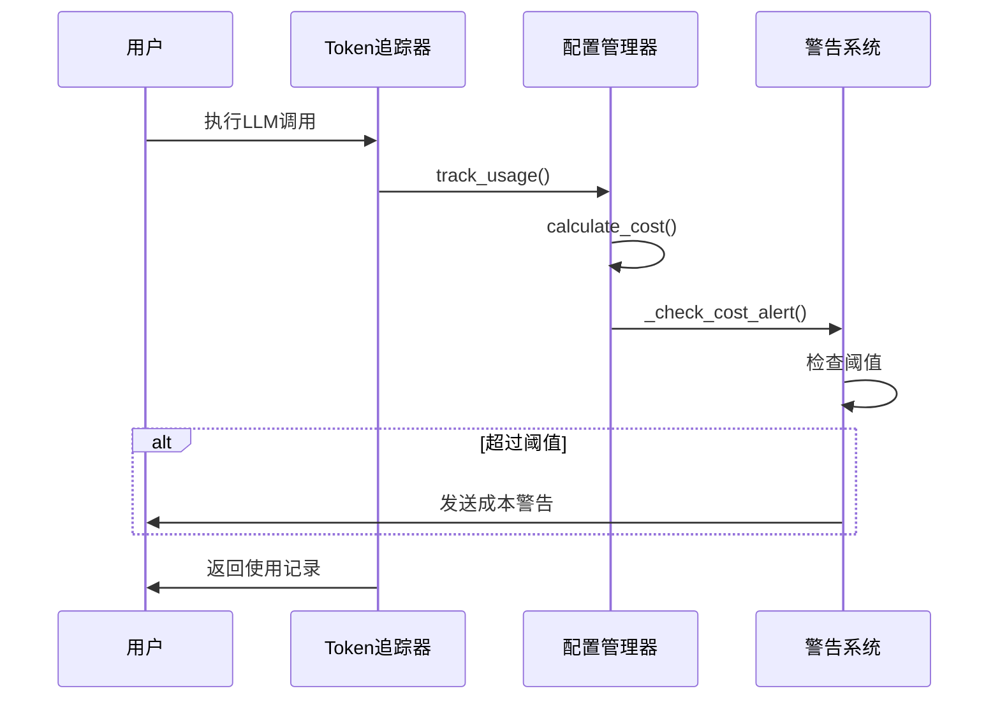

**图表来源**
- [tradingagents/config/config_manager.py](file://tradingagents/config/config_manager.py#L652-L690)

**章节来源**
- [examples/token_tracking_demo.py](file://examples/token_tracking_demo.py#L100-L140)

## Web界面成本优化

### 实时统计面板

Web界面提供直观的成本统计和分析：

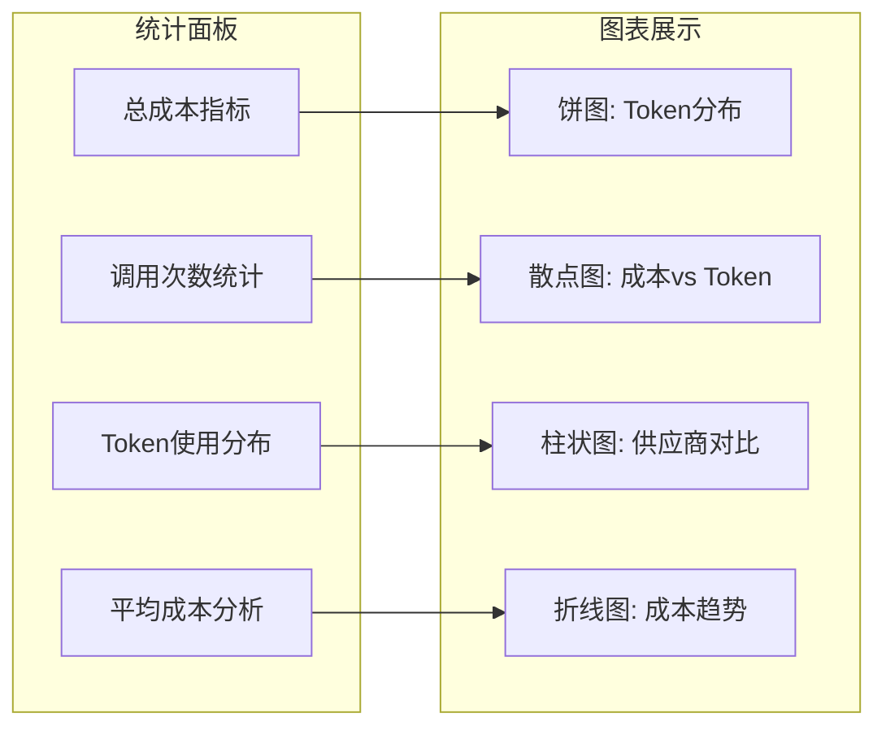

**图表来源**
- [web/modules/token_statistics.py](file://web/modules/token_statistics.py#L80-L120)

### 交互式成本分析

用户可以通过Web界面进行深入的成本分析：

| 功能 | 描述 | 价值 |
|------|------|------|
| 时间范围筛选 | 选择统计时间窗口 | 精确的成本趋势分析 |
| 供应商对比 | 多维度成本对比 | 优化供应商选择 |
| 成本预警 | 实时成本监控 | 防止预算超支 |
| 数据导出 | 下载详细统计数据 | 支持进一步分析 |

**章节来源**
- [web/modules/token_statistics.py](file://web/modules/token_statistics.py#L20-L60)

## CLI界面成本优化

### 智能配置向导

CLI界面提供交互式的成本优化配置：

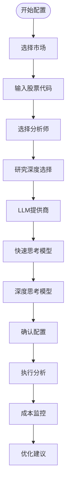

**图表来源**
- [cli/main.py](file://cli/main.py#L400-L500)

### 自动成本估算

CLI界面在分析开始前提供详细的成本估算：

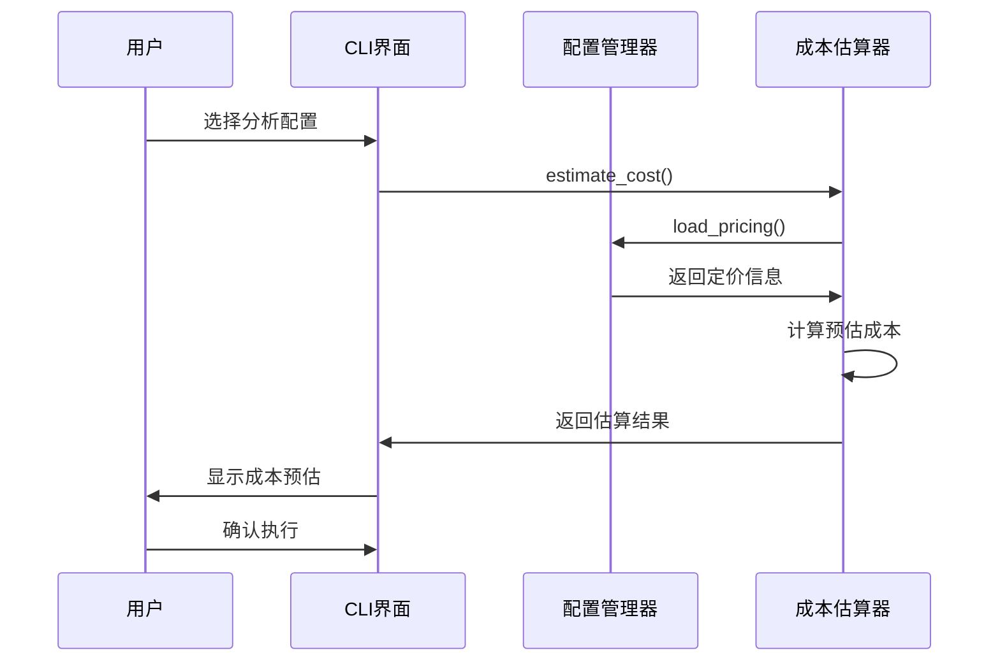

**图表来源**
- [cli/utils.py](file://cli/utils.py#L105-L145)

**章节来源**
- [cli/main.py](file://cli/main.py#L300-L400)

## 长期成本监控

### 多层次统计分析

系统提供多层次的成本监控和分析功能：

| 监控层级 | 统计维度 | 分析重点 |
|----------|----------|----------|
| 实时监控 | 单次调用成本 | 即时成本控制 |
| 日度统计 | 每日总成本 | 成本趋势观察 |
| 周度统计 | 周成本分布 | 成本周期规律 |
| 月度统计 | 月度预算对比 | 长期成本规划 |

### 存储优化策略

系统支持多种存储方案以优化长期成本：

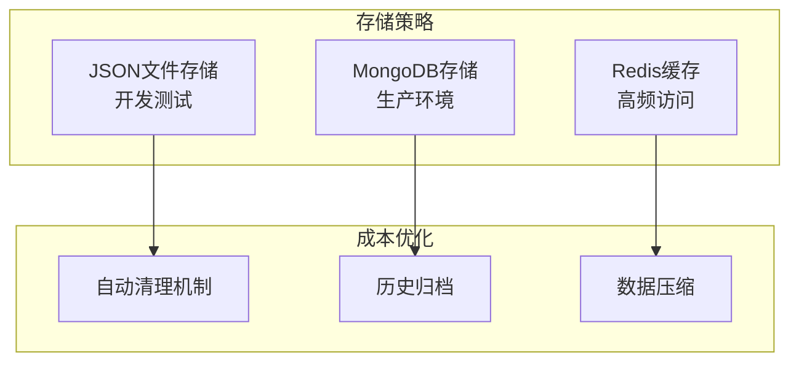

**图表来源**
- [tradingagents/config/mongodb_storage.py](file://tradingagents/config/mongodb_storage.py#L102-L145)

### 成本预警机制

系统内置智能成本预警机制：

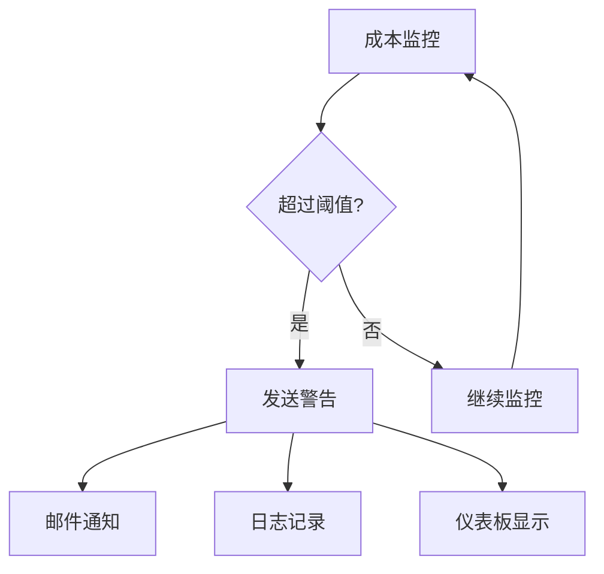

**图表来源**
- [tradingagents/config/config_manager.py](file://tradingagents/config/config_manager.py#L670-L690)

**章节来源**
- [web/modules/token_statistics.py](file://web/modules/token_statistics.py#L300-L400)

## 配置管理与自定义

### 灵活的定价配置

系统允许用户自定义各提供商的定价：

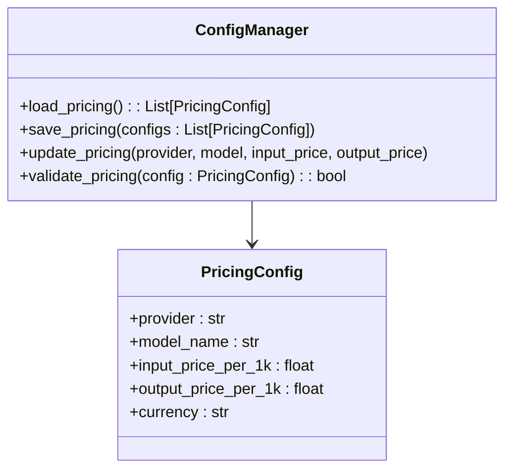

**图表来源**
- [tradingagents/config/config_manager.py](file://tradingagents/config/config_manager.py#L50-L80)

### 环境变量配置

系统支持通过环境变量进行成本相关配置：

| 环境变量 | 默认值 | 描述 |
|----------|--------|------|
| ENABLE_COST_TRACKING | true | 启用成本跟踪 |
| COST_ALERT_THRESHOLD | 100.0 | 成本警告阈值(¥) |
| USE_MONGODB_STORAGE | false | 启用MongoDB存储 |
| MAX_USAGE_RECORDS | 10000 | 最大使用记录数 |

**章节来源**
- [tradingagents/default_config.py](file://tradingagents/default_config.py#L10-L20)

## 最佳实践建议

### 成本优化策略

1. **研究深度适配**
   - 浅层分析：使用轻量级模型如GPT-4o-mini
   - 标准分析：选择平衡性能的qwen-turbo
   - 深度分析：使用专业模型如qwen-max

2. **时间窗口优化**
   - 日常分析：选择当日统计，及时发现异常
   - 周期分析：关注周度成本分布规律
   - 长期规划：基于月度趋势制定预算

3. **存储策略选择**
   - 开发阶段：使用JSON文件存储
   - 生产环境：部署MongoDB提升性能
   - 长期归档：定期清理历史数据

### 监控与维护

1. **定期检查**
   - 每日查看成本统计
   - 每周分析成本趋势
   - 每月评估供应商表现

2. **预警设置**
   - 设置合理的成本阈值
   - 配置多渠道通知
   - 建立应急响应机制

3. **持续优化**
   - 定期更新定价配置
   - 评估新模型的成本效益
   - 优化分析流程减少不必要的调用

### 性能与成本平衡

通过合理的配置和监控，系统能够在保证分析质量的同时实现：

- **成本降低**：通过智能模型选择和批量优化
- **效率提升**：通过缓存机制和异步处理
- **质量保障**：通过多层验证和备份机制

**章节来源**
- [examples/token_tracking_demo.py](file://examples/token_tracking_demo.py#L250-L284)