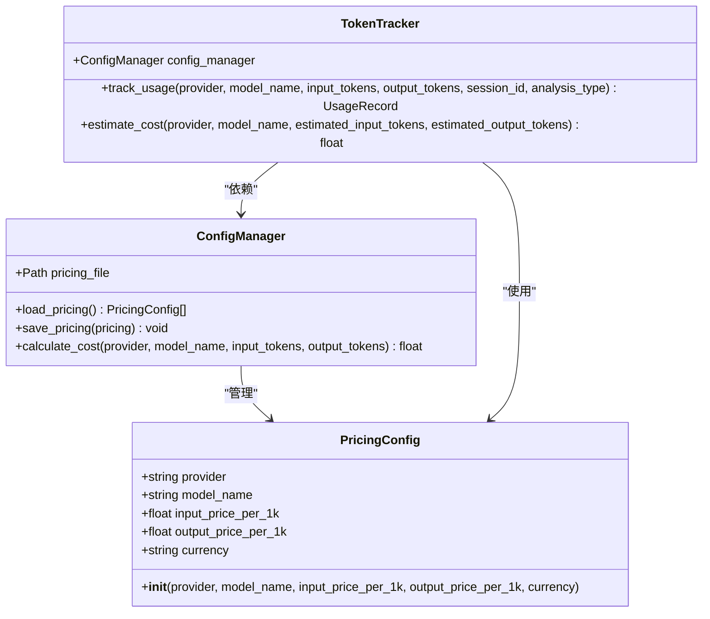
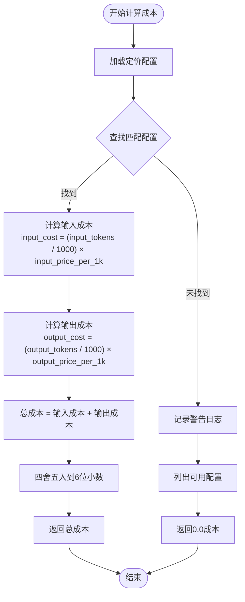
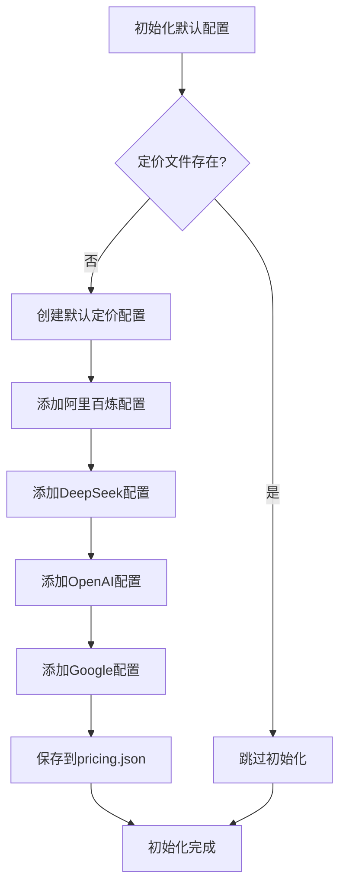
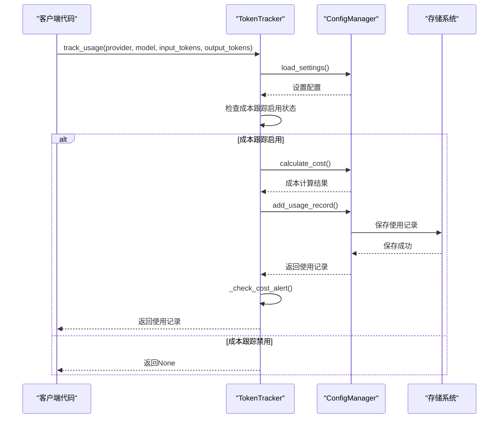
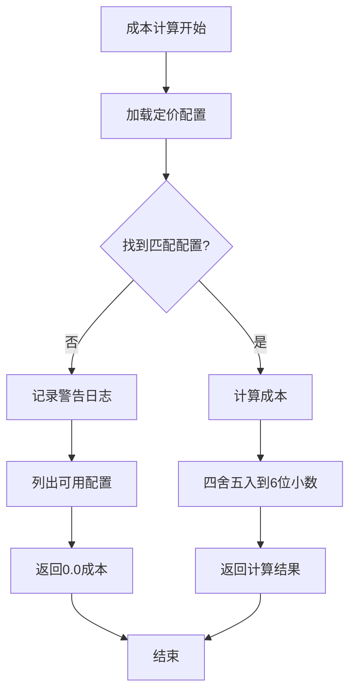
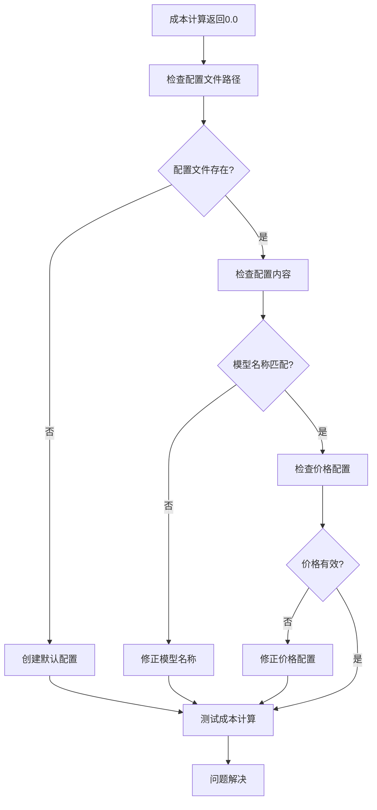

# 成本计算模型

<cite>
**本文档中引用的文件**
- [config_manager.py](file://tradingagents/config/config_manager.py)
- [test_deepseek_cost_calculation.py](file://tests/test_deepseek_cost_calculation.py)
- [debug_deepseek_cost.py](file://tests/debug_deepseek_cost.py)
- [debug_deepseek_cost_issue.py](file://tests/debug_deepseek_cost_issue.py)
- [test_config_loading.py](file://tests/test_config_loading.py)
- [config_management_demo.py](file://examples/config_management_demo.py)
- [token_tracking_demo.py](file://examples/token_tracking_demo.py)
- [test_config_management.py](file://tests/test_config_management.py)
</cite>

## 目录
1. [简介](#简介)
2. [PricingConfig数据类](#pricingconfig数据类)
3. [成本计算核心机制](#成本计算核心机制)
4. [定价配置管理](#定价配置管理)
5. [Token跟踪系统](#token跟踪系统)
6. [货币处理与降级策略](#货币处理与降级策略)
7. [默认定价配置详解](#默认定价配置详解)
8. [成本计算精度与错误排查](#成本计算精度与错误排查)
9. [完整使用示例](#完整使用示例)
10. [故障排除指南](#故障排除指南)

## 简介

TradingAgents-CN系统采用基于Token的精细化成本计算模型，为不同LLM提供商和模型提供精确的成本控制和跟踪功能。该系统支持多种货币单位（CNY/USD），具备智能降级策略，并提供了完整的Web界面用于配置和监控成本。

## PricingConfig数据类

### 数据结构定义

PricingConfig是成本计算的核心数据结构，定义了每个LLM提供商和模型的价格配置：



**图表来源**
- [config_manager.py](file://tradingagents/config/config_manager.py#L43-L49)

### 字段说明

| 字段名 | 类型 | 描述 | 默认值 |
|--------|------|------|--------|
| provider | string | LLM提供商名称 | 必填 |
| model_name | string | 模型名称标识符 | 必填 |
| input_price_per_1k | float | 每1000个输入Token的价格 | 必填 |
| output_price_per_1k | float | 每1000个输出Token的价格 | 必填 |
| currency | string | 货币单位（CNY/USD） | "CNY" |

**节来源**
- [config_manager.py](file://tradingagents/config/config_manager.py#L43-L49)

## 成本计算核心机制

### calculate_cost方法实现

成本计算的核心逻辑位于ConfigManager类的calculate_cost方法中：



**图表来源**
- [config_manager.py](file://tradingagents/config/config_manager.py#L410-L421)

### 计算公式详解

成本计算遵循以下数学公式：

```
总成本 = (输入Token数 ÷ 1000) × 输入价格 + (输出Token数 ÷ 1000) × 输出价格
```

**节来源**
- [config_manager.py](file://tradingagents/config/config_manager.py#L410-L421)

## 定价配置管理

### 配置文件结构

定价配置存储在JSON格式的文件中，具有以下结构：

```json
[
    {
        "provider": "dashscope",
        "model_name": "qwen-turbo",
        "input_price_per_1k": 0.002,
        "output_price_per_1k": 0.006,
        "currency": "CNY"
    },
    {
        "provider": "deepseek",
        "model_name": "deepseek-chat",
        "input_price_per_1k": 0.0014,
        "output_price_per_1k": 0.0028,
        "currency": "CNY"
    }
]
```

### 默认配置初始化

系统在首次运行时会自动生成默认定价配置：



**图表来源**
- [config_manager.py](file://tradingagents/config/config_manager.py#L180-L274)

**节来源**
- [config_manager.py](file://tradingagents/config/config_manager.py#L180-L274)

## Token跟踪系统

### TokenTracker类架构

Token跟踪系统负责自动记录每次LLM调用的Token使用情况和成本：



**图表来源**
- [config_manager.py](file://tradingagents/config/config_manager.py#L652-L690)

### 使用记录数据结构

UsageRecord类包含了完整的使用统计信息：

| 字段名 | 类型 | 描述 |
|--------|------|------|
| timestamp | string | ISO格式的时间戳 |
| provider | string | LLM提供商 |
| model_name | string | 模型名称 |
| input_tokens | int | 输入Token数量 |
| output_tokens | int | 输出Token数量 |
| cost | float | 计算出的成本 |
| session_id | string | 会话标识符 |
| analysis_type | string | 分析类型分类 |

**节来源**
- [config_manager.py](file://tradingagents/config/config_manager.py#L55-L61)

## 货币处理与降级策略

### 货币单位支持

系统支持多种货币单位，主要支持：
- **CNY**：人民币（默认货币）
- **USD**：美元
- **EUR**：欧元

### 降级策略

当找不到匹配的定价配置时，系统采用以下降级策略：



**图表来源**
- [config_manager.py](file://tradingagents/config/config_manager.py#L410-L421)

### 成本警告机制

系统提供成本警告功能，当单日成本超过阈值时会发出警告：

```python
# 成本警告阈值配置
cost_alert_threshold = settings.get("cost_alert_threshold", 100.0)

# 检查今日总成本
today_stats = self.config_manager.get_usage_statistics(1)
total_today = today_stats["total_cost"]

if total_today >= threshold:
    logger.warning(f"⚠️ 成本警告: 今日成本已达到 ¥{total_today:.4f}，超过阈值 ¥{threshold}")
```

**节来源**
- [config_manager.py](file://tradingagents/config/config_manager.py#L670-L690)

## 默认定价配置详解

### DeepSeek定价配置

DeepSeek是国内领先的AI模型提供商，其定价配置如下：

| 模型名称 | 输入价格 (CNY/1K tokens) | 输出价格 (CNY/1K tokens) | 货币单位 |
|----------|-------------------------|-------------------------|----------|
| deepseek-chat | 0.0014 | 0.0028 | CNY |
| deepseek-coder | 0.0014 | 0.0028 | CNY |

**实际使用案例**：
- 输入2617 tokens，输出312 tokens：成本 ≈ ¥0.0045
- 输入3240 tokens，输出320 tokens：成本 ≈ ¥0.0050

### 阿里百炼定价配置

阿里云百炼平台的定价策略：

| 模型系列 | 输入价格 (CNY/1K tokens) | 输出价格 (CNY/1K tokens) | 货币单位 |
|----------|-------------------------|-------------------------|----------|
| qwen-turbo | 0.002 | 0.006 | CNY |
| qwen-plus | 0.004 | 0.012 | CNY |
| qwen-max | 0.02 | 0.06 | CNY |

### OpenAI定价配置

OpenAI模型采用美元计价：

| 模型系列 | 输入价格 (USD/1K tokens) | 输出价格 (USD/1K tokens) | 货币单位 |
|----------|-------------------------|-------------------------|----------|
| gpt-3.5-turbo | 0.0015 | 0.002 | USD |
| gpt-4 | 0.03 | 0.06 | USD |
| gpt-4-turbo | 0.01 | 0.03 | USD |

### Google Gemini定价配置

Google Gemini模型同样采用美元计价：

| 模型系列 | 输入价格 (USD/1K tokens) | 输出价格 (USD/1K tokens) | 货币单位 |
|----------|-------------------------|-------------------------|----------|
| gemini-2.5-pro | 0.00025 | 0.0005 | USD |
| gemini-pro | 0.00025 | 0.0005 | USD |

**节来源**
- [config_manager.py](file://tradingagents/config/config_manager.py#L210-L249)

## 成本计算精度与错误排查

### 精度控制

系统采用6位小数的精度控制：

```python
# 四舍五入到6位小数
total_cost = round(input_cost + output_cost, 6)
```

### 常见错误排查

#### 1. 成本计算返回0.0

**可能原因**：
- 配置文件路径错误
- 模型名称不匹配
- 配置文件损坏

**排查步骤**：


**图表来源**
- [debug_deepseek_cost_issue.py](file://tests/debug_deepseek_cost_issue.py#L54-L81)

#### 2. 配置加载失败

**排查方法**：
```python
# 检查配置文件状态
config_manager = ConfigManager()
print(f"配置目录: {config_manager.config_dir}")
print(f"定价文件存在: {config_manager.pricing_file.exists()}")

# 直接读取文件内容
if config_manager.pricing_file.exists():
    with open(config_manager.pricing_file, 'r', encoding='utf-8') as f:
        content = f.read()
    print(f"文件内容长度: {len(content)}")
```

#### 3. 模型名称不匹配

**解决方案**：
- 确保模型名称完全一致
- 检查大小写敏感性
- 验证配置中的模型名称

**节来源**
- [debug_deepseek_cost_issue.py](file://tests/debug_deepseek_cost_issue.py#L180-L220)

## 完整使用示例

### 基本成本计算示例

以下是完整的成本计算使用流程：

```python
from tradingagents.config.config_manager import ConfigManager

# 创建配置管理器
config_manager = ConfigManager()

# 计算DeepSeek成本
cost = config_manager.calculate_cost(
    provider="deepseek",
    model_name="deepseek-chat",
    input_tokens=2617,
    output_tokens=312
)
print(f"DeepSeek成本: ¥{cost:.6f}")
```

### Token跟踪使用示例

```python
from tradingagents.config.config_manager import token_tracker

# 跟踪使用并记录成本
record = token_tracker.track_usage(
    provider="dashscope",
    model_name="qwen-plus",
    input_tokens=2000,
    output_tokens=1000,
    session_id="analysis_001",
    analysis_type="stock_analysis"
)

if record:
    print(f"会话成本: ¥{record.cost:.6f}")
    print(f"输入Token: {record.input_tokens}")
    print(f"输出Token: {record.output_tokens}")
```

### 成本估算示例

```python
# 估算批量分析成本
total_input = 1000 * 5  # 5个分析师，每人1000输入Token
total_output = 500 * 5  # 5个分析师，每人500输出Token

cost = token_tracker.estimate_cost(
    provider="openai",
    model_name="gpt-3.5-turbo",
    estimated_input_tokens=total_input,
    estimated_output_tokens=total_output
)
print(f"批量分析成本: ${cost:.6f}")
```

**节来源**
- [config_management_demo.py](file://examples/config_management_demo.py#L43-L64)
- [config_management_demo.py](file://examples/config_management_demo.py#L85-L110)

## 故障排除指南

### 常见问题及解决方案

#### 1. 配置文件问题

**症状**：成本计算总是返回0.0
**解决方案**：
```python
# 检查配置文件
config_manager = ConfigManager()
print(f"配置文件路径: {config_manager.pricing_file}")
print(f"文件存在: {config_manager.pricing_file.exists()}")

# 重新初始化默认配置
if not config_manager.pricing_file.exists():
    config_manager._init_default_configs()
```

#### 2. 模型名称不匹配

**症状**：找不到匹配的定价配置
**解决方案**：
```python
# 列出所有可用配置
pricing_configs = config_manager.load_pricing()
for config in pricing_configs:
    print(f"提供商: {config.provider}, 模型: {config.model_name}")
```

#### 3. 成本跟踪未启用

**症状**：token_tracker返回None
**解决方案**：
```python
# 检查设置
settings = config_manager.load_settings()
print(f"成本跟踪启用: {settings.get('enable_cost_tracking', True)}")

# 启用成本跟踪
settings['enable_cost_tracking'] = True
config_manager.save_settings(settings)
```

### 调试工具使用

系统提供了多个调试工具来帮助诊断问题：

```python
# 配置加载调试
from tests.test_config_loading import test_pricing_config_loading
test_pricing_config_loading()

# 成本计算调试  
from tests.debug_deepseek_cost import test_cost_calculation
test_cost_calculation()

# 完整问题调试
from tests.debug_deepseek_cost_issue import main
main()
```

**节来源**
- [test_config_loading.py](file://tests/test_config_loading.py#L15-L50)
- [debug_deepseek_cost.py](file://tests/debug_deepseek_cost.py#L25-L50)
- [debug_deepseek_cost_issue.py](file://tests/debug_deepseek_cost_issue.py#L15-L50)

### 性能优化建议

1. **定期清理使用记录**：避免过多的历史记录影响性能
2. **合理设置成本警告阈值**：及时发现异常成本
3. **使用MongoDB存储**：对于大量使用场景，推荐使用MongoDB替代JSON文件存储
4. **监控配置文件大小**：确保配置文件不会过大影响加载速度

通过以上详细的文档说明，用户可以全面了解TradingAgents-CN系统的成本计算模型，包括其架构设计、配置管理、使用方法以及常见问题的解决方案。该系统为企业级应用提供了精确、可靠的成本控制和跟踪能力。