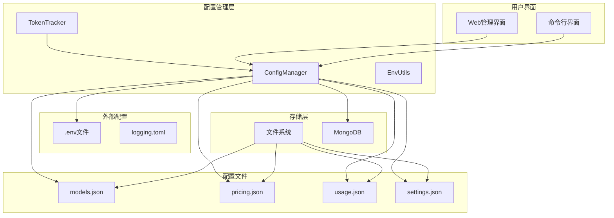
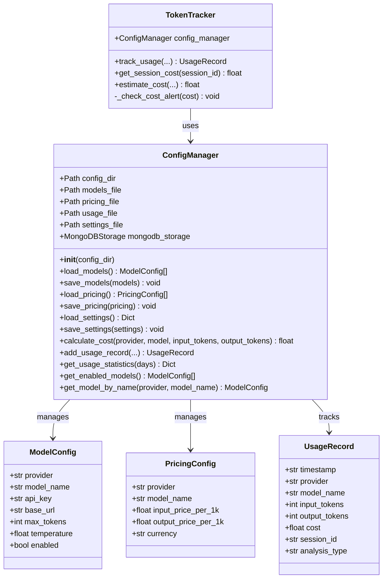
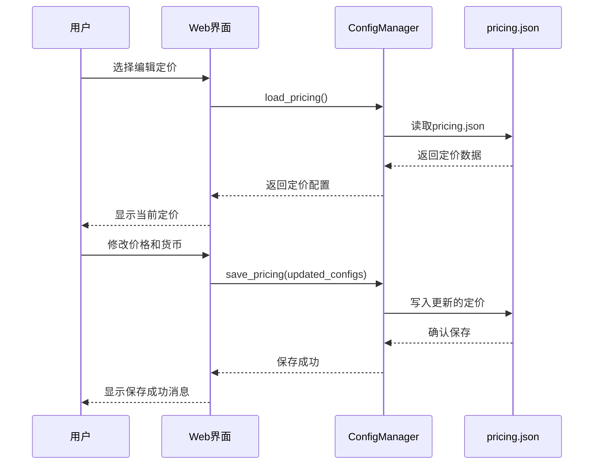
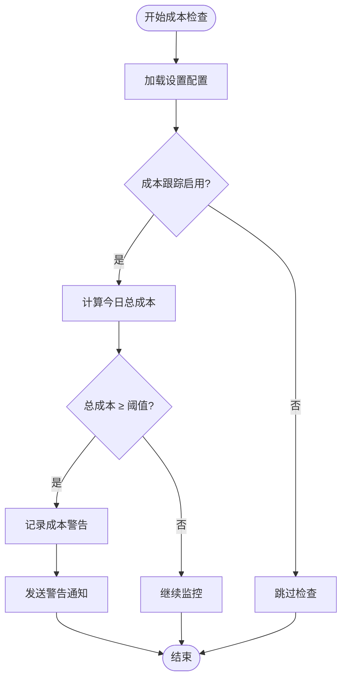
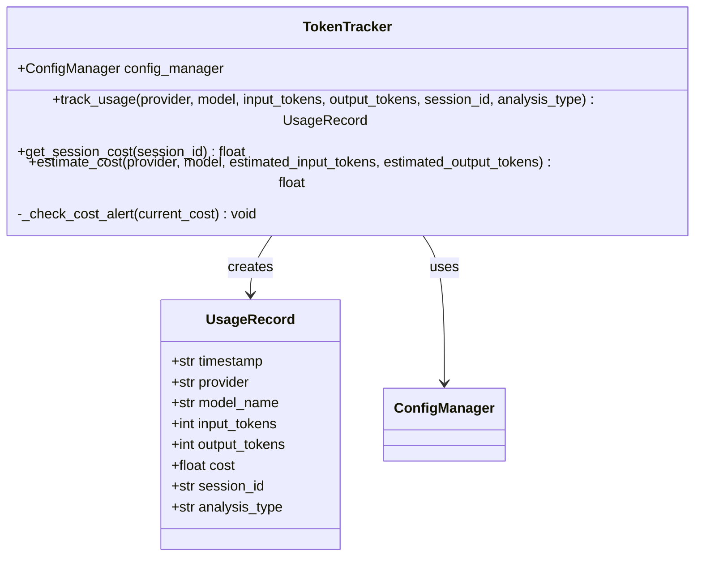
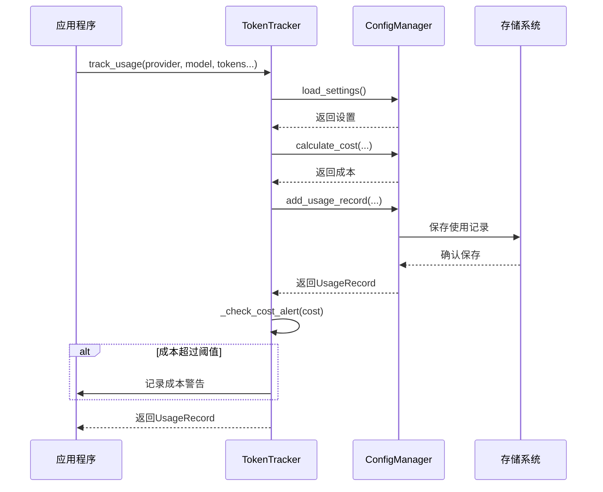
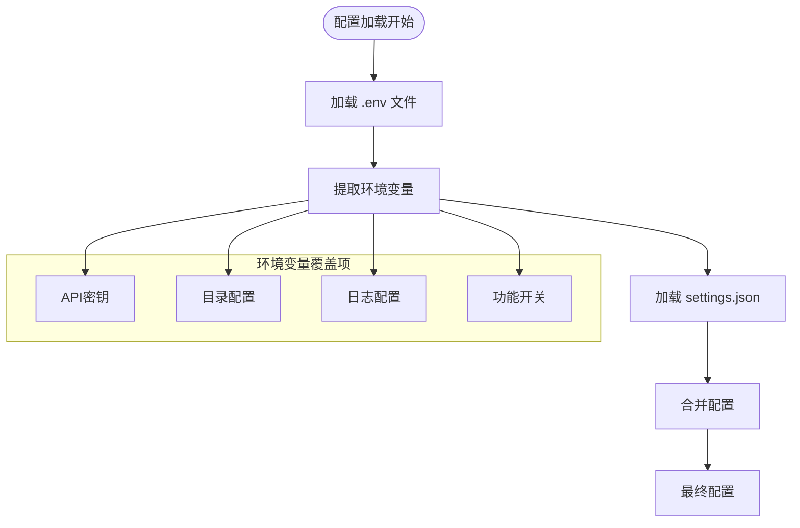
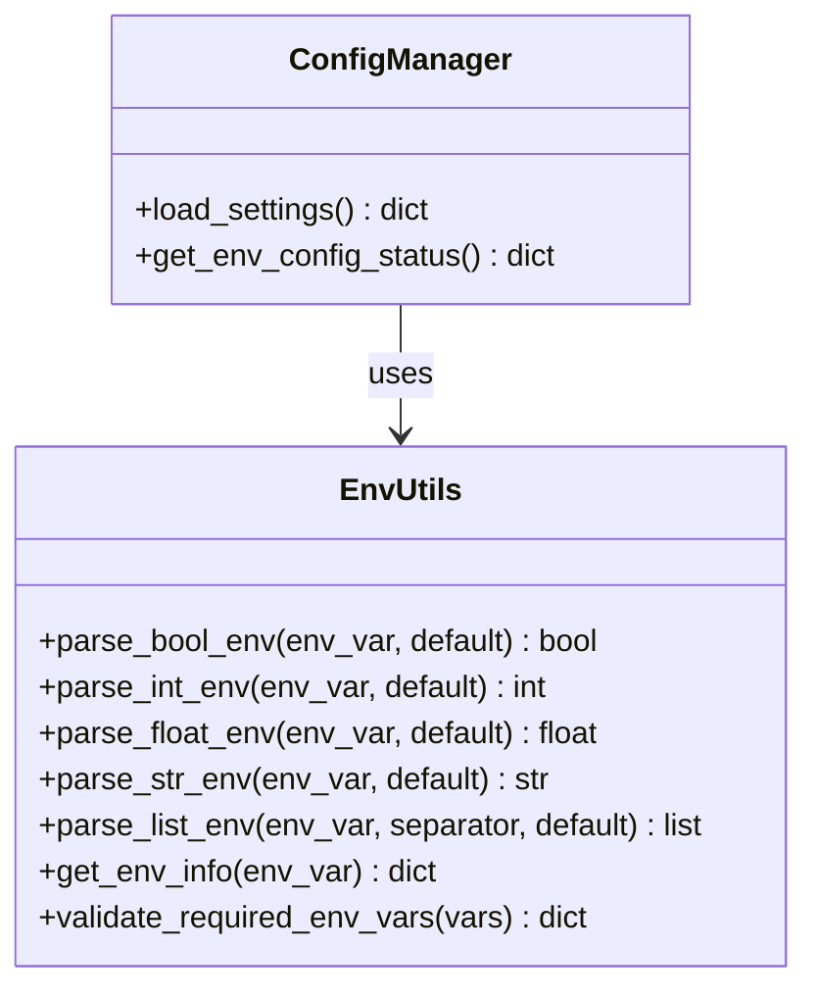

# 成本配置管理

<cite>
**本文档中引用的文件**
- [tradingagents/config/config_manager.py](file://tradingagents/config/config_manager.py)
- [web/modules/config_management.py](file://web/modules/config_management.py)
- [examples/config_management_demo.py](file://examples/config_management_demo.py)
- [examples/token_tracking_demo.py](file://examples/token_tracking_demo.py)
- [tests/test_config_management.py](file://tests/test_config_management.py)
- [tradingagents/utils/logging_manager.py](file://tradingagents/utils/logging_manager.py)
- [tradingagents/config/env_utils.py](file://tradingagents/config/env_utils.py)
- [config/logging.toml](file://config/logging.toml)
</cite>

## 目录
1. [简介](#简介)
2. [系统架构概览](#系统架构概览)
3. [ConfigManager核心组件](#configmanager核心组件)
4. [定价配置管理](#定价配置管理)
5. [设置配置管理](#设置配置管理)
6. [成本跟踪机制](#成本跟踪机制)
7. [环境变量优先级](#环境变量优先级)
8. [操作指南](#操作指南)
9. [故障排除](#故障排除)
10. [最佳实践](#最佳实践)

## 简介

TradingAgents-CN的成本配置管理系统是一个全面的解决方案，用于管理LLM提供商的费率配置、成本跟踪和预算控制。该系统通过ConfigManager类提供统一的配置管理接口，支持实时修改定价配置，并具备智能的成本预警机制。

### 核心功能特性

- **动态定价配置**：支持运行时修改各LLM提供商的费率设置
- **多货币支持**：内置CNY、USD、EUR等多种货币单位
- **智能成本跟踪**：自动记录Token使用量和计算成本
- **成本预警机制**：基于阈值的成本警告系统
- **环境变量集成**：灵活的环境变量配置优先级
- **Web界面管理**：直观的图形化配置管理界面

## 系统架构概览



**图表来源**
- [tradingagents/config/config_manager.py](file://tradingagents/config/config_manager.py#L1-L50)
- [web/modules/config_management.py](file://web/modules/config_management.py#L1-L30)

## ConfigManager核心组件

ConfigManager是整个成本配置管理系统的核心组件，负责协调各种配置文件的加载、保存和管理。

### 类结构设计



**图表来源**
- [tradingagents/config/config_manager.py](file://tradingagents/config/config_manager.py#L25-L85)

### 初始化流程

ConfigManager在初始化时会执行以下关键步骤：

1. **目录初始化**：创建配置目录结构
2. **文件检查**：检查配置文件是否存在
3. **默认配置**：为缺失的配置文件创建默认内容
4. **环境变量加载**：从.env文件加载环境变量
5. **MongoDB连接**：尝试建立MongoDB存储连接

**章节来源**
- [tradingagents/config/config_manager.py](file://tradingagents/config/config_manager.py#L60-L120)

## 定价配置管理

### pricing.json文件结构

pricing.json文件存储了所有LLM提供商的费率配置，采用标准化的数据结构：

| 字段 | 类型 | 描述 | 示例值 |
|------|------|------|--------|
| provider | string | 供应商名称 | "dashscope", "openai", "deepseek" |
| model_name | string | 模型名称 | "qwen-turbo", "gpt-4", "deepseek-chat" |
| input_price_per_1k | float | 每1000个输入token的价格 | 0.002, 0.03, 0.0014 |
| output_price_per_1k | float | 每1000个输出token的价格 | 0.006, 0.06, 0.0028 |
| currency | string | 货币单位 | "CNY", "USD", "EUR" |

### 默认定价配置

系统预配置了主流LLM提供商的费率：

#### 阿里百炼（DashScope）定价
- **qwen-turbo**: 输入¥0.002/1K, 输出¥0.006/1K (CNY)
- **qwen-plus-latest**: 输入¥0.004/1K, 输出¥0.012/1K (CNY)
- **qwen-max**: 输入¥0.02/1K, 输出¥0.06/1K (CNY)

#### DeepSeek定价
- **deepseek-chat**: 输入¥0.0014/1K, 输出¥0.0028/1K (CNY)
- **deepseek-coder**: 输入¥0.0014/1K, 输出¥0.0028/1K (CNY)

#### OpenAI定价
- **gpt-3.5-turbo**: 输入$0.0015/1K, 输出$0.002/1K (USD)
- **gpt-4**: 输入$0.03/1K, 输出$0.06/1K (USD)
- **gpt-4-turbo**: 输入$0.01/1K, 输出$0.03/1K (USD)

#### Google Gemini定价
- **gemini-2.5-pro**: 输入$0.00025/1K, 输出$0.0005/1K (USD)
- **gemini-pro**: 输入$0.00025/1K, 输出$0.0005/1K (USD)

### 动态定价修改

系统支持通过多种方式修改定价配置：

#### 通过Web界面修改


**图表来源**
- [web/modules/config_management.py](file://web/modules/config_management.py#L179-L248)

#### 通过命令行修改
```python
# 加载当前定价配置
pricing_configs = config_manager.load_pricing()

# 查找并更新DeepSeek定价
for pricing in pricing_configs:
    if pricing.provider == "deepseek" and pricing.model_name == "deepseek-chat":
        pricing.input_price_per_1k = 0.0015  # 更新输入价格
        pricing.output_price_per_1k = 0.0030  # 更新输出价格
        break

# 保存更新的配置
config_manager.save_pricing(pricing_configs)
```

**章节来源**
- [web/modules/config_management.py](file://web/modules/config_management.py#L216-L248)
- [examples/config_management_demo.py](file://examples/config_management_demo.py#L203-L218)

### 成本计算算法

系统使用标准化的成本计算公式：

```
总成本 = (输入Token数 ÷ 1000) × 输入单价 + (输出Token数 ÷ 1000) × 输出单价
```

该算法支持不同货币单位的混合计算，并在找不到匹配配置时返回0成本。

**章节来源**
- [tradingagents/config/config_manager.py](file://tradingagents/config/config_manager.py#L380-L400)

## 设置配置管理

### settings.json配置项

settings.json文件包含了系统运行的各种设置参数：

| 配置项 | 类型 | 默认值 | 描述 |
|--------|------|--------|------|
| default_provider | string | "dashscope" | 默认使用的LLM提供商 |
| default_model | string | "qwen-turbo" | 默认使用的模型 |
| enable_cost_tracking | boolean | true | 是否启用成本跟踪 |
| cost_alert_threshold | float | 100.0 | 成本警告阈值（人民币） |
| currency_preference | string | "CNY" | 货币偏好设置 |
| auto_save_usage | boolean | true | 是否自动保存使用记录 |
| max_usage_records | integer | 10000 | 最大使用记录数量 |
| data_dir | string | "~/.tradingagents/data" | 数据目录路径 |
| cache_dir | string | "~/.tradingagents/cache" | 缓存目录路径 |
| results_dir | string | "~/.tradingagents/results" | 结果目录路径 |

### 成本跟踪控制

#### enable_cost_tracking设置
- **true**：启用完整的成本跟踪功能
- **false**：禁用成本跟踪，提高性能但无法监控成本

#### cost_alert_threshold设置
系统会在每日成本达到阈值时触发警告：



**图表来源**
- [tradingagents/config/config_manager.py](file://tradingagents/config/config_manager.py#L680-L700)

### currency_preference配置

currency_preference设置决定了成本显示的货币偏好：

- **"CNY"**：显示人民币成本（¥）
- **"USD"**：显示美元成本（$）
- **"EUR"**：显示欧元成本（€）

系统会根据此设置自动格式化成本显示，无需手动转换。

**章节来源**
- [tradingagents/config/config_manager.py](file://tradingagents/config/config_manager.py#L255-L275)

## 成本跟踪机制

### TokenTracker组件

TokenTracker是专门负责Token使用跟踪的组件，提供细粒度的成本监控：



**图表来源**
- [tradingagents/config/config_manager.py](file://tradingagents/config/config_manager.py#L650-L680)

### 使用记录流程



**图表来源**
- [tradingagents/config/config_manager.py](file://tradingagents/config/config_manager.py#L650-L680)

### 使用统计功能

系统提供丰富的使用统计功能：

#### 统计维度
- **时间范围**：支持7天、30天、90天、365天统计
- **按供应商统计**：分供应商汇总成本和使用情况
- **Token统计**：输入Token和输出Token的总量
- **请求统计**：总请求数和平均成本

#### 统计数据结构
```json
{
    "period_days": 30,
    "total_cost": 125.75,
    "total_input_tokens": 150000,
    "total_output_tokens": 75000,
    "total_requests": 150,
    "provider_stats": {
        "dashscope": {
            "cost": 85.25,
            "input_tokens": 100000,
            "output_tokens": 50000,
            "requests": 100
        },
        "openai": {
            "cost": 40.50,
            "input_tokens": 50000,
            "output_tokens": 25000,
            "requests": 50
        }
    }
}
```

**章节来源**
- [tradingagents/config/config_manager.py](file://tradingagents/config/config_manager.py#L550-L620)

## 环境变量优先级

### 配置优先级顺序

系统采用以下优先级顺序加载配置：



**图表来源**
- [tradingagents/config/config_manager.py](file://tradingagents/config/config_manager.py#L450-L500)

### 关键环境变量

#### API密钥环境变量
- **DASHSCOPE_API_KEY**：阿里百炼API密钥
- **OPENAI_API_KEY**：OpenAI API密钥
- **GOOGLE_API_KEY**：Google API密钥
- **ANTHROPIC_API_KEY**：Anthropic API密钥
- **DEEPSEEK_API_KEY**：DeepSeek API密钥

#### 目录配置环境变量
- **TRADINGAGENTS_DATA_DIR**：数据目录路径
- **TRADINGAGENTS_CACHE_DIR**：缓存目录路径
- **TRADINGAGENTS_RESULTS_DIR**：结果目录路径

#### 功能配置环境变量
- **TRADINGAGENTS_LOG_LEVEL**：日志级别
- **TRADINGAGENTS_LOG_DIR**：日志目录
- **OPENAI_ENABLED**：OpenAI功能启用状态

### 环境变量处理工具

系统提供了强大的环境变量处理工具：



**图表来源**
- [tradingagents/config/env_utils.py](file://tradingagents/config/env_utils.py#L1-L50)

**章节来源**
- [tradingagents/config/config_manager.py](file://tradingagents/config/config_manager.py#L450-L520)
- [tradingagents/config/env_utils.py](file://tradingagents/config/env_utils.py#L1-L245)

## 操作指南

### 更新DeepSeek定价配置

#### 步骤1：访问配置管理界面
```bash
# 启动Web管理界面
python -m streamlit run web/app.py
```

#### 步骤2：导航到定价配置页面
1. 打开浏览器访问 `http://localhost:8501`
2. 在侧边栏选择"定价设置"
3. 查看当前定价配置

#### 步骤3：修改DeepSeek定价
1. 在定价列表中找到"deepseek/deepseek-chat"
2. 修改输入价格为¥0.0015/1K
3. 修改输出价格为¥0.0030/1K
4. 点击"保存定价"按钮

#### 步骤4：验证配置更新
```python
# 使用Python脚本验证
from tradingagents.config.config_manager import config_manager

# 重新加载定价配置
pricing_configs = config_manager.load_pricing()

# 查找DeepSeek配置
deepseek_config = next(
    (p for p in pricing_configs if p.provider == "deepseek" and p.model_name == "deepseek-chat"), 
    None
)

if deepseek_config:
    print(f"DeepSeek定价更新成功:")
    print(f"输入价格: ¥{deepseek_config.input_price_per_1k:.4f}/1K")
    print(f"输出价格: ¥{deepseek_config.output_price_per_1k:.4f}/1K")
else:
    print("未找到DeepSeek配置，请检查配置文件")
```

### 更新DashScope定价配置

#### 方法1：通过Web界面
1. 在定价配置页面选择"dashscope/qwen-plus-latest"
2. 修改输入价格为¥0.0045/1K
3. 修改输出价格为¥0.0135/1K
4. 保存更改

#### 方法2：通过命令行
```python
# 命令行更新DashScope定价
from tradingagents.config.config_manager import config_manager

# 加载现有配置
pricing_configs = config_manager.load_pricing()

# 更新DashScope定价
for pricing in pricing_configs:
    if pricing.provider == "dashscope" and pricing.model_name == "qwen-plus-latest":
        pricing.input_price_per_1k = 0.0045
        pricing.output_price_per_1k = 0.0135
        break

# 保存更新
config_manager.save_pricing(pricing_configs)
print("DashScope定价更新完成")
```

### 配置成本警告阈值

#### 设置新的警告阈值
```python
# 设置新的成本警告阈值为¥200
from tradingagents.config.config_manager import config_manager

# 加载当前设置
settings = config_manager.load_settings()

# 更新警告阈值
settings["cost_alert_threshold"] = 200.0

# 保存设置
config_manager.save_settings(settings)
print(f"成本警告阈值已更新为¥{settings['cost_alert_threshold']}")
```

#### 通过Web界面设置
1. 导航到"系统设置"页面
2. 找到"成本警告阈值"设置
3. 输入新的阈值金额
4. 点击"保存设置"

### 配置货币偏好

#### 设置为美元显示
```python
# 设置货币偏好为USD
from tradingagents.config.config_manager import config_manager

# 加载设置
settings = config_manager.load_settings()

# 设置货币偏好
settings["currency_preference"] = "USD"

# 保存设置
config_manager.save_settings(settings)
print("货币偏好已设置为美元显示")
```

#### 验证货币显示
```python
# 验证成本计算显示
from tradingagents.config.config_manager import config_manager

# 计算示例成本
cost = config_manager.calculate_cost("dashscope", "qwen-turbo", 1000, 500)
print(f"成本显示: ${cost:.4f}")  # 应显示美元格式
```

**章节来源**
- [examples/config_management_demo.py](file://examples/config_management_demo.py#L203-L257)
- [web/modules/config_management.py](file://web/modules/config_management.py#L427-L442)

## 故障排除

### 常见问题及解决方案

#### 1. 定价配置不生效

**症状**：修改定价后成本计算仍使用旧价格

**解决方案**：
```python
# 1. 检查配置文件路径
from tradingagents.config.config_manager import config_manager
print(f"定价文件路径: {config_manager.pricing_file}")

# 2. 验证配置文件内容
import json
with open(config_manager.pricing_file, 'r', encoding='utf-8') as f:
    data = json.load(f)
    print(f"配置文件包含 {len(data)} 条定价记录")

# 3. 检查具体配置项
for item in data:
    if item['provider'] == 'deepseek' and item['model_name'] == 'deepseek-chat':
        print(f"DeepSeek配置: 输入={item['input_price_per_1k']}, 输出={item['output_price_per_1k']}")
```

#### 2. 成本跟踪功能异常

**症状**：使用记录不保存或统计不准确

**解决方案**：
```python
# 1. 检查成本跟踪设置
from tradingagents.config.config_manager import config_manager

settings = config_manager.load_settings()
print(f"成本跟踪启用: {settings.get('enable_cost_tracking', True)}")

# 2. 检查MongoDB连接状态
if config_manager.mongodb_storage:
    print(f"MongoDB连接: {'成功' if config_manager.mongodb_storage.is_connected() else '失败'}")
else:
    print("MongoDB存储不可用，使用文件存储")

# 3. 手动添加测试记录
from tradingagents.config.config_manager import token_tracker

record = token_tracker.track_usage(
    provider="dashscope",
    model_name="qwen-turbo",
    input_tokens=1000,
    output_tokens=500,
    session_id="test_session"
)

if record:
    print(f"测试记录添加成功: 成本={record.cost}")
else:
    print("测试记录添加失败")
```

#### 3. 环境变量配置冲突

**症状**：Web界面显示的配置与.env文件不一致

**解决方案**：
```python
# 检查环境变量状态
from tradingagents.config.config_manager import config_manager

env_status = config_manager.get_env_config_status()
print("环境变量配置状态:")
for key, value in env_status.items():
    print(f"  {key}: {value}")

# 验证API密钥来源
api_keys = env_status.get('api_keys', {})
for provider, has_key in api_keys.items():
    print(f"  {provider}: {'已配置' if has_key else '未配置'}")
```

#### 4. Web界面无法访问

**症状**：启动Web界面后无法打开管理页面

**解决方案**：
```bash
# 1. 检查端口占用
netstat -an | grep 8501

# 2. 检查依赖安装
pip list | grep streamlit

# 3. 重新安装依赖
pip install -r requirements.txt

# 4. 使用调试模式启动
streamlit run web/app.py --server.port=8502 --server.address=localhost
```

### 性能优化建议

#### 1. 大规模使用统计优化
```python
# 对于大量使用记录，建议使用MongoDB存储
from tradingagents.config.config_manager import config_manager

# 检查MongoDB配置
if config_manager.mongodb_storage and config_manager.mongodb_storage.is_connected():
    print("MongoDB存储已启用，适合大规模使用")
    # MongoDB查询更高效
    stats = config_manager.mongodb_storage.get_usage_statistics(30)
else:
    print("使用文件存储，建议配置MongoDB以提高性能")
    # 文件存储查询较慢
    stats = config_manager.get_usage_statistics(30)
```

#### 2. 成本跟踪性能优化
```python
# 临时禁用成本跟踪以提高性能
from tradingagents.config.config_manager import config_manager

# 加载设置
settings = config_manager.load_settings()
settings["enable_cost_tracking"] = False
config_manager.save_settings(settings)

print("成本跟踪已禁用，性能已提升")
```

**章节来源**
- [tests/test_config_management.py](file://tests/test_config_management.py#L1-L100)
- [tradingagents/config/config_manager.py](file://tradingagents/config/config_manager.py#L550-L620)

## 最佳实践

### 1. 定价配置管理

#### 定期更新定价
```python
# 创建定期更新脚本
import schedule
import time
from tradingagents.config.config_manager import config_manager

def update_pricing():
    """定期更新LLM提供商定价"""
    print("开始更新定价配置...")
    
    # 加载当前配置
    pricing_configs = config_manager.load_pricing()
    
    # 更新DeepSeek定价（示例）
    for pricing in pricing_configs:
        if pricing.provider == "deepseek":
            # 根据最新市场行情调整价格
            pricing.input_price_per_1k *= 1.05  # 上调5%
            pricing.output_price_per_1k *= 1.05
    
    # 保存更新
    config_manager.save_pricing(pricing_configs)
    print("定价配置更新完成")

# 安排每日更新
schedule.every().day.at("00:00").do(update_pricing)

# 运行调度器
while True:
    schedule.run_pending()
    time.sleep(60)
```

#### 版本控制配置变更
```bash
# 创建配置版本控制脚本
#!/bin/bash
CONFIG_DIR="config"
BACKUP_DIR="config_backups"

# 创建备份
TIMESTAMP=$(date +%Y%m%d_%H%M%S)
mkdir -p "$BACKUP_DIR/$TIMESTAMP"

# 备份配置文件
cp "$CONFIG_DIR/pricing.json" "$BACKUP_DIR/$TIMESTAMP/"
cp "$CONFIG_DIR/settings.json" "$BACKUP_DIR/$TIMESTAMP/"

echo "配置备份完成: $BACKUP_DIR/$TIMESTAMP"
```

### 2. 成本监控策略

#### 设置多级成本警告
```python
# 实现分级成本警告
from tradingagents.config.config_manager import config_manager

def check_multi_level_costs():
    """检查多级成本阈值"""
    settings = config_manager.load_settings()
    threshold = settings.get('cost_alert_threshold', 100.0)
    
    # 获取今日统计
    today_stats = config_manager.get_usage_statistics(1)
    total_cost = today_stats['total_cost']
    
    # 多级警告
    if total_cost >= threshold * 0.8:
        print(f"⚠️ 中等成本警告: ¥{total_cost:.2f}")
    elif total_cost >= threshold:
        print(f"🚨 高成本警告: ¥{total_cost:.2f}")
        # 发送通知
        send_cost_alert(total_cost, threshold)

def send_cost_alert(current_cost, threshold):
    """发送成本警告通知"""
    message = f"成本超出阈值! 当前成本: ¥{current_cost:.2f}, 阈值: ¥{threshold:.2f}"
    # 实现通知逻辑（邮件、短信等）
    print(message)
```

#### 成本分析报告
```python
# 生成成本分析报告
def generate_cost_report():
    """生成详细的成本分析报告"""
    stats = config_manager.get_usage_statistics(30)
    
    report = {
        "总成本": f"¥{stats['total_cost']:.2f}",
        "总请求数": stats['total_requests'],
        "平均成本": f"¥{stats['total_cost']/stats['total_requests']:.4f}",
        "Token效率": {
            "输入Token": stats['total_input_tokens'],
            "输出Token": stats['total_output_tokens'],
            "Token/成本": f"{(stats['total_input_tokens'] + stats['total_output_tokens'])/stats['total_cost']:.2f}"
        },
        "供应商分布": {}
    }
    
    # 供应商成本分布
    for provider, data in stats['provider_stats'].items():
        report["供应商分布"][provider] = {
            "成本": f"¥{data['cost']:.2f}",
            "请求数": data['requests'],
            "占比": f"{data['cost']/stats['total_cost']*100:.1f}%"
        }
    
    return report
```

### 3. 环境变量管理

#### 安全的环境变量配置
```python
# 创建安全的环境变量管理脚本
import os
from tradingagents.config.env_utils import parse_bool_env, parse_float_env

def secure_load_env():
    """安全加载环境变量"""
    # 验证必需的API密钥
    required_keys = ['DASHSCOPE_API_KEY', 'OPENAI_API_KEY']
    missing_keys = []
    
    for key in required_keys:
        value = os.getenv(key)
        if not value:
            missing_keys.append(key)
    
    if missing_keys:
        raise ValueError(f"缺少必需的环境变量: {missing_keys}")
    
    # 安全解析配置
    settings = {
        'enable_cost_tracking': parse_bool_env('ENABLE_COST_TRACKING', True),
        'cost_alert_threshold': parse_float_env('COST_ALERT_THRESHOLD', 100.0),
        'log_level': os.getenv('TRADINGAGENTS_LOG_LEVEL', 'INFO')
    }
    
    return settings
```

#### 环境变量验证
```python
# 环境变量验证脚本
def validate_environment():
    """验证环境变量配置"""
    import os
    
    validation_results = {
        'api_keys': {},
        'directories': {},
        'features': {}
    }
    
    # 验证API密钥
    api_keys = ['DASHSCOPE_API_KEY', 'OPENAI_API_KEY', 'GOOGLE_API_KEY']
    for key in api_keys:
        value = os.getenv(key)
        validation_results['api_keys'][key] = {
            'present': bool(value),
            'length': len(value) if value else 0,
            'secure': not value or len(value) > 10  # 至少10位长度
        }
    
    # 验证目录
    directories = ['TRADINGAGENTS_DATA_DIR', 'TRADINGAGENTS_CACHE_DIR']
    for dir_name in directories:
        path = os.getenv(dir_name)
        validation_results['directories'][dir_name] = {
            'exists': os.path.exists(path) if path else False,
            'writable': os.access(path, os.W_OK) if path else False
        }
    
    return validation_results
```

### 4. 监控和维护

#### 自动化监控脚本
```python
# 成本监控自动化脚本
import smtplib
from email.mime.text import MIMEText
from tradingagents.config.config_manager import config_manager

def monitor_costs():
    """自动化成本监控"""
    try:
        # 获取配置和统计
        settings = config_manager.load_settings()
        stats = config_manager.get_usage_statistics(1)
        
        # 检查成本是否超限
        if stats['total_cost'] >= settings.get('cost_alert_threshold', 100.0):
            # 发送邮件通知
            send_email_notification(stats)
        
        # 记录监控日志
        log_monitoring_event(stats)
        
    except Exception as e:
        log_error(f"成本监控失败: {e}")

def send_email_notification(stats):
    """发送成本超限邮件"""
    subject = "TradingAgents成本超限警告"
    body = f"""
    成本超限警告
    
    当前成本: ¥{stats['total_cost']:.2f}
    请求次数: {stats['total_requests']}
    超过阈值: ¥{stats['total_cost'] - settings.get('cost_alert_threshold', 100.0):.2f}
    
    请及时检查!
    """
    
    msg = MIMEText(body)
    msg['Subject'] = subject
    msg['From'] = "monitor@example.com"
    msg['To'] = "admin@example.com"
    
    # 发送邮件（需要配置SMTP服务器）
    # server = smtplib.SMTP('smtp.example.com')
    # server.send_message(msg)
    # server.quit()

def log_monitoring_event(stats):
    """记录监控事件"""
    from datetime import datetime
    
    event = {
        'timestamp': datetime.now().isoformat(),
        'total_cost': stats['total_cost'],
        'total_requests': stats['total_requests'],
        'status': 'normal' if stats['total_cost'] < settings.get('cost_alert_threshold', 100.0) else 'alert'
    }
    
    # 记录到日志文件
    with open('cost_monitoring.log', 'a') as f:
        f.write(f"{event}\n")
```

这些最佳实践可以帮助您更好地管理和优化TradingAgents-CN的成本配置系统，确保系统的稳定运行和成本的有效控制。