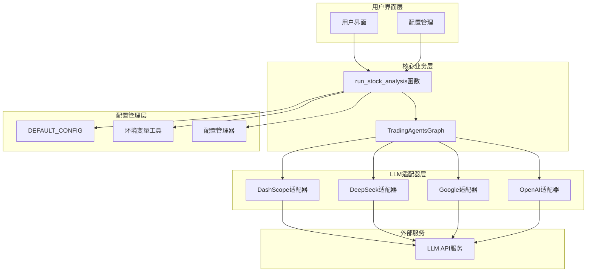
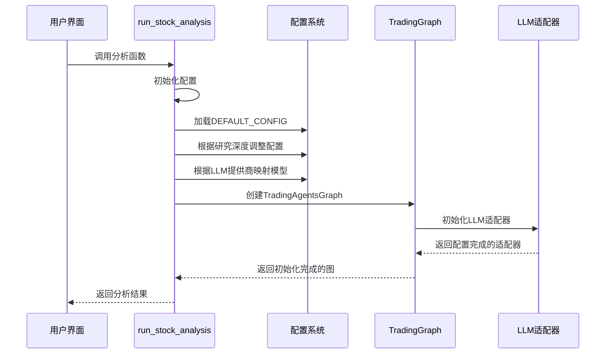
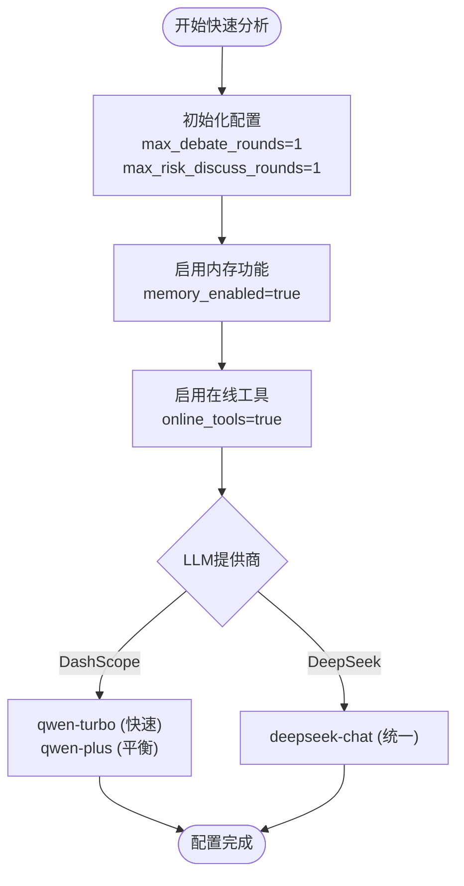
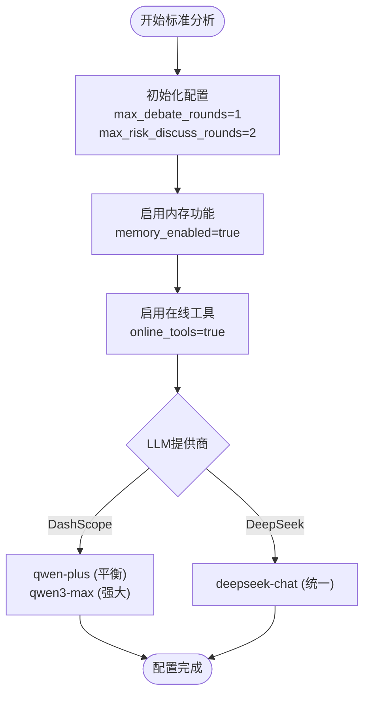
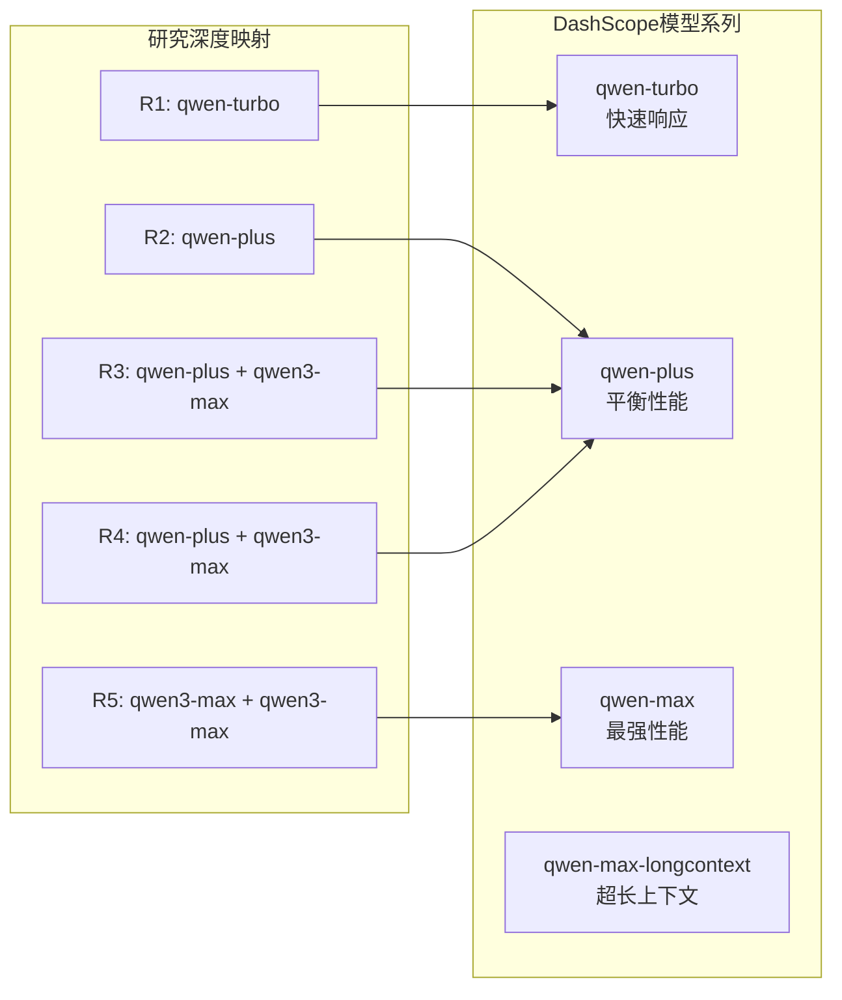
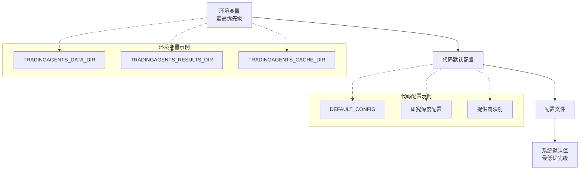
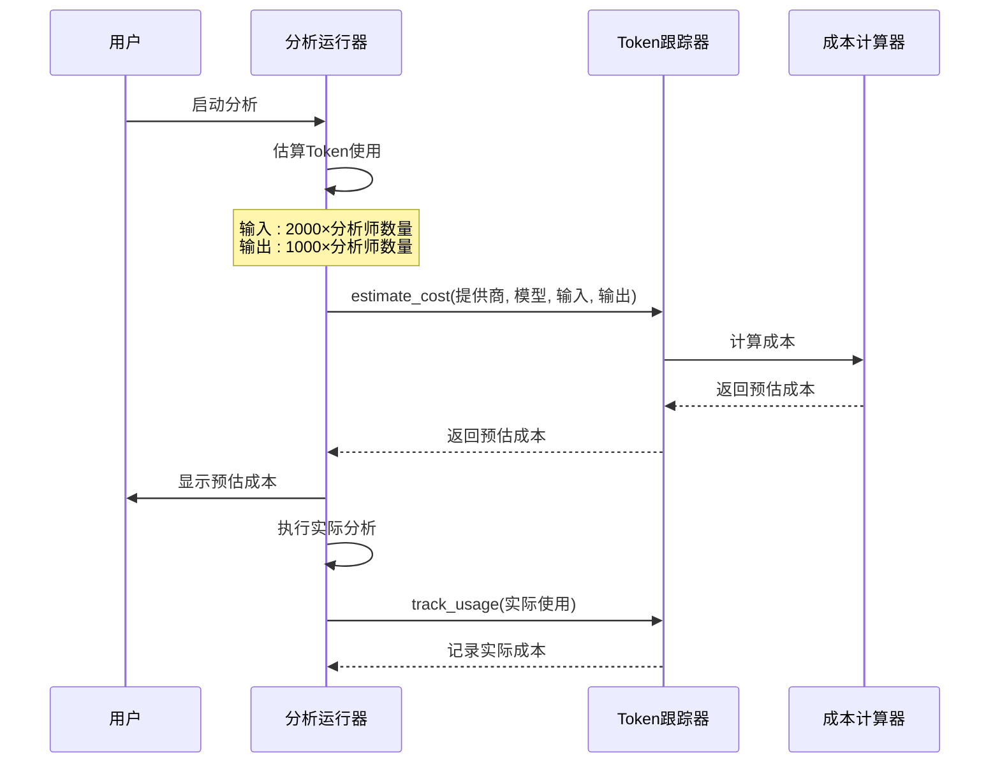
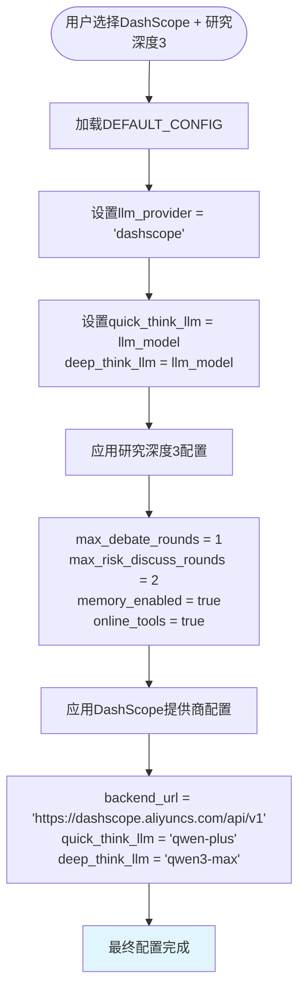

# 模型选择策略

<cite>
**本文档中引用的文件**
- [web/utils/analysis_runner.py](file://web/utils/analysis_runner.py)
- [tradingagents/default_config.py](file://tradingagents/default_config.py)
- [tradingagents/llm_adapters/dashscope_adapter.py](file://tradingagents/llm_adapters/dashscope_adapter.py)
- [tradingagents/llm_adapters/deepseek_adapter.py](file://tradingagents/llm_adapters/deepseek_adapter.py)
- [web/components/sidebar.py](file://web/components/sidebar.py)
- [tradingagents/config/env_utils.py](file://tradingagents/config/env_utils.py)
- [web/modules/config_management.py](file://web/modules/config_management.py)
- [examples/config_management_demo.py](file://examples/config_management_demo.py)
- [tradingagents/dataflows/config.py](file://tradingagents/dataflows/config.py)
</cite>

## 目录
1. [概述](#概述)
2. [系统架构](#系统架构)
3. [run_stock_analysis函数详解](#run_stock_analysis函数详解)
4. [研究深度配置策略](#研究深度配置策略)
5. [LLM提供商映射逻辑](#llm提供商映射逻辑)
6. [配置优先级机制](#配置优先级机制)
7. [成本与性能平衡](#成本与性能平衡)
8. [完整配置流程示例](#完整配置流程示例)
9. [最佳实践建议](#最佳实践建议)

## 概述

TradingAgents-CN系统采用动态模型选择策略，根据用户指定的研究深度（1-5级）和LLM提供商自动配置最优的quick_think_llm和deep_think_llm组合。该策略在保证分析质量的同时，最大化成本效益，为用户提供灵活且高效的股票分析体验。

## 系统架构

**图表来源**
- [web/utils/analysis_runner.py](file://web/utils/analysis_runner.py#L99-L611)
- [tradingagents/default_config.py](file://tradingagents/default_config.py#L2-L26)

## run_stock_analysis函数详解

`run_stock_analysis`函数是系统的核心入口，负责协调整个股票分析流程并动态配置LLM模型。

### 函数签名与参数

**图表来源**
- [web/utils/analysis_runner.py](file://web/utils/analysis_runner.py#L99-L200)

### 配置初始化流程

函数首先从`DEFAULT_CONFIG`开始，然后根据用户输入动态调整配置：

**节来源**
- [web/utils/analysis_runner.py](file://web/utils/analysis_runner.py#L180-L190)
- [tradingagents/default_config.py](file://tradingagents/default_config.py#L2-L26)

## 研究深度配置策略

系统支持5个研究深度级别，每个级别都有特定的配置策略：

### 研究深度等级表

| 研究深度 | 配置特点 | debate_rounds | risk_discuss_rounds | memory_enabled | online_tools |
|---------|---------|---------------|-------------------|----------------|--------------|
| 1级 - 快速分析 | 最快速响应 | 1 | 1 | 是 | 是 |
| 2级 - 基础分析 | 平衡性能 | 1 | 1 | 是 | 是 |
| 3级 - 标准分析 | 默认配置 | 1 | 2 | 是 | 是 |
| 4级 - 深度分析 | 更深入分析 | 2 | 2 | 是 | 是 |
| 5级 - 全面分析 | 最全面分析 | 3 | 3 | 是 | 是 |

### 快速分析（研究深度1）

**图表来源**
- [web/utils/analysis_runner.py](file://web/utils/analysis_runner.py#L180-L200)

### 标准分析（研究深度3）

**图表来源**
- [web/utils/analysis_runner.py](file://web/utils/analysis_runner.py#L220-L240)

**节来源**
- [web/utils/analysis_runner.py](file://web/utils/analysis_runner.py#L180-L260)

## LLM提供商映射逻辑

系统支持多个LLM提供商，每个提供商都有特定的模型映射策略：

### DashScope提供商映射

**图表来源**
- [web/utils/analysis_runner.py](file://web/utils/analysis_runner.py#L304-L320)
- [tradingagents/llm_adapters/dashscope_adapter.py](file://tradingagents/llm_adapters/dashscope_adapter.py#L240-L293)

### DeepSeek提供商映射

DeepSeek提供商相对简单，所有深度都使用相同的模型：

| 研究深度 | quick_think_llm | deep_think_llm |
|---------|----------------|----------------|
| 1-5级 | deepseek-chat | deepseek-chat |

### Google AI提供商映射

Google AI提供了丰富的模型选择，系统根据研究深度优化模型选择：

| 研究深度 | 快速模型 | 深度模型 | 性能特点 |
|---------|---------|---------|---------|
| 1级 | gemini-2.5-flash-lite-preview-06-17 (1.45s) | gemini-2.0-flash (1.87s) | 超快速响应 |
| 2级 | gemini-2.0-flash (1.87s) | gemini-1.5-pro (2.25s) | 平衡性能 |
| 3级 | gemini-1.5-pro (2.25s) | gemini-2.5-flash (2.73s) | 性能均衡 |
| 4级 | gemini-2.5-flash (2.73s) | gemini-2.5-pro (16.68s) | 强大性能 |
| 5级 | gemini-2.5-pro (16.68s) | gemini-2.5-pro (16.68s) | 最强性能 |

**节来源**
- [web/utils/analysis_runner.py](file://web/utils/analysis_runner.py#L320-L380)

## 配置优先级机制

系统采用多层次的配置优先级机制，确保灵活性和可控性：

### 配置优先级层次

**图表来源**
- [tradingagents/config/env_utils.py](file://tradingagents/config/env_utils.py#L10-L50)
- [tradingagents/dataflows/config.py](file://tradingagents/dataflows/config.py#L10-L44)

### 环境变量配置示例

系统支持以下关键环境变量：

| 环境变量 | 描述 | 优先级 |
|---------|------|--------|
| `TRADINGAGENTS_DATA_DIR` | 数据目录路径 | 最高 |
| `TRADINGAGENTS_RESULTS_DIR` | 结果目录路径 | 最高 |
| `TRADINGAGENTS_CACHE_DIR` | 缓存目录路径 | 最高 |
| `DASHSCOPE_API_KEY` | DashScope API密钥 | 高 |
| `FINNHUB_API_KEY` | Finnhub API密钥 | 高 |

**节来源**
- [tradingagents/config/env_utils.py](file://tradingagents/config/env_utils.py#L10-L100)

## 成本与性能平衡

系统在成本和性能之间实现了精妙的平衡，通过智能模型选择实现最优性价比：

### 成本估算机制

**图表来源**
- [web/utils/analysis_runner.py](file://web/utils/analysis_runner.py#L160-L170)

### 成本对比分析

不同提供商和模型的成本特性：

| 提供商 | 模型 | 输入成本/1K tokens | 输出成本/1K tokens | 性价比 |
|-------|------|-------------------|------------------|--------|
| DashScope | qwen-turbo | $0.005 | $0.005 | 极高 |
| DashScope | qwen-plus | $0.01 | $0.01 | 高 |
| DashScope | qwen-max | $0.02 | $0.02 | 中等 |
| DeepSeek | deepseek-chat | $0.01 | $0.01 | 高 |
| Google | gemini-2.5-flash-lite-preview-06-17 | $0.005 | $0.015 | 极高 |
| Google | gemini-2.0-flash | $0.01 | $0.03 | 高 |
| OpenAI | gpt-4o-mini | $0.00015 | $0.0006 | 极高 |

**节来源**
- [examples/config_management_demo.py](file://examples/config_management_demo.py#L40-L70)

## 完整配置流程示例

以下是基于用户选择的完整配置流程示例：

### 示例：DashScope + 研究深度3

**图表来源**
- [web/utils/analysis_runner.py](file://web/utils/analysis_runner.py#L180-L260)

### 配置覆盖过程

系统按照以下顺序覆盖配置：

1. **基础配置**：从`DEFAULT_CONFIG`复制
2. **用户输入**：应用用户选择的LLM提供商和模型
3. **研究深度**：根据研究深度调整参数
4. **提供商特定**：应用提供商特有的配置
5. **环境变量**：应用环境变量覆盖
6. **最终验证**：验证配置完整性

**节来源**
- [web/utils/analysis_runner.py](file://web/utils/analysis_runner.py#L180-L400)

## 最佳实践建议

### 1. 研究深度选择指南

- **快速决策**：使用研究深度1，适合短期交易者
- **日常分析**：使用研究深度3，平衡成本和质量
- **重要投资**：使用研究深度5，获得最全面分析

### 2. LLM提供商选择策略

- **成本敏感**：选择DashScope或DeepSeek
- **性能优先**：选择Google AI或OpenAI
- **稳定性要求**：选择经过验证的提供商

### 3. 配置管理最佳实践

- **定期监控**：使用配置管理页面监控使用情况
- **成本控制**：设置合理的成本警告阈值
- **环境变量**：对于生产环境，推荐使用环境变量配置

### 4. 性能优化建议

- **缓存策略**：合理配置缓存目录
- **并发控制**：避免同时进行过多分析
- **资源监控**：定期检查系统资源使用情况

**节来源**
- [web/modules/config_management.py](file://web/modules/config_management.py#L50-L150)
- [examples/config_management_demo.py](file://examples/config_management_demo.py#L200-L257)