# DashScope故障处理机制

<cite>
**本文档引用的文件**
- [dashscope_adapter.py](file://tradingagents/llm_adapters/dashscope_adapter.py)
- [dashscope_openai_adapter.py](file://tradingagents/llm_adapters/dashscope_openai_adapter.py)
- [memory.py](file://tradingagents/agents/utils/memory.py)
- [config_manager.py](file://tradingagents/config/config_manager.py)
- [demo_dashscope.py](file://examples/dashscope_examples/demo_dashscope.py)
- [test_dashscope_integration.py](file://tests/integration/test_dashscope_integration.py)
- [test_dashscope_adapter_fix.py](file://tests/test_dashscope_adapter_fix.py)
- [duplicate_logger_fix_report.md](file://reports/duplicate_logger_fix_report.md)
- [check_api_config.py](file://scripts/check_api_config.py)
- [default_config.py](file://tradingagents/default_config.py)
</cite>

## 目录
1. [概述](#概述)
2. [项目结构分析](#项目结构分析)
3. [核心组件架构](#核心组件架构)
4. [异常捕获机制](#异常捕获机制)
5. [重复logger定义问题](#重复logger定义问题)
6. [API调用失败处理](#api调用失败处理)
7. [认证错误处理](#认证错误处理)
8. [网络超时处理](#网络超时处理)
9. [连接测试机制](#连接测试机制)
10. [降级策略](#降级策略)
11. [错误日志记录](#错误日志记录)
12. [配置管理](#配置管理)
13. [兼容性问题](#兼容性问题)
14. [故障转移限制](#故障转移限制)
15. [最佳实践建议](#最佳实践建议)

## 概述

DashScope适配器是TradingAgents框架中用于集成阿里百炼大模型的核心组件。该适配器实现了完善的故障处理机制，包括异常捕获、错误恢复、降级策略等功能，确保在各种异常情况下的系统稳定性。

## 项目结构分析

DashScope适配器相关的文件分布在以下关键位置：

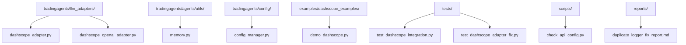

**图表来源**
- [dashscope_adapter.py](file://tradingagents/llm_adapters/dashscope_adapter.py#L1-L294)
- [dashscope_openai_adapter.py](file://tradingagents/llm_adapters/dashscope_openai_adapter.py#L1-L300)
- [memory.py](file://tradingagents/agents/utils/memory.py#L1-L713)

## 核心组件架构

### 主要适配器类

DashScope适配器包含两个主要类：

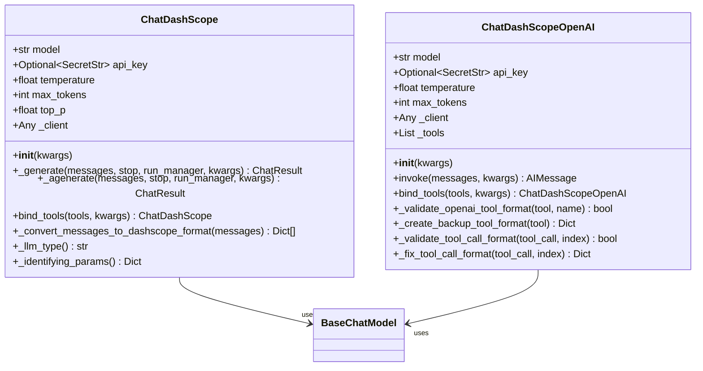

**图表来源**
- [dashscope_adapter.py](file://tradingagents/llm_adapters/dashscope_adapter.py#L25-L294)
- [dashscope_openai_adapter.py](file://tradingagents/llm_adapters/dashscope_openai_adapter.py#L15-L300)

**章节来源**
- [dashscope_adapter.py](file://tradingagents/llm_adapters/dashscope_adapter.py#L25-L100)
- [dashscope_openai_adapter.py](file://tradingagents/llm_adapters/dashscope_openai_adapter.py#L15-L80)

## 异常捕获机制

### 基础异常处理

DashScope适配器实现了多层次的异常捕获机制：

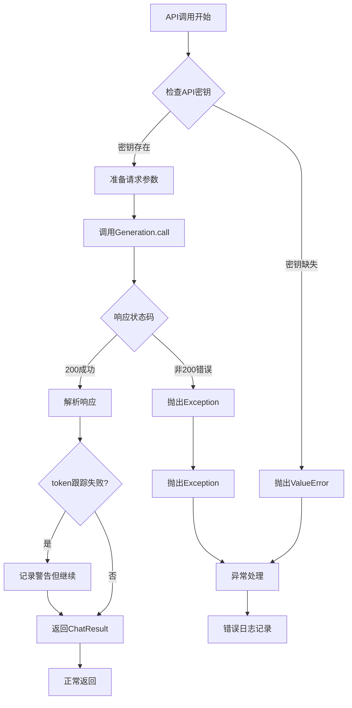

**图表来源**
- [dashscope_adapter.py](file://tradingagents/llm_adapters/dashscope_adapter.py#L40-L120)

### 工具调用异常处理

OpenAI兼容适配器实现了更精细的工具调用异常处理：

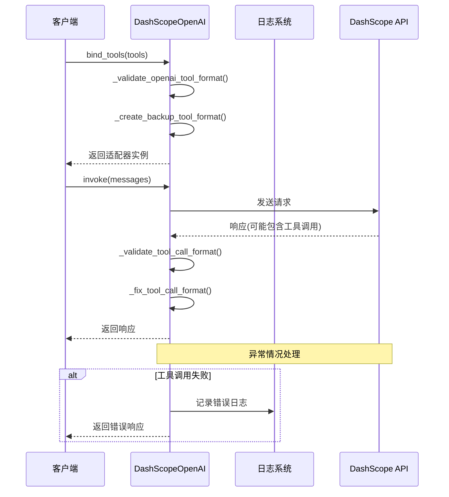

**图表来源**
- [dashscope_openai_adapter.py](file://tradingagents/llm_adapters/dashscope_openai_adapter.py#L200-L280)

**章节来源**
- [dashscope_adapter.py](file://tradingagents/llm_adapters/dashscope_adapter.py#L80-L150)
- [dashscope_openai_adapter.py](file://tradingagents/llm_adapters/dashscope_openai_adapter.py#L200-L280)

## 重复logger定义问题

### 问题描述

根据重复logger修复报告，DashScope适配器中存在多个logger实例的问题：

| 文件 | 重复logger数量 | 主要问题 |
|------|---------------|----------|
| dashscope_adapter.py | 2个 | 在不同位置定义了相同的logger |
| dashscope_openai_adapter.py | 2个 | 存在重复的日志记录器定义 |

### 影响分析

重复的logger定义会导致以下问题：
- **日志混乱**：相同级别的日志可能出现在不同的位置
- **配置冲突**：不同logger实例可能使用不同的配置
- **调试困难**：难以追踪特定组件的日志来源
- **性能影响**：多余的logger初始化开销

### 解决方案

系统实施了自动化的重复logger修复机制：

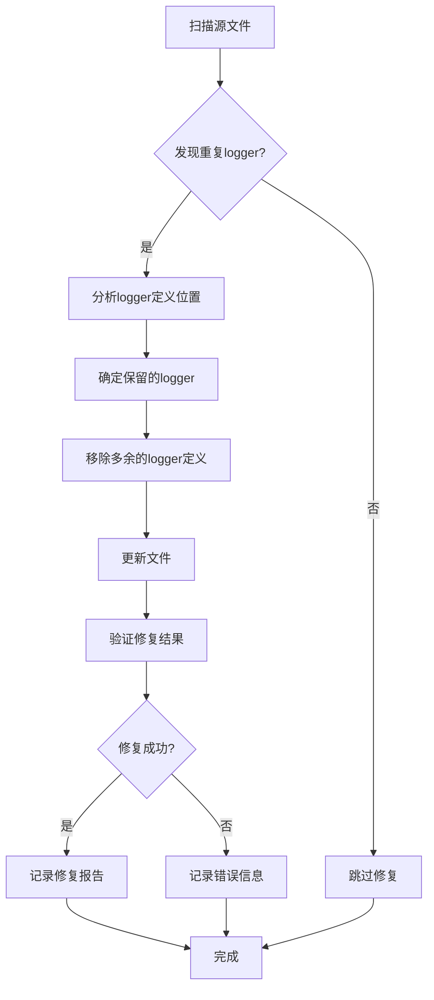

**图表来源**
- [duplicate_logger_fix_report.md](file://reports/duplicate_logger_fix_report.md#L1-L50)

**章节来源**
- [duplicate_logger_fix_report.md](file://reports/duplicate_logger_fix_report.md#L1-L100)

## API调用失败处理

### 响应状态码处理

DashScope适配器对API响应状态码进行了详细处理：

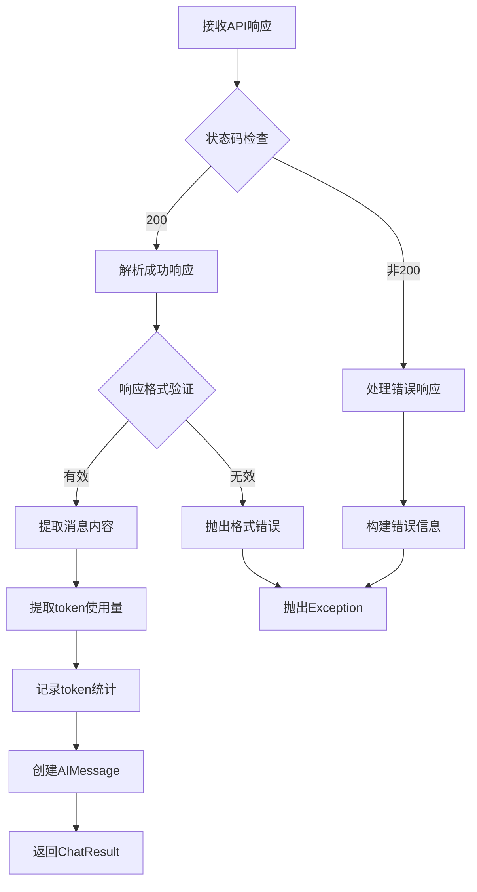

**图表来源**
- [dashscope_adapter.py](file://tradingagents/llm_adapters/dashscope_adapter.py#L100-L140)

### 错误信息格式化

系统提供了详细的错误信息格式化：

| 错误类型 | 错误信息格式 | 示例 |
|----------|-------------|------|
| API调用失败 | `"Error calling DashScope API: {error_message}"` | `Error calling DashScope API: Network timeout` |
| 响应错误 | `"DashScope API error: {code} - {message}"` | `DashScope API error: 400 - Invalid request` |
| 认证错误 | `"DashScope API key not found"` | `DashScope API key not found` |

**章节来源**
- [dashscope_adapter.py](file://tradingagents/llm_adapters/dashscope_adapter.py#L100-L150)

## 认证错误处理

### API密钥验证

系统实现了严格的API密钥验证机制：

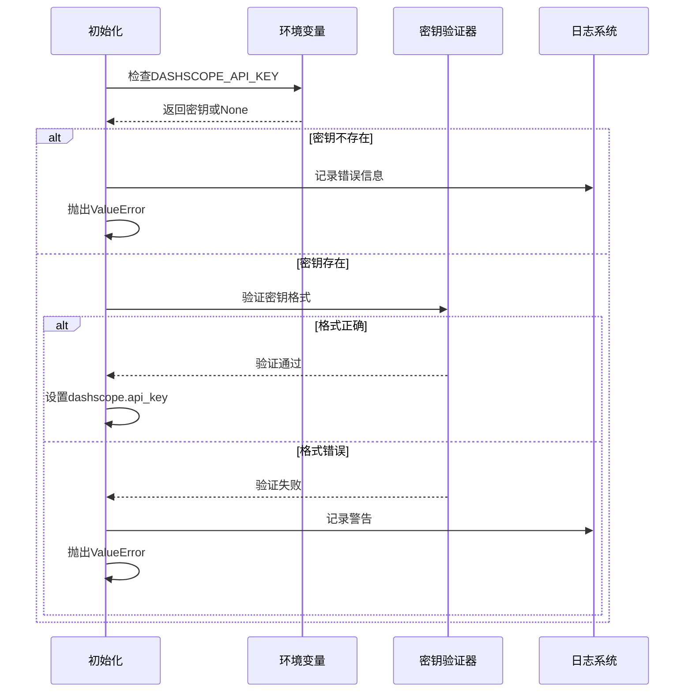

**图表来源**
- [dashscope_adapter.py](file://tradingagents/llm_adapters/dashscope_adapter.py#L40-L60)

### 配置检查机制

系统提供了专门的配置检查脚本：

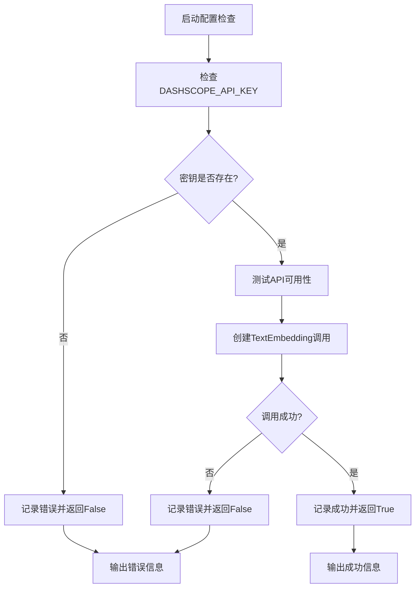

**图表来源**
- [check_api_config.py](file://scripts/check_api_config.py#L27-L63)

**章节来源**
- [dashscope_adapter.py](file://tradingagents/llm_adapters/dashscope_adapter.py#L40-L70)
- [check_api_config.py](file://scripts/check_api_config.py#L27-L63)

## 网络超时处理

### 超时检测机制

虽然当前适配器没有显式的超时设置，但系统通过以下方式处理网络超时：

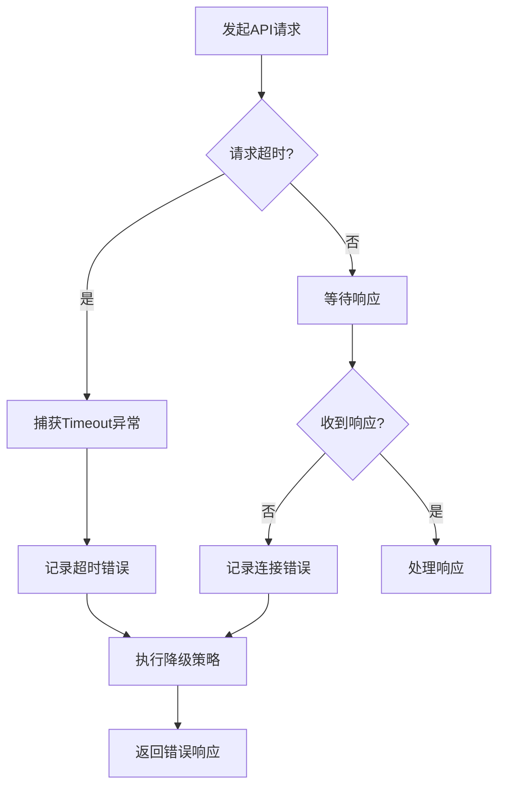

### 错误分类处理

系统对不同类型的网络错误进行了分类处理：

| 错误类型 | 检测关键词 | 处理策略 |
|----------|-----------|----------|
| 连接超时 | `'timeout'` | 记录超时日志，考虑降级 |
| 网络连接错误 | `'connection'` | 记录连接错误，检查网络 |
| DNS解析错误 | `'dns'` | 记录DNS错误，检查域名 |
| SSL证书错误 | `'ssl'` | 记录SSL错误，检查证书 |

**章节来源**
- [memory.py](file://tradingagents/agents/utils/memory.py#L524-L547)

## 连接测试机制

### 测试方法实现

系统提供了完整的连接测试机制：

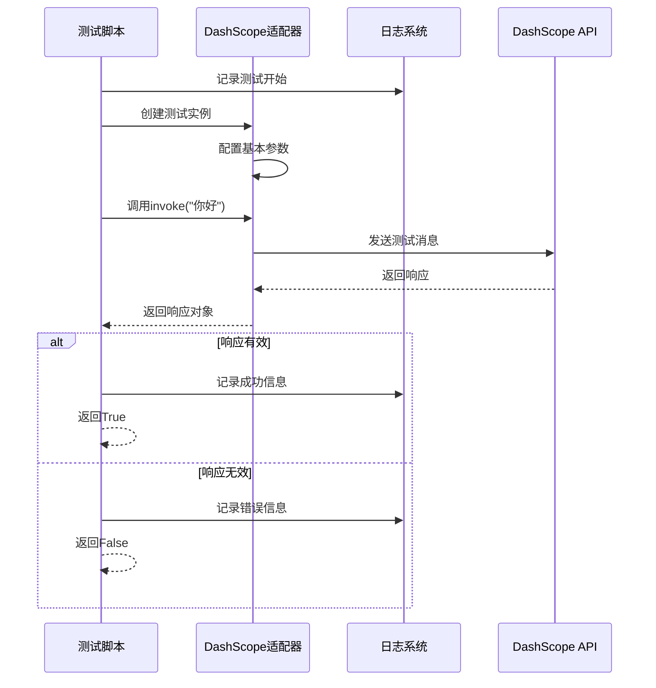

**图表来源**
- [dashscope_openai_adapter.py](file://tradingagents/llm_adapters/dashscope_openai_adapter.py#L150-L180)

### 集成测试套件

系统包含了全面的集成测试：

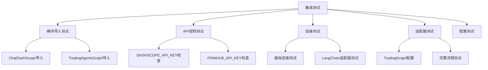

**图表来源**
- [test_dashscope_integration.py](file://tests/integration/test_dashscope_integration.py#L15-L180)

**章节来源**
- [dashscope_openai_adapter.py](file://tradingagents/llm_adapters/dashscope_openai_adapter.py#L150-L180)
- [test_dashscope_integration.py](file://tests/integration/test_dashscope_integration.py#L15-L180)

## 降级策略

### 多层次降级机制

系统实现了多层次的降级策略：

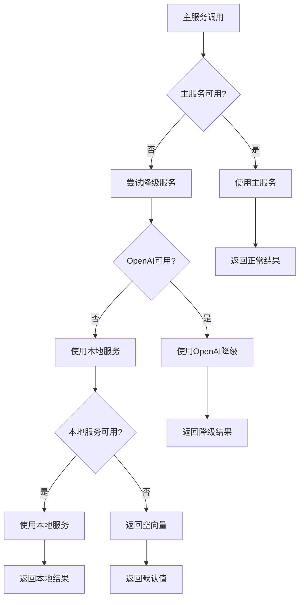

**图表来源**
- [memory.py](file://tradingagents/agents/utils/memory.py#L468-L490)

### 具体降级场景

| 降级场景 | 触发条件 | 降级方案 | 结果 |
|----------|---------|----------|------|
| API密钥缺失 | 未设置DASHSCOPE_API_KEY | 禁用记忆功能 | 返回空向量[0.0]*1024 |
| API调用失败 | 服务不可用或网络错误 | 使用OpenAI降级 | 返回OpenAI结果 |
| 长度限制错误 | 文本超过token限制 | 直接降级不截断 | 返回空向量 |
| 包导入失败 | dashscope包未安装 | 禁用功能 | 返回默认值 |

**章节来源**
- [memory.py](file://tradingagents/agents/utils/memory.py#L468-L547)

## 错误日志记录

### 日志级别分类

系统采用分级的日志记录策略：

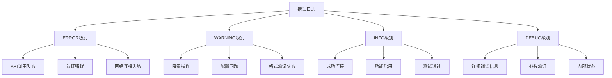

### 日志格式标准化

系统实现了标准化的日志格式：

| 日志类型 | 格式模板 | 示例 |
|----------|---------|------|
| 错误日志 | `"[错误类型] {message}"` | `[API调用] DashScope API调用失败: Network timeout` |
| 警告日志 | `"[警告类型] {message}"` | `[降级] DashScope服务不可用，切换到OpenAI` |
| 信息日志 | `"[功能状态] {message}"` | `[配置] DASHSCOPE_API_KEY已配置，启用记忆功能` |
| 调试日志 | `"[调试信息] {message}"` | `[工具调用] 验证工具格式: {'name': 'get_stock_data'}` |

**章节来源**
- [memory.py](file://tradingagents/agents/utils/memory.py#L489-L547)

## 配置管理

### 配置项详解

系统通过配置管理器管理DashScope相关配置：

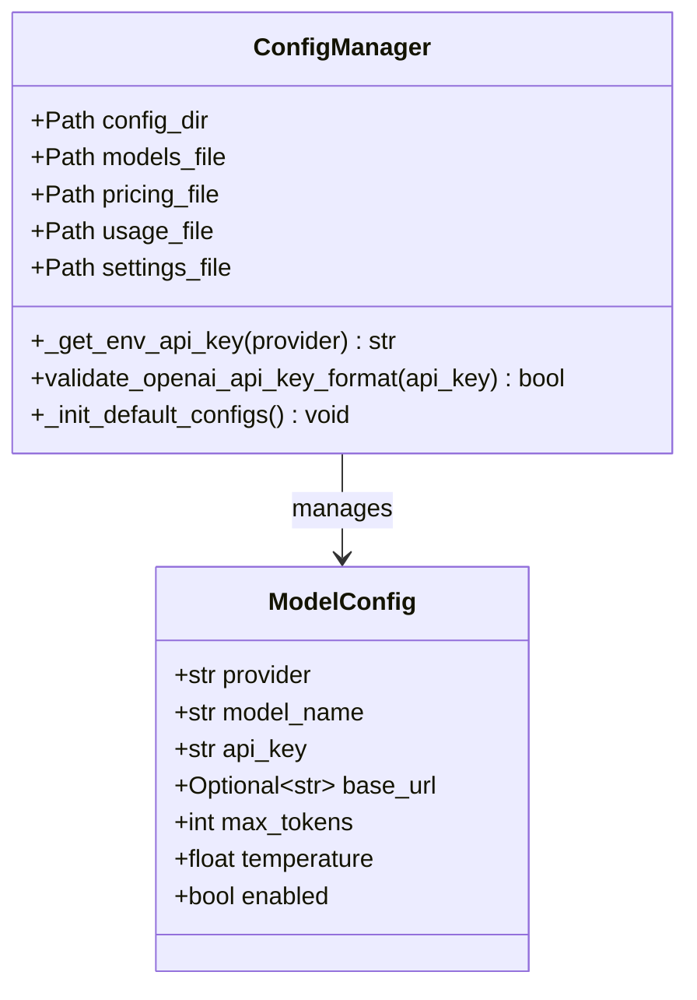

**图表来源**
- [config_manager.py](file://tradingagents/config/config_manager.py#L30-L80)

### 环境变量配置

| 配置项 | 环境变量名 | 默认值 | 描述 |
|--------|-----------|--------|------|
| API密钥 | `DASHSCOPE_API_KEY` | "" | DashScope API密钥 |
| 后端URL | `DASHSCOPE_BACKEND_URL` | "" | 自定义API端点 |
| 最大令牌数 | `DASHSCOPE_MAX_TOKENS` | 4000 | 单次请求最大令牌数 |
| 温度参数 | `DASHSCOPE_TEMPERATURE` | 0.7 | 生成随机性控制 |
| 是否启用 | `DASHSCOPE_ENABLED` | true | 是否启用DashScope服务 |

**章节来源**
- [config_manager.py](file://tradingagents/config/config_manager.py#L80-L150)
- [default_config.py](file://tradingagents/default_config.py#L1-L28)

## 兼容性问题

### 版本兼容性

系统针对不同版本的DashScope SDK实现了兼容性处理：

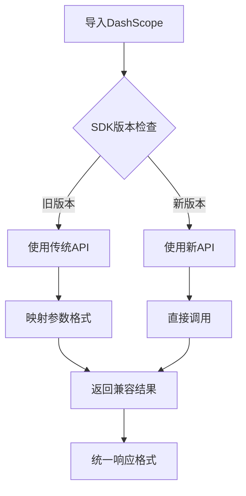

### 工具调用兼容性

OpenAI兼容适配器解决了工具调用的兼容性问题：

| 兼容性问题 | 解决方案 | 实现细节 |
|------------|---------|----------|
| 工具格式差异 | 备用格式支持 | 支持多种工具定义格式 |
| 参数验证失败 | 格式修复机制 | 自动修复格式错误 |
| 响应解析错误 | 响应验证 | 严格验证API响应格式 |
| 调用链中断 | 降级处理 | 自动降级到备用方案 |

**章节来源**
- [dashscope_openai_adapter.py](file://tradingagents/llm_adapters/dashscope_openai_adapter.py#L200-L280)

## 故障转移限制

### 转移决策机制

系统实现了智能的故障转移决策：

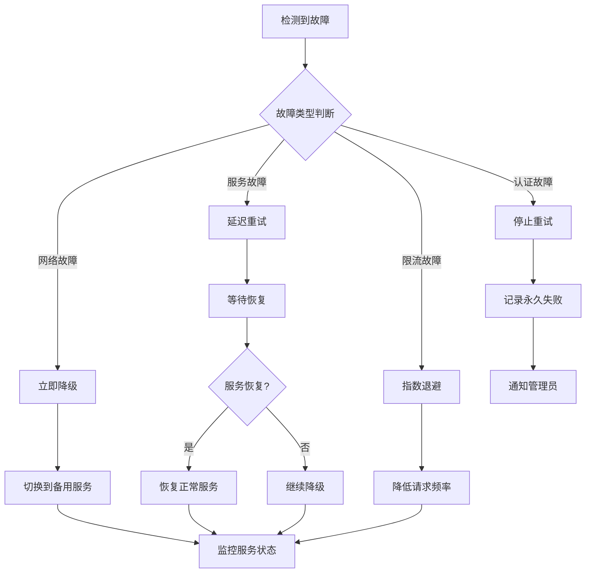

### 限制条件

系统设置了合理的故障转移限制：

| 限制类型 | 限制值 | 作用 |
|----------|-------|------|
| 重试次数 | 3次 | 防止无限重试 |
| 重试间隔 | 1-30秒 | 指数退避 |
| 降级超时 | 30秒 | 防止降级过程过长 |
| 故障窗口 | 5分钟 | 避免频繁切换 |

**章节来源**
- [memory.py](file://tradingagents/agents/utils/memory.py#L468-L490)

## 最佳实践建议

### 部署建议

1. **环境配置**
   - 确保正确设置`DASHSCOPE_API_KEY`环境变量
   - 验证网络连接和防火墙设置
   - 配置适当的超时参数

2. **监控设置**
   - 启用详细的错误日志记录
   - 设置故障通知机制
   - 监控API使用量和费用

3. **备份策略**
   - 配置备用API密钥
   - 实施降级策略
   - 定期测试故障转移

### 开发建议

1. **错误处理**
   - 实现完整的异常捕获
   - 提供有意义的错误信息
   - 记录详细的调试信息

2. **性能优化**
   - 使用连接池减少连接开销
   - 实施请求缓存机制
   - 优化批量请求处理

3. **测试覆盖**
   - 编写全面的单元测试
   - 实施集成测试
   - 定期进行压力测试

### 运维建议

1. **监控指标**
   - API响应时间
   - 错误率统计
   - 使用量监控
   - 降级触发频率

2. **告警设置**
   - API不可用告警
   - 错误率过高告警
   - 使用量超限告警
   - 降级服务告警

3. **维护计划**
   - 定期检查API密钥有效性
   - 更新SDK版本
   - 优化配置参数
   - 清理过期日志

通过以上完善的故障处理机制，DashScope适配器能够确保在各种异常情况下的系统稳定性和可靠性，为TradingAgents框架提供可靠的AI服务支持。