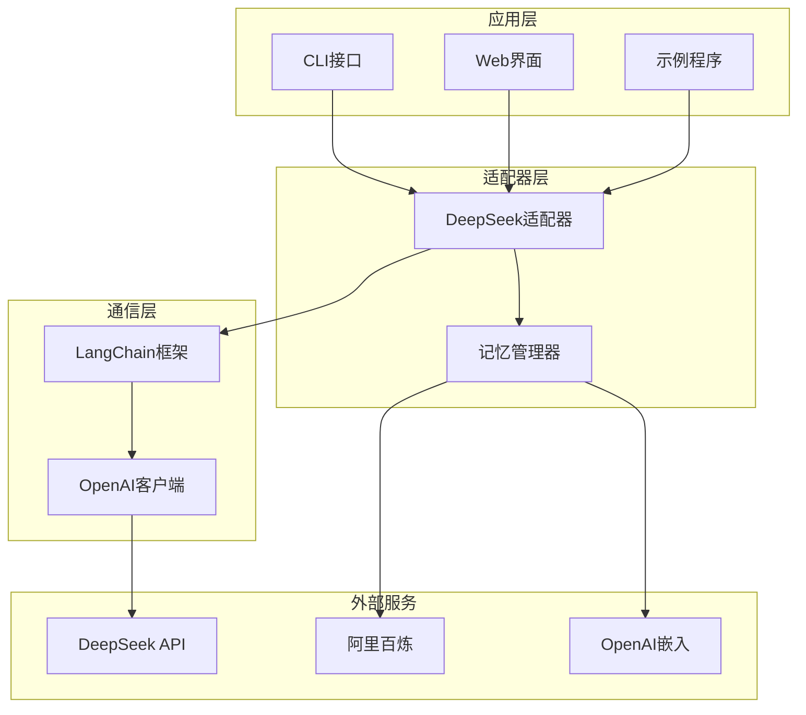
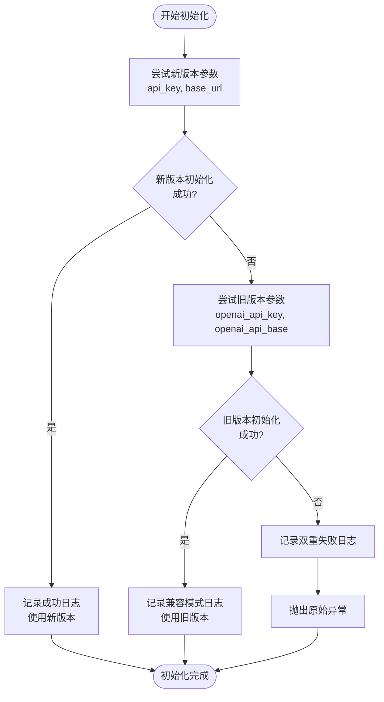
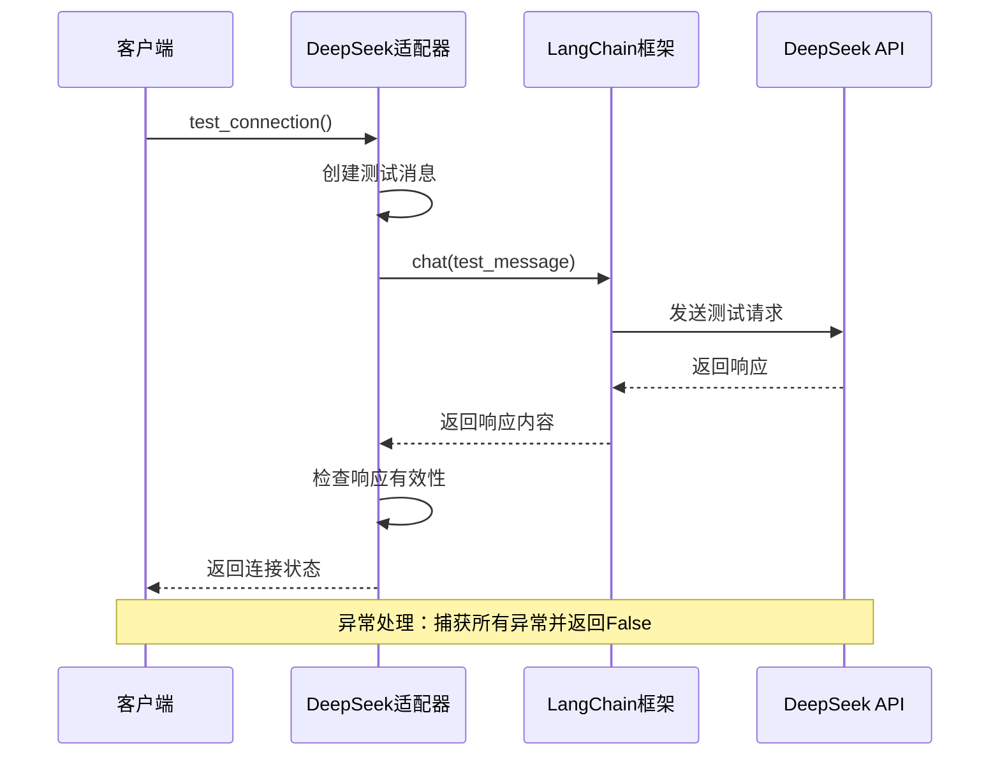
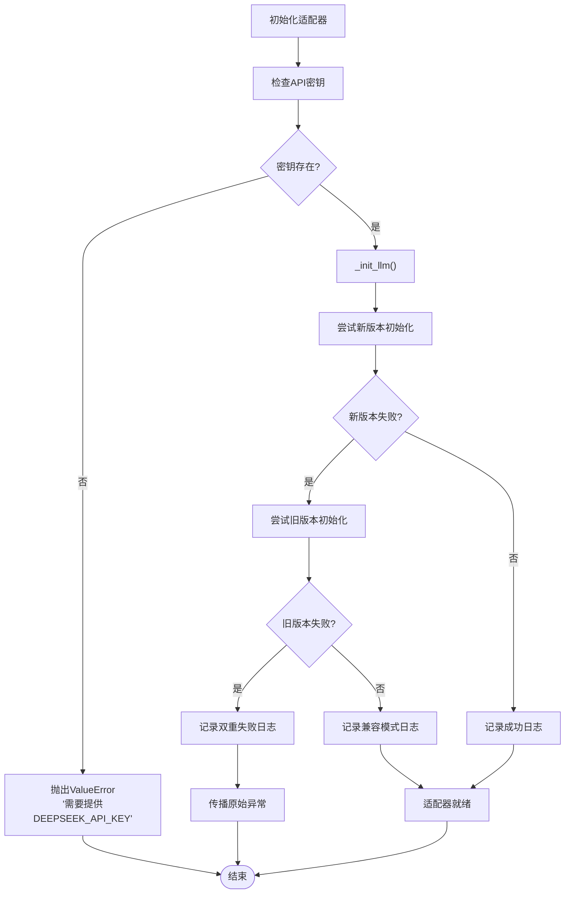
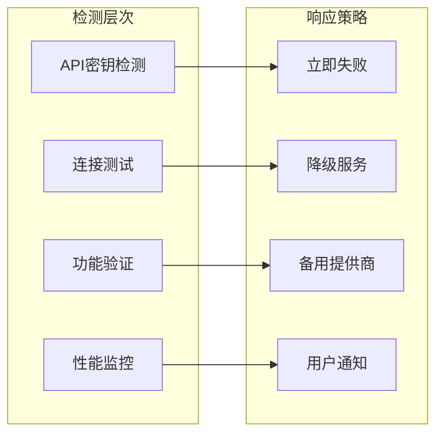
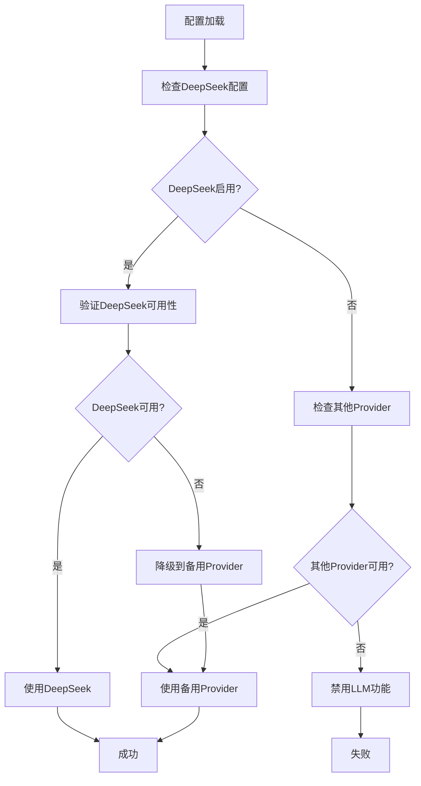

# DeepSeek故障处理机制

<cite>
**本文档引用的文件**
- [deepseek_adapter.py](file://tradingagents/llm/deepseek_adapter.py)
- [memory.py](file://tradingagents/agents/utils/memory.py)
- [demo_deepseek_simple.py](file://examples/demo_deepseek_simple.py)
- [test_deepseek_integration.py](file://tests/test_deepseek_integration.py)
- [test_deepseek_cost_calculation.py](file://tests/test_deepseek_cost_calculation.py)
- [check_api_config.py](file://scripts/check_api_config.py)
- [main.py](file://cli/main.py)
</cite>

## 目录
1. [简介](#简介)
2. [系统架构概览](#系统架构概览)
3. [双重初始化机制](#双重初始化机制)
4. [连接测试与验证](#连接测试与验证)
5. [错误传播路径](#错误传播路径)
6. [日志记录与监控](#日志记录与监控)
7. [故障检测与恢复](#故障检测与恢复)
8. [与其他LLM提供商的切换策略](#与其他llm提供商的切换策略)
9. [最佳实践与建议](#最佳实践与建议)
10. [总结](#总结)

## 简介

DeepSeek适配器是TradingAgents-CN项目中的核心组件之一，负责与DeepSeek V3 LLM服务进行交互。该适配器实现了完善的容错机制，确保在API密钥缺失、连接失败或版本兼容性问题等异常情况下能够优雅地处理错误并提供降级方案。

本文档深入分析DeepSeek适配器的容错机制实现，重点关注`_init_llm`方法中的双重初始化尝试、`test_connection`方法的连接验证逻辑，以及整体的错误处理策略。

## 系统架构概览

DeepSeek适配器采用分层架构设计，包含以下核心组件：



**图表来源**
- [deepseek_adapter.py](file://tradingagents/llm/deepseek_adapter.py#L1-L50)
- [memory.py](file://tradingagents/agents/utils/memory.py#L200-L250)

**章节来源**
- [deepseek_adapter.py](file://tradingagents/llm/deepseek_adapter.py#L1-L247)
- [memory.py](file://tradingagents/agents/utils/memory.py#L200-L300)

## 双重初始化机制

### _init_llm方法的核心逻辑

DeepSeek适配器的`_init_llm`方法实现了创新的双重初始化尝试机制，专门针对LangChain框架的新旧版本参数兼容性问题：



**图表来源**
- [deepseek_adapter.py](file://tradingagents/llm/deepseek_adapter.py#L75-L95)

### 参数兼容性处理

该机制巧妙地解决了LangChain框架版本升级带来的兼容性问题：

1. **新版本参数**：使用`api_key`和`base_url`参数
2. **旧版本参数**：使用`openai_api_key`和`openai_api_base`参数
3. **自动降级**：当新版本失败时自动尝试旧版本

这种设计确保了系统在LangChain版本升级时仍能正常工作，大大提高了系统的鲁棒性。

**章节来源**
- [deepseek_adapter.py](file://tradingagents/llm/deepseek_adapter.py#L75-L95)

## 连接测试与验证

### test_connection方法实现

`test_connection`方法提供了可靠的API连接验证机制：



**图表来源**
- [deepseek_adapter.py](file://tradingagents/llm/deepseek_adapter.py#L230-L240)

### 连接验证的具体实现

测试过程包含以下关键步骤：

1. **消息准备**：创建简单的`HumanMessage`对象
2. **API调用**：通过`chat`方法发送测试消息
3. **响应验证**：检查响应内容的有效性
4. **异常捕获**：完全捕获并处理所有异常

这种方法的优势在于：
- **简单可靠**：使用最基本的API功能进行测试
- **快速反馈**：能够在几秒钟内确定连接状态
- **全面覆盖**：涵盖网络连接、认证和API可用性

**章节来源**
- [deepseek_adapter.py](file://tradingagents/llm/deepseek_adapter.py#L230-L240)
- [test_deepseek_integration.py](file://tests/test_deepseek_integration.py#L67-L91)

## 错误传播路径

### API密钥缺失处理

当API密钥缺失时，错误传播遵循以下路径：



**图表来源**
- [deepseek_adapter.py](file://tradingagents/llm/deepseek_adapter.py#L50-L75)
- [deepseek_adapter.py](file://tradingagents/llm/deepseek_adapter.py#L75-L95)

### 连接失败的处理策略

连接失败时的处理遵循以下原则：

1. **立即失败**：连接测试失败时不尝试重试
2. **清晰日志**：记录详细的错误信息
3. **状态反馈**：返回明确的失败状态
4. **资源清理**：确保异常情况下资源得到正确释放

**章节来源**
- [deepseek_adapter.py](file://tradingagents/llm/deepseek_adapter.py#L50-L95)
- [deepseek_adapter.py](file://tradingagents/llm/deepseek_adapter.py#L230-L240)

## 日志记录与监控

### logger.error的使用方式

DeepSeek适配器广泛使用结构化日志记录来跟踪系统状态和错误信息：

```python
# 初始化失败日志
logger.error(f"初始化DeepSeek模型失败: {e}")
logger.error(f"兼容模式也失败: {e2}")

# 连接测试失败日志  
logger.error(f"连接测试失败: {e}")

# 智能体创建失败日志
logger.error(f"创建智能体失败: {e}")

# 聊天调用失败日志
logger.error(f"聊天调用失败: {e}")
```

### 日志级别策略

系统采用分层的日志级别策略：

1. **INFO**：关键操作和状态变更
2. **WARNING**：潜在问题和降级操作
3. **ERROR**：错误事件和异常情况
4. **DEBUG**：详细的调试信息

这种策略确保了日志信息的可读性和实用性，便于运维人员快速定位问题。

**章节来源**
- [deepseek_adapter.py](file://tradingagents/llm/deepseek_adapter.py#L80-L95)
- [deepseek_adapter.py](file://tradingagents/llm/deepseek_adapter.py#L235-L240)

## 故障检测与恢复

### 故障检测机制

DeepSeek适配器实现了多层次的故障检测机制：



**图表来源**
- [deepseek_adapter.py](file://tradingagents/llm/deepseek_adapter.py#L195-L205)
- [memory.py](file://tradingagents/agents/utils/memory.py#L200-L250)

### 恢复策略

系统采用多种恢复策略来应对不同类型的故障：

1. **API密钥恢复**：检查环境变量配置
2. **连接恢复**：使用连接测试验证
3. **功能恢复**：降级到基础功能
4. **服务恢复**：切换到备用提供商

**章节来源**
- [memory.py](file://tradingagents/agents/utils/memory.py#L200-L250)
- [main.py](file://cli/main.py#L988-L1014)

## 与其他LLM提供商的切换策略

### Provider切换机制

系统实现了灵活的Provider切换机制，支持无缝切换到其他LLM提供商：



**图表来源**
- [main.py](file://cli/main.py#L1045-L1071)
- [memory.py](file://tradingagents/agents/utils/memory.py#L200-L250)

### 切换策略的具体实现

1. **优先级排序**：按重要性和可用性排序Provider
2. **渐进式降级**：逐步尝试可用的Provider
3. **状态监控**：实时监控各Provider的状态
4. **自动切换**：在检测到故障时自动切换

**章节来源**
- [main.py](file://cli/main.py#L1045-L1071)
- [memory.py](file://tradingagents/agents/utils/memory.py#L200-L250)

## 最佳实践与建议

### 配置管理最佳实践

1. **环境变量管理**：使用`.env`文件管理敏感配置
2. **配置验证**：在启动时验证所有必需的配置项
3. **默认值设置**：为可选配置提供合理的默认值
4. **配置热更新**：支持运行时重新加载配置

### 错误处理最佳实践

1. **分层异常处理**：在不同层次实现相应的异常处理
2. **详细错误信息**：提供有助于诊断问题的详细错误信息
3. **优雅降级**：在功能不可用时提供替代方案
4. **用户友好提示**：向用户提供清晰的操作指导

### 监控和日志最佳实践

1. **结构化日志**：使用结构化格式记录日志信息
2. **关键指标监控**：监控系统的关键性能指标
3. **告警机制**：建立及时的故障告警机制
4. **日志轮转**：实施适当的日志轮转策略

## 总结

DeepSeek适配器的容错机制体现了现代软件工程的最佳实践，通过以下关键特性确保了系统的高可用性：

### 主要优势

1. **双重初始化机制**：完美解决了LangChain版本兼容性问题
2. **全面的连接验证**：提供了可靠的API连接测试
3. **清晰的错误传播**：建立了完善的错误处理和传播路径
4. **灵活的降级策略**：支持无缝切换到备用Provider
5. **完善的日志记录**：提供了详细的系统状态跟踪

### 局限性分析

1. **重试机制缺失**：目前不包含自动重试逻辑
2. **性能监控不足**：缺乏详细的性能指标收集
3. **故障预测能力有限**：主要依赖被动检测而非主动预测

### 改进建议

1. **引入指数退避重试**：在临时性故障时增加重试机制
2. **添加性能指标**：收集响应时间和成功率等关键指标
3. **实现故障预测**：基于历史数据预测潜在故障
4. **增强监控能力**：集成更完善的监控和告警系统

通过持续改进这些容错机制，DeepSeek适配器将能够为TradingAgents-CN项目提供更加稳定和可靠的LLM服务支持。