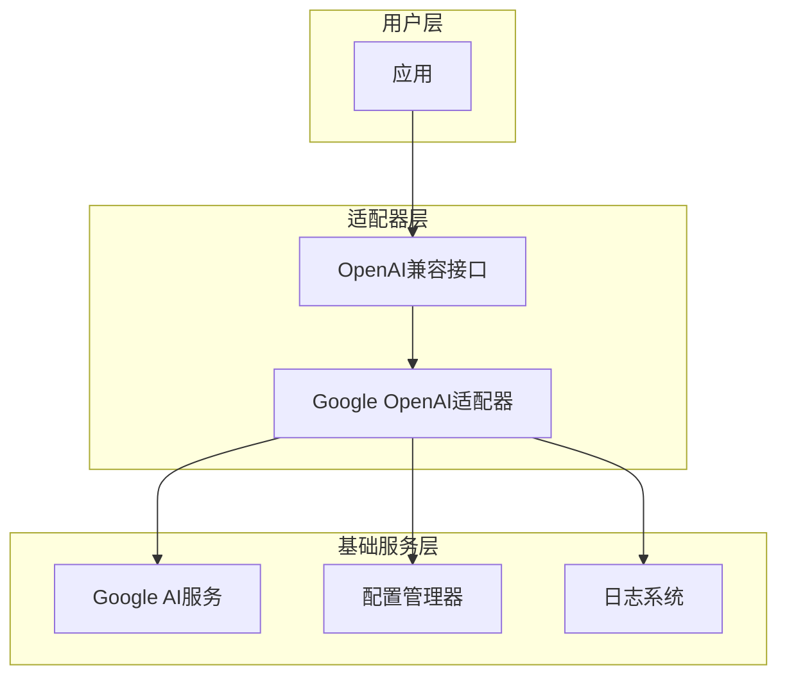
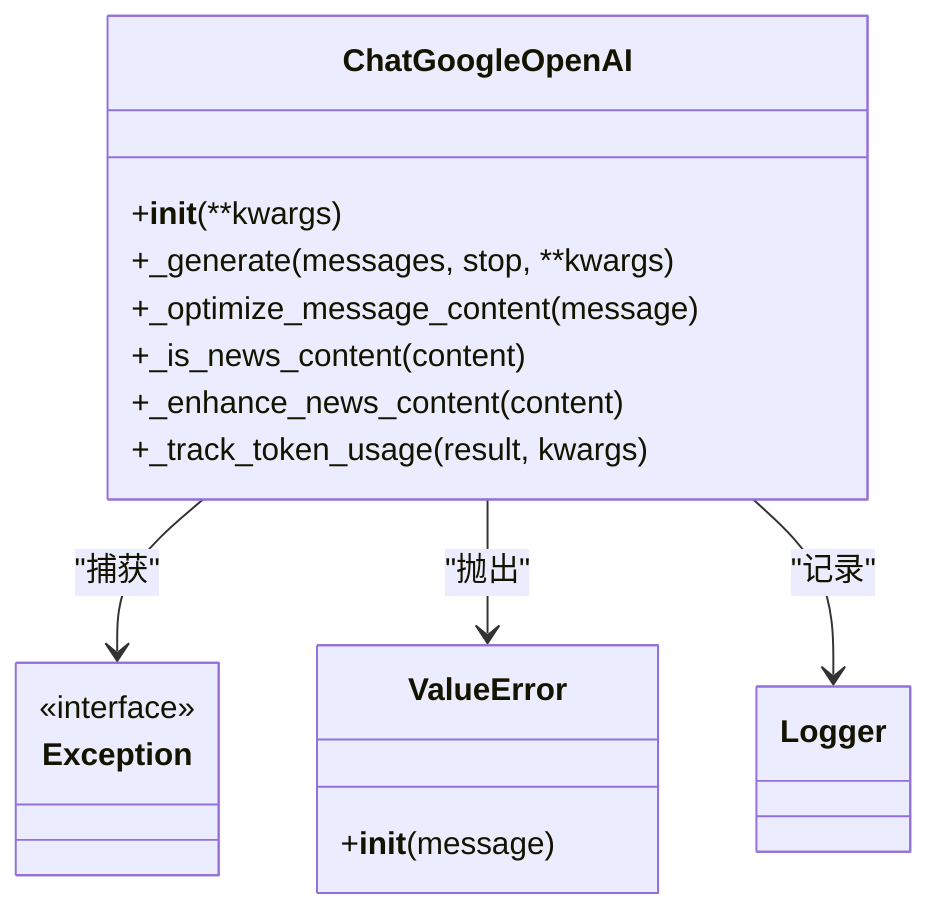
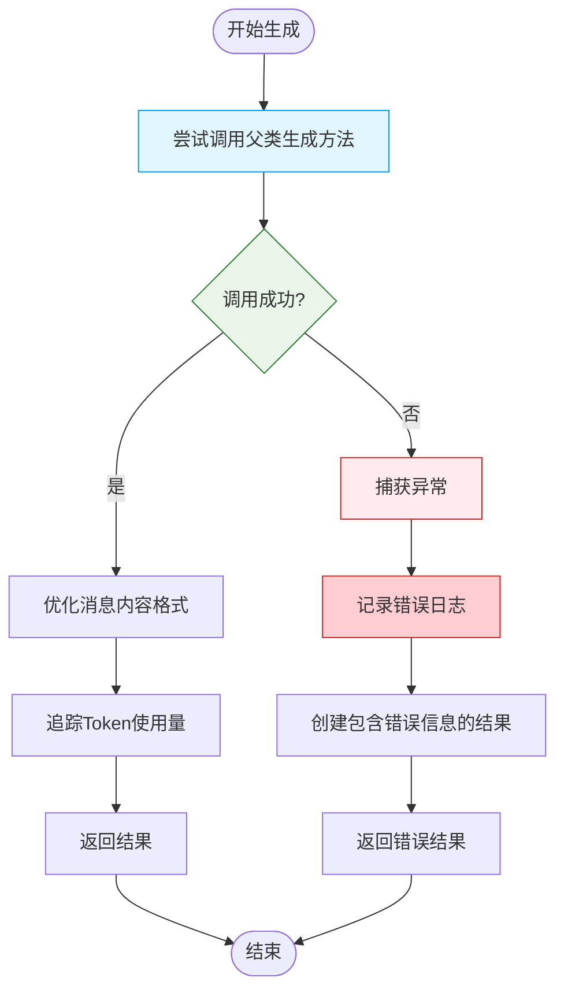
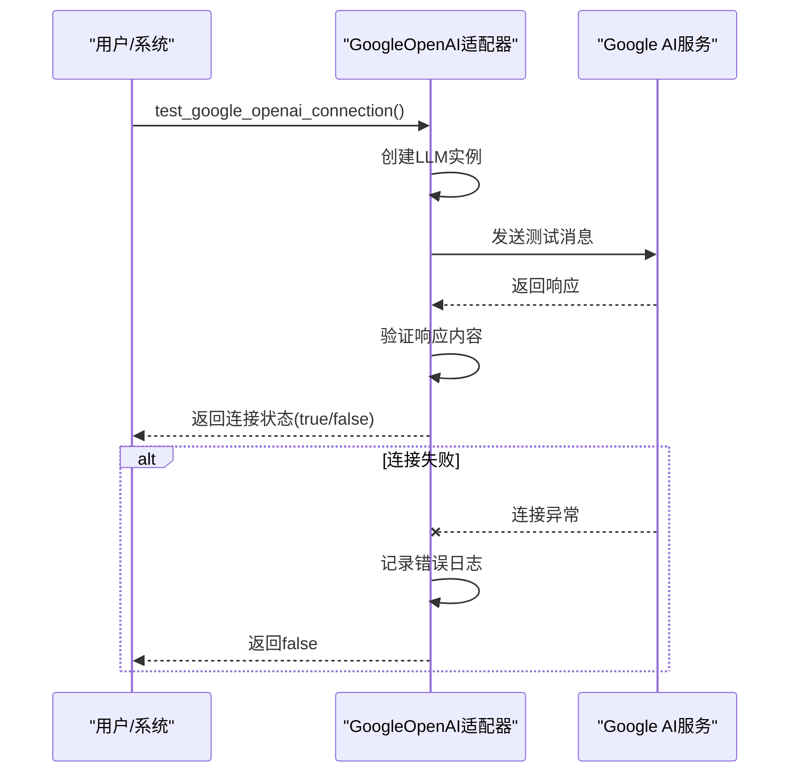
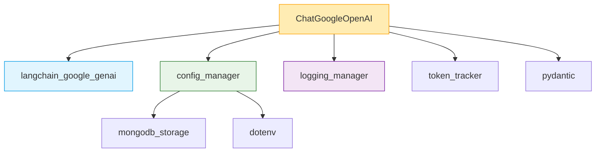
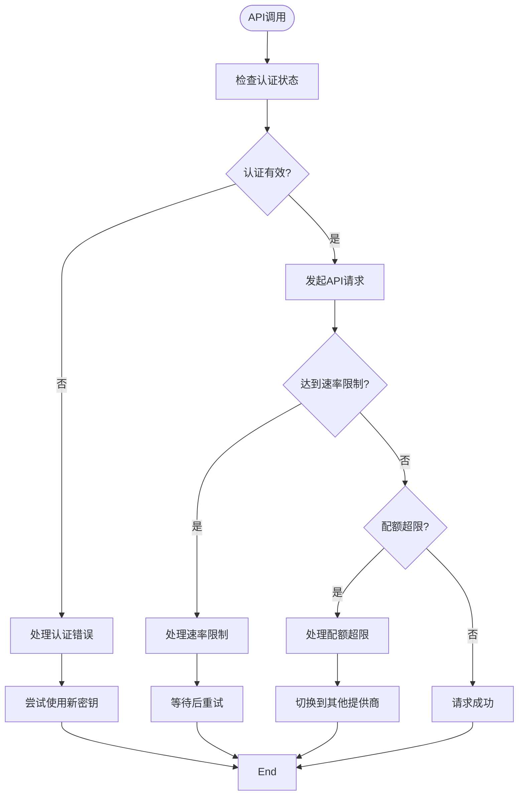
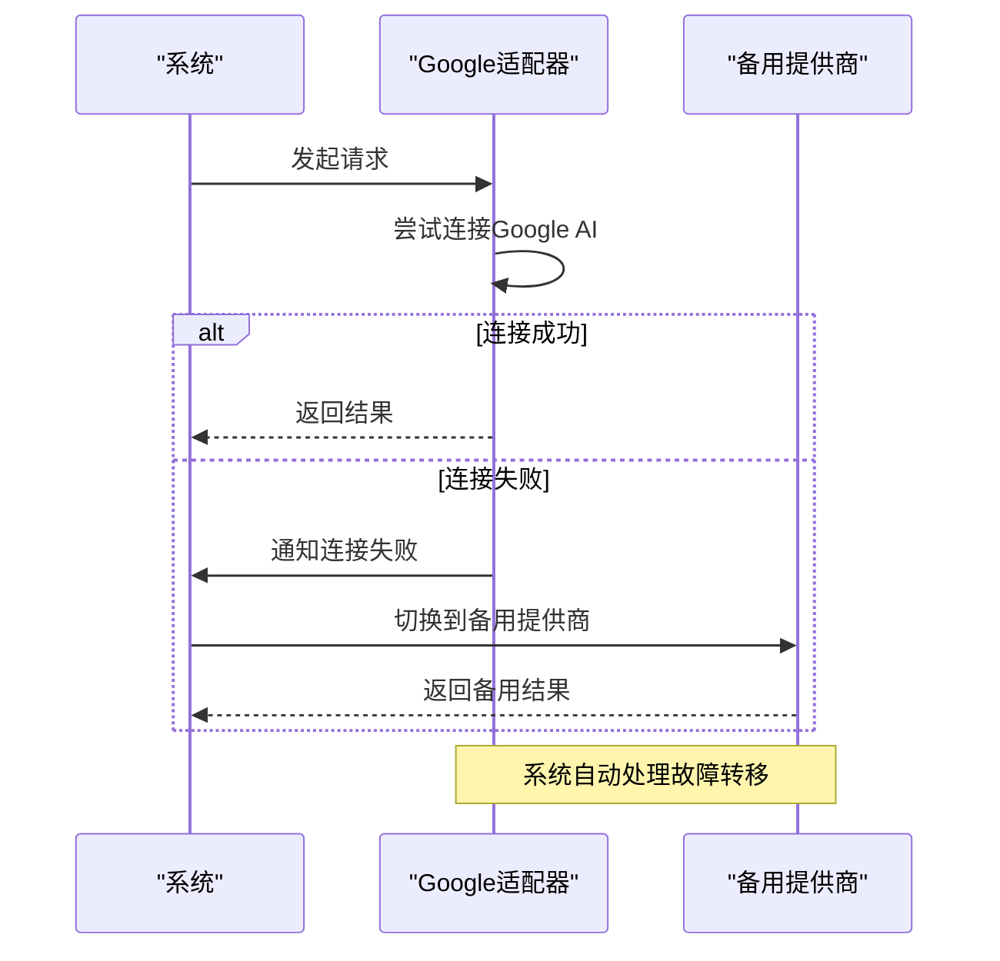

# Google适配器故障处理机制

<cite>
**本文档引用的文件**   
- [google_openai_adapter.py](file://tradingagents/llm_adapters/google_openai_adapter.py)
- [config_manager.py](file://tradingagents/config/config_manager.py)
- [google_tool_handler.py](file://tradingagents/agents/utils/google_tool_handler.py)
- [openai_compatible_base.py](file://tradingagents/llm_adapters/openai_compatible_base.py)
- [trading_graph.py](file://tradingagents/graph/trading_graph.py)
</cite>

## 目录
1. [简介](#简介)
2. [项目结构](#项目结构)
3. [核心组件](#核心组件)
4. [架构概述](#架构概述)
5. [详细组件分析](#详细组件分析)
6. [依赖分析](#依赖分析)
7. [性能考虑](#性能考虑)
8. [故障排除指南](#故障排除指南)
9. [结论](#结论)
10. [附录](#附录)

## 简介
本文档深入分析Google OpenAI适配器的错误处理架构，重点研究其异常处理模式、API限制处理、日志记录策略以及在整体故障转移策略中的角色。文档基于model_update_summary.md中提到的更新内容，详细说明了模型可用性检查和连接测试机制的改进。

## 项目结构
Google OpenAI适配器位于`tradingagents/llm_adapters/`目录下，是整个系统中负责与Google AI服务交互的核心组件。该适配器通过OpenAI兼容接口为TradingAgents提供Gemini模型服务，解决了Google模型工具调用格式不匹配的问题。

```mermaid
graph TD
subgraph "LLM适配器层"
GoogleAdapter[google_openai_adapter.py]
BaseAdapter[openai_compatible_base.py]
end
subgraph "配置管理层"
ConfigManager[config_manager.py]
end
subgraph "工具处理层"
ToolHandler[google_tool_handler.py]
end
subgraph "核心应用层"
TradingGraph[trading_graph.py]
end
GoogleAdapter --> BaseAdapter : "继承"
GoogleAdapter --> ConfigManager : "使用"
ToolHandler --> GoogleAdapter : "调用"
TradingGraph --> GoogleAdapter : "实例化"
```

**图示来源**
- [google_openai_adapter.py](file://tradingagents/llm_adapters/google_openai_adapter.py)
- [openai_compatible_base.py](file://tradingagents/llm_adapters/openai_compatible_base.py)
- [config_manager.py](file://tradingagents/config/config_manager.py)
- [google_tool_handler.py](file://tradingagents/agents/utils/google_tool_handler.py)
- [trading_graph.py](file://tradingagents/graph/trading_graph.py)

**章节来源**
- [google_openai_adapter.py](file://tradingagents/llm_adapters/google_openai_adapter.py)
- [tradingagents/llm_adapters](file://tradingagents/llm_adapters)

## 核心组件
Google OpenAI适配器的核心是`ChatGoogleOpenAI`类，它继承自`ChatGoogleGenerativeAI`，并优化了工具调用和内容格式处理。适配器实现了完整的错误处理机制，包括异常捕获、降级报告生成和token使用追踪。

**章节来源**
- [google_openai_adapter.py](file://tradingagents/llm_adapters/google_openai_adapter.py#L1-L50)

## 架构概述
Google适配器采用分层架构设计，通过继承和扩展机制实现OpenAI兼容性。适配器在底层与Google AI服务交互，在上层提供标准化的OpenAI接口，中间层处理格式转换、错误处理和日志记录。



**图示来源**
- [google_openai_adapter.py](file://tradingagents/llm_adapters/google_openai_adapter.py)
- [config_manager.py](file://tradingagents/config/config_manager.py)

## 详细组件分析

### Google适配器错误处理分析
Google适配器实现了全面的错误处理机制，确保在各种异常情况下系统仍能提供基本服务。

#### 错误处理类图


**图示来源**
- [google_openai_adapter.py](file://tradingagents/llm_adapters/google_openai_adapter.py#L1-L350)

#### 错误处理流程图


**图示来源**
- [google_openai_adapter.py](file://tradingagents/llm_adapters/google_openai_adapter.py#L100-L200)

**章节来源**
- [google_openai_adapter.py](file://tradingagents/llm_adapters/google_openai_adapter.py#L1-L350)

### 模型可用性检查和连接测试
适配器提供了专门的函数来测试模型可用性和连接状态，这是系统稳定性的重要保障。

#### 连接测试序列图


**图示来源**
- [google_openai_adapter.py](file://tradingagents/llm_adapters/google_openai_adapter.py#L250-L300)

**章节来源**
- [google_openai_adapter.py](file://tradingagents/llm_adapters/google_openai_adapter.py#L250-L350)

## 依赖分析
Google适配器与其他组件有明确的依赖关系，这些关系构成了系统的整体架构。



**图示来源**
- [google_openai_adapter.py](file://tradingagents/llm_adapters/google_openai_adapter.py)
- [config_manager.py](file://tradingagents/config/config_manager.py)

**章节来源**
- [google_openai_adapter.py](file://tradingagents/llm_adapters/google_openai_adapter.py)
- [config_manager.py](file://tradingagents/config/config_manager.py)

## 性能考虑
适配器在设计时充分考虑了性能因素，包括token使用追踪、响应时间优化和资源管理。

**章节来源**
- [google_openai_adapter.py](file://tradingagents/llm_adapters/google_openai_adapter.py#L150-L170)

## 故障排除指南
当Google服务出现问题时，系统提供了多种故障排除和恢复机制。

### Google特有API限制处理
适配器能够处理Google特有的API限制、配额超限和认证失效等问题。



**图示来源**
- [google_openai_adapter.py](file://tradingagents/llm_adapters/google_openai_adapter.py)
- [google_tool_handler.py](file://tradingagents/agents/utils/google_tool_handler.py)

**章节来源**
- [google_openai_adapter.py](file://tradingagents/llm_adapters/google_openai_adapter.py)
- [google_tool_handler.py](file://tradingagents/agents/utils/google_tool_handler.py)

### 自动故障转移机制
系统支持在Google服务不可用时自动切换到其他提供商，这是整体故障转移策略的重要组成部分。

#### 故障转移序列图


**图示来源**
- [trading_graph.py](file://tradingagents/graph/trading_graph.py)
- [openai_compatible_base.py](file://tradingagents/llm_adapters/openai_compatible_base.py)

**章节来源**
- [trading_graph.py](file://tradingagents/graph/trading_graph.py)
- [openai_compatible_base.py](file://tradingagents/llm_adapters/openai_compatible_base.py)

## 结论
Google OpenAI适配器通过完善的错误处理架构，确保了系统在面对各种异常情况时的稳定性和可靠性。适配器不仅处理了Google特有的API限制和认证问题，还实现了智能的故障转移机制，使其在整体系统中扮演着关键角色。通过日志记录和token追踪，系统能够提供详细的运行时信息，便于监控和优化。

## 附录

### 配置参数表
| 参数 | 描述 | 默认值 | 来源 |
|------|------|--------|------|
| GOOGLE_API_KEY | Google API密钥 | 从环境变量获取 | config_manager.py |
| temperature | 模型温度参数 | 0.1 | google_openai_adapter.py |
| max_tokens | 最大token数 | 2000 | google_openai_adapter.py |
| model | 使用的模型名称 | gemini-2.5-flash-lite-preview-06-17 | google_openai_adapter.py |

**章节来源**
- [google_openai_adapter.py](file://tradingagents/llm_adapters/google_openai_adapter.py)
- [config_manager.py](file://tradingagents/config/config_manager.py)