# 故障转移机制

<cite>
**本文档中引用的文件**
- [dashscope_adapter.py](file://tradingagents/llm_adapters/dashscope_adapter.py)
- [deepseek_adapter.py](file://tradingagents/llm_adapters/deepseek_adapter.py)
- [google_openai_adapter.py](file://tradingagents/llm_adapters/google_openai_adapter.py)
- [openai_compatible_base.py](file://tradingagents/llm_adapters/openai_compatible_base.py)
- [test_fallback_mechanism.py](file://scripts/test_fallback_mechanism.py)
- [demo_fallback_system.py](file://tests/demo_fallback_system.py)
- [logging_manager.py](file://tradingagents/utils/logging_manager.py)
- [config_manager.py](file://tradingagents/config/config_manager.py)
- [tool_logging.py](file://tradingagents/utils/tool_logging.py)
</cite>

## 目录
1. [概述](#概述)
2. [系统架构](#系统架构)
3. [LLM适配器故障处理](#llm适配器故障处理)
4. [连接测试机制](#连接测试机制)
5. [故障转移策略](#故障转移策略)
6. [错误日志记录](#错误日志记录)
7. [监控和诊断](#监控和诊断)
8. [配置管理](#配置管理)
9. [最佳实践](#最佳实践)
10. [故障排除指南](#故障排除指南)

## 概述

TradingAgents-CN系统实现了多层次的故障转移机制，确保在LLM服务不可用时能够自动切换到备用提供商，保证系统的高可用性和可靠性。该机制涵盖了从API调用失败检测到自动降级的完整流程。

### 核心特性

- **多提供商支持**：支持DashScope、DeepSeek、Google、OpenAI等多个LLM提供商
- **自动故障检测**：实时监控API连接状态和响应质量
- **智能降级策略**：基于可用性和性能的自动切换机制
- **完善的日志记录**：详细的错误日志和性能监控
- **灵活的配置管理**：支持动态调整故障转移策略

## 系统架构

```mermaid
graph TB
subgraph "客户端层"
Client[客户端请求]
end
subgraph "适配器层"
DashAdapter[DashScope适配器]
DeepAdapter[DeepSeek适配器]
GoogleAdapter[Google适配器]
OpenAIAdapter[OpenAI兼容适配器]
end
subgraph "故障检测层"
ConnTest[连接测试]
HealthCheck[健康检查]
RetryPolicy[重试策略]
end
subgraph "负载均衡层"
FallbackManager[故障转移管理器]
ProviderSelector[提供商选择器]
end
subgraph "日志监控层"
Logger[统一日志系统]
Monitor[性能监控]
Alert[告警系统]
end
subgraph "LLM提供商"
DashScope[阿里百炼]
DeepSeek[DeepSeek]
GoogleAI[Google AI]
OpenAI[OpenAI]
end
Client --> FallbackManager
FallbackManager --> ConnTest
ConnTest --> HealthCheck
HealthCheck --> ProviderSelector
ProviderSelector --> DashAdapter
ProviderSelector --> DeepAdapter
ProviderSelector --> GoogleAdapter
ProviderSelector --> OpenAIAdapter
DashAdapter --> DashScope
DeepAdapter --> DeepSeek
GoogleAdapter --> GoogleAI
OpenAIAdapter --> OpenAI
FallbackManager --> Logger
Logger --> Monitor
Monitor --> Alert
```

**图表来源**
- [test_fallback_mechanism.py](file://scripts/test_fallback_mechanism.py#L1-L133)
- [demo_fallback_system.py](file://tests/demo_fallback_system.py#L1-L249)

## LLM适配器故障处理

### DashScope适配器故障处理

DashScope适配器实现了完整的异常捕获和错误处理机制：

**图表来源**
- [dashscope_adapter.py](file://tradingagents/llm_adapters/dashscope_adapter.py#L120-L180)

### DeepSeek适配器故障处理

DeepSeek适配器提供了更高级的错误处理和Token跟踪功能：

**图表来源**
- [deepseek_adapter.py](file://tradingagents/llm_adapters/deepseek_adapter.py#L60-L150)

### Google适配器故障处理

Google适配器实现了专门的工具调用优化和错误恢复机制：

**图表来源**
- [google_openai_adapter.py](file://tradingagents/llm_adapters/google_openai_adapter.py#L50-L100)

**章节来源**
- [dashscope_adapter.py](file://tradingagents/llm_adapters/dashscope_adapter.py#L120-L180)
- [deepseek_adapter.py](file://tradingagents/llm_adapters/deepseek_adapter.py#L60-L150)
- [google_openai_adapter.py](file://tradingagents/llm_adapters/google_openai_adapter.py#L50-L100)

## 连接测试机制

### test_connection方法实现

每个LLM适配器都实现了test_connection方法来检测API连接状态：

| 适配器 | 测试方法 | 检测内容 | 超时设置 |
|--------|----------|----------|----------|
| DashScope | `_generate()` | API密钥有效性 | 30秒 |
| DeepSeek | `_generate()` | API密钥和网络连通性 | 30秒 |
| Google | `invoke()` | API密钥和模型可用性 | 30秒 |
| OpenAI兼容 | `_generate()` | 自定义端点连通性 | 30秒 |

### 连接测试流程

**图表来源**
- [google_openai_adapter.py](file://tradingagents/llm_adapters/google_openai_adapter.py#L250-L290)

**章节来源**
- [google_openai_adapter.py](file://tradingagents/llm_adapters/google_openai_adapter.py#L250-L290)

## 故障转移策略

### 自动切换机制

系统实现了智能的故障转移策略，当主要LLM服务不可用时自动切换到备用提供商：

**图表来源**
- [test_fallback_mechanism.py](file://scripts/test_fallback_mechanism.py#L40-L80)

### 配置方式

故障转移的配置通过以下方式实现：

1. **环境变量配置**：通过设置多个提供商的API密钥
2. **配置文件管理**：在models.json中定义多个提供商
3. **动态优先级**：根据可用性和性能动态调整提供商优先级

### 限制和约束

- **重试次数限制**：防止无限重试导致系统资源耗尽
- **超时控制**：每个提供商的请求都有明确的超时时间
- **错误累积**：记录所有提供商的错误以便诊断

**章节来源**
- [test_fallback_mechanism.py](file://scripts/test_fallback_mechanism.py#L40-L80)
- [demo_fallback_system.py](file://tests/demo_fallback_system.py#L50-L100)

## 错误日志记录

### 统一日志系统

系统采用统一的日志管理器，提供结构化的错误日志记录：

**图表来源**
- [logging_manager.py](file://tradingagents/utils/logging_manager.py#L300-L410)

### 错误日志模板

系统使用标准化的错误日志模板，包含以下信息：

| 字段 | 描述 | 示例 |
|------|------|------|
| timestamp | 时间戳 | 2024-01-15T10:30:00.123Z |
| level | 日志级别 | ERROR |
| logger | 日志器名称 | llm_adapters |
| message | 错误消息 | "DashScope API error: 400 - Invalid request" |
| provider | 提供商 | dashscope |
| model | 模型名称 | qwen-turbo |
| session_id | 会话ID | session_20240115_103000 |
| duration | 耗时 | 2.45 |
| error | 错误详情 | "Connection timeout after 30 seconds" |

### 工具调用错误处理

工具调用的错误处理采用了装饰器模式：

**图表来源**
- [tool_logging.py](file://tradingagents/utils/tool_logging.py#L90-L120)

**章节来源**
- [logging_manager.py](file://tradingagents/utils/logging_manager.py#L300-L410)
- [tool_logging.py](file://tradingagents/utils/tool_logging.py#L90-L120)

## 监控和诊断

### 性能监控

系统集成了全面的性能监控功能：

**图表来源**
- [logging_manager.py](file://tradingagents/utils/logging_manager.py#L150-L200)

### 诊断工具

系统提供了多种诊断工具来帮助识别和解决问题：

1. **日志分析器**：自动分析日志文件中的错误模式
2. **性能分析器**：识别慢操作和性能瓶颈
3. **连接测试器**：验证各个提供商的连接状态
4. **使用统计器**：跟踪Token使用和成本统计

### 实时监控

**图表来源**
- [logging_manager.py](file://tradingagents/utils/logging_manager.py#L250-L300)

**章节来源**
- [logging_manager.py](file://tradingagents/utils/logging_manager.py#L150-L300)

## 配置管理

### Token跟踪配置

系统通过ConfigManager提供完整的配置管理功能：

**图表来源**
- [config_manager.py](file://tradingagents/config/config_manager.py#L50-L150)

### 动态配置更新

系统支持运行时动态更新配置，无需重启服务：

- **API密钥热更新**：支持动态添加或修改提供商API密钥
- **模型启用/禁用**：可以动态启用或禁用特定模型
- **定价信息更新**：实时更新各提供商的定价信息
- **日志级别调整**：动态调整日志记录级别

**章节来源**
- [config_manager.py](file://tradingagents/config/config_manager.py#L50-L200)

## 最佳实践

### 故障转移配置建议

1. **多提供商配置**：至少配置两个不同的LLM提供商
2. **合理的超时设置**：根据网络环境设置合适的超时时间
3. **定期健康检查**：定期测试各个提供商的可用性
4. **成本控制**：启用Token跟踪和成本监控
5. **错误处理**：实现适当的错误处理和用户反馈

### 性能优化建议

1. **连接池管理**：使用连接池减少连接建立开销
2. **缓存策略**：对频繁使用的响应进行缓存
3. **批量处理**：将多个请求合并为批量请求
4. **异步处理**：使用异步调用提高并发性能

### 安全考虑

1. **API密钥保护**：使用环境变量存储敏感信息
2. **访问控制**：实施适当的访问控制和审计
3. **数据加密**：对敏感数据进行加密存储
4. **监控告警**：建立完善的监控和告警机制

## 故障排除指南

### 常见问题诊断

| 问题类型 | 症状 | 可能原因 | 解决方案 |
|----------|------|----------|----------|
| 连接超时 | 请求长时间无响应 | 网络问题、API限流 | 检查网络连接、增加重试次数 |
| 认证失败 | 401/403错误 | API密钥无效 | 验证API密钥格式和有效性 |
| 频率限制 | 429错误 | 请求频率过高 | 实施指数退避重试策略 |
| 响应格式错误 | 解析失败 | API版本不匹配 | 检查API版本兼容性 |
| Token不足 | 成本过高 | 模型选择不当 | 优化模型选择和输入长度 |

### 诊断流程

### 监控仪表板

建议监控的关键指标：

1. **可用性指标**：各提供商的可用性百分比
2. **性能指标**：平均响应时间和错误率
3. **成本指标**：Token使用量和总成本
4. **用户体验指标**：用户满意度和响应时间

通过这些监控指标，可以及时发现和解决潜在的问题，确保系统的稳定运行。