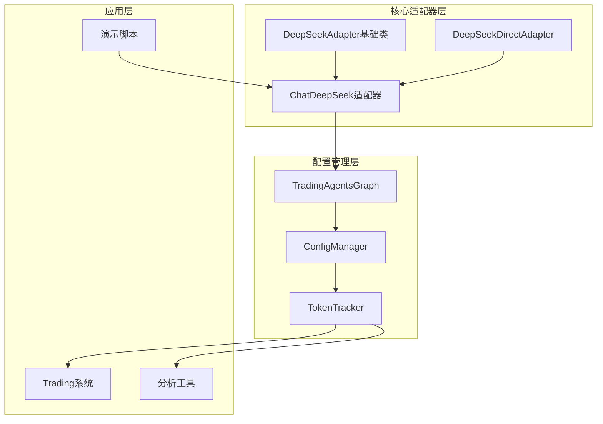
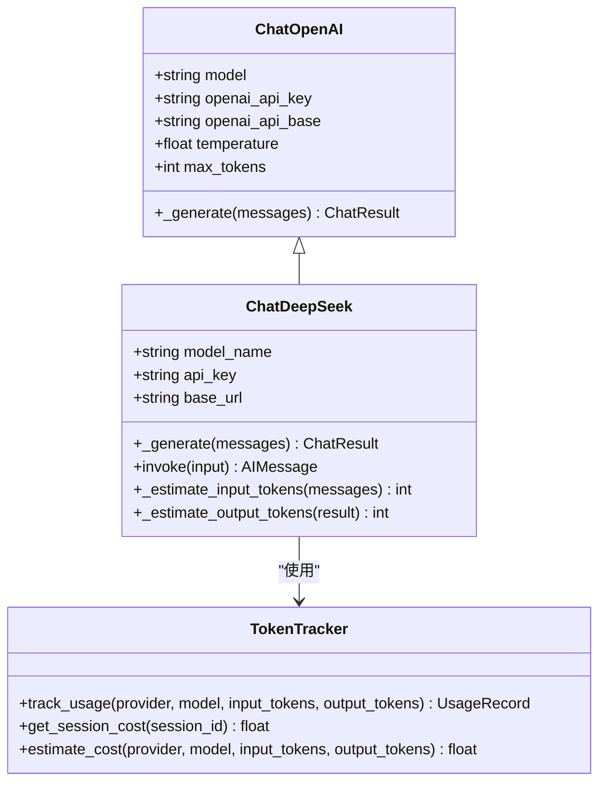
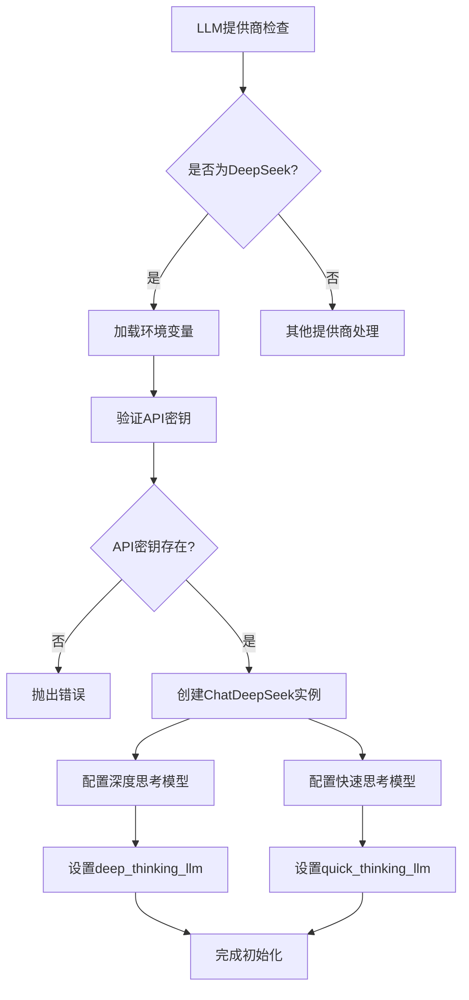
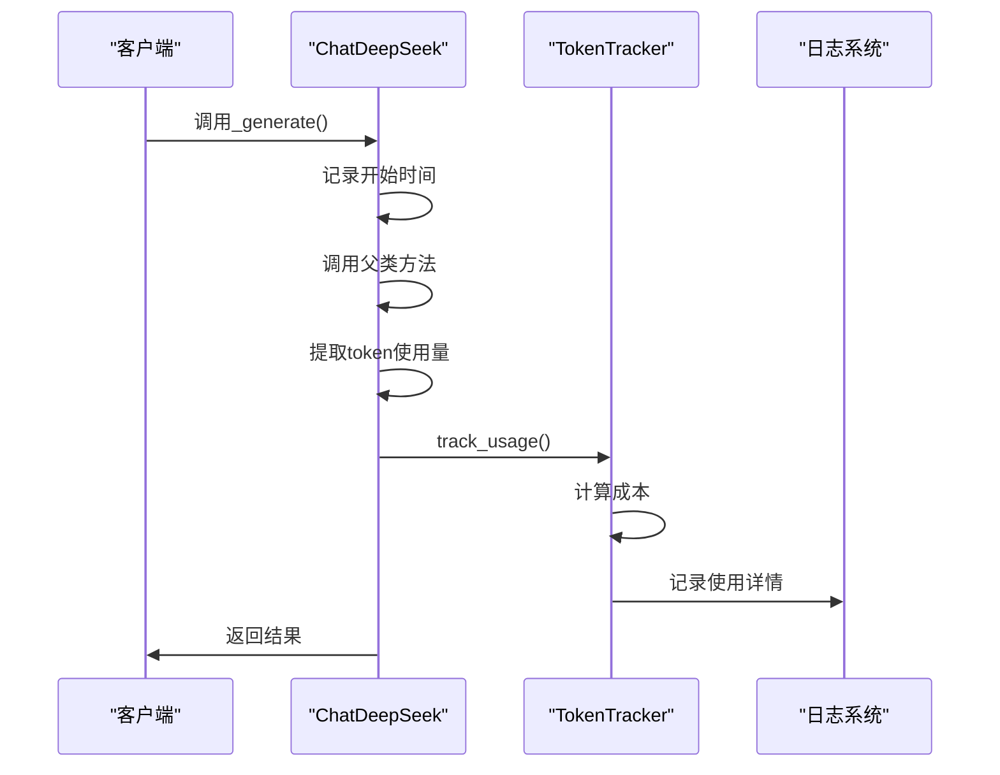
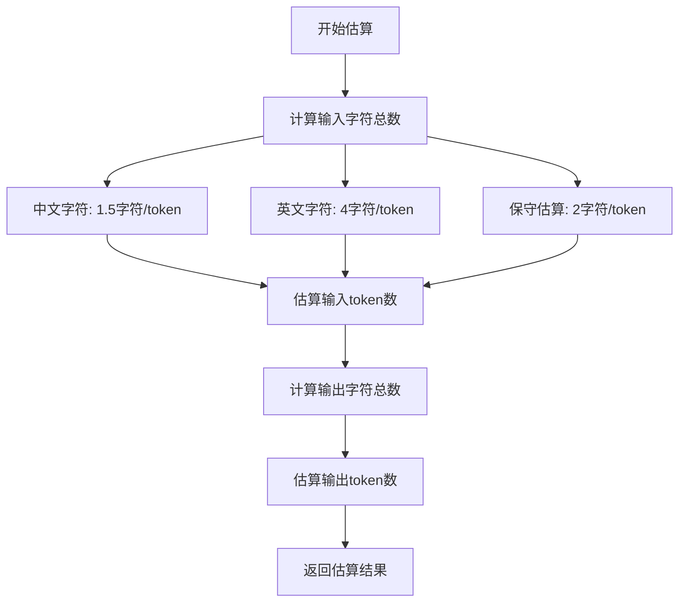
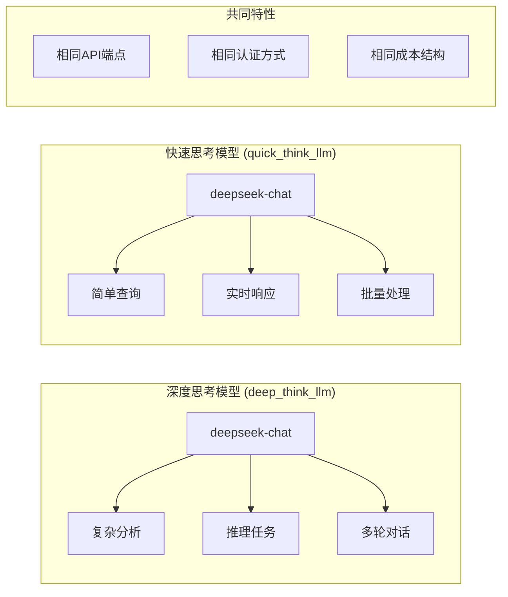
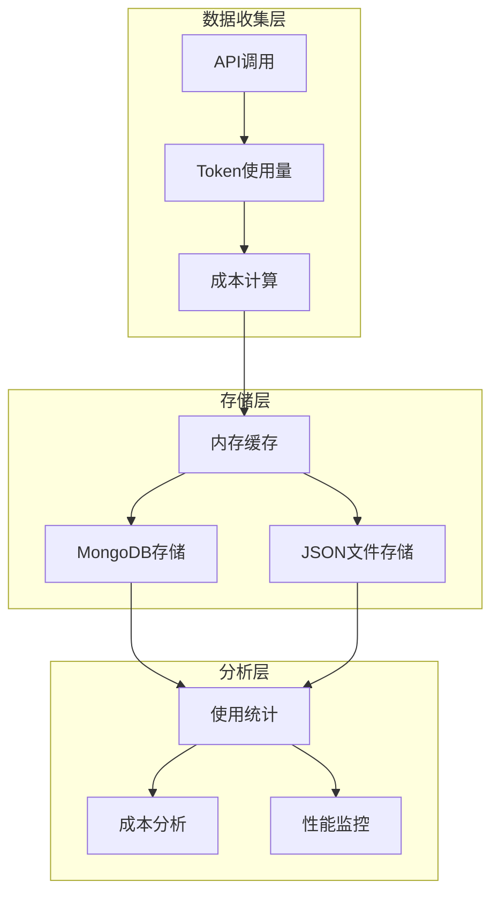

# DeepSeek 路由机制

<cite>
**本文档引用的文件**
- [trading_graph.py](file://tradingagents/graph/trading_graph.py)
- [deepseek_adapter.py](file://tradingagents/llm_adapters/deepseek_adapter.py)
- [deepseek_direct_adapter.py](file://tradingagents/llm_adapters/deepseek_direct_adapter.py)
- [default_config.py](file://tradingagents/default_config.py)
- [demo_deepseek_simple.py](file://examples/demo_deepseek_simple.py)
- [demo_deepseek_analysis.py](file://examples/demo_deepseek_analysis.py)
- [token_tracking_demo.py](file://examples/token_tracking_demo.py)
- [test_deepseek_integration.py](file://tests/test_deepseek_integration.py)
- [test_deepseek_token_tracking.py](file://tests/test_deepseek_token_tracking.py)
- [test_deepseek_cost_calculation.py](file://tests/test_deepseek_cost_calculation.py)
</cite>

## 目录
1. [简介](#简介)
2. [项目结构概览](#项目结构概览)
3. [DeepSeek适配器架构](#deepseek适配器架构)
4. [路由机制实现](#路由机制实现)
5. [Token统计核心功能](#token统计核心功能)
6. [模型配置策略](#模型配置策略)
7. [成本跟踪与性能监控](#成本跟踪与性能监控)
8. [实际代码示例](#实际代码示例)
9. [故障排除指南](#故障排除指南)
10. [总结](#总结)

## 简介

DeepSeek路由机制是TradingAgents框架中的核心组件，负责管理DeepSeek V3大语言模型的初始化、配置和使用。该机制通过自定义的ChatDeepSeek适配器实现了对DeepSeek API的无缝集成，同时提供了强大的Token使用统计和成本跟踪功能。

DeepSeek作为国内领先的AI模型提供商，在中文理解和金融分析领域具有显著优势。其路由机制不仅支持标准的LLM调用，还集成了先进的token统计功能，为用户提供精确的成本控制和性能监控能力。

## 项目结构概览

DeepSeek路由机制涉及多个关键文件和模块，形成了一个完整的生态系统：

**图表来源**
- [trading_graph.py](file://tradingagents/graph/trading_graph.py#L146-L182)
- [deepseek_adapter.py](file://tradingagents/llm_adapters/deepseek_adapter.py#L30-L85)

**章节来源**
- [trading_graph.py](file://tradingagents/graph/trading_graph.py#L1-L441)
- [deepseek_adapter.py](file://tradingagents/llm_adapters/deepseek_adapter.py#L1-L263)

## DeepSeek适配器架构

### ChatDeepSeek适配器设计

ChatDeepSeek适配器是DeepSeek路由机制的核心组件，继承自LangChain的ChatOpenAI类，专门针对DeepSeek API进行了优化：

**图表来源**
- [deepseek_adapter.py](file://tradingagents/llm_adapters/deepseek_adapter.py#L30-L85)
- [deepseek_adapter.py](file://tradingagents/llm_adapters/deepseek_adapter.py#L126-L150)

### 适配器初始化流程

DeepSeek适配器的初始化过程包含多个关键步骤：

1. **环境变量验证**：检查DEEPSEEK_API_KEY和DEEPSEEK_BASE_URL的存在
2. **参数解析**：处理模型名称、温度、最大token数等配置参数
3. **父类初始化**：调用ChatOpenAI的构造函数建立基础连接
4. **功能增强**：添加token统计和成本计算功能

**章节来源**
- [deepseek_adapter.py](file://tradingagents/llm_adapters/deepseek_adapter.py#L30-L85)

## 路由机制实现

### TradingAgentsGraph中的DeepSeek集成

在TradingAgentsGraph中，DeepSeek路由机制通过条件分支实现：

**图表来源**
- [trading_graph.py](file://tradingagents/graph/trading_graph.py#L146-L182)

### 环境变量配置

DeepSeek路由机制依赖两个关键的环境变量：

| 环境变量 | 描述 | 默认值 | 示例 |
|---------|------|--------|------|
| DEEPSEEK_API_KEY | DeepSeek API密钥 | 无 | sk-... |
| DEEPSEEK_BASE_URL | API端点URL | https://api.deepseek.com | https://api.deepseek.com |

系统会优先使用环境变量中的配置，如果未设置则使用默认值。这种设计确保了配置的灵活性和安全性。

**章节来源**
- [trading_graph.py](file://tradingagents/graph/trading_graph.py#L155-L165)

## Token统计核心功能

### Token使用量追踪机制

DeepSeek适配器内置了完整的Token使用量追踪系统：

**图表来源**
- [deepseek_adapter.py](file://tradingagents/llm_adapters/deepseek_adapter.py#L85-L150)

### Token估算算法

当无法从API响应中直接获取token使用量时，系统会使用估算算法：

**图表来源**
- [deepseek_adapter.py](file://tradingagents/llm_adapters/deepseek_adapter.py#L152-L175)

### 成本计算公式

DeepSeek的成本计算采用标准化的定价模型：

| 模型 | 输入价格/1K tokens | 输出价格/1K tokens | 适用场景 |
|------|-------------------|-------------------|----------|
| deepseek-chat | ¥0.0014 | ¥0.0028 | 通用对话分析 |
| deepseek-coder | ¥0.0014 | ¥0.0028 | 代码相关任务 |

**章节来源**
- [test_deepseek_cost_calculation.py](file://tests/test_deepseek_cost_calculation.py#L53-L90)

## 模型配置策略

### deep_think_llm和quick_think_llm配置

TradingAgents框架为DeepSeek提供了两种不同的模型配置策略：

**图表来源**
- [trading_graph.py](file://tradingagents/graph/trading_graph.py#L170-L180)

### 参数配置详解

| 参数 | 默认值 | 描述 | 优化建议 |
|------|--------|------|----------|
| temperature | 0.1 | 控制输出随机性 | 低值适合分析任务 |
| max_tokens | 2000 | 最大输出token数 | 根据任务复杂度调整 |
| model | deepseek-chat | 模型名称 | 优先选择deepseek-chat |

**章节来源**
- [trading_graph.py](file://tradingagents/graph/trading_graph.py#L170-L180)

## 成本跟踪与性能监控

### 统一成本跟踪系统

DeepSeek路由机制集成了完整的成本跟踪和性能监控系统：

**图表来源**
- [token_tracking_demo.py](file://examples/token_tracking_demo.py#L1-L284)

### 性能监控指标

系统提供以下关键性能指标：

| 指标类别 | 具体指标 | 监控目的 | 阈值建议 |
|----------|----------|----------|----------|
| 成本监控 | 单次调用成本 | 成本控制 | < ¥0.01 |
| 性能监控 | 响应时间 | 服务质量 | < 5秒 |
| 使用监控 | Token效率 | 资源利用 | 输入/输出比 > 2:1 |
| 错误监控 | 调用成功率 | 系统稳定性 | > 99% |

**章节来源**
- [test_deepseek_cost_calculation.py](file://tests/test_deepseek_cost_calculation.py#L53-L90)

## 实际代码示例

### 基础初始化示例

以下是DeepSeek适配器的基础初始化代码：

**章节来源**
- [demo_deepseek_simple.py](file://examples/demo_deepseek_simple.py#L15-L30)

### 高级配置示例

对于复杂的交易分析场景，可以使用更高级的配置：

**章节来源**
- [demo_deepseek_analysis.py](file://examples/demo_deepseek_analysis.py#L40-L60)

### 集成测试示例

系统提供了完整的集成测试来验证DeepSeek路由机制：

**章节来源**
- [test_deepseek_integration.py](file://tests/test_deepseek_integration.py#L132-L159)

## 故障排除指南

### 常见问题及解决方案

| 问题类型 | 症状 | 可能原因 | 解决方案 |
|----------|------|----------|----------|
| 认证失败 | ValueError: DeepSeek API密钥未找到 | 环境变量未设置 | 检查DEEPSEEK_API_KEY |
| 连接超时 | API调用超时 | 网络问题或API限制 | 检查网络连接和配额 |
| Token统计异常 | 无法记录使用量 | TokenTracker未启用 | 启用成本跟踪功能 |
| 成本计算错误 | 成本为0或异常值 | 定价配置错误 | 检查定价表配置 |

### 调试技巧

1. **启用详细日志**：设置日志级别为DEBUG查看详细信息
2. **检查环境变量**：确认DEEPSEEK_API_KEY和DEEPSEEK_BASE_URL正确
3. **测试API连通性**：使用简单的chat方法测试连接
4. **验证Token统计**：检查使用记录是否正确保存

**章节来源**
- [test_deepseek_integration.py](file://tests/test_deepseek_integration.py#L15-L39)

## 总结

DeepSeek路由机制为TradingAgents框架提供了强大而灵活的AI模型集成能力。通过ChatDeepSeek适配器，系统实现了：

1. **无缝集成**：支持DeepSeek V3的所有功能特性
2. **智能统计**：自动追踪Token使用量和成本
3. **性能优化**：提供精确的成本控制和性能监控
4. **易于配置**：通过环境变量和配置文件简化部署
5. **扩展性强**：支持多种使用场景和配置策略

该机制不仅提高了系统的智能化水平，还为用户提供了透明、可控的成本管理方案，是TradingAgents框架中不可或缺的重要组成部分。随着DeepSeek模型的持续优化和功能增强，该路由机制将继续为用户提供更优质的AI服务体验。