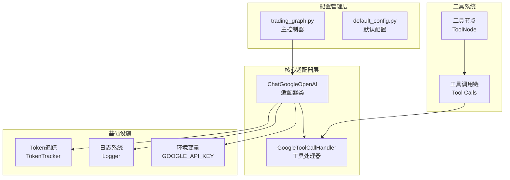
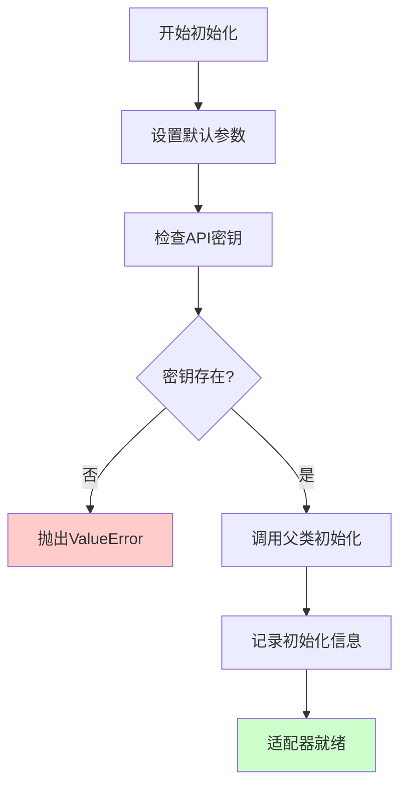
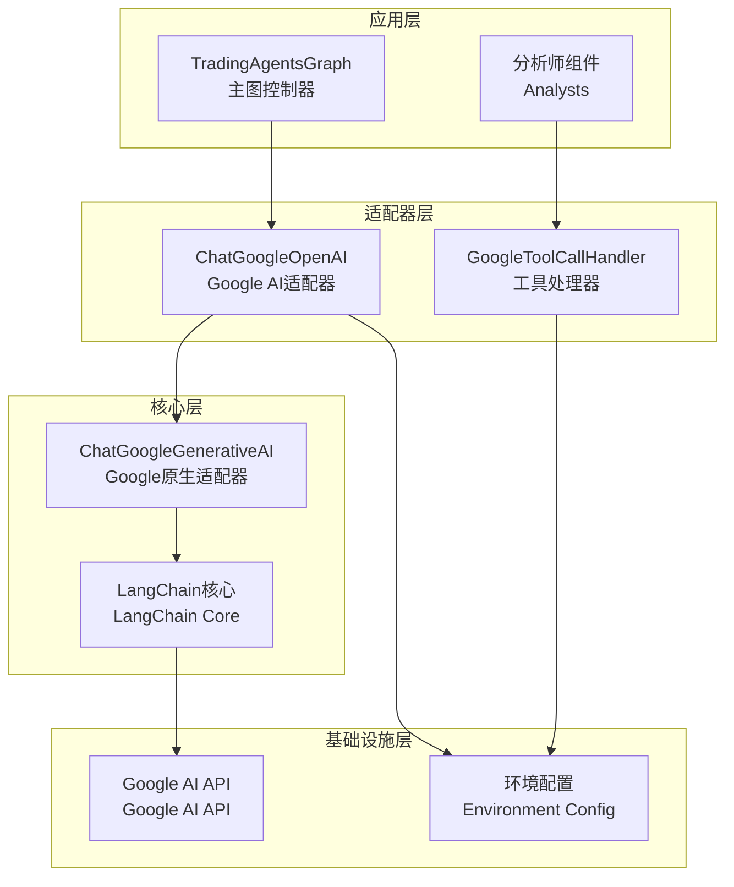
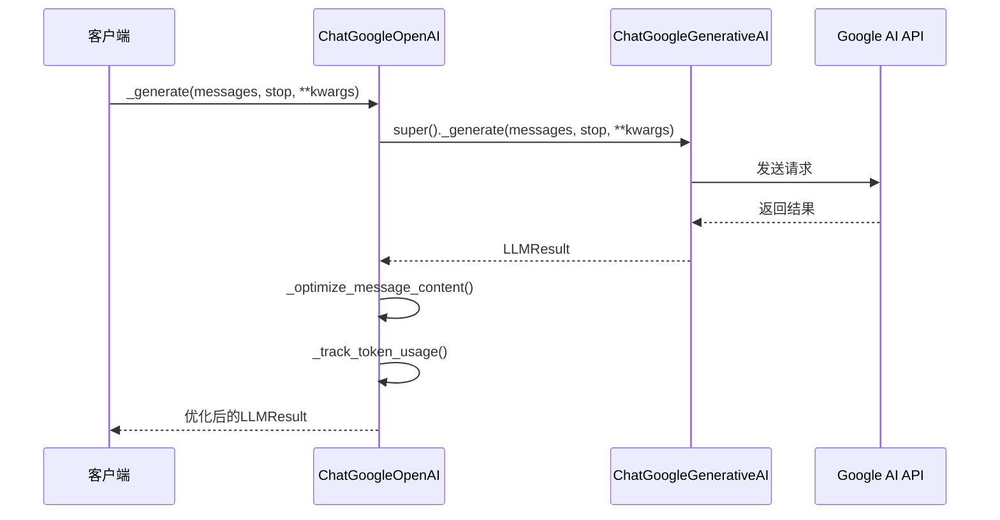
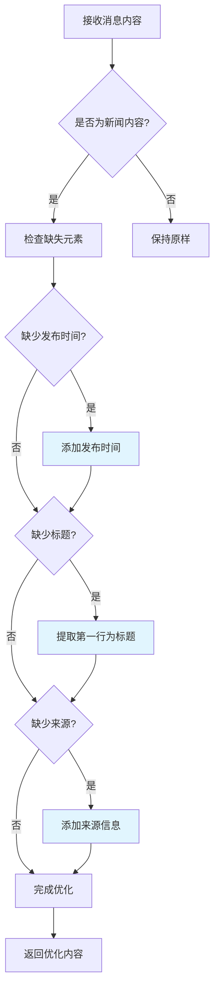
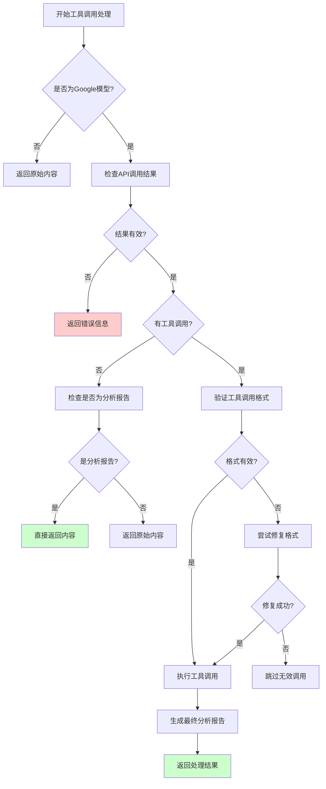
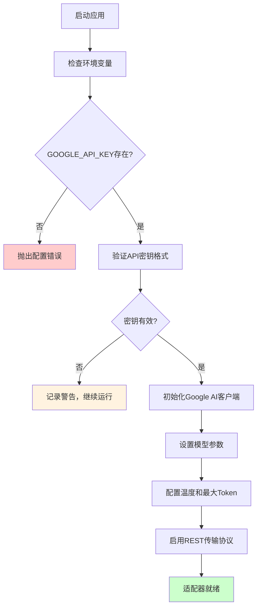
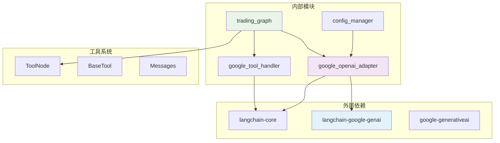

# Google AI 路由机制

<cite>
**本文档中引用的文件**
- [trading_graph.py](file://tradingagents/graph/trading_graph.py)
- [google_openai_adapter.py](file://tradingagents/llm_adapters/google_openai_adapter.py)
- [google_tool_handler.py](file://tradingagents/agents/utils/google_tool_handler.py)
- [__init__.py](file://tradingagents/llm_adapters/__init__.py)
- [default_config.py](file://tradingagents/default_config.py)
- [openai_compatible_base.py](file://tradingagents/llm_adapters/openai_compatible_base.py)
</cite>

## 目录
1. [简介](#简介)
2. [项目结构概览](#项目结构概览)
3. [核心组件分析](#核心组件分析)
4. [架构概览](#架构概览)
5. [详细组件分析](#详细组件分析)
6. [依赖关系分析](#依赖关系分析)
7. [性能考虑](#性能考虑)
8. [故障排除指南](#故障排除指南)
9. [结论](#结论)

## 简介

Google AI 路由机制是 TradingAgents 项目中的核心组件，专门设计用于解决原生 Google AI 模型（Gemini）与 LangChain 工具系统之间的兼容性问题。该机制通过 ChatGoogleOpenAI 适配器实现了对 Google AI 模型的 OpenAI 兼容封装，确保在复杂的工具调用场景下能够稳定运行。

该系统的主要目标是：
- 解决 Google AI 模型工具调用格式不兼容的问题
- 提供与 LangChain 生态系统的完全兼容性
- 优化消息内容格式以满足不同分析师的需求
- 实现可靠的错误处理和降级策略
- 支持多种 Google AI 模型的灵活配置

## 项目结构概览

Google AI 路由机制涉及多个关键模块的协同工作：

**图表来源**
- [trading_graph.py](file://tradingagents/graph/trading_graph.py#L120-L148)
- [google_openai_adapter.py](file://tradingagents/llm_adapters/google_openai_adapter.py#L20-L50)

**章节来源**
- [trading_graph.py](file://tradingagents/graph/trading_graph.py#L1-L50)
- [google_openai_adapter.py](file://tradingagents/llm_adapters/google_openai_adapter.py#L1-L50)

## 核心组件分析

### ChatGoogleOpenAI 适配器

ChatGoogleOpenAI 是整个 Google AI 路由机制的核心适配器，继承自 `ChatGoogleGenerativeAI` 并针对 TradingAgents 的需求进行了深度优化。

#### 主要特性

1. **OpenAI 兼容性**：完全兼容 OpenAI 格式的 API 调用
2. **工具调用优化**：专门处理 Google AI 模型的工具调用格式
3. **内容格式化**：自动优化返回内容的格式和结构
4. **错误恢复**：强大的错误处理和降级机制
5. **Token 追踪**：详细的使用量监控和统计

#### 初始化配置

适配器采用标准化的初始化流程，确保配置的一致性和可靠性：

**图表来源**
- [google_openai_adapter.py](file://tradingagents/llm_adapters/google_openai_adapter.py#L27-L50)

**章节来源**
- [google_openai_adapter.py](file://tradingagents/llm_adapters/google_openai_adapter.py#L20-L77)

### GoogleToolCallHandler 工具处理器

GoogleToolCallHandler 是专门处理 Google AI 模型工具调用的统一处理器，解决了原生 Google 模型在工具调用时的一些固有问题。

#### 核心功能

1. **工具调用验证**：严格验证工具调用的格式和完整性
2. **格式转换**：将不同格式的工具调用转换为统一格式
3. **错误修复**：自动修复常见的工具调用格式问题
4. **消息优化**：优化消息序列以提高处理效率
5. **降级处理**：在工具调用失败时提供合理的降级方案

**章节来源**
- [google_tool_handler.py](file://tradingagents/agents/utils/google_tool_handler.py#L1-L100)

## 架构概览

Google AI 路由机制的整体架构体现了分层设计和模块化原则：

**图表来源**
- [trading_graph.py](file://tradingagents/graph/trading_graph.py#L120-L148)
- [google_openai_adapter.py](file://tradingagents/llm_adapters/google_openai_adapter.py#L20-L50)

## 详细组件分析

### ChatGoogleOpenAI 适配器详细分析

#### 方法重写机制

适配器通过重写 `_generate` 方法实现了对工具调用处理的深度优化：

**图表来源**
- [google_openai_adapter.py](file://tradingagents/llm_adapters/google_openai_adapter.py#L52-L77)

#### 内容优化策略

适配器实现了智能的内容优化机制，特别针对新闻内容进行了专门处理：

**图表来源**
- [google_openai_adapter.py](file://tradingagents/llm_adapters/google_openai_adapter.py#L79-L134)

**章节来源**
- [google_openai_adapter.py](file://tradingagents/llm_adapters/google_openai_adapter.py#L52-L166)

### GoogleToolCallHandler 工具处理器详细分析

#### 工具调用处理流程

GoogleToolCallHandler 实现了复杂的工具调用处理逻辑，确保在各种异常情况下都能提供稳定的处理能力：

**图表来源**
- [google_tool_handler.py](file://tradingagents/agents/utils/google_tool_handler.py#L30-L200)

#### 错误处理和降级机制

工具处理器实现了多层次的错误处理和降级策略：

| 错误类型 | 处理策略 | 降级方案 |
|---------|---------|---------|
| API 调用失败 | 记录错误日志，返回错误信息 | 返回"Google模型API调用失败" |
| 工具调用格式错误 | 自动修复格式或跳过无效调用 | 使用原始内容继续处理 |
| 工具执行异常 | 记录详细错误信息，返回错误描述 | 基于工具结果生成简单报告 |
| 模型响应为空 | 重试机制，最多3次 | 使用降级报告替代 |
| 消息序列过长 | 自动截断和优化 | 保留关键消息，移除冗余内容 |

**章节来源**
- [google_tool_handler.py](file://tradingagents/agents/utils/google_tool_handler.py#L30-L400)

### 环境变量和身份验证

系统通过环境变量 `GOOGLE_API_KEY` 实现身份验证，提供了灵活的配置方式：

**图表来源**
- [trading_graph.py](file://tradingagents/graph/trading_graph.py#L120-L148)

**章节来源**
- [trading_graph.py](file://tradingagents/graph/trading_graph.py#L120-L148)

## 依赖关系分析

Google AI 路由机制的依赖关系体现了良好的模块化设计：

**图表来源**
- [google_openai_adapter.py](file://tradingagents/llm_adapters/google_openai_adapter.py#L1-L20)
- [trading_graph.py](file://tradingagents/graph/trading_graph.py#L1-L30)

**章节来源**
- [google_openai_adapter.py](file://tradingagents/llm_adapters/google_openai_adapter.py#L1-L30)
- [trading_graph.py](file://tradingagents/graph/trading_graph.py#L1-L30)

## 性能考虑

### Token 使用优化

系统实现了详细的 Token 使用追踪机制，帮助用户了解和控制成本：

- **输入/输出 Token 分离追踪**：精确记录每笔调用的输入和输出 Token 数量
- **会话级别追踪**：为每个会话生成唯一的会话 ID，便于追踪和分析
- **分析类型分类**：根据不同的分析类型（如股票分析、市场分析）进行分类统计
- **实时监控**：提供实时的使用量统计和成本估算

### 消息序列优化

为了应对 Google AI 模型的消息长度限制，系统实现了智能的消息序列优化：

- **长度检测**：自动检测消息序列的总长度
- **关键消息保留**：优先保留用户消息、工具调用结果和分析提示
- **内容截断**：对过长的工具调用结果进行安全截断
- **格式优化**：移除冗余消息，减少不必要的上下文信息

### 错误恢复策略

系统实现了多层次的错误恢复机制：

- **指数退避重试**：对于临时性错误，采用指数退避算法进行重试
- **降级处理**：在严重错误情况下，提供基于工具结果的降级报告
- **异常隔离**：确保单个工具调用的失败不会影响整体流程
- **状态恢复**：在错误恢复后，尽可能恢复之前的状态

## 故障排除指南

### 常见问题及解决方案

#### API 密钥问题

**问题症状**：`ValueError: Google API key not found`

**解决方案**：
1. 检查环境变量 `GOOGLE_API_KEY` 是否正确设置
2. 验证 API 密钥的有效性
3. 确认密钥具有访问 Google AI 模型的权限

#### 工具调用失败

**问题症状**：工具调用返回空内容或格式错误

**排查步骤**：
1. 检查工具绑定是否正确
2. 验证工具参数格式
3. 查看详细的错误日志
4. 尝试使用不同的工具调用格式

#### 模型响应异常

**问题症状**：模型返回意外的内容或格式

**解决方案**：
1. 检查模型参数配置
2. 验证输入消息格式
3. 尝试使用不同的模型变体
4. 检查网络连接稳定性

**章节来源**
- [google_openai_adapter.py](file://tradingagents/llm_adapters/google_openai_adapter.py#L52-L77)
- [google_tool_handler.py](file://tradingagents/agents/utils/google_tool_handler.py#L30-L100)

## 结论

Google AI 路由机制通过 ChatGoogleOpenAI 适配器和 GoogleToolCallHandler 工具处理器的协同工作，成功解决了原生 Google AI 模型与 LangChain 工具系统之间的兼容性问题。该机制具有以下优势：

1. **完全兼容性**：通过 OpenAI 兼容接口，确保与现有系统的无缝集成
2. **智能优化**：自动优化消息格式和工具调用处理流程
3. **健壮性**：强大的错误处理和降级机制保证系统稳定性
4. **可扩展性**：模块化设计便于功能扩展和维护
5. **性能优化**：详细的 Token 追踪和消息序列优化提升系统效率

该机制不仅解决了当前的技术挑战，还为未来的功能扩展奠定了坚实的基础，是 TradingAgents 项目中不可或缺的核心组件。