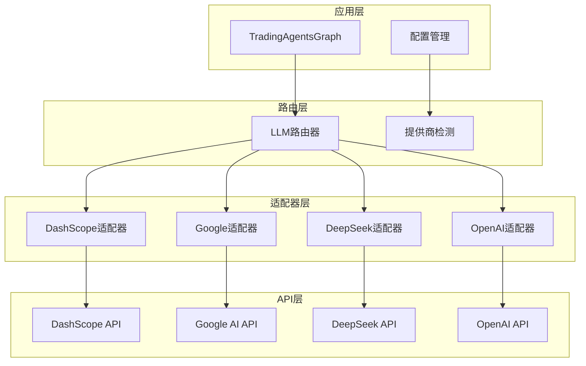
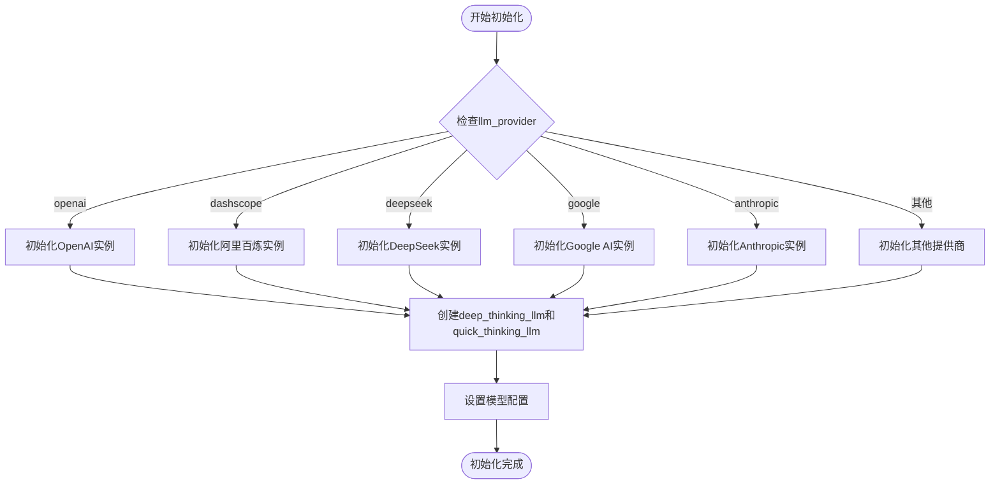
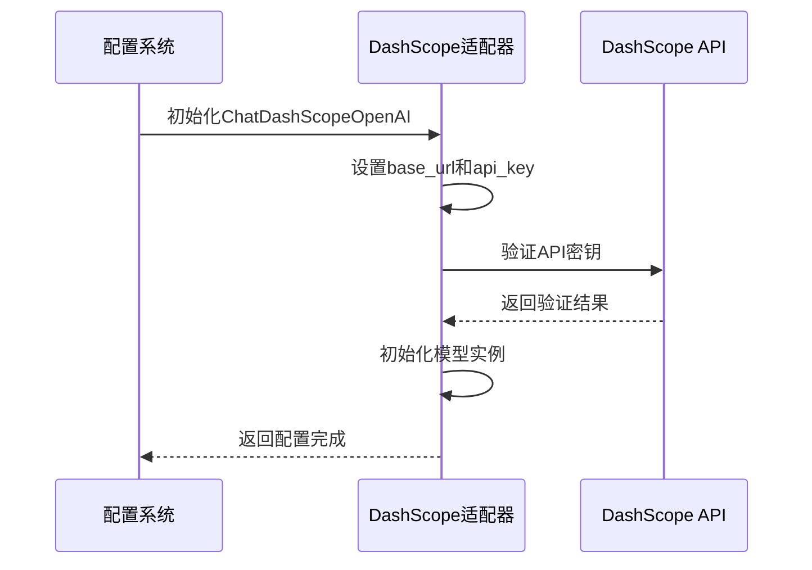
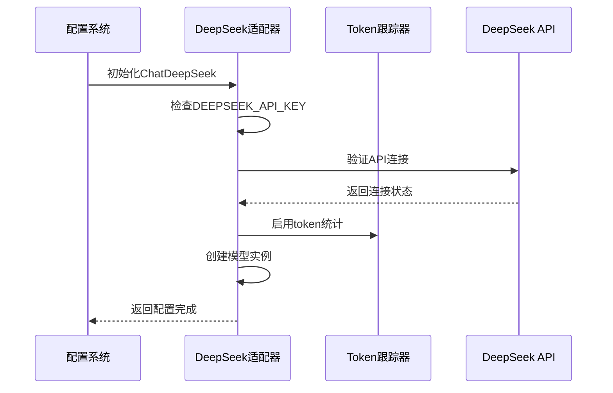
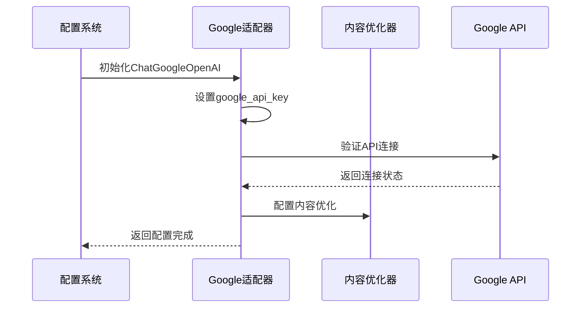
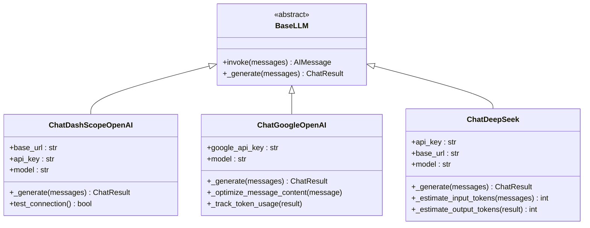
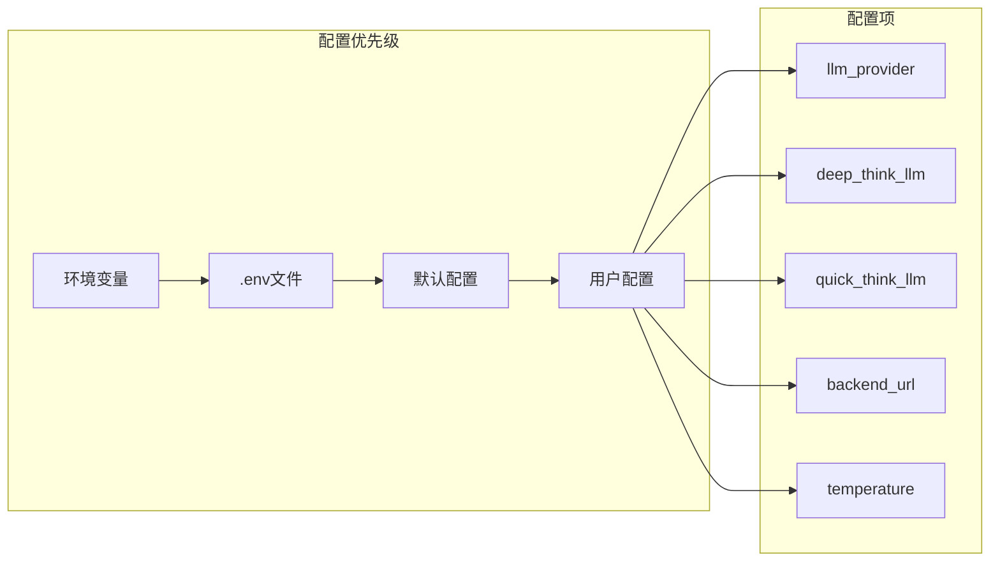
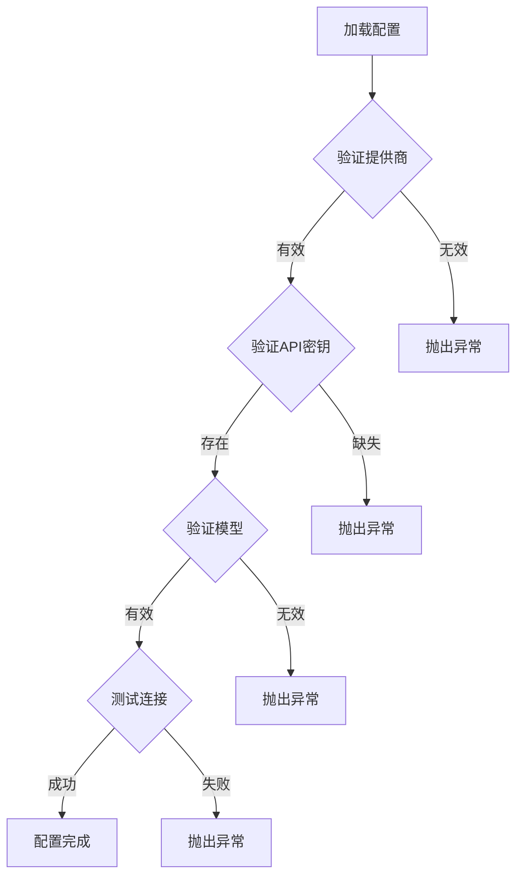
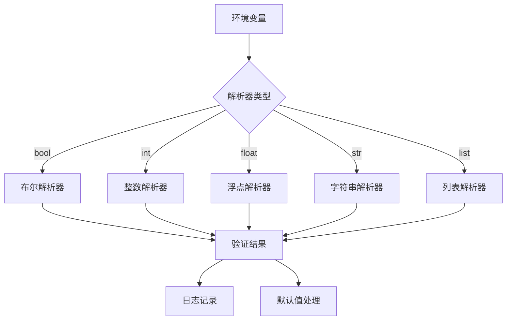
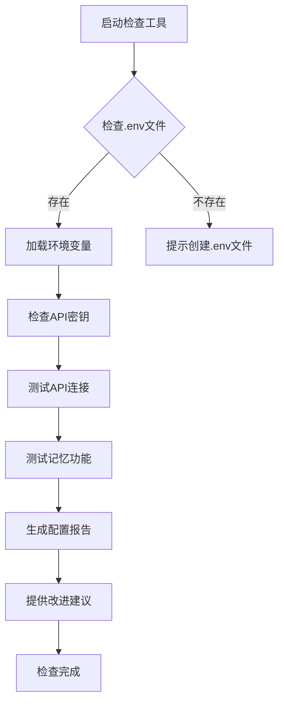

# LLM提供商路由机制

<cite>
**本文档中引用的文件**
- [trading_graph.py](file://tradingagents/graph/trading_graph.py)
- [dashscope_openai_adapter.py](file://tradingagents/llm_adapters/dashscope_openai_adapter.py)
- [google_openai_adapter.py](file://tradingagents/llm_adapters/google_openai_adapter.py)
- [deepseek_adapter.py](file://tradingagents/llm_adapters/deepseek_adapter.py)
- [default_config.py](file://tradingagents/default_config.py)
- [env_utils.py](file://tradingagents/config/env_utils.py)
- [config_manager.py](file://tradingagents/config/config_manager.py)
- [check_api_config.py](file://scripts/check_api_config.py)
- [demo_deepseek_analysis.py](file://examples/demo_deepseek_analysis.py)
</cite>

## 目录
1. [简介](#简介)
2. [系统架构概述](#系统架构概述)
3. [LLM提供商路由机制](#llm提供商路由机制)
4. [适配器模式详解](#适配器模式详解)
5. [配置管理](#配置管理)
6. [环境变量管理](#环境变量管理)
7. [故障排除指南](#故障排除指南)
8. [最佳实践](#最佳实践)
9. [总结](#总结)

## 简介

TradingAgents系统采用了一套高度灵活的LLM提供商路由机制，允许用户在多个大语言模型提供商之间无缝切换。该系统支持包括阿里百炼（DashScope）、DeepSeek、Google AI、OpenAI、Anthropic等多种主流LLM提供商，通过统一的接口抽象层实现标准化的模型访问。

这种设计不仅提供了最大的灵活性，还确保了系统的可扩展性和维护性。无论用户偏好哪个LLM提供商，都可以通过相同的配置接口获得一致的使用体验。

## 系统架构概述

TradingAgents的LLM路由系统采用了分层架构设计，主要包括以下几个层次：



**图表来源**
- [trading_graph.py](file://tradingagents/graph/trading_graph.py#L39-L441)

## LLM提供商路由机制

### 核心路由逻辑

TradingAgents的核心路由逻辑实现在`TradingAgentsGraph`类的初始化过程中。系统根据配置的`llm_provider`值选择相应的LLM实例：



**图表来源**
- [trading_graph.py](file://tradingagents/graph/trading_graph.py#L55-L212)

### 不同提供商的初始化流程

#### 1. 阿里百炼（DashScope）初始化

阿里百炼是系统推荐的主要提供商，采用OpenAI兼容适配器：



**图表来源**
- [dashscope_openai_adapter.py](file://tradingagents/llm_adapters/dashscope_openai_adapter.py#L25-L60)

#### 2. DeepSeek初始化

DeepSeek V3采用专门的适配器，支持详细的token使用统计：



**图表来源**
- [deepseek_adapter.py](file://tradingagents/llm_adapters/deepseek_adapter.py#L30-L80)

#### 3. Google AI初始化

Google AI采用专门的OpenAI兼容适配器，解决工具调用格式问题：



**图表来源**
- [google_openai_adapter.py](file://tradingagents/llm_adapters/google_openai_adapter.py#L25-L60)

**节来源**
- [trading_graph.py](file://tradingagents/graph/trading_graph.py#L55-L212)

## 适配器模式详解

### 适配器架构设计

系统采用适配器模式来统一不同LLM提供商的接口差异：



**图表来源**
- [dashscope_openai_adapter.py](file://tradingagents/llm_adapters/dashscope_openai_adapter.py#L20-L40)
- [google_openai_adapter.py](file://tradingagents/llm_adapters/google_openai_adapter.py#L20-L40)
- [deepseek_adapter.py](file://tradingagents/llm_adapters/deepseek_adapter.py#L25-L50)

### 深度思考与快速思考模型配置

系统为不同的分析任务配置了专门的模型实例：

| 配置项 | 描述 | 推荐用途 |
|--------|------|----------|
| `deep_thinking_llm` | 深度思考模型 | 复杂分析、推理、深度研究 |
| `quick_thinking_llm` | 快速思考模型 | 日常对话、简单任务、实时响应 |

**配置示例：**

```python
# 阿里百炼配置
config = {
    "llm_provider": "dashscope",
    "deep_think_llm": "qwen-plus-latest",
    "quick_think_llm": "qwen-turbo"
}

# DeepSeek配置  
config = {
    "llm_provider": "deepseek",
    "deep_think_llm": "deepseek-chat",
    "quick_think_llm": "deepseek-chat"
}

# Google AI配置
config = {
    "llm_provider": "google",
    "deep_think_llm": "gemini-2.5-flash-lite-preview-06-17",
    "quick_think_llm": "gemini-2.0-flash"
}
```

**节来源**
- [trading_graph.py](file://tradingagents/graph/trading_graph.py#L146-L182)
- [default_config.py](file://tradingagents/default_config.py#L13-L16)

## 配置管理

### 默认配置结构

系统提供了灵活的配置管理机制，支持多种配置来源：



**图表来源**
- [default_config.py](file://tradingagents/default_config.py#L1-L28)

### 配置验证机制

系统实现了多层次的配置验证：



**图表来源**
- [config_manager.py](file://tradingagents/config/config_manager.py#L478-L496)

**节来源**
- [default_config.py](file://tradingagents/default_config.py#L1-L28)
- [config_manager.py](file://tradingagents/config/config_manager.py#L478-L496)

## 环境变量管理

### 环境变量配置表

| 环境变量 | 描述 | 示例值 | 必需性 |
|----------|------|--------|--------|
| `DASHSCOPE_API_KEY` | 阿里百炼API密钥 | `sk-xxx...` | 推荐 |
| `DEEPSEEK_API_KEY` | DeepSeek API密钥 | `sk-xxx...` | 可选 |
| `GOOGLE_API_KEY` | Google AI API密钥 | `AIzaSyxxx...` | 可选 |
| `OPENAI_API_KEY` | OpenAI API密钥 | `sk-xxx...` | 可选 |
| `ANTHROPIC_API_KEY` | Anthropic API密钥 | `sk-ant-xxx...` | 可选 |
| `FINNHUB_API_KEY` | Finnhub金融数据API密钥 | `xxx...` | 必需 |
| `TUSHARE_TOKEN` | Tushare A股数据API密钥 | `xxx...` | 可选 |

### 环境变量解析工具

系统提供了强大的环境变量解析工具，支持多种数据类型的自动转换：



**图表来源**
- [env_utils.py](file://tradingagents/config/env_utils.py#L10-L50)

**节来源**
- [env_utils.py](file://tradingagents/config/env_utils.py#L1-L245)

## 故障排除指南

### 常见配置错误及解决方案

#### 1. API密钥配置错误

**问题症状：**
```
ValueError: 使用DeepSeek需要设置DEEPSEEK_API_KEY环境变量
```

**解决方案：**
```bash
# 1. 检查.env文件是否存在
ls -la .env

# 2. 配置API密钥
echo "DEEPSEEK_API_KEY=your_actual_api_key_here" >> .env

# 3. 验证配置
python scripts/check_api_config.py
```

#### 2. 网络连接问题

**问题症状：**
```
ConnectionError: Unable to connect to LLM provider
```

**解决方案：**
```python
# 检查网络连接
import requests
try:
    response = requests.get("https://api.deepseek.com/v1/models", timeout=10)
    print("网络连接正常")
except Exception as e:
    print(f"网络连接失败: {e}")
```

#### 3. 模型不可用

**问题症状：**
```
HTTPError: 404 Client Error: Not Found
```

**解决方案：**
```python
# 检查可用模型
from tradingagents.llm_adapters.dashscope_openai_adapter import get_available_openai_models
models = get_available_openai_models()
print("可用模型:", list(models.keys()))
```

### 配置检查工具

系统提供了专门的配置检查工具：



**图表来源**
- [check_api_config.py](file://scripts/check_api_config.py#L15-L50)

### 调试技巧

#### 1. 启用详细日志

```python
import logging
logging.basicConfig(level=logging.DEBUG)

# 或在配置中设置
config = {
    "debug": True,
    "log_level": "DEBUG"
}
```

#### 2. 单独测试LLM连接

```python
# 测试DeepSeek连接
from tradingagents.llm_adapters.deepseek_adapter import ChatDeepSeek
llm = ChatDeepSeek(model="deepseek-chat")
response = llm.invoke("Hello, this is a test.")
print(response.content)
```

**节来源**
- [check_api_config.py](file://scripts/check_api_config.py#L1-L197)
- [demo_deepseek_analysis.py](file://examples/demo_deepseek_analysis.py#L1-L300)

## 最佳实践

### 1. 配置管理最佳实践

- **使用.env文件管理敏感信息**：避免在代码中硬编码API密钥
- **设置合理的默认值**：为非关键配置提供合理的默认值
- **实施配置验证**：在应用启动时验证所有必需的配置项
- **提供配置模板**：为用户提供.env.example文件作为参考

### 2. 性能优化建议

- **选择合适的模型**：根据任务复杂度选择深度思考或快速思考模型
- **合理设置温度参数**：0.1用于分析任务，0.7用于创意任务
- **监控token使用**：定期检查各提供商的token使用情况和成本
- **缓存常用响应**：对重复的分析请求实施缓存机制

### 3. 安全考虑

- **保护API密钥**：确保.env文件不在版本控制系统中提交
- **实施访问控制**：限制对配置文件的访问权限
- **定期轮换密钥**：建立API密钥定期更新流程
- **监控异常使用**：设置token使用量告警机制

### 4. 可扩展性设计

- **模块化适配器**：每个LLM提供商都有独立的适配器模块
- **统一接口**：所有适配器都实现相同的基础接口
- **插件式架构**：新LLM提供商可以轻松集成到系统中
- **向后兼容**：新版本保持对旧配置的兼容性

## 总结

TradingAgents的LLM提供商路由机制通过精心设计的分层架构和适配器模式，实现了对多个大语言模型提供商的统一管理和无缝切换。该系统具有以下核心优势：

1. **高度灵活性**：支持多种主流LLM提供商，用户可根据需求自由选择
2. **统一接口**：通过适配器模式隐藏不同提供商的API差异
3. **完善的配置管理**：提供多层次的配置验证和错误处理机制
4. **强大的故障排除能力**：内置诊断工具和详细的错误信息
5. **良好的可扩展性**：易于集成新的LLM提供商和功能特性

这种设计不仅满足了当前的功能需求，也为未来的扩展和优化奠定了坚实的基础。无论是对于个人用户还是企业部署，这套LLM路由机制都能提供稳定、高效、易用的大语言模型服务。