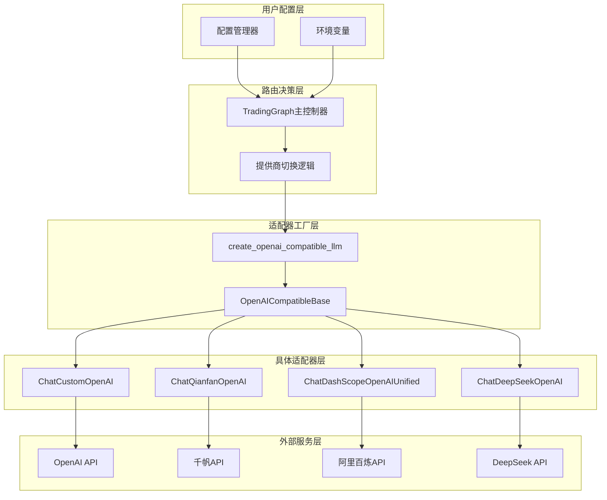
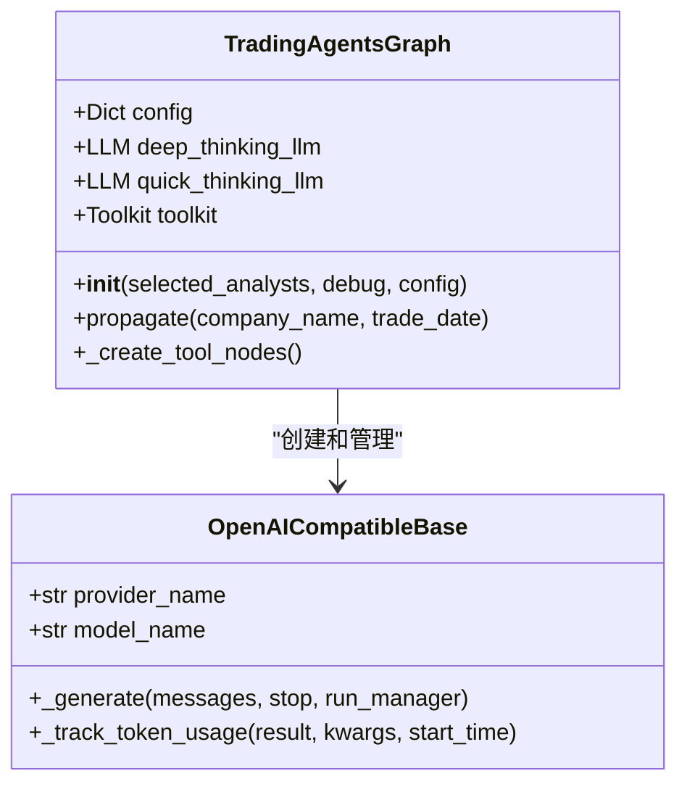
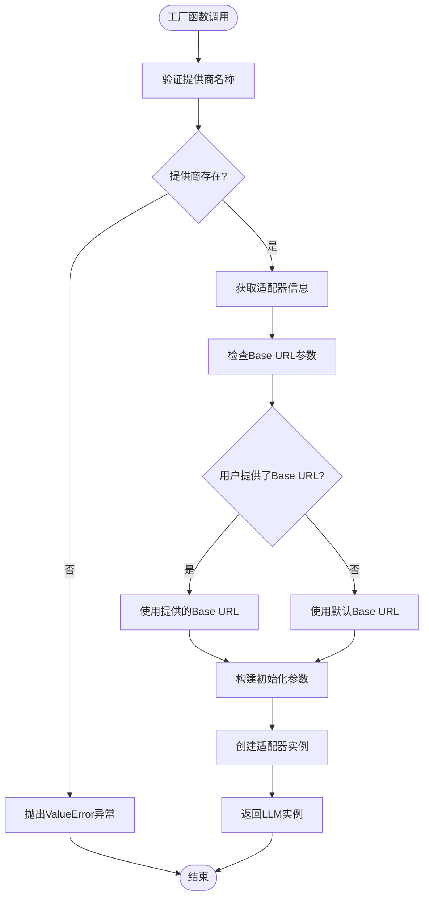
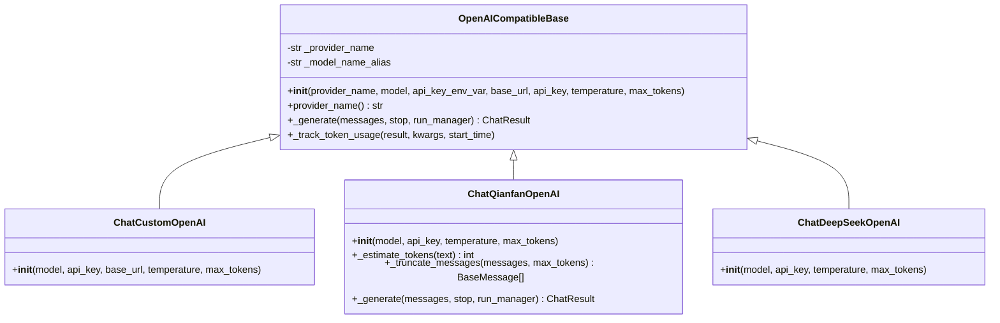
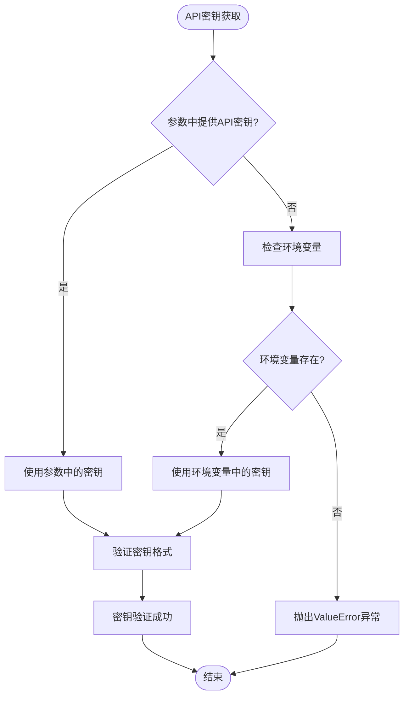
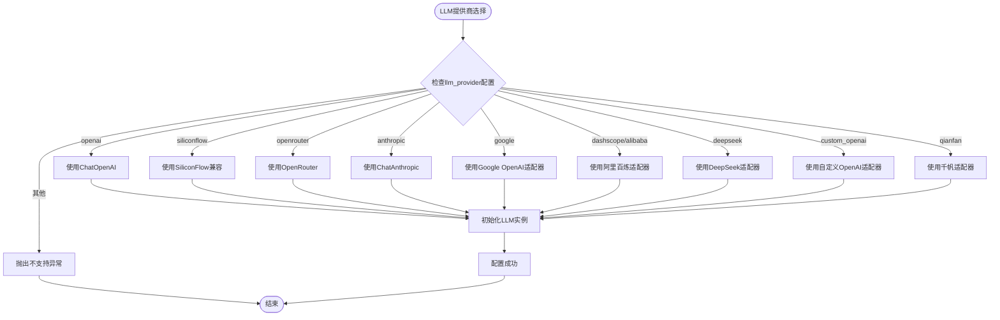
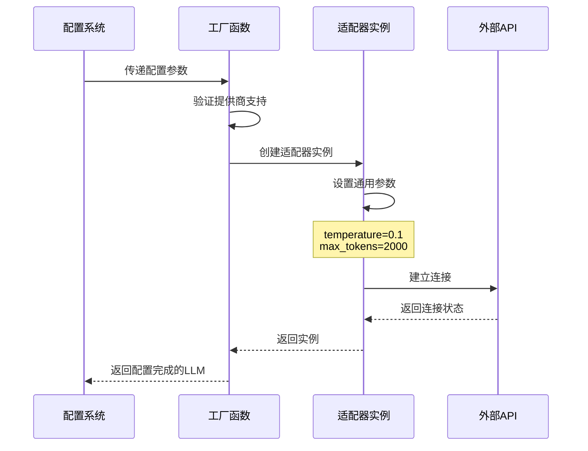
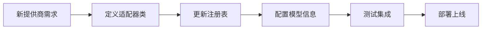

# OpenAI 兼容型提供商路由机制

<cite>
**本文档引用的文件**
- [trading_graph.py](file://tradingagents/graph/trading_graph.py)
- [openai_compatible_base.py](file://tradingagents/llm_adapters/openai_compatible_base.py)
- [deepseek_adapter.py](file://tradingagents/llm_adapters/deepseek_adapter.py)
- [dashscope_adapter.py](file://tradingagents/llm_adapters/dashscope_adapter.py)
- [default_config.py](file://tradingagents/default_config.py)
- [config_manager.py](file://tradingagents/config/config_manager.py)
- [test_graph_routing.py](file://tests/test_graph_routing.py)
- [test_qianfan_connect.py](file://scripts/test_qianfan_connect.py)
</cite>

## 目录
1. [简介](#简介)
2. [系统架构概述](#系统架构概述)
3. [核心组件分析](#核心组件分析)
4. [工厂函数设计](#工厂函数设计)
5. [适配器基类架构](#适配器基类架构)
6. [环境变量配置机制](#环境变量配置机制)
7. [路由分支逻辑](#路由分支逻辑)
8. [参数配置模式](#参数配置模式)
9. [扩展性设计](#扩展性设计)
10. [故障排除指南](#故障排除指南)
11. [总结](#总结)

## 简介

TradingAgents-CN系统采用了一套高度模块化的OpenAI兼容型提供商路由机制，通过统一的工厂函数和适配器基类，实现了对多种大语言模型提供商的无缝集成。该机制的核心设计理念是"一次配置，多处使用"，为用户提供了一个统一的接口来访问不同的AI服务提供商。

系统支持的主要提供商包括：
- **自定义OpenAI端点**（custom_openai）
- **百度千帆平台**（qianfan）
- **阿里云百炼**（dashscope）
- **DeepSeek**（deepseek）
- **OpenAI官方API**（openai）
- **Google AI**（google）
- **Anthropic Claude**（anthropic）

## 系统架构概述



**图表来源**
- [trading_graph.py](file://tradingagents/graph/trading_graph.py#L184-L235)
- [openai_compatible_base.py](file://tradingagents/llm_adapters/openai_compatible_base.py#L381-L413)

## 核心组件分析

### TradingGraph 主控制器

TradingGraph是整个系统的协调中心，负责根据配置选择合适的LLM提供商并初始化相应的适配器实例。



**图表来源**
- [trading_graph.py](file://tradingagents/graph/trading_graph.py#L35-L441)
- [openai_compatible_base.py](file://tradingagents/llm_adapters/openai_compatible_base.py#L31-L136)

**章节来源**
- [trading_graph.py](file://tradingagents/graph/trading_graph.py#L35-L441)

### 适配器注册表

系统维护了一个统一的适配器注册表，包含了所有支持的OpenAI兼容提供商的详细信息：

| 提供商 | 适配器类 | 默认Base URL | 支持的功能 |
|--------|----------|--------------|------------|
| deepseek | ChatDeepSeekOpenAI | https://api.deepseek.com | 函数调用、Token统计 |
| dashscope | ChatDashScopeOpenAIUnified | https://dashscope.aliyuncs.com/compatible-mode/v1 | 函数调用、多模态 |
| qianfan | ChatQianfanOpenAI | https://qianfan.baidubce.com/v2 | 中文优化、消息截断 |
| custom_openai | ChatCustomOpenAI | 用户自定义 | 通用OpenAI兼容 |

**章节来源**
- [openai_compatible_base.py](file://tradingagents/llm_adapters/openai_compatible_base.py#L320-L370)

## 工厂函数设计

### create_openai_compatible_llm 工厂函数

工厂函数是整个路由机制的核心，它提供了统一的接口来创建不同提供商的LLM实例。



**图表来源**
- [openai_compatible_base.py](file://tradingagents/llm_adapters/openai_compatible_base.py#L381-L413)

工厂函数的关键特性：
1. **参数标准化**：统一接受provider、model、api_key、temperature、max_tokens等参数
2. **智能URL处理**：根据提供商类型决定使用默认URL还是用户提供的URL
3. **异常处理**：提供清晰的错误信息，帮助用户快速定位问题

**章节来源**
- [openai_compatible_base.py](file://tradingagents/llm_adapters/openai_compatible_base.py#L381-L413)

## 适配器基类架构

### OpenAICompatibleBase 基类设计

OpenAICompatibleBase是所有OpenAI兼容适配器的抽象基类，提供了统一的接口和通用功能。



**图表来源**
- [openai_compatible_base.py](file://tradingagents/llm_adapters/openai_compatible_base.py#L31-L136)
- [openai_compatible_base.py](file://tradingagents/llm_adapters/openai_compatible_base.py#L295-L319)
- [openai_compatible_base.py](file://tradingagents/llm_adapters/openai_compatible_base.py#L204-L243)

### 基类的核心功能

1. **元信息管理**：通过私有属性存储提供商名称和模型别名
2. **API密钥验证**：自动从环境变量或参数中获取API密钥
3. **Token跟踪**：集成统一的Token使用量监控系统
4. **错误处理**：提供一致的异常处理机制

**章节来源**
- [openai_compatible_base.py](file://tradingagents/llm_adapters/openai_compatible_base.py#L31-L136)

## 环境变量配置机制

### API密钥管理策略

系统采用多层次的API密钥管理策略，确保安全性和灵活性：



**图表来源**
- [openai_compatible_base.py](file://tradingagents/llm_adapters/openai_compatible_base.py#L65-L75)

### 支持的环境变量

| 环境变量名 | 用途 | 示例值 |
|------------|------|--------|
| CUSTOM_OPENAI_API_KEY | 自定义OpenAI端点 | sk-... |
| QIANFAN_API_KEY | 百度千帆API密钥 | bce-v3/ALTAK-xxx/xxx |
| DASHSCOPE_API_KEY | 阿里云百炼API密钥 | sk-... |
| DEEPSEEK_API_KEY | DeepSeek API密钥 | sk-... |
| GOOGLE_API_KEY | Google AI API密钥 | AIzaSy... |
| OPENAI_API_KEY | OpenAI官方API密钥 | sk-... |

**章节来源**
- [openai_compatible_base.py](file://tradingagents/llm_adapters/openai_compatible_base.py#L204-L243)

## 路由分支逻辑

### TradingGraph 中的提供商选择

TradingGraph通过条件语句实现精确的提供商路由：



**图表来源**
- [trading_graph.py](file://tradingagents/graph/trading_graph.py#L50-L235)

### 具体提供商配置示例

#### 自定义OpenAI端点配置
```python
# 配置示例
config = {
    "llm_provider": "custom_openai",
    "deep_think_llm": "gpt-4",
    "quick_think_llm": "gpt-3.5-turbo",
    "custom_openai_base_url": "https://api.openai.com/v1"
}
```

#### 百度千帆配置
```python
# 配置示例
config = {
    "llm_provider": "qianfan",
    "deep_think_llm": "ernie-4.0-turbo-8k",
    "quick_think_llm": "ernie-speed-8k"
}
```

**章节来源**
- [trading_graph.py](file://tradingagents/graph/trading_graph.py#L184-L235)

## 参数配置模式

### deep_thinking_llm 和 quick_thinking_llm 的通用初始化

系统采用了统一的参数配置模式，确保不同提供商的LLM实例具有相似的行为特征：



**图表来源**
- [trading_graph.py](file://tradingagents/graph/trading_graph.py#L184-L235)

### 共享参数配置表

| 参数名称 | 类型 | 默认值 | 说明 |
|----------|------|--------|------|
| temperature | float | 0.1 | 控制输出随机性，0.1为保守设置 |
| max_tokens | int | 2000 | 最大生成token数 |
| model | str | 动态 | 具体模型名称 |
| api_key | str | 环境变量 | API密钥 |

**章节来源**
- [trading_graph.py](file://tradingagents/graph/trading_graph.py#L184-L235)

## 扩展性设计

### 新增提供商的步骤

系统设计考虑了良好的扩展性，新增提供商只需以下步骤：

1. **定义适配器类**：继承OpenAICompatibleBase基类
2. **更新注册表**：在OPENAI_COMPATIBLE_PROVIDERS中添加新条目
3. **配置模型信息**：定义支持的模型及其特性
4. **测试集成**：运行测试确保兼容性



**图表来源**
- [openai_compatible_base.py](file://tradingagents/llm_adapters/openai_compatible_base.py#L320-L413)

### 适配器扩展模板

```python
class ChatNewProviderOpenAI(OpenAICompatibleBase):
    """新提供商OpenAI兼容适配器"""
    
    def __init__(self, model: str = "default-model", **kwargs):
        super().__init__(
            provider_name="new_provider",
            model=model,
            api_key_env_var="NEW_PROVIDER_API_KEY",
            base_url="https://api.newprovider.com/v1",
            **kwargs
        )
```

**章节来源**
- [openai_compatible_base.py](file://tradingagents/llm_adapters/openai_compatible_base.py#L320-L413)

## 故障排除指南

### 常见问题及解决方案

#### 1. API密钥配置错误
**症状**：`ValueError: PROVIDER_NAME API密钥未找到`
**解决方案**：
- 检查环境变量是否正确设置
- 验证API密钥格式是否符合要求
- 确认密钥权限是否足够

#### 2. 网络连接问题
**症状**：连接超时或网络错误
**解决方案**：
- 检查网络连接状态
- 验证Base URL配置是否正确
- 确认防火墙设置

#### 3. 模型不支持
**症状**：`不支持的OpenAI兼容提供商`
**解决方案**：
- 检查模型名称拼写
- 确认提供商是否支持该模型
- 更新模型配置信息

### 调试技巧

1. **启用详细日志**：设置`TRADINGAGENTS_LOG_LEVEL=DEBUG`
2. **检查环境变量**：使用配置管理工具验证密钥状态
3. **测试连接**：使用专门的连接测试脚本

**章节来源**
- [test_qianfan_connect.py](file://scripts/test_qianfan_connect.py#L52-L94)
- [config_manager.py](file://tradingagents/config/config_manager.py#L478-L496)

## 总结

TradingAgents-CN的OpenAI兼容型提供商路由机制展现了优秀的软件架构设计：

### 核心优势

1. **统一接口**：通过工厂函数和基类提供一致的编程接口
2. **灵活配置**：支持多种配置方式和环境变量管理
3. **易于扩展**：模块化设计便于添加新的提供商支持
4. **健壮性**：完善的错误处理和验证机制
5. **性能优化**：集成Token使用量跟踪和成本控制

### 设计亮点

- **适配器模式**：每个提供商都有专门的适配器实现
- **工厂模式**：统一的实例创建流程
- **策略模式**：根据不同提供商采用不同的处理策略
- **配置驱动**：通过配置文件和环境变量控制行为

这套路由机制不仅满足了当前的需求，更为未来的扩展奠定了坚实的基础，是现代AI应用开发的最佳实践范例。