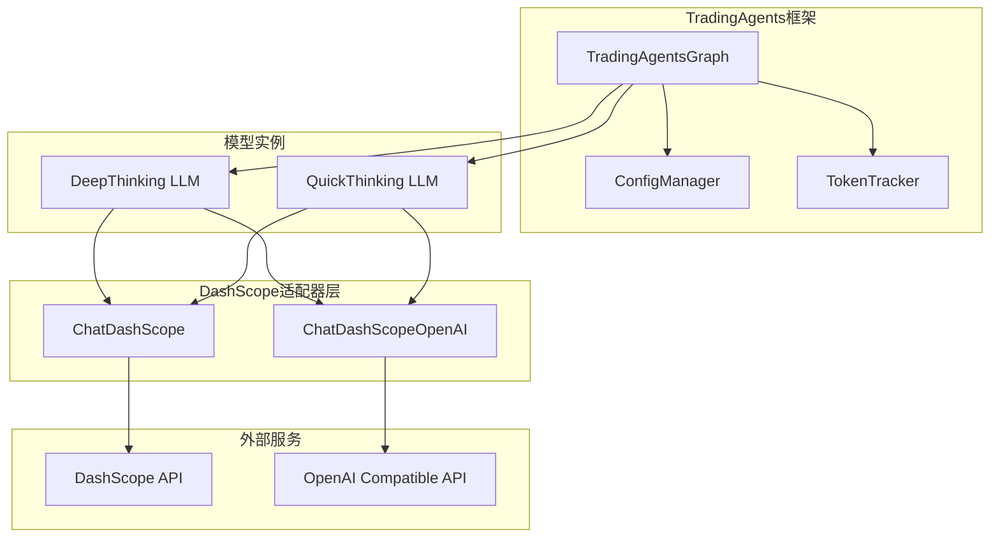
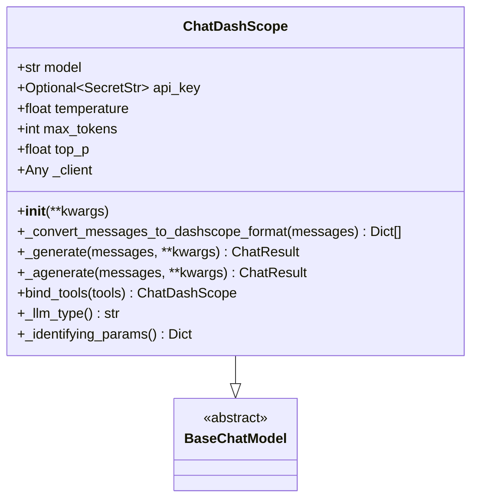
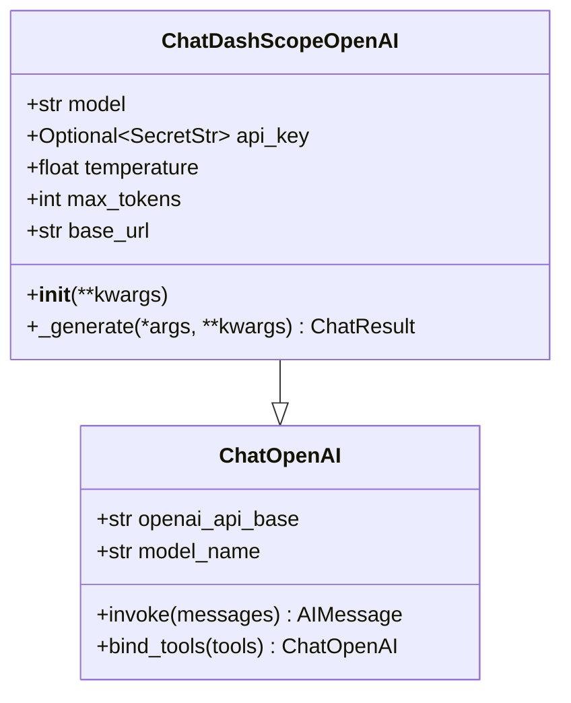
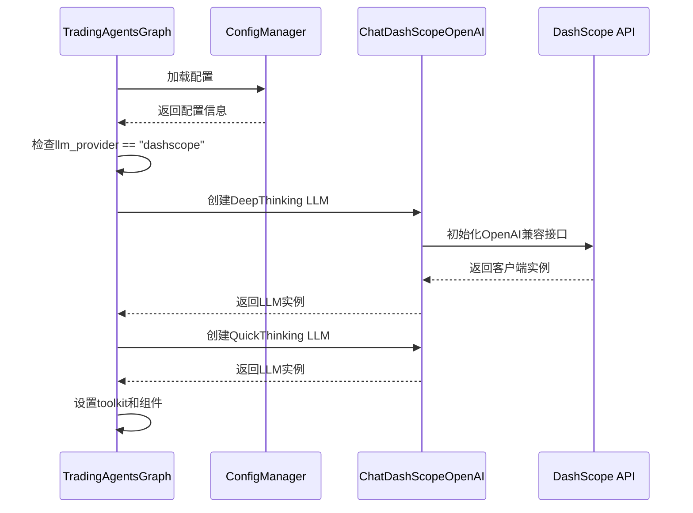
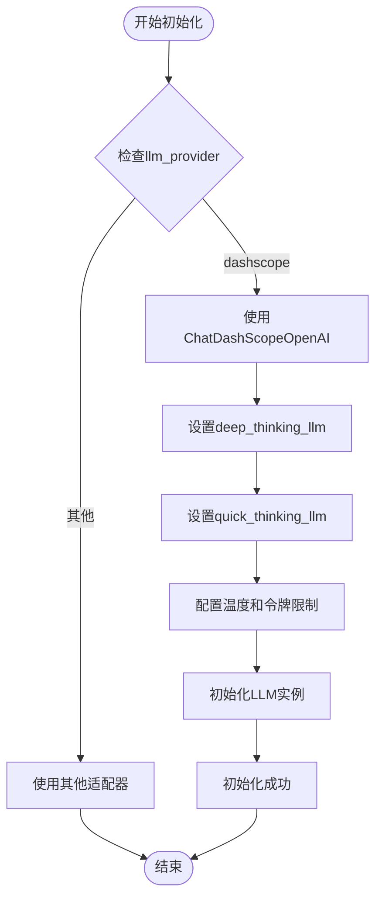
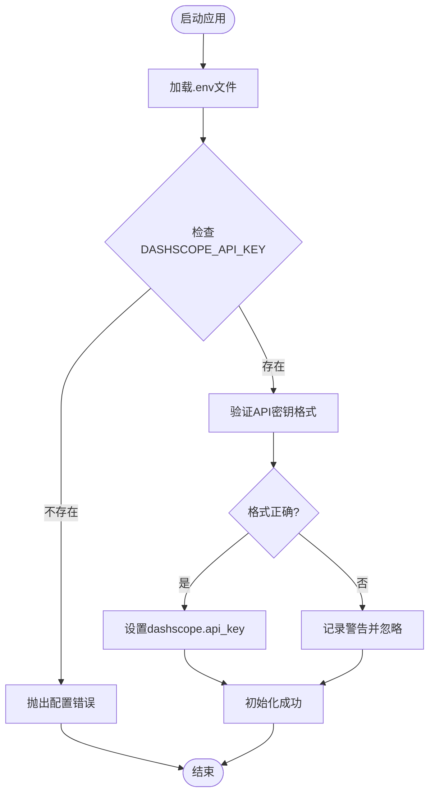
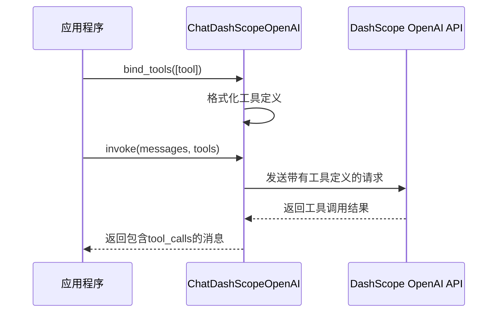
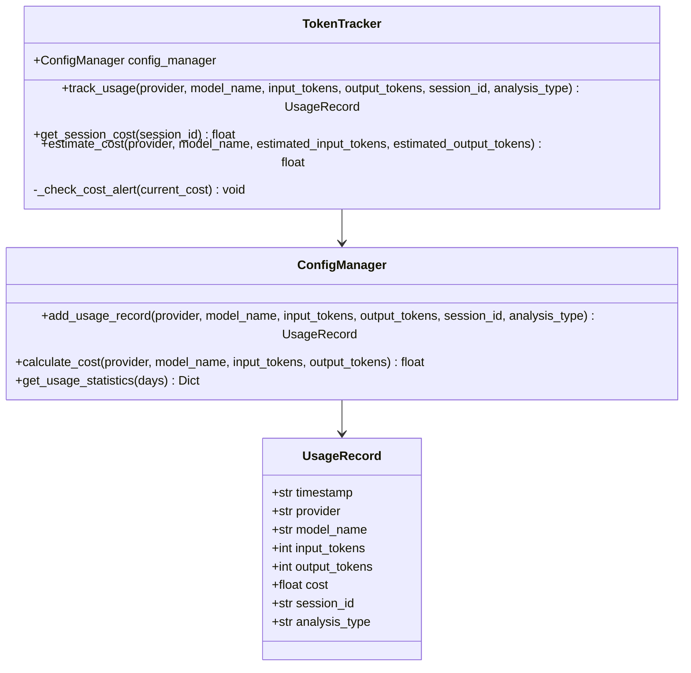
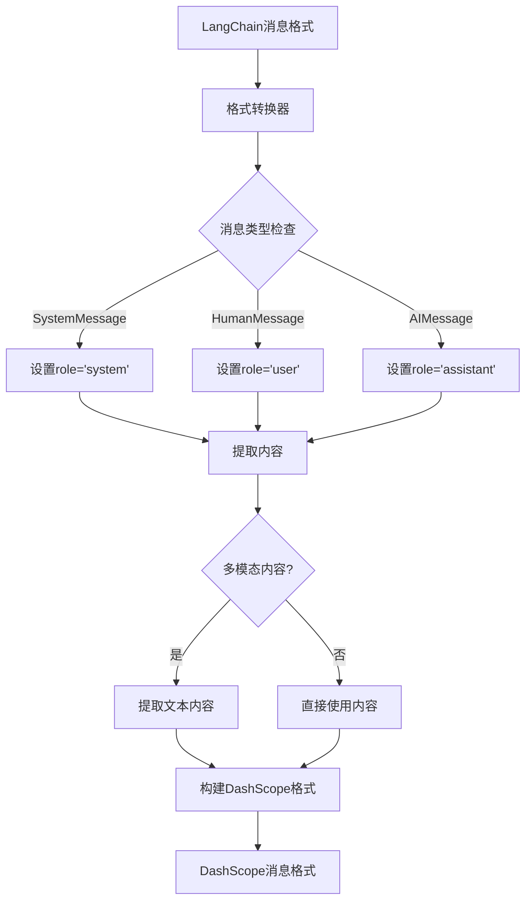

# 阿里百炼 (DashScope) 路由机制

<cite>
**本文档中引用的文件**
- [tradingagents/llm_adapters/dashscope_adapter.py](file://tradingagents/llm_adapters/dashscope_adapter.py)
- [tradingagents/llm_adapters/dashscope_openai_adapter.py](file://tradingagents/llm_adapters/dashscope_openai_adapter.py)
- [tradingagents/graph/trading_graph.py](file://tradingagents/graph/trading_graph.py)
- [tradingagents/default_config.py](file://tradingagents/default_config.py)
- [examples/dashscope_examples/demo_dashscope.py](file://examples/dashscope_examples/demo_dashscope.py)
- [examples/dashscope_examples/demo_dashscope_chinese.py](file://examples/dashscope_examples/demo_dashscope_chinese.py)
- [tradingagents/config/config_manager.py](file://tradingagents/config/config_manager.py)
- [scripts/check_api_config.py](file://scripts/check_api_config.py)
</cite>

## 目录
1. [简介](#简介)
2. [系统架构概览](#系统架构概览)
3. [适配器组件分析](#适配器组件分析)
4. [配置管理系统](#配置管理系统)
5. [路由初始化流程](#路由初始化流程)
6. [API密钥管理](#api密钥管理)
7. [模型选择与参数配置](#模型选择与参数配置)
8. [工具调用支持](#工具调用支持)
9. [Token使用统计](#token使用统计)
10. [性能优化特性](#性能优化特性)
11. [故障排除指南](#故障排除指南)
12. [最佳实践](#最佳实践)

## 简介

阿里百炼（DashScope）是阿里巴巴集团旗下的大模型服务平台，为TradingAgents框架提供了强大的语言模型支持。本文档深入解析了系统中DashScope提供商的路由实现机制，重点阐述了ChatDashScopeOpenAI适配器如何初始化DeepThinking和QuickThinking LLM实例，以及其在原生工具调用方面的技术优势。

## 系统架构概览

TradingAgents框架采用模块化的LLM适配器架构，支持多种大模型提供商。DashScope适配器作为其中的重要组成部分，提供了两种不同的实现方式：

**图表来源**
- [tradingagents/graph/trading_graph.py](file://tradingagents/graph/trading_graph.py#L1-L50)
- [tradingagents/llm_adapters/dashscope_adapter.py](file://tradingagents/llm_adapters/dashscope_adapter.py#L25-L65)
- [tradingagents/llm_adapters/dashscope_openai_adapter.py](file://tradingagents/llm_adapters/dashscope_openai_adapter.py#L15-L45)

## 适配器组件分析

### ChatDashScope适配器

ChatDashScope是传统的DashScope原生适配器，直接调用阿里百炼的原始API接口：

**图表来源**
- [tradingagents/llm_adapters/dashscope_adapter.py](file://tradingagents/llm_adapters/dashscope_adapter.py#L25-L65)

### ChatDashScopeOpenAI适配器

ChatDashScopeOpenAI是基于OpenAI兼容接口的适配器，支持原生工具调用：

**图表来源**
- [tradingagents/llm_adapters/dashscope_openai_adapter.py](file://tradingagents/llm_adapters/dashscope_openai_adapter.py#L15-L45)

**章节来源**
- [tradingagents/llm_adapters/dashscope_adapter.py](file://tradingagents/llm_adapters/dashscope_adapter.py#L25-L294)
- [tradingagents/llm_adapters/dashscope_openai_adapter.py](file://tradingagents/llm_adapters/dashscope_openai_adapter.py#L15-L258)

## 配置管理系统

### 默认配置结构

系统通过DEFAULT_CONFIG提供标准化的配置模板：

| 配置项 | 默认值 | 描述 |
|--------|--------|------|
| llm_provider | "openai" | LLM提供商标识 |
| deep_think_llm | "o4-mini" | 深度思考模型名称 |
| quick_think_llm | "gpt-4o-mini" | 快速思考模型名称 |
| backend_url | "https://api.openai.com/v1" | API端点URL |

### DashScope专用配置

当使用DashScope时，系统会自动调整以下配置：

| 配置项 | DashScope值 | 说明 |
|--------|-------------|------|
| llm_provider | "dashscope" | 设置为DashScope提供商 |
| backend_url | "https://dashscope.aliyuncs.com/api/v1" | DashScope API端点 |
| deep_think_llm | "qwen-plus-latest" | 推荐用于深度分析 |
| quick_think_llm | "qwen-turbo" | 推荐用于快速任务 |

**章节来源**
- [tradingagents/default_config.py](file://tradingagents/default_config.py#L1-L28)

## 路由初始化流程

### TradingGraph初始化过程

TradingAgentsGraph类负责整个系统的初始化，包括LLM实例的创建：

**图表来源**
- [tradingagents/graph/trading_graph.py](file://tradingagents/graph/trading_graph.py#L100-L150)

### 深度思考与快速思考实例化

系统通过条件判断确定使用哪种适配器：

**图表来源**
- [tradingagents/graph/trading_graph.py](file://tradingagents/graph/trading_graph.py#L120-L140)

**章节来源**
- [tradingagents/graph/trading_graph.py](file://tradingagents/graph/trading_graph.py#L100-L200)

## API密钥管理

### 环境变量配置

系统通过环境变量DASHSCOPE_API_KEY进行认证：

**图表来源**
- [tradingagents/llm_adapters/dashscope_adapter.py](file://tradingagents/llm_adapters/dashscope_adapter.py#L40-L60)

### API密钥获取流程

1. **环境变量优先级**：系统首先尝试从环境变量获取API密钥
2. **配置文件检查**：如果环境变量不存在，检查配置文件
3. **运行时验证**：在初始化时验证密钥的有效性
4. **错误处理**：如密钥无效，记录警告但继续运行

**章节来源**
- [tradingagents/llm_adapters/dashscope_adapter.py](file://tradingagents/llm_adapters/dashscope_adapter.py#L40-L65)
- [scripts/check_api_config.py](file://scripts/check_api_config.py#L27-L63)

## 模型选择与参数配置

### 支持的模型列表

系统提供了完整的DashScope模型支持列表：

| 模型名称 | 上下文长度 | 功能特性 | 推荐用途 |
|----------|------------|----------|----------|
| qwen-turbo | 8,192 | 基础功能 | 日常对话、简单分析 |
| qwen-plus | 32,768 | 平衡性能 | 复杂分析、专业任务 |
| qwen-plus-latest | 32,768 | 最新功能 | 最新功能、复杂分析 |
| qwen-max | 32,768 | 强大性能 | 复杂推理、专业分析 |
| qwen-max-latest | 32,768 | 最新功能 | 最新功能、复杂推理 |
| qwen-long | 1,000,000 | 超长上下文 | 长文档分析、大量数据处理 |

### 参数配置详解

#### ChatDashScope参数

| 参数 | 类型 | 默认值 | 描述 |
|------|------|--------|------|
| model | str | "qwen-turbo" | 模型名称 |
| temperature | float | 0.1 | 生成温度，越低越稳定 |
| max_tokens | int | 2000 | 最大生成token数 |
| top_p | float | 0.9 | 核采样参数 |

#### ChatDashScopeOpenAI参数

| 参数 | 类型 | 默认值 | 描述 |
|------|------|--------|------|
| base_url | str | "https://dashscope.aliyuncs.com/compatible-mode/v1" | OpenAI兼容接口地址 |
| model | str | "qwen-turbo" | 模型名称 |
| temperature | float | 0.1 | 生成温度 |
| max_tokens | int | 2000 | 最大生成token数 |

**章节来源**
- [tradingagents/llm_adapters/dashscope_adapter.py](file://tradingagents/llm_adapters/dashscope_adapter.py#L220-L294)
- [tradingagents/llm_adapters/dashscope_openai_adapter.py](file://tradingagents/llm_adapters/dashscope_openai_adapter.py#L185-L220)

## 工具调用支持

### 原生工具调用优势

ChatDashScopeOpenAI适配器的最大优势在于支持原生工具调用：

**图表来源**
- [tradingagents/llm_adapters/dashscope_openai_adapter.py](file://tradingagents/llm_adapters/dashscope_openai_adapter.py#L230-L258)

### 工具调用与传统方法对比

| 特性 | ChatDashScope | ChatDashScopeOpenAI |
|------|---------------|-------------------|
| 工具调用支持 | 不支持 | 原生支持 |
| 格式转换 | 应用层处理 | API层原生支持 |
| 性能开销 | 较高 | 较低 |
| 兼容性 | 有限 | OpenAI标准兼容 |

**章节来源**
- [tradingagents/llm_adapters/dashscope_adapter.py](file://tradingagents/llm_adapters/dashscope_adapter.py#L180-L220)
- [tradingagents/llm_adapters/dashscope_openai_adapter.py](file://tradingagents/llm_adapters/dashscope_openai_adapter.py#L230-L258)

## Token使用统计

### 统计系统架构

**图表来源**
- [tradingagents/config/config_manager.py](file://tradingagents/config/config_manager.py#L652-L725)

### 成本跟踪功能

系统自动跟踪每次API调用的Token使用情况：

1. **输入Token统计**：用户输入和系统提示消耗的Token
2. **输出Token统计**：模型生成内容消耗的Token
3. **成本计算**：基于预设费率表自动计算成本
4. **会话追踪**：按会话ID组织使用记录
5. **成本警告**：超过阈值时发出警告

**章节来源**
- [tradingagents/config/config_manager.py](file://tradingagents/config/config_manager.py#L652-L725)

## 性能优化特性

### OpenAI兼容接口优势

1. **原生工具调用**：无需额外的格式转换，提升性能
2. **标准协议支持**：完全兼容OpenAI标准，便于迁移
3. **更好的错误处理**：统一的错误响应格式
4. **更稳定的连接**：经过充分测试的兼容接口

### 消息格式转换优化

ChatDashScope适配器实现了高效的消息格式转换：

**图表来源**
- [tradingagents/llm_adapters/dashscope_adapter.py](file://tradingagents/llm_adapters/dashscope_adapter.py#L65-L107)

**章节来源**
- [tradingagents/llm_adapters/dashscope_openai_adapter.py](file://tradingagents/llm_adapters/dashscope_openai_adapter.py#L15-L45)

## 故障排除指南

### 常见问题及解决方案

#### API密钥问题

| 问题 | 症状 | 解决方案 |
|------|------|----------|
| 密钥未设置 | ValueError异常 | 设置DASHSCOPE_API_KEY环境变量 |
| 密钥格式错误 | 初始化失败 | 检查密钥格式是否正确 |
| 权限不足 | 403错误 | 确认账户权限和配额 |

#### 模型配置问题

| 问题 | 症状 | 解决方案 |
|------|------|----------|
| 模型不可用 | 模型加载失败 | 检查模型名称拼写 |
| 配额超限 | 请求被拒绝 | 检查账户配额状态 |
| 网络连接问题 | 超时错误 | 检查网络连接 |

#### 工具调用问题

| 问题 | 症状 | 解决方案 |
|------|------|----------|
| 工具调用失败 | 无tool_calls返回 | 检查工具定义格式 |
| 兼容性问题 | 格式转换错误 | 使用ChatDashScopeOpenAI适配器 |

**章节来源**
- [scripts/check_api_config.py](file://scripts/check_api_config.py#L27-L63)
- [examples/dashscope_examples/demo_dashscope.py](file://examples/dashscope_examples/demo_dashscope.py#L30-L50)

## 最佳实践

### 配置建议

1. **生产环境配置**
   - 使用环境变量管理API密钥
   - 启用成本跟踪功能
   - 设置合理的成本警告阈值

2. **开发环境配置**
   - 使用较小的模型进行快速测试
   - 启用详细日志记录
   - 配置适当的超时时间

3. **模型选择策略**
   - 深度分析：使用qwen-plus-latest
   - 快速任务：使用qwen-turbo
   - 长文档处理：使用qwen-long

### 性能优化建议

1. **合理设置参数**
   - temperature: 0.1-0.3用于稳定输出
   - max_tokens: 根据需求设置合适的上限
   - top_p: 0.9保持多样性同时保证质量

2. **成本控制**
   - 监控Token使用量
   - 使用适当大小的模型
   - 合理设置对话轮次

3. **错误处理**
   - 实现重试机制
   - 处理网络超时
   - 监控API配额使用

**章节来源**
- [examples/dashscope_examples/demo_dashscope.py](file://examples/dashscope_examples/demo_dashscope.py#L60-L90)
- [examples/dashscope_examples/demo_dashscope_chinese.py](file://examples/dashscope_examples/demo_dashscope_chinese.py#L40-L80)