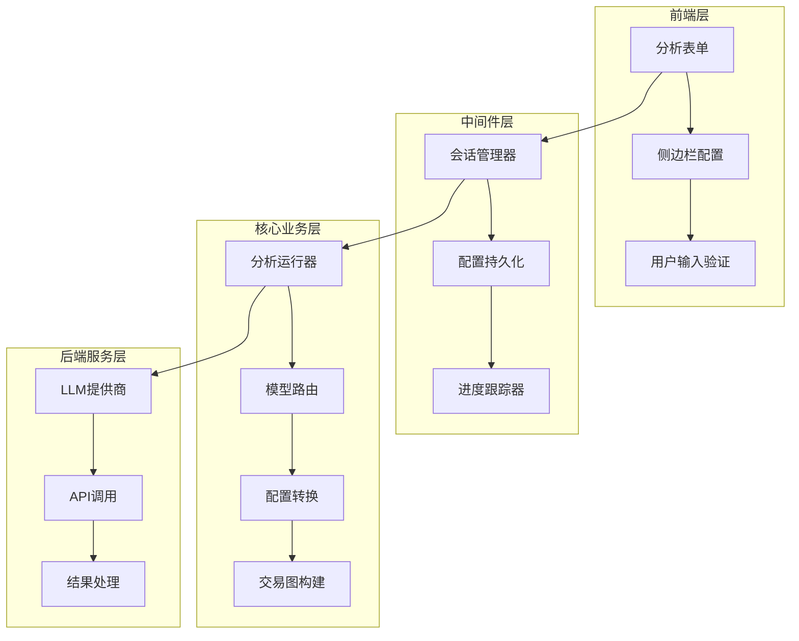
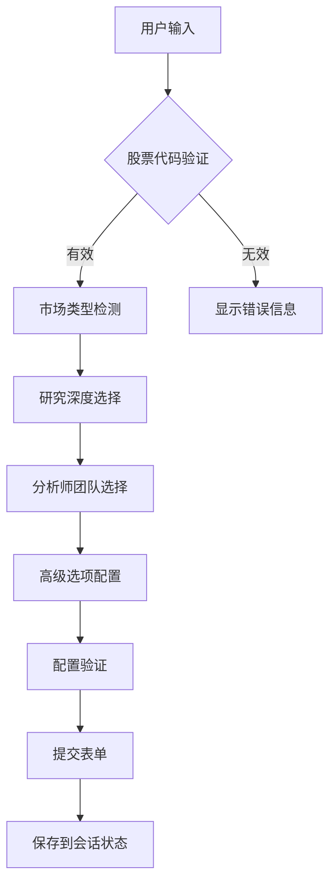
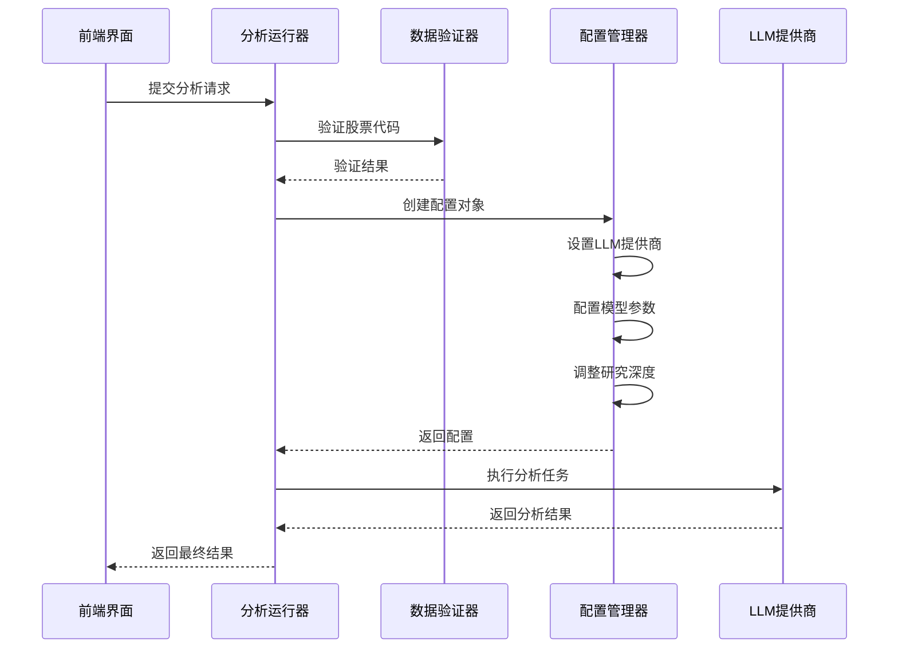
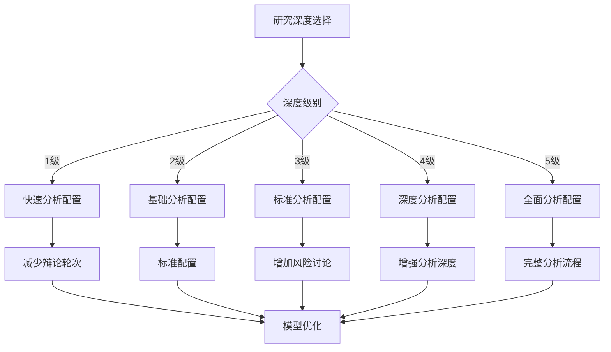
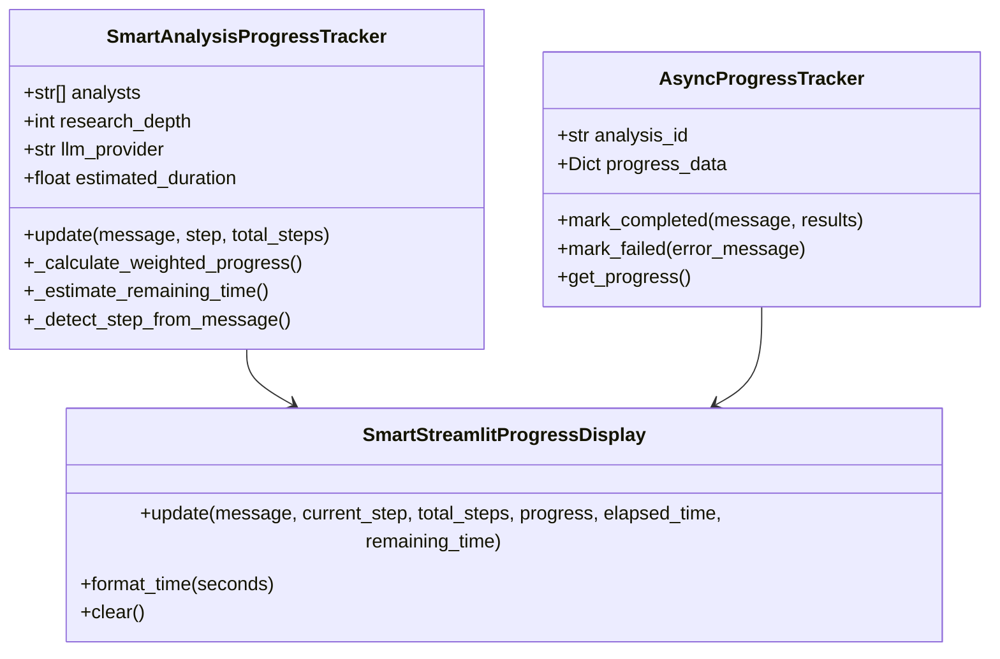
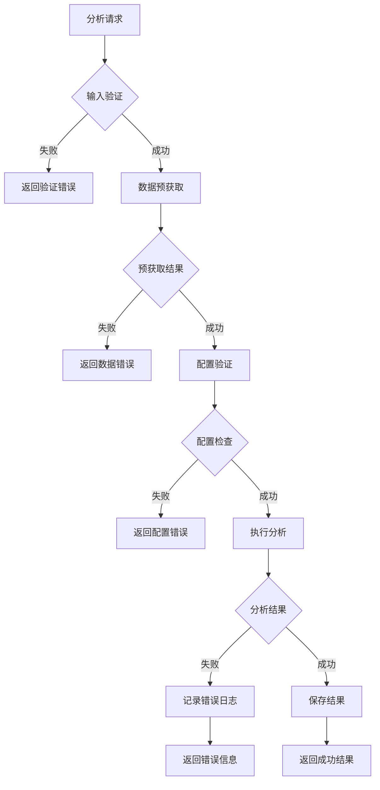
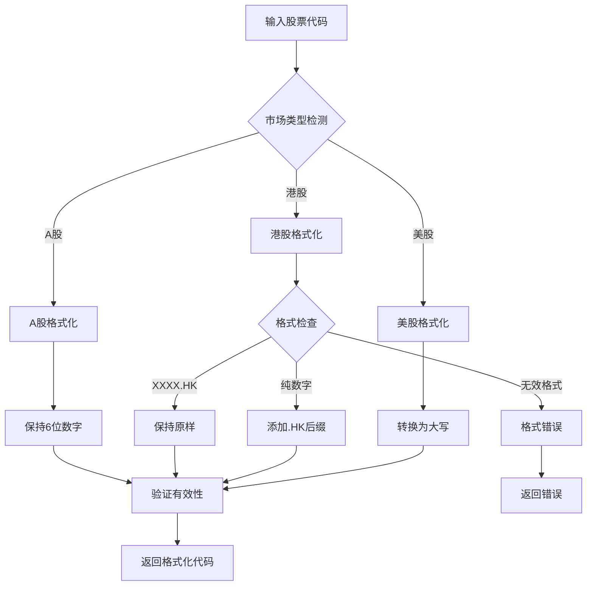
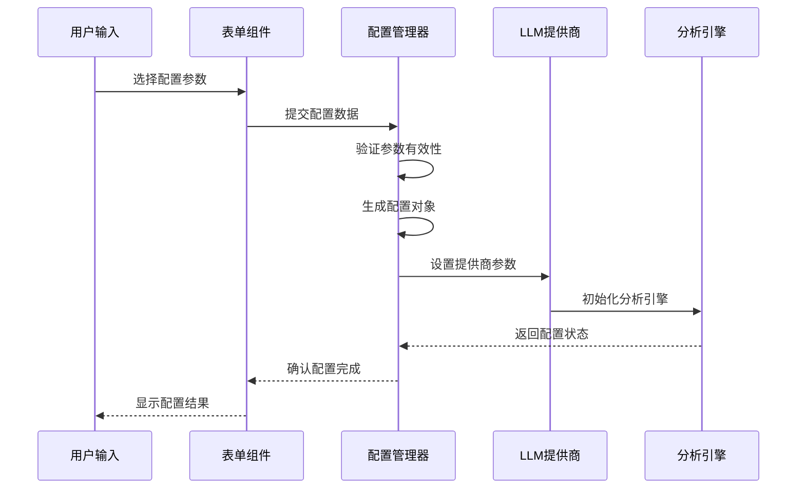

# Web界面模型路由机制

<cite>
**本文档引用的文件**
- [analysis_runner.py](file://web/utils/analysis_runner.py)
- [app.py](file://web/app.py)
- [analysis_form.py](file://web/components/analysis_form.py)
- [sidebar.py](file://web/components/sidebar.py)
- [progress_tracker.py](file://web/utils/progress_tracker.py)
- [async_progress_tracker.py](file://web/utils/async_progress_tracker.py)
- [smart_session_manager.py](file://web/utils/smart_session_manager.py)
- [stock_validator.py](file://tradingagents/utils/stock_validator.py)
- [stock_utils.py](file://tradingagents/utils/stock_utils.py)
</cite>

## 目录
1. [概述](#概述)
2. [系统架构](#系统架构)
3. [前端配置收集](#前端配置收集)
4. [后端模型路由实现](#后端模型路由实现)
5. [进度回调机制](#进度回调机制)
6. [错误处理机制](#错误处理机制)
7. [市场类型适配](#市场类型适配)
8. [配置转换逻辑](#配置转换逻辑)
9. [性能优化策略](#性能优化策略)
10. [故障排除指南](#故障排除指南)

## 概述

TradingAgents-CN的Web界面实现了先进的模型路由机制，允许用户在Web界面上灵活选择LLM提供商和研究深度，系统通过analysis_runner.py中的run_stock_analysis函数实现智能的模型路由和配置转换。该机制支持多种LLM提供商（阿里百炼、DeepSeek、Google AI、OpenAI等），并根据市场类型（A股、港股、美股）和用户选择动态调整模型配置。

## 系统架构

**图表来源**
- [analysis_form.py](file://web/components/analysis_form.py#L1-L50)
- [sidebar.py](file://web/components/sidebar.py#L200-L300)
- [analysis_runner.py](file://web/utils/analysis_runner.py#L1-L100)

## 前端配置收集

### 分析表单组件

前端通过analysis_form.py组件收集用户的分析配置，包括股票代码、市场类型、研究深度、分析师选择等关键参数。

**图表来源**
- [analysis_form.py](file://web/components/analysis_form.py#L200-L300)

### 侧边栏配置管理

侧边栏组件负责管理LLM提供商和模型选择，提供直观的配置界面。

**章节来源**
- [analysis_form.py](file://web/components/analysis_form.py#L50-L150)
- [sidebar.py](file://web/components/sidebar.py#L200-L400)

## 后端模型路由实现

### run_stock_analysis函数核心逻辑

analysis_runner.py中的run_stock_analysis函数是模型路由的核心实现，负责接收前端配置并转换为后端可执行的参数。

**图表来源**
- [analysis_runner.py](file://web/utils/analysis_runner.py#L100-L200)

### LLM提供商配置映射

系统支持多个LLM提供商，每个提供商都有特定的配置策略：

| 提供商 | 默认模型 | 后端URL | 特殊配置 |
|--------|----------|---------|----------|
| dashscope | qwen-plus | https://dashscope.aliyuncs.com/api/v1 | 支持多个模型版本 |
| deepseek | deepseek-chat | https://api.deepseek.com | 单一模型 |
| google | gemini-2.5-pro | https://api.openai.com/v1 | 模型速度优化 |
| openai | gpt-4 | https://api.openai.com/v1 | 官方API |
| qianfan | ernie-3.5-8k | https://aip.baidubce.com | 研究深度适配 |

**章节来源**
- [analysis_runner.py](file://web/utils/analysis_runner.py#L300-L400)

### 研究深度动态配置

系统根据用户选择的研究深度动态调整模型配置和分析流程：

**图表来源**
- [analysis_runner.py](file://web/utils/analysis_runner.py#L250-L350)

**章节来源**
- [analysis_runner.py](file://web/utils/analysis_runner.py#L250-L400)

## 进度回调机制

### 智能进度跟踪器

系统实现了SmartAnalysisProgressTracker类，提供动态进度跟踪和时间预估功能。

**图表来源**
- [progress_tracker.py](file://web/utils/progress_tracker.py#L15-L100)
- [async_progress_tracker.py](file://web/utils/async_progress_tracker.py#L50-L150)

### 实时进度更新

进度回调机制通过以下方式实现实时更新：

1. **步骤检测**：自动识别当前分析步骤
2. **时间预估**：基于历史数据和模型性能预估剩余时间
3. **权重计算**：根据步骤重要性分配进度权重
4. **动态调整**：根据实际执行情况动态调整预估

**章节来源**
- [progress_tracker.py](file://web/utils/progress_tracker.py#L100-L200)
- [async_progress_tracker.py](file://web/utils/async_progress_tracker.py#L200-L300)

## 错误处理机制

### 多层次错误处理

系统实现了多层次的错误处理机制，确保分析过程的稳定性和可靠性。

**图表来源**
- [analysis_runner.py](file://web/utils/analysis_runner.py#L150-L250)

### 错误恢复策略

系统采用多种错误恢复策略：

1. **配置回退**：使用默认配置作为备选
2. **存储降级**：Redis失败时自动切换到文件存储
3. **分析恢复**：从最近的分析状态恢复
4. **模型切换**：主模型失败时自动尝试备用模型

**章节来源**
- [analysis_runner.py](file://web/utils/analysis_runner.py#L700-L800)
- [smart_session_manager.py](file://web/utils/smart_session_manager.py#L50-L100)

## 市场类型适配

### 股票代码格式化

系统根据市场类型对股票代码进行格式化处理：

**图表来源**
- [analysis_runner.py](file://web/utils/analysis_runner.py#L600-L700)

### 市场特定配置

不同市场类型采用不同的配置策略：

| 市场类型 | 数据源 | 工具选择 | 货币处理 |
|----------|--------|----------|----------|
| A股 | Tushare | 基础工具 | 人民币(CNY) |
| 港股 | Finnhub | 标准工具 | 港币(HKD) |
| 美股 | Yahoo Finance | 完整工具 | 美元(USD) |

**章节来源**
- [stock_validator.py](file://tradingagents/utils/stock_validator.py#L100-L200)
- [stock_utils.py](file://tradingagents/utils/stock_utils.py#L150-L250)

## 配置转换逻辑

### 动态配置生成

系统根据用户选择动态生成配置参数：

**图表来源**
- [analysis_runner.py](file://web/utils/analysis_runner.py#L300-L450)

### 会话状态管理

系统通过智能会话管理器维护配置状态：

**章节来源**
- [smart_session_manager.py](file://web/utils/smart_session_manager.py#L1-L100)

## 性能优化策略

### 缓存机制

系统实现了多层缓存机制提升性能：

1. **Redis缓存**：高性能内存存储
2. **文件缓存**：持久化存储备选
3. **会话缓存**：浏览器本地存储
4. **分析结果缓存**：避免重复计算

### 并发处理

系统支持并发分析处理，提高用户体验：

- **异步进度跟踪**：独立线程监控分析进度
- **并行工具调用**：多个分析模块同时执行
- **资源池管理**：优化LLM API调用频率

**章节来源**
- [async_progress_tracker.py](file://web/utils/async_progress_tracker.py#L100-L200)

## 故障排除指南

### 常见问题及解决方案

| 问题类型 | 症状 | 可能原因 | 解决方案 |
|----------|------|----------|----------|
| 配置错误 | 分析失败 | LLM API密钥无效 | 检查.env文件配置 |
| 数据验证失败 | 股票代码错误 | 格式不正确 | 使用正确的市场格式 |
| 进度卡住 | 无响应 | 网络连接问题 | 检查网络连接状态 |
| 结果丢失 | 分析中断 | 存储系统故障 | 检查Redis或文件权限 |

### 调试工具

系统提供了丰富的调试工具：

- **进度日志**：实时跟踪分析进度
- **配置验证**：检查参数有效性
- **性能监控**：分析执行时间和资源使用
- **错误追踪**：详细的错误堆栈信息

**章节来源**
- [analysis_runner.py](file://web/utils/analysis_runner.py#L800-L900)

## 总结

TradingAgents-CN的Web界面模型路由机制通过精心设计的架构实现了高度灵活和可靠的股票分析功能。系统不仅支持多种LLM提供商和研究深度配置，还具备完善的错误处理和进度反馈机制。通过智能的市场类型适配和动态配置转换，用户可以轻松获得高质量的股票分析结果，同时享受到流畅的交互体验。

该机制的核心优势在于：
- **灵活性**：支持多种LLM提供商和配置选项
- **可靠性**：完善的错误处理和恢复机制
- **性能**：智能进度跟踪和缓存优化
- **易用性**：直观的Web界面和实时反馈