# Web界面模型选择实现

<cite>
**本文档引用的文件**
- [web/utils/analysis_runner.py](file://web/utils/analysis_runner.py)
- [web/app.py](file://web/app.py)
- [web/components/analysis_form.py](file://web/components/analysis_form.py)
- [web/components/sidebar.py](file://web/components/sidebar.py)
- [web/utils/progress_tracker.py](file://web/utils/progress_tracker.py)
- [web/utils/api_checker.py](file://web/utils/api_checker.py)
- [web/utils/smart_session_manager.py](file://web/utils/smart_session_manager.py)
- [web/utils/async_progress_tracker.py](file://web/utils/async_progress_tracker.py)
- [web/components/results_display.py](file://web/components/results_display.py)
- [tradingagents/graph/trading_graph.py](file://tradingagents/graph/trading_graph.py)
- [tradingagents/utils/stock_validator.py](file://tradingagents/utils/stock_validator.py)
</cite>

## 目录
1. [简介](#简介)
2. [系统架构概览](#系统架构概览)
3. [前端模型选择界面](#前端模型选择界面)
4. [后端配置转换机制](#后端配置转换机制)
5. [进度回调机制](#进度回调机制)
6. [错误处理与故障转移](#错误处理与故障转移)
7. [市场类型适配](#市场类型适配)
8. [性能优化策略](#性能优化策略)
9. [总结](#总结)

## 简介

TradingAgents-CN Web界面实现了完整的模型路由机制，允许用户在Web界面上灵活选择LLM提供商和研究深度，系统通过analysis_runner.py中的run_stock_analysis函数实现智能的模型路由和配置转换。该机制支持多种LLM提供商（阿里百炼、DeepSeek、Google AI、OpenAI等），并根据用户选择动态调整模型配置和分析策略。

## 系统架构概览

Web界面模型选择实现采用分层架构设计，包含前端交互层、后端处理层和模型执行层：

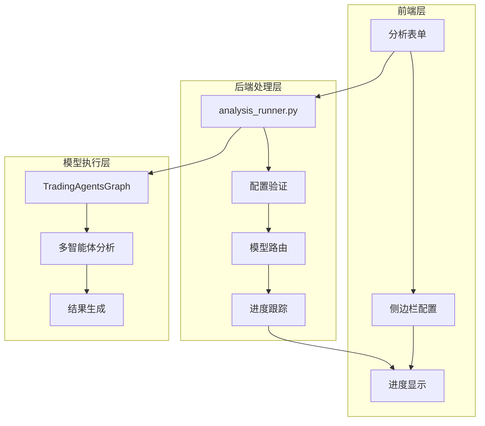

**图表来源**
- [web/components/analysis_form.py](file://web/components/analysis_form.py#L1-L50)
- [web/components/sidebar.py](file://web/components/sidebar.py#L200-L400)
- [web/utils/analysis_runner.py](file://web/utils/analysis_runner.py#L100-L200)

## 前端模型选择界面

### 分析表单配置

前端分析表单提供了直观的用户界面来选择分析参数：

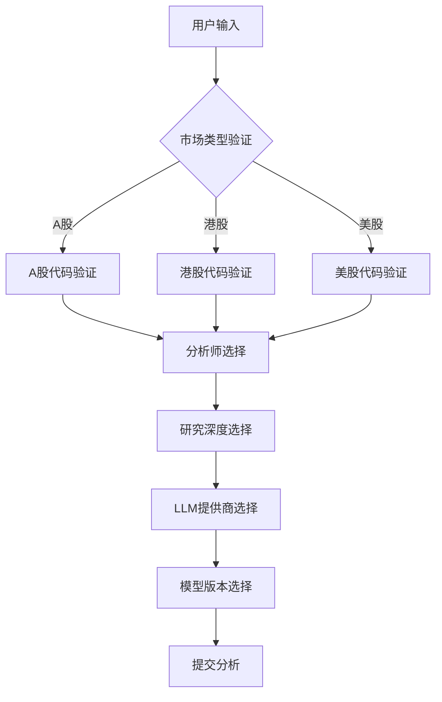

**图表来源**
- [web/components/analysis_form.py](file://web/components/analysis_form.py#L20-L100)
- [tradingagents/utils/stock_validator.py](file://tradingagents/utils/stock_validator.py#L107-L170)

### 市场类型自动检测

系统具备智能的市场类型检测能力：

| 市场类型 | 验证规则 | 示例代码格式 |
|---------|---------|-------------|
| A股 | 6位数字 | 000001, 600519 |
| 港股 | 4-5位数字.HK或纯数字 | 0700.HK, 0700 |
| 美股 | 1-5位字母 | AAPL, TSLA |

**段落来源**
- [tradingagents/utils/stock_validator.py](file://tradingagents/utils/stock_validator.py#L107-L170)

### LLM提供商选择界面

侧边栏提供了丰富的LLM提供商选择选项：

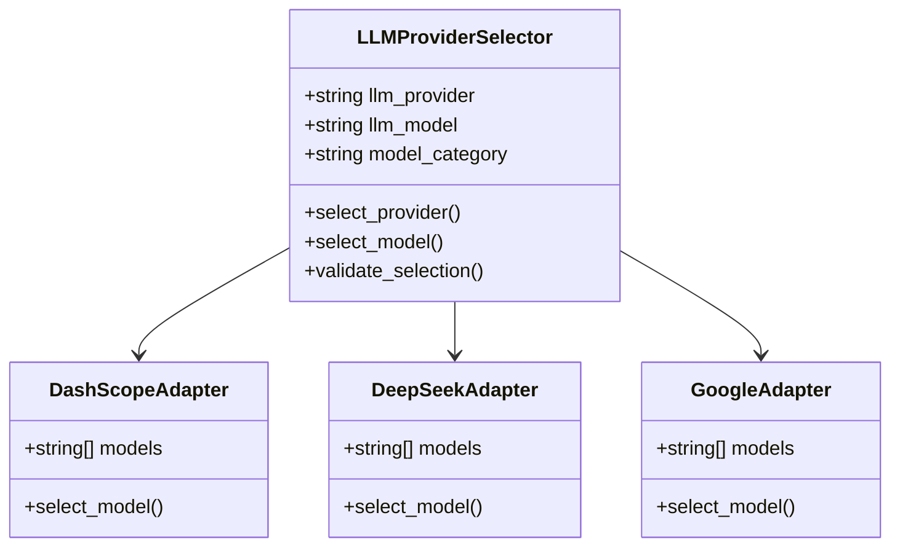

**图表来源**
- [web/components/sidebar.py](file://web/components/sidebar.py#L213-L400)

**段落来源**
- [web/components/sidebar.py](file://web/components/sidebar.py#L213-L256)

## 后端配置转换机制

### run_stock_analysis函数核心流程

analysis_runner.py中的run_stock_analysis函数是模型路由的核心实现：

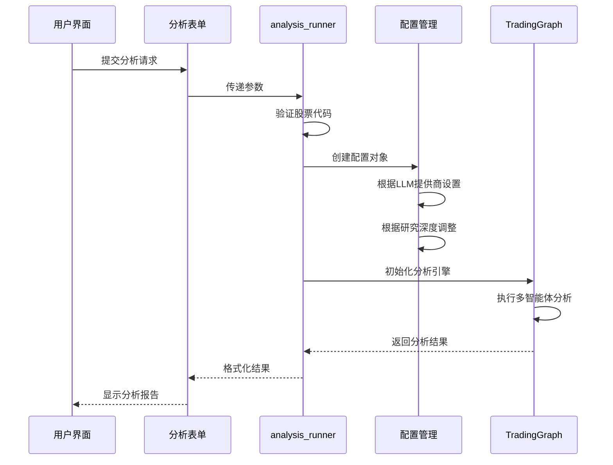

**图表来源**
- [web/utils/analysis_runner.py](file://web/utils/analysis_runner.py#L100-L200)
- [web/utils/analysis_runner.py](file://web/utils/analysis_runner.py#L448-L475)

### LLM提供商配置映射

系统支持多种LLM提供商的智能配置：

| 提供商 | 配置项 | 动态调整策略 |
|--------|--------|-------------|
| 阿里百炼 | qwen-turbo/qwen-plus/qwen-max | 根据研究深度自动选择 |
| DeepSeek | deepseek-chat | 统一模型，快速响应 |
| Google AI | gemini-2.5-pro/gemini-1.5-pro | 性能与速度平衡 |
| OpenAI | 自定义模型 | 支持多种OpenAI兼容模型 |
| 千帆 | ernie-3.5-8k/ernie-4.0-turbo-8k | 中文优化模型 |

**段落来源**
- [web/utils/analysis_runner.py](file://web/utils/analysis_runner.py#L304-L368)

### 研究深度配置策略

不同研究深度对应不同的配置策略：

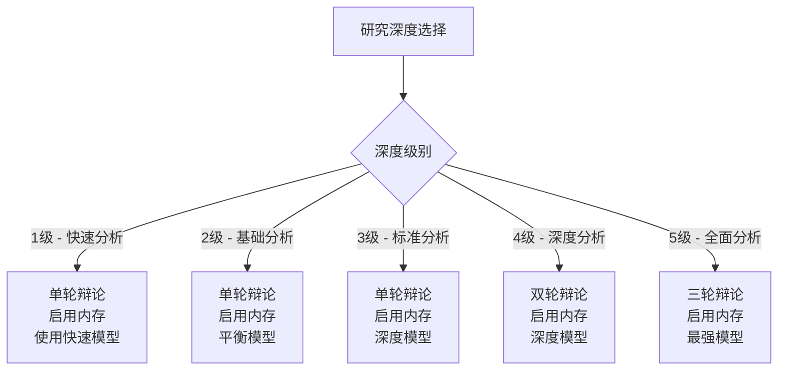

**图表来源**
- [web/utils/analysis_runner.py](file://web/utils/analysis_runner.py#L200-L300)

**段落来源**
- [web/utils/analysis_runner.py](file://web/utils/analysis_runner.py#L200-L300)

## 进度回调机制

### 智能进度跟踪器

系统实现了智能进度跟踪机制，能够实时反馈分析进度：

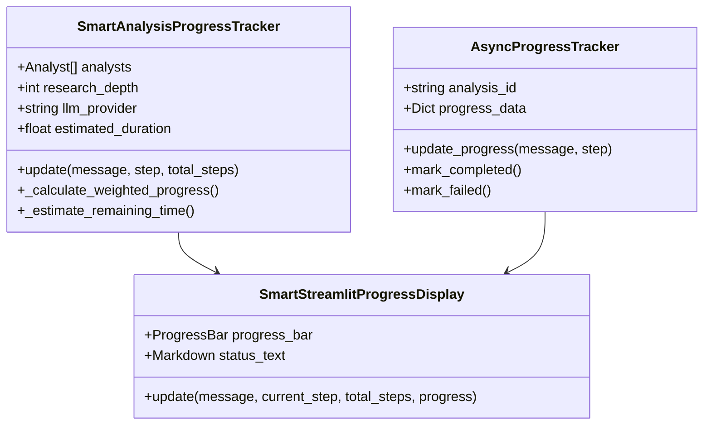

**图表来源**
- [web/utils/progress_tracker.py](file://web/utils/progress_tracker.py#L15-L100)
- [web/utils/async_progress_tracker.py](file://web/utils/async_progress_tracker.py#L50-L150)

### 前端进度显示

进度回调机制确保用户获得实时的分析状态反馈：

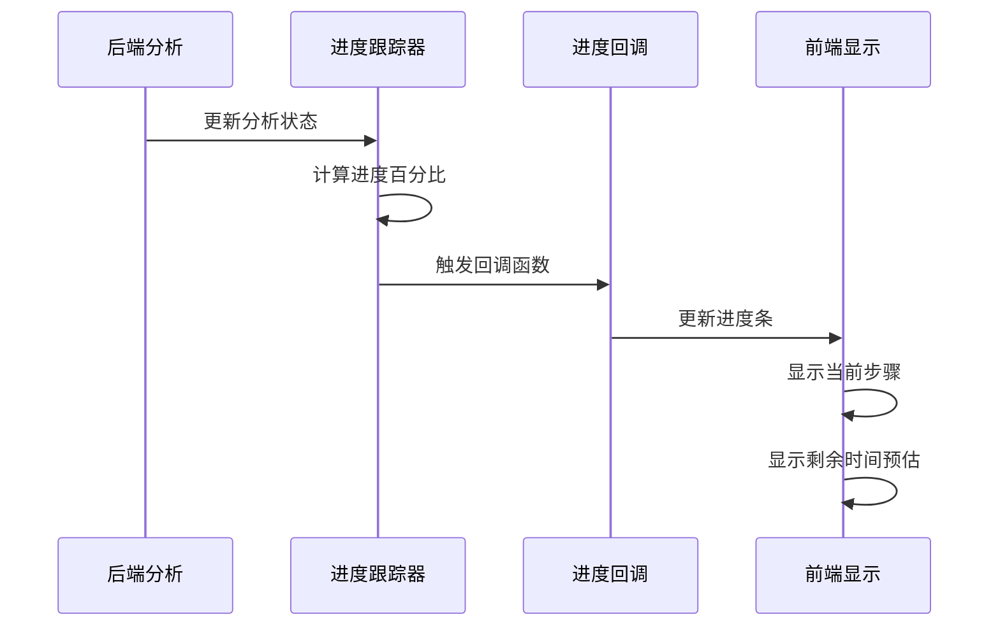

**图表来源**
- [web/utils/progress_tracker.py](file://web/utils/progress_tracker.py#L300-L375)

**段落来源**
- [web/utils/progress_tracker.py](file://web/utils/progress_tracker.py#L300-L375)

## 错误处理与故障转移

### API密钥验证机制

系统实现了完善的API密钥验证和错误处理：

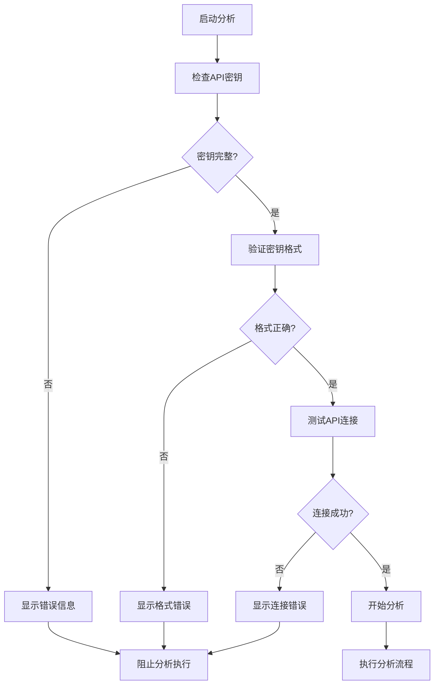

**图表来源**
- [web/utils/api_checker.py](file://web/utils/api_checker.py#L10-L80)

### 故障转移策略

系统具备多层次的故障转移能力：

| 故障类型 | 检测机制 | 转移策略 |
|---------|---------|---------|
| Redis连接失败 | 连接超时检测 | 自动降级到文件存储 |
| API密钥失效 | 请求响应验证 | 显示配置错误提示 |
| 模型调用失败 | 异常捕获 | 尝试备用模型 |
| 网络中断 | 超时检测 | 重试机制 |

**段落来源**
- [web/utils/api_checker.py](file://web/utils/api_checker.py#L10-L133)
- [web/utils/smart_session_manager.py](file://web/utils/smart_session_manager.py#L30-L80)

### 错误恢复机制

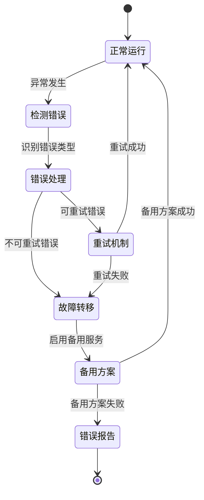

**图表来源**
- [web/utils/async_progress_tracker.py](file://web/utils/async_progress_tracker.py#L700-L747)

## 市场类型适配

### 股票代码格式化

系统根据不同的市场类型进行智能的股票代码格式化：

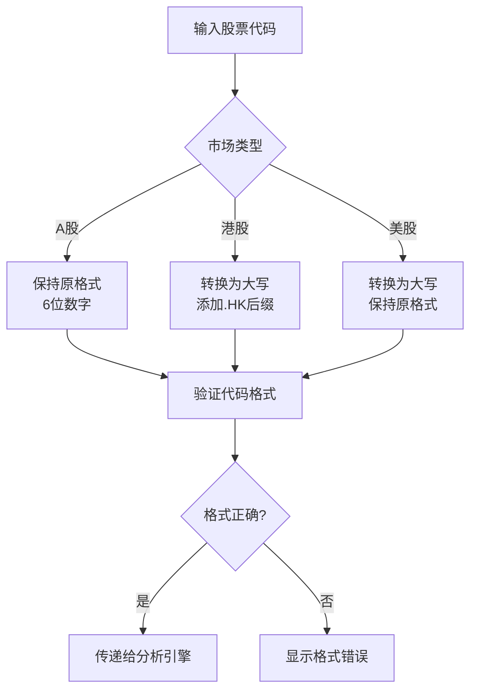

**图表来源**
- [web/utils/analysis_runner.py](file://web/utils/analysis_runner.py#L500-L550)

### 市场特定配置

不同市场类型采用不同的配置策略：

| 市场类型 | 数据源 | 分析重点 | 特殊处理 |
|---------|-------|---------|---------|
| A股 | Tushare/同花顺 | 财务指标、政策影响 | 禁用社交媒体分析 |
| 港股 | Finnhub/富途 | 基本面、市场情绪 | 支持.HK格式 |
| 美股 | Finnhub/Alpha Vantage | 技术分析、新闻驱动 | 全功能支持 |

**段落来源**
- [web/utils/analysis_runner.py](file://web/utils/analysis_runner.py#L500-L550)

## 性能优化策略

### 智能时间预估

系统实现了基于历史数据的智能时间预估算法：

**图表来源**
- [web/utils/progress_tracker.py](file://web/utils/progress_tracker.py#L80-L120)

### 内存优化

系统采用多种内存优化策略：

- **增量分析**: 只加载必要的数据模块
- **缓存机制**: 智能缓存常用分析结果
- **流式处理**: 大数据量采用流式处理
- **资源池化**: 复用LLM连接和工具实例

**段落来源**
- [web/utils/progress_tracker.py](file://web/utils/progress_tracker.py#L80-L120)

### 并发处理

系统支持并发分析处理：

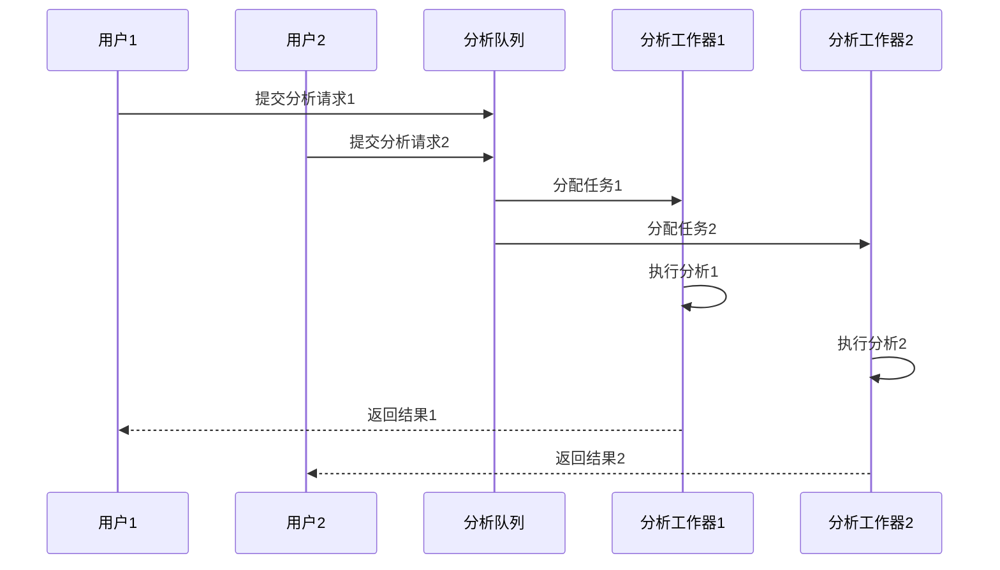

**图表来源**
- [web/utils/async_progress_tracker.py](file://web/utils/async_progress_tracker.py#L100-L200)

## 总结

TradingAgents-CN Web界面的模型选择实现展现了现代AI应用的先进设计理念：

### 核心优势

1. **智能化路由**: 基于用户选择和系统状态的智能模型路由
2. **无缝用户体验**: 直观的前端界面和实时进度反馈
3. **高可靠性**: 完善的错误处理和故障转移机制
4. **高性能**: 智能时间预估和资源优化
5. **跨平台兼容**: 支持多种LLM提供商和市场类型

### 技术创新

- **动态配置**: 根据研究深度和市场类型自动调整配置
- **智能进度**: 基于步骤权重的精确进度跟踪
- **故障恢复**: 多层次的错误处理和恢复策略
- **性能监控**: 实时的性能指标和优化建议

这套模型选择实现不仅满足了用户多样化的分析需求，还为未来的功能扩展奠定了坚实的技术基础。通过持续的优化和改进，系统能够为用户提供更加智能、高效和可靠的股票分析服务。