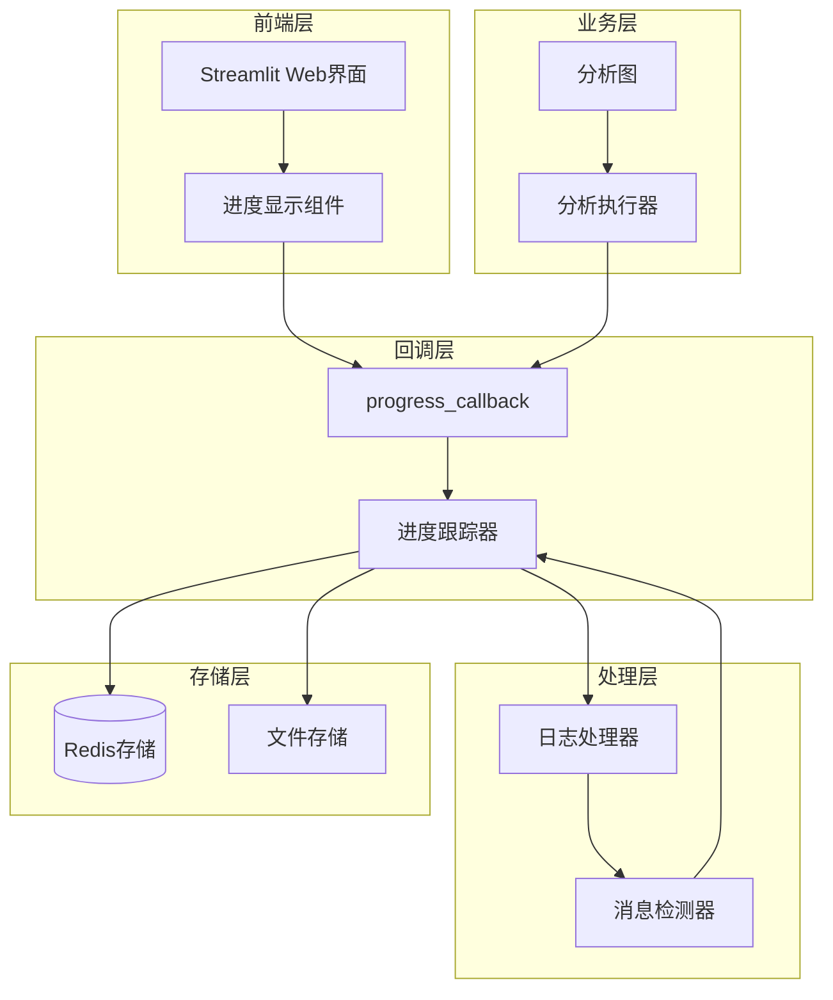
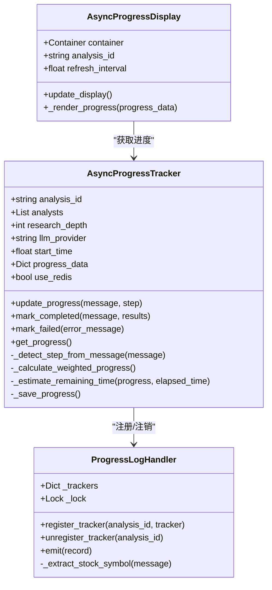
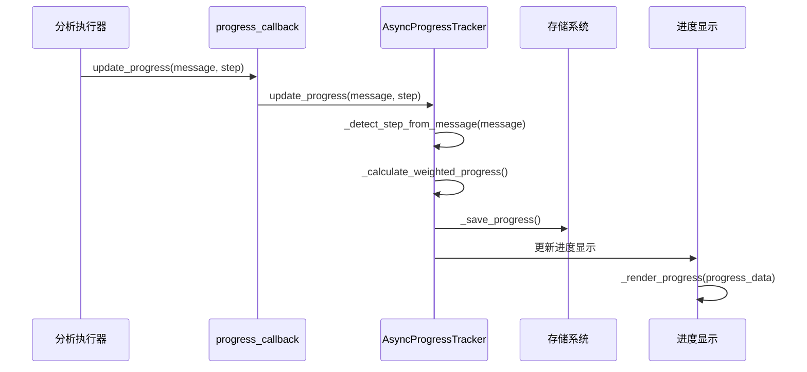
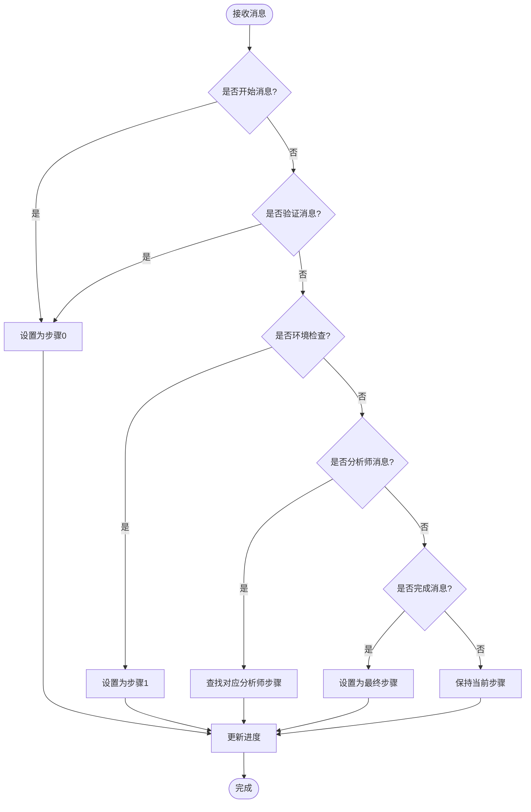
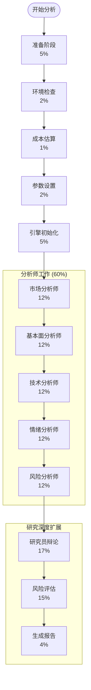
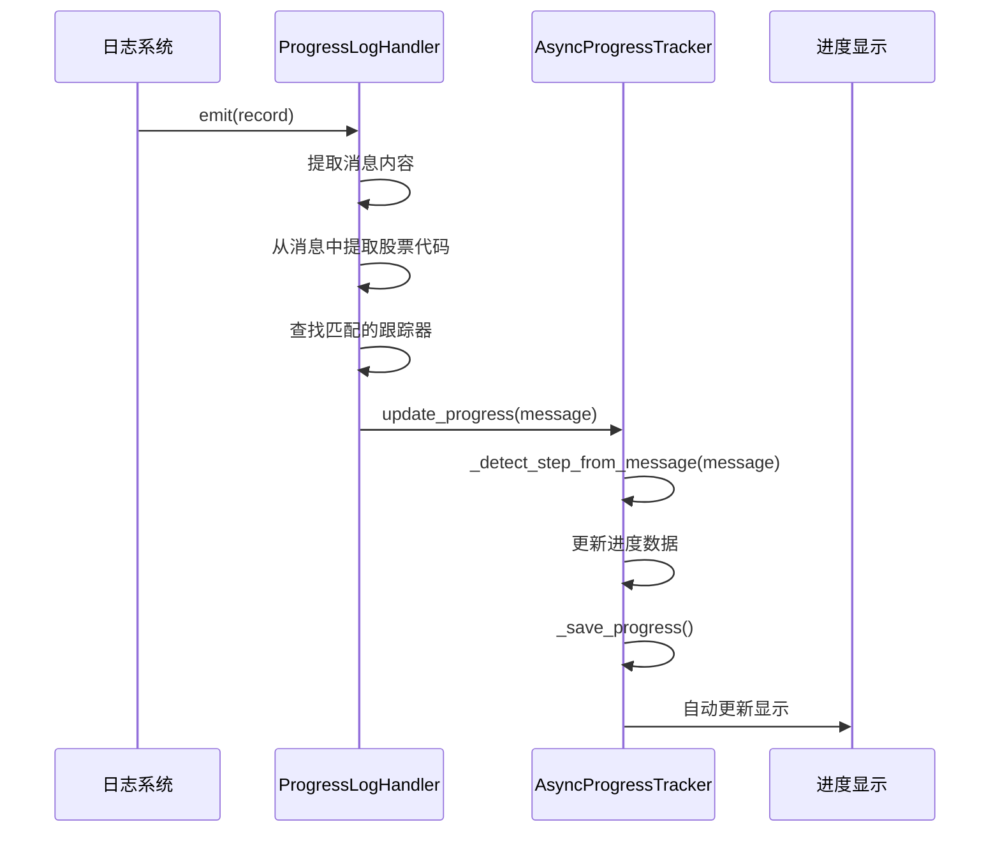
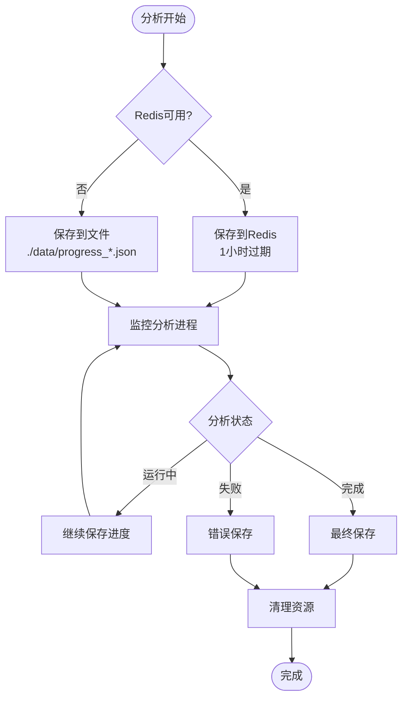

# Web界面进度反馈机制

<cite>
**本文档引用的文件**
- [async_progress_tracker.py](file://web/utils/async_progress_tracker.py)
- [progress_tracker.py](file://web/utils/progress_tracker.py)
- [progress_log_handler.py](file://web/utils/progress_log_handler.py)
- [async_progress_display.py](file://web/components/async_progress_display.py)
- [analysis_runner.py](file://web/utils/analysis_runner.py)
- [app.py](file://web/app.py)
</cite>

## 目录
1. [概述](#概述)
2. [系统架构](#系统架构)
3. [核心组件分析](#核心组件分析)
4. [进度消息生成规则](#进度消息生成规则)
5. [步骤计数逻辑](#步骤计数逻辑)
6. [不同分析阶段的进度提示设计](#不同分析阶段的进度提示设计)
7. [日志记录与UI进度更新的协同工作](#日志记录与ui进度更新的协同工作)
8. [用户体验优化](#用户体验优化)
9. [故障排除指南](#故障排除指南)
10. [总结](#总结)

## 概述

TradingAgents-CN项目的Web界面实现了完整的进度反馈机制，通过`update_progress`函数和`progress_callback`回调系统，为用户提供实时的分析进度更新。该机制采用异步设计，支持多种存储方式（Redis和文件），并提供了智能的时间预估和步骤检测功能。

## 系统架构



**图表来源**
- [async_progress_tracker.py](file://web/utils/async_progress_tracker.py#L71-L100)
- [progress_log_handler.py](file://web/utils/progress_log_handler.py#L10-L30)
- [app.py](file://web/app.py#L1177-L1178)

## 核心组件分析

### AsyncProgressTracker 异步进度跟踪器

`AsyncProgressTracker`是整个进度反馈系统的核心组件，负责跟踪分析过程的进度状态。



**图表来源**
- [async_progress_tracker.py](file://web/utils/async_progress_tracker.py#L71-L120)
- [progress_log_handler.py](file://web/utils/progress_log_handler.py#L10-L50)
- [async_progress_display.py](file://web/components/async_progress_display.py#L15-L50)

**章节来源**
- [async_progress_tracker.py](file://web/utils/async_progress_tracker.py#L71-L600)
- [progress_log_handler.py](file://web/utils/progress_log_handler.py#L10-L114)

### progress_callback 回调函数

`progress_callback`是连接分析执行器和进度显示组件的桥梁，它接收来自分析过程的状态更新并将其传递给进度跟踪器。



**图表来源**
- [app.py](file://web/app.py#L1177-L1178)
- [async_progress_tracker.py](file://web/utils/async_progress_tracker.py#L323-L400)

**章节来源**
- [app.py](file://web/app.py#L1177-L1178)
- [async_progress_tracker.py](file://web/utils/async_progress_tracker.py#L323-L400)

## 进度消息生成规则

### 消息分类体系

系统根据分析的不同阶段生成特定的进度消息，每种消息都有其特定的含义和触发条件：

| 消息类型 | 触发条件 | 示例消息 | 步骤编号 |
|---------|---------|---------|---------|
| 数据验证 | 股票代码验证阶段 | "🔍 验证股票代码并预获取数据..." | 0 |
| 环境检查 | API密钥和环境配置 | "🔧 检查API密钥配置，确保数据获取正常" | 1 |
| 成本估算 | 预估API调用成本 | "💰 预估分析成本: ¥12.3456" | 2 |
| 参数配置 | 分析参数和模型配置 | "⚙️ 配置分析参数和AI模型选择" | 3 |
| 引擎初始化 | AI分析引擎初始化 | "🚀 初始化AI分析引擎，准备开始分析" | 4 |
| 分析师工作 | 各分析师的专业分析 | "📊 市场分析正在进行中..." | 5+ |
| 模块完成 | 分析模块完成 | "✅ 市场分析模块完成" | 下一步 |
| 分析完成 | 整个分析流程完成 | "✅ 分析成功完成！" | 最后一步 |

**章节来源**
- [async_progress_tracker.py](file://web/utils/async_progress_tracker.py#L323-L400)
- [analysis_runner.py](file://web/utils/analysis_runner.py#L100-L200)

### 智能消息检测机制

系统实现了智能的消息检测机制，能够自动识别分析过程中的关键节点：



**图表来源**
- [async_progress_tracker.py](file://web/utils/async_progress_tracker.py#L388-L451)

**章节来源**
- [async_progress_tracker.py](file://web/utils/async_progress_tracker.py#L388-L451)

## 步骤计数逻辑

### 动态步骤生成

系统根据分析师数量、研究深度和LLM提供商动态生成分析步骤，确保进度计算的准确性：



**图表来源**
- [async_progress_tracker.py](file://web/utils/async_progress_tracker.py#L120-L200)

### 权重计算算法

系统使用加权进度计算算法，确保进度显示与实际工作量相匹配：

| 阶段 | 基础权重 | 研究深度影响 | 模型速度影响 | 最终权重 |
|------|---------|-------------|-------------|----------|
| 准备阶段 | 0.05 | ×1.0 | ×1.0 | 0.05 |
| 环境检查 | 0.02 | ×1.0 | ×1.0 | 0.02 |
| 成本估算 | 0.01 | ×1.0 | ×1.0 | 0.01 |
| 参数配置 | 0.02 | ×1.0 | ×1.0 | 0.02 |
| 引擎初始化 | 0.05 | ×1.0 | ×1.0 | 0.05 |
| 分析师工作 | 0.6/n | ×深度倍数 | ×模型倍数 | 0.6/n×深度×模型 |
| 研究员辩论 | 0.12 | ×深度倍数 | ×1.0 | 0.12×深度 |
| 风险评估 | 0.08 | ×深度倍数 | ×1.0 | 0.08×深度 |
| 报告生成 | 0.04 | ×1.0 | ×1.0 | 0.04 |

**章节来源**
- [async_progress_tracker.py](file://web/utils/async_progress_tracker.py#L120-L200)
- [async_progress_tracker.py](file://web/utils/async_progress_tracker.py#L471-L483)

## 不同分析阶段的进度提示设计

### 数据验证阶段

数据验证是分析的第一步，系统会验证股票代码的有效性并预获取相关数据：

- **进度提示**: "🔍 验证股票代码并预获取数据..."
- **时间预估**: 5-10秒（取决于网络延迟）
- **UI显示**: 进度条显示5%，状态文本显示验证进度
- **错误处理**: 如果验证失败，显示具体错误原因和解决建议

### 环境检查阶段

此阶段检查API密钥配置和环境变量设置：

- **进度提示**: "🔧 检查API密钥配置，确保数据获取正常"
- **时间预估**: 2-5秒
- **UI显示**: 显示环境检查状态，列出检查的项目
- **错误处理**: 如果配置有问题，提供配置指导

### 分析师工作阶段

这是最复杂的阶段，涉及多个专业分析师的协作：

```mermaid
gantt
title 分析师工作阶段时间分布
dateFormat X
axisFormat %s
section 市场分析师
数据获取 :0, 60
走势分析 :60, 120
市场热度 :120, 180
section 基本面分析师
财务分析 :0, 90
盈利能力 :90, 150
成长性评估 :150, 210
section 技术分析师
K线分析 :0, 75
技术指标 :75, 135
支撑阻力 :135, 195
section 情绪分析师
市场情绪 :0, 45
投资者心理 :45, 90
舆论倾向 :90, 135
```



**图表来源**
- [async_progress_tracker.py](file://web/utils/async_progress_tracker.py#L200-L280)

### 研究员辩论阶段

对于深度分析，系统会模拟多头和空头研究员的辩论：

- **进度提示**: "📈 多头观点分析进行中..."
- **时间预估**: 30-60秒（取决于研究深度）
- **UI显示**: 显示辩论进展，逐步展示不同观点
- **交互功能**: 用户可以看到不同观点的对比

### 报告生成阶段

最后阶段整合所有分析结果并生成最终报告：

- **进度提示**: "📊 生成最终投资报告..."
- **时间预估**: 10-20秒
- **UI显示**: 显示报告生成进度，提供预览功能
- **完成标志**: 显示"分析完成"状态和查看报告按钮

**章节来源**
- [async_progress_tracker.py](file://web/utils/async_progress_tracker.py#L200-L280)
- [analysis_runner.py](file://web/utils/analysis_runner.py#L100-L300)

## 日志记录与UI进度更新的协同工作

### ProgressLogHandler 集成机制

系统通过`ProgressLogHandler`实现了日志系统与UI进度更新的无缝集成：



**图表来源**
- [progress_log_handler.py](file://web/utils/progress_log_handler.py#L50-L80)

### 自动进度更新流程

系统能够自动检测分析过程中的关键事件并更新进度：

| 日志消息模式 | 检测步骤 | 更新动作 | UI反馈 |
|-------------|---------|---------|--------|
| "[模块开始]" | 查找对应步骤 | 推进到下一步 | 更新步骤名称和描述 |
| "[模块完成]" | 查找对应步骤 | 推进到下一步 | 显示完成状态 |
| "工具调用" | 保持当前步骤 | 更新步骤描述 | 显示具体操作 |
| "分析完成" | 设置最终步骤 | 标记完成状态 | 显示完成标志 |

**章节来源**
- [progress_log_handler.py](file://web/utils/progress_log_handler.py#L50-L80)
- [async_progress_tracker.py](file://web/utils/async_progress_tracker.py#L388-L451)

### 存储与恢复机制

系统支持Redis和文件两种存储方式，确保进度数据的可靠性和可恢复性：



**图表来源**
- [async_progress_tracker.py](file://web/utils/async_progress_tracker.py#L502-L555)

**章节来源**
- [async_progress_tracker.py](file://web/utils/async_progress_tracker.py#L502-L555)

## 用户体验优化

### 实时进度更新

系统采用多种策略确保用户体验的流畅性：

1. **智能时间预估**: 基于历史数据分析和机器学习算法，提供准确的剩余时间预估
2. **动态刷新控制**: 根据分析状态自动调整刷新频率，减少不必要的网络请求
3. **状态可视化**: 使用进度条、状态图标和详细描述，让用户清楚了解分析进展
4. **交互式控制**: 提供手动刷新、自动刷新开关和进度跳转功能

### 错误处理与恢复

系统具备完善的错误处理机制：

- **渐进式错误处理**: 从轻微警告到严重错误，逐步引导用户解决问题
- **自动重试机制**: 对于临时性错误，系统会自动重试而不中断用户体验
- **状态恢复**: 即使系统重启，也能恢复之前的分析进度
- **用户指导**: 提供清晰的错误信息和解决方案建议

### 性能优化

为了确保良好的用户体验，系统实现了多项性能优化：

| 优化策略 | 实现方式 | 性能提升 |
|---------|---------|---------|
| 异步处理 | 后台线程执行分析 | 主界面保持响应 |
| 智能缓存 | Redis缓存进度数据 | 减少磁盘I/O |
| 批量更新 | 定时批量更新UI | 减少频繁刷新 |
| 压缩存储 | JSON数据压缩 | 节省存储空间 |
| 连接池 | Redis连接复用 | 提高响应速度 |

**章节来源**
- [async_progress_display.py](file://web/components/async_progress_display.py#L165-L200)
- [async_progress_tracker.py](file://web/utils/async_progress_tracker.py#L502-L555)

## 故障排除指南

### 常见问题及解决方案

#### 进度不更新问题

**症状**: 进度条卡住不动，状态信息不变化

**可能原因**:
1. Redis连接失败
2. 分析进程异常终止
3. 网络连接问题

**解决方案**:
1. 检查Redis服务状态：`redis-cli ping`
2. 查看分析日志：`tail -f logs/analysis.log`
3. 重启分析服务：删除相关进度文件

#### 进度显示错误

**症状**: 进度百分比显示异常，如负数或超过100%

**可能原因**:
1. 步骤权重计算错误
2. 时间计算偏差
3. 数据损坏

**解决方案**:
1. 重新启动分析服务
2. 清理进度数据文件
3. 检查系统时间和时区设置

#### 性能问题

**症状**: 进度更新缓慢，界面响应迟钝

**可能原因**:
1. Redis性能瓶颈
2. 磁盘I/O问题
3. 网络延迟过高

**解决方案**:
1. 优化Redis配置
2. 增加磁盘空间和带宽
3. 调整刷新间隔参数

### 调试工具

系统提供了多种调试工具帮助开发者诊断问题：

```python
# 获取最新分析ID
latest_id = get_latest_analysis_id()

# 获取指定分析的进度
progress_data = get_progress_by_id(latest_id)

# 检查分析状态
from utils.thread_tracker import check_analysis_status
status = check_analysis_status(latest_id)
```

**章节来源**
- [async_progress_tracker.py](file://web/utils/async_progress_tracker.py#L600-L650)

## 总结

TradingAgents-CN项目的Web界面进度反馈机制是一个设计精良、功能完备的系统。它通过以下特点实现了优秀的用户体验：

1. **实时性**: 通过异步设计和智能检测机制，确保进度信息的及时更新
2. **准确性**: 基于加权算法和历史数据分析，提供精确的进度和时间预估
3. **可靠性**: 支持多种存储方式和自动恢复机制，确保数据安全
4. **可扩展性**: 模块化设计便于添加新的分析阶段和功能
5. **用户友好**: 直观的界面设计和丰富的交互功能，提升用户体验

该系统不仅满足了当前的功能需求，还为未来的功能扩展奠定了坚实的基础。通过持续的优化和改进，它将继续为用户提供优质的分析体验。