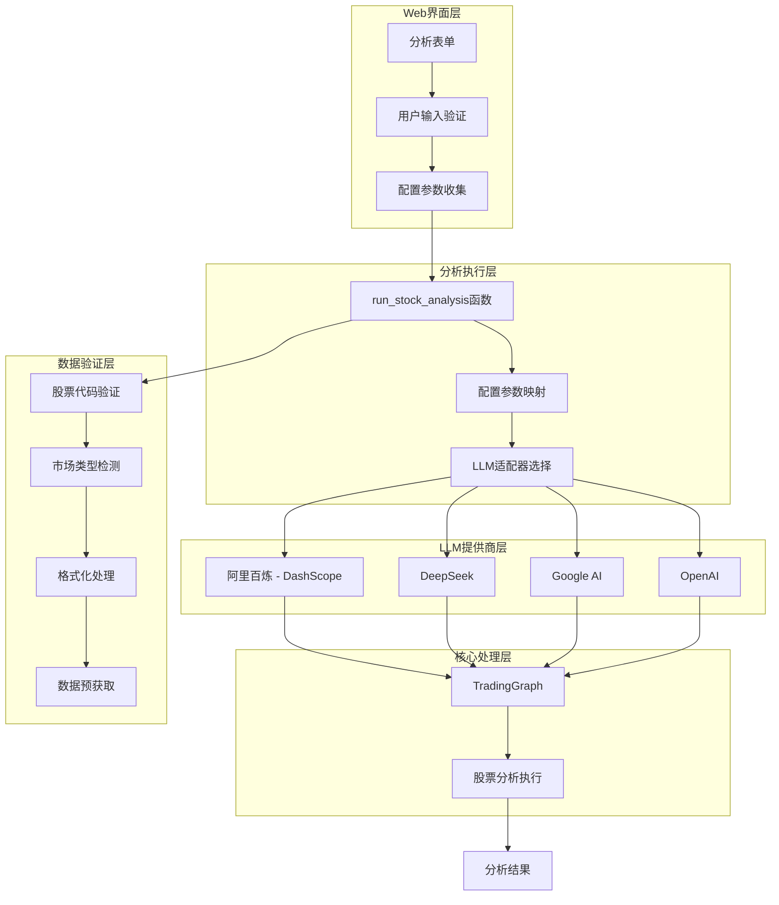
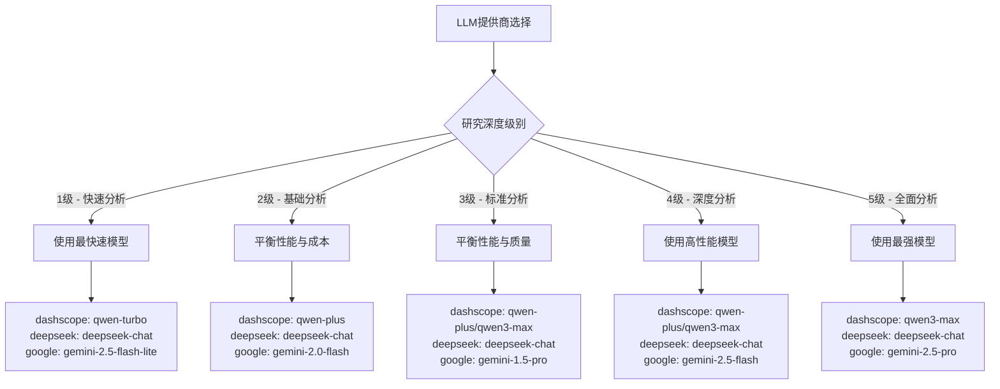
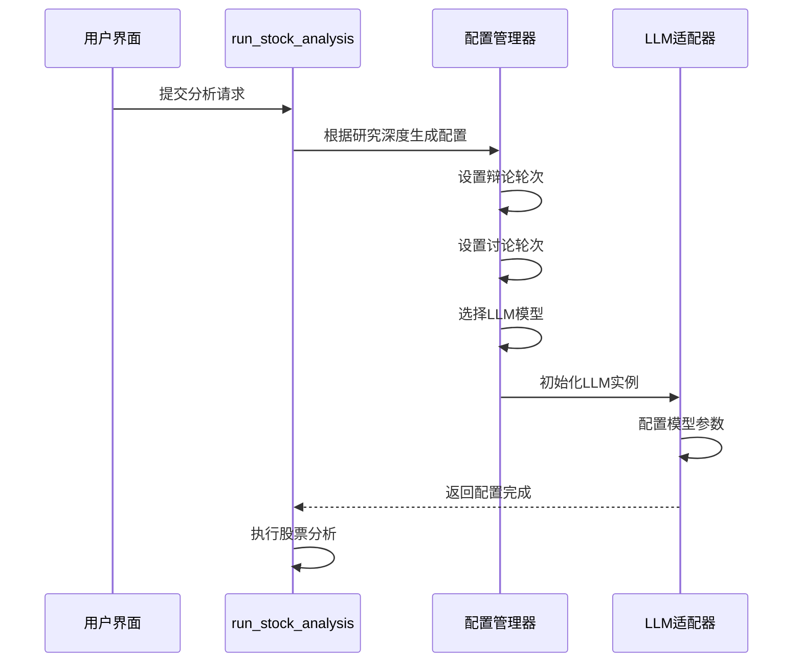
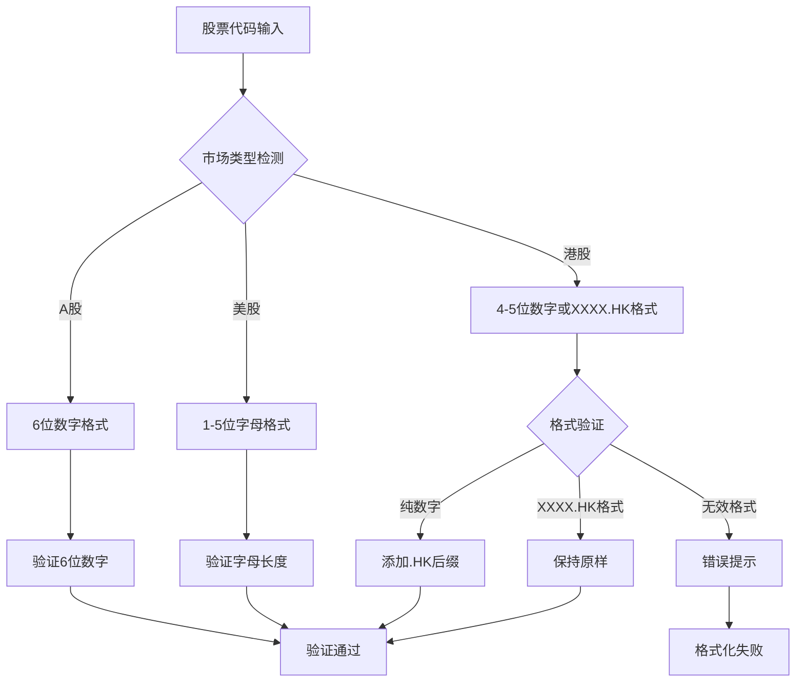
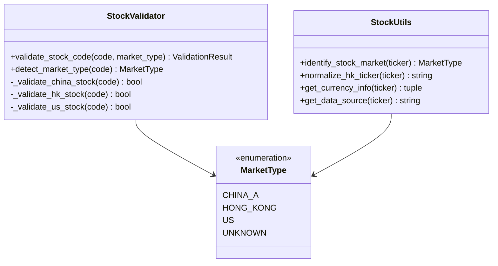
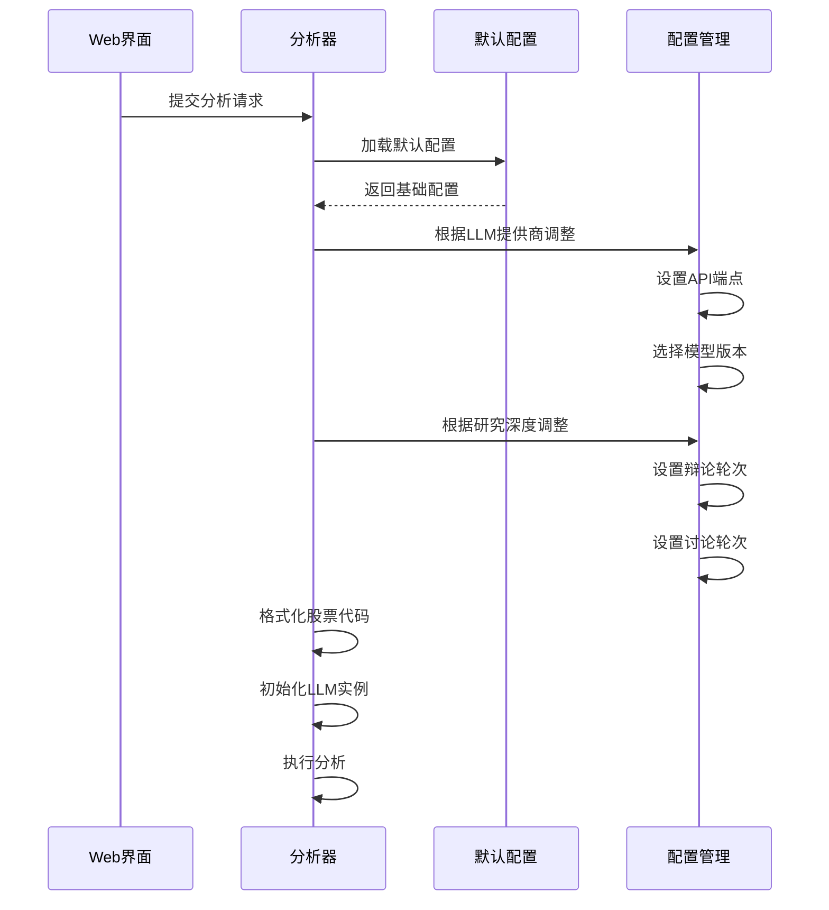
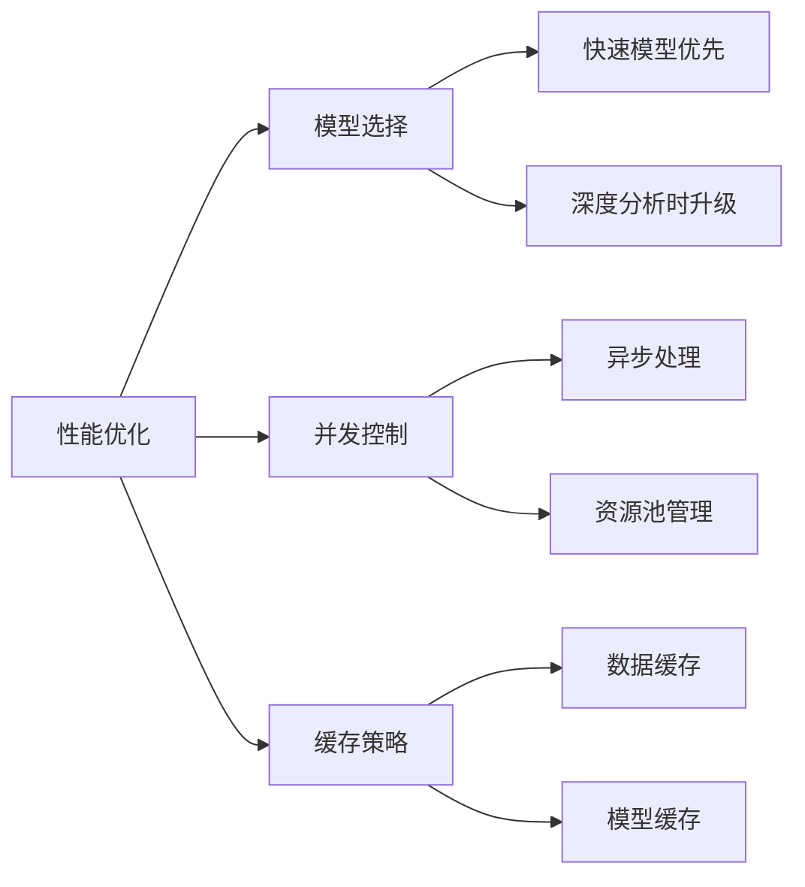
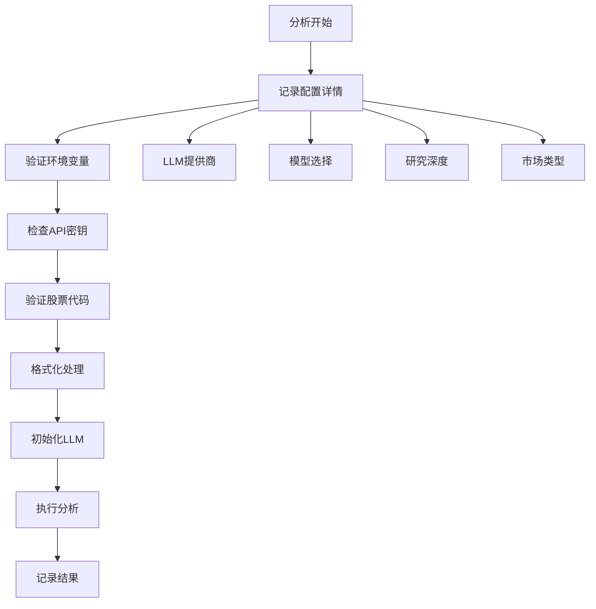

# Web界面配置参数映射

<cite>
**本文档引用的文件**
- [web/utils/analysis_runner.py](file://web/utils/analysis_runner.py)
- [tradingagents/default_config.py](file://tradingagents/default_config.py)
- [tradingagents/llm_adapters/dashscope_adapter.py](file://tradingagents/llm_adapters/dashscope_adapter.py)
- [tradingagents/llm_adapters/deepseek_adapter.py](file://tradingagents/llm_adapters/deepseek_adapter.py)
- [tradingagents/graph/trading_graph.py](file://tradingagents/graph/trading_graph.py)
- [web/components/analysis_form.py](file://web/components/analysis_form.py)
- [tradingagents/utils/stock_validator.py](file://tradingagents/utils/stock_validator.py)
- [tradingagents/utils/stock_utils.py](file://tradingagents/utils/stock_utils.py)
- [cli/utils.py](file://cli/utils.py)
</cite>

## 目录
1. [简介](#简介)
2. [系统架构概览](#系统架构概览)
3. [LLM提供商配置映射](#llm提供商配置映射)
4. [研究深度配置策略](#研究深度配置策略)
5. [市场类型与股票代码格式化](#市场类型与股票代码格式化)
6. [配置参数详解](#配置参数详解)
7. [性能优化与成本控制](#性能优化与成本控制)
8. [故障排除指南](#故障排除指南)
9. [总结](#总结)

## 简介

本文档详细说明了TradingAgents-CN系统中Web界面配置参数如何映射到后端LLM提供商和研究深度设置。系统支持多个LLM提供商（dashscope、deepseek、google、openai等），并提供1-5级灵活的研究深度配置，同时针对不同市场类型（美股、A股、港股）提供相应的股票代码格式化处理。

## 系统架构概览

**图表来源**
- [web/utils/analysis_runner.py](file://web/utils/analysis_runner.py#L99-L611)
- [tradingagents/graph/trading_graph.py](file://tradingagents/graph/trading_graph.py#L120-L212)

## LLM提供商配置映射

### 支持的LLM提供商

系统支持以下LLM提供商，每个提供商都有特定的模型选择策略：

| 提供商 | 主要用途 | 快速思考模型 | 深度思考模型 | 特殊配置 |
|--------|----------|--------------|--------------|----------|
| dashscope | 阿里云大模型服务 | qwen-turbo | qwen-plus/qwen3-max | 支持Function Calling |
| deepseek | 深度求索 | deepseek-chat | deepseek-chat | 专用适配器 |
| google | Google AI | gemini-2.5-flash | gemini-2.5-pro | 基于研究深度优化 |
| openai | OpenAI官方API | gpt-4o-mini | o4-mini/o1 | 标准OpenAI格式 |

### 配置映射逻辑

**图表来源**
- [web/utils/analysis_runner.py](file://web/utils/analysis_runner.py#L257-L420)

**章节来源**
- [web/utils/analysis_runner.py](file://web/utils/analysis_runner.py#L257-L420)
- [tradingagents/llm_adapters/dashscope_adapter.py](file://tradingagents/llm_adapters/dashscope_adapter.py#L1-L199)
- [tradingagents/llm_adapters/deepseek_adapter.py](file://tradingagents/llm_adapters/deepseek_adapter.py#L1-L199)

## 研究深度配置策略

### 研究深度级别定义

| 级别 | 名称 | 辩论轮次 | 风险讨论轮次 | 内存启用 | 在线工具 | 模型选择策略 |
|------|------|----------|--------------|----------|----------|--------------|
| 1 | 快速分析 | 1 | 1 | 是 | 是 | 最快模型，最小成本 |
| 2 | 基础分析 | 1 | 1 | 是 | 是 | 平衡性能与成本 |
| 3 | 标准分析 | 1 | 2 | 是 | 是 | 平衡性能与质量 |
| 4 | 深度分析 | 2 | 2 | 是 | 是 | 高性能模型 |
| 5 | 全面分析 | 3 | 3 | 是 | 是 | 最强模型 |

### 模型选择策略详解

**图表来源**
- [web/utils/analysis_runner.py](file://web/utils/analysis_runner.py#L257-L420)

**章节来源**
- [web/utils/analysis_runner.py](file://web/utils/analysis_runner.py#L257-L420)
- [cli/utils.py](file://cli/utils.py#L105-L145)

## 市场类型与股票代码格式化

### 市场类型检测与验证

系统支持三种主要市场类型，每种市场都有特定的股票代码格式要求：

**图表来源**
- [tradingagents/utils/stock_validator.py](file://tradingagents/utils/stock_validator.py#L130-L170)
- [tradingagents/utils/stock_utils.py](file://tradingagents/utils/stock_utils.py#L107-L156)

### 股票代码格式化规则

| 市场类型 | 格式要求 | 示例 | 格式化逻辑 |
|----------|----------|------|------------|
| A股 | 6位数字 | 000001, 600519 | 保持原样，不做修改 |
| 港股 | 4-5位数字或XXXX.HK | 0700, 0700.HK | 纯数字自动添加.HK后缀 |
| 美股 | 1-5位字母 | AAPL, MSFT, TSLA | 转换为大写 |

### 市场类型检测算法

**图表来源**
- [tradingagents/utils/stock_validator.py](file://tradingagents/utils/stock_validator.py#L130-L170)
- [tradingagents/utils/stock_utils.py](file://tradingagents/utils/stock_utils.py#L49-L105)

**章节来源**
- [tradingagents/utils/stock_validator.py](file://tradingagents/utils/stock_validator.py#L107-L170)
- [tradingagents/utils/stock_utils.py](file://tradingagents/utils/stock_utils.py#L107-L217)
- [web/components/analysis_form.py](file://web/components/analysis_form.py#L40-L120)

## 配置参数详解

### 核心配置参数

系统通过`run_stock_analysis`函数的核心配置参数映射关系如下：

| 参数名称 | 类型 | 描述 | 默认值 | 来源 |
|----------|------|------|--------|------|
| llm_provider | string | LLM提供商标识 | "dashscope" | 用户选择 |
| llm_model | string | 大模型名称 | 动态生成 | 基于提供商和深度 |
| quick_think_llm | string | 快速思考模型 | 动态生成 | 基于提供商和深度 |
| deep_think_llm | string | 深度思考模型 | 动态生成 | 基于提供商和深度 |
| research_depth | int | 研究深度级别 | 3 | 用户选择 |
| max_debate_rounds | int | 最大辩论轮次 | 动态生成 | 基于深度 |
| max_risk_discuss_rounds | int | 最大风险讨论轮次 | 动态生成 | 基于深度 |
| memory_enabled | bool | 内存功能启用 | true | 固定值 |
| online_tools | bool | 在线工具启用 | true | 固定值 |

### 配置生成流程

**图表来源**
- [web/utils/analysis_runner.py](file://web/utils/analysis_runner.py#L200-L420)
- [tradingagents/default_config.py](file://tradingagents/default_config.py#L1-L28)

**章节来源**
- [web/utils/analysis_runner.py](file://web/utils/analysis_runner.py#L200-L420)
- [tradingagents/default_config.py](file://tradingagents/default_config.py#L1-L28)

## 性能优化与成本控制

### Token使用估算

系统实现了智能的Token使用估算机制，用于成本预估和性能监控：

| 研究深度 | 输入Token估算 | 输出Token估算 | 成本因子 |
|----------|---------------|---------------|----------|
| 快速分析 | 1500 × 分析师数量 | 800 × 分析师数量 | 低 |
| 标准分析 | 2500 × 分析师数量 | 1200 × 分析师数量 | 中 |
| 深度分析 | 4000 × 分析师数量 | 2000 × 分析师数量 | 高 |

### 性能优化策略

**图表来源**
- [web/utils/analysis_runner.py](file://web/utils/analysis_runner.py#L473-L494)

**章节来源**
- [web/utils/analysis_runner.py](file://web/utils/analysis_runner.py#L473-L494)

## 故障排除指南

### 常见配置问题

| 问题类型 | 症状 | 可能原因 | 解决方案 |
|----------|------|----------|----------|
| API密钥错误 | 认证失败 | 环境变量未设置 | 检查对应提供商的API密钥 |
| 股票代码格式错误 | 验证失败 | 格式不符合要求 | 按市场类型规范输入 |
| 研究深度超出范围 | 参数异常 | 值不在1-5范围内 | 选择有效的深度级别 |
| LLM提供商不可用 | 连接超时 | 服务端点问题 | 检查网络连接和服务状态 |

### 调试信息记录

系统提供了详细的调试日志记录，帮助诊断配置问题：

**图表来源**
- [web/utils/analysis_runner.py](file://web/utils/analysis_runner.py#L174-L204)

**章节来源**
- [web/utils/analysis_runner.py](file://web/utils/analysis_runner.py#L174-L204)

## 总结

TradingAgents-CN系统的Web界面配置参数映射机制提供了灵活而强大的配置管理能力。通过LLM提供商的智能选择、研究深度的动态调整以及市场类型的精确处理，系统能够为不同用户提供最优的分析体验。

### 关键特性

1. **多提供商支持**：支持dashscope、deepseek、google、openai等多个LLM提供商
2. **灵活的研究深度**：1-5级配置满足不同场景需求
3. **智能市场适配**：自动识别和格式化不同市场的股票代码
4. **性能优化**：基于Token使用估算的成本控制和性能优化
5. **完善的错误处理**：详细的日志记录和错误诊断机制

### 最佳实践建议

1. **快速分析**：选择1-2级深度，使用快速模型以降低成本
2. **标准分析**：推荐3级深度，在性能和质量间取得平衡
3. **深度分析**：选择4-5级深度，使用高性能模型获得最佳结果
4. **市场选择**：根据目标市场选择合适的LLM提供商和模型
5. **成本控制**：定期监控Token使用情况，合理选择分析配置

通过合理配置这些参数，用户可以在保证分析质量的同时，有效控制成本和提高分析效率。