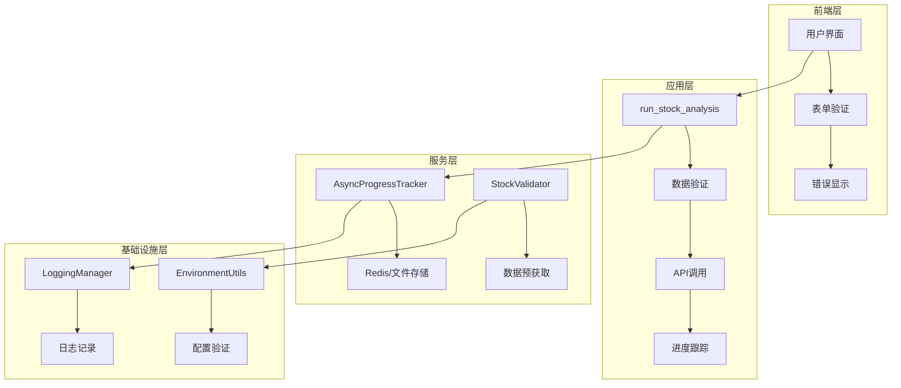
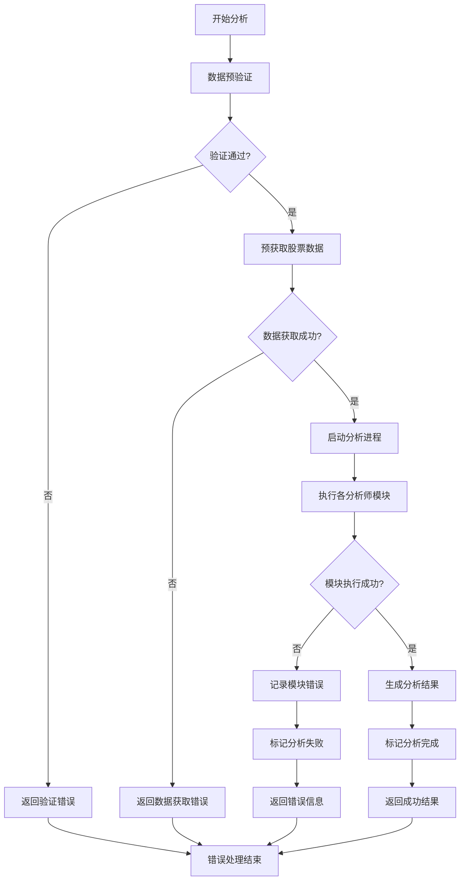
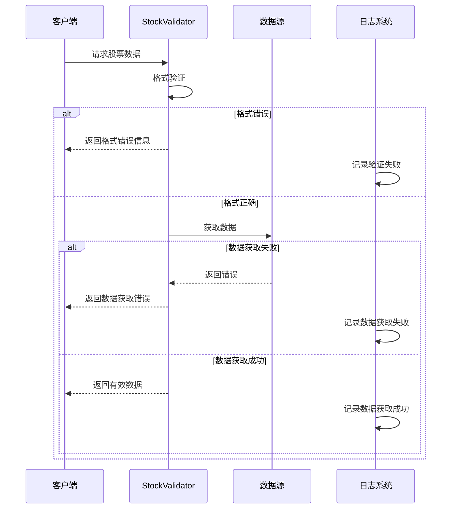
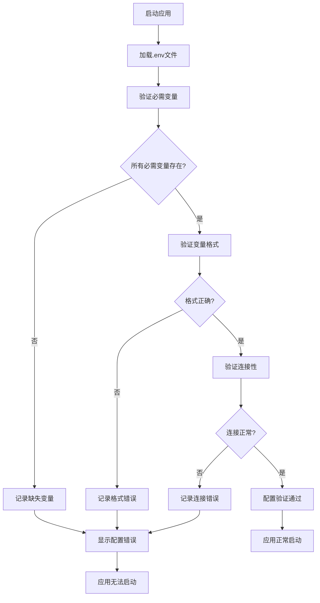
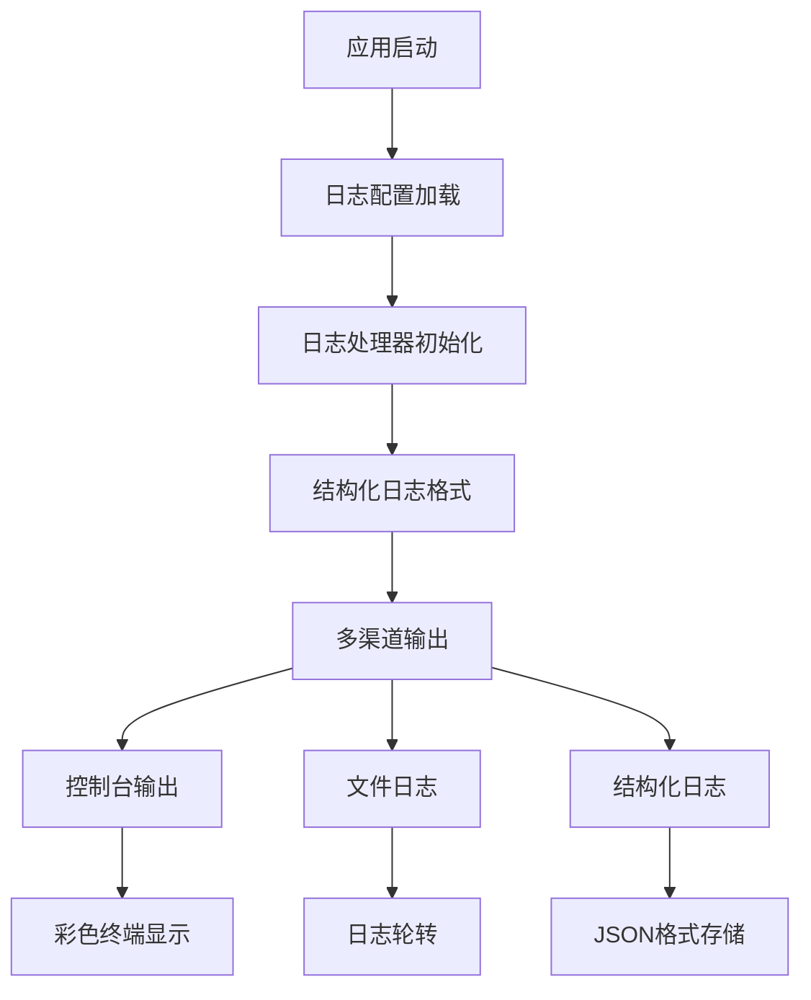
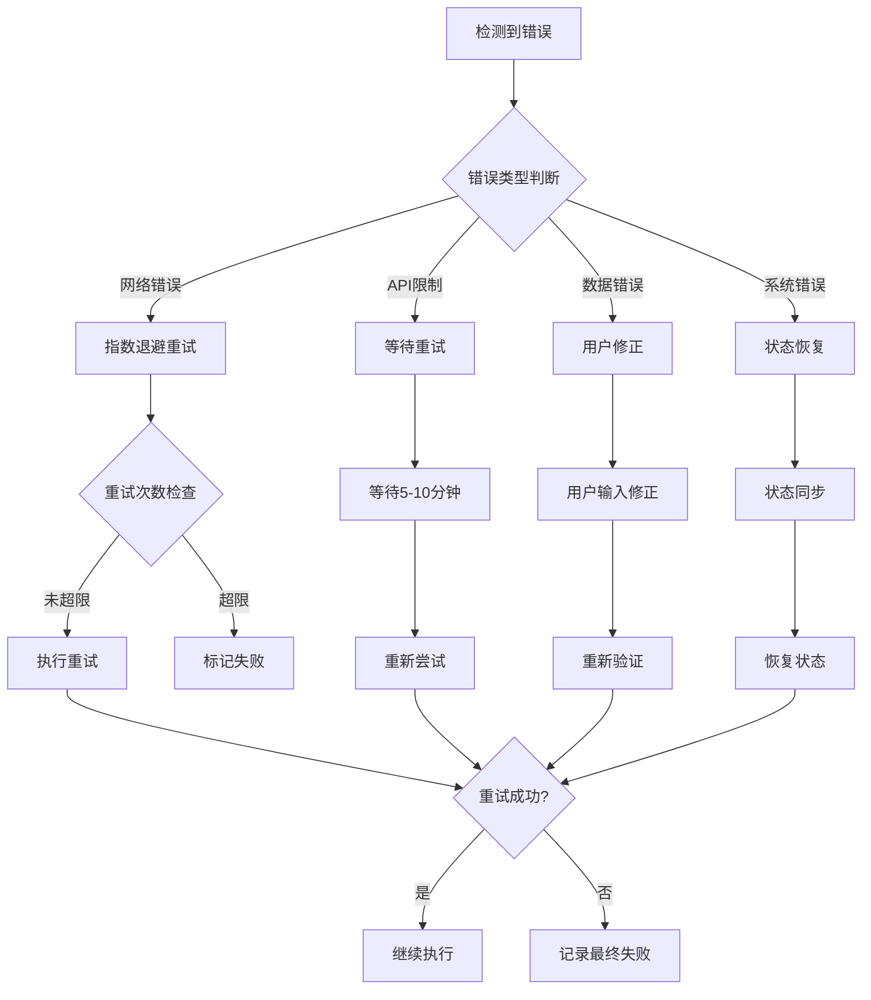

# Web界面错误处理机制

<cite>
**本文档中引用的文件**
- [web/app.py](file://web/app.py)
- [web/utils/analysis_runner.py](file://web/utils/analysis_runner.py)
- [web/utils/async_progress_tracker.py](file://web/utils/async_progress_tracker.py)
- [web/utils/ui_utils.py](file://web/utils/ui_utils.py)
- [web/components/analysis_form.py](file://web/components/analysis_form.py)
- [web/components/results_display.py](file://web/components/results_display.py)
- [tradingagents/utils/logging_manager.py](file://tradingagents/utils/logging_manager.py)
- [tradingagents/utils/stock_validator.py](file://tradingagents/utils/stock_validator.py)
- [tradingagents/config/env_utils.py](file://tradingagents/config/env_utils.py)
- [scripts/test_integration_validation.py](file://scripts/test_integration_validation.py)
</cite>

## 目录
1. [概述](#概述)
2. [系统架构](#系统架构)
3. [run_stock_analysis函数错误处理](#run_stockanalysis函数错误处理)
4. [数据验证错误处理](#数据验证错误处理)
5. [环境变量配置错误处理](#环境变量配置错误处理)
6. [前端错误显示机制](#前端错误显示机制)
7. [日志记录与监控](#日志记录与监控)
8. [用户友好错误提示设计](#用户友好错误提示设计)
9. [错误恢复与重试机制](#错误恢复与重试机制)
10. [故障排查指南](#故障排查指南)

## 概述

TradingAgents-CN Web界面采用多层次的错误处理机制，确保系统在面对各种异常情况时能够优雅降级，并向用户提供清晰的错误信息。该机制涵盖了从数据验证、API调用到前端展示的完整错误处理链路。

### 核心特性

- **分层错误处理**：前端、后端、数据层的全面错误捕获
- **用户友好提示**：清晰易懂的错误信息和解决方案建议
- **详细日志记录**：完整的错误追踪和问题诊断支持
- **自动恢复机制**：智能的错误恢复和状态同步
- **结构化日志**：支持结构化日志格式便于分析

## 系统架构



**图表来源**
- [web/app.py](file://web/app.py#L1214-L1277)
- [web/utils/analysis_runner.py](file://web/utils/analysis_runner.py#L80-L200)
- [web/utils/async_progress_tracker.py](file://web/utils/async_progress_tracker.py#L1-L100)

## run_stock_analysis函数错误处理

`run_stock_analysis`函数是Web界面的核心分析入口，实现了完整的异常捕获和错误响应机制。

### 错误处理流程



**图表来源**
- [web/utils/analysis_runner.py](file://web/utils/analysis_runner.py#L80-L200)

### 关键错误处理点

#### 1. 数据验证阶段
```python
# 数据预获取和验证阶段
update_progress("🔍 验证股票代码并预获取数据...", 1, 10)

try:
    from tradingagents.utils.stock_validator import prepare_stock_data
    preparation_result = prepare_stock_data(
        stock_code=stock_symbol,
        market_type=market_type,
        period_days=30,
        analysis_date=analysis_date
    )

    if not preparation_result.is_valid:
        error_msg = f"❌ 股票数据验证失败: {preparation_result.error_message}"
        update_progress(error_msg)
        logger.error(f"[{session_id}] {error_msg}")

        return {
            'success': False,
            'error': preparation_result.error_message,
            'suggestion': preparation_result.suggestion,
            'stock_symbol': stock_symbol,
            'analysis_date': analysis_date,
            'session_id': session_id
        }
except Exception as e:
    error_msg = f"❌ 数据预获取过程中发生错误: {str(e)}"
    update_progress(error_msg)
    logger.error(f"[{session_id}] {error_msg}")

    return {
        'success': False,
        'error': error_msg,
        'suggestion': "请检查网络连接或稍后重试",
        'stock_symbol': stock_symbol,
        'analysis_date': analysis_date,
        'session_id': session_id
    }
```

#### 2. 异步进度跟踪错误处理
```python
def mark_failed(self, error_message: str):
    """标记分析失败"""
    self.progress_data['status'] = 'failed'
    self.progress_data['last_message'] = f"分析失败: {error_message}"
    self.progress_data['last_update'] = time.time()
    self._save_progress()
    logger.error(f"📊 [异步进度] 分析失败: {self.analysis_id}, 错误: {error_message}")

    # 从日志系统注销
    try:
        from .progress_log_handler import unregister_analysis_tracker
        unregister_analysis_tracker(self.analysis_id)
    except ImportError:
        pass
```

**章节来源**
- [web/utils/analysis_runner.py](file://web/utils/analysis_runner.py#L80-L200)
- [web/utils/async_progress_tracker.py](file://web/utils/async_progress_tracker.py#L680-L700)

## 数据验证错误处理

### 股票代码格式验证

系统实现了严格的股票代码格式验证机制，支持A股、港股、美股三种市场的不同格式要求。

#### 验证规则表

| 市场类型 | 格式要求 | 示例 | 错误提示 |
|---------|---------|------|----------|
| A股 | 6位数字 | 000001, 600519 | "A股代码格式错误，应为6位数字" |
| 港股 | 4-5位数字.HK或纯数字 | 0700.HK, 0700 | "港股代码格式错误" |
| 美股 | 1-5位字母 | AAPL, TSLA | "美股代码格式错误，应为1-5位字母" |

#### 港股特殊处理
```python
def _get_hk_network_limitation_suggestion(self) -> str:
    """获取港股网络限制的详细建议"""
    suggestions = [
        "🌐 港股数据获取受到网络API限制，这是常见的临时问题",
        "",
        "💡 解决方案：",
        "1. 等待5-10分钟后重试（API限制通常会自动解除）",
        "2. 检查网络连接是否稳定",
        "3. 如果是知名港股（如腾讯0700.HK、阿里9988.HK），代码格式通常正确",
        "4. 可以尝试使用其他时间段进行分析",
        "",
        "📋 常见港股代码格式：",
        "• 腾讯控股：0700.HK",
        "• 阿里巴巴：9988.HK",
        "• 美团：3690.HK",
        "• 小米集团：1810.HK",
        "",
        "⏰ 建议稍后重试，或联系技术支持获取帮助"
    ]
    return "\n".join(suggestions)
```

### 数据预获取错误处理



**图表来源**
- [tradingagents/utils/stock_validator.py](file://tradingagents/utils/stock_validator.py#L107-L180)

**章节来源**
- [tradingagents/utils/stock_validator.py](file://tradingagents/utils/stock_validator.py#L107-L200)

## 环境变量配置错误处理

### 配置验证机制

系统提供了完善的环境变量配置验证机制，确保所有必需的配置项都正确设置。

#### 验证流程


#### 环境变量验证函数
```python
def validate_required_env_vars(required_vars: list) -> dict:
    """
    验证必需的环境变量是否已设置
    
    Args:
        required_vars: 必需的环境变量列表
        
    Returns:
        dict: 验证结果
    """
    results = {
        'all_set': True,
        'missing': [],
        'empty': [],
        'valid': []
    }
    
    for var in required_vars:
        info = get_env_info(var)
        
        if not info['exists']:
            results['missing'].append(var)
            results['all_set'] = False
        elif info['empty']:
            results['empty'].append(var)
            results['all_set'] = False
        else:
            results['valid'].append(var)
    
    return results
```

### 配置错误处理

#### 数据库配置错误处理
```python
@staticmethod
def validate_config() -> Dict[str, bool]:
    """
    验证数据库配置是否完整
    
    Returns:
        Dict[str, bool]: 验证结果
    """
    result = {
        'mongodb_valid': False,
        'redis_valid': False
    }
    
    try:
        DatabaseConfig.get_mongodb_config()
        result['mongodb_valid'] = True
    except ValueError:
        pass
    
    try:
        DatabaseConfig.get_redis_config()
        result['redis_valid'] = True
    except ValueError:
        pass
    
    return result
```

**章节来源**
- [tradingagents/config/env_utils.py](file://tradingagents/config/env_utils.py#L183-L243)
- [tradingagents/config/database_config.py](file://tradingagents/config/database_config.py#L56-L118)

## 前端错误显示机制

### Streamlit错误组件使用

Web界面使用Streamlit的内置错误显示组件来向用户展示错误信息。

#### 错误显示组件表

| 组件类型 | 使用场景 | 样式特征 | 示例 |
|---------|---------|---------|------|
| `st.error` | 严重错误，阻止操作 | 红色背景，❌图标 | API密钥错误 |
| `st.warning` | 警告信息，可继续操作 | 黄色背景，⚠️图标 | 数据部分缺失 |
| `st.info` | 信息提示，指导操作 | 蓝色背景，ℹ️图标 | 操作说明 |
| `st.success` | 操作成功 | 绿色背景，✅图标 | 配置验证通过 |

#### 错误显示实现

```python
# 分析失败时的错误显示
if not success and error:
    st.error(f"❌ **分析失败**: {error}")
    st.info("💡 **解决方案**: 请检查API密钥配置，确保网络连接正常，然后重新运行分析。")
    return

# 表单验证错误
elif submitted and not stock_symbol:
    logger.error(f"🔍 [FORM DEBUG] 提交失败：股票代码为空")
    st.error("❌ 请输入股票代码后再提交")
    return {'submitted': False}
```

### 用户界面错误样式

系统定义了统一的错误显示样式，确保错误信息的一致性和可读性。

#### CSS错误样式类
```css
/* 错误框样式 */
.error-box {
    background: linear-gradient(135deg, #f8d7da 0%, #f5c6cb 100%);
    border: 1px solid #f1556c;
    border-radius: 12px;
    padding: 1.5rem;
    margin: 1rem 0;
    box-shadow: 0 4px 15px rgba(245, 198, 203, 0.3);
}

/* 警告框样式 */
.warning-box {
    background: linear-gradient(135deg, #fff3cd 0%, #ffeaa7 100%);
    border: 1px solid #f6d55c;
    border-radius: 12px;
    padding: 1.5rem;
    margin: 1rem 0;
    box-shadow: 0 4px 15px rgba(255, 234, 167, 0.3);
}

/* 成功框样式 */
.success-box {
    background: linear-gradient(135deg, #d4edda 0%, #c3e6cb 100%);
    border: 1px solid #9ae6b4;
    border-radius: 12px;
    padding: 1.5rem;
    margin: 1rem 0;
    box-shadow: 0 4px 15px rgba(154, 230, 180, 0.3);
}
```

**章节来源**
- [web/components/results_display.py](file://web/components/results_display.py#L40-L50)
- [web/utils/ui_utils.py](file://web/utils/ui_utils.py#L79-L140)

## 日志记录与监控

### 结构化日志系统

系统采用统一的结构化日志管理器，提供详细的错误追踪和问题诊断支持。

#### 日志记录层次



#### 日志记录函数

```python
def log_analysis_start(self, logger: logging.Logger, stock_symbol: str, analysis_type: str, session_id: str):
    """记录分析开始"""
    logger.info(
        f"🚀 开始分析 - 股票: {stock_symbol}, 类型: {analysis_type}",
        extra={
            'stock_symbol': stock_symbol,
            'analysis_type': analysis_type,
            'session_id': session_id,
            'event_type': 'analysis_start',
            'timestamp': datetime.now().isoformat()
        }
    )

def log_module_error(self, logger: logging.Logger, module_name: str, stock_symbol: str,
                    session_id: str, duration: float, error: str, **extra_data):
    """记录模块分析错误"""
    logger.error(
        f"❌ [模块错误] {module_name} - 股票: {stock_symbol}, 耗时: {duration:.2f}s, 错误: {error}",
        extra={
            'module_name': module_name,
            'stock_symbol': stock_symbol,
            'session_id': session_id,
            'duration': duration,
            'error': error,
            'event_type': 'module_error',
            'timestamp': datetime.now().isoformat(),
            **extra_data
        },
        exc_info=True
    )
```

### 错误分类与统计

系统提供了错误分类和统计功能，帮助开发者快速定位问题类型。

#### 错误模式识别
```python
def categorize_error_patterns(error_entries):
    """错误模式分类"""
    error_patterns = defaultdict(int)
    for entry in error_entries:
        message = entry.get('message', '')
        # 简单的错误分类
        if 'API' in message or 'api' in message:
            error_patterns['API错误'] += 1
        elif '网络' in message or 'network' in message or 'connection' in message:
            error_patterns['网络错误'] += 1
        elif '数据库' in message or 'database' in message or 'mongodb' in message:
            error_patterns['数据库错误'] += 1
        elif 'PDF' in message or 'pdf' in message:
            error_patterns['PDF导出错误'] += 1
        else:
            error_patterns['其他错误'] += 1
    
    return error_patterns
```

**章节来源**
- [tradingagents/utils/logging_manager.py](file://tradingagents/utils/logging_manager.py#L350-L410)

## 用户友好错误提示设计

### 错误信息设计原则

#### 1. 清晰性原则
- **明确错误类型**：使用具体的错误描述而非模糊术语
- **提供上下文**：包含导致错误的相关信息
- **避免技术术语**：使用用户能理解的语言

#### 2. 可操作性原则
- **提供解决方案**：不仅指出问题，还要给出解决建议
- **分步骤指导**：将复杂的解决过程分解为简单步骤
- **链接资源**：提供相关文档或帮助链接

#### 3. 温和性原则
- **避免责备语言**：使用建设性的表达方式
- **保持积极语气**：即使在错误情况下也要保持鼓励
- **提供希望**：让用户知道问题是可以解决的

### 错误提示模板

#### API配置错误
```
❌ API配置错误

原因：系统无法连接到AI服务提供商
解决方案：
1. 检查您的API密钥是否正确设置
2. 确认网络连接正常
3. 验证API配额是否充足
4. 如仍有问题，请联系技术支持

💡 建议：前往设置页面检查API配置
```

#### 数据获取错误
```
❌ 数据获取失败

原因：无法从数据源获取股票信息
解决方案：
1. 检查股票代码格式是否正确
2. 确认市场类型选择正确
3. 等待几分钟后重试（可能是临时网络问题）
4. 如使用港股，可能需要等待API限制解除

💡 建议：尝试使用其他时间段或市场
```

#### 系统错误
```
❌ 系统内部错误

原因：分析过程中发生未知错误
解决方案：
1. 刷新页面后重试
2. 检查浏览器控制台是否有更多信息
3. 如问题持续，请联系技术支持

💡 建议：记录下您执行的操作，有助于问题排查
```

### 错误恢复建议

#### 自动恢复机制
```python
def suggest_recovery_options(error_type: str) -> str:
    """根据错误类型提供恢复建议"""
    recovery_guides = {
        'network': """
        🌐 网络连接问题：
        1. 检查您的互联网连接
        2. 尝试刷新页面
        3. 如果问题持续，等待几分钟后重试
        """,
        'api_key': """
        🔑 API密钥问题：
        1. 检查.env文件中的API密钥设置
        2. 确认密钥格式正确且未过期
        3. 验证API配额是否充足
        """,
        'stock_data': """
        📊 股票数据问题：
        1. 检查股票代码格式
        2. 确认市场类型选择正确
        3. 尝试使用其他时间段
        """
    }
    
    return recovery_guides.get(error_type, "如仍有问题，请联系技术支持")
```

**章节来源**
- [scripts/test_integration_validation.py](file://scripts/test_integration_validation.py#L128-L165)

## 错误恢复与重试机制

### 智能重试策略

系统实现了多层次的错误恢复机制，包括自动重试、状态同步和错误补偿。

#### 重试机制流程


#### 状态同步机制
```python
def synchronize_state_with_auth_manager():
    """同步前端状态与认证管理器"""
    if st.session_state.get('authenticated', False):
        # 确保auth_manager也知道用户已认证
        if not auth_manager.is_authenticated() and st.session_state.get('user_info'):
            try:
                auth_manager.login_user(
                    st.session_state.user_info, 
                    st.session_state.get('login_time', time.time())
                )
                logger.info("✅ 认证状态同步成功")
            except Exception as e:
                logger.warning(f"⚠️ 认证状态同步失败: {e}")
    else:
        logger.info("✅ 用户已认证，跳过缓存检查")
```

### 进度恢复机制

#### 异步进度跟踪恢复
```python
def recover_analysis_progress(analysis_id: str):
    """恢复分析进度"""
    try:
        # 尝试从Redis恢复
        progress_data = get_progress_by_id(analysis_id)
        
        if progress_data:
            # 恢复进度状态
            st.session_state.analysis_running = (progress_data.get('status') == 'running')
            st.session_state.current_analysis_id = analysis_id
            
            # 恢复分析结果
            if progress_data.get('status') == 'completed':
                st.session_state.analysis_results = format_analysis_results(
                    progress_data.get('raw_results')
                )
            
            logger.info(f"📊 [结果恢复] 从分析 {analysis_id} 恢复结果")
            return True
    except Exception as e:
        logger.warning(f"⚠️ [结果恢复] 恢复失败: {e}")
        return False
```

**章节来源**
- [web/app.py](file://web/app.py#L416-L486)
- [web/utils/async_progress_tracker.py](file://web/utils/async_progress_tracker.py#L680-L747)

## 故障排查指南

### 常见错误诊断

#### 1. API配置问题
**症状**：分析失败，提示API密钥错误
**排查步骤**：
1. 检查.env文件中的API密钥设置
2. 验证API密钥格式是否正确
3. 确认API配额是否充足
4. 测试API连接性

**解决方案**：
```bash
# 检查环境变量
echo $DASHSCOPE_API_KEY
echo $GOOGLE_API_KEY

# 验证配置
python -c "from tradingagents.config.env_utils import validate_required_env_vars; validate_required_env_vars(['DASHSCOPE_API_KEY'])"
```

#### 2. 网络连接问题
**症状**：数据获取失败，提示网络超时
**排查步骤**：
1. 检查网络连接状态
2. 测试DNS解析
3. 检查防火墙设置
4. 验证代理配置

**解决方案**：
```bash
# 测试网络连通性
ping api.example.com
curl -I https://api.example.com

# 检查DNS解析
nslookup api.example.com
```

#### 3. 数据格式问题
**症状**：股票代码验证失败
**排查步骤**：
1. 检查股票代码格式
2. 验证市场类型选择
3. 确认数据源可用性

**解决方案**：
```python
# 验证股票代码格式
from tradingagents.utils.stock_validator import prepare_stock_data

# A股示例
result = prepare_stock_data("000001", "A股")
print(f"验证结果: {result.is_valid}")
print(f"错误信息: {result.error_message}")

# 港股示例  
result = prepare_stock_data("0700.HK", "港股")
print(f"验证结果: {result.is_valid}")
print(f"错误信息: {result.error_message}")
```

### 日志分析工具

#### 错误日志查询
```python
def analyze_error_logs(log_file: str = "./logs/tradingagents.log"):
    """分析错误日志"""
    import json
    from collections import Counter
    
    errors = []
    with open(log_file, 'r', encoding='utf-8') as f:
        for line in f:
            try:
                log_entry = json.loads(line.strip())
                if log_entry.get('level') in ['ERROR', 'CRITICAL']:
                    errors.append(log_entry)
            except:
                continue
    
    # 错误类型统计
    error_types = Counter(entry.get('module', 'unknown') for entry in errors)
    
    print("错误类型统计:")
    for error_type, count in error_types.most_common():
        print(f"  - {error_type}: {count}")
    
    return errors
```

#### 性能监控
```python
def monitor_analysis_performance():
    """监控分析性能"""
    import time
    from collections import deque
    
    # 性能指标队列
    performance_metrics = deque(maxlen=100)
    
    def track_performance(start_time, analysis_id):
        duration = time.time() - start_time
        performance_metrics.append({
            'analysis_id': analysis_id,
            'duration': duration,
            'timestamp': time.time()
        })
        
        # 计算平均性能
        avg_duration = sum(m['duration'] for m in performance_metrics) / len(performance_metrics)
        print(f"平均分析时间: {avg_duration:.2f}秒")
        
        return duration
```

### 系统健康检查

#### 完整健康检查脚本
```python
def comprehensive_health_check():
    """全面系统健康检查"""
    print("🔍 系统健康检查")
    print("=" * 50)
    
    checks = {
        '环境配置': check_environment_setup,
        'API连接': check_api_connections,
        '数据库连接': check_database_connections,
        '文件权限': check_file_permissions,
        '内存使用': check_memory_usage,
    }
    
    results = {}
    for check_name, check_func in checks.items():
        try:
            result = check_func()
            results[check_name] = result
            status = "✅ 通过" if result else "❌ 失败"
            print(f"{check_name}: {status}")
        except Exception as e:
            results[check_name] = False
            print(f"{check_name}: ❌ 异常 - {e}")
    
    return results

def check_environment_setup():
    """检查环境配置"""
    from tradingagents.config.env_utils import validate_required_env_vars
    required_vars = ['DASHSCOPE_API_KEY', 'GOOGLE_API_KEY']
    return validate_required_env_vars(required_vars)['all_set']

def check_api_connections():
    """检查API连接"""
    from tradingagents.config.config_manager import get_config
    config = get_config()
    # 实现API连接测试逻辑
    return True  # 示例返回值
```

**章节来源**
- [scripts/log_analyzer.py](file://scripts/log_analyzer.py#L167-L198)

## 总结

TradingAgents-CN Web界面的错误处理机制体现了现代Web应用的最佳实践，通过多层次的错误捕获、用户友好的错误提示、详细的日志记录和智能的恢复机制，确保了系统的稳定性和用户体验。

### 核心优势

1. **全面覆盖**：从数据验证到系统级别的错误处理
2. **用户友好**：清晰的错误信息和实用的解决方案
3. **可维护性**：结构化的日志记录和详细的错误追踪
4. **健壮性**：智能的错误恢复和重试机制
5. **可扩展性**：模块化的错误处理架构

### 最佳实践建议

1. **持续监控**：定期检查错误日志和系统健康状态
2. **用户反馈**：收集用户在错误处理方面的反馈
3. **自动化测试**：增加错误场景的自动化测试覆盖率
4. **文档更新**：及时更新错误排查和解决方案文档
5. **性能优化**：监控错误处理对系统性能的影响

通过这套完善的错误处理机制，TradingAgents-CN能够为用户提供稳定可靠的股票分析服务，同时为开发者提供强大的问题诊断和解决工具。