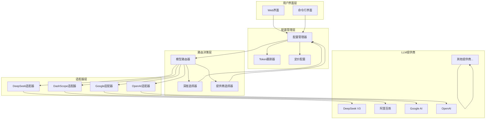
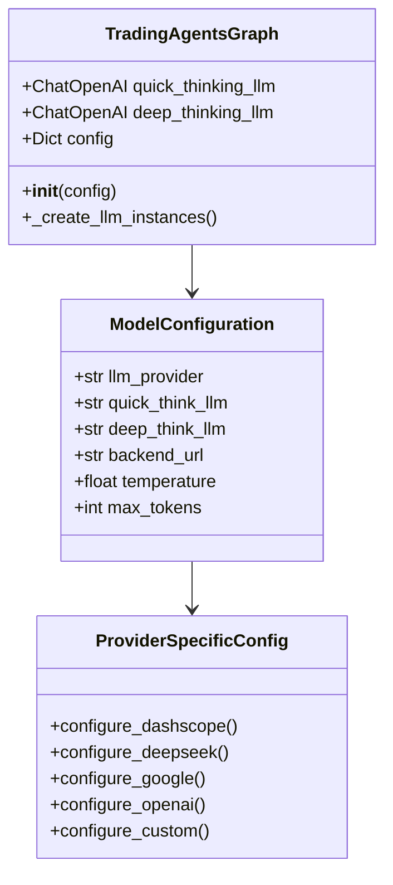
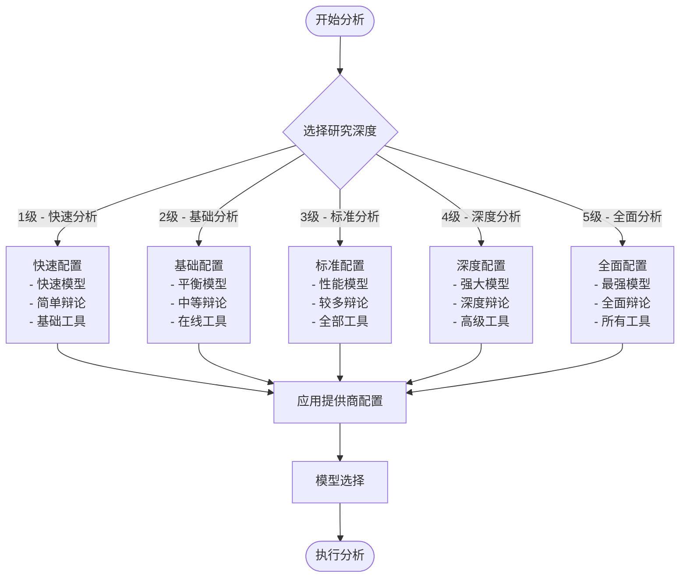
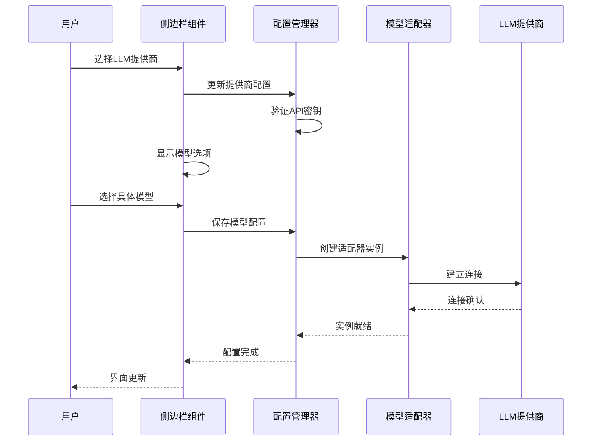
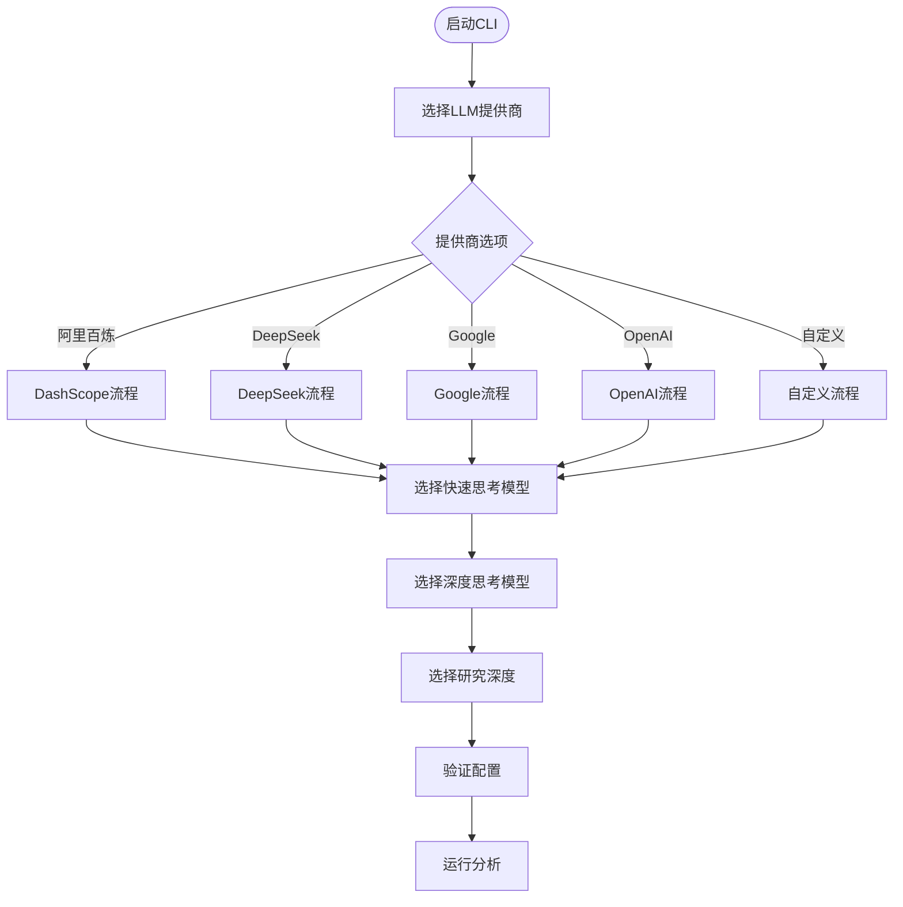
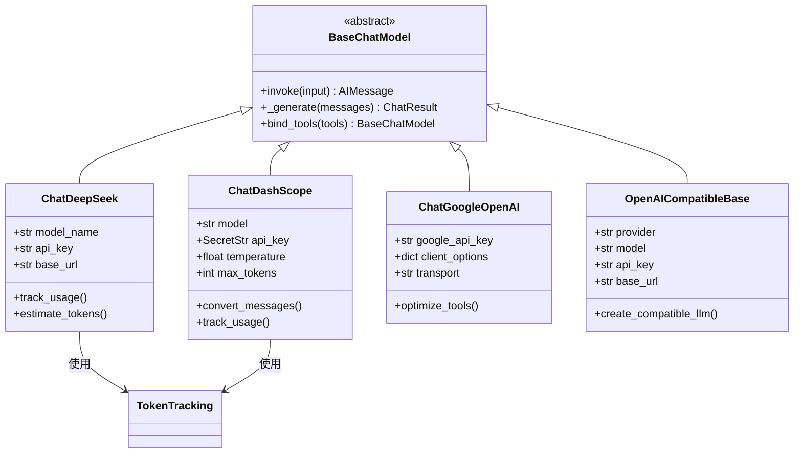
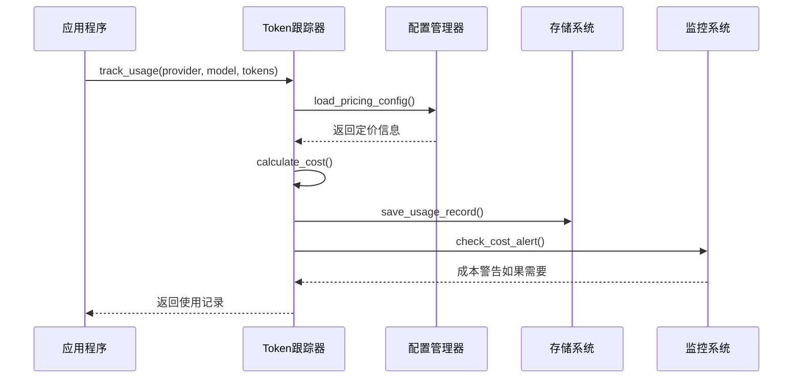
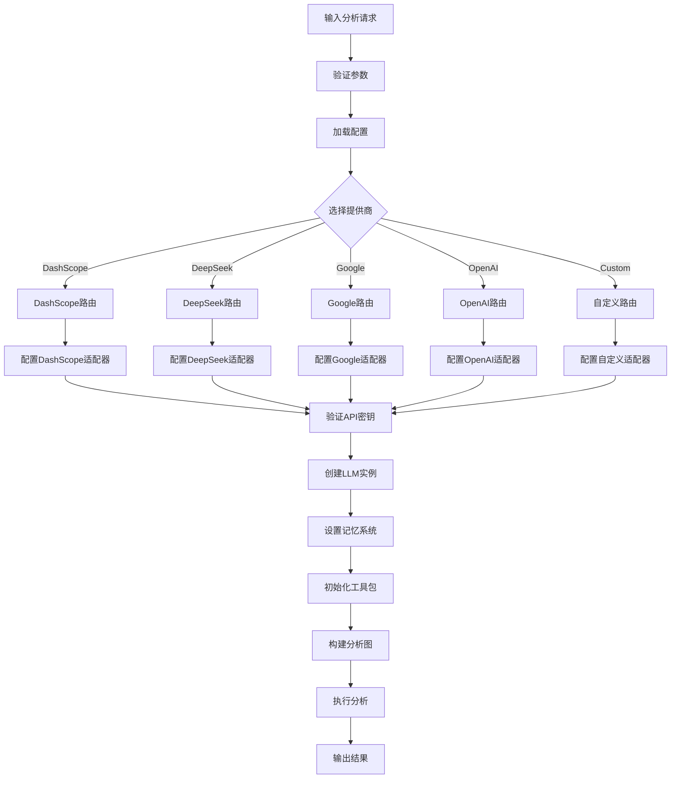

# 模型路由策略

<cite>
**本文档引用的文件**
- [trading_graph.py](file://tradingagents/graph/trading_graph.py)
- [default_config.py](file://tradingagents/default_config.py)
- [analysis_runner.py](file://web/utils/analysis_runner.py)
- [sidebar.py](file://web/components/sidebar.py)
- [deepseek_adapter.py](file://tradingagents/llm_adapters/deepseek_adapter.py)
- [dashscope_adapter.py](file://tradingagents/llm_adapters/dashscope_adapter.py)
- [openai_compatible_base.py](file://tradingagents/llm_adapters/openai_compatible_base.py)
- [config_manager.py](file://tradingagents/config/config_manager.py)
- [cli/utils.py](file://cli/utils.py)
- [app.py](file://web/app.py)
</cite>

## 目录
1. [简介](#简介)
2. [系统架构概览](#系统架构概览)
3. [LLM提供商支持](#llm提供商支持)
4. [模型路由配置机制](#模型路由配置机制)
5. [研究深度与模型选择](#研究深度与模型选择)
6. [Web界面模型选择](#web界面模型选择)
7. [CLI交互式模型选择](#cli交互式模型选择)
8. [模型适配器设计](#模型适配器设计)
9. [成本跟踪与性能监控](#成本跟踪与性能监控)
10. [路由决策流程](#路由决策流程)
11. [最佳实践与优化建议](#最佳实践与优化建议)
12. [故障排除指南](#故障排除指南)

## 简介

TradingAgents-CN系统采用智能模型路由策略，根据LLM提供商、研究深度和任务类型自动选择最适合的模型。该系统支持多种主流LLM提供商，包括DeepSeek、Google、DashScope、OpenAI等，并能够根据不同分析需求动态调整模型配置。

核心特性：
- **多提供商支持**：统一接口支持8个主要LLM提供商
- **智能路由**：基于研究深度和任务类型的自动模型选择
- **成本控制**：实时Token跟踪和成本监控
- **性能优化**：针对不同场景的模型优化配置
- **用户体验**：直观的Web界面和CLI交互

## 系统架构概览

**图表来源**
- [trading_graph.py](file://tradingagents/graph/trading_graph.py#L39-L441)
- [config_manager.py](file://tradingagents/config/config_manager.py#L1-L200)

## LLM提供商支持

系统支持以下LLM提供商，每个提供商都有其独特的优势和适用场景：

### 支持的提供商列表

| 提供商 | 代号 | 主要模型 | 优势特点 | 适用场景 |
|--------|------|----------|----------|----------|
| 阿里百炼 | dashscope | qwen-turbo, qwen-plus, qwen-max | 中文优化、高性价比 | 国内用户、中文分析 |
| DeepSeek | deepseek | deepseek-chat | 强推理能力、开源友好 | 技术分析、深度研究 |
| Google AI | google | gemini-2.5-pro, gemini-2.5-flash | 多模态理解、快速推理 | 复杂推理、多媒体分析 |
| OpenAI | openai | gpt-4o, o1, gpt-4-turbo | 最新技术、广泛验证 | 通用分析、创新应用 |
| 百度千帆 | qianfan | ernie-3.5-8k, ernie-4.0-turbo-8k | 中文专家、稳定可靠 | 金融分析、中文语境 |
| Anthropic | anthropic | claude-3-5-sonnet | 安全性高、推理能力强 | 敏感数据分析 |
| SiliconFlow | siliconflow | 各种开源模型 | 灵活部署、成本可控 | 开发测试、定制化 |

**节来源**
- [trading_graph.py](file://tradingagents/graph/trading_graph.py#L50-L235)
- [analysis_runner.py](file://web/utils/analysis_runner.py#L250-L449)

## 模型路由配置机制

### quick_thinking_llm和deep_thinking_llm配置

系统采用双模型架构，区分快速思考和深度思考两种模式：

**图表来源**
- [trading_graph.py](file://tradingagents/graph/trading_graph.py#L101-L121)

### 配置优先级机制

系统采用多层次配置优先级：

1. **运行时配置**：通过参数传递的即时配置
2. **环境变量**：系统级别的环境变量设置
3. **用户配置**：用户自定义的配置文件
4. **默认配置**：系统内置的默认值

**节来源**
- [trading_graph.py](file://tradingagents/graph/trading_graph.py#L50-L235)
- [default_config.py](file://tradingagents/default_config.py#L1-L28)

## 研究深度与模型选择

### 研究深度分级体系

系统定义了五个研究深度级别，每个级别对应不同的模型配置：

**图表来源**
- [analysis_runner.py](file://web/utils/analysis_runner.py#L250-L380)

### 不同深度级别的模型配置

| 研究深度 | 辩论轮次 | 内存启用 | 在线工具 | 快速模型 | 深度模型 |
|----------|----------|----------|----------|----------|----------|
| 1级 - 快速分析 | 1轮 | 否 | 否 | 轻量级模型 | 轻量级模型 |
| 2级 - 基础分析 | 1轮 | 是 | 是 | 快速模型 | 标准模型 |
| 3级 - 标准分析 | 1轮 | 是 | 是 | 标准模型 | 标准模型 |
| 4级 - 深度分析 | 2轮 | 是 | 是 | 标准模型 | 强大模型 |
| 5级 - 全面分析 | 3轮 | 是 | 是 | 强大模型 | 强大模型 |

**节来源**
- [analysis_runner.py](file://web/utils/analysis_runner.py#L250-L380)

## Web界面模型选择

### Web界面交互流程

**图表来源**
- [sidebar.py](file://web/components/sidebar.py#L213-L280)
- [analysis_runner.py](file://web/utils/analysis_runner.py#L250-L449)

### Web界面配置选项

Web界面提供了直观的模型选择界面：

1. **LLM提供商选择**：下拉菜单选择主要提供商
2. **模型类别切换**：根据提供商显示相应模型
3. **模型参数配置**：温度、最大token等参数调整
4. **API密钥管理**：安全的密钥存储和验证
5. **配置持久化**：自动保存用户偏好设置

**节来源**
- [sidebar.py](file://web/components/sidebar.py#L213-L280)

## CLI交互式模型选择

### CLI选择流程

**图表来源**
- [cli/utils.py](file://cli/utils.py#L105-L363)

### CLI配置管理

CLI提供了完整的交互式配置体验：

1. **提供商选择**：使用方向键导航的交互式选择
2. **模型选择**：根据提供商显示相应的模型选项
3. **深度配置**：灵活的研究深度设置
4. **配置验证**：自动验证API密钥和配置有效性
5. **配置保存**：临时配置管理

**节来源**
- [cli/utils.py](file://cli/utils.py#L105-L363)

## 模型适配器设计

### 适配器架构模式

**图表来源**
- [deepseek_adapter.py](file://tradingagents/llm_adapters/deepseek_adapter.py#L30-L262)
- [dashscope_adapter.py](file://tradingagents/llm_adapters/dashscope_adapter.py#L30-L293)
- [openai_compatible_base.py](file://tradingagents/llm_adapters/openai_compatible_base.py#L381-L434)

### 特色功能实现

#### DeepSeek适配器特色
- **Token统计**：精确的输入输出token跟踪
- **成本计算**：实时成本监控和预警
- **估算机制**：当API不提供token信息时的估算算法
- **会话管理**：基于会话ID的成本分组

#### DashScope适配器特色
- **格式转换**：LangChain格式到DashScope格式的自动转换
- **工具绑定**：OpenAI工具格式的兼容性处理
- **异步支持**：同步和异步调用的双重支持
- **模型验证**：支持的模型列表验证

**节来源**
- [deepseek_adapter.py](file://tradingagents/llm_adapters/deepseek_adapter.py#L30-L262)
- [dashscope_adapter.py](file://tradingagents/llm_adapters/dashscope_adapter.py#L30-L293)

## 成本跟踪与性能监控

### Token跟踪系统

**图表来源**
- [config_manager.py](file://tradingagents/config/config_manager.py#L652-L725)

### 成本控制机制

系统实现了多层次的成本控制：

1. **实时成本计算**：每次API调用后立即计算成本
2. **会话成本汇总**：按会话ID汇总成本信息
3. **全局成本监控**：每日、每周成本趋势分析
4. **成本预警**：达到阈值时的自动提醒
5. **历史记录**：完整的使用历史追踪

**节来源**
- [config_manager.py](file://tradingagents/config/config_manager.py#L652-L725)

## 路由决策流程

### 完整路由决策流程

**图表来源**
- [trading_graph.py](file://tradingagents/graph/trading_graph.py#L39-L441)

### 动态模型选择逻辑

系统根据多个因素动态选择最优模型：

1. **任务复杂度评估**：根据分析类型和深度要求
2. **性能指标考虑**：响应时间、准确率、成本等因素
3. **资源可用性**：当前负载、可用token限制
4. **用户偏好**：历史选择、个人偏好设置
5. **成本效益分析**：性价比最优的选择

**节来源**
- [analysis_runner.py](file://web/utils/analysis_runner.py#L250-L449)

## 最佳实践与优化建议

### 模型选择最佳实践

#### 根据使用场景选择模型

**快速分析场景**：
- 选择轻量级模型（如DeepSeek Chat、Qwen Turbo）
- 研究深度：1-2级
- 关注响应速度和成本

**深度分析场景**：
- 选择高性能模型（如DeepSeek V3、Gemini Pro、GPT-4）
- 研究深度：3-5级
- 关注分析质量和准确性

**成本敏感场景**：
- 优先选择免费或低成本模型
- 合理设置研究深度
- 启用Token跟踪监控

#### 性能优化建议

1. **合理配置温度参数**：0.1-0.3用于一致性要求高的场景
2. **控制最大token数**：根据具体需求设置合理的上限
3. **启用缓存机制**：对于重复查询启用适当的缓存
4. **监控API配额**：定期检查各提供商的API使用情况

### 配置管理建议

1. **环境变量管理**：使用.env文件管理API密钥
2. **配置备份**：定期备份重要的配置文件
3. **版本控制**：对配置文件进行版本控制
4. **权限管理**：严格控制配置文件的访问权限

## 故障排除指南

### 常见问题及解决方案

#### API密钥相关问题

**问题**：API密钥验证失败
**解决方案**：
1. 检查环境变量设置是否正确
2. 验证API密钥格式是否符合要求
3. 确认密钥权限是否足够
4. 检查网络连接和防火墙设置

#### 模型选择问题

**问题**：指定模型不可用
**解决方案**：
1. 检查模型名称拼写是否正确
2. 验证模型是否在当前提供商中可用
3. 查看提供商的模型列表更新
4. 尝试使用默认模型作为替代

#### 性能问题

**问题**：分析响应时间过长
**解决方案**：
1. 降低研究深度级别
2. 选择更快的模型变体
3. 检查网络延迟和带宽
4. 优化输入数据大小

#### 成本过高问题

**问题**：Token使用量超出预期
**解决方案**：
1. 启用Token跟踪功能
2. 设置成本预警阈值
3. 优化提示词长度
4. 考虑使用更经济的模型

### 调试工具和技巧

1. **日志分析**：启用详细日志记录
2. **性能监控**：使用内置的性能监控工具
3. **配置验证**：定期验证配置的有效性
4. **测试模式**：使用测试模式验证配置

**节来源**
- [config_manager.py](file://tradingagents/config/config_manager.py#L1-L200)
- [trading_graph.py](file://tradingagents/graph/trading_graph.py#L39-L441)

## 结论

TradingAgents-CN的模型路由策略通过智能化的配置管理、灵活的适配器架构和完善的成本控制机制，为用户提供了一个高效、可靠且经济的LLM解决方案。系统不仅支持多种主流LLM提供商，还能根据具体的分析需求自动选择最优的模型配置，同时提供实时的成本监控和性能优化建议。

通过本文档的详细介绍，用户可以充分了解系统的模型路由机制，掌握最佳实践，并能够有效地进行故障排除和性能优化。随着LLM技术的不断发展，该路由策略也将持续演进，为用户提供更加智能和高效的分析体验。