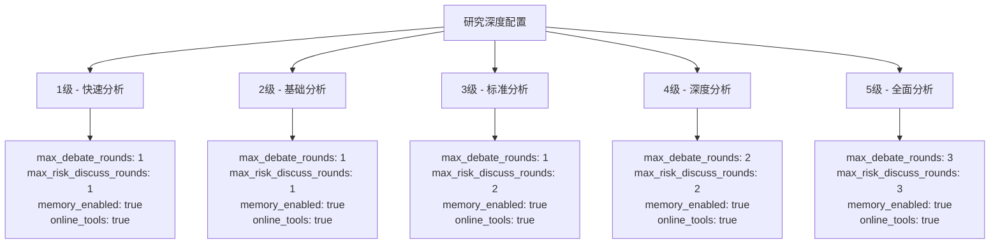
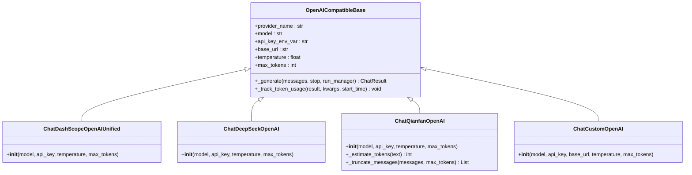
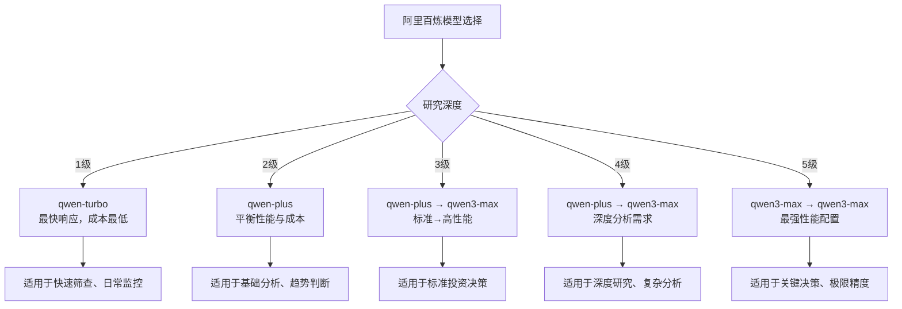
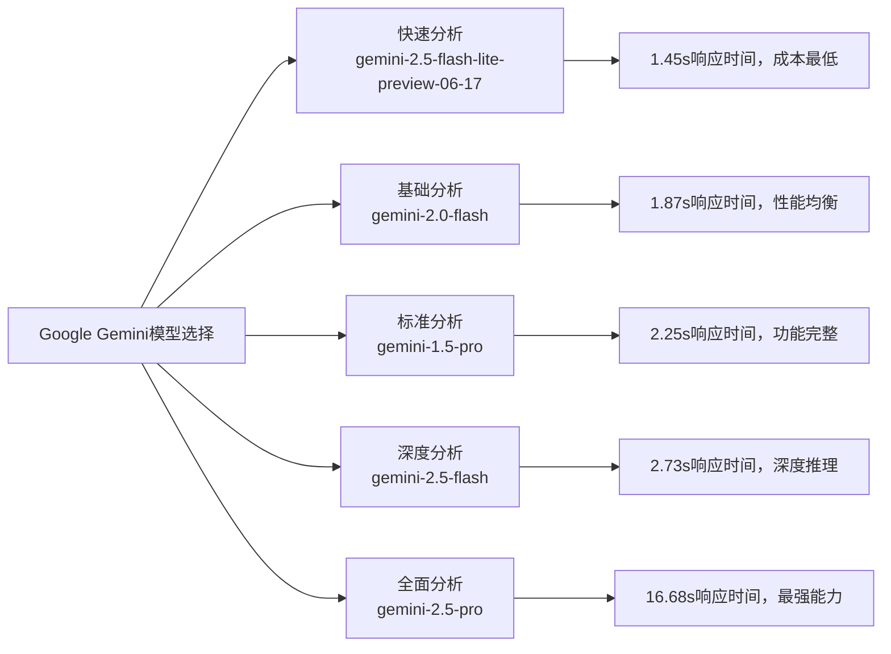
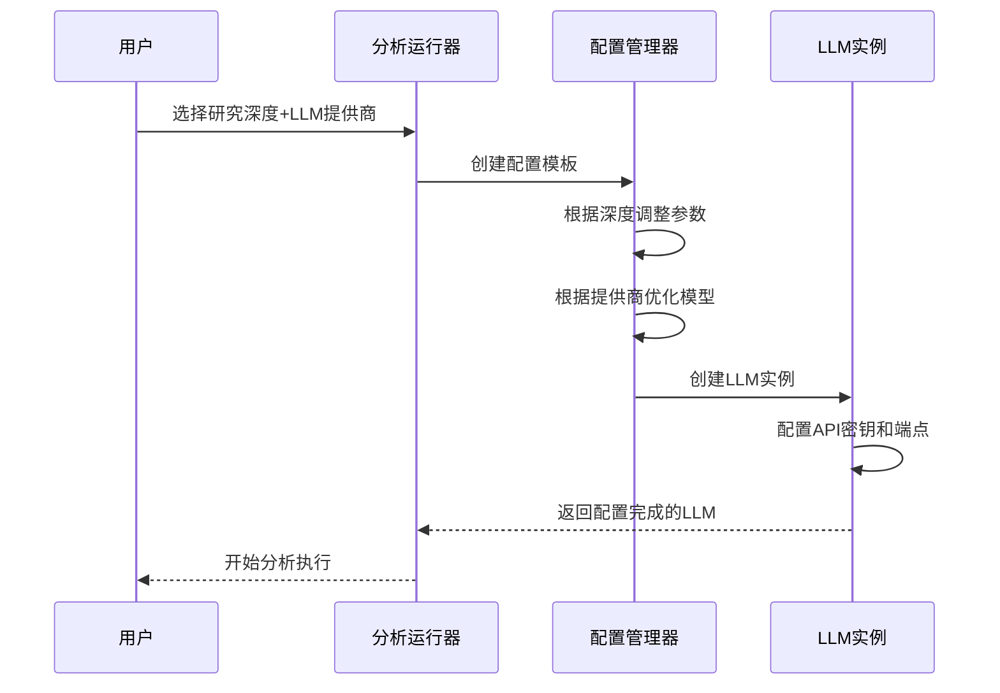

# LLM模型选择策略

<cite>
**本文档引用的文件**
- [web/utils/analysis_runner.py](file://web/utils/analysis_runner.py)
- [cli/utils.py](file://cli/utils.py)
- [tradingagents/llm_adapters/openai_compatible_base.py](file://tradingagents/llm_adapters/openai_compatible_base.py)
- [tradingagents/graph/trading_graph.py](file://tradingagents/graph/trading_graph.py)
- [tests/test_gemini.py](file://tests/test_gemini.py)
- [examples/demo_deepseek_analysis.py](file://examples/demo_deepseek_analysis.py)
- [main.py](file://main.py)
</cite>

## 目录
1. [概述](#概述)
2. [研究深度配置体系](#研究深度配置体系)
3. [LLM提供商架构](#llm提供商架构)
4. [模型映射策略](#模型映射策略)
5. [动态配置机制](#动态配置机制)
6. [成本与性能优化](#成本与性能优化)
7. [实际应用示例](#实际应用示例)
8. [故障排除指南](#故障排除指南)
9. [总结](#总结)

## 概述

TradingAgents-CN采用了先进的LLM模型选择策略，基于研究深度（research_depth）和LLM提供商（llm_provider）的双重维度，动态选择最优的quick_think_llm和deep_think_llm模型组合。该策略在保证分析质量的同时，最大化成本效益和响应速度。

### 核心设计理念

- **双模型分离**：区分快速思考（quick_think）和深度思考（deep_think）模型
- **研究深度适配**：根据分析复杂度动态调整模型配置
- **提供商优化**：针对不同LLM提供商的特点进行专门优化
- **成本效益平衡**：在质量和成本之间找到最佳平衡点

## 研究深度配置体系

系统定义了五个研究深度级别，每个级别对应不同的分析复杂度和资源消耗：



**图表来源**
- [web/utils/analysis_runner.py](file://web/utils/analysis_runner.py#L230-L300)

### 各深度级别的特征

| 研究深度 | 辩论轮次 | 风险讨论轮次 | 内存启用 | 在线工具 | 适用场景 |
|---------|----------|-------------|----------|----------|----------|
| 1级 - 快速分析 | 1 | 1 | 是 | 是 | 日常监控、快速筛选 |
| 2级 - 基础分析 | 1 | 1 | 是 | 是 | 初步评估、趋势观察 |
| 3级 - 标准分析 | 1 | 2 | 是 | 是 | 正常投资决策 |
| 4级 - 深度分析 | 2 | 2 | 是 | 是 | 重要投资决策 |
| 5级 - 全面分析 | 3 | 3 | 是 | 是 | 关键战略决策 |

**节来源**
- [web/utils/analysis_runner.py](file://web/utils/analysis_runner.py#L230-L300)

## LLM提供商架构

系统支持多种LLM提供商，每个提供商都有专门的适配器和优化策略：



**图表来源**
- [tradingagents/llm_adapters/openai_compatible_base.py](file://tradingagents/llm_adapters/openai_compatible_base.py#L30-L150)

### 主要提供商特性

| 提供商 | 优势 | 适用场景 | 成本特点 |
|--------|------|----------|----------|
| 阿里百炼(DashScope) | 中文理解优秀、成本低 | 国内用户、中文分析 | 低至中等 |
| DeepSeek | 推理能力强、性价比高 | 复杂分析、科学计算 | 很低 |
| Google Gemini | 多模态能力强、创新功能 | 创意分析、多媒体 | 中等 |
| 百度千帆(Qianfan) | 稳定性强、政府支持 | 企业级应用 | 中等 |
| OpenAI | 生态完善、功能丰富 | 专业分析、集成需求 | 高 |

**节来源**
- [tradingagents/llm_adapters/openai_compatible_base.py](file://tradingagents/llm_adapters/openai_compatible_base.py#L320-L400)

## 模型映射策略

### 阿里百炼(DashScope)模型映射

阿里百炼提供了完整的模型系列，支持从轻量级到高性能的全覆盖：



**图表来源**
- [web/utils/analysis_runner.py](file://web/utils/analysis_runner.py#L250-L290)

### DeepSeek模型映射

DeepSeek以其强大的推理能力和高性价比著称：

| 研究深度 | 快速思考模型 | 深度思考模型 | 选择理由 |
|----------|-------------|-------------|----------|
| 1级-2级 | deepseek-chat | deepseek-chat | 单一模型，性价比最高 |
| 3级-5级 | deepseek-chat | deepseek-chat | 统一模型，一致性好 |

**节来源**
- [web/utils/analysis_runner.py](file://web/utils/analysis_runner.py#L270-L290)

### Google Gemini模型映射

Google Gemini提供了最新的多模态模型，支持最先进的AI功能：



**图表来源**
- [web/utils/analysis_runner.py](file://web/utils/analysis_runner.py#L300-L320)

### 百度千帆(Qianfan)模型映射

千帆平台提供了稳定的企业级服务：

| 研究深度 | 快速思考模型 | 深度思考模型 | 特点 |
|----------|-------------|-------------|------|
| 1级-2级 | ernie-3.5-8k | ernie-3.5-8k | 稳定可靠，适合日常 |
| 3级-4级 | ernie-3.5-8k | ernie-4.0-turbo-8k | 性能提升，推理增强 |
| 5级 | ernie-4.0-turbo-8k | ernie-4.0-turbo-8k | 最强能力，适合关键决策 |

**节来源**
- [web/utils/analysis_runner.py](file://web/utils/analysis_runner.py#L290-L300)

## 动态配置机制

系统通过分析运行器(analysis_runner)实现了智能的动态配置机制：



**图表来源**
- [web/utils/analysis_runner.py](file://web/utils/analysis_runner.py#L150-L350)

### 配置优先级机制

系统采用多层次的配置优先级：

1. **用户显式配置**：用户直接指定的模型和参数
2. **深度级别配置**：基于研究深度的自动优化
3. **提供商默认配置**：各提供商的最佳实践配置
4. **环境变量配置**：API密钥和基础URL
5. **系统默认配置**：最低限度的系统配置

**节来源**
- [web/utils/analysis_runner.py](file://web/utils/analysis_runner.py#L400-L500)

## 成本与性能优化

### 成本优化策略

系统通过多种策略实现成本优化：

```mermaid
mindmap
root((成本优化))
研究深度适配
快速分析用轻量模型
标准分析用平衡模型
深度分析用高性能模型
模型选择策略
快速思考用Turbo
深度思考用Max
统一模型减少切换
资源利用优化
内存复用
工具调用优化
并发处理
服务商选择
国内服务商成本低
国际服务商功能强
混合使用平衡
```

### 性能监控与追踪

系统集成了完整的Token使用监控：

| 监控指标 | 用途 | 实现方式 |
|----------|------|----------|
| 输入Token数 | 成本计算 | 自动统计 |
| 输出Token数 | 效果评估 | 响应解析 |
| 响应时间 | 性能评估 | 时间戳记录 |
| 请求频率 | 资源管理 | 计数器跟踪 |
| 错误率 | 稳定性监控 | 异常捕获 |

**节来源**
- [tradingagents/llm_adapters/openai_compatible_base.py](file://tradingagents/llm_adapters/openai_compatible_base.py#L150-L200)

## 实际应用示例

### 示例1：阿里百炼快速分析

```python
# 配置示例：快速分析场景
config = {
    "llm_provider": "dashscope",
    "research_depth": 1,
    "quick_think_llm": "qwen-turbo",
    "deep_think_llm": "qwen-plus",
    "max_debate_rounds": 1,
    "max_risk_discuss_rounds": 1
}
```

**应用场景**：每日股票监控、实时新闻分析、快速趋势判断

### 示例2：DeepSeek深度分析

```python
# 配置示例：深度分析场景  
config = {
    "llm_provider": "deepseek",
    "research_depth": 4,
    "quick_think_llm": "deepseek-chat",
    "deep_think_llm": "deepseek-chat",
    "max_debate_rounds": 2,
    "max_risk_discuss_rounds": 2
}
```

**应用场景**：投资组合优化、风险评估、复杂策略制定

### 示例3：Google Gemini综合分析

```python
# 配置示例：综合分析场景
config = {
    "llm_provider": "google",
    "research_depth": 3,
    "quick_think_llm": "gemini-1.5-pro",
    "deep_think_llm": "gemini-2.5-flash",
    "max_debate_rounds": 1,
    "max_risk_discuss_rounds": 2
}
```

**应用场景**：多维度分析、创意策略、跨领域知识整合

**节来源**
- [examples/demo_deepseek_analysis.py](file://examples/demo_deepseek_analysis.py#L50-L150)
- [tests/test_gemini.py](file://tests/test_gemini.py#L100-L200)

## 故障排除指南

### 常见问题及解决方案

| 问题类型 | 症状 | 可能原因 | 解决方案 |
|----------|------|----------|----------|
| API密钥错误 | Authentication failed | 环境变量未设置或格式错误 | 检查API密钥格式和环境变量 |
| 模型不可用 | Model not found | 模型名称错误或权限不足 | 验证模型名称和账户权限 |
| 响应超时 | Timeout error | 网络问题或模型负载过高 | 检查网络连接，考虑降级模型 |
| 成本过高 | 账单异常 | 使用了高性能模型 | 调整研究深度或选择低成本模型 |
| 性能不佳 | 分析质量差 | 模型选择不当 | 根据需求重新选择模型 |

### 配置验证清单

1. **环境变量检查**
   - [ ] DASHSCOPE_API_KEY
   - [ ] DEEPSEEK_API_KEY  
   - [ ] GOOGLE_API_KEY
   - [ ] CUSTOM_OPENAI_API_KEY

2. **模型可用性验证**
   - [ ] 确认模型名称正确
   - [ ] 检查账户余额和配额
   - [ ] 验证网络连接

3. **配置参数验证**
   - [ ] 研究深度范围(1-5)
   - [ ] LLM提供商支持
   - [ ] 快速思考模型与深度思考模型兼容性

**节来源**
- [web/utils/analysis_runner.py](file://web/utils/analysis_runner.py#L180-L220)

## 总结

TradingAgents-CN的LLM模型选择策略体现了现代AI应用的最佳实践：

### 核心优势

1. **智能化选择**：基于研究深度和提供商特点的自动优化
2. **成本效益**：在质量和成本之间找到最佳平衡点
3. **灵活性**：支持多种提供商和模型组合
4. **可扩展性**：易于添加新的提供商和模型
5. **透明性**：完整的配置管理和监控体系

### 应用建议

- **日常使用**：选择1-2级研究深度，使用成本较低的模型
- **重要决策**：使用3-4级研究深度，平衡质量和成本
- **极限分析**：使用5级研究深度，确保分析质量
- **混合策略**：根据具体需求组合不同提供商的模型

### 未来发展方向

1. **模型持续优化**：随着新模型发布，及时更新支持
2. **智能推荐**：基于历史数据和用户偏好提供个性化推荐
3. **成本预测**：更精确的成本估算和预算管理
4. **性能监控**：实时性能监控和自动调优

通过这套完善的LLM模型选择策略，TradingAgents-CN能够为用户提供高质量、高性价比的AI股票分析服务，满足从日常监控到深度研究的各种需求。