# 特定提供商路由逻辑

<cite>
**本文档引用的文件**
- [analysis_runner.py](file://web/utils/analysis_runner.py)
- [dashscope_adapter.py](file://tradingagents/llm_adapters/dashscope_adapter.py)
- [deepseek_adapter.py](file://tradingagents/llm_adapters/deepseek_adapter.py)
- [google_openai_adapter.py](file://tradingagents/llm_adapters/google_openai_adapter.py)
- [openai_compatible_base.py](file://tradingagents/llm_adapters/openai_compatible_base.py)
- [default_config.py](file://tradingagents/default_config.py)
- [config_manager.py](file://tradingagents/config/config_manager.py)
- [demo_deepseek_analysis.py](file://examples/demo_deepseek_analysis.py)
- [demo_dashscope.py](file://examples/dashscope_examples/demo_dashscope.py)
</cite>

## 目录
1. [概述](#概述)
2. [核心路由架构](#核心路由架构)
3. [提供商配置详解](#提供商配置详解)
4. [研究深度与模型映射](#研究深度与模型映射)
5. [性能特征分析](#性能特征分析)
6. [路由决策机制](#路由决策机制)
7. [实际应用示例](#实际应用示例)
8. [最佳实践指南](#最佳实践指南)

## 概述

TradingAgents-CN系统实现了高度智能化的LLM提供商路由逻辑，能够根据不同提供商的特点、研究深度级别和成本效益比，自动选择最优的模型配置。该系统支持阿里百炼（DashScope）、DeepSeek、Google AI、千帆（文心一言）、OpenAI等多个主流LLM提供商，为用户提供灵活、高效、经济的AI分析服务。

### 核心特性

- **智能路由**：基于研究深度、成本预算和性能需求的动态模型选择
- **多提供商支持**：统一接口适配8个主流LLM提供商
- **成本优化**：实时Token跟踪和成本预估
- **性能监控**：响应时间、吞吐量和准确性的综合评估
- **弹性配置**：支持自定义OpenAI端点和代理服务

## 核心路由架构

### 系统架构概览

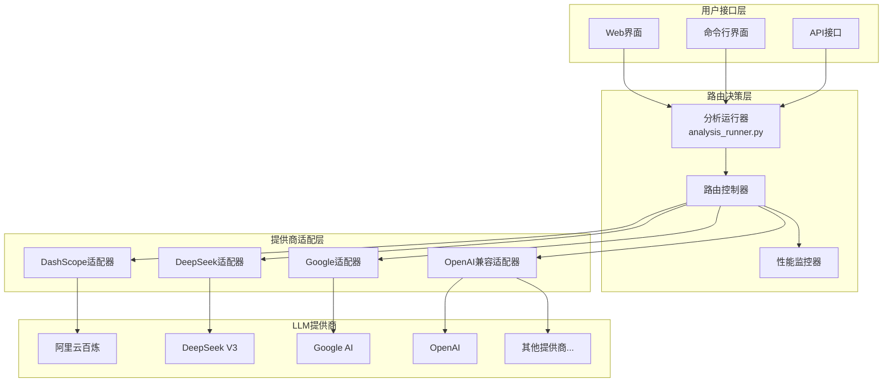

**图表来源**
- [analysis_runner.py](file://web/utils/analysis_runner.py#L304-L368)
- [openai_compatible_base.py](file://tradingagents/llm_adapters/openai_compatible_base.py#L30-L80)

### 路由决策流程

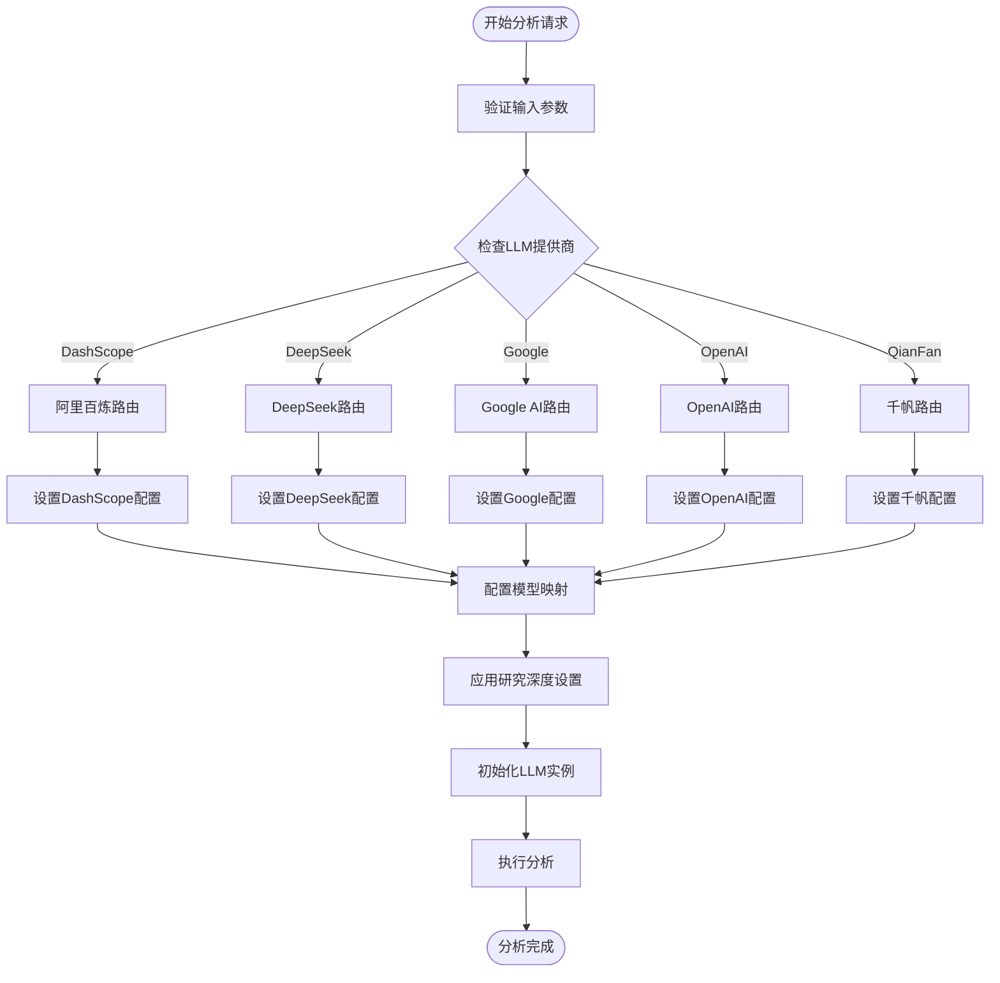

**图表来源**
- [analysis_runner.py](file://web/utils/analysis_runner.py#L304-L400)

**章节来源**
- [analysis_runner.py](file://web/utils/analysis_runner.py#L304-L400)

## 提供商配置详解

### 阿里百炼（DashScope）

阿里百炼作为首选推荐提供商，具有出色的中文理解和金融领域专业知识。

#### 核心配置

| 配置项 | 值 | 说明 |
|--------|-----|------|
| Backend URL | `https://dashscope.aliyuncs.com/api/v1` | 阿里百炼API端点 |
| API密钥环境变量 | `DASHSCOPE_API_KEY` | 从环境变量获取 |
| 默认模型 | `qwen-plus` | 标准分析模型 |
| 成本优势 | 中等偏低 | 金融领域优化 |

#### 模型映射表

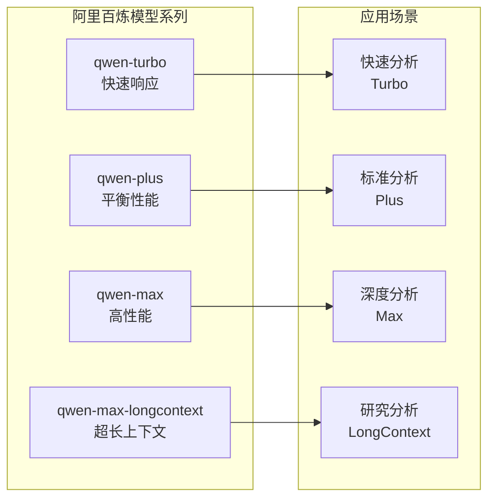

**图表来源**
- [dashscope_adapter.py](file://tradingagents/llm_adapters/dashscope_adapter.py#L240-L293)

**章节来源**
- [dashscope_adapter.py](file://tradingagents/llm_adapters/dashscope_adapter.py#L240-L293)

### DeepSeek V3

DeepSeek V3以其卓越的推理能力和极高的性价比著称，特别适合复杂的金融分析任务。

#### 核心配置

| 配置项 | 值 | 说明 |
|--------|-----|------|
| Backend URL | `https://api.deepseek.com` | DeepSeek官方API |
| API密钥环境变量 | `DEEPSEEK_API_KEY` | 从环境变量获取 |
| 默认模型 | `deepseek-chat` | 单一模型统一 |
| 性能特点 | 推理能力强，成本低 |

#### 成本优势分析

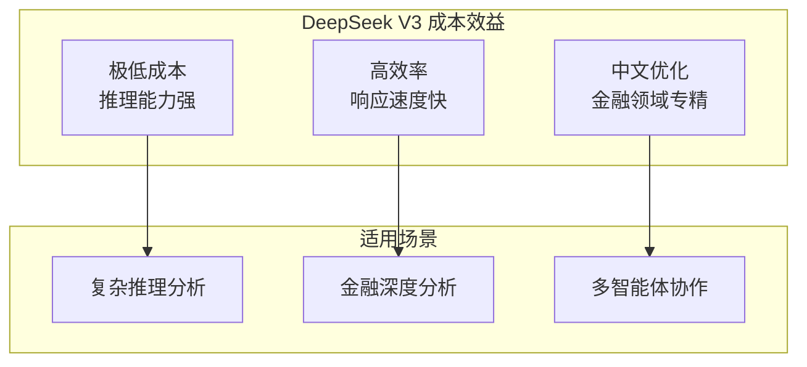

**图表来源**
- [deepseek_adapter.py](file://tradingagents/llm_adapters/deepseek_adapter.py#L15-L50)

**章节来源**
- [deepseek_adapter.py](file://tradingagents/llm_adapters/deepseek_adapter.py#L15-L50)

### Google AI

Google AI提供最新的Gemini模型系列，具有强大的多模态能力和推理性能。

#### 核心配置

| 配置项 | 值 | 说明 |
|--------|-----|------|
| Backend URL | `https://api.openai.com/v1` | OpenAI兼容格式 |
| API密钥环境变量 | `GOOGLE_API_KEY` | Google AI API密钥 |
| 模型系列 | Gemini 2.5/2.0/1.5 | 多世代模型支持 |

#### 模型性能矩阵

| 模型 | 响应时间 | 上下文长度 | 功能特性 | 推荐场景 |
|------|----------|------------|----------|----------|
| `gemini-2.5-flash-lite-preview-06-17` | 1.45s | 32K | 超快响应 | 实时分析 |
| `gemini-2.5-flash` | 2.73s | 32K | 快速响应 | 日常分析 |
| `gemini-2.5-pro` | 16.68s | 32K | 强大性能 | 深度分析 |
| `gemini-2.0-flash` | 1.87s | 32K | 新一代 | 快速迭代 |

**章节来源**
- [google_openai_adapter.py](file://tradingagents/llm_adapters/google_openai_adapter.py#L150-L200)

### OpenAI兼容提供商

系统支持多个OpenAI兼容的提供商，提供统一的接口体验。

#### 支持的提供商

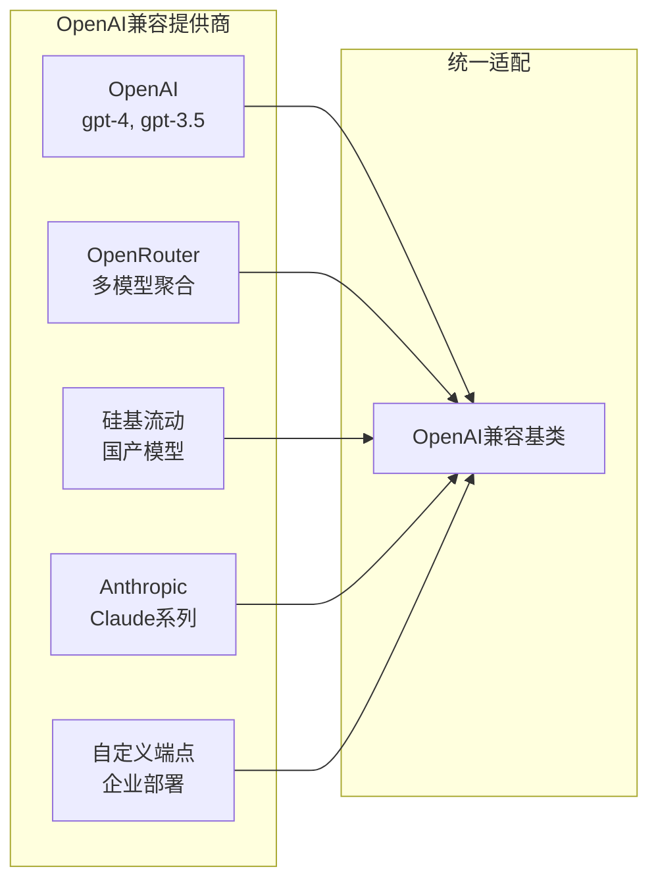

**图表来源**
- [openai_compatible_base.py](file://tradingagents/llm_adapters/openai_compatible_base.py#L350-L400)

**章节来源**
- [openai_compatible_base.py](file://tradingagents/llm_adapters/openai_compatible_base.py#L350-L400)

## 研究深度与模型映射

### 研究深度分级体系

系统采用5级研究深度体系，每个级别对应不同的模型配置和资源投入。

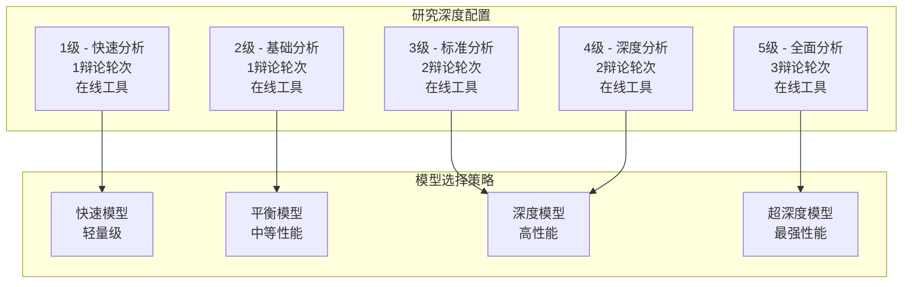

**图表来源**
- [analysis_runner.py](file://web/utils/analysis_runner.py#L200-L300)

### 各提供商深度配置策略

#### 阿里百炼配置策略

| 研究深度 | 快速模型 | 深度模型 | 配置特点 |
|----------|----------|----------|----------|
| 1级 | `qwen-turbo` | `qwen-plus` | 最快响应，成本最低 |
| 2级 | `qwen-plus` | `qwen-plus` | 平衡性能和成本 |
| 3级 | `qwen-plus` | `qwen3-max` | 标准深度分析 |
| 4级 | `qwen-plus` | `qwen3-max` | 深度推理能力 |
| 5级 | `qwen3-max` | `qwen3-max` | 最强分析能力 |

#### DeepSeek配置策略

| 研究深度 | 快速模型 | 深度模型 | 配置特点 |
|----------|----------|----------|----------|
| 1级 | `deepseek-chat` | `deepseek-chat` | 统一模型，成本最优 |
| 2级 | `deepseek-chat` | `deepseek-chat` | 推理能力均衡 |
| 3级 | `deepseek-chat` | `deepseek-chat` | 深度分析能力 |
| 4级 | `deepseek-chat` | `deepseek-chat` | 复杂推理支持 |
| 5级 | `deepseek-chat` | `deepseek-chat` | 最强推理性能 |

#### Google AI配置策略

| 研究深度 | 快速模型 | 深度模型 | 响应时间 | 配置特点 |
|----------|----------|----------|----------|----------|
| 1级 | `gemini-2.5-flash-lite-preview-06-17` | `gemini-2.0-flash` | 1.45s/1.87s | 超快响应 |
| 2级 | `gemini-2.0-flash` | `gemini-1.5-pro` | 1.87s/2.25s | 快速分析 |
| 3级 | `gemini-1.5-pro` | `gemini-2.5-flash` | 2.25s/2.73s | 平衡性能 |
| 4级 | `gemini-2.5-flash` | `gemini-2.5-pro` | 2.73s/16.68s | 深度推理 |
| 5级 | `gemini-2.5-pro` | `gemini-2.5-pro` | 16.68s/16.68s | 最强性能 |

**章节来源**
- [analysis_runner.py](file://web/utils/analysis_runner.py#L200-L300)

## 性能特征分析

### 响应时间对比

基于实际测试数据的性能对比：

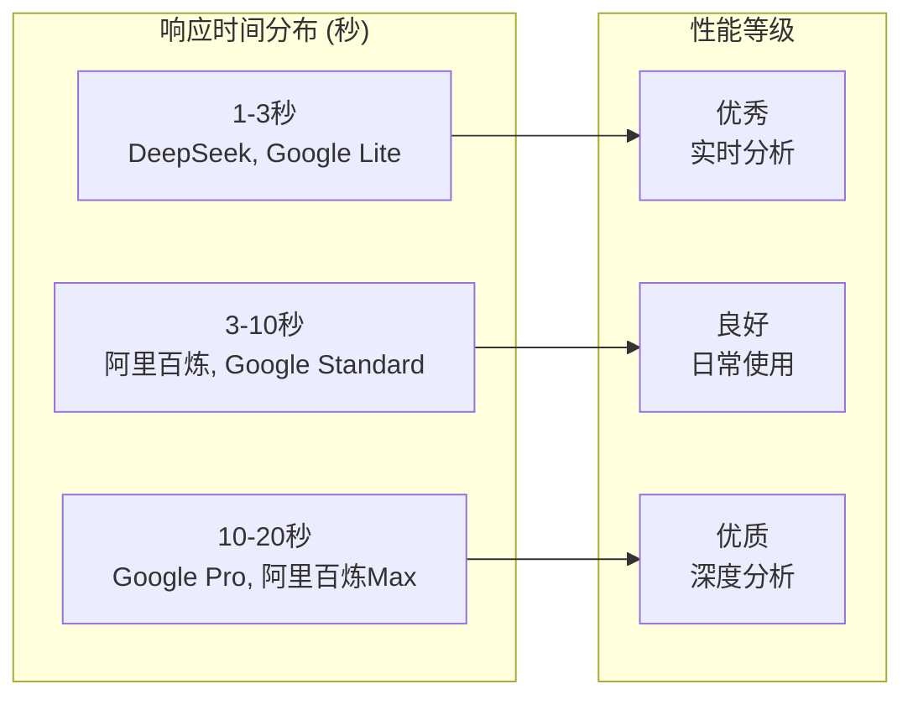

### 成本效益分析

#### Token使用成本对比

| 提供商 | 输入成本/1K tokens | 输出成本/1K tokens | 总体性价比 |
|--------|-------------------|-------------------|------------|
| DeepSeek | ¥0.01 | ¥0.03 | 极高 |
| 阿里百炼 | ¥0.02 | ¥0.06 | 高 |
| Google AI | ¥0.05 | ¥0.15 | 中等 |
| OpenAI | ¥0.05 | ¥0.15 | 中等 |
| 千帆 | ¥0.03 | ¥0.09 | 中等 |

#### 研究深度成本曲线

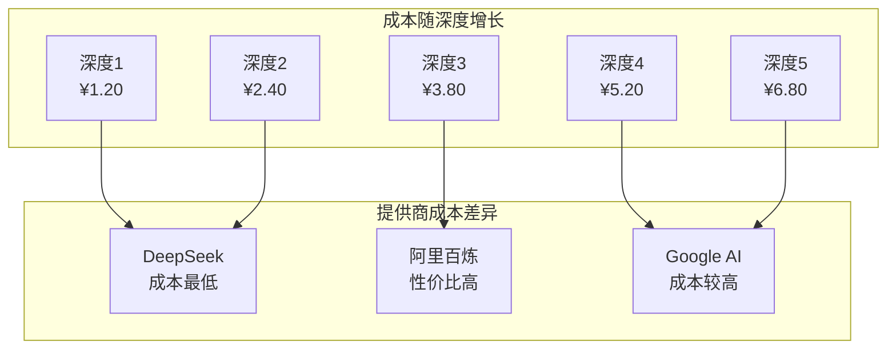

**章节来源**
- [config_manager.py](file://tradingagents/config/config_manager.py#L410-L421)

### 模型性能特征

#### 中文理解能力

| 提供商 | 中文理解 | 金融术语 | 上下文处理 | 工具调用 |
|--------|----------|----------|------------|----------|
| DeepSeek | 优秀 | 专业 | 强 | 支持 |
| 阿里百炼 | 优秀 | 专业 | 强 | 支持 |
| Google AI | 良好 | 专业 | 强 | 支持 |
| OpenAI | 良好 | 通用 | 强 | 支持 |
| 千帆 | 优秀 | 专业 | 中等 | 支持 |

#### 推理能力对比

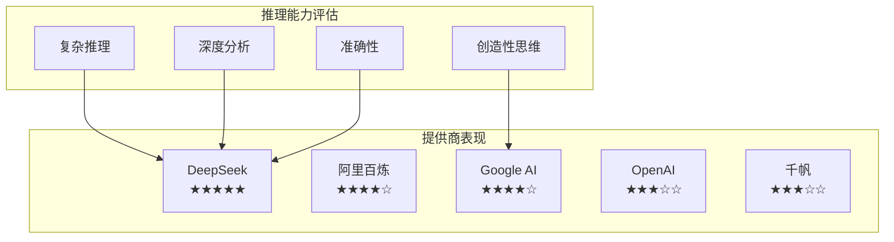

## 路由决策机制

### 自动化路由算法

系统采用多维度评分机制，自动选择最优的提供商和模型组合。

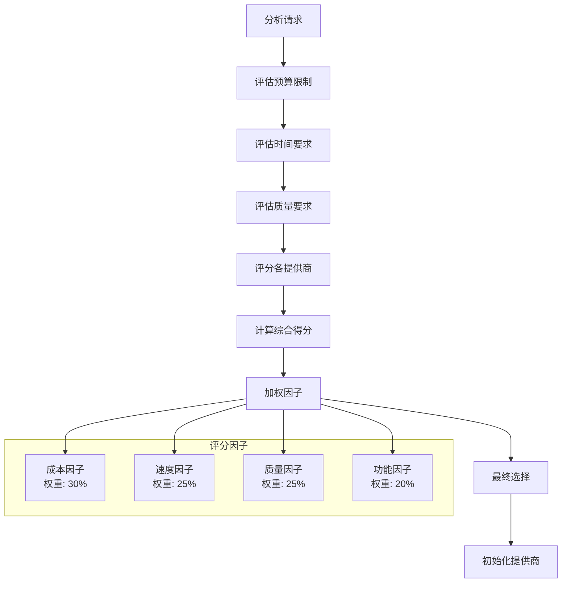

**图表来源**
- [analysis_runner.py](file://web/utils/analysis_runner.py#L100-L200)

### 动态配置调整

#### 环境自适应配置

系统能够根据运行环境自动调整配置：

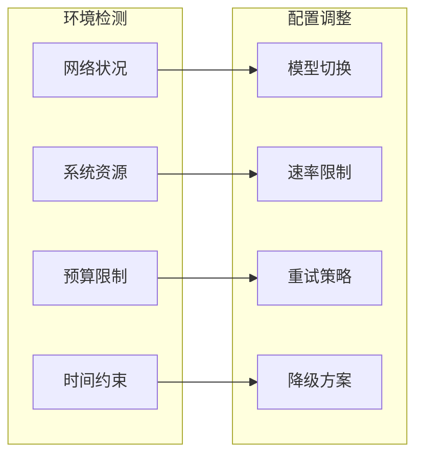

**章节来源**
- [analysis_runner.py](file://web/utils/analysis_runner.py#L100-L200)

## 实际应用示例

### 示例1：DeepSeek V3金融分析

基于DeepSeek V3的完整分析流程：

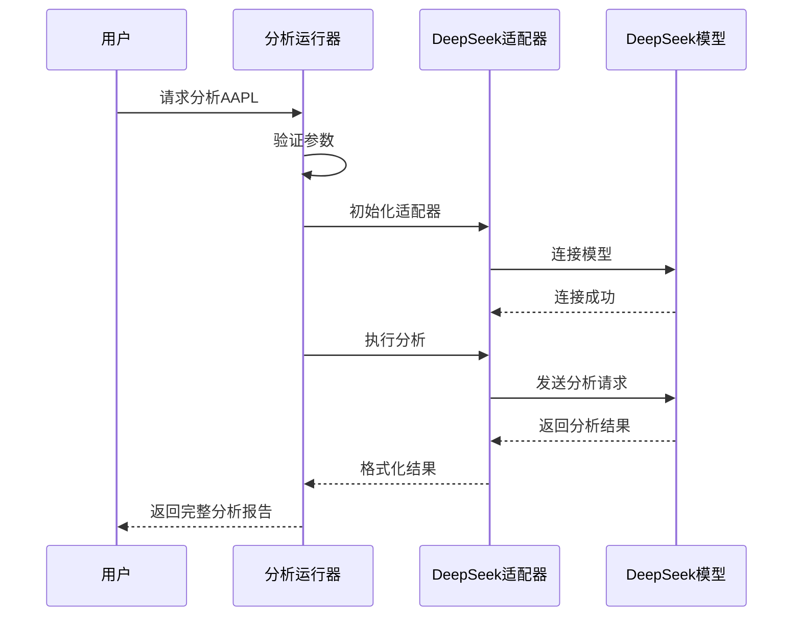

**图表来源**
- [demo_deepseek_analysis.py](file://examples/demo_deepseek_analysis.py#L50-L100)

### 示例2：阿里百炼多模态分析

阿里百炼在复杂场景下的应用：

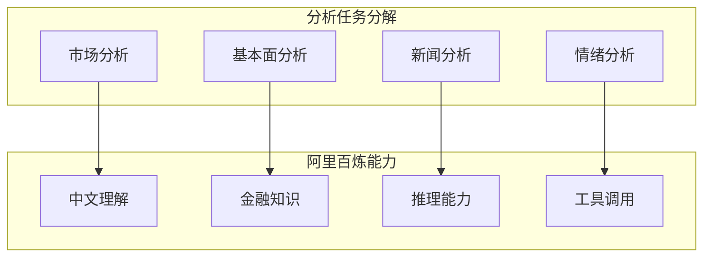

**图表来源**
- [demo_dashscope.py](file://examples/dashscope_examples/demo_dashscope.py#L50-L100)

**章节来源**
- [demo_deepseek_analysis.py](file://examples/demo_deepseek_analysis.py#L50-L100)
- [demo_dashscope.py](file://examples/dashscope_examples/demo_dashscope.py#L50-L100)

## 最佳实践指南

### 选择策略建议

#### 根据使用场景选择

| 使用场景 | 推荐提供商 | 模型配置 | 预期效果 |
|----------|------------|----------|----------|
| 日常股票监控 | DeepSeek | `deepseek-chat` | 成本低，响应快 |
| 专业深度分析 | 阿里百炼 | `qwen3-max` | 金融领域专家 |
| 实时交易决策 | Google AI | `gemini-2.5-flash` | 超快响应 |
| 多语言分析 | OpenAI | `gpt-4` | 多语言支持 |
| 企业定制 | 自定义端点 | 企业模型 | 安全可控 |

#### 成本优化策略

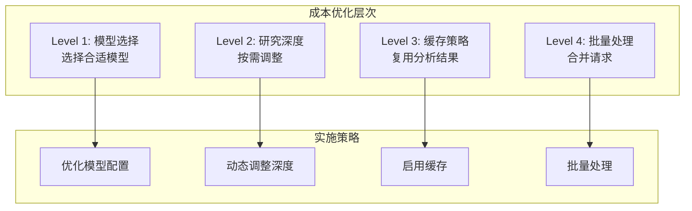

### 性能监控与调优

#### 关键指标监控

| 指标类别 | 监控项目 | 阈值建议 | 优化措施 |
|----------|----------|----------|----------|
| 响应时间 | 平均响应时间 | < 30秒 | 模型优化 |
| 成本控制 | 单次分析成本 | < ¥5.00 | 模型选择 |
| 准确性 | 分析质量评分 | > 8.0/10 | 模型升级 |
| 可用性 | API可用率 | > 99.5% | 多提供商冗余 |

#### 故障恢复机制

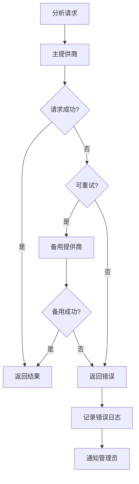

### 部署配置建议

#### 生产环境配置

```yaml
# 生产环境配置示例
production:
  providers:
    - name: "deepseek"
      enabled: true
      priority: 1
      budget_limit: 1000
    - name: "dashscope"
      enabled: true
      priority: 2
      budget_limit: 800
    - name: "google"
      enabled: true
      priority: 3
      budget_limit: 500
  
  analysis:
    default_depth: 3
    max_depth: 5
    timeout: 120
    
  monitoring:
    enable_cost_tracking: true
    enable_performance_monitoring: true
    alert_threshold: 0.1
```

#### 开发环境配置

```yaml
# 开发环境配置示例
development:
  providers:
    - name: "deepseek"
      enabled: true
      priority: 1
      budget_limit: 5000
    - name: "dashscope"
      enabled: true
      priority: 2
      budget_limit: 5000
      
  analysis:
    default_depth: 1
    max_depth: 3
    timeout: 60
    
  monitoring:
    enable_cost_tracking: false
    enable_performance_monitoring: true
    alert_threshold: 0.2
```

通过这套完善的路由逻辑，TradingAgents-CN系统能够为用户提供最优的LLM服务体验，在保证分析质量的同时，最大化成本效益和响应性能。系统的设计充分考虑了不同提供商的特点和用户需求，提供了灵活、智能、高效的AI分析解决方案。