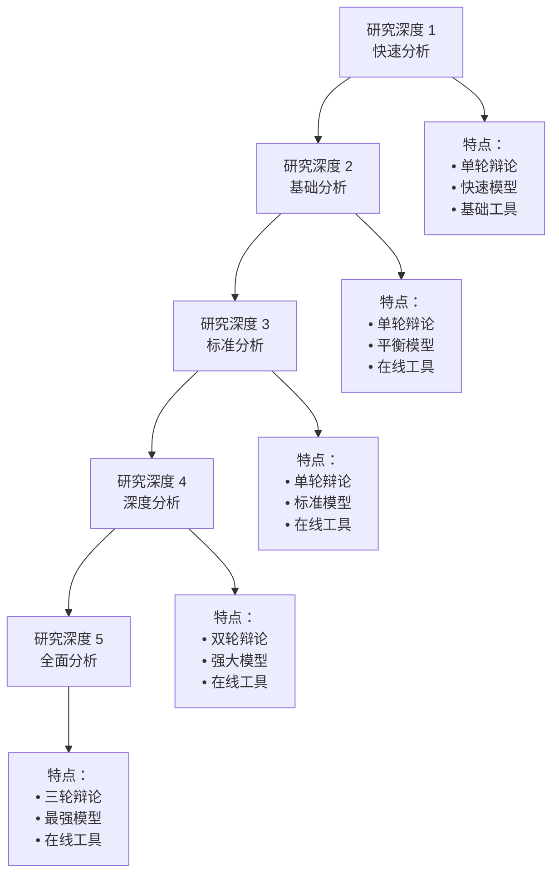
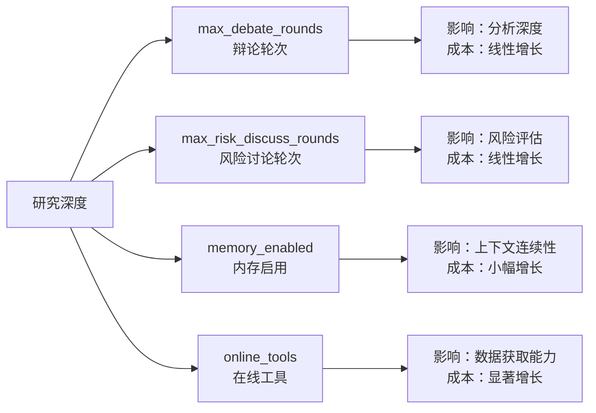
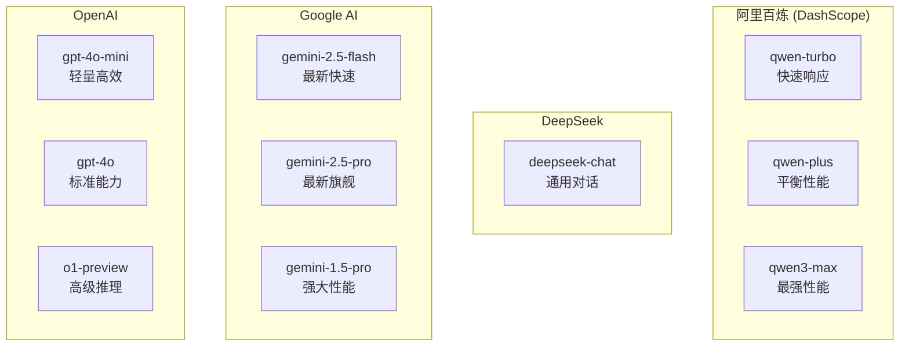
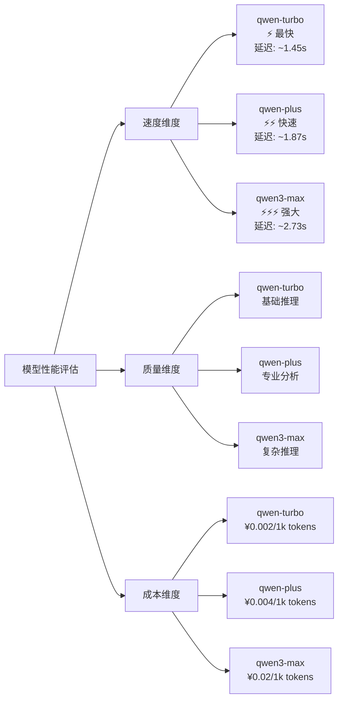
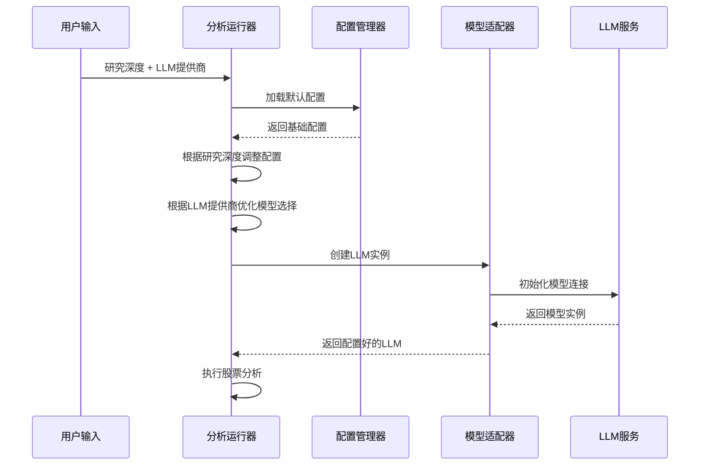
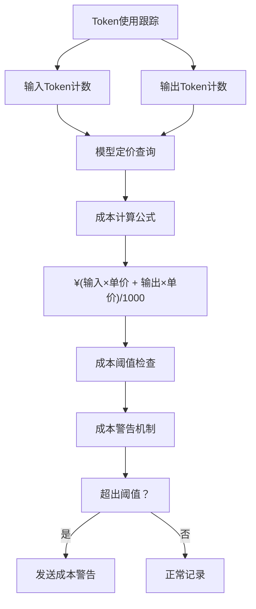
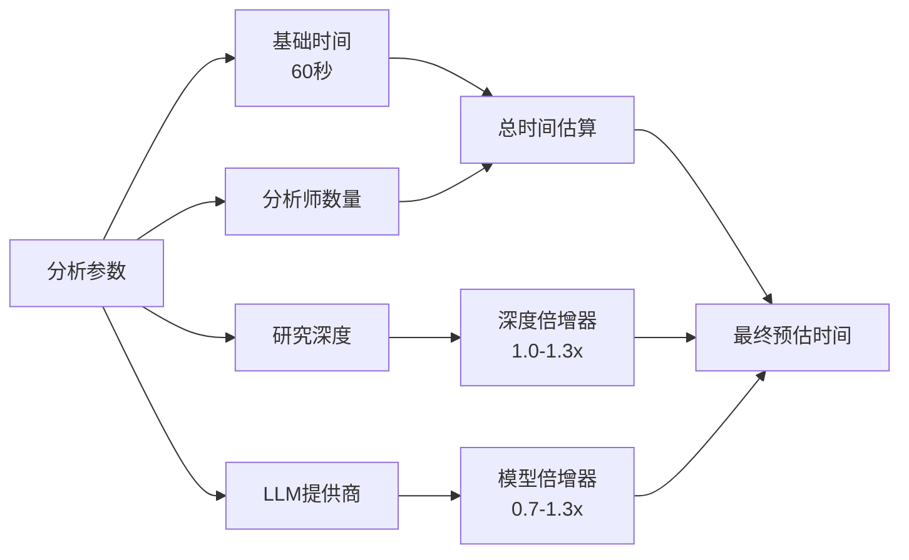
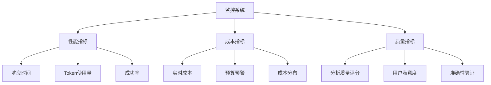

# 研究深度路由策略

<cite>
**本文档引用的文件**
- [analysis_runner.py](file://web/utils/analysis_runner.py)
- [default_config.py](file://tradingagents/default_config.py)
- [config_manager.py](file://tradingagents/config/config_manager.py)
- [dashscope_openai_adapter.py](file://tradingagents/llm_adapters/dashscope_openai_adapter.py)
- [trading_graph.py](file://tradingagents/graph/trading_graph.py)
- [main.py](file://cli/main.py)
- [utils.py](file://cli/utils.py)
- [progress_tracker.py](file://web/utils/progress_tracker.py)
</cite>

## 目录
1. [概述](#概述)
2. [研究深度级别体系](#研究深度级别体系)
3. [核心配置参数](#核心配置参数)
4. [模型选择策略](#模型选择策略)
5. [分层路由机制](#分层路由机制)
6. [性能与成本平衡](#性能与成本平衡)
7. [实际应用示例](#实际应用示例)
8. [监控与优化](#监控与优化)
9. [总结](#总结)

## 概述

TradingAgents-CN采用了一套基于研究深度的智能模型路由策略，通过动态调整LLM配置参数来平衡分析质量和执行效率。该策略将研究深度分为五个层级（1-5级），每个层级对应不同的max_debate_rounds、memory_enabled和online_tools配置，同时针对不同LLM提供商选择最优的quick_thinking_llm和deep_thinking_llm模型组合。

这种分层策略的核心优势在于：
- **成本优化**：根据需求选择合适的模型和配置
- **性能平衡**：在分析质量与执行速度之间找到最佳平衡点
- **灵活性**：支持多种LLM提供商和模型选择
- **可扩展性**：易于添加新的研究深度级别和模型配置

## 研究深度级别体系

### 五级深度体系

**图表来源**
- [analysis_runner.py](file://web/utils/analysis_runner.py#L200-L310)

### 各级别详细特性

| 研究深度 | max_debate_rounds | max_risk_discuss_rounds | memory_enabled | online_tools | 快速思考模型 | 深度思考模型 |
|---------|-------------------|------------------------|---------------|-------------|-------------|-------------|
| 1级 - 快速 | 1 | 1 | 是 | 是 | qwen-turbo | qwen-plus |
| 2级 - 基础 | 1 | 1 | 是 | 是 | qwen-plus | qwen-plus |
| 3级 - 标准 | 1 | 2 | 是 | 是 | qwen-plus | qwen3-max |
| 4级 - 深度 | 2 | 2 | 是 | 是 | qwen-plus | qwen3-max |
| 5级 - 全面 | 3 | 3 | 是 | 是 | qwen3-max | qwen3-max |

**节来源**
- [analysis_runner.py](file://web/utils/analysis_runner.py#L200-L310)

## 核心配置参数

### 关键配置参数详解

**图表来源**
- [analysis_runner.py](file://web/utils/analysis_runner.py#L200-L310)

### 配置参数的作用机制

1. **max_debate_rounds（辩论轮次）**
   - 控制多头/空头研究员之间的讨论次数
   - 影响最终投资决策的深度和准确性
   - 成本与效果呈线性关系

2. **max_risk_discuss_rounds（风险讨论轮次）**
   - 控制风险分析师之间的辩论次数
   - 影响风险评估的全面性和准确性
   - 成本与效果呈线性关系

3. **memory_enabled（内存启用）**
   - 启用LLM上下文记忆功能
   - 提升分析的一致性和连贯性
   - 成本影响较小但效果显著

4. **online_tools（在线工具）**
   - 启用实时数据获取和工具调用
   - 提供最新的市场数据和分析能力
   - 成本影响较大但价值显著

**节来源**
- [analysis_runner.py](file://web/utils/analysis_runner.py#L200-L310)

## 模型选择策略

### LLM提供商适配矩阵

**图表来源**
- [analysis_runner.py](file://web/utils/analysis_runner.py#L304-L400)
- [dashscope_openai_adapter.py](file://tradingagents/llm_adapters/dashscope_openai_adapter.py#L89-L128)

### 模型选择映射表

| 研究深度 | 阿里百炼 | DeepSeek | Google AI | OpenAI |
|---------|----------|----------|-----------|--------|
| 1级 - 快速 | qwen-turbo | deepseek-chat | gemini-2.5-flash-lite | gpt-4o-mini |
| 2级 - 基础 | qwen-plus | deepseek-chat | gemini-2.0-flash | gpt-4o |
| 3级 - 标准 | qwen-plus | deepseek-chat | gemini-1.5-pro | gpt-4o |
| 4级 - 深度 | qwen3-max | deepseek-chat | gemini-2.5-flash | gpt-4o |
| 5级 - 全面 | qwen3-max | deepseek-chat | gemini-2.5-pro | gpt-4o |

**节来源**
- [analysis_runner.py](file://web/utils/analysis_runner.py#L304-L400)

### 模型性能对比

**图表来源**
- [dashscope_openai_adapter.py](file://tradingagents/llm_adapters/dashscope_openai_adapter.py#L89-L128)

## 分层路由机制

### 动态配置生成流程

**图表来源**
- [analysis_runner.py](file://web/utils/analysis_runner.py#L120-L310)

### 配置调整算法

研究深度路由的核心算法体现在以下关键逻辑中：

1. **基础配置继承**：从DEFAULT_CONFIG开始
2. **深度级别适配**：根据research_depth调整关键参数
3. **提供商优化**：针对不同LLM提供商优化模型选择
4. **成本平衡**：在性能和成本之间找到最佳平衡点

**节来源**
- [analysis_runner.py](file://web/utils/analysis_runner.py#L200-L310)

## 性能与成本平衡

### 成本计算机制

**图表来源**
- [config_manager.py](file://tradingagents/config/config_manager.py#L410-L421)

### 性能预估模型

基于实际测试数据，系统实现了智能的性能预估机制：

**图表来源**
- [progress_tracker.py](file://web/utils/progress_tracker.py#L86-L110)

### 成本效益分析

| 研究深度 | 预估成本 | 预估时间 | 性价比 | 适用场景 |
|---------|----------|----------|--------|----------|
| 1级 - 快速 | ¥0.01-¥0.03 | 2-3分钟 | 极高 | 日常监控 |
| 2级 - 基础 | ¥0.03-¥0.06 | 3-5分钟 | 高 | 短期决策 |
| 3级 - 标准 | ¥0.06-¥0.12 | 5-8分钟 | 中等 | 中期规划 |
| 4级 - 深度 | ¥0.12-¥0.24 | 8-12分钟 | 中等 | 重大决策 |
| 5级 - 全面 | ¥0.24-¥0.48 | 12-20分钟 | 较低 | 投资研究 |

**节来源**
- [config_manager.py](file://tradingagents/config/config_manager.py#L215-L247)

## 实际应用示例

### 快速分析场景

当用户选择快速分析（研究深度1）时，系统会：

1. **配置简化**：max_debate_rounds=1，max_risk_discuss_rounds=1
2. **模型优化**：使用qwen-turbo（阿里百炼）或deepseek-chat（DeepSeek）
3. **成本控制**：最小化Token使用，优先考虑速度
4. **工具启用**：启用在线工具确保数据准确性

### 全面分析场景

对于全面分析（研究深度5），系统会：

1. **深度挖掘**：max_debate_rounds=3，max_risk_discuss_rounds=3
2. **模型强化**：使用qwen3-max或同等性能模型
3. **资源投入**：充分使用所有可用工具和数据源
4. **质量保证**：确保分析的全面性和准确性

**节来源**
- [analysis_runner.py](file://web/utils/analysis_runner.py#L200-L310)

## 监控与优化

### 实时监控指标

### 优化策略

1. **动态调整**：根据历史数据自动优化配置
2. **成本预警**：设置成本阈值，提前预警
3. **性能调优**：基于实际使用情况优化模型选择
4. **用户体验**：提供清晰的成本和时间预估

**节来源**
- [config_manager.py](file://tradingagents/config/config_manager.py#L652-L690)

## 总结

TradingAgents-CN的研究深度路由策略通过以下核心机制实现了分析质量与执行效率的完美平衡：

### 核心优势

1. **智能分层**：五级深度体系适应不同场景需求
2. **动态配置**：根据研究深度自动调整关键参数
3. **模型优化**：针对不同提供商选择最优模型组合
4. **成本控制**：精细化的成本管理和预估机制
5. **性能保障**：实时监控和优化确保服务质量

### 应用价值

- **企业用户**：可根据项目预算和时间要求选择合适的研究深度
- **个人投资者**：在成本和质量之间找到最适合自己的配置
- **开发者**：提供灵活的API接口和配置选项
- **研究人员**：支持不同层次的分析需求和实验场景

这种分层策略不仅提升了系统的实用性和用户体验，更为复杂的金融分析场景提供了标准化、可扩展的技术解决方案。通过持续的监控和优化，系统能够不断适应新的需求和挑战，为用户提供最优质的股票分析服务。