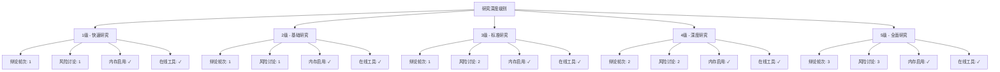
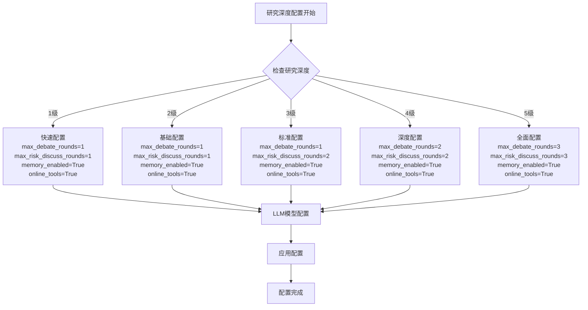
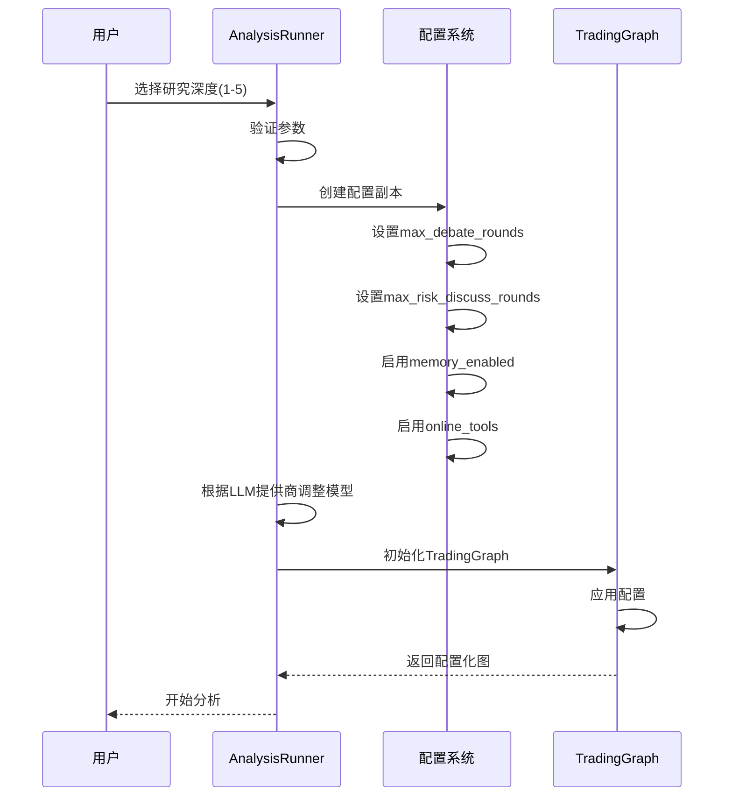
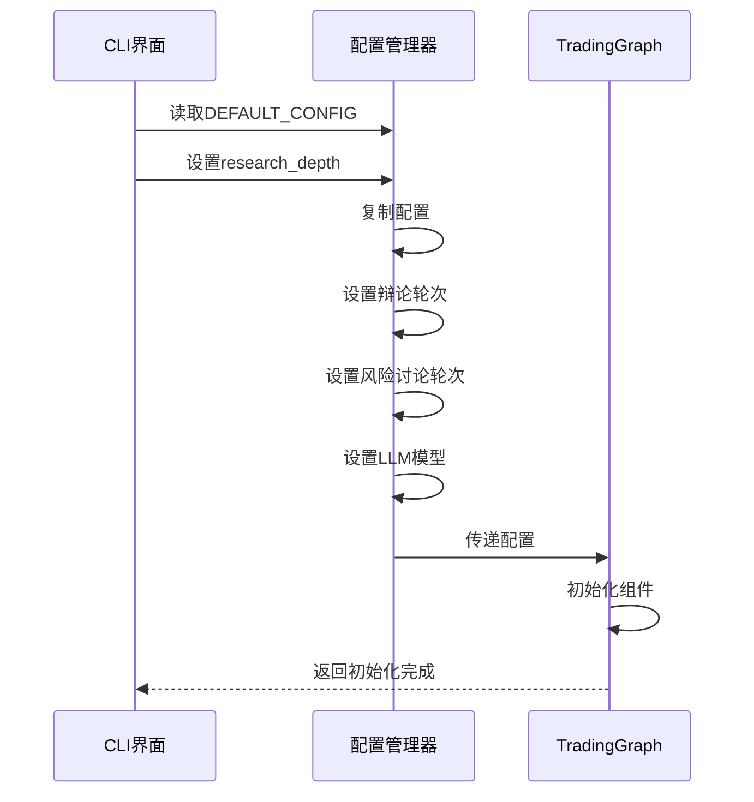
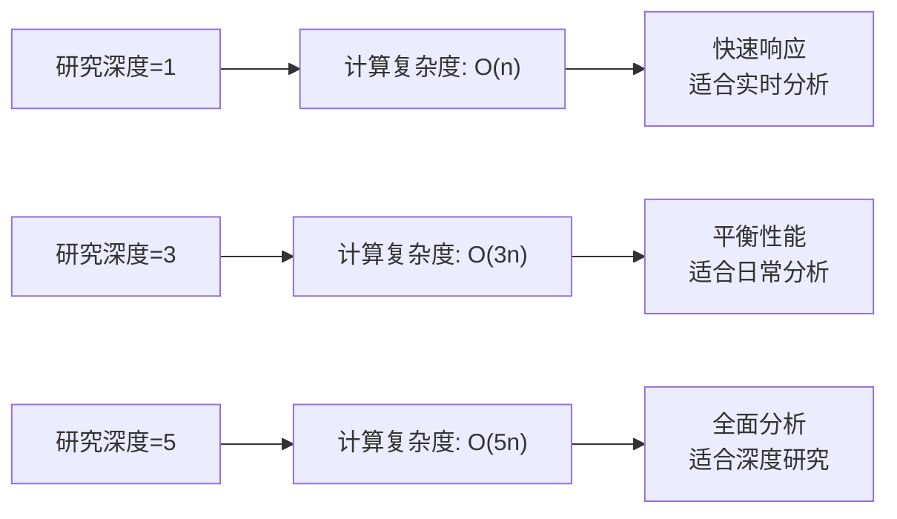
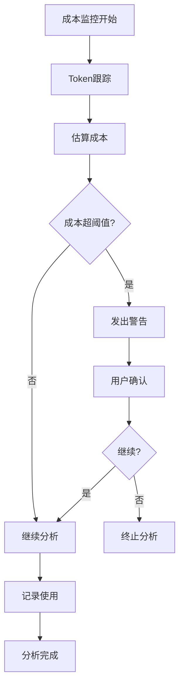

# 研究深度配置映射

<cite>
**本文档引用的文件**
- [analysis_runner.py](file://web/utils/analysis_runner.py)
- [default_config.py](file://tradingagents/default_config.py)
- [trading_graph.py](file://tradingagents/graph/trading_graph.py)
- [config_manager.py](file://tradingagents/config/config_manager.py)
- [main.py](file://cli/main.py)
- [conditional_logic.py](file://tradingagents/graph/conditional_logic.py)
- [memory.py](file://tradingagents/agents/utils/memory.py)
</cite>

## 目录
1. [概述](#概述)
2. [研究深度级别定义](#研究深度级别定义)
3. [核心配置参数映射](#核心配置参数映射)
4. [分层配置策略](#分层配置策略)
5. [详细配置映射分析](#详细配置映射分析)
6. [性能与效率平衡](#性能与效率平衡)
7. [实际应用场景](#实际应用场景)
8. [总结](#总结)

## 概述

TradingAgents-CN系统采用分层研究深度配置机制，通过`research_depth`参数（1-5级）动态调整核心分析配置，实现分析深度与执行效率的最优平衡。该系统的核心设计理念是在保证分析质量的前提下，根据用户需求灵活调整资源投入。

## 研究深度级别定义

系统定义了五个研究深度级别，每个级别对应不同的配置策略：

| 研究深度级别 | 数值范围 | 快速分析 | 基础分析 | 标准分析 | 深度分析 | 全面分析 |
|-------------|---------|----------|----------|----------|----------|----------|
| 快速研究 | 1级 | ✓ | - | - | - | - |
| 基础研究 | 2级 | - | ✓ | - | - | - |
| 标准研究 | 3级 | - | - | ✓ | - | - |
| 深度研究 | 4级 | - | - | - | ✓ | - |
| 全面研究 | 5级 | - | - | - | - | ✓ |

### 研究深度级别特性

**图表来源**
- [analysis_runner.py](file://web/utils/analysis_runner.py#L240-L302)

## 核心配置参数映射

### 主要配置参数

系统通过`research_depth`参数动态调整以下核心配置：

| 配置参数 | 描述 | 默认值 | 研究深度影响 |
|---------|------|--------|-------------|
| `max_debate_rounds` | 最大辩论轮次 | 1 | 线性递增（1→3） |
| `max_risk_discuss_rounds` | 最大风险讨论轮次 | 1 | 线性递增（1→3） |
| `memory_enabled` | 内存功能启用 | True | 始终启用 |
| `online_tools` | 在线工具启用 | false | 统一启用 |

### 配置映射逻辑

**图表来源**
- [analysis_runner.py](file://web/utils/analysis_runner.py#L240-L302)

**节来源**
- [analysis_runner.py](file://web/utils/analysis_runner.py#L240-L302)

## 分层配置策略

### 辩论轮次递增规律

系统采用线性递增策略调整辩论轮次：

- **1级研究**：单轮辩论，快速得出结论
- **2级研究**：单轮辩论，基础验证
- **3级研究**：单轮辩论，适度深入
- **4级研究**：双轮辩论，充分论证
- **5级研究**：三轮辩论，全面分析

### 风险讨论轮次递增规律

风险讨论轮次同样遵循线性递增原则：

- **1级研究**：单轮风险评估
- **2级研究**：单轮风险评估
- **3级研究**：双轮风险评估
- **4级研究**：双轮风险评估
- **5级研究**：三轮风险评估

### 内存功能策略

内存功能始终保持启用状态，原因包括：

1. **性能开销小**：内存操作对整体性能影响微乎其微
2. **质量提升显著**：显著改善分析质量和一致性
3. **用户体验**：提供连续的分析体验

### 在线工具策略

在线工具统一启用，确保：

1. **数据准确性**：获取最新、准确的数据源
2. **稳定性**：统一的工具接口和错误处理
3. **兼容性**：跨平台和跨市场的数据获取

**节来源**
- [analysis_runner.py](file://web/utils/analysis_runner.py#L240-L302)
- [trading_graph.py](file://tradingagents/graph/trading_graph.py#L200-L250)

## 详细配置映射分析

### Web界面配置映射

Web界面通过`analysis_runner.py`实现配置映射：

**图表来源**
- [analysis_runner.py](file://web/utils/analysis_runner.py#L150-L300)

### CLI界面配置映射

CLI界面通过`main.py`实现配置映射：

**图表来源**
- [main.py](file://cli/main.py#L1045-L1071)

### LLM提供商特定配置

不同LLM提供商采用差异化配置策略：

| LLM提供商 | 快速模型 | 深度模型 | 配置特点 |
|-----------|---------|---------|----------|
| DashScope | qwen-turbo | qwen-plus/qwen3-max | 统一模型命名 |
| DeepSeek | deepseek-chat | deepseek-chat | 单模型架构 |
| Google AI | gemini-2.5-flash | gemini-2.5-pro | 性能优化 |
| 千帆(文心一言) | ernie-3.5-8k | ernie-4.0-turbo-8k | 中文优化 |

**节来源**
- [analysis_runner.py](file://web/utils/analysis_runner.py#L280-L350)

## 性能与效率平衡

### 计算复杂度分析

研究深度与计算复杂度的关系呈线性增长：

### 资源消耗优化

系统采用多种优化策略：

1. **内存复用**：统一的内存管理机制
2. **工具缓存**：智能的数据缓存策略
3. **异步处理**：并行数据获取
4. **智能降级**：网络异常时的备用方案

### 成本控制机制

**图表来源**
- [config_manager.py](file://tradingagents/config/config_manager.py#L650-L700)

**节来源**
- [analysis_runner.py](file://web/utils/analysis_runner.py#L150-L200)
- [config_manager.py](file://tradingagents/config/config_manager.py#L650-L726)

## 实际应用场景

### 场景1：快速投资决策

**适用场景**：日内交易、短期投资、风险评估
**推荐配置**：研究深度=1
**特点**：
- 1分钟内完成分析
- 基础数据验证
- 快速风险提示

### 场景2：日常投资分析

**适用场景**：月度回顾、季度分析、投资组合管理
**推荐配置**：研究深度=3
**特点**：
- 5-10分钟完成分析
- 标准深度辩论
- 全面风险评估

### 场景3：深度研究报告

**适用场景**：学术研究、机构分析、重大投资决策
**推荐配置**：研究深度=5
**特点**：
- 30分钟以上完成分析
- 全面数据验证
- 深度风险讨论

### 场景4：算法训练数据

**适用场景**：机器学习、量化分析、策略优化
**推荐配置**：研究深度=5
**特点**：
- 完整的分析过程
- 丰富的中间结果
- 标准化的输出格式

## 总结

TradingAgents-CN的研究深度配置映射系统通过以下核心设计实现了分析深度与执行效率的最佳平衡：

### 关键设计原则

1. **线性递增策略**：辩论轮次和风险讨论轮次采用线性递增，确保配置规律性和可预测性
2. **统一资源配置**：内存功能和在线工具保持统一配置，简化系统复杂度
3. **LLM提供商适配**：针对不同LLM提供商提供优化的模型配置
4. **成本控制机制**：内置Token跟踪和成本预警功能

### 配置映射表

| 研究深度 | max_debate_rounds | max_risk_discuss_rounds | memory_enabled | online_tools | 适用场景 |
|---------|-------------------|------------------------|----------------|--------------|----------|
| 1级 | 1 | 1 | ✓ | ✓ | 快速分析 |
| 2级 | 1 | 1 | ✓ | ✓ | 基础分析 |
| 3级 | 1 | 2 | ✓ | ✓ | 标准分析 |
| 4级 | 2 | 2 | ✓ | ✓ | 深度分析 |
| 5级 | 3 | 3 | ✓ | ✓ | 全面分析 |

### 性能特征

- **响应时间**：研究深度越低，响应时间越快
- **分析质量**：研究深度越高，分析质量越好
- **资源消耗**：线性增长，易于预测和控制
- **成本效益**：可根据预算灵活调整研究深度

该系统的设计理念体现了现代软件工程中的"配置即代码"原则，通过清晰的配置映射关系，为用户提供了一个既强大又易用的股票分析平台。