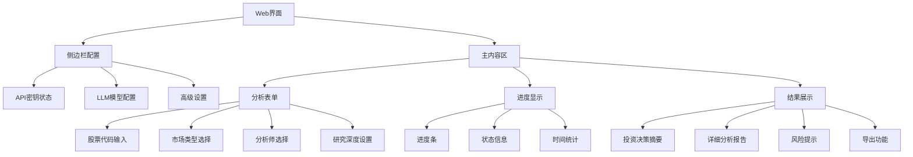
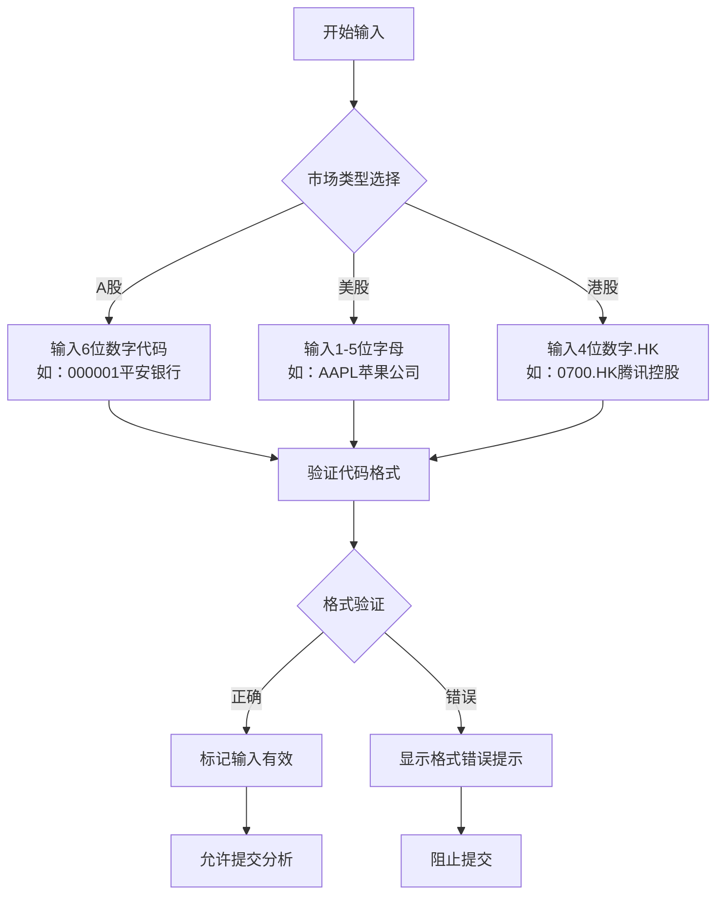
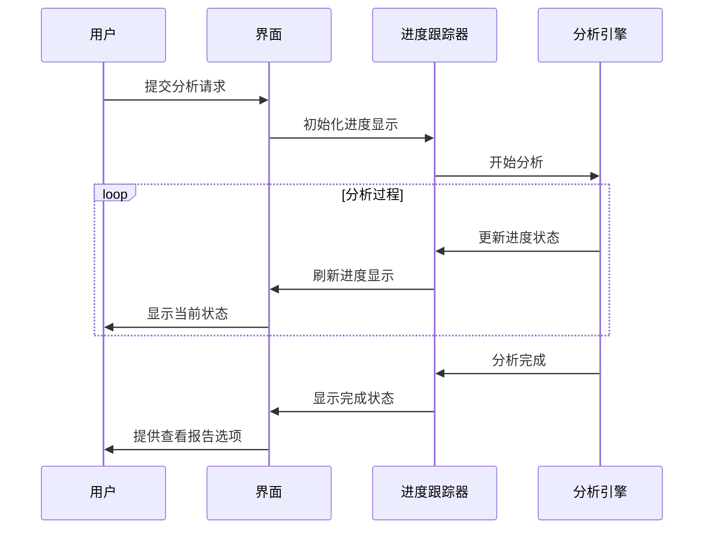
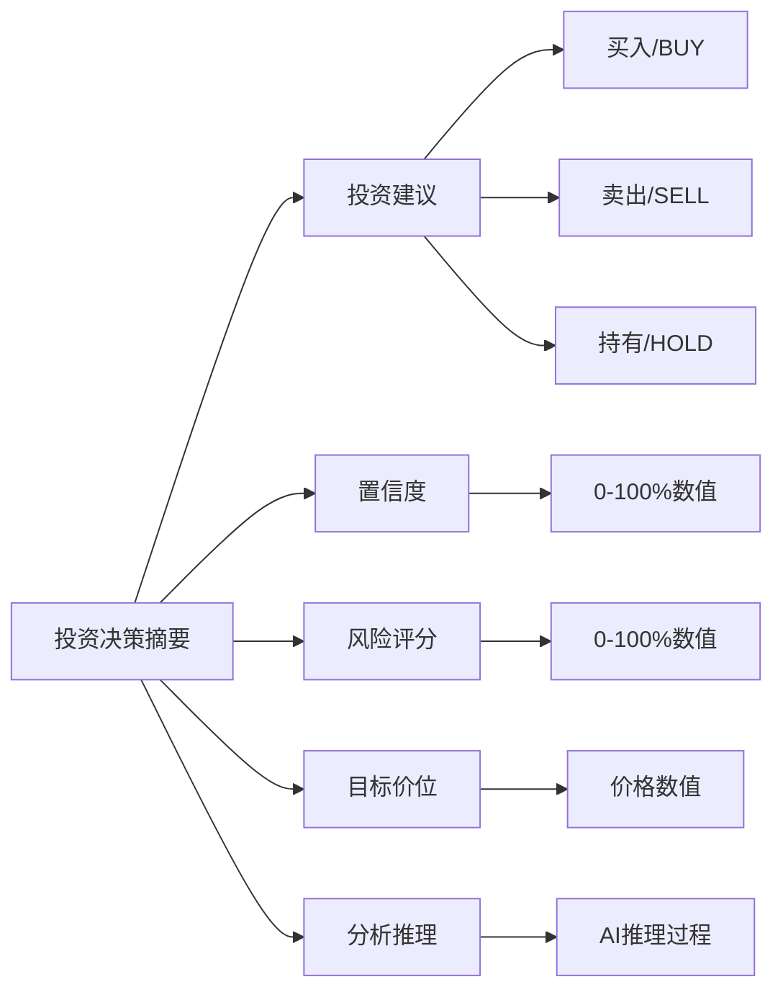
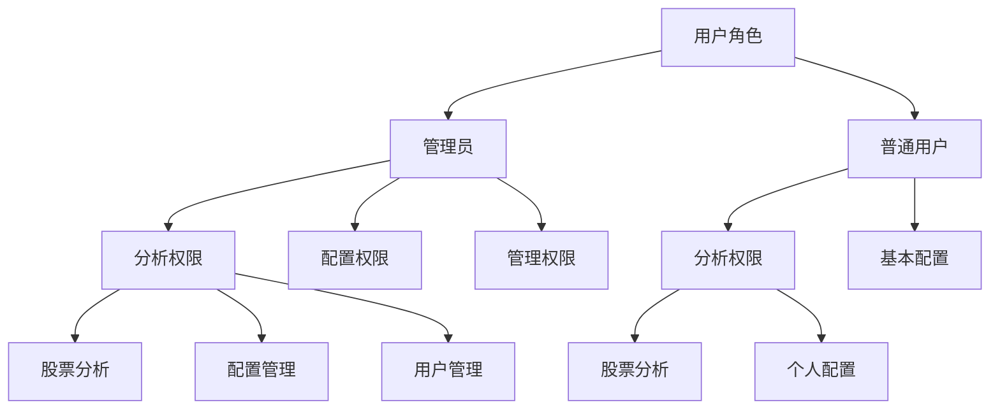
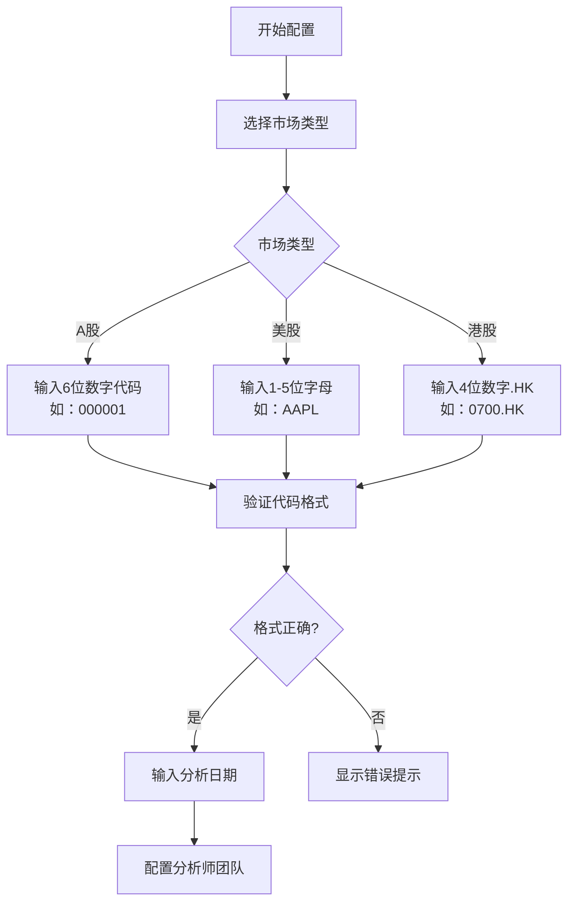
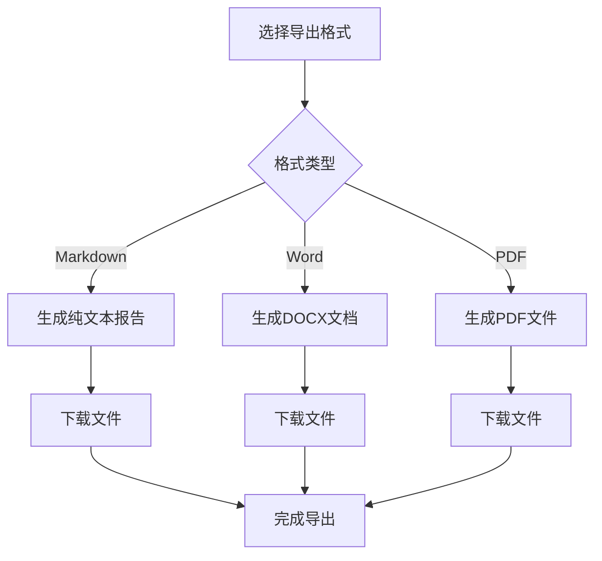
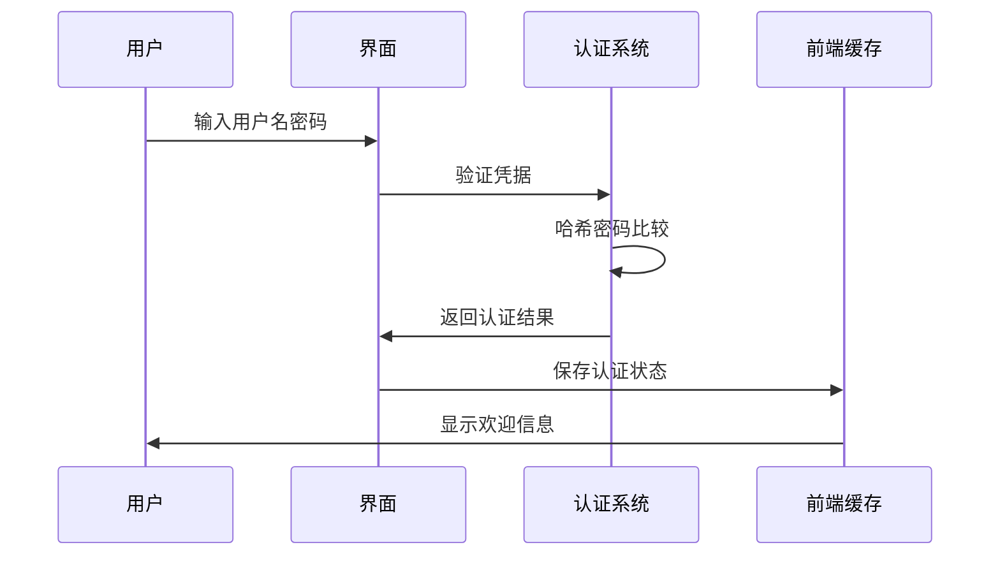

# Web界面使用指南

<cite>
**本文档中引用的文件**
- [web/app.py](file://web/app.py)
- [web/run_web.py](file://web/run_web.py)
- [web/README.md](file://web/README.md)
- [web/components/sidebar.py](file://web/components/sidebar.py)
- [web/components/analysis_form.py](file://web/components/analysis_form.py)
- [web/components/results_display.py](file://web/components/results_display.py)
- [web/components/async_progress_display.py](file://web/components/async_progress_display.py)
- [web/components/user_activity_dashboard.py](file://web/components/user_activity_dashboard.py)
- [web/utils/analysis_runner.py](file://web/utils/analysis_runner.py)
- [web/utils/auth_manager.py](file://web/utils/auth_manager.py)
- [web/modules/database_management.py](file://web/modules/database_management.py)
- [web/utils/report_exporter.py](file://web/utils/report_exporter.py)
</cite>

## 目录
1. [简介](#简介)
2. [界面布局与导航](#界面布局与导航)
3. [核心功能模块](#核心功能模块)
4. [分步操作指南](#分步操作指南)
5. [分析结果解读](#分析结果解读)
6. [高级功能](#高级功能)
7. [用户管理与权限](#用户管理与权限)
8. [故障排除](#故障排除)
9. [最佳实践](#最佳实践)

## 简介

TradingAgents-CN Web界面是一个基于Streamlit构建的专业股票分析平台，提供直观的用户界面和强大的分析功能。该界面支持多种LLM提供商，包含完整的AI分析师团队协作系统，能够为用户提供全面的股票投资分析报告。

### 主要特性
- **现代化UI设计**：简洁直观的界面布局，响应式设计适配移动设备
- **多LLM提供商支持**：阿里百炼、Google AI、OpenAI等多种AI模型
- **智能分析师团队**：市场技术、基本面、新闻、社交媒体分析师协同工作
- **实时进度跟踪**：详细的分析进度显示和状态更新
- **丰富结果展示**：完整的分析报告和可视化图表
- **用户权限管理**：基于角色的访问控制和权限管理

## 界面布局与导航

### 整体布局结构



**图表来源**
- [web/app.py](file://web/app.py#L57-L114)
- [web/components/sidebar.py](file://web/components/sidebar.py#L1-L50)

### 侧边栏配置区域

侧边栏位于界面左侧，宽度固定为320px，包含以下主要配置模块：

#### 1. API密钥状态显示
- **绿色✅**：API密钥已正确配置
- **红色❌**：API密钥未配置或无效
- 支持多种LLM提供商的密钥状态检查

#### 2. LLM模型配置
- **提供商选择**：阿里百炼、Google AI、OpenAI等
- **模型版本**：根据提供商显示相应的模型选项
- **快速选择**：常用模型的一键选择功能

#### 3. 高级设置选项
- **记忆功能**：启用AI学习和记忆分析历史
- **调试模式**：显示详细的分析过程信息
- **输出长度**：控制AI回复的详细程度

**章节来源**
- [web/components/sidebar.py](file://web/components/sidebar.py#L150-L300)

### 主内容区布局

主内容区采用卡片式设计，包含以下核心区域：

#### 分析配置区域
- **股票代码输入**：支持A股、美股、港股三种市场
- **分析日期选择**：指定分析的时间基准
- **分析师团队选择**：灵活配置参与分析的AI分析师
- **研究深度设置**：控制分析的详细程度

#### 实时进度跟踪
- **进度条显示**：直观的分析进度指示
- **状态信息**：当前分析步骤和状态说明
- **时间统计**：已用时间和预计剩余时间
- **刷新控制**：手动刷新和自动刷新选项

#### 结果展示区域
- **投资决策摘要**：清晰的投资建议和关键指标
- **详细分析报告**：多维度的分析内容和图表
- **风险提示信息**：重要的风险警告和免责声明
- **导出功能**：支持多种格式的报告导出

**章节来源**
- [web/components/analysis_form.py](file://web/components/analysis_form.py#L20-L100)
- [web/components/async_progress_display.py](file://web/components/async_progress_display.py#L20-L80)

## 核心功能模块

### 分析配置表单

分析配置表单是用户与系统交互的主要入口，提供完整的分析参数设置功能。

#### 股票代码输入配置



**图表来源**
- [web/components/analysis_form.py](file://web/components/analysis_form.py#L50-L120)

#### 分析师团队配置

系统提供四种专业分析师的组合配置：

| 分析师类型 | 功能描述 | 适用场景 |
|------------|----------|----------|
| 市场分析师 | 技术指标、价格趋势分析 | 技术派投资者 |
| 基本面分析师 | 财务数据、估值分析 | 价值投资者 |
| 新闻分析师 | 新闻事件、市场动态分析 | 事件驱动型投资者 |
| 社交媒体分析师 | 投资者情绪、讨论热度 | 情绪分析专家 |

**章节来源**
- [web/components/analysis_form.py](file://web/components/analysis_form.py#L150-L250)

### 实时进度跟踪

进度跟踪系统提供详细的分析过程可视化，帮助用户了解分析状态。

#### 进度显示组件



**图表来源**
- [web/components/async_progress_display.py](file://web/components/async_progress_display.py#L50-L150)

#### 进度状态信息

- **进度百分比**：直观的完成度显示
- **当前步骤**：正在执行的具体分析步骤
- **已用时间**：分析过程的实际耗时
- **预计剩余时间**：基于历史数据的剩余时间估算

**章节来源**
- [web/components/async_progress_display.py](file://web/components/async_progress_display.py#L200-L300)

### 结果展示区域

分析结果以卡片式布局展示，支持标签页切换和详细内容查看。

#### 投资决策摘要



**图表来源**
- [web/components/results_display.py](file://web/components/results_display.py#L100-L200)

#### 详细分析报告

报告内容分为多个专业模块：

| 模块名称 | 内容描述 | 分析重点 |
|----------|----------|----------|
| 市场技术分析 | 技术指标、价格走势、支撑阻力位 | 技术面分析 |
| 基本面分析 | 财务健康度、估值水平、盈利能力 | 价值分析 |
| 市场情绪分析 | 投资者情绪、社交媒体热度 | 情绪指标 |
| 新闻事件分析 | 相关新闻、事件影响评估 | 事件驱动 |
| 风险评估 | 多维度风险分析、风险等级 | 风险控制 |
| 投资建议 | 具体投资策略、仓位管理 | 实际建议 |

**章节来源**
- [web/components/results_display.py](file://web/components/results_display.py#L300-L500)

### 用户管理面板

用户管理面板提供完整的用户权限和活动管理功能。

#### 权限管理结构



**图表来源**
- [web/utils/auth_manager.py](file://web/utils/auth_manager.py#L50-L150)

**章节来源**
- [web/components/user_activity_dashboard.py](file://web/components/user_activity_dashboard.py#L50-L150)

## 分步操作指南

### 第一步：环境准备与配置

#### 1. API密钥配置
1. 在左侧侧边栏找到"API密钥状态"区域
2. 确认各提供商的API密钥状态（绿色✅表示已配置）
3. 如未配置，请参考[API配置指南](#api配置说明)

#### 2. LLM模型选择
1. 在"AI模型配置"区域选择合适的LLM提供商
2. 根据需求选择相应的模型版本
3. 推荐配置：
   - **快速分析**：阿里百炼 qwen-turbo
   - **平衡分析**：阿里百炼 qwen-plus-latest
   - **深度分析**：阿里百炼 qwen-max

### 第二步：股票分析配置

#### 1. 输入股票代码


**图表来源**
- [web/components/analysis_form.py](file://web/components/analysis_form.py#L50-L150)

#### 2. 配置分析师团队
1. **市场分析师**：专注于技术面分析
2. **基本面分析师**：分析财务数据和公司基本面
3. **新闻分析师**：关注相关新闻事件
4. **社交媒体分析师**：分析投资者情绪（非A股市场）

#### 3. 设置研究深度
- **1级**：快速分析，适合初步筛选
- **3级**：标准分析，平衡速度和质量
- **5级**：全面分析，最详细的分析结果

### 第三步：开始分析

#### 1. 提交分析请求
1. 确认所有配置参数正确
2. 点击"🚀 开始分析"按钮
3. 系统将显示实时进度跟踪

#### 2. 监控分析进度
- **进度条**：显示分析完成百分比
- **状态信息**：当前执行的分析步骤
- **时间统计**：已用时间和预计剩余时间
- **刷新控制**：可手动刷新或启用自动刷新

### 第四步：查看分析结果

#### 1. 结果摘要
1. **投资建议**：明确的买入/卖出/持有建议
2. **关键指标**：置信度、风险评分、目标价位
3. **分析推理**：AI的决策依据和推理过程

#### 2. 详细报告
1. 点击"📋 详细分析报告"标签页
2. 查看各个专业模块的分析内容
3. 使用标签页切换不同分析维度

#### 3. 导出报告
1. 点击"📊 导出报告"按钮
2. 选择导出格式（Markdown、Word、PDF）
3. 下载完整的分析报告

**章节来源**
- [web/components/analysis_form.py](file://web/components/analysis_form.py#L300-L364)
- [web/components/results_display.py](file://web/components/results_display.py#L50-L150)

## 分析结果解读

### 投资决策摘要解读

#### 1. 投资建议
- **BUY（买入）**：AI认为当前是买入时机
- **SELL（卖出）**：AI建议卖出或减少持仓
- **HOLD（持有）**：维持当前持仓不变

#### 2. 置信度指标
- **数值范围**：0-1（0%-100%）
- **高置信度**：>0.7，AI对建议很有信心
- **中等置信度**：0.4-0.7，建议谨慎考虑
- **低置信度**：<0.4，建议进一步研究

#### 3. 风险评分
- **数值范围**：0-1（0%-100%）
- **低风险**：<0.3，投资风险较小
- **中等风险**：0.3-0.7，需要关注风险因素
- **高风险**：>0.7，存在较大投资风险

#### 4. 目标价位
- **数值含义**：AI预测的未来价格目标
- **货币单位**：根据股票市场确定（A股为人民币，美股为美元）
- **参考价值**：辅助判断买卖时机的重要指标

### 详细分析报告解读

#### 市场技术分析
- **技术指标**：MACD、RSI、布林带等
- **价格走势**：短期和长期趋势分析
- **支撑阻力位**：关键的价格支撑和阻力水平

#### 基本面分析
- **财务健康度**：资产负债率、流动比率等
- **盈利能力**：ROE、净利润增长率等
- **估值水平**：市盈率、市净率等

#### 市场情绪分析
- **投资者情绪**：整体市场情绪倾向
- **社交媒体热度**：相关话题的讨论活跃度
- **新闻影响**：近期新闻对股价的潜在影响

#### 风险评估
- **市场风险**：宏观经济和市场环境风险
- **公司风险**：公司经营和财务风险
- **流动性风险**：股票交易的流动性状况

### 团队决策报告解读

#### 研究团队决策
- **多头研究员**：看涨观点和理由
- **空头研究员**：看跌观点和理由
- **研究经理**：综合评估后的最终建议

#### 风险管理团队决策
- **激进分析师**：高风险高回报的观点
- **保守分析师**：稳健投资的建议
- **中性分析师**：客观中立的评估
- **投资组合经理**：最终的风险管理决策

**章节来源**
- [web/components/results_display.py](file://web/components/results_display.py#L200-L400)

## 高级功能

### 历史记录查看

#### 分析结果历史管理
1. **访问历史记录**：通过侧边栏导航进入历史记录页面
2. **搜索过滤**：
   - **关键词搜索**：搜索股票代码或摘要内容
   - **时间范围**：选择特定时间段的分析结果
   - **分析师类型**：筛选特定分析师的分析
   - **收藏状态**：查看收藏的分析结果

#### 结果列表功能
- **收藏管理**：将重要分析添加到收藏夹
- **标签系统**：为分析结果添加自定义标签
- **比较功能**：同时查看多个分析结果的对比
- **详情查看**：展开查看完整的分析内容

#### 数据统计分析
- **成功率统计**：显示分析的成功率和失败率
- **股票分析数量**：统计分析过的股票种类
- **时间趋势分析**：分析历史数据的趋势变化

**章节来源**
- [web/components/analysis_results.py](file://web/components/analysis_results.py#L330-L450)

### 报告导出功能

#### 支持的导出格式
- **Markdown**：纯文本格式，便于编辑和分享
- **Word (DOCX)**：富文本格式，适合正式文档
- **PDF**：专业格式，适合打印和存档

#### 导出流程


**图表来源**
- [web/utils/report_exporter.py](file://web/utils/report_exporter.py#L100-L200)

#### 导出内容
- **完整分析报告**：包含所有分析模块的内容
- **投资决策摘要**：关键的投资建议和指标
- **详细分析内容**：各个专业模块的深入分析
- **风险提示信息**：重要的风险警告和免责声明

**章节来源**
- [web/utils/report_exporter.py](file://web/utils/report_exporter.py#L300-L500)

### 数据库管理

#### MongoDB + Redis 缓存管理
1. **连接状态监控**：实时显示MongoDB和Redis的连接状态
2. **数据统计**：显示集合中的记录数量和缓存统计
3. **性能优化**：自动清理过期数据，优化查询性能
4. **配置管理**：管理数据库连接配置和缓存策略

#### 缓存架构
- **Redis L1缓存**：内存缓存，毫秒级访问速度
- **MongoDB L2缓存**：持久化存储，秒级访问速度
- **API L3数据源**：外部数据接口，分钟级访问速度

**章节来源**
- [web/modules/database_management.py](file://web/modules/database_management.py#L50-L150)

### 用户活动监控

#### 活动记录功能
- **用户行为追踪**：记录用户的操作行为和分析活动
- **权限审计**：监控权限使用情况和安全事件
- **性能分析**：分析用户使用模式和系统性能
- **报表生成**：生成详细的用户活动统计报表

#### 管理员功能
- **用户管理**：添加、删除和修改用户账户
- **权限分配**：配置用户的角色和权限
- **活动监控**：实时监控系统使用情况
- **数据备份**：定期备份用户数据和分析结果

**章节来源**
- [web/components/user_activity_dashboard.py](file://web/components/user_activity_dashboard.py#L100-L200)

## 用户管理与权限

### 认证系统

#### 登录流程


**图表来源**
- [web/utils/auth_manager.py](file://web/utils/auth_manager.py#L100-L200)

#### 用户角色与权限

| 角色 | 权限范围 | 功能描述 |
|------|----------|----------|
| **管理员** | 完全权限 | 可以访问所有功能，包括用户管理、系统配置 |
| **高级用户** | 分析+配置 | 可以进行分析和配置管理 |
| **普通用户** | 仅分析权限 | 只能进行股票分析和查看结果 |

#### 权限检查机制
- **前端权限验证**：界面元素的权限控制
- **后端权限验证**：API请求的权限检查
- **会话管理**：自动的会话超时和安全退出
- **活动记录**：记录权限使用和安全事件

**章节来源**
- [web/utils/auth_manager.py](file://web/utils/auth_manager.py#L200-L300)

### 会话管理

#### 自动登录状态管理
- **前端缓存**：10分钟无操作自动失效
- **会话超时**：服务器端的会话超时控制
- **自动续期**：用户活动时自动延长会话时间
- **安全退出**：主动登出和自动登出功能

#### 多设备同步
- **跨设备登录**：支持多个设备同时登录
- **状态同步**：不同设备间的状态同步
- **冲突解决**：处理多设备间的权限冲突

**章节来源**
- [web/utils/auth_manager.py](file://web/utils/auth_manager.py#L300-L384)

## 故障排除

### 常见问题与解决方案

#### 1. 页面无法加载
**症状**：浏览器显示"无法访问"或"连接超时"
**解决方案**：
1. 检查Python环境版本（需要Python 3.10+）
2. 确认Streamlit已正确安装
3. 检查端口8501是否被占用
4. 清理浏览器缓存或尝试其他浏览器

#### 2. API密钥问题
**症状**：API密钥状态显示红色❌
**解决方案**：
1. 检查.env文件是否存在
2. 确认API密钥格式正确
3. 验证API密钥的有效性和余额
4. 重新配置正确的API密钥

#### 3. 分析失败
**症状**：分析进度卡住或显示失败
**解决方案**：
1. 检查网络连接状态
2. 验证股票代码格式正确
3. 查看浏览器控制台错误信息
4. 重启Web应用服务

#### 4. 结果显示异常
**症状**：分析结果无法正常显示
**解决方案**：
1. 刷新页面重新加载
2. 清除浏览器缓存
3. 检查模型配置是否正确
4. 验证MongoDB和Redis连接状态

### 调试模式

#### 启用详细日志
```bash
# 启用Streamlit调试模式
streamlit run web/app.py --logger.level=debug

# 启用应用调试模式
# 在左侧边栏勾选"调试模式"
```

#### 日志查看
- **浏览器控制台**：查看JavaScript错误和网络请求
- **应用日志**：查看Python应用的详细日志信息
- **系统日志**：查看操作系统级别的日志

### 性能优化

#### 缓存优化
- **Redis缓存**：利用内存缓存提高访问速度
- **MongoDB索引**：优化数据库查询性能
- **前端缓存**：减少重复的网络请求

#### 资源优化
- **图片压缩**：优化界面图片的加载速度
- **代码分割**：按需加载JavaScript和CSS文件
- **懒加载**：延迟加载非关键内容

**章节来源**
- [web/run_web.py](file://web/run_web.py#L100-L200)

## 最佳实践

### 分析配置建议

#### 1. 模型选择策略
- **快速决策**：使用阿里百炼 qwen-turbo
- **平衡分析**：使用阿里百炼 qwen-plus-latest
- **深度研究**：使用阿里百炼 qwen-max
- **国际股票**：考虑Google AI或OpenAI模型

#### 2. 分析师团队配置
- **新手投资者**：市场分析师 + 基本面分析师
- **经验投资者**：加入新闻分析师和社交媒体分析师
- **专业投资者**：完整分析师团队配置

#### 3. 研究深度设置
- **日常监控**：研究深度2-3级
- **投资决策**：研究深度4级
- **深度研究**：研究深度5级

### 数据安全建议

#### 1. API密钥管理
- **定期更换**：定期更新API密钥
- **权限最小化**：使用最小权限原则
- **安全存储**：不要在代码中硬编码密钥
- **监控使用**：定期检查API使用情况

#### 2. 用户数据保护
- **会话安全**：设置合理的会话超时时间
- **数据加密**：敏感数据的加密存储
- **访问控制**：严格的权限管理
- **审计日志**：完整的操作审计记录

### 性能优化建议

#### 1. 网络优化
- **CDN加速**：使用内容分发网络
- **压缩传输**：启用gzip压缩
- **缓存策略**：合理设置缓存头

#### 2. 数据库优化
- **索引优化**：为常用查询创建索引
- **分页查询**：大数据量的分页处理
- **连接池**：使用数据库连接池
- **定期维护**：定期进行数据库维护

#### 3. 前端优化
- **代码分割**：按需加载JavaScript
- **图片优化**：使用适当的图片格式和尺寸
- **字体优化**：使用Web字体的优化策略
- **懒加载**：延迟加载非关键内容

### 使用技巧

#### 1. 快速分析技巧
- **收藏常用配置**：保存常用的分析配置
- **批量分析**：连续分析多个股票
- **结果比较**：使用比较功能分析不同股票
- **标签管理**：使用标签组织分析结果

#### 2. 深度分析技巧
- **多维度分析**：结合不同分析师的观点
- **历史对比**：与历史分析结果进行对比
- **持续跟踪**：定期跟踪重要股票的分析
- **风险评估**：重点关注风险评估结果

#### 3. 团队协作技巧
- **权限分配**：合理分配用户权限
- **知识共享**：分享有价值的分析结果
- **标准化流程**：建立标准化的分析流程
- **定期培训**：定期进行系统使用培训

通过遵循这些最佳实践，您可以充分利用TradingAgents-CN Web界面的强大功能，获得高质量的股票分析结果，并确保系统的安全稳定运行。