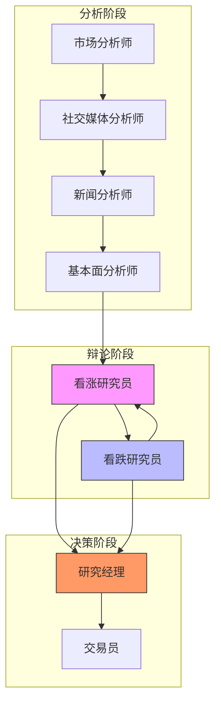
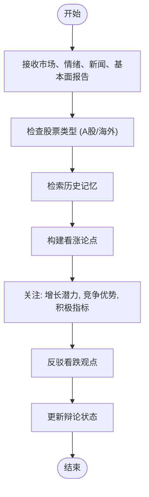
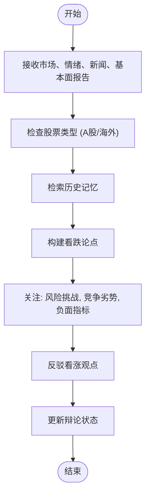
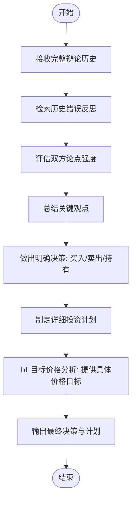

# 研究团队

<cite>
**本文档中引用的文件**  
- [bull_researcher.py](file://tradingagents/agents/researchers/bull_researcher.py)
- [bear_researcher.py](file://tradingagents/agents/researchers/bear_researcher.py)
- [research_manager.py](file://tradingagents/agents/managers/research_manager.py)
- [setup.py](file://tradingagents/graph/setup.py)
- [conditional_logic.py](file://tradingagents/graph/conditional_logic.py)
- [agent_states.py](file://tradingagents/agents/utils/agent_states.py)
</cite>

## 目录
1. [引言](#引言)
2. [核心组件](#核心组件)
3. [架构概览](#架构概览)
4. [详细组件分析](#详细组件分析)
5. [依赖关系分析](#依赖关系分析)

## 引言
本文档全面阐述了牛熊研究员与研究经理的协同工作机制。该机制采用“红队-蓝队”辩论式研究流程，通过看涨研究员（bull_researcher）和看跌研究员（bear_researcher）基于对立假设进行独立分析，生成多视角投资观点。研究经理（research_manager）负责整合双方输出，评估证据强度，并做出最终研究结论。文档详细说明了智能体间的消息传递机制、状态同步方式以及在LangGraph中的节点调用顺序，确保开发者理解该团队在整体决策链中的作用。

## 核心组件

本系统的核心组件包括看涨研究员、看跌研究员和研究经理。看涨研究员负责构建支持投资的强有力论证，强调增长潜力、竞争优势和积极指标；看跌研究员则专注于揭示风险、挑战和负面因素，反驳看涨观点。研究经理作为决策者，批判性评估双方论点，整合信息并生成最终的投资建议与详细计划。

**Section sources**
- [bull_researcher.py](file://tradingagents/agents/researchers/bull_researcher.py#L5-L91)
- [bear_researcher.py](file://tradingagents/agents/researchers/bear_researcher.py#L5-L83)
- [research_manager.py](file://tradingagents/agents/managers/research_manager.py#L4-L80)

## 架构概览

该研究团队的架构基于LangGraph构建，形成一个有序的决策流程。首先，多个分析师节点（市场、情绪、新闻、基本面）依次执行，生成各自的报告。随后，流程进入“红队-蓝队”辩论阶段，由看涨研究员和看跌研究员交替进行多轮论证。最后，研究经理节点介入，总结辩论内容，做出明确的投资决策，并为交易员制定详细的投资计划。



**Diagram sources**
- [setup.py](file://tradingagents/graph/setup.py#L14-L248)

## 详细组件分析

### 看涨研究员分析
看涨研究员节点接收市场、情绪、新闻和基本面报告，构建支持投资的论点。其核心任务是强调公司的增长潜力、竞争优势和积极的市场指标，并直接回应和反驳看跌研究员的观点。该节点会检索历史记忆以吸取过去的经验教训，从而完善其论证。



**Diagram sources**
- [bull_researcher.py](file://tradingagents/agents/researchers/bull_researcher.py#L5-L91)

**Section sources**
- [bull_researcher.py](file://tradingagents/agents/researchers/bull_researcher.py#L5-L91)

### 看跌研究员分析
看跌研究员节点与看涨研究员相对，其任务是论证不投资的理由。它会突出风险、挑战、竞争劣势和负面指标，并用具体数据和推理来批判性地分析和反驳看涨论点。同样，该节点也会利用历史记忆来避免过去的错误。



**Diagram sources**
- [bear_researcher.py](file://tradingagents/agents/researchers/bear_researcher.py#L5-L83)

**Section sources**
- [bear_researcher.py](file://tradingagents/agents/researchers/bear_researcher.py#L5-L83)

### 研究经理分析
研究经理节点是整个研究流程的决策核心。它接收看涨和看跌研究员的完整辩论历史，进行批判性评估。其决策逻辑不仅总结双方观点，还必须基于最强有力的论点做出明确的“买入”、“卖出”或“持有”的承诺，避免无意义的中立。决策输出包含具体的投资建议、理由、战略行动和关键的📊目标价格分析。



**Diagram sources**
- [research_manager.py](file://tradingagents/agents/managers/research_manager.py#L4-L80)

**Section sources**
- [research_manager.py](file://tradingagents/agents/managers/research_manager.py#L4-L80)

## 依赖关系分析

该研究团队的各个组件通过LangGraph的状态机（AgentState）紧密耦合。状态机中的`investment_debate_state`字段是核心，它包含了`bull_history`、`bear_history`和`history`，用于在看涨和看跌研究员之间传递和累积信息。研究经理节点依赖于这个累积的辩论历史和所有基础报告（market_report, sentiment_report等）来做出最终判断。

节点间的调用顺序由`conditional_logic.py`中的条件函数严格控制。例如，`should_continue_debate`函数根据辩论轮次计数（count）和最后发言者来决定流程是继续在牛熊之间循环，还是将控制权移交给研究经理。

```mermaid
erDiagram
AgentState ||--o{ InvestDebateState : 包含
AgentState ||--|| MarketReport : 包含
AgentState ||--|| SentimentReport : 包含
AgentState ||--|| NewsReport : 包含
AgentState ||--|| FundamentalsReport : 包含
class AgentState {
+string company_of_interest
+string trade_date
+InvestDebateState investment_debate_state
+string market_report
+string sentiment_report
+string news_report
+string fundamentals_report
}
class InvestDebateState {
+string bull_history
+string bear_history
+string history
+string current_response
+int count
}
class MarketReport {
+string content
}
class SentimentReport {
+string content
}
class NewsReport {
+string content
}
class FundamentalsReport {
+string content
}
```

**Diagram sources**
- [agent_states.py](file://tradingagents/agents/utils/agent_states.py#L10-L75)
- [setup.py](file://tradingagents/graph/setup.py#L14-L248)
- [conditional_logic.py](file://tradingagents/graph/conditional_logic.py#L45-L54)

**Section sources**
- [agent_states.py](file://tradingagents/agents/utils/agent_states.py#L10-L75)
- [setup.py](file://tradingagents/graph/setup.py#L14-L248)
- [conditional_logic.py](file://tradingagents/graph/conditional_logic.py#L45-L54)