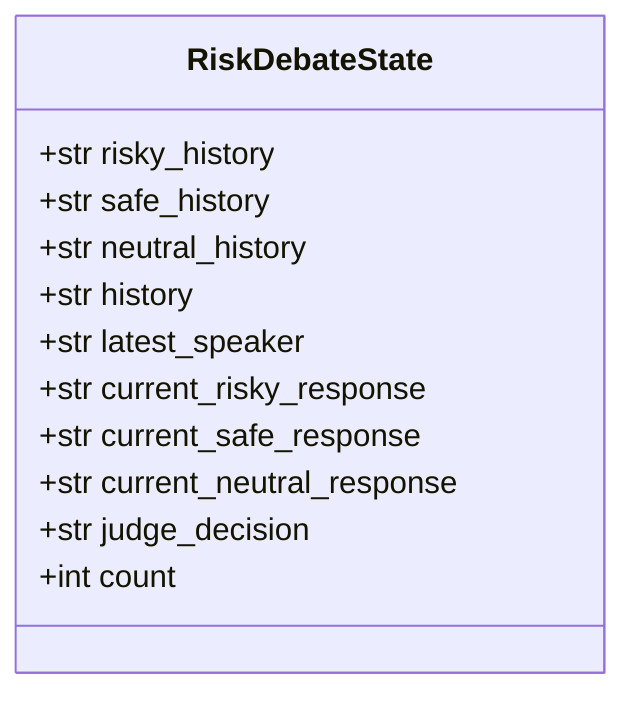
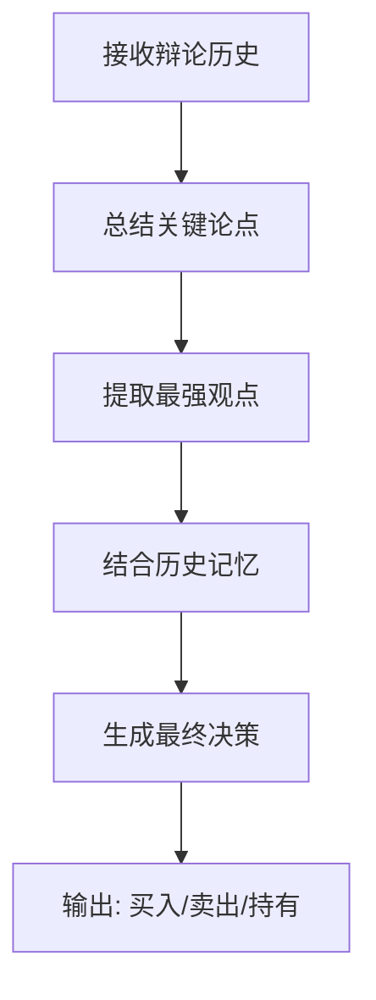

# 风险管理团队

<cite>
**本文档引用的文件**
- [risk_manager.py](file://tradingagents/agents/managers/risk_manager.py)
- [aggresive_debator.py](file://tradingagents/agents/risk_mgmt/aggresive_debator.py)
- [conservative_debator.py](file://tradingagents/agents/risk_mgmt/conservative_debator.py)
- [neutral_debator.py](file://tradingagents/agents/risk_mgmt/neutral_debator.py)
- [agent_states.py](file://tradingagents/agents/utils/agent_states.py)
- [conditional_logic.py](file://tradingagents/graph/conditional_logic.py)
</cite>

## 目录
1. [引言](#引言)
2. [核心团队架构](#核心团队架构)
3. [风险状态模型](#风险状态模型)
4. [辩论流程与轮次控制](#辩论流程与轮次控制)
5. [三位辩论者的角色与策略](#三位辩论者的角色与策略)
6. [风险经理的综合决策机制](#风险经理的综合决策机制)
7. [高风险否决机制案例](#高风险否决机制案例)
8. [与主交易图的集成方式](#与主交易图的集成方式)
9. [结论](#结论)

## 引言
本文件旨在系统阐述风险管理团队的协作架构，该团队由三位具有不同风险偏好的辩论者（激进、保守、中立）和一位风险经理组成。团队通过结构化辩论评估投资提案，生成风险分析报告，并最终决定交易是否执行。该机制作为系统的“安全阀”，确保在自动化交易决策中引入多层次的风险审视，防止因单一视角导致的重大误判。

## 核心团队架构
风险管理团队采用“三辩一审”的协作模式：
- **三位辩论者**：分别代表激进（高风险高回报）、保守（低风险稳增长）和中立（平衡视角）的风险偏好，从不同角度对投资提案进行批判性评估。
- **风险经理**：作为“裁判”或“主席”，负责主持辩论、整合三方意见、参考历史教训，并做出最终的买入、卖出或持有决策。

该架构通过模拟人类投资委员会的讨论过程，实现了对投资决策的深度风险评估。

**Section sources**
- [risk_manager.py](file://tradingagents/agents/managers/risk_manager.py#L4-L71)
- [aggresive_debator.py](file://tradingagents/agents/risk_mgmt/aggresive_debator.py#L4-L54)
- [conservative_debator.py](file://tradingagents/agents/risk_mgmt/conservative_debator.py#L5-L57)
- [neutral_debator.py](file://tradingagents/agents/risk_mgmt/neutral_debator.py#L4-L54)

## 风险状态模型
`RiskDebateState` 模型是整个辩论过程的核心数据结构，用于追踪和管理辩论的动态状态。



**Diagram sources**
- [agent_states.py](file://tradingagents/agents/utils/agent_states.py#L24-L46)

**Section sources**
- [agent_states.py](file://tradingagents/agents/utils/agent_states.py#L24-L46)

## 辩论流程与轮次控制
辩论流程由图结构中的条件逻辑控制器驱动，确保辩论有序进行。

```mermaid
sequenceDiagram
participant R as Risky Analyst
participant S as Safe Analyst
participant N as Neutral Analyst
participant RM as Risk Manager
participant C as ConditionalLogic
C->>R : 启动辩论 (latest_speaker = None)
R->>C : 发言完毕 (latest_speaker = "Risky")
C->>S : 下一发言者
S->>C : 发言完毕 (latest_speaker = "Safe")
C->>N : 下一发言者
N->>C : 发言完毕 (latest_speaker = "Neutral")
C->>R : 下一发言者
... 循环 ...
C->>RM : count >= max_rounds, 转交风险经理
RM->>RM : 生成最终决策
```

**Diagram sources**
- [conditional_logic.py](file://tradingagents/graph/conditional_logic.py#L45-L67)
- [risk_manager.py](file://tradingagents/agents/managers/risk_manager.py#L4-L71)

**Section sources**
- [conditional_logic.py](file://tradingagents/graph/conditional_logic.py#L45-L67)

## 三位辩论者的角色与策略
### 激进辩论者 (Aggressive Debator)
- **角色**：倡导高回报、高风险的投资机会。
- **策略**：强调潜在的上涨空间、增长潜力和竞争优势，积极反驳保守和中立观点，指出谨慎态度可能错失的关键机会。
- **输入**：市场研究报告、情绪报告、新闻报告、基本面报告、交易员投资计划。

### 保守辩论者 (Conservative Debator)
- **角色**：保护资产、最小化波动性，确保稳定增长。
- **策略**：批判性审查高风险要素，指出决策可能带来的潜在损失和市场波动，强调可持续性和风险缓解。
- **输入**：同上。

### 中立辩论者 (Neutral Debator)
- **角色**：提供平衡的视角，权衡收益与风险。
- **策略**：挑战激进和保守观点，指出其可能过于乐观或过于谨慎的地方，倡导温和、可持续的策略。
- **输入**：同上。

**Section sources**
- [aggresive_debator.py](file://tradingagents/agents/risk_mgmt/aggresive_debator.py#L4-L54)
- [conservative_debator.py](file://tradingagents/agents/risk_mgmt/conservative_debator.py#L5-L57)
- [neutral_debator.py](file://tradingagents/agents/risk_mgmt/neutral_debator.py#L4-L54)

## 风险经理的综合决策机制
风险经理节点在辩论结束后被激活，其决策机制如下：



风险经理的提示词（Prompt）设计了明确的决策指导原则：
1.  **总结关键论点**：从辩论历史中提取每位分析师的最强观点。
2.  **提供理由**：用辩论中的直接引用和反驳来支持最终建议。
3.  **完善交易员计划**：以交易员的原始计划为基础，根据辩论结果进行调整。
4.  **从过去的错误中学习**：检索并利用历史记忆中的经验教训，避免重复过去的误判。

最终，风险经理会生成一个包含明确建议和详细推理的决策报告。

**Diagram sources**
- [risk_manager.py](file://tradingagents/agents/managers/risk_manager.py#L4-L71)

**Section sources**
- [risk_manager.py](file://tradingagents/agents/managers/risk_manager.py#L4-L71)

## 高风险否决机制案例
假设交易员计划投资一家处于高波动性行业的初创公司。
- **激进辩论者**：强调其颠覆性技术和巨大的市场潜力，认为当前估值被低估。
- **保守辩论者**：指出其现金流为负、市场竞争激烈，且宏观经济环境不利，可能导致资金链断裂。
- **中立辩论者**：认为技术有前景但商业化路径不清晰，建议小规模投资或等待更多数据。

当辩论历史被提交给风险经理时，风险经理会发现保守分析师提出的“资金链断裂”风险是致命的，且历史记忆中可能有类似公司失败的案例。根据决策原则，风险经理将综合这些信息，生成“**卖出**”或“**不投资**”的最终决策，从而否决了原始的高风险提案。这体现了该团队作为“安全阀”的核心价值。

## 与主交易图的集成方式
风险管理团队是主交易图（Trading Graph）中的一个关键子图或节点序列。其集成方式如下：
1.  在交易流程中，当研究经理（Research Manager）完成初步分析后，流程会进入风险评估阶段。
2.  交易状态（AgentState）被传递给风险辩论子图。
3.  条件逻辑控制器（ConditionalLogic）根据 `risk_debate_state` 的 `count` 和 `latest_speaker` 字段，循环调用三位辩论者的节点，直到达到最大辩论轮次。
4.  当 `should_continue_risk_analysis` 返回 "Risk Judge" 时，流程跳转至风险经理节点。
5.  风险经理生成 `final_trade_decision` 并更新状态，该决策将作为最终输出，决定交易的执行与否。

**Section sources**
- [conditional_logic.py](file://tradingagents/graph/conditional_logic.py#L45-L67)
- [risk_manager.py](file://tradingagents/agents/managers/risk_manager.py#L4-L71)

## 结论
风险管理团队通过构建一个由激进、保守、中立三位辩论者和一位风险经理组成的协作架构，实现了对投资提案的深度、多维度风险评估。该机制利用 `RiskDebateState` 模型追踪辩论状态，通过条件逻辑精确控制辩论轮次，并由风险经理综合意见、参考历史教训做出最终决策。这一设计不仅量化了风险，更通过模拟辩论过程捕捉了复杂的风险动态，其在高风险场景下的否决机制有效充当了系统的“安全阀”，显著提升了交易系统的稳健性和可靠性。